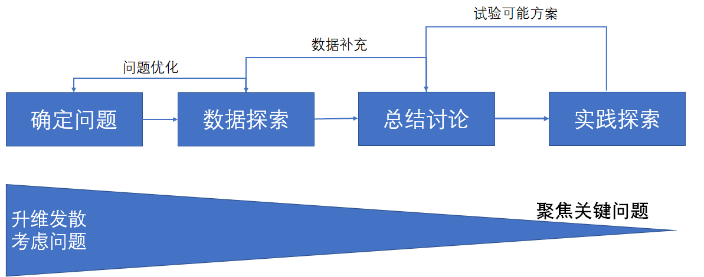
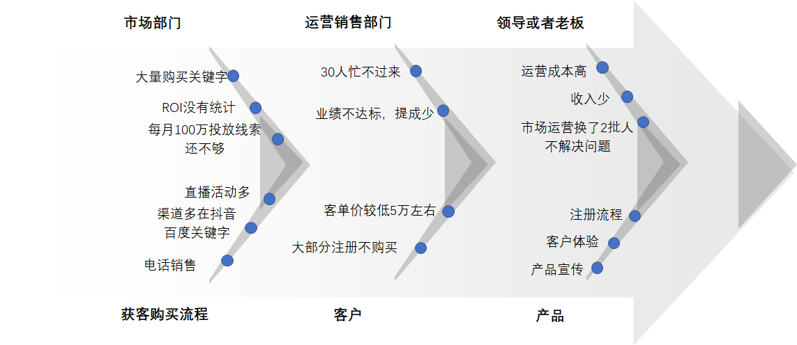
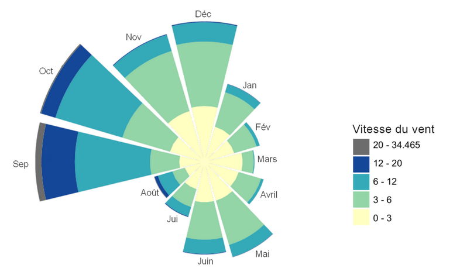

---
date: "2019-06-23"
---  
      
# 23 | 写好故事线：你能用好数字推翻众人的理解吗？
数据给你一双看透本质的眼睛，这里是《数据分析思维课》，我是郭炜。

经过前面分析问题的定义和数据的探索，现在到了最关键的一环——总结讨论。之前有个很火的美剧叫做CSI犯罪现场，其实我们整个数据分析的过程也和破案类似，我们需要在梳理各种证据和思路之后，用清晰的逻辑、严谨的语言去深入浅出地把整个事情讲清楚。

所以总结讨论这一步非常关键，我们既要把前面所有的问题和收集到的数据串联起来，有时候还得重新进行数据补充和问题优化。如果做得好，这一步可以让后续数据分析实践的工作事半功倍，但这就需要你把这份报告做得既要有高度还要亲民。

## 回顾之前的发现

我们进一步来看具体的操作。首先在规划故事线之前，你要回顾之前各种数据发现。在前期广泛的思考是非常重要的，但是到了后期你需要把思维聚焦，必须对面临的问题形成清晰的判断，特别是对关键问题的关键变量要有明确的定义。

例如在我们之前课程的例子中，针对老板提出获客成本高的问题，经过访谈和数据采集，在前期规划的6个方向当中，我们发现上图下半部分的三个因素是导致公司成本高的主要原因。因此，我们将前期发散考虑的问题收敛到获客的购买流程、客户意愿度以及产品设计方面，这就是一次问题的收敛。

<!-- [[[read_end]]] -->

在经过数据采集后，我们已经获得了足够多的明细的数据。假设现在我们可以直接从数据得出的初步现象有这样的几点：

* 通过内部的数据分析，发现我们购买关键字的成本没有进行优化，没有打通关键字到购买转化率的数值问题。而经过数据统计，我们发现大量热门关键字虽然转化率很高，但是它们的价格高居不下，加上在其他转化率较低的关键字购买，造成了我们的市场投入过高。
* 根据同行产品的二手数据研究发现，从demo到注册的转化率应该在3\%左右，而我公司只达到了0.5\%，证明我们的demo体验的流程并不够好，也说明产品注册的转化和流程也不够好。
* 同时经过客户访谈和调查问卷发现，客户购买5万以上金额单的销售流程都比较长，这是通过电话销售无法购买高客单价产品。

这些是从数据里面看到的情况，如果你只是把这些数字直接摆到老板的面前，老板肯定会问“然后呢？”所以现在你要设计整个的故事线，你要多想几步：

* 我们把目标提升10\%，我们可以做哪些事情？
* 如果我们想获得100倍的成果，那我们应该怎么办？
* 我们这些分析背后是有哪些假设，在什么条件下我们的模式和假设是无效的。

多想了这几步之后，我们回到在前期数据探索方面的发现。从线索转化成本来讲，我们发现理论上可以加大部分关键词购买，貌似就可以解决这些问题。这个问题的假设条件是“**这些关键字价格不变**”，但其实随着关键字的大量购买，关键字的价格会被抬高。所以整体上来讲，我们不能轻易下结论给出建议去大量购买关键字。

根据业内的二手数据调研，我们发现当一个客户的用户生命周期价值大于等于2\~3倍的获客成本时，生意模型就可以持续下去。所以我们可以给每个线索设定一个成本上限，如果线索成本不超过10万元的时候我们继续进行投放，一旦超过10万元我们要去改变关键字和营销人员的成本。

如果问题只分析到这里，我们只做了提升10\%的事情，那我们如何能获得100倍的效果呢？

根据前面的分析可知，单价一定的情况下，我们的线索成本是不可能降到这么低的。所以我们就要提高整体的客单价，那么高客单价的线索获取还是通过线上获取就可以吗？这个时候其实可以**重新做一次未成单的目标客户访谈**。

这也就意味着我们要回到数据采集这一步。经过调研发现，由于没有线下销售和服务团队，对于这些高客单价客户我们无法成单。进一步分析这些客户的接触点，我们可以设计新的获客和产品定价体系，例如产品+服务进行区分销售、招聘有客户资源和行业知识的高级销售、参加线下专业行业讨论会、对客户推荐进行大力补贴等等。

“回顾”这一步是将前面问题、分析部分以及可能引出的结论，给出比较踏实的数据基础和逻辑基础，避免出现因果倒置、数据不准确或者是考虑维度不全面、思考高度不够等问题。同时，对于重点问题可以深入调研，有必要的时候可以回到数据采集这一步进行相关的数据补充。有了这些坚实的基础，我们可以进入下一步：设计故事线。

## 设计故事线

如果只是罗列事实，不能够通过平易近人的方式让大家理解你的观点，很可能会造成你正确的观点没有办法推广、坐失良机，可见设计故事线是多么重要。

你应该或多或少听说过孟德尔这个名字，虽然孟德尔如今在遗传统计学的研究非常著名，但世界对他数据分析报告的了解是在他去世几十年后了。如果你不想成为这个时代的孟德尔，你就要在设计故事线这里多下功夫。

**最成功的分析师就是那些会“用数据讲故事的分析师”，好的故事在呈现调查结果时往往会采用对方可以听懂的方式。**

之所以我把数据分析报告的最后内容编排这部分叫做“写故事线”，是因为我们要通过一个完整的故事把分析报告讲给那些没有参与这项数据研究的人（例如你的老板、其他部门的同事），同时还要给他们留下深刻的印象。

就像你现在依然会记住小时候听过的小红帽的故事，但是你可能很难记住当时背诵的朱子清这篇散文里都讲了什么。我们的目标是基于我们的数据讲一个好的故事，吸引到相关方的注意，唤起对方在情感和理智上的共鸣，从而让对方在我们分析报告汇报结束的一天、一周甚至一个月之后，他还可以简要地把我们数据分析主要内容重复给相关人士来听。这是我们想要达到的目标。

在这里我给你分享一个经典的故事三段论结构，也就是**情节（陈述） \- 起伏（惊喜） \- 结尾（结论）**，那些广泛传播的寓言故事也是受益于这个结构。在讲我们的数据分析时，也是要陈述我们发现的事实，中间要讲到一些我们发现但其他人还没有发现的知识，然后给出具体实施措施，最终快速给一个明确的结论，这样才能让整个分析报告掷地有声，传播较广。

其实我每节课的讲课的方式也是这样：先是一些基础知识的讲解，然后升华你的认知，最终快速给出结论，让你有获得感。对应到数据分析报告的呈现上，我给你一个大概的参考框架。

在**陈述部分**，我们可以由以下内容来进行陈述：

* 开场，用30秒陈述痛点和整体问题的背景；
* 针对问题本身的分析，也就是我们定义问题的部分；
* 结合内外部数据针对问题举例说明。

在**起伏部分**我们可以采取以下类似内容进行阐述：

* 阐述要提升10\%的话有哪些办法和选择，并给出不采取行动或不发生变化会怎样？
* 阐述更高倍数的提升办法和潜在选择是什么？
* 还有哪些你发现而别人没有发现的观点问题？能带来什么？

在**结论部分**：

* 用简要的话或者数据分析思维导图进行总结和升华；
* 结尾不要用谢谢，要用召唤型的语言或强有力的金句对整个分析报告进行收尾。

有了这个大的框架，我们就可以进行数据分析报告的书写了，在书写报告的时候，以下这四个点你要重点关注一下。

**篇幅**

一般来讲根据汇报层次的不同，粒度和整个汇报的篇幅会有所不同。对于数据分析报告来说，高层汇报一般建议在20\~30分钟，PPT在10\~20页；中层和执行层面汇报可以40\~60分钟左右，整体内容可以在30\~40页。

**标题**

我看到很多小伙伴在写PPT标题的时候，往往是用一个短语（例如现状分析、系统架构图），这是不可取的。既然叫做故事线，它就是应该用一句话来阐述这一页的中心思想。在IBM的时候我的导师曾经告诉我，你把你写的所有内容去掉，只是看PPT的标题，这几句话串起来应该就能把你这个故事完全讲明白，而不是要看完标题之后还要到每页里面去理解，这才是一份好的数据分析建议书。

**换位思考**

在你的 PPT介绍里面不要有大量的技术架构图、产品功能图等等，因为这些内容往往专业性过强，只能有部分的听众能够理解。我们要换位思考，让参与这场数据分析会的人员可以快速融入到角色中。你需要考虑的是写出的内容是否更有利于对方理解，而不是只顾着炫技。

**干系人态度**

在整个报告内容里你还要注意到干系人的理解程度和态度，因为你还有下一步的实践行动，你的目标是要推动用数据分析结果去解决问题。所以，你需要获得相关部门的共识和认可，最后，再推动大家把所有的问题放在桌面上一起讨论解决。

例如对于前面我们内部运营分析的这个数据分析报告来说，我们如果给老板和高管汇报可以按如下的故事线来进行（当然，这只是个简单的举例，主要是带你体验一下感觉）。

**现状分析**：运营投入成本过高无法使公司盈利。

* 当前市场线索量够大，但质不佳；
* 运营活动消耗大，效果有限；
* 公司整体获客转化效率较低。

**解决之道**：盈利需要断舍离，提升线索ROI。

* 抖音直播与线上活动ROI很低，建议停止；
* 现有关键字转化率整体较低，需进一步优化关键字投放；
* Demo转化率低于业内预期，需加强客户引导注册页面。

**特别分析**：如何发现公司的宝藏客户？

* 部分高价值客户潜力巨大，未能形成有效收入。

**落地建议与讨论**：打通内部运营数据，深入行业解决方案。

* 组建线下行业销售团队，优化电销话术，提高客单价；
* 建立市场后向指标，打通成单与投放ROI指标；
* 优化产品注册流程，减少流失率；
* 讨论建立私有化版本，提高整体产品单价？

**总结**：客户潜力巨大，练好内功，目标投入减半，收入翻番。

对于这样一个故事线来说，即使你不看每一页里面详细的数据和例子，相信你也知道这一套PPT是要讲一个什么样的故事了。再强调一下，这个过程既要有陈述、解决方案，还要有你特殊的创意和发现、落地的建议，最后用和老板有共识的口号召唤一下大家，为下一步数据实践铺平道路。

## 一图解千愁

有了故事线就像人有了骨架，但它还需要有血肉。很多的小伙伴都是茶壶里煮饺子——有货很难倒出来。

最终你给所有人沟通完的结果，随着时间的推移，**可能很多细节大家已经记不清了，但是你一定会给人留下一个感觉。**而这个感觉正是我们最后要抓住的，因为它很可能直接关乎我们下一步在做实践推广的时候，你面临的阻力和你争取到的权威。

举个正向的例子，弗洛伦斯· 南丁格尔是护理事业的奠基人，同时也是定量分析法的早期使用者。当时她在推广医院护理这件事情的时候发明了南丁格尔玫瑰图，去统计关于克里米亚战争时期英国士兵死亡的原因。

通过这个图表，人们会惊奇地发现在医院没有护理时，受伤的士兵被送到医院治愈的少、死亡的多，而在护理的加持下，士兵整体死亡率急剧减少。她利用[这个图](https://commons.wikimedia.org/wiki/File:Nightingale_Rose_Chart.png)和定量分析使护理这件事获得了人们广泛的认知。最终在1956年6月克里米亚战争结束之后，护理的这个问题已经被大多数人接受了。她利用数据和合适的展示方法快速推广了自己的想法。

你要知道，人脑接受图形要比接受文字快得多，所以，每一页PPT里面的文字不要罗列大段描述，你要尽量只提出要点，而且要用图形化的方式把这些要点之间的逻辑穿插起来，这样做往往会事半功倍。

小小预告一下，因为这些图和思维方式非常重要，我在接下来的课程里会具体给你介绍15种数据分析思维图，你可以在里面去查找适合自己的图来填充分析报告的血肉。

## 小结

总结一下，我今天给你讲解了设计故事线的要点，这其实是一个升华和总结我们前期大量准备工作过程。

做数据分析是通过你99\%定量分析的努力（寻找梳理问题、采集我们所需要的数据、选择和检测相关的指标）打基础，加上1\%的创见性思维找到这里面能够解决整个问题的关键。它就像当年牛顿一直苦苦思考重力产生的原因，做了大量的实验和观察，最后在苹果树下被一个苹果砸到，让他顿悟了万有引力的定律。

我们做数据分析最后呈现出来的这个分析报告，可能会看起来非常简明扼要，好像我们最后只是简单拿出了一个“苹果”。但其实在苹果的背后，是前面大量的调研、梳理和思考，最终还得寻找到一个好的故事线来说明我们的观点。所以“写好故事线”这件事不是那么简单的，充分的定量分析和创见性思维缺一不可。有这样一个例子我个人非常喜欢，分享给你。

> 联合国一直在公布偷渡溺亡的难民数字，但直到那名叙利亚儿童死后被冲上岸，各国政府和民众才真正改变对待难民的态度，它胜过一切冷冰冰的数据。  
>    
> 我们需要的是故事，因为只有故事，才能达到共情、建立人与人之间的连接、让他们站在你这边。

数据给你一双看透本质的眼睛，如何让我们的数据不再冷冰冰？我想我的答案是写好故事线。希望我们都可以通过自己的努力，让我们的数据更有温度和力量，找到我们工作和生活当中那个数据的金苹果。

## 思考题

你在做数据分析或者演讲当中有自己特别觉得优秀思路的例子么？分享一下，我们共同提高。