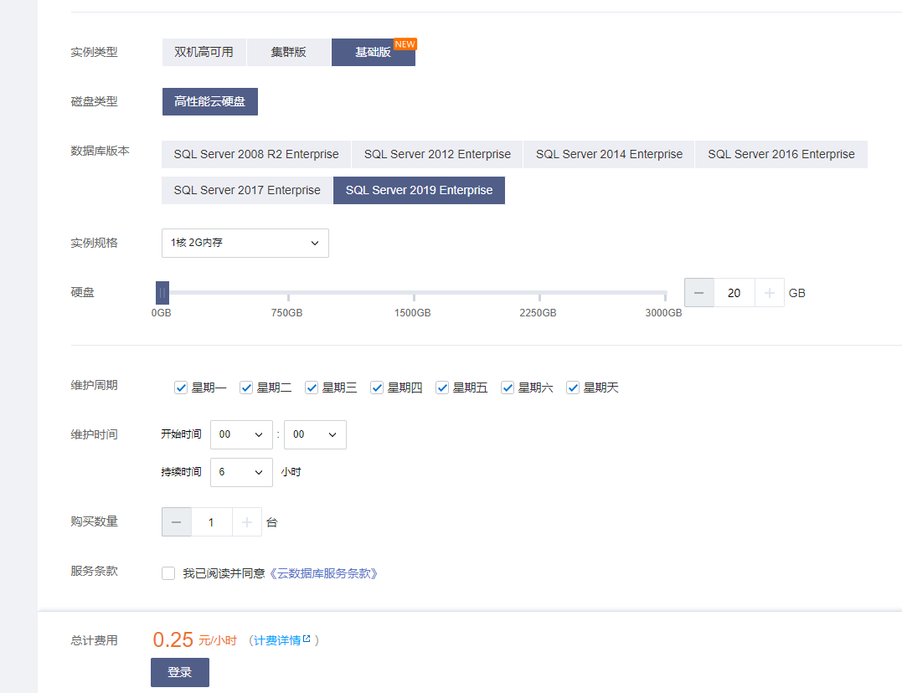
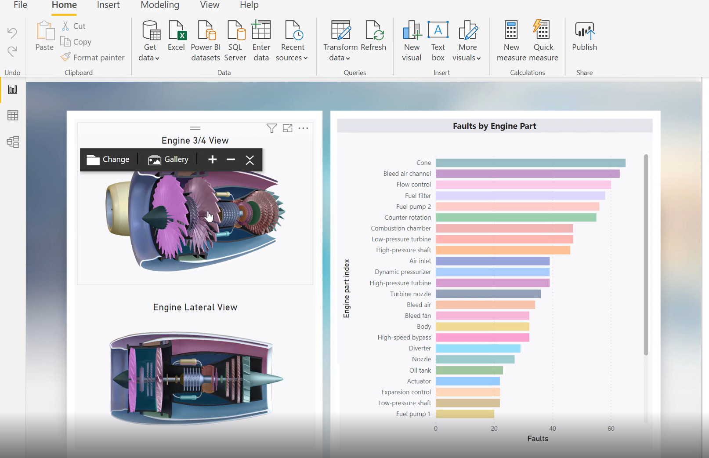
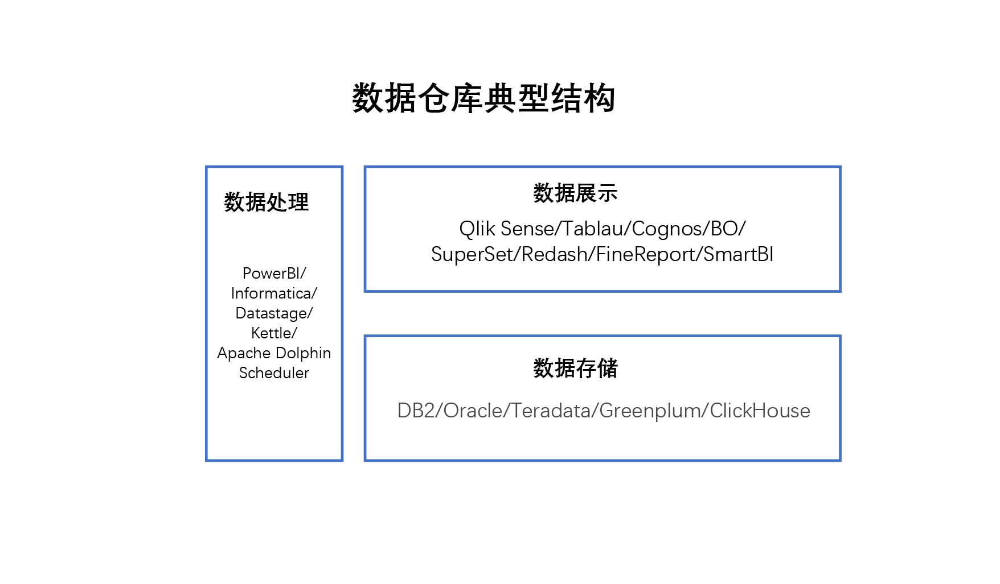
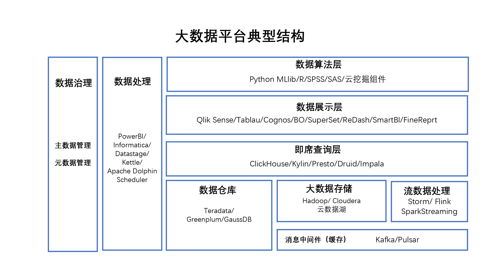

---
date: "2019-06-23"
---  
      
# 27 |  我常用的数据分析工具图谱
数据给你一双看透本质的眼睛，这里是《数据分析思维课》，我是郭炜。

从今天开始，我们就要进入“分析工具”这一章了。在这一章里，我会给你分享一些拿来就可以用的工具以及这些工具最新的一些动态。

不过说到数据分析工具那可太多了，从个人数据分析工具一直到最后大型企业的大数据平台，各种分析工具千差万别。所以这节课我尝试抽丝剥茧，给你分享我曾经使用过的一些数据分析工具在企业里用到的终极架构，用幼儿园、中学一直到博士来给你类比从一个小的数据分析师、数据工程师最后成长为数据科学家/CDO的道路。

## 幼儿园

**典型场景**：个人数据分析，小公司进行数据统计

**数据团队规模**：0-2人

**关键词**：Excel、SQL Server、云、Power BI

在刚接触数据分析的时候，大多数人接触的其实都是Excel。很多人其实看不起Excel，认为这根本就不是数据分析大咖该用的工具。**在我的眼中，Excel是当今小数据分析最好的分析工具（没有之一）。**它所见即所得，而且产品使用非常方便，支持各种各样的定制化的展示，还支持简单的数据挖掘算法。

我曾经在工作中遇到的很多看上去非常复杂的数据分析案例，其实都可以用Excel手到擒来，不需要动用特别复杂的大数据系统。即使到后期使用了大型的数据挖掘系统和大数据工具之后，在最后数据报告形成阶段，Excel也是非常好用的。

<!-- [[[read_end]]] -->

我认为Excel是小数据分析“神器”，所以我在这个课程里专门安排了两节课，来讲讲Excel怎么来使用。用好Excel，在大数据的千军万马之中取敌将首级如探囊取物一般。

Excel的缺点是它自己的数据量级还不够大，往往十几万条数据可能就会非常慢了。这个时候我们可以通过Excel连接数据库提高效率，最好的组合就是微软的Microsoft SQL Server。当然这需要你掌握一种叫SQL的新语言，它是操作数据查询和数据库必会的语言之一。作为数据分析领域的人员，这个语言是必须要会的。

当然，现在这个年代如果你对装数据库或者管理数据库不太得心应手也不用担心，现在云计算非常发达，阿里、腾讯、微软都有SQL Server的云，大概几毛钱一个小时。如果你需要处理比较大量的数据，直接可以买一个云上的实例，花个10块钱基本就可以把我们自己大量数据处理完成了。当然如果你是公司级别的使用的或者对数据很敏感的话，可以要求IT部门装上MySQL作为底层的数据库系统。

当然如果你觉得Excel处理和展示还不够强劲，微软还有一个个人版本的数据分析神器：[PowerBI桌面版](https://powerbi.microsoft.com/zh-cn/desktop/)。它可以前面连接我们提到的Excel、云端的SQL Server或者是其他的各种数据源做数据处理和展示，还支持R和Python，初级使用已经满足小企业日常所需。

## 中学

**典型场景**：中型传统企业，200+人规模民营企业

**数据团队规模**：5-10人

**关键词**：数据仓库、MySQL、Oracle、Greenplum、Teradata、Informatica、Datastage、Apache DolphinScheduler、Kettle、BO、Cognos、Tableau、QlikTech

在你数据分析团队规模超过5个人的时候，前面使用的SQL模式就不能完全满足要求了。这个时候一般老板要看相关的企业分析报表，要做整体内部的数据分析，你就要建立所谓的BI/数据仓库系统。

这个时候我们可以选择使用开源或者收费的系统来建设（这节课我提到的收费和免费的组件都列在附录里了，你可以去参考一下），但我还是建议你不要着急上所谓的大数据平台或者复杂的非结构化系统，因为在这个阶段，企业的小数据往往比企业的大数据要有价值。

如果有比较简单的互联网相关业务，完全可以使用网上免费的互联网分析系统。这里数据分析人员光掌握Excel和SQL就不够了，需要掌握一种新的语言叫做Python。这个语言也非常简单易学，它可以帮助我们快速处理复杂数据（包括未来的数据挖掘），Python的特点是：

* 数据处理简洁明快，Perl的替代品；
* 各种数据平台driver都支持；
* 支持各种挖掘算法库；
* 支持流式计算框架。

这时候整体系统平台就会分成了三部分：数据存储数据库、数据处理和调度以及数据展示工具。

* **数据存储数据库**。可以是前面介绍的SQL Server，也可以是IBM的DB2、Oracle、Teradata、Greenplum、ClickHouse这些工具，目标是将数据存储到数据库里进行相关的调用。
* **数据处理**。到这个部分，简单桌面版的Power BI就不够用了，这个时候得是商业版本的Power BI、商业版的Informatica、IBM Datastage，也可以是开源免费的Apache Dolphin Scheduler、Kettle。
* **数据展示**。有了数据处理和存储，如何来做整体的数据处理展示呢？简单的Excel和Power BI也不够了，你可以购买商业版本的 Qlik Sense/Tablau/Cognos/BO或者开源的Superset、ReDash。

下图是一个完整的数据仓库系统，它可以帮助企业从各种各样的内部系统里面抽取数据，最终转换成企业所用的目标，也给各位数据分析师提供坚实的基础。  

## 大学

**典型场景：**中大型传统企业，500+人规模民营企业

**数据团队规模：**人数20+

**关键词：**Apache、Hadoop、Spark、HBase、ClickHouse、Presto、Hive、Kafka、Apache DolphinScheduler、数据挖掘、R、SPSS、SAS、Python MLlib

到这个阶段一般是中大型企业、小型银行、政府机构以及大部分的传统企业，一般这些企业里都会有20到30个数据工程师或者数据分析专职人员来控制数据。这些企业不满足于只有数据仓库的形式提供结构化数据分析，还会有大量的非结构化数据进入到企业。

这个时候企业就需要上大数据平台了，因为大部分使用的都是开源组件，一般大数据平台的维护需要3到5个专人维护平台和稳定性。

提到大数据平台肯定离不开世界顶级的Apache基金会，这是世界顶级的开源组织，现在市面上几乎所有的大数据组件都来自Apache基金会。只要属于Apache基金会的组件你就可以放心免费下载使用，当然，这些项目也有各自的商业版本来减少你的人工投入或者提供更好的功能。

这个时候数据的来源就更加复杂了，它除了过去企业内部的小数据，还会有用户和企业在互联网上操作的各种各样的大数据（例如网页和App互动日志，采集的视频、语音，网上的各种舆论新闻等）。

所以这个阶段的数据结构会相当复杂，我在下面给出了在这个阶段的大数据架构图，你可以参考一下。

这个阶段因为数据的增加，数据源变得越来越复杂，数据的大小也都是Tb级以上的内容。你需要增加对于数据本身的管理（也叫数据治理），比如主数据的管理（也就是到底哪个数据是唯一有效的数据），还有各种各样元数据的管理，这些系统的出现都是为了更好管理内部各种各样复杂系统。

数据量大了之后，除了我们前面简单的数据展示之外，开始有数据算法基础那一章讲的数据挖掘的应用了。这些数据挖掘应用你可以使用开源的库例如PythonMLlib或者是R，也可以使用一些收费软件例如SPSS、SAS或者云上的一些算法服务。

## 博士

**典型场景：**超大型传统企业，大型互联网公司

**数据团队规模：**人数100+

**关键词：**融合框架、融合算法、自建开源社区

到这个阶段一般是超大型的传统企业或者大型的互联网公司，他们将数据贯彻到企业业务过程当中，已经完全融合了数据驱动的思路。内部从事数据的工程师和分析人员规模从一百人到上千人不等，分工明细，从数据平台工程师、数据处理工程师、数据质量部门到数据科学家、数据分析师再到数据运营等岗位一应俱全。

这个阶段一般公司都会建设内部的数据中台，自主研发自己的展示工具，自己建立自己的推荐算法引擎。它的特点就是针对每一个公司自己的特色和业务，采用自建和外采的混合模式建设自主的数据系统，不会采用某一种技术、某一个厂商来全面覆盖自己企业的需求。

## 小结

在本节课里，每一张架构图里会有各种各样的数据组件，我把这些大数据组件的名词解释列在了附录里，你如果有不清楚的地方，可以到附录里对照参考看一下，丰富自己的知识储备。

这节课讲到这里其实已经把全球最先进的科技技术分享给你了。最后我们还是回到这门课的初衷：数据分析不是为炫技而生。

**不要追求在企业小学阶段的时候就要用博士的方法来解决问题。克制住对最新技术的冲动，在合适的场景用合适的工具，才能够创造最大数据驱动的价值。**真正数据分析的高手往往是心中有剑，手中无剑，用一个Excel也可以分析出惊世骇俗的数据结论。

不要只是追求手中工具技术的先进性而忘掉了数据分析思维，外行看的都是数据工具的热闹，内行其实看的是数据分析思维里面的这些门道。

数据给你一双看透本质的眼睛，数据分析思维是无招胜有招。

## 课后思考

你还遇到过哪些比较好用的数据分析组件？分享出来，我们一起提高。

## 附录：数据组件名词解释表

**Excel**： 微软Office套件里面专门针对数据处理的组件，有云同步的Office 365和本地的Office版本。（<https://www.office.com/>）

**SQL Server**：微软的数据库系统，在阿里云、腾讯云以及微软的云上都有按时和按需购买的实例。（<https://www.microsoft.com/en-in/sql-server/>）

**云**：不用安装软件直接订阅使用相关的公有云服务，典型的有AWS、Azure、阿里云、腾讯云、华为云。

**Power** **BI**：微软的数据处理和数据展示套装，桌面版是免费的，云版和服务器端是收费的。（<https://powerbi.microsoft.com/cn>）

**数据仓库**：传统数据存储的小数据比较集中的地方，将企业内部所有的格式化数据全都聚集到一起，方便数据分析师和内部决策者进行辅助决策。

**MySQL**： Oracle公司免费的小型的数据库系统。\(<https://www.mysql.com/>\)

**Oracle**：Oracle公司大型的数据存储和数据库系统，也提供Oracle的云上服务。（<https://www.oracle.com/in/index.html>）

**Greenplum**：Pivotal公司的开源的数据仓库、存储系统。（<https://greenplum.org/>）

**Teradata**：收费的软件和硬件一体化的数据仓库系统。（<https://www.teradata.com/>）

**Informatica**：收费的数据处理和数据调度系统。（<https://www.informatica.com/>）

**Datastage**： IBM公司收费的数据处理和数据调度系统。（<https://www.ibm.com/in-en/products/datastage>）

**Apache**：全球顶级的开源基金会，旗下所有的软件都是开源可以免费使用，大部分大数据组件都是来自这家开源基金会的组建。（<https://Apache.org>）

**Apache DolphinScheduler**：中国人贡献的阿帕奇基金会的免费可视化大数据调度系统，可加微信Leonard-ds进入社区。（<https://dolphinscheduler.apache.org/> ）

**Kettle**：免费的可视化数据调度系统。（<https://github.com/pentaho/pentaho-kettle>）

**BO**： SAP公司收费的BI数据展示系统。（<https://www.sap.com/india/products/bi-platform.html>）

**Cognos**： IBM公司收费的BI数据展示系统。（<https://www.ibm.com/products/cognos-analytics>）

**Tableau**：收费的BI展示系统。（<https://www.tableau.com/>）

**QlikTech**：收费的BI展示系统。（<https://www.qlik.com/us/>）

**Hadoop**：开源免费的大数据存储和处理系统。（<https://hadoop.apache.org/>）

**Spark**：开源免费的新一代大数据处理系统框架。\(<https://spark.apache.org/>\)

**HBase**：免费开源的大数据列存储的系统。\(<https://hbase.apache.org/>\)

**ClickHouse**：开源免费的数据即时查询系统，单表性能全球最佳，可加微信ClickHouseC进入社区。（<https://clickhouse.tech/>）

**Presto**：开源免费的数据即时查询系统\(<https://prestodb.io/>,<https://trino.io/>\)

**Kafka**：开源免费的消息、中间件系统。\(<https://kafka.apache.org/>\)

**R**：开源免费的数据挖掘算法系统。\(<https://www.r-project.org/>\)

**SPSS**：IBM收费的数据挖掘及数据处理系统。\(<https://www.ibm.com/products/spss-statistics>\)

**SAS**：收费的数据挖掘系统。\(<https://www.sas.com/zh_cn/home.html>\)

**MLlib**：免费的开源的数据挖掘算法库。\(<https://spark.apache.org/mllib/>\)