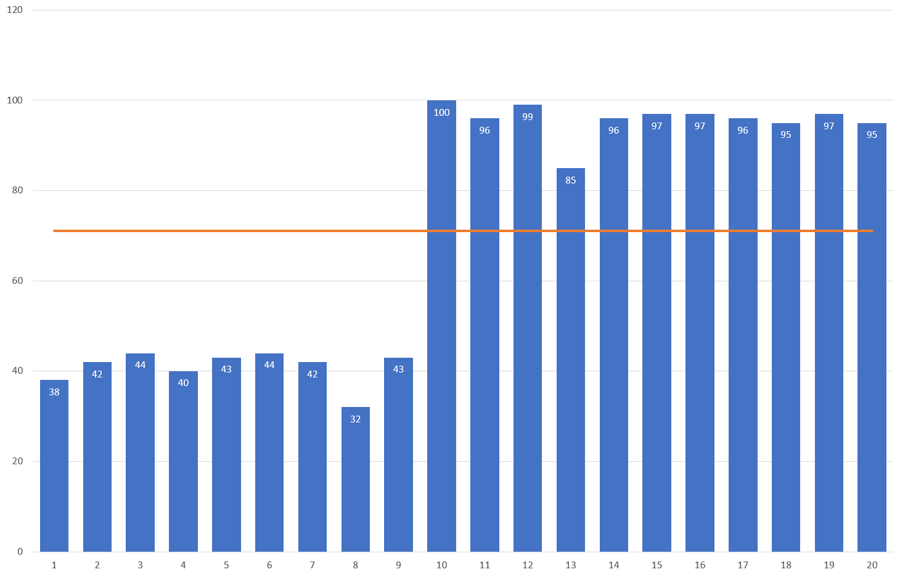

---
date: "2019-06-23"
---  
      
# 30 | 快速实现数据分析基础课中的分析模型
数据给你一双看透本质的眼睛，这里是《数据分析思维课》，我是郭炜。

数据分析思维课不仅是讲理论，我们还要实践。所以这节课我们来把前两节课讲过的18个技巧再进行一下实操，我们回到前面课程里的实例，看看这些技巧在真正实践当中是怎样使用的。

## 实践1：平均值

首先回到我们的[平均值](https://time.geekbang.org/column/article/400764)这节课，你能看到课程里面有这样的一张图，这张图由若干个柱状图和一条平均线组成，其中柱状图的平均线是由Excel自动计算出来的。那么我们怎样用Excel来实现呢？你可以看一下我视频当中的操作方法。

视频演示：

你要注意，在画这个图时要注意以下几个重点：

* 所有的柱状图的间距都是要调整的，否则每个柱状图都会变成豆芽菜的形状，非常难看；
* 数据标注时一定要做颜色位置调整；
* 平均线其实Excel是无法自动计算出来的，所以我们需要用组合图的方式把平均线通过折线图加入进来。

## 实践2：直方图与幂分布

我们接下来看第2个实践案例：画直方图。你可以看到[第5节课](https://time.geekbang.org/column/article/404779)的数据图形是下面这个样子的。

这两张图其实都是由柱状图组成的。第一个直方图是我们使用的是事后统计出来的数据，所以不能用Excel自带的直方图进行绘制。

第二个图是网上的大量数据先通过Excel的数据透视图，再选择相应的指标维度并进行排序，最后找到相关的趋势线就完成了。我在视频里的操作其实是非常快的，这是因为这些技巧我已经非常熟悉了，当然，你不妨参照我的视频一步一步做一遍，你也一定可以和我一样熟悉这些技巧。

<!-- [[[read_end]]] -->

视频教学：

其中重点有这样两个：

* 直方图的图距进行了调整，才可以调成我们图中的这个样子；
* 数据透视图要选好计算指标，同时在图中可以利用排序和调整图形属性来变成直方图。

## 实践3：数据分布

紧接着我们来看一个比较复杂的例子：[第6节课](https://time.geekbang.org/column/article/405241)数据分布里面的正态分布曲线。 Excel不能自动生成正态曲线，它需要通过组合图的方式把计算出来的直方图和模拟出来的正态曲线，放在一个图里面进行比对，才可以完成下图当中这个样子。

你可以看我在视频里面给你做的演示：

重点有这样几个：

* 使用前面的复杂公式统一填写模式；
* 使用拖拽自动生成序号和copy的模式；
* 使用Tab键自动填充公式关键字；
* 使用复杂的FREQUENCY和标准差、正态分布函数。

你看我在视频当中操作的过程也是非常快的，你以后在做相关数据分析的时候，也要以这样的速度来处理，这样你的手速才会跟上你的思路，更快更好地做好数据分析。

## 实践4：散点图和相关性

我们在[第7节课](https://time.geekbang.org/column/article/406706)的时候讲过，Excel不仅可以非常方便地画出散点图，还可以在Excel里面给出相应的趋势线预测。

在下面的视频演示中，我会给你讲一讲上面这个散点图是怎么在Excel里绘制出来的，同时我还会和你分享如何去选择一个比较好的趋势线来说明这些散点的大方向和趋势。你看完这个视频就会发现，Excel在做小数据分析的时候真的非常方便，从趋势线的模型选择到散点图的调整其实都已经帮你设置好了。

视频教学：

重点有这么几个：

* 散点图 X、Y变量设置；
* 趋势线的选择；
* 最后公式的比较。

## 实践5：标准差

在[第8节课](https://time.geekbang.org/column/article/407445)里，我们讲了标准差和标准误差这两个概念。标准差还可以叫做标准偏差，它可以在 Excel里快速计算出来。

在Excel里计算标准差时，有两个函数都可以计算出标准差。

* 一种是我们认为给出的标准差就是总体的标准差，这个时候我们就用STDEVP函数；
* 另一种是用于计算样本估算的整体的标准差，也就是我默认去拿出来的样本是抽样出来的一些数据，并不是我们拿到的整体的所有的人的样本量，也就是用STDEV函数。

是不是感觉有点绕？我给你举个例子。如果我们全组就5个人，我把所有人都计算进来，计算标准差，这个时候我们就可以用给定样本的总体标准差STDEVP计算公式；如果这一组是500人，我们只抽调了5个人来看看这500人之间的标准差可能是什么样子，我们就会使用估算的整体样本标准差STDEV进行计算。

具体方法你可以参考一下这个视频：

在这个例子里我们的重点是区分来自抽样数据还是全部数据，选择不同的标准差公式。

通过跟着视频做这些之前课程的案例你能感觉到，虽然我们在前面讲了很多的基础理论和知识点，但这还是不够的。到真正上手实践的时候，你还要区分出来具体的业务场景是什么，然后使用合适的相关的公式才能得到正确的数据，这就是数据分析思维的严谨性所在。

## 小结

这节课主要是用Excel来实践一下我们之前课程里的例子，也是二次磨合锻炼一下前面两节课的一些技巧。其实数据分析并不难，但如果你想要快速做数据探查，给出各种各样的数据分析结果，前面介绍的这些技巧你一定要掌握好。否则可能两三分钟演示出来的一个实例，你自己没有很好掌握的情况下，花半个小时都做不出来。

我们对工具的熟练可以让你的手速跟上你的“脑速”，这也就是为什么我没有用其他的工具，一定要给你讲解Excel的原因。**我们使用大数据算法的时候，往往会把注意力都放到编程当中而忽视了数据本身。我们在做管理决策的时候，往往不是在大数据里面做决策，而是在我们的小数据里。**

这个时候我们要是有一个得心应手的数据分析工具，就可以帮助我们在工作和生活当中得到更好的分析数据结论，更好地贯彻我们的数据思维。影响我们最终决策的，往往是凝聚高信息熵的小数据，而Excel正是处理这方面数据的神器。同样，你可以点击[这里](https://pan.baidu.com/s/1DqC7GNgq9DYXOfo-U0BvwA)（提取码hnwf）获取我们这节课的Excel文件，方便你进一步学习。

数据给你一双看透本质的眼睛，我希望你学完这门课之后，不仅能成长为数据分析的理论高手，更要成为数据分析的实践能手。

## 课后思考

我给你介绍这些案例的实践方法只是若干种实践方法之一，你还有没有更聪明的做法？分享出来我们一起提高。