---
date: "2019-06-23"
---  
      
# 中秋放送 | 数据分析基础回顾
你好，我是这门课程的编辑正霖，我又来了。

明天就是中秋节啦，在这里提前祝你中秋节快乐！不知道你有没有复习的习惯呢？课程更新到现在，你应该也能感受到，到了“如何用数据说话”这一章，对之前知识点的综合运用更多了。

基于此，我为你准备了两篇复习回顾（分别回顾数据分析基础以及数据算法基础）。我会把前两章每一讲画出一个思维导图并加上这一讲的金句（重点关键句），如果你对这节课所讲的内容感觉很模糊，可以点击对应的超链接去复习一下。好了，那我们今天就从“数据分析基础”这一章开始吧！

[01 | 平均值：不要被骗了，它不能代表整体水平](https://time.geekbang.org/column/article/400764)

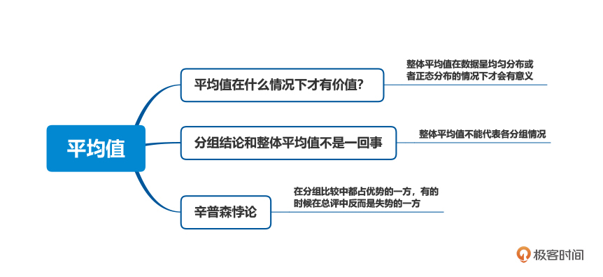

拆开来看，“质”与“量”是不等价的。平均值和辛普森悖论告诉我们要抓大放小，不要因为某一个单项优势就洋洋得意，也不要因为局部失败就一蹶不振。生活，要有一颗平常心，我们的目标是让我们这一生的“人生平均值”逐步提高。

[02 | 大数定律与小数陷阱：生活是随机还是有定数的？](https://time.geekbang.org/column/article/401316)

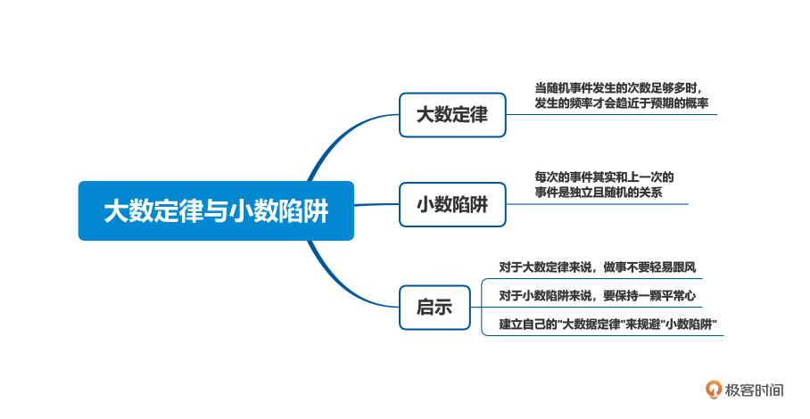

生活里最难的就是如何辨别什么是偶然，什么是必然。我们期待把生活全部变成必然，但其实你会发现人的一生很短暂，我们一生的经历很难都是必然。站在数据分析的角度来看，生活本来就充满着各种不确定性，你如果不去努力，那经历的样本就太少了，你经历的可能就会是各种偶然的极端情况（比如一路上老是遇上红灯）。

<!-- [[[read_end]]] -->

[03 | 数据的期望值：为什么你坐的飞机总是晚点？](https://time.geekbang.org/column/article/402945)

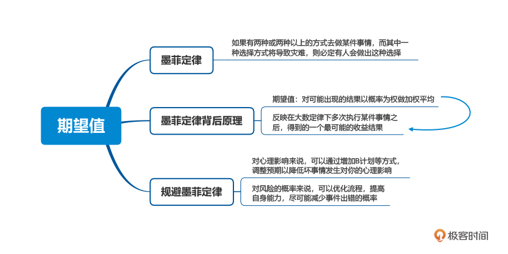

“为大概率坚持，为小概率备份”、“已知的是成本，未知的才是风险”、“项目风险控制”、“生活中的风险控制”、“平衡预期”、“未雨绸缪”都是这节课的关键词。同时，01、02、03建议放在一起统一进行复习：没有事情可以一蹴而就（平均值），我们需要努力足够多的次数（大数定律），学会规避风险（期望值），你的生活才会越来越有掌控感。

[04 | 随机对照试验：章鱼保罗真的是“预言帝”么？](https://time.geekbang.org/column/article/403845)

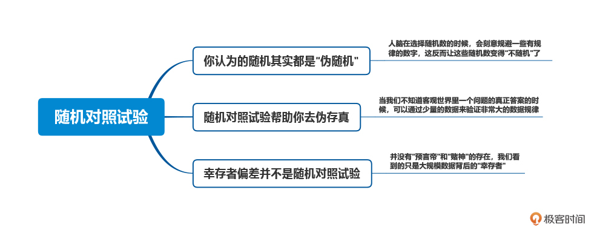

在我们工作和生活当中，一定要注意不能犯同样的“错误”——采用非随机的结果来证明我们的观点，更不能用幸存者偏差——用结果倒推原因来解释我们的一些结论。

注意自己“不犯错”是一方面，另一方面我们也要学会“发现错误”，学习前人失败的经验教训。当别人和你兜售一些貌似合理论调时，希望你对“沉默的数据”留一个心眼，在看向那些闪闪发光的成功数据时，也要意识到有很多“话少”甚至“不说话”的数据存在。

[05 | 直方图与幂分布：为什么全世界1\%的人掌握着50\%的财富？](https://time.geekbang.org/column/article/404779)

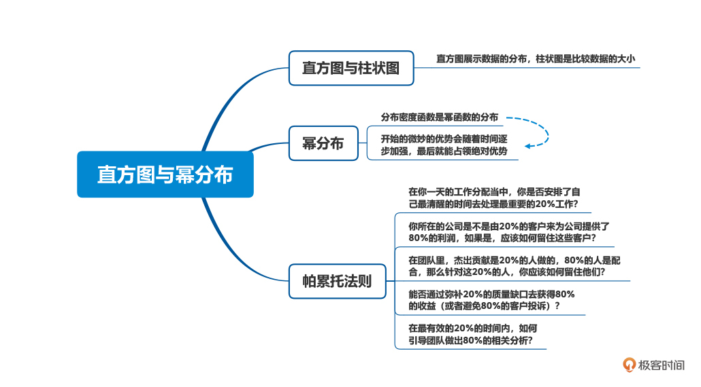

我们身处的世界是赢者通吃的世界，开始时细微优势最终将带来无穷多的回报。反之，最初的细微劣势也将导致最终一无所有。那么，我们如果每天在自己的专业领域里面比其他人多成功1\%，最终积累起来的竞争优势将使别人无法超越，你就会变成那个能够大声说“我全都要”的少数派。

[06 | 数据分布：房子应该是买贵的还是买便宜的？](https://time.geekbang.org/column/article/405241)

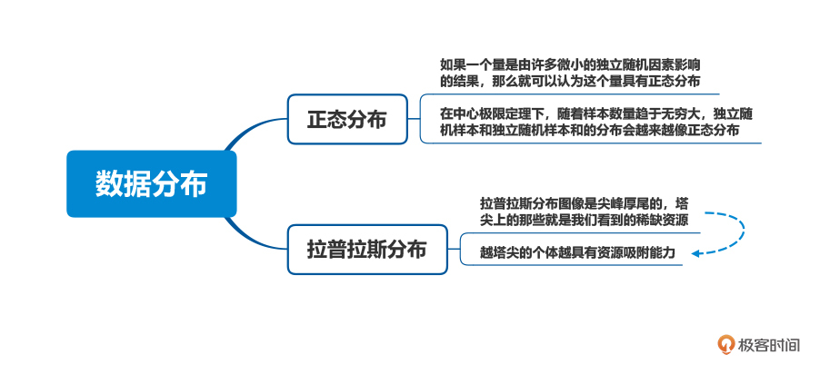

无论在什么场景下做数据分析，数据的分布应该能贴合地描述我们社会上的“大势”，所以当你面临生活中的决策时，而不能就数据套数据、为了算法而算法，领域背后的知识对于我们更加重要。

正态分布和拉普拉斯分布其实给我们的工作生活一个大的启示，那就是为什么会有“Work Hard, Play Hard”这样一句话的流行，因为这句话背后的含义其实是指当你要获得更多的自由的时候，你也要付出同等的甚至更多的自律（控制自己既能使劲玩也能使劲工作）。当今社会的人才分布是呈拉普拉斯分布的，我们要争取做顶尖，这样才会有更多的资源和机会。

[07 | 散点图和相关性：怎样快速从数据当中找到规律？](https://time.geekbang.org/column/article/406706)

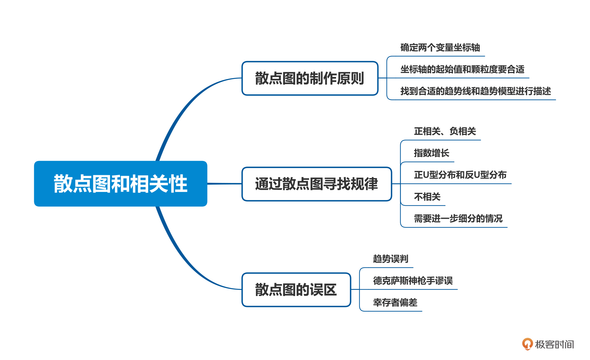

数据分析的艺术就在于通过数据分析和管理经验找到反U型最高点。

没有正确的数据验证，千万不要轻易下结论。我们要根据实际自己的业务领域知识以及算法模型找到接近事实的最佳解，这样才能够帮助你去预测这个世界，错误利用模型最后只会导致我们出现错误的决策。

[08 | 标准差：这人是不是“靠谱”其实看标准差？](https://time.geekbang.org/column/article/407445)

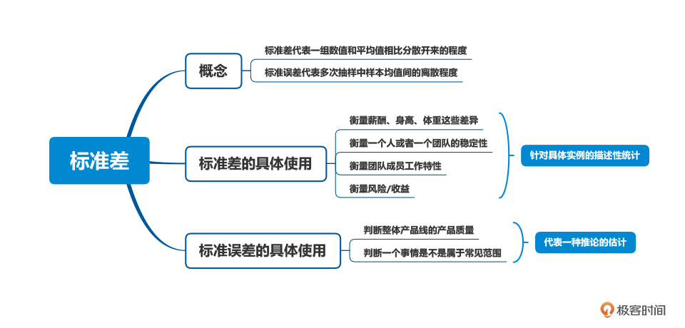

看一个人、一个企业、一个投资产品靠不靠谱，除了人办事情的成功率、企业收入平均值和产品的盈利率，你还要看它标准差是怎样的。有可能这个所谓的“成功人士”只成功了一次，赚了一大笔钱，但是其实别的事他都失败了，那说明这人的标准差很大，有可能他就是靠运气，不太靠谱。我们中国人其实是比较喜欢“中庸”的这种感觉，用标准差的视角来看，就是自己做事做人的标准差要小。

对标准误差来说，我送你一个成语，叫做“严于律己，宽以待人”。前半句是指我们在工作和生活中，要尽量少出错，甚至是不犯错，这样不仅做事漂亮，领导喜欢，而且这种不断追求完美的理念，会一直推着我们往前跑。你可以试试，把六西格玛的思想不仅用在工作中，也用在生活里，对自己高标准、严要求一段时间，相信你会获得更进一步的成长。后半句是说，躺平无罪，奋斗有理。我们可以用六个标准误差来要求自己，但是别人也有用一个标准误差要求自己的自由。

如果用一句话来概括，希望你尽量把自己做人做事的标准差变小，提高对自己的标准差预期。

[09 | 数据抽样：大数据来了还需要抽样么？](https://time.geekbang.org/column/article/408181)

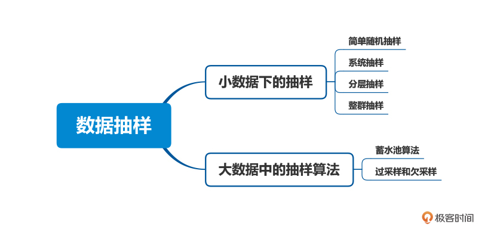

大数据其实不是数据抽样的终结者，无论是大数据还是小数据，它都无法逃离统计学、数学、集合论、数据结构等这些基础理论的约束。之前讲的数据分析的原理，也同样适用于大数据环境。

如果你能把数据抽样的这个“涡轮加速器”运用到你自己的工作和生活当中，那么你就可以事半而功倍，通过针对一小部分的人和事情的观察而看到整个事物的整体情况。古人说“管中窥豹，可见一斑”，对应到我们的数据分析上，说的就是合适的数据抽样算法能够由点及面地看到事物的全貌。

[10 | 指数和KPI：智商是怎么计算出来的？](https://time.geekbang.org/column/article/408750)

在我们的生活和工作中，很多人往往会为了做一个可衡量的数字，不负责任地拍脑袋决策出一个结果。比如说我知道很多公司在做员工360度评估的时候，就是简单地套用一个标准公式，这样的评估往往是失败的。一定要基于细致的业务流程和实验，才能得到合理科学的结果。

一方面当你在衡量一个事物的时候，不要轻易地拍脑袋造出一组数字来代表它。另一方面，希望你能够更加坚定地相信，数字是可以衡量这个世间所有事物的。毕竟如此复杂的我们都可以用数字来衡量，还有什么不能衡量的呢？

[11 | 因果倒置：星座真的可以判定你的性格吗？](https://time.geekbang.org/column/article/409828)

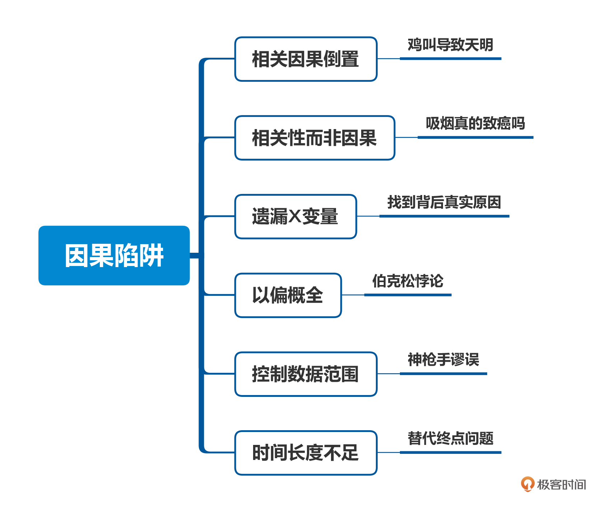

打篮球真的能让人长高吗？这很有可能是因为长高的人都会去打篮球，而不是打篮球让人长高——因果倒置。

喝咖啡可以长寿？常喝咖啡的人一般都是白领阶级，他们的营养供给更高，所以他们可以长寿，而不是因为咖啡让他们长寿——相关性而非因果关系。

吃不吃早饭其实和你肥不肥胖没有什么关系，运动健康才和你的肥胖有关系——相关性而非因果关系。

爱笑的女孩子通常运气都不会太差？爱笑的女孩其实运气也有差的，最后她就不笑了，事实是因为运气好的女孩她们才会爱笑——因果倒置。

会撒娇的女人更好命？女人好不好命其实与另一半或者周围的人和环境更有关系，而不是和你会不会撒娇有关系——需要找到遗漏的X变量。

**数据分析基础部分整合版思维导图**

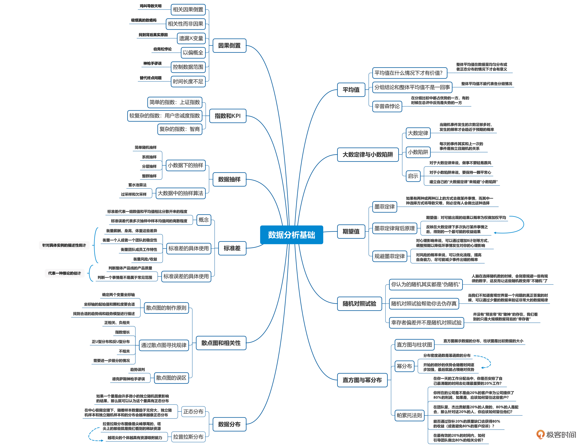