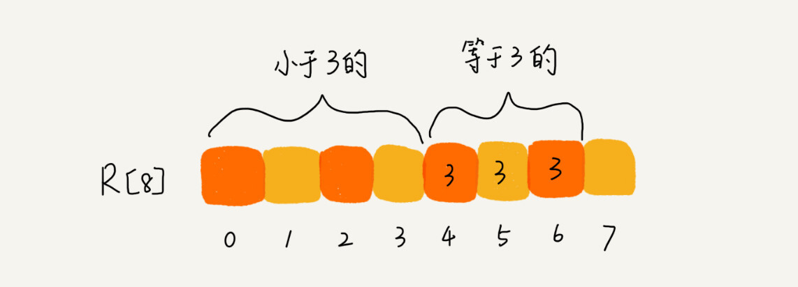
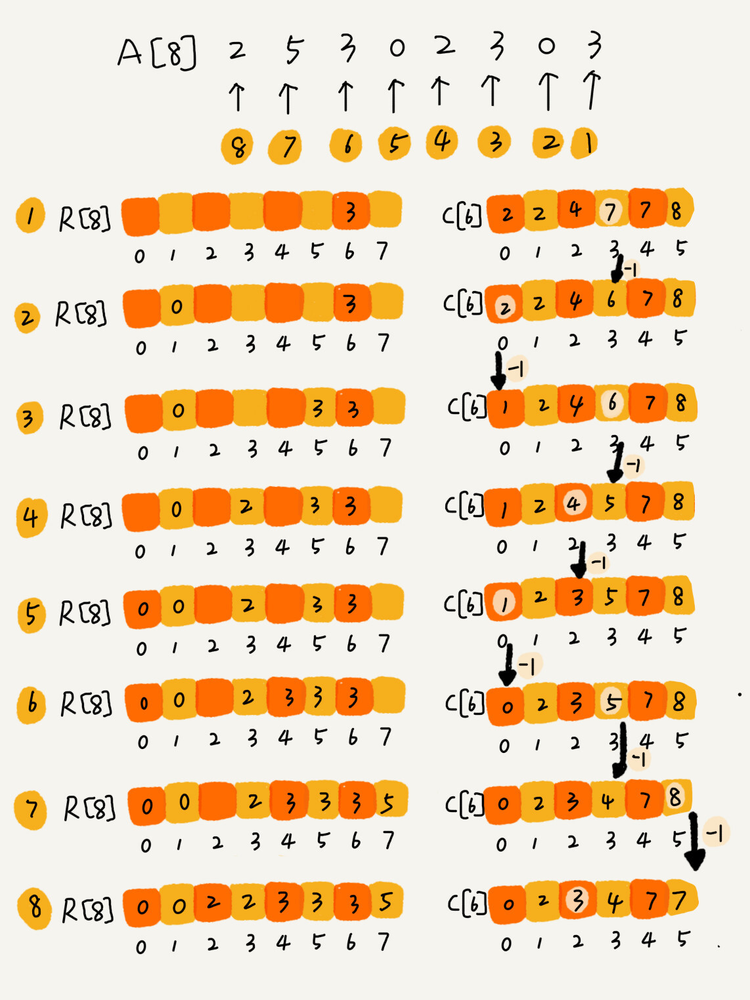

---
date: "2019-06-23"
---  
      
# 13 | 线性排序：如何根据年龄给100万用户数据排序？
上两节中，我带你着重分析了几种常用排序算法的原理、时间复杂度、空间复杂度、稳定性等。今天，我会讲三种时间复杂度是O\(n\)的排序算法：桶排序、计数排序、基数排序。因为这些排序算法的时间复杂度是线性的，所以我们把这类排序算法叫作**线性排序**（Linear sort）。之所以能做到线性的时间复杂度，主要原因是，这三个算法是非基于比较的排序算法，都不涉及元素之间的比较操作。

这几种排序算法理解起来都不难，时间、空间复杂度分析起来也很简单，但是对要排序的数据要求很苛刻，所以我们**今天的学习重点是掌握这些排序算法的适用场景**。

按照惯例，我先给你出一道思考题：**如何根据年龄给100万用户排序？** 你可能会说，我用上一节课讲的归并、快排就可以搞定啊！是的，它们也可以完成功能，但是时间复杂度最低也是O\(nlogn\)。有没有更快的排序方法呢？让我们一起进入今天的内容！

## 桶排序（Bucket sort）

首先，我们来看桶排序。桶排序，顾名思义，会用到“桶”，核心思想是将要排序的数据分到几个有序的桶里，每个桶里的数据再单独进行排序。桶内排完序之后，再把每个桶里的数据按照顺序依次取出，组成的序列就是有序的了。


桶排序的时间复杂度为什么是O\(n\)呢？我们一块儿来分析一下。

<!-- [[[read_end]]] -->

如果要排序的数据有n个，我们把它们均匀地划分到m个桶内，每个桶里就有k=n/m个元素。每个桶内部使用快速排序，时间复杂度为O\(k \* logk\)。m个桶排序的时间复杂度就是O\(m \* k \* logk\)，因为k=n/m，所以整个桶排序的时间复杂度就是O\(n\*log\(n/m\)\)。当桶的个数m接近数据个数n时，log\(n/m\)就是一个非常小的常量，这个时候桶排序的时间复杂度接近O\(n\)。

**桶排序看起来很优秀，那它是不是可以替代我们之前讲的排序算法呢？**

答案当然是否定的。为了让你轻松理解桶排序的核心思想，我刚才做了很多假设。实际上，桶排序对要排序数据的要求是非常苛刻的。

首先，要排序的数据需要很容易就能划分成m个桶，并且，桶与桶之间有着天然的大小顺序。这样每个桶内的数据都排序完之后，桶与桶之间的数据不需要再进行排序。

其次，数据在各个桶之间的分布是比较均匀的。如果数据经过桶的划分之后，有些桶里的数据非常多，有些非常少，很不平均，那桶内数据排序的时间复杂度就不是常量级了。在极端情况下，如果数据都被划分到一个桶里，那就退化为O\(nlogn\)的排序算法了。

**桶排序比较适合用在外部排序中**。所谓的外部排序就是数据存储在外部磁盘中，数据量比较大，内存有限，无法将数据全部加载到内存中。

比如说我们有10GB的订单数据，我们希望按订单金额（假设金额都是正整数）进行排序，但是我们的内存有限，只有几百MB，没办法一次性把10GB的数据都加载到内存中。这个时候该怎么办呢？

现在我来讲一下，如何借助桶排序的处理思想来解决这个问题。

我们可以先扫描一遍文件，看订单金额所处的数据范围。假设经过扫描之后我们得到，订单金额最小是1元，最大是10万元。我们将所有订单根据金额划分到100个桶里，第一个桶我们存储金额在1元到1000元之内的订单，第二桶存储金额在1001元到2000元之内的订单，以此类推。每一个桶对应一个文件，并且按照金额范围的大小顺序编号命名（00，01，02...99）。

理想的情况下，如果订单金额在1到10万之间均匀分布，那订单会被均匀划分到100个文件中，每个小文件中存储大约100MB的订单数据，我们就可以将这100个小文件依次放到内存中，用快排来排序。等所有文件都排好序之后，我们只需要按照文件编号，从小到大依次读取每个小文件中的订单数据，并将其写入到一个文件中，那这个文件中存储的就是按照金额从小到大排序的订单数据了。

不过，你可能也发现了，订单按照金额在1元到10万元之间并不一定是均匀分布的 ，所以10GB订单数据是无法均匀地被划分到100个文件中的。有可能某个金额区间的数据特别多，划分之后对应的文件就会很大，没法一次性读入内存。这又该怎么办呢？

针对这些划分之后还是比较大的文件，我们可以继续划分，比如，订单金额在1元到1000元之间的比较多，我们就将这个区间继续划分为10个小区间，1元到100元，101元到200元，201元到300元....901元到1000元。如果划分之后，101元到200元之间的订单还是太多，无法一次性读入内存，那就继续再划分，直到所有的文件都能读入内存为止。

## 计数排序（Counting sort）

我个人觉得，**计数排序其实是桶排序的一种特殊情况**。当要排序的n个数据，所处的范围并不大的时候，比如最大值是k，我们就可以把数据划分成k个桶。每个桶内的数据值都是相同的，省掉了桶内排序的时间。

我们都经历过高考，高考查分数系统你还记得吗？我们查分数的时候，系统会显示我们的成绩以及所在省的排名。如果你所在的省有50万考生，如何通过成绩快速排序得出名次呢？

考生的满分是900分，最小是0分，这个数据的范围很小，所以我们可以分成901个桶，对应分数从0分到900分。根据考生的成绩，我们将这50万考生划分到这901个桶里。桶内的数据都是分数相同的考生，所以并不需要再进行排序。我们只需要依次扫描每个桶，将桶内的考生依次输出到一个数组中，就实现了50万考生的排序。因为只涉及扫描遍历操作，所以时间复杂度是O\(n\)。

计数排序的算法思想就是这么简单，跟桶排序非常类似，只是桶的大小粒度不一样。**不过，为什么这个排序算法叫“计数”排序呢？“计数”的含义来自哪里呢？**

想弄明白这个问题，我们就要来看计数排序算法的实现方法。我还拿考生那个例子来解释。为了方便说明，我对数据规模做了简化。假设只有8个考生，分数在0到5分之间。这8个考生的成绩我们放在一个数组A\[8\]中，它们分别是：2，5，3，0，2，3，0，3。

考生的成绩从0到5分，我们使用大小为6的数组C\[6\]表示桶，其中下标对应分数。不过，C\[6\]内存储的并不是考生，而是对应的考生个数。像我刚刚举的那个例子，我们只需要遍历一遍考生分数，就可以得到C\[6\]的值。


从图中可以看出，分数为3分的考生有3个，小于3分的考生有4个，所以，成绩为3分的考生在排序之后的有序数组R\[8\]中，会保存下标4，5，6的位置。



那我们如何快速计算出，每个分数的考生在有序数组中对应的存储位置呢？这个处理方法非常巧妙，很不容易想到。

思路是这样的：我们对C\[6\]数组顺序求和，C\[6\]存储的数据就变成了下面这样子。C\[k\]里存储小于等于分数k的考生个数。


有了前面的数据准备之后，现在我就要讲计数排序中最复杂、最难理解的一部分了，请集中精力跟着我的思路！

我们从后到前依次扫描数组A。比如，当扫描到3时，我们可以从数组C中取出下标为3的值7，也就是说，到目前为止，包括自己在内，分数小于等于3的考生有7个，也就是说3是数组R中的第7个元素（也就是数组R中下标为6的位置）。当3放入到数组R中后，小于等于3的元素就只剩下了6个了，所以相应的C\[3\]要减1，变成6。

以此类推，当我们扫描到第2个分数为3的考生的时候，就会把它放入数组R中的第6个元素的位置（也就是下标为5的位置）。当我们扫描完整个数组A后，数组R内的数据就是按照分数从小到大有序排列的了。



上面的过程有点复杂，我写成了代码，你可以对照着看下。

```
    // 计数排序，a是数组，n是数组大小。假设数组中存储的都是非负整数。
    public void countingSort(int[] a, int n) {
      if (n <= 1) return;
    
      // 查找数组中数据的范围
      int max = a[0];
      for (int i = 1; i < n; ++i) {
        if (max < a[i]) {
          max = a[i];
        }
      }
    
      int[] c = new int[max + 1]; // 申请一个计数数组c，下标大小[0,max]
      for (int i = 0; i <= max; ++i) {
        c[i] = 0;
      }
    
      // 计算每个元素的个数，放入c中
      for (int i = 0; i < n; ++i) {
        c[a[i]]++;
      }
    
      // 依次累加
      for (int i = 1; i <= max; ++i) {
        c[i] = c[i-1] + c[i];
      }
    
      // 临时数组r，存储排序之后的结果
      int[] r = new int[n];
      // 计算排序的关键步骤，有点难理解
      for (int i = n - 1; i >= 0; --i) {
        int index = c[a[i]]-1;
        r[index] = a[i];
        c[a[i]]--;
      }
    
      // 将结果拷贝给a数组
      for (int i = 0; i < n; ++i) {
        a[i] = r[i];
      }
    }
    

```

这种利用另外一个数组来计数的实现方式是不是很巧妙呢？这也是为什么这种排序算法叫计数排序的原因。不过，你千万不要死记硬背上面的排序过程，重要的是理解和会用。

我总结一下，**计数排序只能用在数据范围不大的场景****中****，如果数据范围k比要排序的数据n大很多，就****不****适合用****计数****排序了。而且，****计数****排序只能****给****非负整数****排序****，如果要排序的数据是其他类型的，要****将****其在不改变相对大小的情况下，转化为非负整数。**

比如，还是拿考生这个例子。如果考生成绩精确到小数后一位，我们就需要将所有的分数都先乘以10，转化成整数，然后再放到9010个桶内。再比如，如果要排序的数据中有负数，数据的范围是\[-1000, 1000\]，那我们就需要先对每个数据都加1000，转化成非负整数。

## 基数排序（Radix sort）

我们再来看这样一个排序问题。假设我们有10万个手机号码，希望将这10万个手机号码从小到大排序，你有什么比较快速的排序方法呢？

我们之前讲的快排，时间复杂度可以做到O\(nlogn\)，还有更高效的排序算法吗？桶排序、计数排序能派上用场吗？手机号码有11位，范围太大，显然不适合用这两种排序算法。针对这个排序问题，有没有时间复杂度是O\(n\)的算法呢？现在我就来介绍一种新的排序算法，基数排序。

刚刚这个问题里有这样的规律：假设要比较两个手机号码a，b的大小，如果在前面几位中，a手机号码已经比b手机号码大了，那后面的几位就不用看了。

借助稳定排序算法，这里有一个巧妙的实现思路。还记得我们第11节中，在阐述排序算法的稳定性的时候举的订单的例子吗？我们这里也可以借助相同的处理思路，先按照最后一位来排序手机号码，然后，再按照倒数第二位重新排序，以此类推，最后按照第一位重新排序。经过11次排序之后，手机号码就都有序了。

手机号码稍微有点长，画图比较不容易看清楚，我用字符串排序的例子，画了一张基数排序的过程分解图，你可以看下。


注意，这里按照每位来排序的排序算法要是稳定的，否则这个实现思路就是不正确的。因为如果是非稳定排序算法，那最后一次排序只会考虑最高位的大小顺序，完全不管其他位的大小关系，那么低位的排序就完全没有意义了。

根据每一位来排序，我们可以用刚讲过的桶排序或者计数排序，它们的时间复杂度可以做到O\(n\)。如果要排序的数据有k位，那我们就需要k次桶排序或者计数排序，总的时间复杂度是O\(k\*n\)。当k不大的时候，比如手机号码排序的例子，k最大就是11，所以基数排序的时间复杂度就近似于O\(n\)。

实际上，有时候要排序的数据并不都是等长的，比如我们排序牛津字典中的20万个英文单词，最短的只有1个字母，最长的我特意去查了下，有45个字母，中文翻译是尘肺病。对于这种不等长的数据，基数排序还适用吗？

实际上，**我们可以把所有的单词补齐到相同长度，位数不够的可以在后面补“0”**，因为根据[ASCII值](https://zh.wiktionary.org/wiki/US-ASCII)，所有字母都大于“0”，所以补“0”不会影响到原有的大小顺序。这样就可以继续用基数排序了。

我来总结一下，**基数排序对要排序的数据是有要求的，需要可以分割出独立的“位”来比较，而且位之间有递进的关系，如果a数据的高位比b数据大，那剩下的低位就不用比较了。除此之外，每一位的数据范围不能太大，要可以用线性排序算法来排序，否则，基数排序的时间复杂度就无法做到O\(n\)了**。

## 解答开篇

今天的内容学完了。我们再回过头来看看开篇的思考题：如何根据年龄给100万用户排序？现在思考题是不是变得非常简单了呢？我来说一下我的解决思路。

实际上，根据年龄给100万用户排序，就类似按照成绩给50万考生排序。我们假设年龄的范围最小1岁，最大不超过120岁。我们可以遍历这100万用户，根据年龄将其划分到这120个桶里，然后依次顺序遍历这120个桶中的元素。这样就得到了按照年龄排序的100万用户数据。

## 内容小结

今天，我们学习了3种线性时间复杂度的排序算法，有桶排序、计数排序、基数排序。它们对要排序的数据都有比较苛刻的要求，应用不是非常广泛。但是如果数据特征比较符合这些排序算法的要求，应用这些算法，会非常高效，线性时间复杂度可以达到O\(n\)。

桶排序和计数排序的排序思想是非常相似的，都是针对范围不大的数据，将数据划分成不同的桶来实现排序。基数排序要求数据可以划分成高低位，位之间有递进关系。比较两个数，我们只需要比较高位，高位相同的再比较低位。而且每一位的数据范围不能太大，因为基数排序算法需要借助桶排序或者计数排序来完成每一个位的排序工作。

## 课后思考

我们今天讲的都是针对特殊数据的排序算法。实际上，还有很多看似是排序但又不需要使用排序算法就能处理的排序问题。

假设我们现在需要对D，a，F，B，c，A，z这个字符串进行排序，要求将其中所有小写字母都排在大写字母的前面，但小写字母内部和大写字母内部不要求有序。比如经过排序之后为a，c，z，D，F，B，A，这个如何来实现呢？如果字符串中存储的不仅有大小写字母，还有数字。要将小写字母的放到前面，大写字母放在最后，数字放在中间，不用排序算法，又该怎么解决呢？

欢迎留言和我分享，我会第一时间给你反馈。

* * *

我已将本节内容相关的详细代码更新到GitHub，[戳此](https://github.com/wangzheng0822/algo)即可查看。