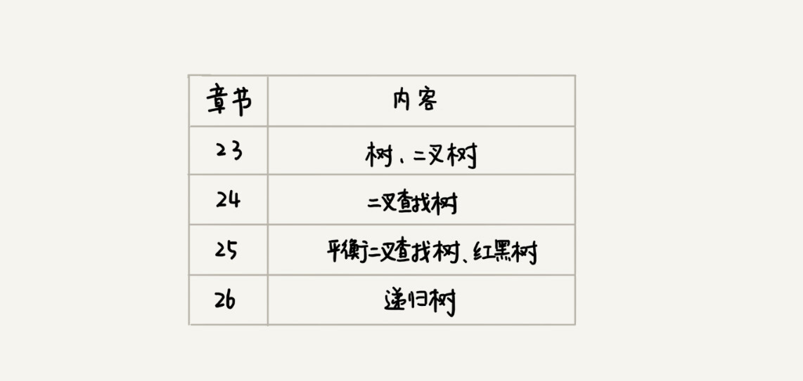
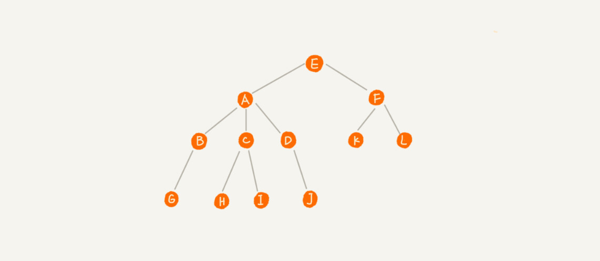
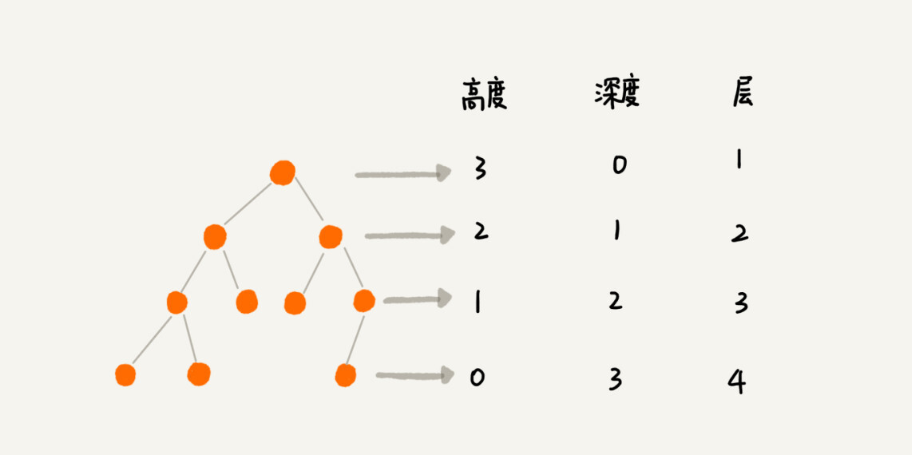
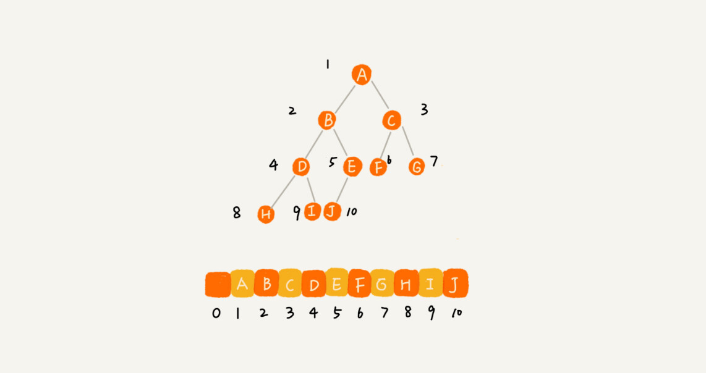

---
date: "2019-06-23"
---  
      
# 23 | 二叉树基础（上）：什么样的二叉树适合用数组来存储？
前面我们讲的都是线性表结构，栈、队列等等。今天我们讲一种非线性表结构，树。树这种数据结构比线性表的数据结构要复杂得多，内容也比较多，所以我会分四节来讲解。



我反复强调过，带着问题学习，是最有效的学习方式之一，所以在正式的内容开始之前，我还是给你出一道思考题：**二叉树有哪几种存储方式？什么样的二叉树适合用数组来存储？**

带着这些问题，我们就来学习今天的内容，树！

## 树（Tree）

我们首先来看，什么是“树”？再完备的定义，都没有图直观。所以我在图中画了几棵“树”。你来看看，这些“树”都有什么特征？


你有没有发现，“树”这种数据结构真的很像我们现实生活中的“树”，这里面每个元素我们叫做“节点”；用来连接相邻节点之间的关系，我们叫做“父子关系”。

比如下面这幅图，A节点就是B节点的**父节点**，B节点是A节点的**子节点**。B、C、D这三个节点的父节点是同一个节点，所以它们之间互称为**兄弟节点**。我们把没有父节点的节点叫做**根节点**，也就是图中的节点E。我们把没有子节点的节点叫做**叶子节点**或者**叶节点**，比如图中的G、H、I、J、K、L都是叶子节点。



除此之外，关于“树”，还有三个比较相似的概念：**高度**（Height）、**深度**（Depth）、**层**（Level）。它们的定义是这样的：

<!-- [[[read_end]]] -->


这三个概念的定义比较容易混淆，描述起来也比较空洞。我举个例子说明一下，你一看应该就能明白。



记这几个概念，我还有一个小窍门，就是类比“高度”“深度”“层”这几个名词在生活中的含义。

在我们的生活中，“高度”这个概念，其实就是从下往上度量，比如我们要度量第10层楼的高度、第13层楼的高度，起点都是地面。所以，树这种数据结构的高度也是一样，从最底层开始计数，并且计数的起点是0。

“深度”这个概念在生活中是从上往下度量的，比如水中鱼的深度，是从水平面开始度量的。所以，树这种数据结构的深度也是类似的，从根结点开始度量，并且计数起点也是0。

“层数”跟深度的计算类似，不过，计数起点是1，也就是说根节点位于第1层。

## 二叉树（Binary Tree）

树结构多种多样，不过我们最常用还是二叉树。

二叉树，顾名思义，每个节点最多有两个“叉”，也就是两个子节点，分别是**左子节点**和**右子****节****点**。不过，二叉树并不要求每个节点都有两个子节点，有的节点只有左子节点，有的节点只有右子节点。我画的这几个都是二叉树。以此类推，你可以想象一下四叉树、八叉树长什么样子。


这个图里面，有两个比较特殊的二叉树，分别是编号2和编号3这两个。

其中，编号2的二叉树中，叶子节点全都在最底层，除了叶子节点之外，每个节点都有左右两个子节点，这种二叉树就叫做**满二叉树**。

编号3的二叉树中，叶子节点都在最底下两层，最后一层的叶子节点都靠左排列，并且除了最后一层，其他层的节点个数都要达到最大，这种二叉树叫做**完全二叉树**。

满二叉树很好理解，也很好识别，但是完全二叉树，有的人可能就分不清了。我画了几个完全二叉树和非完全二叉树的例子，你可以对比着看看。


你可能会说，满二叉树的特征非常明显，我们把它单独拎出来讲，这个可以理解。但是完全二叉树的特征不怎么明显啊，单从长相上来看，完全二叉树并没有特别特殊的地方啊，更像是“芸芸众树”中的一种。

那我们为什么还要特意把它拎出来讲呢？为什么偏偏把最后一层的叶子节点靠左排列的叫完全二叉树？如果靠右排列就不能叫完全二叉树了吗？这个定义的由来或者说目的在哪里？

要理解完全二叉树定义的由来，我们需要先了解，**如何表示（或者存储）一棵二叉树？**

想要存储一棵二叉树，我们有两种方法，一种是基于指针或者引用的二叉链式存储法，一种是基于数组的顺序存储法。

我们先来看比较简单、直观的**链式存储法**。从图中你应该可以很清楚地看到，每个节点有三个字段，其中一个存储数据，另外两个是指向左右子节点的指针。我们只要拎住根节点，就可以通过左右子节点的指针，把整棵树都串起来。这种存储方式我们比较常用。大部分二叉树代码都是通过这种结构来实现的。


我们再来看，基于数组的**顺序存储法**。我们把根节点存储在下标i = 1的位置，那左子节点存储在下标2 \* i = 2的位置，右子节点存储在2 \* i + 1 = 3的位置。以此类推，B节点的左子节点存储在2 \* i = 2 \* 2 = 4的位置，右子节点存储在2 \* i + 1 = 2 \* 2 + 1 = 5的位置。



我来总结一下，如果节点X存储在数组中下标为i的位置，下标为2 \* i 的位置存储的就是左子节点，下标为2 \* i + 1的位置存储的就是右子节点。反过来，下标为i/2的位置存储就是它的父节点。通过这种方式，我们只要知道根节点存储的位置（一般情况下，为了方便计算子节点，根节点会存储在下标为1的位置），这样就可以通过下标计算，把整棵树都串起来。

不过，我刚刚举的例子是一棵完全二叉树，所以仅仅“浪费”了一个下标为0的存储位置。如果是非完全二叉树，其实会浪费比较多的数组存储空间。你可以看我举的下面这个例子。


所以，如果某棵二叉树是一棵完全二叉树，那用数组存储无疑是最节省内存的一种方式。因为数组的存储方式并不需要像链式存储法那样，要存储额外的左右子节点的指针。这也是为什么完全二叉树会单独拎出来的原因，也是为什么完全二叉树要求最后一层的子节点都靠左的原因。

当我们讲到堆和堆排序的时候，你会发现，堆其实就是一种完全二叉树，最常用的存储方式就是数组。

## 二叉树的遍历

前面我讲了二叉树的基本定义和存储方法，现在我们来看二叉树中非常重要的操作，二叉树的遍历。这也是非常常见的面试题。

如何将所有节点都遍历打印出来呢？经典的方法有三种，**前序遍历**、**中序遍历**和**后序遍历**。其中，前、中、后序，表示的是节点与它的左右子树节点遍历打印的先后顺序。

* 前序遍历是指，对于树中的任意节点来说，先打印这个节点，然后再打印它的左子树，最后打印它的右子树。

* 中序遍历是指，对于树中的任意节点来说，先打印它的左子树，然后再打印它本身，最后打印它的右子树。

* 后序遍历是指，对于树中的任意节点来说，先打印它的左子树，然后再打印它的右子树，最后打印这个节点本身。


**实际上，二叉树的前、中、后序遍历就是一个递归的过程**。比如，前序遍历，其实就是先打印根节点，然后再递归地打印左子树，最后递归地打印右子树。

写递归代码的关键，就是看能不能写出递推公式，而写递推公式的关键就是，如果要解决问题A，就假设子问题B、C已经解决，然后再来看如何利用B、C来解决A。所以，我们可以把前、中、后序遍历的递推公式都写出来。

```
    前序遍历的递推公式：
    preOrder(r) = print r->preOrder(r->left)->preOrder(r->right)
    
    中序遍历的递推公式：
    inOrder(r) = inOrder(r->left)->print r->inOrder(r->right)
    
    后序遍历的递推公式：
    postOrder(r) = postOrder(r->left)->postOrder(r->right)->print r
    

```

有了递推公式，代码写起来就简单多了。这三种遍历方式的代码，我都写出来了，你可以看看。

```
    void preOrder(Node* root) {
      if (root == null) return;
      print root // 此处为伪代码，表示打印root节点
      preOrder(root->left);
      preOrder(root->right);
    }
    
    void inOrder(Node* root) {
      if (root == null) return;
      inOrder(root->left);
      print root // 此处为伪代码，表示打印root节点
      inOrder(root->right);
    }
    
    void postOrder(Node* root) {
      if (root == null) return;
      postOrder(root->left);
      postOrder(root->right);
      print root // 此处为伪代码，表示打印root节点
    }
    

```

二叉树的前、中、后序遍历的递归实现是不是很简单？你知道**二叉树遍历的时间复杂度是多少**吗？我们一起来看看。

从我前面画的前、中、后序遍历的顺序图，可以看出来，每个节点最多会被访问两次，所以遍历操作的时间复杂度，跟节点的个数n成正比，也就是说二叉树遍历的时间复杂度是O\(n\)。

## 解答开篇\&内容小结

今天，我讲了一种非线性表数据结构，树。关于树，有几个比较常用的概念你需要掌握，那就是：根节点、叶子节点、父节点、子节点、兄弟节点，还有节点的高度、深度、层数，以及树的高度。

我们平时最常用的树就是二叉树。二叉树的每个节点最多有两个子节点，分别是左子节点和右子节点。二叉树中，有两种比较特殊的树，分别是满二叉树和完全二叉树。满二叉树又是完全二叉树的一种特殊情况。

二叉树既可以用链式存储，也可以用数组顺序存储。数组顺序存储的方式比较适合完全二叉树，其他类型的二叉树用数组存储会比较浪费存储空间。除此之外，二叉树里非常重要的操作就是前、中、后序遍历操作，遍历的时间复杂度是O\(n\)，你需要理解并能用递归代码来实现。

## 课后思考

1.  给定一组数据，比如1，3，5，6，9，10。你来算算，可以构建出多少种不同的二叉树？

2.  我们讲了三种二叉树的遍历方式，前、中、后序。实际上，还有另外一种遍历方式，也就是按层遍历，你知道如何实现吗？

欢迎留言和我分享，我会第一时间给你反馈。