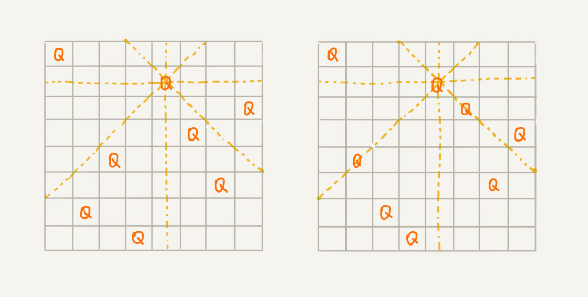

---
date: "2019-06-23"
---  
      
# 39 | 回溯算法：从电影《蝴蝶效应》中学习回溯算法的核心思想
我们在[第31节](https://time.geekbang.org/column/article/70891)提到，深度优先搜索算法利用的是回溯算法思想。这个算法思想非常简单，但是应用却非常广泛。它除了用来指导像深度优先搜索这种经典的算法设计之外，还可以用在很多实际的软件开发场景中，比如正则表达式匹配、编译原理中的语法分析等。

除此之外，很多经典的数学问题都可以用回溯算法解决，比如数独、八皇后、0-1背包、图的着色、旅行商问题、全排列等等。既然应用如此广泛，我们今天就来学习一下这个算法思想，看看它是如何指导我们解决问题的。

## 如何理解“回溯算法”？

在我们的一生中，会遇到很多重要的岔路口。在岔路口上，每个选择都会影响我们今后的人生。有的人在每个岔路口都能做出最正确的选择，最后生活、事业都达到了一个很高的高度；而有的人一路选错，最后碌碌无为。如果人生可以量化，那如何才能在岔路口做出最正确的选择，让自己的人生“最优”呢？

我们可以借助前面学过的贪心算法，在每次面对岔路口的时候，都做出看起来最优的选择，期望这一组选择可以使得我们的人生达到“最优”。但是，我们前面也讲过，贪心算法并不一定能得到最优解。那有没有什么办法能得到最优解呢？

2004年上映了一部非常著名的电影《蝴蝶效应》，讲的就是主人公为了达到自己的目标，一直通过回溯的方法，回到童年，在关键的岔路口，重新做选择。当然，这只是科幻电影，我们的人生是无法倒退的，但是这其中蕴含的思想其实就是回溯算法。

<!-- [[[read_end]]] -->

笼统地讲，回溯算法很多时候都应用在“搜索”这类问题上。不过这里说的搜索，并不是狭义的指我们前面讲过的图的搜索算法，而是在一组可能的解中，搜索满足期望的解。

回溯的处理思想，有点类似枚举搜索。我们枚举所有的解，找到满足期望的解。为了有规律地枚举所有可能的解，避免遗漏和重复，我们把问题求解的过程分为多个阶段。每个阶段，我们都会面对一个岔路口，我们先随意选一条路走，当发现这条路走不通的时候（不符合期望的解），就回退到上一个岔路口，另选一种走法继续走。

理论的东西还是过于抽象，老规矩，我还是举例说明一下。我举一个经典的回溯例子，我想你可能已经猜到了，那就是八皇后问题。

我们有一个8x8的棋盘，希望往里放8个棋子（皇后），每个棋子所在的行、列、对角线都不能有另一个棋子。你可以看我画的图，第一幅图是满足条件的一种方法，第二幅图是不满足条件的。八皇后问题就是期望找到所有满足这种要求的放棋子方式。



我们把这个问题划分成8个阶段，依次将8个棋子放到第一行、第二行、第三行……第八行。在放置的过程中，我们不停地检查当前放法，是否满足要求。如果满足，则跳到下一行继续放置棋子；如果不满足，那就再换一种放法，继续尝试。

回溯算法非常适合用递归代码实现，所以，我把八皇后的算法翻译成代码。我在代码里添加了详细的注释，你可以对比着看下。如果你之前没有接触过八皇后问题，建议你自己用熟悉的编程语言实现一遍，这对你理解回溯思想非常有帮助。

```
    int[] result = new int[8];//全局或成员变量,下标表示行,值表示queen存储在哪一列
    public void cal8queens(int row) { // 调用方式：cal8queens(0);
      if (row == 8) { // 8个棋子都放置好了，打印结果
        printQueens(result);
        return; // 8行棋子都放好了，已经没法再往下递归了，所以就return
      }
      for (int column = 0; column < 8; ++column) { // 每一行都有8中放法
        if (isOk(row, column)) { // 有些放法不满足要求
          result[row] = column; // 第row行的棋子放到了column列
          cal8queens(row+1); // 考察下一行
        }
      }
    }
    
    private boolean isOk(int row, int column) {//判断row行column列放置是否合适
      int leftup = column - 1, rightup = column + 1;
      for (int i = row-1; i >= 0; --i) { // 逐行往上考察每一行
        if (result[i] == column) return false; // 第i行的column列有棋子吗？
        if (leftup >= 0) { // 考察左上对角线：第i行leftup列有棋子吗？
          if (result[i] == leftup) return false;
        }
        if (rightup < 8) { // 考察右上对角线：第i行rightup列有棋子吗？
          if (result[i] == rightup) return false;
        }
        --leftup; ++rightup;
      }
      return true;
    }
    
    private void printQueens(int[] result) { // 打印出一个二维矩阵
      for (int row = 0; row < 8; ++row) {
        for (int column = 0; column < 8; ++column) {
          if (result[row] == column) System.out.print("Q ");
          else System.out.print("* ");
        }
        System.out.println();
      }
      System.out.println();
    }
    

```

## 两个回溯算法的经典应用

回溯算法的理论知识很容易弄懂。不过，对于新手来说，比较难的是用递归来实现。所以，我们再通过两个例子，来练习一下回溯算法的应用和实现。

### 1.0-1背包

0-1背包是非常经典的算法问题，很多场景都可以抽象成这个问题模型。这个问题的经典解法是动态规划，不过还有一种简单但没有那么高效的解法，那就是今天讲的回溯算法。动态规划的解法我下一节再讲，我们先来看下，如何用回溯法解决这个问题。

0-1背包问题有很多变体，我这里介绍一种比较基础的。我们有一个背包，背包总的承载重量是Wkg。现在我们有n个物品，每个物品的重量不等，并且不可分割。我们现在期望选择几件物品，装载到背包中。在不超过背包所能装载重量的前提下，如何让背包中物品的总重量最大？

实际上，背包问题我们在贪心算法那一节，已经讲过一个了，不过那里讲的物品是可以分割的，我可以装某个物品的一部分到背包里面。今天讲的这个背包问题，物品是不可分割的，要么装要么不装，所以叫0-1背包问题。显然，这个问题已经无法通过贪心算法来解决了。我们现在来看看，用回溯算法如何来解决。

对于每个物品来说，都有两种选择，装进背包或者不装进背包。对于n个物品来说，总的装法就有2\^n种，去掉总重量超过Wkg的，从剩下的装法中选择总重量最接近Wkg的。不过，我们如何才能不重复地穷举出这2\^n种装法呢？

这里就可以用回溯的方法。我们可以把物品依次排列，整个问题就分解为了n个阶段，每个阶段对应一个物品怎么选择。先对第一个物品进行处理，选择装进去或者不装进去，然后再递归地处理剩下的物品。描述起来很费劲，我们直接看代码，反而会更加清晰一些。

这里还稍微用到了一点搜索剪枝的技巧，就是当发现已经选择的物品的重量超过Wkg之后，我们就停止继续探测剩下的物品。你可以看我写的具体的代码。

```
    public int maxW = Integer.MIN_VALUE; //存储背包中物品总重量的最大值
    // cw表示当前已经装进去的物品的重量和；i表示考察到哪个物品了；
    // w背包重量；items表示每个物品的重量；n表示物品个数
    // 假设背包可承受重量100，物品个数10，物品重量存储在数组a中，那可以这样调用函数：
    // f(0, 0, a, 10, 100)
    public void f(int i, int cw, int[] items, int n, int w) {
      if (cw == w || i == n) { // cw==w表示装满了;i==n表示已经考察完所有的物品
        if (cw > maxW) maxW = cw;
        return;
      }
      f(i+1, cw, items, n, w);
      if (cw + items[i] <= w) {// 已经超过可以背包承受的重量的时候，就不要再装了
        f(i+1,cw + items[i], items, n, w);
      }
    }
    

```

### 2.正则表达式

看懂了0-1背包问题，我们再来看另外一个例子，正则表达式匹配。

对于一个开发工程师来说，正则表达式你应该不陌生吧？在平时的开发中，或多或少都应该用过。实际上，正则表达式里最重要的一种算法思想就是回溯。

正则表达式中，最重要的就是通配符，通配符结合在一起，可以表达非常丰富的语义。为了方便讲解，我假设正则表达式中只包含“\*”和“\?”这两种通配符，并且对这两个通配符的语义稍微做些改变，其中，“\*”匹配任意多个（大于等于0个）任意字符，“\?”匹配零个或者一个任意字符。基于以上背景假设，我们看下，如何用回溯算法，判断一个给定的文本，能否跟给定的正则表达式匹配？

我们依次考察正则表达式中的每个字符，当是非通配符时，我们就直接跟文本的字符进行匹配，如果相同，则继续往下处理；如果不同，则回溯。

如果遇到特殊字符的时候，我们就有多种处理方式了，也就是所谓的岔路口，比如“\*”有多种匹配方案，可以匹配任意个文本串中的字符，我们就先随意的选择一种匹配方案，然后继续考察剩下的字符。如果中途发现无法继续匹配下去了，我们就回到这个岔路口，重新选择一种匹配方案，然后再继续匹配剩下的字符。

有了前面的基础，是不是这个问题就好懂多了呢？我把这个过程翻译成了代码，你可以结合着一块看下，应该有助于你理解。

```
    public class Pattern {
      private boolean matched = false;
      private char[] pattern; // 正则表达式
      private int plen; // 正则表达式长度
    
      public Pattern(char[] pattern, int plen) {
        this.pattern = pattern;
        this.plen = plen;
      }
    
      public boolean match(char[] text, int tlen) { // 文本串及长度
        matched = false;
        rmatch(0, 0, text, tlen);
        return matched;
      }
    
      private void rmatch(int ti, int pj, char[] text, int tlen) {
        if (matched) return; // 如果已经匹配了，就不要继续递归了
        if (pj == plen) { // 正则表达式到结尾了
          if (ti == tlen) matched = true; // 文本串也到结尾了
          return;
        }
        if (pattern[pj] == '*') { // *匹配任意个字符
          for (int k = 0; k <= tlen-ti; ++k) {
            rmatch(ti+k, pj+1, text, tlen);
          }
        } else if (pattern[pj] == '?') { // ?匹配0个或者1个字符
          rmatch(ti, pj+1, text, tlen);
          rmatch(ti+1, pj+1, text, tlen);
        } else if (ti < tlen && pattern[pj] == text[ti]) { // 纯字符匹配才行
          rmatch(ti+1, pj+1, text, tlen);
        }
      }
    }
    

```

## 内容小结

回溯算法的思想非常简单，大部分情况下，都是用来解决广义的搜索问题，也就是，从一组可能的解中，选择出一个满足要求的解。回溯算法非常适合用递归来实现，在实现的过程中，剪枝操作是提高回溯效率的一种技巧。利用剪枝，我们并不需要穷举搜索所有的情况，从而提高搜索效率。

尽管回溯算法的原理非常简单，但是却可以解决很多问题，比如我们开头提到的深度优先搜索、八皇后、0-1背包问题、图的着色、旅行商问题、数独、全排列、正则表达式匹配等等。如果感兴趣的话，你可以自己搜索研究一下，最好还能用代码实现一下。如果这几个问题都能实现的话，你基本就掌握了回溯算法。

## 课后思考

现在我们对今天讲到的0-1背包问题稍加改造，如果每个物品不仅重量不同，价值也不同。如何在不超过背包重量的情况下，让背包中的总价值最大？

欢迎留言和我分享，也欢迎点击“请朋友读”，把今天的内容分享给你的好友，和他一起讨论、学习。