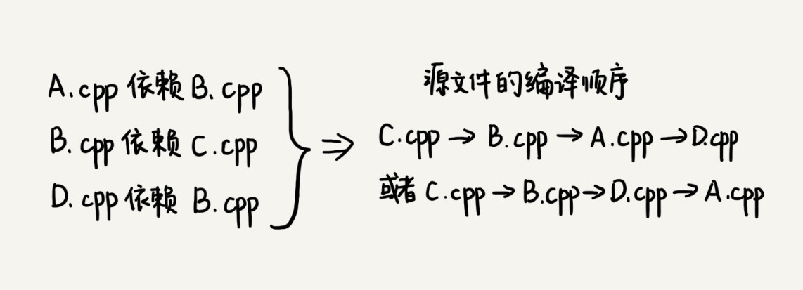

---
date: "2019-06-23"
---  
      
# 43 | 拓扑排序：如何确定代码源文件的编译依赖关系？
从今天开始，我们就进入了专栏的高级篇。相对基础篇，高级篇涉及的知识点，都比较零散，不是太系统。所以，我会围绕一个实际软件开发的问题，在阐述具体解决方法的过程中，将涉及的知识点给你详细讲解出来。

所以，相较于基础篇“**开篇问题-知识讲解-回答开篇-总结-课后思考**”这样的文章结构，高级篇我稍作了些改变，大致分为这样几个部分：“**问题阐述-算法解析-总结引申-课后思考**”。

好了，现在，我们就进入高级篇的第一节，如何确定代码源文件的编译依赖关系？

我们知道，一个完整的项目往往会包含很多代码源文件。编译器在编译整个项目的时候，需要按照依赖关系，依次编译每个源文件。比如，A.cpp依赖B.cpp，那在编译的时候，编译器需要先编译B.cpp，才能编译A.cpp。

编译器通过分析源文件或者程序员事先写好的编译配置文件（比如Makefile文件），来获取这种局部的依赖关系。**那编译器又该如何通过源文件两两之间的局部依赖关系，确定一个全局的编译顺序呢？**



## 算法解析

这个问题的解决思路与“图”这种数据结构的一个经典算法“拓扑排序算法”有关。那什么是拓扑排序呢？这个概念很好理解，我们先来看一个生活中的拓扑排序的例子。

我们在穿衣服的时候都有一定的顺序，我们可以把这种顺序想成，衣服与衣服之间有一定的依赖关系。比如说，你必须先穿袜子才能穿鞋，先穿内裤才能穿秋裤。假设我们现在有八件衣服要穿，它们之间的两两依赖关系我们已经很清楚了，那如何安排一个穿衣序列，能够满足所有的两两之间的依赖关系？

<!-- [[[read_end]]] -->

这就是个拓扑排序问题。从这个例子中，你应该能想到，在很多时候，拓扑排序的序列并不是唯一的。你可以看我画的这幅图，我找到了好几种满足这些局部先后关系的穿衣序列。


弄懂了这个生活中的例子，开篇的关于编译顺序的问题，你应该也有思路了。开篇问题跟这个问题的模型是一样的，也可以抽象成一个拓扑排序问题。

拓扑排序的原理非常简单，我们的重点应该放到拓扑排序的实现上面。

我前面多次讲过，算法是构建在具体的数据结构之上的。针对这个问题，我们先来看下，如何将问题背景抽象成具体的数据结构？

我们可以把源文件与源文件之间的依赖关系，抽象成一个有向图。每个源文件对应图中的一个顶点，源文件之间的依赖关系就是顶点之间的边。

如果a先于b执行，也就是说b依赖于a，那么就在顶点a和顶点b之间，构建一条从a指向b的边。而且，这个图不仅要是有向图，还要是一个有向无环图，也就是不能存在像a->b->c->a这样的循环依赖关系。因为图中一旦出现环，拓扑排序就无法工作了。实际上，拓扑排序本身就是基于有向无环图的一个算法。

```
    public class Graph {
      private int v; // 顶点的个数
      private LinkedList<Integer> adj[]; // 邻接表
    
      public Graph(int v) {
        this.v = v;
        adj = new LinkedList[v];
        for (int i=0; i<v; ++i) {
          adj[i] = new LinkedList<>();
        }
      }
    
      public void addEdge(int s, int t) { // s先于t，边s->t
        adj[s].add(t);
      }
    }
    

```

数据结构定义好了，现在，我们来看，**如何在这个有向无环图上，实现拓扑排序**？

拓扑排序有两种实现方法，都不难理解。它们分别是**Kahn算法**和**DFS深度优先搜索算法**。我们依次来看下它们都是怎么工作的。

### 1.Kahn算法

Kahn算法实际上用的是贪心算法思想，思路非常简单、好懂。

定义数据结构的时候，如果s需要先于t执行，那就添加一条s指向t的边。所以，如果某个顶点入度为0， 也就表示，没有任何顶点必须先于这个顶点执行，那么这个顶点就可以执行了。

我们先从图中，找出一个入度为0的顶点，将其输出到拓扑排序的结果序列中（对应代码中就是把它打印出来），并且把这个顶点从图中删除（也就是把这个顶点可达的顶点的入度都减1）。我们循环执行上面的过程，直到所有的顶点都被输出。最后输出的序列，就是满足局部依赖关系的拓扑排序。

我把Kahn算法用代码实现了一下，你可以结合着文字描述一块看下。不过，你应该能发现，这段代码实现更有技巧一些，并没有真正删除顶点的操作。代码中有详细的注释，你自己来看，我就不多解释了。

```
    public void topoSortByKahn() {
      int[] inDegree = new int[v]; // 统计每个顶点的入度
      for (int i = 0; i < v; ++i) {
        for (int j = 0; j < adj[i].size(); ++j) {
          int w = adj[i].get(j); // i->w
          inDegree[w]++;
        }
      }
      LinkedList<Integer> queue = new LinkedList<>();
      for (int i = 0; i < v; ++i) {
        if (inDegree[i] == 0) queue.add(i);
      }
      while (!queue.isEmpty()) {
        int i = queue.remove();
        System.out.print("->" + i);
        for (int j = 0; j < adj[i].size(); ++j) {
          int k = adj[i].get(j);
          inDegree[k]--;
          if (inDegree[k] == 0) queue.add(k);
        }
      }
    }
    

```

### 2.DFS算法

图上的深度优先搜索我们前面已经讲过了，实际上，拓扑排序也可以用深度优先搜索来实现。不过这里的名字要稍微改下，更加确切的说法应该是深度优先遍历，遍历图中的所有顶点，而非只是搜索一个顶点到另一个顶点的路径。

关于这个算法的实现原理，我先把代码贴在下面，下面给你具体解释。

```
    public void topoSortByDFS() {
      // 先构建逆邻接表，边s->t表示，s依赖于t，t先于s
      LinkedList<Integer> inverseAdj[] = new LinkedList[v];
      for (int i = 0; i < v; ++i) { // 申请空间
        inverseAdj[i] = new LinkedList<>();
      }
      for (int i = 0; i < v; ++i) { // 通过邻接表生成逆邻接表
        for (int j = 0; j < adj[i].size(); ++j) {
          int w = adj[i].get(j); // i->w
          inverseAdj[w].add(i); // w->i
        }
      }
      boolean[] visited = new boolean[v];
      for (int i = 0; i < v; ++i) { // 深度优先遍历图
        if (visited[i] == false) {
          visited[i] = true;
          dfs(i, inverseAdj, visited);
        }
      }
    }
    
    private void dfs(
        int vertex, LinkedList<Integer> inverseAdj[], boolean[] visited) {
      for (int i = 0; i < inverseAdj[vertex].size(); ++i) {
        int w = inverseAdj[vertex].get(i);
        if (visited[w] == true) continue;
        visited[w] = true;
        dfs(w, inverseAdj, visited);
      } // 先把vertex这个顶点可达的所有顶点都打印出来之后，再打印它自己
      System.out.print("->" + vertex);
    }
    

```

这个算法包含两个关键部分。

第一部分是**通过邻接表构造逆邻接表**。邻接表中，边s->t表示s先于t执行，也就是t要依赖s。在逆邻接表中，边s->t表示s依赖于t，s后于t执行。为什么这么转化呢？这个跟我们这个算法的实现思想有关。

第二部分是这个算法的核心，也就是**递归处理每个顶点**。对于顶点vertex来说，我们先输出它可达的所有顶点，也就是说，先把它依赖的所有的顶点输出了，然后再输出自己。

到这里，用Kahn算法和DFS算法求拓扑排序的原理和代码实现都讲完了。我们来看下，**这两个算法的时间复杂度分别是多少呢？**

从Kahn代码中可以看出来，每个顶点被访问了一次，每个边也都被访问了一次，所以，Kahn算法的时间复杂度就是O\(V+E\)（V表示顶点个数，E表示边的个数）。

DFS算法的时间复杂度我们之前分析过。每个顶点被访问两次，每条边都被访问一次，所以时间复杂度也是O\(V+E\)。

注意，这里的图可能不是连通的，有可能是有好几个不连通的子图构成，所以，E并不一定大于V，两者的大小关系不确定。所以，在表示时间复杂度的时候，V、E都要考虑在内。

## 总结引申

在基础篇中，关于“图”，我们讲了图的定义和存储、图的广度和深度优先搜索。今天，我们又讲了一个关于图的算法，拓扑排序。

拓扑排序应用非常广泛，解决的问题的模型也非常一致。凡是需要通过局部顺序来推导全局顺序的，一般都能用拓扑排序来解决。除此之外，拓扑排序还能检测图中环的存在。对于Kahn算法来说，如果最后输出出来的顶点个数，少于图中顶点个数，图中还有入度不是0的顶点，那就说明，图中存在环。

关于图中环的检测，我们在[递归](https://time.geekbang.org/column/article/41440)那一节讲过一个例子，在查找最终推荐人的时候，可能会因为脏数据，造成存在循环推荐，比如，用户A推荐了用户B，用户B推荐了用户C，用户C又推荐了用户A。如何避免这种脏数据导致的无限递归？这个问题，我当时留给你思考了，现在是时候解答了。

实际上，这就是环的检测问题。因为我们每次都只是查找一个用户的最终推荐人，所以，我们并不需要动用复杂的拓扑排序算法，而只需要记录已经访问过的用户ID，当用户ID第二次被访问的时候，就说明存在环，也就说明存在脏数据。

```
    HashSet<Integer> hashTable = new HashSet<>(); // 保存已经访问过的actorId
    long findRootReferrerId(long actorId) {
      if (hashTable.contains(actorId)) { // 存在环
        return;
      }
      hashTable.add(actorId);
      Long referrerId = 
           select referrer_id from [table] where actor_id = actorId;
      if (referrerId == null) return actorId;
      return findRootReferrerId(referrerId);
    }
    

```

如果把这个问题改一下，我们想要知道，数据库中的所有用户之间的推荐关系了，有没有存在环的情况。这个问题，就需要用到拓扑排序算法了。我们把用户之间的推荐关系，从数据库中加载到内存中，然后构建成今天讲的这种有向图数据结构，再利用拓扑排序，就可以快速检测出是否存在环了。

## 课后思考

1.  在今天的讲解中，我们用图表示依赖关系的时候，如果a先于b执行，我们就画一条从a到b的有向边；反过来，如果a先于b，我们画一条从b到a的有向边，表示b依赖a，那今天讲的Kahn算法和DFS算法还能否正确工作呢？如果不能，应该如何改造一下呢？

2.  我们今天讲了两种拓扑排序算法的实现思路，Kahn算法和DFS深度优先搜索算法，如果换做BFS广度优先搜索算法，还可以实现吗？

欢迎留言和我分享，也欢迎点击“请朋友读”，把今天的内容分享给你的好友，和他一起讨论、学习。