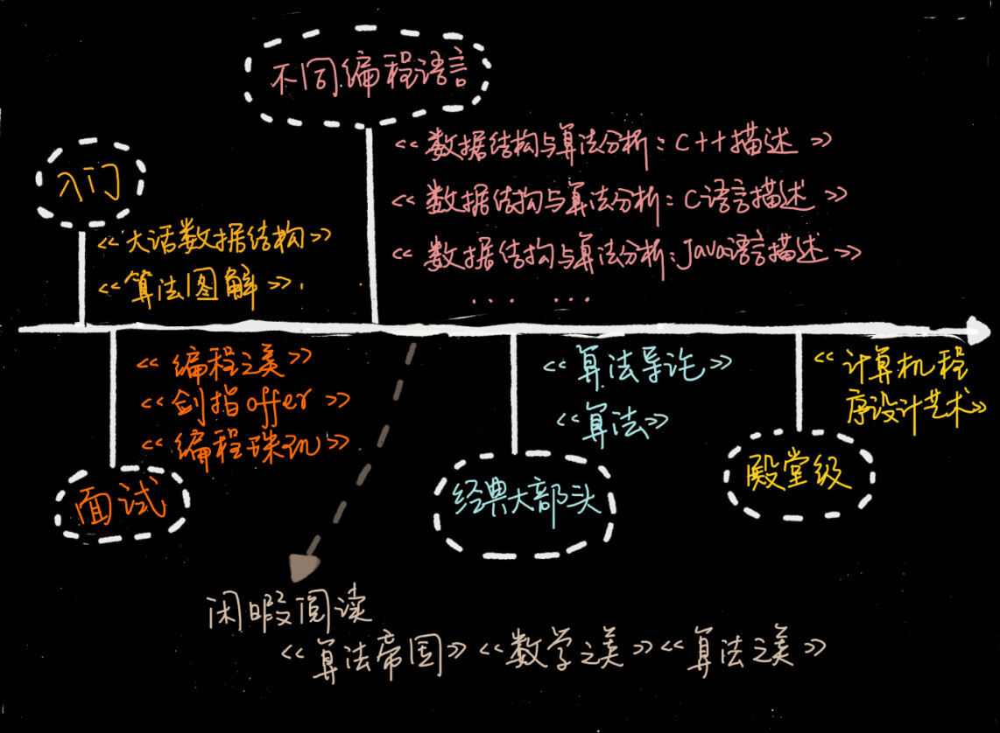

---
date: "2019-06-23"
---  
      
# 不定期福利第一期 | 数据结构与算法学习书单
你好，我是王争。欢迎来到不定期更新的周末福利时间。

专栏已经上线两周了，看到这么多人在留言区写下自己的疑惑或者观点，我特别开心。在留言里，很多同学让我推荐一些学习数据结构与算法的书籍。因此我特意跟编辑商量了，给你一个周末福利。所以这一期呢，我们就来聊一聊数据结构和算法学习过程中有哪些必读书籍。

有的同学还在读大学，代码还没写过几行；有的同学已经工作数十年，这之间的差别还是挺大的。而不同基础的人，适宜看的书是完全不一样的。因此，**针对不同层次、不同语言的同学，我分别推荐了不同的书**。希望每个同学，都能找到适合自己的学习资料，都能在现有水平上有所提高。

## 针对入门的趣味书

入门的同学，我建议你不要过度追求上去就看经典书。像《算法导论》《算法》这些书，虽然比较经典、比较权威，但是非常厚。初学就去啃这些书肯定会很费劲。而一旦啃不下来，挫败感就会很强。所以，入门的同学，我建议你找一些比较容易看的书来看，比如《大话数据结构》和《算法图解》。**不要太在意书写得深浅，重要的是能不能坚持看完。**

《**大话数据结构**》 这本书最大的特点是，它把理论讲得很有趣，不枯燥。而且每个数据结构和算法，作者都结合生活中的例子进行了讲解，能让你有非常直观的感受。虽然这本书有400多页，但是花两天时间读完，应该是没问题的。如果你之前完全不懂数据结构和算法，可以先从这本书看起。

<!-- [[[read_end]]] -->

《**算法图解**》 跟《大话数据结构》走的是同样的路线，就像这本书副标题写的那样，“像小说一样有趣的算法入门书”，主打“图解”，通俗易懂。它只有不到200页，所以内容比较少。作为入门，看看这本书，能让你对数据结构和算法有个大概的认识。

这些入门书共同的问题是，缺少细节，不够系统，也不够严谨。所以，如果你想要系统地学数据结构和算法，看这两本书肯定是不够的。

## 针对特定编程语言的教科书

讲数据结构和算法，肯定会跟代码实现挂钩。所以，很多人就很关心，某某书籍是用什么语言实现的，是不是自己熟悉的语言。市面大部分数据结构和算法书籍都是用C、C++、Java语言实现的，还有些是用伪代码。而使用Python、Go、PHP、JavaScript、Objective-C这些编程语言实现的就更少了。

我这里推荐《数据结构和算法分析》。国内外很多大学都拿这本书当作教材。这本书非常系统、全面、严谨，而且又不是特别难，适合对数据结构和算法有些了解，并且掌握了至少一门编程语言的同学。而且，这个作者也很用心。他用了三种语言，写了三个版本，分别是：《**数据结构与算法分析 ：C语言描述**》《**数据结构与算法分析：C++描述**》《**数据结构与算法分析：Java语言描述**》。

如果你熟悉的是Python或者JavaScript，可以参考《**数据结构与算法JavaScript描述**》《**数据结构与算法：Python语言描述**》 。至于其他语言的算法书籍，确实比较少。如果你有推荐，可以在留言区补充一下。

## 面试必刷的宝典

算法对面试很重要，很多人也很关心。我这里推荐几本有益于面试的书籍，分别是：《剑指offer》《编程珠玑》《编程之美》。

从《**剑指offer**》这本书的名字就可以看出，作者的写作目的非常明确，就是为了面试。这本书几乎包含了所有常见的、经典的面试题。如果能搞懂这本书里的内容，应付一般公司的面试应该不成问题。

《**编程珠玑**》这本书的豆瓣评分非常高，有9分。这本书最大的特色就是讲了很多针对海量数据的处理技巧。这个可能是其他算法书籍很少涉及的。面试的时候，海量数据处理的问题也是经常会问的，特别是校招面试。不管是开拓眼界，还是应付面试，这本书都很值得一看。

《**编程之美**》这本书有多位作者，其中绝大部分是微软的工程师，所以书的质量很有保证。不过，这里面的算法题目稍微有点难，也不是很系统，这也是我把它归到面试这一部分的原因。如果你有一定基础，也喜欢钻研些算法问题，或者要面试Google、Facebook这样的公司，可以拿这本书里的题，先来自测一下。

## 经典大部头

很多人一提到算法书就会搬出《算法导论》和《算法》。这两本确实非常经典，但是都太厚了，看起来比较费劲，我估计很少有人能坚持全部看下来。如果你想更加深入地学一学数据结构和算法，我还是强烈建议你看看。

我个人觉得，《**算法导论**》这本书的章节安排不是循序渐进的，里面充斥着各种算法的正确性、复杂度的证明、推导，数学公式比较多，一般人看起来会比较吃力。所以，作为入门书籍，并不是很推荐。

《**算法**》这本书也是一本经典大部头，不过它比起《算法导论》来要友好很多，更容易看懂，更适合初学者入门。但是这本书的缺点也很明显，就是内容不够全面，比如动态规划这么重要的知识点，这本书就没有讲。对于数据结构的东西，它讲的也不多，基本就是偏重讲算法。

## 殿堂级经典

说到殿堂级经典书，如果《**计算机程序设计艺术**》称第二，我想没人敢称第一。这本书包括很多卷。说实话，我也只看过比较简单的几卷，比如《基本算法》《排序和查找》。

这套书的深度、广度、系统性、全面性是其他所有数据结构和算法书籍都无法相比的。但是，如果你对算法和数据结构不是特别感兴趣，没有很好的数学、算法、计算机基础，想要把这套书读完、读懂是比较难的。你可以把它当作你算法学习的终极挑战。

## 闲暇阅读

算法无处不在。我这里再推荐几本适合闲暇时间阅读的书：《**算法帝国**》《**数学之美**》《**算法之美**》。

这些书共同的特点是，都列举了大量的例子，非常通俗易懂。夸张点说，像《算法帝国》，文科生都能读懂。当你看这些书的时候，你常常会深深感受到算法的力量，被算法的优美之处折服。即便不是从事IT工作的，看完这几本书也可以开拓眼界。

书籍差不多就是这些。除此之外，留言区很多人问到算法的实现语言。我这里也解释一下。因为我现在比较常用的编程语言是Java。所以，在专栏里，特别简单的、不涉及高级语法的，我会用Java或者C、C++来实现。稍微复杂的，为了让你能看懂，我会用伪代码。所以你完全不用担心语言的问题。

每节课中有需要代码实现的数据结构和算法，我都另外用Java语言实现一遍，然后放到Github上，供你参考。Github的地址我放在这里，你可以收藏一下：<https://github.com/wangzheng0822/algo>。

至于其他语言的同学，比如C、C++、Python、Go、PHP、JavaScript、Objective-C等，我想了一个crowd sourcing的方法。

我希望基础较好的同学，参照我的Java实现，用你熟悉的编程语言再实现一遍，并且将代码留言给我。如果你写得正确，我会将你的代码上传到Github上，分享给更多人。

还有人问，我学完这个专栏，就可以拿下数据结构和算法吗？我想说的是，**每个人的基础、学习能力都不一样，掌握程度取决于你的努力程度**。除了你之外，没有人能百分之百保证你能掌握什么知识。

有的同学只是把每一节课听下来、看下来，就束之高阁，也不求甚解，那效果肯定会很差。而有些同学除了听、看之外，遇到不懂的会自己去查资料、看参考书籍，还会把我讲的数据结构和算法都认真地实现一遍，这样的学习效果自然就比只听一遍、看一遍要好很多。即便我已经尽我所能把这些知识讲得深入浅出，通俗易懂，但是学习依然还是要靠你自己啊。

这种答疑的方式也会成为我们之后的固定动作，我会把留言里有价值的问题和反馈沉淀下来，希望对你的日常学习起到补充作用。**如果你有什么看不懂、听不懂的地方，或者工作中有遇到算法问题、技术难题，欢迎写在留言区。**（我发现留言区里卧虎藏龙啊，没事儿可以多扫扫留言区。）

这次的周末福利时间就到这啦，我们下次见！