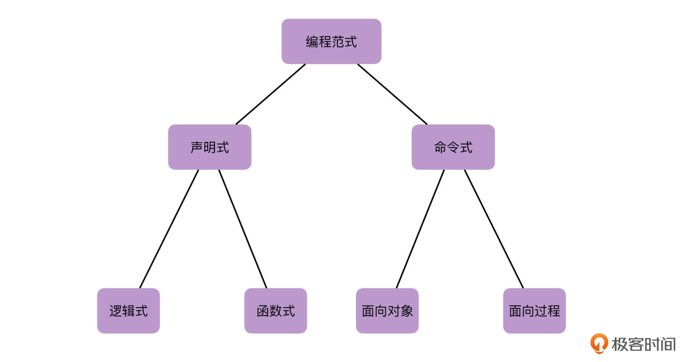

---
date: "2019-06-23"
---  
      
# 加餐一 | 初识Kotlin函数式编程
你好，我是朱涛。在上一节实战课当中，我们算是用Kotlin实践了一把函数式编程的思想。不过，上节课我们其实只是浅尝辄止，也不完全算是函数式编程，咱们只是借鉴了它的思想。

函数式编程（Functional Programming），是一个跟“[面向对象](https://time.geekbang.org/column/article/473349)”类似的概念，它也是软件工程中的一种编程范式，它是声明式编程（Declarative Programming）的一种，而与它相反的，我们叫做命令式编程（Imperative Programming）。

虽然说，Kotlin的函数式编程还不属于主流，但近几年它的关注度也越来越高了，所以今天我们就借着这节加餐，一起来简单聊聊Kotlin的函数式编程，也为上一节实战课做一个延伸。这样，等将来你想深入研究Kotlin函数式编程的时候，有了这节课的认知基础，也会更加轻松。

## 函数式与命令式的区别

那么，在介绍函数式编程之前，我们首先要来看几个编程范式的概念：声明式、命令式，还有四个常见的编程范式：函数式、逻辑式、面向过程、面向对象。它们之间的关系大致如下图所示：



我们的校园里学习编程的时候，一般都是学的C、Java，它们分别是面向过程语言、面向对象语言的代表，它们都属于“命令式”的范畴。

<!-- [[[read_end]]] -->

那么，想要理解“函数式”，我们首先就要理解什么是“命令式编程”，这是两种截然相反的编程范式。

所谓命令式编程，其实就是最常见的编程方式：**在编程的时候，我们需要告诉计算机每一步具体都要干什么。**比如说，我们要过滤集合当中所有的偶数，那么使用命令式编程的话，会需要以下几个步骤：

* 使用for循环遍历集合；
* 在for循环当中，取出集合元素，并且判断它是否能够被2整除；
* 对于能被2整除的元素，我们将它们添加到新的集合当中；
* 最后，返回新的集合。

具体来说，命令式的代码是这样的：

```
    fun foo(): List<Int> {
        val list = listOf(1, 2, 3, 4)
        val result = mutableListOf<Int>()
        for (i in list) {
            if (i % 2 == 0) {
                result.add(i)
            }
        }
    
        return result
    }
    

```

那么，如果是函数式，或者说“声明式”的代码呢？

```
    fun fp() = listOf(1, 2, 3, 4).filter { it % 2 == 0 }
    

```

这段代码，我们是使用了Kotlin标准库当中的filter方法，它是一个高阶函数，作用就是过滤符合要求的集合元素并且返回。而具体的过滤要求呢，我们会在Lambda表达式里传进来。  
由此我们也可以感受到，函数式风格的代码，它对比命令式的代码主要是有两个区别：

* 第一个区别是：它只需要声明我们想要什么，而不必关心底层如何实现。
* 第二个区别是：代码更加简洁，可读性更高。

在上节课的实战案例当中，我们3.0版本的词频统计程序，其实并没有完全发挥出Kotlin函数式编程的优势，因为其中的“getWordCount\(\)”“mapToList\(\)”都是我们自己实现的。事实上，我们完全可以借助Kotlin标准库函数来实现。

```
    fun processText(text: String): List<WordFreq> {
        return text
            .clean()
            .split(" ")
            .filter { it != "" }
            .groupBy { it }
            .map { WordFreq(it.key, it.value.size) }
            .sortedByDescending { it.frequency }
    }
    

```

根据这段代码我们可以看到，借助Kotlin库函数，我们用简单的几行代码，就成功实现了单词频率统计功能。这就是函数式编程的魅力。

要知道，我们1.0版本命令式的代码，足足有五十多行代码！这中间的差距是非常大的。

## 到底什么是函数式编程？

那么，到底什么是函数式编程呢？函数式编程在数学理论上的定义很复杂，而对于我们初次接触Kotlin函数式编程来说，其实我们需要记住两个重点：

* 函数是一等公民；
* 纯函数。

而以这两个点作为延伸，我们就可以扩展出很多函数式编程的其他概念。比如说，**函数是一等公民**，这就意味着：

* 函数可以独立于类之外，这就是Kotlin的[顶层函数](https://time.geekbang.org/column/article/475684)；
* 函数可以作为参数和返回值，这就是[高阶函数和Lambda](https://time.geekbang.org/column/article/476637)；
* 函数可以像变量一样，这就是函数的引用；
* 当函数的功能更加强大以后，我们就可以几乎可以做到：只使用函数来解决所有编程的问题。

再比如，对于**纯函数**的理解，这就意味着：

* 函数不应该有副作用。所谓副作用，就是“对函数作用域以外的数据进行修改”，而这就引出了函数式的**不变性**。在函数式编程当中，我们不应该修改任何变量，当我们需要修改变量的时候，我们要创建一份新的拷贝再做修改，然后再使用它（这里，你是不是马上就想到了数据类的copy方法呢？）。
* 无副作用的函数，它具有**幂等性**，换句话说就是：函数调用一次和调用N次，它们的效果是等价的。
* 无副作用的函数，它具有**引用透明**的特性。
* 无副作用的函数，它具有**无状态**的特性。

当然，函数式编程还有很多其他的特点，但是，在Kotlin当中，我们把握好“函数是一等公民”和“纯函数”这两个核心概念，就算初步理解了。

好，前面我们提到过，我们可以使用函数来解决所有编程问题，那么接下来，我们就来试试如何用函数来实现循环的功能吧。

## 实战：函数式的循环

for循环，是命令式编程当中最典型的语句。举个例子，我们想要计算从1到10的总和，使用for循环，我们很容易就可以写出这样的代码：

```
    fun loop(): Int {
        var result = 0
        for (i in 1..10) {
            result += i
        }
    
        return result
    }
    

```

上面的代码很简单，我们定义了一个result变量，然后在for循环当中，将每一个数字与其相加，最后返回result这个变量作为结果。这很明显就是在告诉计算机每一步应该做什么，这其实也是它叫做命令式风格的原因。

那么，如果不使用for循环，仅仅只使用函数，我们该如何实现这样的功能呢？答案其实很简单，那就是**递归**。

```
    fun recursionLoop(): Int {
        fun go(i: Int, sum: Int): Int =
            if (i > 10) sum else go(i + 1, sum + i)
    
        return go(1, 0)
    }
    

```

从这段代码当中，我们可以看到，在recursionLoop\(\)这个函数当中，我们定义了一个内部的函数go\(\)，它才是我们实现递归的核心函数。

在函数式编程当中，请不要觉得这种代码很奇怪，**毕竟咱们函数都是一等公民了，类的内部可以继续嵌套内部类，那函数里面为什么就不可以嵌套一个内部的函数呢？**

实际上，在函数式编程当中，我们有时候也会**使用递归来替代循环**。我们知道，递归都是有调用栈开销的，所以我们应该尽量使用[尾递归](https://zh.wikipedia.org/wiki/%25E5%25B0%25BE%25E8%25B0%2583%25E7%2594%25A8#%25E5%25B0%25BE%25E9%2580%2592%25E5%25BD%2592)。对于这种类型的递归，在经过栈复用优化以后，它的开销就可以忽略不计了，我们可以认为它的空间复杂度是O\(1\)。

```
    fun recursionLoop(): Int {
    // 变化在这里
    //     ↓
        tailrec fun go(i: Int, sum: Int): Int =
            if (i > 10) sum else go(i + 1, sum + i)
    
        return go(1, 0)
    }
    

```

当然，上面的递归思路只是为了说明我们可以用它替代循环。在实际的开发工作中，这种方式是不推荐的，毕竟它太绕了，对吧？如果要在工作中实现类似的需求，我们使用Kotlin集合操作符一行代码就能搞定：

```
    fun reduce() = (1..10).reduce { acc, i -> acc + i } // 结果 55
    

```

这里的reduce操作符也许你会觉得难以理解，没关系，Kotlin还为我们提供了另一个更简单的操作符，也就是sum：

```
    fun sum() = (1..10).sum() // 结果 55
    

```

在这里，我们也能发现一些问题：**使用Kotlin，我们运用不同的思维，可以写出截然不同的4种代码**。而即使同样都是函数式的思想的3种代码，它们之间的可读性也有很大的差异。

Kotlin官方一直宣扬自己是支持多种编程范式的语言，它不像某些语言，会强制你使用某种编程范式（比如C、Haskell等）。这样一来，面对不同的问题，我们开发者就可以灵活选择不同的范式进行编程。

而且，Kotlin也没有完全拥抱函数式编程，它只是在一些语法设计上，借鉴了函数式编程的思想，而且这种借鉴的行为也十分克制，比如[模式匹配](https://zh.wikipedia.org/zh-hans/%E6%A8%A1%E5%BC%8F%E5%8C%B9%E9%85%8D)、[类型类](https://zh.wikipedia.org/wiki/%E7%B1%BB%E5%9E%8B%E7%B1%BB)、[单子](<https://zh.wikipedia.org/wiki/单子_(函数式编程)>)。另外，函数式编程领域的很多高级概念，Kotlin也都没有天然支持，需要我们开发者自己去实现。对比起其他JVM的现代语言（如[Scala](https://zh.wikipedia.org/wiki/Scala)），**Kotlin也显得更加务实，有点“博采众长”的意味**。

## 小结

Kotlin作为一门刚出生不久的语言，它融合了很多现代化语言的特性，它在支持命令式编程的同时呢，也对“函数式编程”有着天然的亲和力。

命令式编程与函数式编程，它们之间本来就各有优劣。

函数式编程的优点在于，在部分场景下，它的开发效率高、可读性强，以及由于不变性、无状态等特点，更适合并发编程。而函数式编程的劣势也很明显，它的学习曲线十分陡峭、反直觉，由于自身特性的限制，往往会导致性能更差。所以，Kotlin函数式编程目前仍未成为主流，这是有一定道理的。

不过，随着2021年Android推出Jetpack Compose声明式UI框架，以及Kotlin官方推出的Compose Multiplatform以后，Kotlin函数式编程的关注度也被推向了一个前所未有的高度。总的来说，Kotlin函数式编程是一个非常大的话题，它自身就足够写一个完整的专栏了。如果有机会的话，我们在课程后面，还会再来详细聊聊Kotlin函数式编程在Compose当中的体现。

我相信，在不久的将来，Kotlin函数式编程的方式，一定会被更多的人认可和接受。

## 思考题

今天，咱们从“编程范式”聊到了Kotlin函数式编程，也请你说说你对“编程范式”以及“函数式编程”的理解吧。这个问题没有标准答案，请畅所欲言吧！