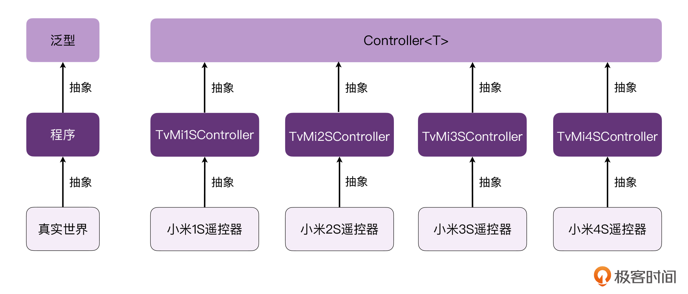
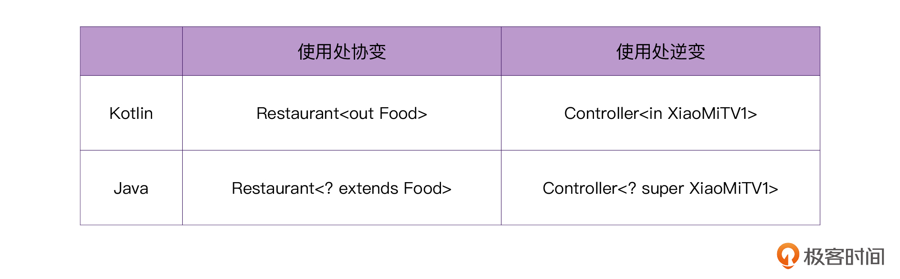
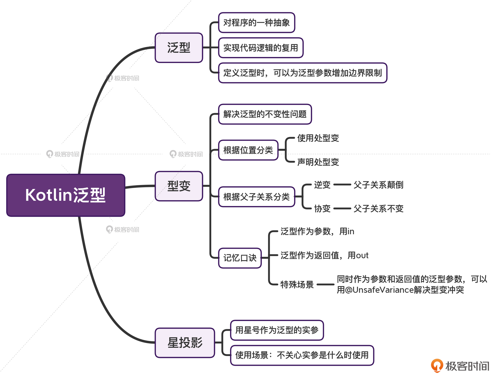

---
date: "2019-06-23"
---  
      
# 10 | 泛型：逆变or协变，傻傻分不清？
你好，我是朱涛。这节课我们来学习Kotlin的泛型（Generics），包括泛型基础、使用处型变、声明处型变以及星投影。

泛型，这个概念在很多编程语言里面都存在。在中大型软件开发当中，我们对泛型的使用也十分频繁，因为它可以让我们**在不同类型之间复用相似的逻辑代码**。

不管是Android领域，还是后端领域，泛型在软件的架构当中都有着举足轻重的地位。只有透彻理解了泛型，我们才能理解各种设计模式，进而才可能设计出合理的软件架构。

然而，想要学好泛型却不是一件容易的事情。这是因为，泛型实在太抽象了。

我们都知道，程序其实是对真实世界的抽象，比如我们在前面实战课里写的计算器程序，现实生活当中就有计算器这个东西，我们想要在电脑里写一个抽象的计算器程序，也不会那么难理解，因为它和现实生活相关。可是泛型，它是**对程序的抽象**。程序本来就已经够抽象了，我们还要在它的基础上再做一次抽象。

这样一来，泛型和我们真实的物理世界差了两层抽象，因此，泛型对于我们人类来说，会显得尤为虚无缥缈。


不过，程序其实也是源自于生活的。所以在这节课里，我会尽量用生活中的例子来给你解释下Kotlin的泛型概念，让你能更直观、更立体地感知到泛型与现实生活的联系，然后，你也能够从这些生活的场景中，更深刻地理解并掌握Kotlin的泛型，从而为你将来构建大型软件打好基础。

<!-- [[[read_end]]] -->

好，那么下面，我们就拿“遥控器”这个生活中常见的物件儿，来聊聊它跟“泛型”之间，都能产生哪些联系。

## 掌握泛型基础

在现实生活中，我们能看到各式各样的电视机遥控器，比如小米就有1S、2S、3S、4S电视遥控器。

那么，如果我们将遥控器的概念迁移到程序的世界，我们就需要定义各种各样的“遥控器类”，比如说：

```
    // 小米1S电视机遥控
    class TvMi1SController {
        fun turnOn() {}
        fun turnOff() {}
    }
    
    // 小米2S电视机遥控
    class TvMi2SController {
        fun turnOn() {}
        fun turnOff() {}
    }
    
    // 小米3S电视机遥控
    class TvMi3SController {
        fun turnOn() {}
        fun turnOff() {}
    }
    
    // 小米4S电视机遥控
    class TvMi4SController {
        fun turnOn() {}
        fun turnOff() {}
    }
    
    ...
    省略几千种不同的遥控器
    

```

从上面的代码我们可以看到，如果我们为每一个型号的电视机都创建一个对应的遥控器类，然后在里面重复编写“开机”“关机”的方法，我们的工作量会很大，而且没有意义。

这个时候，我们其实需要一个**万能遥控器**，而借助Kotlin的**泛型**，我们就可以很容易地实现了。

```
    //          T代表泛型的形参
    //               ↓
    class Controller<T> {
        fun turnOn(tv: T) {}
        fun turnOff(tv: T) {}
    }
    
    fun main() {
    //                                泛型的实参
    //                                   ↓
        val mi1Controller = Controller<XiaoMiTV1>()
        mi1Controller.turnOn()
    
    //                                  泛型的实参
    //                                     ↓
        val mi2Controller = Controller<XiaoMiTV2>()
        mi2Controller.turnOn()
    }
    

```

在这段代码里，我们定义了一个“万能遥控器类”`Controller<T>`，它当中的字母T代表了，这个遥控器可以控制很多种型号的电视，至于我们到底想要控制哪种型号，在使用的时候，只需要把T替换成实际的电视机型号即可。在上面的main函数当中，我们是传入了“XiaoMi1S”“XiaoMi2S”这两个型号。

可见，使用泛型的好处就在于，我们可以复用程序代码的逻辑，借助这个特性，我们可以在程序的基础上再做一次抽象。这样，通过这个`Controller<T>`，**不管将来有多少型号的电视机，我们都可以用这一个类来搞定。**



另外，我们在定义泛型的时候，其实还可以为它的泛型参数增加一些**边界限制**，比如说，强制要求传入的泛型参数，必须是TV或者是它的子类。这叫做泛型的**上界**。

```
    //               差别在这里
    //                   ↓
    class Controller<T: TV> {
        fun turnOn(tv: T) {}
        fun turnOff(tv: T) {}
    }
    

```

和Kotlin的[继承语法](https://time.geekbang.org/column/article/473349)一样，我们是使用冒号来表示泛型的边界。注意，当我们定义了边界之后，如果我们传入Controller的类型不是TV的子类，那么编译器是会报错的。

```
    fun main() {
        // 报错，因为Car不是TV的子类
        val controller = Controller<Car>()
    }
    

```

还有一点你也需要注意，由于函数是Kotlin当中的一等公民，所以你也可以用两个简单的函数turnOn\(\)和turnOff\(\)，来解决前面所说的“遥控器的问题”：

```
    //     函数的泛型参数
    //   ↓             ↓
    fun <T> turnOn(tv: T){ ... }
    fun <T> turnOff(tv: T){ ... }
    
    fun turnOnAll(mi1: XiaoMiTV1, mi2: XiaoMiTV2) {
    //      泛型实参自动推导
    //          ↓
        turnOn(mi1)
        turnOn(mi2)
    }
    

```

从上面的代码里我们可以看到，我们直接在fun关键字的后面加上用尖括号包起来的T，就可以为函数增加泛型支持。这里我们选择用字母“T”，完全是因为约定俗成，你将T改为其他英文字母也是不会影响编译的。

好了，泛型是什么、使用的好处、如何表示等问题，现在我们就都搞清楚了。下面我们再来看看学习泛型的一大难点：型变。

## 型变（Variance）

首先，型变是什么呢？

简单来说，它就是为了解决泛型的**不变性**问题。事实上，型变讨论的是：在已知Cat是Animal的子类的情况下，`MutableList<Cat>`与`MutableList<Animal>`之间是什么关系。

在正常情况下，编译器会认为它们两者是没有任何关系的。换句话，也就是说，**泛型是不变的**。Kotlin编译器会这样处理的原因也很简单，这里我们可以先来假设一下：如果编译器不阻止我们用`MutableList<Cat>`来替代`MutableList<Animal>`，代码会出什么问题呢？

```
    // 需要父类集合，传入子类集合
    
    foo(list: MutableList<Animal>) {
        // 出错，Cat集合不能存Dog对象
        list.add(Dog())
        // 通过
        val animal: Animal = list[0] // 取出的Cat对象
    }
    
    fun main() {
        // 需要MutableList<Animal>，实际传MutableList<Cat>
        foo(mutableListOf<Cat>(Cat()))
        // 实际上，编译器在这里就会提示错误，我们现在假设编译器不阻止我们，会出什么问题
    }
    

```

从这段代码的注释中，我们能看到，当程序需要Animal的集合时，如果我们传入的是Cat的集合，**我们就可以往list里添加其他类型的动物**，比如Dog。然而，Dog是无法存入Cat的集合的。

那么如果我们反过来呢？

```
    // 需要子类集合，传入父类集合
    
    foo(list: MutableList<Cat>) {
        // 通过
        list.add(Cat())
        // 出错
        val cat: Cat = list[0] // 实际取出来的是Animal对象
    }
    
    fun main() {
        // 需要MutableList<Cat>，实际传MutableList<Animal>
        foo(mutableListOf(Animal()))
        // 实际上，编译器在这里就会提示错误，我们现在假设编译器不阻止我们，会出什么问题
    }
    

```

我们会发现，反过来之后，当需要子类集合传入父类集合的时候，我们在函数体内部存储的行为是不会受到影响的，存储Cat、Animal类型都没问题。可是，一旦我们想从集合当中取出Cat对象的时候，会发现取出来的是Animal对象，这时候又错了。

所以，在默认情况下，编译器会认为`MutableList<Cat>`与`MutableList<Animal>`之间不存在任何继承关系，它们也无法互相替代，这样就不会出现前面提到的两种问题。这就是泛型的**不变性**。

但是啊，在某些特定场景下，编译器这种行为还是会给我们带来麻烦的。而这个时候，就需要泛型的**逆变与协变**了。具体是什么特定场景呢？别着急，下面我带你来看个例子。

### 逆变（Contravariant）

让我们继续以前面的遥控器为例：

```
    open class TV {
        open fun turnOn() {}
    }
    
    class XiaoMiTV1: TV() {
        override fun turnOn() {}
    }
    
    class Controller<T> {
        fun turnOn(tv: T)
    }
    

```

在这里，我们有一个电视机的父类，叫做TV，另外还有一个子类，叫做XiaoMiTV1。它们两者是继承关系。由于它们是父子的关系，当函数的参数需要TV这个父类的时候，我们是可以传入子类作为参数的。这很好理解，我们接着往下看：

```
    fun foo(tv: TV) {}
    
    fun main() {
    // 要求父类，可以传入子类
        foo(XiaoMiTV1())
    }
    

```

现在问题来了，`Controller<XiaoMiTV1>`和`Controller<TV>`之间是什么关系呢？让我们来设想一个**买遥控器的场景**：

```
    //                      需要一个小米电视1的遥控器
    //                                ↓
    fun buy(controller: Controller<XiaoMiTV1>) {
        val xiaoMiTV1 = XiaoMiTV1()
        // 打开小米电视1
        controller.turnOn(xiaoMiTV1)
    }
    

```

在上面的代码中，我们的函数需要一个“小米电视1的遥控器”，在函数的内部，我们需要打开一台小米电视机。那么，当我们需要打开一台小米电视机的时候，我们是否可以用一个“万能的遥控器”呢？当然可以！所以，我们可以写出下面这样的代码：

```
    fun main() {
    //                             实参
    //                              ↓
        val controller = Controller<TV>()
        // 传入万能遥控器，报错
        buy(controller)
    }
    

```

在这段代码中，由于我们传入的泛型实参是TV，它是所有电视机的父类。因此，Controller内部将会处理所有电视机型号的开机、关机。这时候，**它就相当于一个万能遥控器**，万能遥控器当然也可以打开小米电视1。

从道理上来讲，我们的推理是没有错的，不过Kotlin编译器会报错，报错的内容是说“类型不匹配”，需要的是小米遥控器`Controller<XiaoMiTV1>`，你却买了个万能遥控器`Controller<TV>`。在默认情况下，Kotlin编译器就是这么认死理。

所以，为了让我们的代码通过编译，我们需要主动告诉编译器一些额外的信息，具体的做法有两种。

**第一种做法**，是修改泛型参数的使用处代码，它叫做**使用处型变**。具体做法就是修改buy函数的声明，在XiaoMiTV1的前面增加一个in关键字：

```
    //                         变化在这里
    //                             ↓
    fun buy(controller: Controller<in XiaoMiTV1>) {
        val xiaoMiTV1 = XiaoMiTV1()
        // 打开小米电视1
        controller.turnOn(xiaoMiTV1)
    }
    

```

**第二种做法**，是修改Controller的源代码，这叫**声明处型变**。具体做法就是，在泛型形参T的前面增加一个关键字in：

```
    //            变化在这里
    //               ↓
    class Controller<in T> {
        fun turnOn(tv: T)
    }
    

```

我们使用以上任意一种方式修改后，代码就能够通过Kotlin编译了。这样修改之后，我们就可以使用`Controller<TV>`来替代`Controller<XiaoMiTV1>`，也就是说，`Controller<TV>`是`Controller<XiaoMiTV1>`的子类。


如果你足够细心，你会发现：在这个场景下，遥控器与电视机之间的父子关系颠倒了。“小米电视”是“电视”的子类，但是，“万能遥控”成了“小米遥控”的子类。这种父子关系颠倒的现象，我们就叫做“**泛型的逆变**”。上面这两种修改方式，就分别叫做**使用处逆变**和**声明处逆变**。

而除了父子关系颠倒的现象，泛型当中还存在一种父子关系一致的现象，也就是**泛型的协变**。

### 协变（Covariant）

这次，我们仍然以一个生活中的场景来做分析。现在，**请你想象一个点外卖的场景**。


为了模拟这个场景，我们需要用代码来描述其中的几个角色：普通的食物、肯德基的食物，它们两者之间是父子关系。

```
    open class Food {}
    
    class KFC: Food() {}
    

```

除此之外呢，我们还有一个饭店的角色：

```
    class Restaurant<T> {
        fun orderFood(): T { /*..*/ }
    }
    

```

在上面的Restaurant泛型参数处，我们传入不同的食物类型，就代表了不同类型的饭店。接下来，就是我们的点外卖方法了：

```
    //                      这里需要一家普通的饭店，随便什么饭店都行
    //                                     ↓
    fun orderFood(restaurant: Restaurant<Food>) {
        // 从这家饭店，点一份外卖
        val food = restaurant.orderFood()
    }
    
    fun main() {
    //                  找到一家肯德基
    //                        ↓
        val kfc = Restaurant<KFC>()
    // 需要普通饭店，传入了肯德基，编译器报错
        orderFood(kfc)
    }
    

```

如果我们直接运行上面的代码，会发现编译器提示最后一行代码报错，报错的原因同样是：“类型不匹配”，我们需要的是一家随便类型的饭店`Restaurant<Food>`，而传入的是肯德基`Restaurant<KFC>`，不匹配。

是不是觉得很荒谬？既然随便找一家饭店就能点外卖，为什么肯德基不可以呢？

不过，有了上次的经验，这次我们就轻车熟路了，由于编译器认死理，我们必须额外提供一些信息给编译器，让它知道我们是在特殊场景使用泛型。具体的做法呢，还是有两种。

**第一种做法**，还是修改泛型参数的使用处，也就是使用处型变。具体的做法就是修改orderFood\(\)函数的声明，在Food的前面增加一个out关键字：

```
    //                                变化在这里
    //                                    ↓
    fun orderFood(restaurant: Restaurant<out Food>) {
        // 从这家饭店，点一份外卖
        val food = restaurant.orderFood()
    }
    

```

**第二种做法**，是修改Restaurant的源代码，也就是声明处型变。具体做法就是，在它泛型形参T的前面增加一个关键字out：

```
    //            变化在这里
    //                ↓
    class Restaurant<out T> {
        fun orderFood(): T { /*..*/ }
    }
    

```

在做完以上任意一种修改以后，代码就可以通过编译了。这也就意味着，在这种情况下，我们可以使用`Restaurant<KFC>`替代`Restaurant<Food>`，也就意味着`Restaurant<KFC>`可以看作是`Restaurant<Food>`的子类。


到了这时候，你会发现，食物与饭店它们之间的父子关系一致了。这种现象，我们称之为“**泛型的协变**”。上面两种修改的方式，就分别叫做**使用处协变**和**声明处协变**。

需要特别注意的是，虽然Java当中也有型变的概念，但是呢，Java当中是没有声明处型变的。Java里面只有使用处型变，下面是它们的语法对比：



而通过对比，你也会发现，Java的型变语法十分抽象，远不如Kotlin来得简洁。

好了，到这里，我们就差不多把Kotlin的泛型这个特性理解清楚了，那么是不是就说明，我们可以开始实战了呢？其实还不行，我们还需要了解另一个跟泛型相关的概念，也就是星投影。

## 星投影（Star-Projections）

Kotlin当中还有一个概念叫做“星投影”。虽然你听起来可能会觉得这个词很吓人，但其实它的概念很简单。所谓的星投影，其实就是**用“星号”作为泛型的实参**。

那么，什么情况下，我们需要用星号作为泛型实参呢？答案其实也很简单，**当我们不关心实参到底是什么的时候**。

举个例子，我们现在需要开发一个“找饭店”的功能，借助泛型，我们可以写出这样的代码：

```
    fun <T> findRestaurant(): Restaurant<T> {}
    

```

不过，如果我们并不关心找到的饭店到底是什么类型，不管它是肯德基还是麦当劳的话，那么，我们就完全可以把“星号”作为泛型的实参，比如这样：

```
    class Restaurant<out T> {
        fun orderFood(): T {}
    }
    
    //                        把星号作为泛型实参
    //                               ↓
    fun findRestaurant(): Restaurant<*> {}
    
    fun main() {
        val restaurant = findRestaurant()
        // 注意这里
        val food: Any? = restaurant.orderFood() // 返回值可能是：任意类型
    }
    

```

在上面的代码当中，我们没有传递任何具体的类型给Restaurant，而是使用了“星号”作为Restaurant的泛型实参，因此，我们就无法知道饭店到底是什么类型。

相应的，当我们调用restaurant.orderFood\(\)的时候，就无法确定它返回的值到底是什么类型。这时候，变量food的实际类型可能是任意的，比如String、Int、Food、KFC，甚至可能是null，因此，在这里我们只能将其看作是“Any\?”类型。

那么，对于上面的这种food可能是任意类型的情况，我们有没有办法让food的类型更加精确一些呢？当然是有的。如果我们为Restaurant的泛型类型加上边界的话，food的类型就可以更精确一些。

```
    //                   区别在这里
    //                       ↓
    class Restaurant<out T: Food> {
        fun orderFood(): T {}
    }
    
    fun findRestaurant(): Restaurant<*> {}
    
    fun main() {
        val restaurant = findRestaurant()
        //       注意这里
        //          ↓
        val food: Food = restaurant.orderFood() // 返回值是：Food或其子类
    }
    

```

从这个例子我们能看到，当我们为Restaurant泛型类型增加了上界Food以后，即使我们使用了“星投影”，也仍然可以通过调用restaurant.orderFood\(\)，来拿到Food类型的变量。在这里，food的实际类型肯定是Food或者是Food的子类，因此我们可以将其看作是Food类型。

泛型虽然很抽象，但它存在的目的，仍然是为了解决我们生活的实际问题。所以，当我们将泛型应用到实际的生活场景时，它就显得不是那么抽象了。

## 实战与思考

在学完型变以后，也许你会有点迷惑：**到底什么时候用逆变，什么时候用协变**？如果你看过Kotlin的官方文档，你会看到一句这样的话：

> Consumer in, Producer out \!

直译的话，大概意思就是：消费者in，生产者out。不过，这个对我们中国人的说话语境而言，不是那么好理解。让我们继续根据前面的遥控器、点外卖两个场景，来做个说明。

```
    //              逆变
    //               ↓
    class Controller<in T> {
    //                 ①
    //                 ↓
        fun turnOn(tv: T)
    }
    
    //               协变
    //                ↓
    class Restaurant<out T> {
    //                   ②
    //                   ↓
        fun orderFood(): T { /*..*/ }
    }
    

```

在这段代码中，分别是我们前面提到的逆变、协变的例子。把它们两个放到一起后，你应该就能很容易地发现它们两个的差别了。需要特别留意的地方，我都在注释当中标记出来了，让我来解释给你听：

* 对于逆变的情况，我们模拟的是买遥控器的场景。请注意注释①的地方，我们的泛型T，它最终会以函数的参数的形式，被**传入**函数的**里面**，这往往是一种**写入**行为，这时候，我们使用关键字**in**。
* 对于协变的情况，我们模拟的是点外卖的场景。请注意注释②的地方，我们的泛型T，它最终会以返回值的形式，被**传出**函数的**外面**，这往往是一种**读取**行为，这时候，我们使用关键字**out**。

所以，如果要以更加通俗的语言来解释逆变与协变的使用场景的话，我们可以将其总结为：**传入in，传出out**。或者，我们也可以说：泛型作为**参数**的时候，用in，泛型作为**返回值**的时候，用out。

我们再来看一下Kotlin源码当中型变的应用。首先，是逆变的应用。

```
    //                          逆变
    //                           ↓
    public interface Comparable<in T> {
    //                                   泛型作为参数
    //                                       ↓
        public operator fun compareTo(other: T): Int
    }
    

```

在以上代码中，由于泛型是作为了compareTo方法的**参数**传入的，因此，对于Comparable的泛型T，我们应该使用**in**来修饰，这就是**逆变**的实际应用。

我们再来看看协变在Kotlin源码当中的应用。

```
    //                        协变
    //                         ↓
    public interface Iterator<out T> {
    //                         泛型作为返回值
    //                              ↓    
        public operator fun next(): T
        
        public operator fun hasNext(): Boolean
    }
    

```

从上面的代码里我们可以看到，由于泛型是作为next方法的**返回值**的，因此，对于Iterator的泛型T，我们应该使用**out**来修饰，这就是**协变**的应用。

我们再来看看[第2讲](https://time.geekbang.org/column/article/473349)当中密封类的代码案例，一起回顾下当中的泛型细节：

```
    sealed class Result<out R> {
    //                     协变    ①
    //                      ↓      ↓
        data class Success<out T>(val data: T, val message: String = "") : Result<T>()
    
        data class Error(val exception: Exception) : Result<Nothing>()
    
        data class Loading(val time: Long = System.currentTimeMillis()) : Result<Nothing>()
    }
    

```

这段代码里，我们对Success这个数据类的泛型参数使用了out来修饰，这就代表了协变。看到这里，如果你足够细心，就会觉得奇怪：这里为什么可以使用协变呢？前面我们不是说过：“泛型作为参数，用in；泛型作为返回值，用out”吗？**这里并没有任何函数参数或者返回值啊？**

其实，这里就又体现出了我们**对Kotlin底层理解的重要性**了。请注意我在上面标记的注释①，val在Kotlin当中，代表不可变的变量，当它修饰类成员属性的时候，代表它只有getter，没有setter。当我们看到这样的代码时，我们要能自动脑补出Success反编译后的Java结构：

```
    public static final class Success extends Result {
       private final Object data;
       
    // Success 这个类当中，是会有getter方法的
       public final Object getData() {
          return this.data;
       }
       
    // 省略其他代码
    }
    

```

所以，我们可以用out修饰Success泛型的原因，是因为data的getter方法，它本质上是一个返回T类型的方法。这时候，如果我们将注释①处的val改为var，那么代码就会立马报错。

```
    sealed class Result<out R> {
    //                 改为var后，编译器就会立马报错
    //                             ↓
        data class Success<out T>(var data: T, val message: String = "") : Result<T>()
    
        data class Error(val exception: Exception) : Result<Nothing>()
    
        data class Loading(val time: Long = System.currentTimeMillis()) : Result<Nothing>()
    }
    

```

到这里，有了前面的铺垫，我想你应该很快就能反应过来，编译器报错的原因是由于var修饰的成员属性，Kotlin编译器会在背后生成对应getter和setter，这个时候泛型参数**既是“参数”也是“返回值”**。所以，如果此时我们还用out修饰泛型T，编译器就会报错了。

也就是说，如果泛型的T，既是函数的参数类型，又是函数的返回值类型，那么，我们就无法直接使用in或者out来修饰泛型T。

不过，**函数传入参数的时候，并不一定就意味着写入**，这时候，即使泛型T是作为参数类型，我们也仍然要想一些办法来用out修饰泛型。让我们拿一段官方源码来举例说明一下：

```
    //                   协变    
    //                    ↓      
    public interface List<out E> : Collection<E> {
    //                                泛型作为返回值
    //                                       ↓    
        public operator fun get(index: Int): E
    //                                           泛型作为参数
    //                                                 ↓    
        override fun contains(element: @UnsafeVariance E): Boolean
    //                                        泛型作为参数
    //                                              ↓   
        public fun indexOf(element: @UnsafeVariance E): Int
    }
    

```

Kotlin官方源码当中的List，也就是这里的泛型E，它既作为了返回值类型，又作为了参数类型。在正常情况下，如果我们用out修饰E，那编译器是会报错的。但我们其实很清楚，对于contains、indexOf这样的方法，它们虽然以E作为参数类型，但本质上并没有产生写入的行为。所以，我们用out修饰E并不会带来实际的问题。

所以这个时候，我们就可以通过\@UnsafeVariance这样的注解，来让编译器忽略这个型变冲突的问题。

另外，让我们再来看看[第5讲](https://time.geekbang.org/column/article/475058)当中提到过的单例抽象模板，一起回顾下当中的泛型细节：

```
    //                           逆变   协变
    //                            ↓     ↓
    abstract class BaseSingleton<in P, out T> {
    //                        ①
        @Volatile//           ↓
        private var instance: T? = null
        //                              参数  返回值
        //                               ↓    ↓
        protected abstract val creator: (P)-> T
    
        //                    参数 返回值
        //                     ↓   ↓
        fun getInstance(param: P): T =
            instance ?: synchronized(this) {
                instance ?: creator(param).also { instance = it }
        }
    }
    

```

在这个单例模板的例子当中，P一直作为参数，而T则是作为返回值。因此我们用in来修饰P，这就是逆变；对应的我们用out修饰T，这就是协变。

不过，如果你足够细心的话，会发现注释①处还有一个instance是用泛型T修饰的。而它是var定义的成员变量，这就意味着，它既有getter，又有setter。那它为什么可以用协变的泛型T呢？其实，**这是因为它是private的**，如果你把private关键字删掉的话，上面的代码就会报错了。

## 小结

最后，让我们来做一个总结吧。

* **泛型，是对程序的一种抽象**。通过泛型，我们可以实现代码逻辑复用的目的，Kotlin标准库当中很多源代码也都是借助泛型来实现的。
* 从**型变的位置**来分类的话，分为使用处型变和声明处型变。
* 从**型变的父子关系**来分类的话，分为逆变和协变。逆变表示父子关系颠倒了，而协变表示父子关系和原来一致。
* 型变的口诀：**泛型作为参数，用in；泛型作为返回值，用out**。在特殊场景下，同时作为参数和返回值的泛型参数，我们可以用**\@UnsafeVariance**来解决型变冲突。
* **星投影**，就是当我们对泛型的具体类型不感兴趣的时候，直接传入一个“星号”作为泛型的实参。



最后，我还想和你分享一下我学习Kotlin泛型的方法论。正如开头我提到的：程序是对真实世界的抽象，而泛型是对程序的抽象。由于泛型与我们真实世界差了两层抽象，这就导致我们很难理解泛型的本质。

所以，为了让泛型更加易懂，我的思路就是让泛型与我们的真实世界建立一种关联：**直接拿泛型来模拟真实世界的场景，建立类比的关系。**就比如我们今天所讲的：

* 用万能遥控器，类比泛型；
* 用买遥控器的场景，类比逆变；
* 用点外卖的场景，类比协变、星投影。


希望我的学习方法可以对你有所启发。

## 思考题

请你思考一下，“使用处型变”和“声明处型变”，它们有什么区别呢？ 欢迎在留言区分享你的答案，也欢迎你把今天的内容分享给更多的朋友。