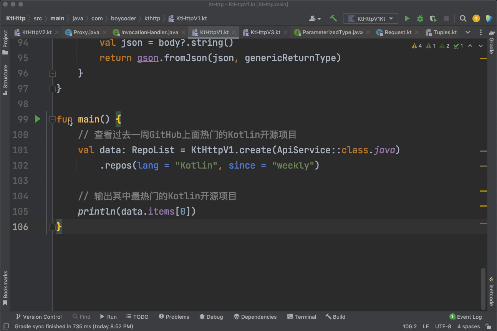

---
date: "2019-06-23"
---  
      
# 12 | 实战：用Kotlin实现一个网络请求框架KtHttp
你好，我是朱涛，又到了实战环节。

在前面几节课当中，我们一起学习了Kotlin的委托、泛型、注解、反射这几个高级特性。那么今天这节课，我们将会运用这些特性，来写一个**Kotlin版本的HTTP网络请求框架**。由于它是纯Kotlin开发的，我们就把它叫做是KtHttp吧。

事实上，在Java和Kotlin领域，有许多出色的网络请求框架，比如 [OkHttp](https://github.com/square/okhttp)、[Retrofit](https://github.com/square/Retrofit)、[Fuel](https://github.com/kittinunf/fue)。而我们今天要实现的KtHttp，它的灵感来自于Retrofit。之所以选择Retrofit作为借鉴的对象，是因为它的底层使用了大量的**泛型、注解和反射**的技术。如果你能跟着我一起用泛型、注解、反射来实现一个简单的网络请求框架，相信你对这几个知识点的认识也会更加透彻。

在这节课当中，我会带你从0开始实现这个网络请求框架。和往常一样，为了方便你理解，我们的代码会分为两个版本：

* 1.0 版本，我们会用Java思维，以最简单直白的方式来实现KtHttp的基础功能——同步式的GET网络请求；
* 2.0 版本，我们会用函数式思维来重构代码。

另外，在正式开始学习之前，我也建议你去clone我GitHub上面的KtHttp工程：<https://github.com/chaxiu/KtHttp.git>，然后用IntelliJ打开，并切换到**start**分支跟着课程一步步敲代码。

<!-- [[[read_end]]] -->

## 1.0：Java思维

在正式开始之前，我们还是先来看看程序的运行效果：



在上面的动图中，我们通过KtHttp请求了一个服务器的API，然后在控制台输出了结果。这其实是我们在开发工作当中十分常见的需求。通过这个KtHttp，我们就可以在程序当中访问任何服务器的API，比如[GitHub的API](https://docs.github.com/en)。

那么，为了描述服务器返回的内容，我们定义了两个数据类：

```
    // 这种写法是有问题的，但这节课我们先不管。
    
    data class RepoList(
        var count: Int?,
        var items: List<Repo>?,
        var msg: String?
    )
    
    data class Repo(
        var added_stars: String?,
        var avatars: List<String>?,
        var desc: String?,
        var forks: String?,
        var lang: String?,
        var repo: String?,
        var repo_link: String?,
        var stars: String?
    )
    

```

除了数据类以外，我们还要定义一个用于网络请求的接口：

```
    interface ApiService {
        @GET("/repo")
        fun repos(
            @Field("lang") lang: String,
            @Field("since") since: String
        ): RepoList
    }
    

```

在这个接口当中，有两个注解，我们一个个分析：

* **GET注解**，代表了这个网络请求应该是GET请求，这是[HTTP](https://zh.wikipedia.org/wiki/%E8%B6%85%E6%96%87%E6%9C%AC%E4%BC%A0%E8%BE%93%E5%8D%8F%E8%AE%AE)请求的一种方式。GET注解当中的“/repo”，代表了API的path，它是和baseURL拼接的；
* **Field注解**，代表了GET请求的参数。Field注解当中的值也会和URL拼接在一起。

也许你会好奇，**GET、Field这两个注解是从哪里来的呢？**这其实也是需要我们自己定义的。根据上节课学过的内容，我们很容易就能写出下面的代码：

```
    @Target(AnnotationTarget.FUNCTION)
    @Retention(AnnotationRetention.RUNTIME)
    annotation class GET(val value: String)
    
    @Target(AnnotationTarget.VALUE_PARAMETER)
    @Retention(AnnotationRetention.RUNTIME)
    annotation class Field(val value: String)
    

```

从这段代码里我们可以看出，GET注解只能用于修饰函数，Field注解只能用于修饰参数。另外，这两个注解的Retention都是AnnotationRetention.RUNTIME，这意味着这两个注解都是运行时可访问的。而这，也正好是我们后面要使用的反射的前提。

最后，我们再来看看KtHttp是如何使用的：

```
    fun main() {
        // ①
        val api: ApiService = KtHttpV1.create(ApiService::class.java)
    
        // ②
        val data: RepoList = api.repos(lang = "Kotlin", since = "weekly")
    
        println(data)
    }
    

```

上面的代码有两个注释，我们分别来看。

* 注释①：我们调用KtHttpV1.create\(\)方法，传入了ApiService::class.java，参数的类型是`Class<T>`，返回值类型是ApiService。这就相当于创建了ApiService这个接口的实现类的对象。
* 注释②：我们调用api.repos\(\)这个方法，传入了Kotlin、weekly这两个参数，代表我们想查询最近一周最热门的Kotlin开源项目。

看到这里，你也许会好奇，**KtHttpV1.create\(\)是如何创建ApiService的实例的呢？**要知道ApiService可是一个接口，我们要创建它的对象，必须要先定义一个类实现它的接口方法，然后再用这个类来创建对象才行。

不过在这里，我们不会使用这种传统的方式，而是会用**动态代理**，也就是JDK的[Proxy](https://docs.oracle.com/javase/7/docs/api/java/lang/reflect/Proxy.html)。Proxy的底层，其实也用到了反射。

不过，由于这个案例涉及到的知识点都很抽象，在正式开始编写逻辑代码之前，我们先来看看下面这个动图，对整体的程序有一个粗略的认识。


现在，相信你大概就知道这个程序是如何实现的了。下面，我再带你来看看具体的代码是怎么写的。

这里我要先说明一点，为了不偏离这次实战课的主题，我们不会去深究Proxy的底层原理。在这里，**你只需要知道，我们通过Proxy，就可以动态地创建ApiService接口的实例化对象**。具体的做法如下：

```
    fun <T> create(service: Class<T>): T {
    
        // 调用 Proxy.newProxyInstance 就可以创建接口的实例化对象
        return Proxy.newProxyInstance(
            service.classLoader,
            arrayOf<Class<*>>(service),
            object : InvocationHandler{
                override fun invoke(proxy: Any?, method: Method?, args: Array<out Any>?): Any {
                    // 省略
                }
            }
        ) as T
    }    
    

```

在上面的代码当中，我们在create\(\)方法当中，直接返回了Proxy.newProxyInstance\(\)这个方法的返回值，最后再将其转换成了T类型。

那么，newProxyInstance\(\)这个方法又是如何定义的呢？

```
    public static Object newProxyInstance(ClassLoader loader,
                                              Class<?>[] interfaces,
                                              InvocationHandler h){ 
            ...
    }
    
    public interface InvocationHandler {
        public Object invoke(Object proxy, Method method, Object[] args)
            throws Throwable;
    }
    

```

从上面的代码当中，我们可以看到，最后一个参数，InvocationHandler其实是符合SAM转换要求的，所以我们的create\(\)方法可以进一步简化成这样：

```
    fun <T> create(service: Class<T>): T {
    
        return Proxy.newProxyInstance(
            service.classLoader,
            arrayOf<Class<*>>(service)
        ) { proxy, method, args ->
            // 待完成
        } as T
    }
    

```

那么到这里，我们程序的基本框架也就搭建好了。

细心的你一定发现了，我们**程序的主要逻辑还没实现**，所以接下来，我们就一起看看上面那个“待完成”的InvocationHandler，这个Lambda表达式应该怎么写。这个换句话说，也就是Proxy.newProxyInstance\(\)，会帮我们创建ApiService的实例对象，而ApiService当中的接口方法的具体逻辑，我们需要在Lambda表达式当中实现。

好了，让我们回过头来看看ApiService当中的代码细节：

```
    interface ApiService {
    // 假设我们的baseurl是：https://baseurl.com
    // 这里拼接结果会是这样：https://baseurl.com/repo
    //          ↓
        @GET("/repo")
        fun repos(
        //                Field注解当中的lang，最终会拼接到url当中去
        //            ↓                                                 ↓
            @Field("lang") lang: String,  // https://baseurl.com/repo?lang=Kotlin
            @Field("since") since: String // https://baseurl.com/repo?lang=Kotlin&since=weekly
        ): RepoList
    }
    

```

从代码注释中可以看出来，其实我们真正需要实现的逻辑，就是想办法把注解当中的值/repo、lang、since取出来，然后拼接到URL当中去。那么，我们如何才能得到注解当中的值呢？

答案自然就是我们在上节课学过的：**反射**。

```
    object KtHttpV1 {
    
        // 底层使用 OkHttp
        private var okHttpClient: OkHttpClient = OkHttpClient()
        // 使用 Gson 解析 JSON
        private var gson: Gson = Gson()
    
        // 这里以baseurl.com为例，实际上我们的KtHttpV1可以请求任意API
        var baseUrl = "https://baseurl.com"
    
        fun <T> create(service: Class<T>): T {
            return Proxy.newProxyInstance(
                service.classLoader,
                arrayOf<Class<*>>(service)
            //           ①     ②
            //           ↓      ↓
            ) { proxy, method, args ->
                // ③
                val annotations = method.annotations
                for (annotation in annotations) {
                    // ④
                    if (annotation is GET) {
                        // ⑤
                        val url = baseUrl + annotation.value
                        // ⑥
                        return@newProxyInstance invoke(url, method, args!!)
                    }
                }
                return@newProxyInstance null
    
            } as T
        }
    
        private fun invoke(url: String, method: Method, args: Array<Any>): Any? {
            // 待完成
        }
    }
    

```

在上面的代码中，一共有6个注释，我们一个个看。

* 注释①：method的类型是反射后的Method，在我们这个例子当中，它最终会代表被调用的方法，也就是ApiService接口里面的repos\(\)这个方法。
* 注释②：args的类型是对象的数组，在我们的例子当中，它最终会代表方法的参数的值，也就是“`api.repos("Kotlin", "weekly")`”当中的`"Kotlin"`和`"weekly"`。
* 注释③：method.annotations，代表了我们会取出repos\(\)这个方法上面的所有注解，由于repos\(\)这个方法上面可能会有多个注解，因此它是数组类型。
* 注释④：我们使用for循环，遍历所有的注解，找到GET注解。
* 注释⑤：我们找到GET注解以后，要取出\@GET\(“/repo”\)当中的"/repo"，也就是“annotation.value”。这时候我们只需要用它与baseURL进行拼接，就可以得到完整的URL；
* 注释⑥：return\@newProxyInstance，用的是Lambda表达式当中的返回语法，在得到完整的URL以后，我们将剩下的逻辑都交给了invoke\(\)这个方法。

接下来，我们再来看看invoke\(\)当中的“待完成代码”应该怎么写。

```
    private fun invoke(url: String, method: Method, args: Array<Any>): Any? {
        // ① 根据url拼接参数，也就是：url + ?lang=Kotlin&since=weekly
        // ② 使用okHttpClient进行网络请求
        // ③ 使用gson进行JSON解析
        // ④ 返回结果
    }
    

```

在上面的代码中，我们的invoke\(\)方法一共分成了四个步骤，其中的③、④两个步骤其实很容易实现：

```
    private fun invoke(url: String, method: Method, args: Array<Any>): Any? {
        // ① 根据url拼接参数，也就是：url + ?lang=Kotlin&since=weekly
    
        // 使用okHttpClient进行网络请求
        val request = Request.Builder()
                .url(url)
                .build()
        val response = okHttpClient.newCall(request).execute()
    
        // ② 获取repos()的返回值类型 genericReturnType
    
        // 使用gson进行JSON解析
        val body = response.body
        val json = body?.string()
        //                              根据repos()的返回值类型解析JSON
        //                                            ↓
        val result = gson.fromJson<Any?>(json, genericReturnType)
    
        // 返回结果
        return result
    }
    

```

继续看，经过我们的分解，现在的问题变成了下面这样：

* 注释①，利用反射，解析出“`api.repos("Kotlin", "weekly")`”这个方法当中的`"Kotlin"`和`"weekly"`，将其与URL进行拼接得到：`url + ?lang=Kotlin&since=weekly`
* 注释②，利用反射，解析出repos\(\)的返回值类型，用于JSON解析。

我们来看看最终的代码：

```
    private fun invoke(path: String, method: Method, args: Array<Any>): Any? {
        // 条件判断
        if (method.parameterAnnotations.size != args.size) return null
    
        // 解析完整的url
        var url = path
        // ①
        val parameterAnnotations = method.parameterAnnotations
        for (i in parameterAnnotations.indices) {
            for (parameterAnnotation in parameterAnnotations[i]) {
                // ②
                if (parameterAnnotation is Field) {
                    val key = parameterAnnotation.value
                    val value = args[i].toString()
                    if (!url.contains("?")) {
                        // ③
                        url += "?$key=$value"
                    } else {
                        // ④
                        url += "&$key=$value"
                    }
    
                }
            }
        }
        // 最终的url会是这样：
        // https://baseurl.com/repo?lang=Kotlin&since=weekly
    
        // 执行网络请求
        val request = Request.Builder()
            .url(url)
            .build()
        val response = okHttpClient.newCall(request).execute()
    
        // ⑤
        val genericReturnType = method.genericReturnType
        val body = response.body
        val json = body?.string()
        // JSON解析
        val result = gson.fromJson<Any?>(json, genericReturnType)
    
        // 返回值
        return result
    }
    

```

上面的代码一共涉及五个注释，它们都是跟注解与反射这两个知识点相关的。

* 注释①，method.parameterAnnotations，它的作用是取出方法参数当中的所有注解，在我们这个案例当中，repos\(\)这个方法当中涉及到两个注解，它们分别是`@Field("lang")`、`@Field("since")`。
* 注释②，由于方法当中可能存在其他注解，因此要筛选出我们想要的Field注解。
* 注释③，这里是取出注解当中的值“lang”，以及参数当中对应的值“Kotlin”进行拼接，URL第一次拼接参数的时候，要用“\?”分隔。
* 注释④，这里是取出注解当中的值“since”，以及参数当中对应的值“weekly”进行拼接，后面的参数拼接格式，是用“\&”分隔。
* 注释⑤，method.genericReturnType取出repos\(\)的返回值类型，也就是RepoList，最终，我们用它来解析JSON。

说实话，动态代理的这种模式，由于它大量应用了反射，加之我们的代码当中还牵涉到了泛型和注解，导致这个案例的代码不是那么容易理解。不过，我们其实可以利用**调试**的手段，去查看代码当中每一步执行的结果，这样就能对注解、反射、动态代理有一个更具体的认识。

前面带你看过的这个动图，其实就是在向你展示代码在调试过程中的关键节点，我们可以再来回顾一下整个代码的执行流程：


相信现在，你已经能够体会我们使用 **动态代理+注解+反射** 实现这个网络请求框架的原因了。通过这样的方式，我们就不必在代码当中去实现每一个接口，而是只要是符合这样的代码模式，任意的接口和方法，我们都可以直接传进去。在这个例子当中，我们用的是ApiService这个接口，如果下次我们定义了另一个接口，比如说：

```
    interface GitHubService {
        @GET("/search")
        fun search(
            @Field("id") id: String
        ): User
    }
    

```

这时候，我们的KtHttp根本不需要做任何的改动，直接这样调用即可：

```
    fun main() {
        KtHttpV1.baseUrl = "https://api.github.com"
        //       换一个接口名即可                  换一个接口名即可
        //              ↓                             ↓                
        val api: GitHubService = KtHttpV1.create(GitHubService::class.java)
        val data: User = api.search(id = "JetBrains")
    }
    

```

可以发现，使用动态代理实现网络请求的优势，它的**灵活性**是非常好的。只要我们定义的Service接口拥有对应的注解GET、Field，我们就可以通过注解与反射，将这些信息拼凑在一起。下面这个动图就展示了它们整体的流程：


实际上，我们的KtHttp，就是将URL的信息存储在了注解当中（比如lang和since），而实际的参数值，是在函数调用的时候传进来的（比如Kotlin和weekly）。我们通过泛型、注解、反射的结合，将这些信息集到一起，完成整个URL的拼接，最后才通过OkHttp完成的网络请求、Gson完成的解析。

好，到这里，我们1.0版本的开发就算是完成了。这里的单元测试代码很容易写，我就不贴出来了，**单元测试是个好习惯，我们不能忘**。

接下来，我们正式进入2.0版本的开发。

## 2.0：函数式思维

其实，如果你理解了1.0版本的代码，2.0版本的程序也就不难实现了。因为这个程序的主要功能都已经完成了，现在要做的只是：**换一种思路重构代码**。

我们先来看看KtHttpV1这个单例的成员变量：

```
    object KtHttpV1 {
        private var okHttpClient: OkHttpClient = OkHttpClient()
        private var gson: Gson = Gson()
    
        fun <T> create(service: Class<T>): T {}
        fun invoke(url: String, method: Method, args: Array<Any>): Any? {}
    }
    

```

okHttpClient、gson这两个成员是不支持懒加载的，因此我们首先应该让它们**支持懒加载**。

```
    object KtHttpV2 {
        private val okHttpClient by lazy { OkHttpClient() }
        private val gson by lazy { Gson() }
    
        fun <T> create(service: Class<T>): T {}
        fun invoke(url: String, method: Method, args: Array<Any>): Any? {}
    }
    

```

这里，我们直接使用了by lazy委托的方式，它简洁的语法可以让我们快速实现懒加载。  
接下来，我们再来看看create\(\)这个方法的定义：

```
    //                      注意这里
    //                         ↓
    fun <T> create(service: Class<T>): T {
        return Proxy.newProxyInstance(
            service.classLoader,
            arrayOf<Class<*>>(service)
        ) { proxy, method, args ->
        }
    }
    

```

在上面的代码中，create\(\)会接收一个`Class<T>`类型的参数。其实，针对这样的情况，我们完全可以省略掉这个参数。具体做法，是使用我们前面学过的[inline](https://time.geekbang.org/column/article/477295)，来实现**类型实化**（Reified Type）。我们常说，Java的泛型是伪泛型，而这里我们要实现的就是真泛型。

```
    //  注意这两个关键字
    //  ↓          ↓
    inline fun <reified T> create(): T {
        return Proxy.newProxyInstance(
            T::class.java.classLoader, // ① 变化在这里
            arrayOf(T::class.java) // ② 变化在这里
        ) { proxy, method, args ->
            // 待重构
        }
    }
    

```

正常情况下，泛型参数[类型会被擦除](https://zh.wikipedia.org/wiki/%E7%B1%BB%E5%9E%8B%E6%93%A6%E9%99%A4)，这就是Java的泛型被称为“伪泛型”的原因。而通过使用**inline和reified**这两个关键字，我们就能实现类型实化，也就是“真泛型”，进一步，我们就可以在代码注释①、②的地方，使用“T::class.java”来得到Class对象。

下面，我们来看看KtHttp的主要逻辑该如何重构。

为了方便理解，我们会使用Kotlin标准库当中已有的高阶函数，尽量不去涉及函数式编程里的高级概念。**在这里我强烈建议你打开IDE一边敲代码一边阅读**，这样一来，当你遇到不熟悉的标准函数时，就可以随时去看它的实现源码了。相信在学习过第7讲的[高阶函数](https://time.geekbang.org/column/article/476637)以后，这些库函数都不会难倒你。

首先，我们来看看create\(\)里面“待重构”的代码该如何写。在这个方法当中，我们需要读取method当中的GET注解，解析出它的值，然后与baseURL拼接。这里我们完全可以**借助Kotlin的标准库函数**来实现：

```
    inline fun <reified T> create(): T {
        return Proxy.newProxyInstance(
            T::class.java.classLoader,
            arrayOf(T::class.java)
        ) { proxy, method, args ->
    
            return@newProxyInstance method.annotations
                .filterIsInstance<GET>()
                .takeIf { it.size == 1 }
                ?.let { invoke("$baseUrl${it[0].value}", method, args) }
        } as T
    }
    

```

这段代码的可读性很好，我们可以像读英语文本一样来阅读：

* 首先，我们通过method.annotations，来获取method的所有注解；
* 接着，我们用`filterIsInstance<GET>()`，来筛选出我们想要找的GET注解。这里的filterIsInstance其实是filter的升级版，也就是**过滤**的意思；
* 之后，我们判断GET注解的数量，它的数量必须是1，其他的都不行，这里的takeIf其实相当于我们的if；
* 最后，我们通过拼接出URL，然后将程序执行流程交给invoke\(\)方法。这里的"\?.let\{\}"相当于判空。

好了，create\(\)方法的重构已经完成，接下来我们来看看invoke\(\)方法该如何重构。

```
    fun invoke(url: String, method: Method, args: Array<Any>): Any? =
        method.parameterAnnotations
            .takeIf { method.parameterAnnotations.size == args.size }
            ?.mapIndexed { index, it -> Pair(it, args[index]) }
            ?.fold(url, ::parseUrl)
            ?.let { Request.Builder().url(it).build() }
            ?.let { okHttpClient.newCall(it).execute().body?.string() }
            ?.let { gson.fromJson(it, method.genericReturnType) }
    

```

这段代码读起来也不难，我们一行一行来分析。

* 第一步，我们通过method.parameterAnnotations，获取方法当中所有的参数注解，在这里也就是`@Field("lang")`、`@Field("since")`。
* 第二步，我们通过takeIf来判断，参数注解数组的数量与参数的数量相等，也就是说`@Field("lang")`、`@Field("since")`的数量是2，那么`["Kotlin", "weekly"]`的size也应该是2，它必须是一一对应的关系。
* 第三步，我们将`@Field("lang")`与`"Kotlin"`进行配对，将`@Field("since")`与`"weekly"`进行配对。这里的mapIndexed，其实就是map的升级版，它本质还是一种映射的语法，“注解数组类型”映射成了“Pair数组”，只是多了一个index而已。
* 第四步，我们使用fold与parseUrl\(\)这个方法，拼接出完整的URL，也就是：<https://baseurl.com/repo?lang=Kotlin&since=weekly>。 这里我们使用了**函数引用**的语法“::parseUrl”。而fold这个操作符，其实就是高阶函数版的for循环。
* 第五步，我们构建出OkHttp的Request对象，并且将URL传入了进去，准备做网络请求。
* 第六步，我们通过okHttpClient发起了网络请求，并且拿到了String类型的JSON数据。
* 最后，我们通过Gson解析出JSON的内容，并且返回RepoList对象。

到目前为止，我们的invoke\(\)方法的主要流程就分析完了，接下来我们再来看看用于实现URL拼接的parseUrl\(\)是如何实现的。

```
    private fun parseUrl(acc: String, pair: Pair<Array<Annotation>, Any>) =
        pair.first.filterIsInstance<Field>()
            .first()
            .let { field ->
                if (acc.contains("?")) {
                    "$acc&${field.value}=${pair.second}"
                } else {
                    "$acc?${field.value}=${pair.second}"
                }
            }
    

```

可以看到，这里我们只是把从前的for循环代码，换成了 **Kotlin的集合操作符**而已。大致流程如下：

* 首先，我们从注解的数组里筛选出Field类型的注解；
* 接着，通过first\(\)取出第一个Field注解，这里它也应该是唯一的；
* 最后，我们判断当前的acc是否已经拼接过参数，如果没有拼接过，就用“\?”分隔，如果已经拼接过参数，我们就用“\&”分隔。

至此，我们2.0版本的代码就完成了，完整的代码如下：

```
    object KtHttpV2 {
    
        private val okHttpClient by lazy { OkHttpClient() }
        private val gson by lazy { Gson() }
        var baseUrl = "https://baseurl.com" // 可改成任意url
    
        inline fun <reified T> create(): T {
            return Proxy.newProxyInstance(
                T::class.java.classLoader,
                arrayOf(T::class.java)
            ) { proxy, method, args ->
    
                return@newProxyInstance method.annotations
                    .filterIsInstance<GET>()
                    .takeIf { it.size == 1 }
                    ?.let { invoke("$baseUrl${it[0].value}", method, args) }
            } as T
        }
    
        fun invoke(url: String, method: Method, args: Array<Any>): Any? =
            method.parameterAnnotations
                .takeIf { method.parameterAnnotations.size == args.size }
                ?.mapIndexed { index, it -> Pair(it, args[index]) }
                ?.fold(url, ::parseUrl)
                ?.let { Request.Builder().url(it).build() }
                ?.let { okHttpClient.newCall(it).execute().body?.string() }
                ?.let { gson.fromJson(it, method.genericReturnType) }
    
    
        private fun parseUrl(acc: String, pair: Pair<Array<Annotation>, Any>) =
            pair.first.filterIsInstance<Field>()
                .first()
                .let { field ->
                    if (acc.contains("?")) {
                        "$acc&${field.value}=${pair.second}"
                    } else {
                        "$acc?${field.value}=${pair.second}"
                    }
                }
    }
    

```

对应的，我们可以再看看1.0版本的完整代码：

```
    object KtHttpV1 {
    
        private var okHttpClient: OkHttpClient = OkHttpClient()
        private var gson: Gson = Gson()
        var baseUrl = "https://baseurl.com" // 可改成任意url
    
        fun <T> create(service: Class<T>): T {
            return Proxy.newProxyInstance(
                service.classLoader,
                arrayOf<Class<*>>(service)
            ) { proxy, method, args ->
                val annotations = method.annotations
                for (annotation in annotations) {
                    if (annotation is GET) {
                        val url = baseUrl + annotation.value
                        return@newProxyInstance invoke(url, method, args!!)
                    }
                }
                return@newProxyInstance null
    
            } as T
        }
    
        private fun invoke(path: String, method: Method, args: Array<Any>): Any? {
            if (method.parameterAnnotations.size != args.size) return null
    
            var url = path
            val parameterAnnotations = method.parameterAnnotations
            for (i in parameterAnnotations.indices) {
                for (parameterAnnotation in parameterAnnotations[i]) {
                    if (parameterAnnotation is Field) {
                        val key = parameterAnnotation.value
                        val value = args[i].toString()
                        if (!url.contains("?")) {
                            url += "?$key=$value"
                        } else {
                            url += "&$key=$value"
                        }
    
                    }
                }
            }
    
            val request = Request.Builder()
                .url(url)
                .build()
    
            val response = okHttpClient.newCall(request).execute()
    
            val genericReturnType = method.genericReturnType
            val body = response.body
            val json = body?.string()
            val result = gson.fromJson<Any?>(json, genericReturnType)
    
            return result
        }
    }
    

```

可见，1.0版本、2.0版本，它们之间可以说是天壤之别。

## 小结

好了，这节实战就到这里。接下来我们来简单总结一下：

* 在1.0版本的代码中，我们灵活利用了**动态代理、泛型、注解、反射**这几个技术，实现了KtHttp的基础功能。
* **动态代理**，由于它的底层原理比较复杂，课程当中我是通过ApiImpl这个类，来模拟了它动态生成的Proxy类。用这种直观的方式来帮助你理解它存在的意义。
* **泛型**方面，我们将其用在了动态代理的create\(\)方法上，后面我们还使用了“类型实化”的技术，也就是inline + reified关键字。
* **注解**方面，我们首先自定义了两个注解，分别是GET、Field。其中，\@GET用于标记接口的方法，它的值是URL的path；\@Field用于标记参数，它的值是参数的key。
* **反射**方面，这个技术点，几乎是贯穿于整个代码实现流程的。我们通过反射的自省能力，去分析repos\(\)方法，从GET注解当中取出了“/repo”这个path，从注解Field当中取出了lang、since，还取出了repos\(\)方法的返回值RepoList，用于JSON数据的解析。
* 在2.0版本的代码中，我们几乎删除了之前所有的代码，**以函数式的思维重写**了KtHttp的内部逻辑。在这个版本当中，我们大量地使用了Kotlin标准库里的高阶函数，进一步提升了代码的可读性。

在前面的[加餐](https://time.geekbang.org/column/article/478106)课程当中，我们也讨论过Kotlin的编程范式问题。**命令式还是函数式，这完全取决于我们开发者自身。**

相比起前面实战课中的[单词频率统计程序](https://time.geekbang.org/column/article/477295)，这一次我们的函数式范式的代码，实现起来就没有那么得流畅了。原因其实也很简单，Kotlin提供了强大的集合操作符，这就让Kotlin十分擅长“集合操作”的场景，因此词频统计程序，我们不到10行代码就解决了。而对于注解、反射相关的场景，函数式的编程范式就没那么擅长了。

在这节课里，我之所以费尽心思地用函数式风格，重构出KtHttp 2.0版本，主要还是想让你看到函数式编程在它不那么擅长的领域表现会如何。毕竟，我们在工作中什么问题都可能会遇到。

## 思考题

好了，学完这节课以后，请问你有哪些感悟和收获？请在评论区里分享出来，我们一起交流吧！