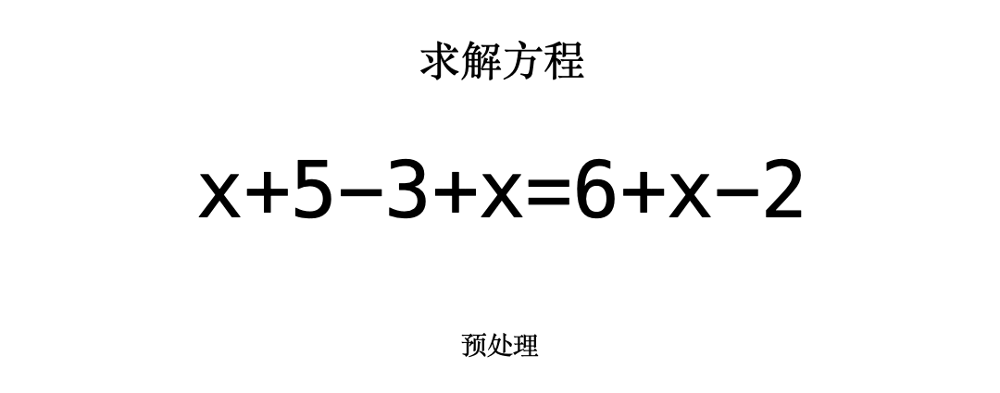

---
date: "2019-06-23"
---  
      
# 春节刷题计划（三）| 一题双解，搞定求解方程
你好，我是朱涛。初二过年好！

在上节课里，我给你留了一个作业，那就是：用Kotlin来完成 [LeetCode的640号题《求解方程》](https://leetcode-cn.com/problems/solve-the-equation/)。那么这节课，我就来讲讲我的解题思路，我们互相学习。

这道题也非常容易理解，程序的输入是一个“一元一次方程”，我们需要根据输入的方程，计算出正确的结果。根据输入方程的不同，结果可能有三种情况：

* **方程仅有一个解**，这时，我们只需要按照格式返回结果即可，比如输入“2x=4”，那么输出就应该是“x=2”。
* **方程有无数个解**，比如输入“x=x”，那么输出就应该是“Infinite solutions”。
* **方程无解**，比如输入“x=x+5”，那么输出结果就应该是“No solution”。

另外，对于程序的**输入格式**，其实我们还有几个问题需要弄清楚。只有弄清楚了这些问题，我们才能开始写代码：

* 方程当中的未知数只会用x表示，不会是y，也不会是大写的“X”。
* 方程当中不会出现空格，比如“2x=4”，不会出现“2x = 4 ”的情况。
* 方程当中只会有加减法，不会出现乘除法。
* 方程当中的数字，一定是整数，不会出现分数、小数。
* 输入的方程一定是一个正确的方程，不会出现“x=…”之类的脏数据。

好，问题的细节都弄清楚了，下面我们来分析一下解题的思路。

<!-- [[[read_end]]] -->

对于这种简单的一元一次方程的解法，其实我们在小学就学过了，概括起来，就是分为三个步骤。

* 第一步，**移项**。将含有x的式子全部移到等式的左边，将数字全部都移到等式的右边。另外，移项的时候符号要变。比如“3x-4=x+2”这个方程，移项以后，就会变成这样：“3x-x=2+4”。
* 第二步，**合并同类项**。这里其实就是将等式的左边与右边合并起来，对于“3x-x=2+4”这个式子，合并完以后，就会变成“2x=6”。
* 第三步，**系数化为一**。这时候，我们就需要拿右边的数字，除以左边的系数。比如上面的式子“2x=6”，系数化为一之后，就会变成“x=3”，这就是我们想要的方程解。当然，这只是方程只有一个解的情况，其实在系数化为一之前，还存在其他的情况，比如“x=x+5”最终会变成“0=5”，这时候左边是零，右边不是零，这时候就代表方程无解；对于“2x=2x”这样的方程，它最终会变成“0=0”，这种两边都等于零的情况，就代表了方程有无数个解。

好，如何求解方程的思路我们已经知道了，那么代码该如何写呢？这里，我们仍然有两种解法，这两种解法的思路是一致的，只是其中一种是偏命令式的，另一种是偏函数式的。

这里，我照样是制作了一张动图，给你展示下程序运行的整体思路：


## 解法一：命令式

首先，我们按照前面分析的思路，把待实现的程序分为以下几个步骤：

```
    fun solveEquation(equation: String): String {
        // ① 分割等号
        // ② 遍历左边的等式，移项，合并同类项
        // ③ 遍历右边的等式，移项，合并同类项
        // ④ 系数化为一，返回结果
    }
    

```

根据注释，我们很容易就能完成其中①、④两个步骤的代码：

```
    fun solveEquation(equation: String): String {
            // ① 分割等号
            val list = equation.split("=")
    
            // ② 遍历左边的等式，移项，合并同类项
            // ③ 遍历右边的等式，移项，合并同类项
    
            // ④ 系数化为一,返回结果
            return when {
                leftSum == 0 && rightSum == 0 -> "Infinite solutions"
                leftSum == 0 && rightSum != 0 -> "No solution"
                else -> "x=${rightSum / leftSum}"
            }
        }
    

```

现在，关键还是在于②、③两个步骤的代码。这里，list\[0\]其实就代表了左边的式子，list\[1\]就代表了右边的式子。

按照之前的思路分析，我们其实用两个for循环，分别遍历它们，然后顺便完成移项与合并同类项就行了。具体的代码如下：

```
    var leftSum = 0
    var rightSum = 0
    
    val leftList = splitByOperator(list[0])
    val rightList = splitByOperator(list[1])
    
    // ② 遍历左边的等式，移项，合并同类项
    leftList.forEach {
        if (it.contains("x")) {
            leftSum += xToInt(it)
        } else {
            rightSum -= it.toInt()
        }
    }
    
    // ③ 遍历右边的等式，移项，合并同类项
    rightList.forEach{
        if (it.contains("x")) {
            leftSum -= xToInt(it)
        } else {
            rightSum += it.toInt()
        }
    }
    

```

这段代码的逻辑其实也比较清晰了，leftList、rightList是根据“+”、“-”分割出来的元素。在完成分割以后，我们再对它们进行了遍历，从而完成了移项与合并同类项。

并且，这里我们还用到了另外两个方法，分别是splitByOperator\(\)、xToInt\(\)，它们具体的代码如下：

```
    private fun splitByOperator(list: String): List<String> {
        val result = mutableListOf<String>()
        var temp = ""
        list.forEach {
            if (it == '+' || it == '-') {
                if (temp.isNotEmpty()) {
                    result.add(temp)
                }
                temp = it.toString()
            } else {
                temp += it
            }
        }
    
        result.add(temp)
        return result
    }
    
    private fun xToInt(x: String) =
        when (x) {
            "x",
            "+x" -> 1
            "-x" -> -1
            else -> x.replace("x", "").toInt()
        }
    

```

从以上代码中，我们可以看到splitByOperator\(\)就是使用“+”、“-”作为分隔符，将字符串类型的式子，分割成一个个的元素。而xToInt\(\)的作用则是为了提取x的系数，比如“2x”，提取系数以后，就是“2”；而“-2x”的系数就是“-2”。

最后，我们再来看看整体的代码：

```
    fun solveEquation(equation: String): String {
        // ① 分割等号
        val list = equation.split("=")
    
        var leftSum = 0
        var rightSum = 0
    
        val leftList = splitByOperator(list[0])
        val rightList = splitByOperator(list[1])
    
        // ② 遍历左边的等式，移项，合并同类项
        leftList.forEach {
            if (it.contains("x")) {
                leftSum += xToInt(it)
            } else {
                rightSum -= it.toInt()
            }
        }
    
        // ③ 遍历右边的等式，移项，合并同类项
        rightList.forEach{
            if (it.contains("x")) {
                leftSum -= xToInt(it)
            } else {
                rightSum += it.toInt()
            }
        }
    
        // ④ 系数化为一,返回结果
        return when {
            leftSum == 0 && rightSum == 0 -> "Infinite solutions"
            leftSum == 0 && rightSum != 0 -> "No solution"
            else -> "x=${rightSum / leftSum}"
        }
    }
    
    // 根据“+”、“-”分割式子
    private fun splitByOperator(list: String): List<String> {
        val result = mutableListOf<String>()
        var temp = ""
        list.forEach {
            if (it == '+' || it == '-') {
                if (temp.isNotEmpty()) {
                    result.add(temp)
                }
                temp = it.toString()
            } else {
                temp += it
            }
        }
    
        result.add(temp)
        return result
    }
    
    // 提取x的系数：“-2x” ->“-2”
    private fun xToInt(x: String) =
        when (x) {
            "x",
            "+x" -> 1
            "-x" -> -1
            else -> x.replace("x", "").toInt()
        }
    

```

至此，偏命令式的代码就完成了，接下来我们看看偏函数式的代码该怎么写。

## 解法二：函数式

这里你要注意了，函数式的思路呢，和命令式的思路其实是**一样**的。解方程的步骤是不会变的，仍然是移项、合并同类项、系数化为一。只不过，对比前面的实现方式，我们这里会更多地**借助Kotlin的标准库函数**。

首先，我们来看看第一部分的代码怎么写：

```
    fun solveEquation(equation: String): String {
        val list = equation
            .replace("-", "+-") // 预处理逻辑
            .split("=")
    
        // 用“+”分割字符串
        val leftList = list[0].split("+")
        val rightList = list[1].split("+")
    
        // 省略
    }
    

```

这里，为了可以直接使用Kotlin的库函数split来实现算式的分割，我使用了一种**数据预处理**的办法。你可以看到，在上面代码的注释处，`replace("-", "+-")` 的作用是将算式当中的所有“-”替换成“`+-`”，这就是预处理。经过这个预处理后，我们就可以直接使用 `split("+")` 来分割算式了。

为了体现这个细节，我这里也做了一个动图，你可以看看：



这样一来，我们得到的leftList、rightList其实就是干净的、独立的数字和x式子了。以“x+5-3+x=6+x-2”为例，`leftList=["x","5","-3","x"]`，而`rightList=["6","x","-2"]`。

既然它们两者都是普通的集合，那么我们接下来，就完全可以借助Kotlin强大的库函数来做剩下的事情了。我们只需要将所有x的式子挪到左边，所有数字挪到右边，然后合并，最后系数化为一即可。大致代码如下：

```
    leftList
        .filter { it.hasX() }
        .map { xToInt(it) } // ①
        .toMutableList() 
        .apply {
            rightList
                .filter { it.hasX() }
                .map { xToInt(it).times(-1) } // ②
                .let { addAll(it) } 
        }.sum() // ③
        .let { leftSum = it }
    
    rightList
        .filter { it.isNumber() }
        .map { it.toInt() } // ④
        .toMutableList()
        .apply {
            leftList
                .filter { it.isNumber() }
                .map { it.toInt().times(-1) } // ⑤
                .let { addAll(it) } 
        }.sum() // ⑥
        .let { rightSum = it }
    
    // 返回结果
    return when {
        leftSum == 0 && rightSum == 0 -> "Infinite solutions"
        leftSum == 0 && rightSum != 0 -> "No solution"
        else -> "x=${rightSum / leftSum}" // ⑦
    }
    

```

上面这段代码中，一共有6个注释，我们一个个看：

* 注释①，我们提取出了左边式子里所有x的系数，这里不需要移项，因为它本来就在左边。
* 注释②，我们提取了右边式子里所有x的系数，由于这里涉及到移项，因此需要变号，这里我们通过乘以一个“-1”来实现的。
* 注释③，我们将所有x的系数合并到了一起，得到了左边x的系数之和。
* 注释④，我们收集了右边式子里所有的数字，这里也不需要移项，因为它本来就在右边。
* 注释⑤，我们收集了左边式子里所有的数字，这里要移项，所以要变号。
* 注释⑥，我们将所有数字求和了。
* 注释⑦，如果方程有解的话，我们通过“rightSum / leftSum”就可以计算出来了。

另外，以上代码其实还涉及到三个辅助的函数，需要我们自己实现，它们的逻辑都很简单：

```
    private fun String.isNumber(): Boolean =
        this != "" && !this.contains("x")
    
    private fun String.hasX(): Boolean =
        this != "" && this.contains("x")
    
    // 提取x的系数：“-2x” ->“-2”
    private fun xToInt(x: String) =
        when (x) {
            "x" -> 1
            "-x" -> -1
            else -> x.replace("x", "").toInt()
        }
    

```

xToInt\(\)这个函数和之前的逻辑是相似的，isNumber\(\)和hasX\(\)这两个扩展函数，它们是用来判断式子是纯数字、还是含有x的，这是因为我们要把x放到等式左边，而数字要放到等式右边。

最后，我们再来看看整体的代码：

```
    fun solveEquation(equation: String): String {
        val leftSum: Int
        val rightSum: Int
    
        val list = equation
            .replace("-", "+-") // 预处理数据
            .split("=")
    
        val leftList = list[0].split("+")
        val rightList = list[1].split("+")
    
        // 求出所有x的系数之和
        leftList
            .filter { it.hasX() }
            .map { xToInt(it) }
            .toMutableList()
            .apply {
                rightList
                    .filter { it.hasX() }
                    .map { xToInt(it).times(-1) }
                    .let { addAll(it) }
            }.sum()
            .let { leftSum = it }
    
        // 求出所有数字之和
        rightList
            .filter { it.isNumber() }
            .map { it.toInt() }
            .toMutableList()
            .apply {
                leftList
                    .filter { it.isNumber() }
                    .map { it.toInt().times(-1) }
                    .let { addAll(it) }
            }.sum()
            .let { rightSum = it }
    
        // 返回结果
        return when {
            leftSum == 0 && rightSum == 0 -> "Infinite solutions"
            leftSum == 0 && rightSum != 0 -> "No solution"
            else -> "x=${rightSum / leftSum}"
        }
    }
    
    private fun String.isNumber(): Boolean =
        this != "" && !this.contains("x")
    
    private fun String.hasX(): Boolean =
        this != "" && this.contains("x")
    
    // 提取x的系数：“-2x” ->“-2”
    private fun xToInt(x: String) =
        when (x) {
            "x" -> 1
            "-x" -> -1
            else -> x.replace("x", "").toInt()
        }
    

```

## 小结

这节课，我们用两种方式实现了[LeetCode的640号题《求解方程》](https://leetcode-cn.com/problems/solve-the-equation/)。这两种解法的核心思路其实是一致的，不过前者是偏命令式的，后者是偏函数式的。而你要清楚，即使它们是用的一种思路，也仍然是各有优劣的。

* 解法一，命令式的代码，它的时间复杂度和空间复杂度要稍微好一些，但总体差距不大，所以不一定能体现出运行时的差异。这种方式的劣势在于，逻辑相对复杂，可读性稍差，且编码过程中容易出错。
* 解法二，偏函数式的代码，它的优势在于，代码逻辑相对清晰，并且，由于运用了大量Kotlin库函数，没那么容易出错。

## 小作业

好，最后，我还是给你留一个小作业，请你用Kotlin来完成 [LeetCode的592号题《分数加减运算》](https://leetcode-cn.com/problems/fraction-addition-and-subtraction/)，下节课我也会给出我的答案。