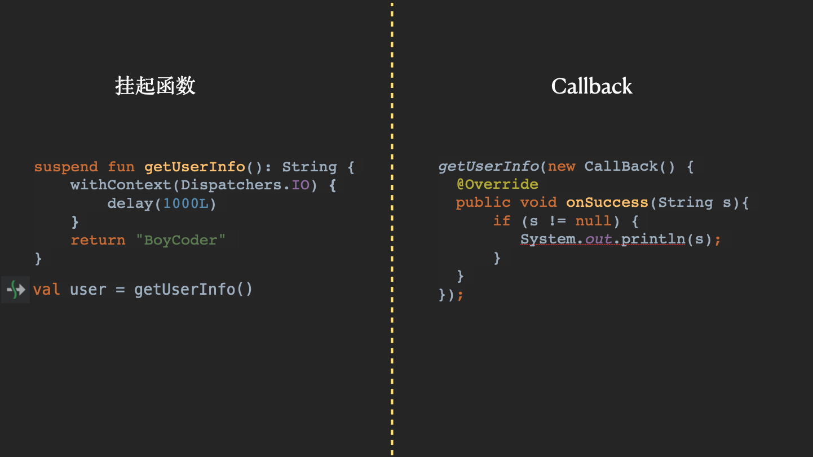
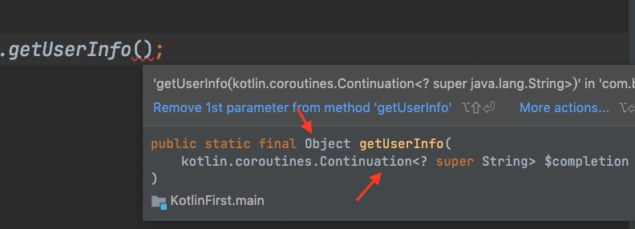
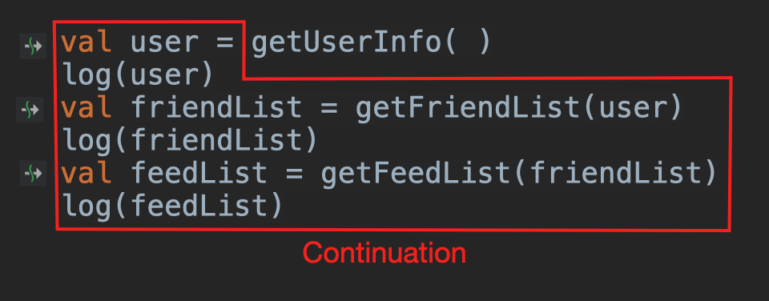
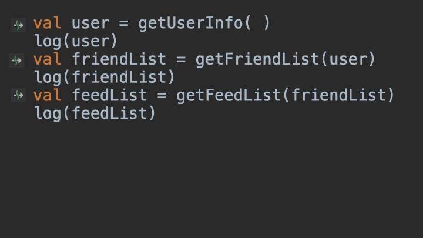
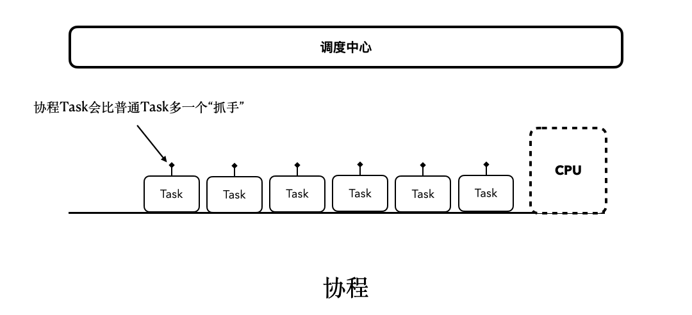
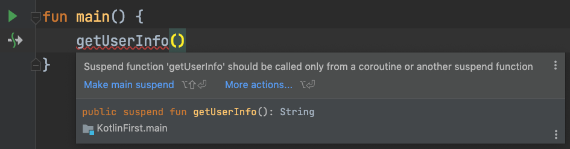
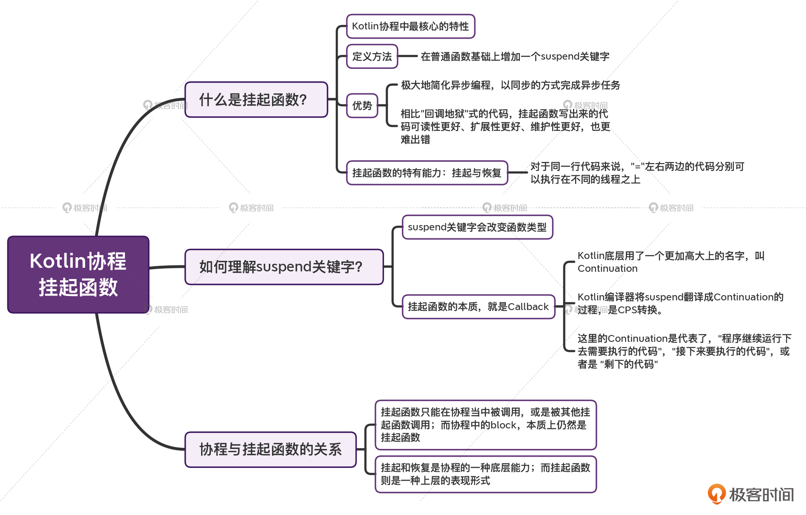

---
date: "2019-06-23"
---  
      
# 15 | 挂起函数：Kotlin协程的核心
你好，我是朱涛。这节课，我们来学习协程的挂起函数。

挂起函数，是Kotlin协程当中最基础、最重要的知识点。如果对协程的挂起函数没有足够的认识，我们后续的学习将会困难重重。如果不理解挂起函数，我们将无法理解协程的非阻塞；如果不了解挂起函数，我们将无法掌握Channel、Flow等API；如果不理解挂起函数，我们写出来的代码也会漏洞百出，就更别提优化软件架构了。

相反，如果能将挂起函数理解透彻，我们后面的学习也会更加轻松一些。所以这节课，我会从应用和原理两个角度，来带你理解挂起函数，包括如何使用挂起函数来优化异步任务，以及挂起函数的CPS当中的Continuation到底是什么。通过对这两个维度的学习，你在更轻易地掌握挂起函数应用场景的同时，对它的底层原理也会有一定认识。

那么接下来，你一定要打起精神，我们一起来攻克这个关键的知识点！

## 挂起函数：Kotlin协程的优势

通过前面课程的学习，我们已经知道了：协程就像是轻量级的线程一样。用线程能实现的功能，我们借助launch和async也同样可以做到。

不过你可能会好奇，如果只是把thread\{\} 替换成launch\{\}，那协程比起线程也没什么特殊的优势吧？**仅仅只是因为“轻量”“非阻塞”，我们就应该放弃线程，拥抱协程吗？**

<!-- [[[read_end]]] -->

其实，Kotlin协程最大的优势，就在于它的挂起函数。虽然很多编程语言都有协程的特性，但目前为止，只有Kotlin独树一帜，引入了“挂起函数”的概念。另外尽管有些语言的协程底层，也存在“挂起恢复”的概念，但是将这一概念直接暴露给开发者，直接用于修饰一个函数的，Kotlin算是做了一种创新。

那么，挂起函数到底有什么神奇的呢？我们先来看一段简单的Java代码：

```
    // 代码段1
    
    getUserInfo(new CallBack() {
        @Override
        public void onSuccess(String response) {
            if (response != null) {
                System.out.println(response);
            }
        }
    });
    

```

在这段代码中，我们发起了一个异步请求，从服务端查询用户的信息，通过CallBack返回response。这样的代码看起来没什么问题，平时我们写代码的时候也经常写类似的代码。不过实际的商业项目不可能这么简单，有的时候，我们可能需要连续执行几个异步任务，比如说，查询用户信息 \--> 查找该用户的好友列表 \-->拿到好友列表后，查找该好友的动态。

这样一来，我们的代码就难免会往下面这个方向发展：

```
    // 代码段2
    
    getUserInfo(new CallBack() {
        @Override
        public void onSuccess(String user) {
            if (user != null) {
                System.out.println(user);
                getFriendList(user, new CallBack() {
                    @Override
                    public void onSuccess(String friendList) {
                        if (friendList != null) {
                            System.out.println(friendList);
                            getFeedList(friendList, new CallBack() {
                                @Override
                                public void onSuccess(String feed) {
                                    if (feed != null) {
                                        System.out.println(feed);
                                    }
                                }
                            });
                        }
                    }
                });
            }
        }
    });
    

```

只要你参与过大型软件的开发，不管你用的是什么编程语言，你大概率都见到过类似上面的代码模式：**回调地狱**。

我们给它取这个名字是有原因的，以上代码存在诸多缺陷：**可读性差、扩展性差、维护性差，极易出错**！想象一下，如果让你基于以上代码再扩展出“超时取消”“出错重试”“进度展示”等相关功能，你会不会觉得头疼？

所以这时候，就该轮到Kotlin协程出场了。让我们用协程的挂起函数，来重构上面的代码：

```
    // 代码段3
    
    val user = getUserInfo()
    val friendList = getFriendList(user)
    val feedList = getFeedList(friendList)
    

```

你看，是不是简洁到了极致？这就是Kotlin协程的魅力：**以同步的方式完成异步任务**。  
注意，以上代码之所以能写成类似同步的方式，关键还是在于getUserInfo\(\)、getFriendList\(\)、getFeedList\(\)这三个请求函数的定义。

```
    // 代码段4
    
    // delay(1000L)用于模拟网络请求
    
    //挂起函数
    // ↓
    suspend fun getUserInfo(): String {
        withContext(Dispatchers.IO) {
            delay(1000L)
        }
        return "BoyCoder"
    }
    
    //挂起函数
    // ↓
    suspend fun getFriendList(user: String): String {
        withContext(Dispatchers.IO) {
            delay(1000L)
        }
        return "Tom, Jack"
    }
    
    //挂起函数
    // ↓
    suspend fun getFeedList(list: String): String {
        withContext(Dispatchers.IO) {
            delay(1000L)
        }
        return "{FeedList..}"
    }
    

```

从以上代码中，我们可以看到，**所谓的挂起函数，其实就是比普通的函数多了一个suspend关键字而已**。如果去掉这个suspend关键字，所有的函数都会变成普通函数。

> 代码中的withContext\(Dispatchers.IO\)，作用是控制协程执行的线程池，具体细节我们会在第17讲中介绍。

既然如此，那么这个suspend关键字的作用是啥呢？挂起函数到底特别在哪呢？

实际上，挂起函数最神奇的地方，就在于它的挂起和恢复功能。从字面上看，suspend这个词就是“挂起”的意思，而它既然能被**挂起**，自然就还可以被**恢复**。它们两个一般是成对出现的。

> 还记得我们在讲[协程思维模型](https://time.geekbang.org/column/article/485632)的时候提到的“非阻塞”概念吗？这主要就归功于Kotlin协程的挂起函数的能力。

不过，我单纯用文字告诉你Kotlin协程支持挂起和恢复，你一定没有什么概念，我做了一个小动画，描述了挂起函数整体的执行流程，同时也展示了其背后更多的细节。需要注意的是，动画当中出现的“闪烁”，模拟的是请求网络。**你一定要多看几遍，确保没有遗漏其中的细节。**

然后，我也再给你重点解释下其中的关键点：

* 在IntelliJ当中，挂起函数会有一个特殊的箭头标记，这样就便于我们分辨出当前调用的函数是否是普通函数。调用挂起函数的位置，我们叫做是**挂起点**。
* 另外，表面上看起来是同步的代码，实际上也涉及到了线程切换，一行代码，切换了两个线程。
  * 比如“val user = getUserInfo\(\)”，其中“=”左边的代码运行在主线程，而“=”右边的代码运行在IO线程。
  * 每一次从主线程到IO线程，都是一次协程挂起。
  * 每一次从IO线程到主线程，都是一次协程恢复。
* 挂起和恢复，这是挂起函数**特有的能力**，普通函数是不具备的。
* 挂起，只是将程序执行流程转移到了其他线程，主线程不会被阻塞。如果以上代码运行在Android系统，我们的App仍然可以响应用户的操作，主线程并不繁忙。相信现在，你对协程思维模型又会有更加深刻的体会了。

好，挂起函数的执行流程我们已经很清楚了。借助挂起函数，我们可以用同步的方式来写异步代码，对比起前面“回调地狱”式的代码，挂起函数写出来的代码可读性更好、扩展性更好、维护性更好，并且更难出错。

这个时候，你也许会感慨：挂起函数真的是太神奇了！简直就跟魔法一样！**那么，Kotlin协程到底是如何做到一行代码切换两个线程的呢？**

其实，Kotlin协程当中并不存在什么“魔法”。这一切的细节，都藏在了挂起函数的 **suspend** 关键字里。

## 深入理解suspend

到目前为止，我们已经知道了：suspend，是Kotlin当中的一个关键字，它主要的作用是用于定义“挂起函数”。不过如果你有仔细留意上节课当中的一段代码，你就会发现，同样的一个函数，加上suspend修饰以后，它的**函数类型**就会发生改变。

我们来回忆一下上节课的那段代码：

```
    // 代码段5
    
    fun func1(num: Int): Double {
        return num.toDouble()
    }
    /*
    func1与func3唯一的区别
       ↓                         */
    suspend fun func3(num: Int): Double {
        delay(100L)
        return num.toDouble()
    }
    
    val f1: (Int) -> Double = ::func1
    val f2: suspend (Int) -> Double = ::func3
    
    val f3: (Int) -> Double = ::func3 // 报错
    val f4: suspend (Int) -> Double = ::func1 // 报错
    

```

可见，同样是Int作为参数，Double作为返回值，有没有suspend修饰，它们两者的函数类型是不一样的。“suspend \(Int\) \-> Double”与“\(Int\) \-> Double”并不能互相赋值。

在讲[高阶函数](https://time.geekbang.org/column/article/476637)的时候，我提到过Kotlin的函数类型，其实只跟参数、返回值、接收者相关，不过现在又加了一条：还跟suspend相关。

> 补充：如果你接触过[Compose](https://github.com/JetBrains/compose-jb)，你会发现其中的\@Composable跟suspend一样，也可以改变一个函数的类型，不过这个并不是我们要了解的重点，这里只是帮助你建立一个知识连接，如果你将来遇到了Compose，你就可以快速理解了。

**那么，suspend修饰的函数，到底会变成什么类型？**如果你将挂起函数与前面“回调地狱的代码”放在一起对比，再结合我们[第3讲](https://time.geekbang.org/column/article/473529)学过的Kotlin原理，应该就会找到一些头绪了：



其实，**挂起函数的本质，就是Callback**。

别忘了，我们还有Kotlin编译器这个“幕后的翻译官”啊！虽然我们写出来的挂起函数并没有任何Callback的逻辑，但是，当Kotlin编译器检测到suspend关键字修饰的函数以后，就会自动将挂起函数转换成带有CallBack的函数。

如果我们将上面的挂起函数反编译成Java，结果会是这样：

```
    // 代码段6
    
    //                              Continuation 等价于 CallBack
    //                                         ↓         
    public static final Object getUserInfo(Continuation $completion) {
      ...
      return "BoyCoder";
    }
    

```

从反编译的结果来看，挂起函数确实变成了一个带有CallBack的函数，只是这个CallBack换了个名字，叫做Continuation。我们来看看Continuation在Kotlin中的定义：

```
    // 代码段7
    
    public interface Continuation<in T> {
    // ...
    
    //      相当于 CallBack的onSuccess   结果   
    //                 ↓                 ↓
        public fun resumeWith(result: Result<T>)
    }
    
    interface CallBack {
        void onSuccess(String response);
    }
    

```

根据以上定义我们其实能发现，**Continuation本质上也就是一个带有泛型参数的CallBack**，只是它的名字看起来有点吓人而已。这个“从挂起函数转换成CallBack函数”的过程，被叫做是CPS转换（Continuation-Passing-Style Transformation）。

看，Kotlin官方要将CallBack命名为Continuation的原因也出来了：Continuation道出了它的实现原理。当然，为了理解挂起函数，我们用CallBack会更加简明易懂。

下面我用动画来演示一下挂起函数在CPS转换过程中，函数签名的变化：


> **注意**：挂起函数CPS转换后的内部逻辑，其实要远比演示的复杂，这个我们到源码篇再深究，我们暂时只关注它**函数签名**的变化。

你能看到，在上面CPS转换的过程中，函数的类型发生了变化：“suspend \(\)->String” 变成了 “\(Continuation\)-> Any\?”。

而这就意味着，如果你在Java中访问一个Kotlin挂起函数getUserInfo\(\)，会看到Java里的getUserInfo\(\)的类型是“\(Continuation\)-> Object”（即接收Continuation为参数，返回值是Object）。



到这里，我们就只剩下最后一个问题需要搞清楚了，那就是：**Continuation到底是什么**？如果你查[词典](https://dictionary.cambridge.org/zhs/%E8%AF%8D%E5%85%B8/%E8%8B%B1%E8%AF%AD/continuation)和[维基百科](https://zh.wikipedia.org/wiki/%E8%AE%A1%E7%AE%97%E7%BB%AD%E4%BD%93)，可能会一头雾水，因为这个词太抽象了。

让我结合前面的代码案例，用更加通俗的语言解释给你听。

首先，我们只需要把握住Continuation的词源Continue即可。Continue是“继续”的意思，Continuation则是“接下来要做的事情”。放到程序中，Continuation就代表了，“程序继续运行下去需要执行的代码”，“接下来要执行的代码”，或者是“剩下的代码”。

就以上面的代码为例，当程序运行getUserInfo\(\)这个挂起函数的时候，它的“Continuation”则是下图红框的代码：



这样理解了Continuation以后，CPS也就容易理解了，它其实就是**将程序接下来要执行的代码进行传递的一种模式**。

而CPS转换，就是**将原本的同步挂起函数转换成CallBack异步代码**的过程。这个转换是编译器在背后做的，我们程序员对此并无感知。



根据这个动图，可以看到当程序执行到getUserInfo\(\)的时候，剩下的未执行代码都被一起打包了起来，以Continuation的形式，传递给了getUserInfo\(\)的Callback回调当中。当然，这种方式其实只是大致模拟了挂起函数的CPS转换过程，实际细节要远比这个复杂。但这对于现阶段的学习来说，已经完全够用了。

以上就是Kotlin挂起函数的核心原理，它的挂起和恢复，其实也是通过CPS转换来实现的。在后面学习源码篇的时候，我们还会继续跟Continuation继续打交道。现在我们看着CPS的过程好像很简单，等到深入底层的时候，你会发现Continuation是多么的复杂和精妙。

这里，我们再来看看之前的协程思维模型：



所以，现在我们可以理出一条线索了：**协程之所以是非阻塞，是因为它支持“挂起和恢复”；而挂起和恢复的能力，主要是源自于“挂起函数”；而挂起函数是由CPS实现的，其中的Continuation，本质上就是Callback**。

读完上面的这段话，也许你会忍不住好奇：**协程跟挂起函数之间是什么关系？**

## 协程与挂起函数

你可能觉得，既然协程和挂起函数都是支持挂起和恢复的，那它们两个是不是同一个东西呢？

答案当然是**否定**的。

关于协程和挂起函数的关系，我们暂时还不适合深入源码层面去做探讨。不过，从我们目前已有的信息，就可以直接推断出，它们之间肯定是有着千丝万缕的联系的。让我们来看个简单的例子：

```
    // 代码段8
    
    fun main() {
        getUserInfo() // 报错
    }
    
    suspend fun getUserInfo(): String {
        withContext(Dispatchers.IO) {
            delay(1000L)
        }
        return "BoyCoder"
    }
    

```

在上面的代码中，我们直接在main函数当中调用了getUserInfo\(\)这个挂起函数，这时候，我们发现IDE会报错，报错的具体内容是这样的：



这个报错信息的意思是：**挂起函数，只能在协程当中被调用，或者是被其他挂起函数调用**。这个意思也很好理解，对于这样的要求，我们很容易就能写出下面的代码：

```
    // 代码段9
    
    // 在协程中调用getUserInfo()
    fun main() = runBlocking {
        val user = getUserInfo()
    }
    
    // 在另一个挂起函数中调用getUserInfo()
    suspend fun anotherSuspendFunc() {
        val user = getUserInfo()
    }
    

```

代码写到这里，很多人都会满足于这样的结果。但实际上，以上两种方式，它们之间是可以继续深入并且挖掘出共性的。

让我们回过头来看看runBlocking的函数签名：

```
    // 代码段10
    
    public actual fun <T> runBlocking(
        context: CoroutineContext, 
        block: suspend CoroutineScope.() -> T
    ): T {
    }
    

```

我们重点关注它的第二个参数block的类型“suspend CoroutineScope.\(\) \-> T”，看到其中的suspend关键字了吗？**原来block也是一个挂起函数的类型**！那么，在block当中可以调用挂起函数，就一点也不奇怪了！

所以说，虽然“协程和挂起函数”都可以调用“挂起函数”，但是协程的Lambda，也是挂起函数。所以，它们本质上都是因为“挂起函数可以调用挂起函数”。

也就是说，站在目前的阶段来看，我们可以认为：**挂起和恢复，是协程的一种底层能力；而挂起函数，是这种底层能力的一种表现形式，通过暴露出来的suspend关键字，我们开发者可以在上层，非常方便地使用这种底层能力。**

## 小结

这节课，我们主要学习了Kotlin协程当中的最核心的特性：**挂起函数**。

挂起函数可以极大地简化异步编程，让我们能够**以同步的方式写异步代码**。相比“回调地狱”式的代码，挂起函数写出来的代码**可读性更好、扩展性更好、维护性更好，也更难出错**。而除此之外，你也需要牢记以下这些核心要点，来更好地掌握挂起函数。

* 要定义挂起函数，我们只需在普通函数的基础上，增加一个**suspend关键字**。suspend这个关键字，是会改变函数类型的，“suspend \(Int\) -> Double”与“\(Int\) -> Double”并不是同一个类型。
* 挂起函数，由于它拥有**挂起和恢复**的能力，因此对于同一行代码来说，“=”左右两边的代码分别可以执行在不同的线程之上。而这一切，都是因为Kotlin编译器这个幕后的翻译官在起作用。
* **挂起函数的本质，就是Callback**。只是说，Kotlin底层用了一个更加高大上的名字，叫Continuation。而Kotlin编译器将suspend翻译成Continuation的过程，则是CPS转换。这里的Continuation是代表了，“程序继续运行下去需要执行的代码”，“接下来要执行的代码”，或者是 “剩下的代码”。

最后，我们还探索了协程与挂起函数之间的关系。我们发现：**挂起函数，只能在协程当中被调用，或者是被其他挂起函数调用**。但协程中的block，本质上仍然是挂起函数。

所以，我们可以认为：挂起和恢复是协程的一种底层能力；而挂起函数则是一种上层的表现形式。



## 思考题

前面我们提到“挂起函数只能在协程当中被调用，或者是被其他挂起函数调用”，而本质上，还是因为“挂起函数可以调用挂起函数”。那么，你能找出更加底层的证据吗？

换个方式理解就是：凭什么挂起函数可以调用挂起函数，而普通函数不能调用挂起函数？它的底层逻辑到底什么？

```
    // 代码段11
    
    fun normalFunc() {
        val user = getUserInfo() // 报错
    }
    
    suspend fun anotherSuspendFunc() {
        val user = getUserInfo() // 通过
    }
    

```

欢迎在留言区分享你的思考和答案，也欢迎你把今天的内容分享给更多的朋友，我们一起探讨和进步。