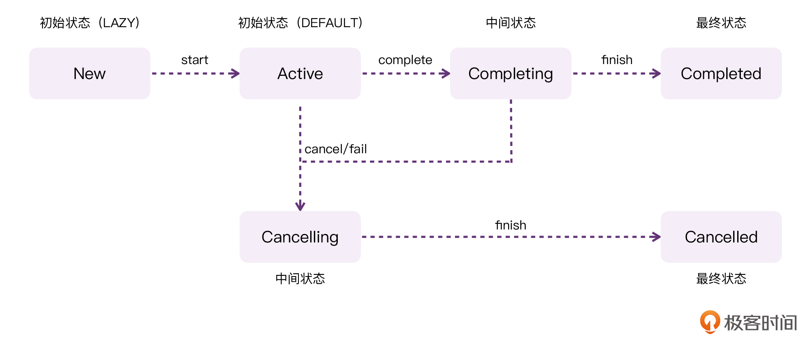
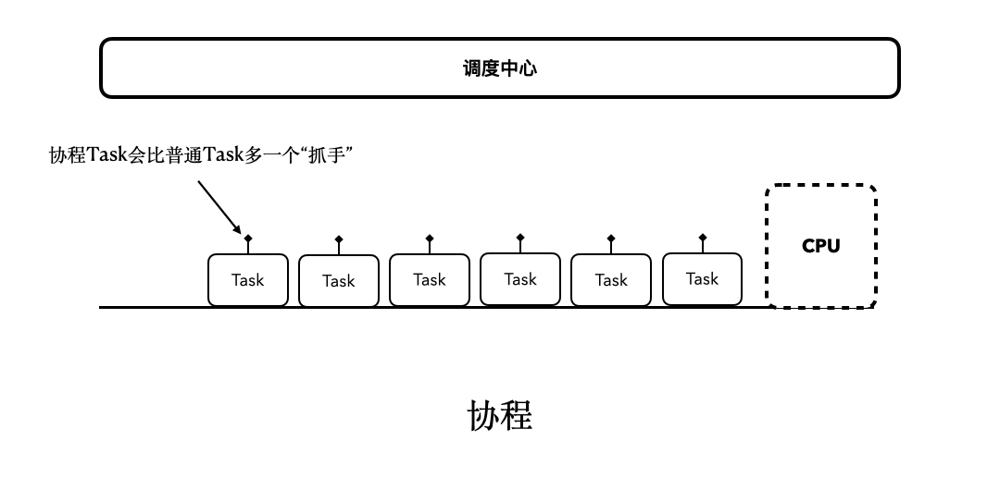
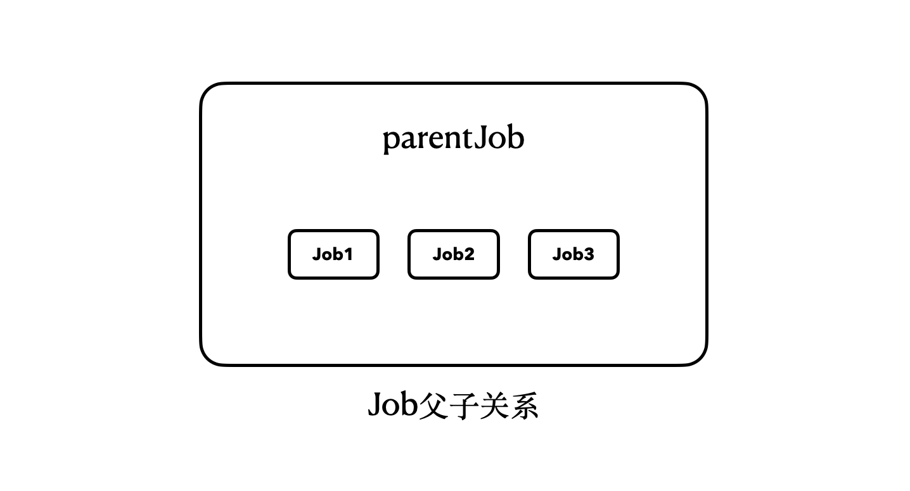
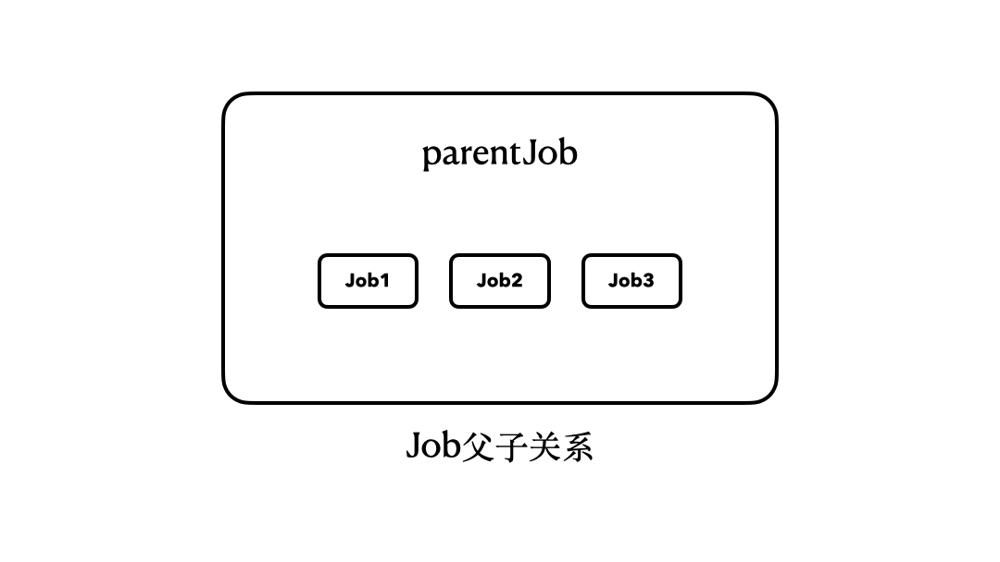
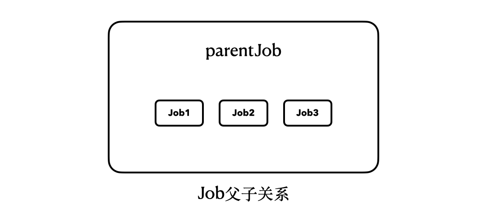
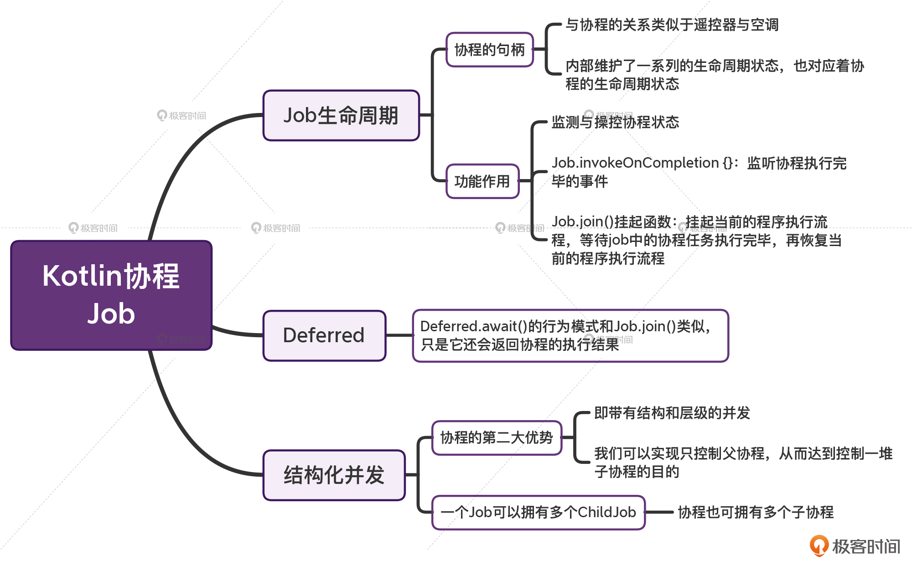

---
date: "2019-06-23"
---  
      
# 16 | Job：协程也有生命周期吗？
你好，我是朱涛。今天我们来学习Kotlin协程的Job。

Job其实就是协程的句柄。从某种程度上讲，当我们用launch和async创建一个协程以后，同时也会创建一个对应的Job对象。另外，Job也是我们理解**协程生命周期**、**结构化并发**的关键知识点。通过Job暴露的API，我们还可以让不同的协程之间互相配合，从而实现更加复杂的功能。

虽然前面已经解释过，Job就是协程的句柄，但你可能还是不清楚它到底是什么，因为句柄本身就是一个比较“虚”的概念。所以在这节课中，我们会从使用的角度入手，来看看Job到底能干什么。在充分理解了Job的用法以后，我们再来结合它的源代码进一步分析，这样对Job也会有一个更加清晰的认知。

## Job生命周期

在上节课我们学习launch、async的时候，我们知道它们两个返回值类型分别是Job和Deferred。

```
    // 代码段1
    
    public interface Deferred<out T> : Job {
        public suspend fun await(): T
    }
    

```

而如果你去看Deferred的源代码，你会发现，它其实也是继承自Job的。对应的，它只是多了一个泛型参数T，还多了一个返回类型为T的await\(\)方法。所以，不管是launch还是async，**它们本质上都会返回一个Job对象**。

<!-- [[[read_end]]] -->

通过Job对象，我们主要可以做两件事情：

* 使用Job **监测**协程的生命周期状态；
* 使用Job **操控**协程。

让我们来看一个具体的例子：

```
    // 代码段2
    
    fun main() = runBlocking {
        val job = launch {
            delay(1000L)
        }
        job.log()       // ①
        job.cancel()    // ②
        job.log()       // ③
        delay(1500L)
    }
    
    /**
     * 打印Job的状态信息
     */
    fun Job.log() {
        logX("""
            isActive = $isActive
            isCancelled = $isCancelled
            isCompleted = $isCompleted
        """.trimIndent())
    }
    
    /**
     * 控制台输出带协程信息的log
     */
    fun logX(any: Any?) {
        println("""
    ================================
    $any
    Thread:${Thread.currentThread().name}
    ================================""".trimIndent())
    }
    
    
    /*
    输出结果：
    ================================
    isActive = true
    isCancelled = false
    isCompleted = false
    Thread:main @coroutine#1
    ================================
    ================================
    isActive = false
    isCancelled = true
    isCompleted = false
    Thread:main @coroutine#1
    ================================
    */
    

```

在这段代码当中，我们定义了一个Job.log\(\)扩展函数，它的作用就是打印Job的生命周期状态。通过调用这个函数，我们就可以知道对应的协程处于什么状态。

注释①处的调用结果，“isActive = true”，这代表了当前的协程处于活跃状态。注释②，我们调用了job.cancel\(\)以后，协程任务就会被取消。因此，注释③处的调用结果就会变成“isCancelled = true”，这代表了协程任务处于取消状态。

所以从上面的代码中，我们可以看到：job.log\(\)，其实就是在**监测协程**；job.cancel\(\)，其实就是在**操控协程**。

而除了job.cancel\(\)可以操控协程以外，我们还经常使用job.start\(\)来启动协程任务，一般来说，它都是搭配“CoroutineStart.LAZY”来使用的。

```
    // 代码段3
    
    fun main() = runBlocking {
        //                  变化在这里
        //                      ↓
        val job = launch(start = CoroutineStart.LAZY) {
            logX("Coroutine start!")
            delay(1000L)
        }
        delay(500L)     
        job.log()       
        job.start()     // 变化在这里
        job.log()
        delay(500L)
        job.cancel()
        delay(500L)
        job.log()
        delay(2000L)
        logX("Process end!")
    }
    
    /*
    输出结果：
    ================================
    isActive = false
    isCancelled = false
    isCompleted = false
    Thread:main @coroutine#1
    ================================
    ================================
    isActive = true
    isCancelled = false
    isCompleted = false
    Thread:main @coroutine#1
    ================================
    ================================
    Coroutine start!
    Thread:main @coroutine#2
    ================================
    ================================
    isActive = false
    isCancelled = true
    isCompleted = true
    Thread:main @coroutine#1
    ================================
    ================================
    Process end!
    Thread:main @coroutine#1
    ================================
    */
    

```

根据以上代码的运行结果，可以发现，当我们使用CoroutineStart.LAZY作为启动模式的时候，协程任务被launch以后，并不会立即执行，即使我们在代码中delay了500毫秒，launch内部的`"Coroutine start!"`也仍然没有输出。这是典型的**懒加载**行为模式。

当我们在外部调用了job.start\(\)以后，job的状态才变成了Active活跃。而当调用了cancel以后，job的状态才变成isCancelled、isCompleted。

到这里，我们基本上就可以想象出Job整个的生命周期了。请参考下面这张图：



从图中，我们可以看到，对于协程的Job来说，它有两种初始状态，如果Job是以**懒加载**的方式创建的，那么它的初始状态将会是New；而如果一个协程是以**非懒加载**的方式创建的，那么它的初始状态就会是Active。

另外如果你仔细分析了上面代码的输出结果，你会发现，当调用cancel以后，会出现一个奇怪的现象：isCancelled = true、isCompleted = true。也就是说，当协程任务被取消以后，isCancelled和isCompleted同时都是true。但这跟上面的流程图并不一致啊！这是为什么呢？

这是因为，协程认为由于某种原因取消的协程，也仍然是一种“**结束状态**”，这其实也就对应了流程图中的“最终状态”。

换句话说，流程图当中的New、Active、Completing、Cancelling、Completed、Cancelled这些状态，都是Job内部私有的状态。而Job对外暴露出的isCompleted并不是与其一一对应的。Job内部私有的Completed、Cancelled状态，都会认为是外部的isCompleted状态。

测试了协程cancel\(\)方法以后，我们再来看看协程正常执行完毕的情况：

```
    // 代码段4
    
    fun main() = runBlocking {
        val job = launch(start = CoroutineStart.LAZY) {
            logX("Coroutine start!")
            delay(1000L)
        }
        delay(500L)
        job.log()
        job.start()
        job.log()
        delay(1100L)    // ①
        job.log()
        delay(2000L)    // ②
        logX("Process end!")
    }
    
    ================================
    isActive = false
    isCancelled = false
    isCompleted = false
    Thread:main @coroutine#1
    ================================
    ================================
    isActive = true
    isCancelled = false
    isCompleted = false
    Thread:main @coroutine#1
    ================================
    ================================
    Coroutine start!
    Thread:main @coroutine#2
    ================================
    ================================
    isActive = false
    isCancelled = false
    isCompleted = true
    Thread:main @coroutine#1
    ================================
    ================================
    Process end!
    Thread:main @coroutine#1
    ================================
    

```

在这段代码中，我们可以清晰地看到，协程的状态从Start到Active，最后到Completed，这很好理解。

不过，需要注意的是注释①处，为了等待job任务执行完毕，我们在外面等待了1100毫秒，这种方式其实并不好，因为大部分情况下，**我们很难从外部判断协程需要多长的时间才能结束**（比如网络请求任务、下载任务）。

另外，请留意上面的注释②处，我们使用delay\(2000L\)的方式，希望在job执行完毕以后输出“Process end\!”，这样的代码，也是建立在“我们知道Job只需要1000毫秒就能执行完毕”的前提。如果协程内部的delay远大于外部的delay，以上的运行结果就会完全不一样：

```
    // 代码段5
    
    fun main() = runBlocking {
        val job = launch(start = CoroutineStart.LAZY) {
            logX("Coroutine start!")
            delay(4000L) // 变化在这里
        }
        delay(500L)
        job.log()
        job.start()
        job.log()
        delay(1100L)    
        job.log()
        delay(2000L)    
        logX("Process end!")
    }
    
    /*
    输出结果：
    ================================
    isActive = false
    isCancelled = false
    isCompleted = false
    Thread:main @coroutine#1
    ================================
    ================================
    isActive = true
    isCancelled = false
    isCompleted = false
    Thread:main @coroutine#1
    ================================
    ================================
    Coroutine start!
    Thread:main @coroutine#2
    ================================
    ================================
    isActive = true
    isCancelled = false
    isCompleted = false
    Thread:main @coroutine#1
    ================================
    ================================
    Process end!
    Thread:main @coroutine#1
    ================================
    到这里，job仍然还在delay，整个程序并没有完全退出。
    */
    

```

可以看到，当我们将job内部的delay改为4000毫秒以后，执行结果就完全不一样了，我们无法监测到isCompleted状态。

另外，如果你实际运行了上面的代码，你会发现“Process end\!”输出以后，程序并没有立即结束，而是等待了大约900毫秒才结束，这是因为runBlocking会一直阻塞，等到job任务执行完毕以后才真正退出。

所以，为了更加灵活地**等待和监听**协程的结束事件，我们可以用job.join\(\)以及 `invokeOnCompletion {}` 来优化上面的代码。

```
    // 代码段6
    
    fun main() = runBlocking {
        suspend fun download() {
            // 模拟下载任务
            val time = (Random.nextDouble() * 1000).toLong()
            logX("Delay time: = $time")
            delay(time)
        }
        val job = launch(start = CoroutineStart.LAZY) {
            logX("Coroutine start!")
            download()
            logX("Coroutine end!")
        }
        delay(500L)
        job.log()
        job.start()
        job.log()
        job.invokeOnCompletion {
            job.log() // 协程结束以后就会调用这里的代码
        }
        job.join()      // 等待协程执行完毕
        logX("Process end!")
    }
    
    /*
    运行结果：
    ================================
    isActive = false
    isCancelled = false
    isCompleted = false
    Thread:main @coroutine#1
    ================================
    ================================
    isActive = true
    isCancelled = false
    isCompleted = false
    Thread:main @coroutine#1
    ================================
    ================================
    Coroutine start!
    Thread:main @coroutine#2
    ================================
    ================================
    Delay time: = 252
    Thread:main @coroutine#2
    ================================
    ================================
    Coroutine end!
    Thread:main @coroutine#2
    ================================
    ================================
    isActive = false
    isCancelled = false
    isCompleted = true
    Thread:main @coroutine#2
    ================================
    ================================
    Process end!
    Thread:main @coroutine#1
    ================================
    */
    

```

这里我们可以看到，`invokeOnCompletion {}` 的作用，其实就是监听协程结束的事件。需要注意的是，它和前面的isCompleted类似，如果job被取消了，`invokeOnCompletion {}` 这个回调仍然会被调用。

而job.join\(\)其实是一个“挂起函数”，它的作用就是：**挂起当前的程序执行流程，等待job当中的协程任务执行完毕，然后再恢复当前的程序执行流程**。可以看到，上节课学的“挂起函数”的概念再一次出现了，它对我们后续理解协程的API非常重要，如果你无法理解上面那句话的意思，一定要去重新回顾上节课的内容。

至此，我们就对Job的两种使用场景都已经有了充分认识了。我们来大概看看Job的源代码：

```
    // 代码段7
    
    public interface Job : CoroutineContext.Element {
    
        // 省略部分代码
    
        // ------------ 状态查询API ------------
    
        public val isActive: Boolean
    
        public val isCompleted: Boolean
    
        public val isCancelled: Boolean
    
        public fun getCancellationException(): CancellationException
    
        // ------------ 操控状态API ------------
    
        public fun start(): Boolean
    
        public fun cancel(cause: CancellationException? = null)
    
        public fun cancel(): Unit = cancel(null)
    
        public fun cancel(cause: Throwable? = null): Boolean
    
        // ------------ 等待状态API ------------
    
        public suspend fun join()
    
        public val onJoin: SelectClause0
    
        // ------------ 完成状态回调API ------------
    
        public fun invokeOnCompletion(handler: CompletionHandler): DisposableHandle
    
        public fun invokeOnCompletion(
            onCancelling: Boolean = false,
            invokeImmediately: Boolean = true,
            handler: CompletionHandler): DisposableHandle
    
    }
    

```

可见，Kotlin官方对Job的API做了更加详细的划分，但实际上来说都属于“**监测状态**”“**操控状态**”这两个大的范畴。

现在我们对Job也有了更加深入的认识了，不过到底该如何理解“**Job是协程的句柄**”这句话呢？

这里，我们还是可以从现实生活中找例子，来建立大致的思维模型。Job和协程的关系，就有点像“遥控器和空调的关系”。

* 空调遥控器可以**监测**空调的运行状态；Job也可以监测协程的运行状态；
* 空调遥控器可以**操控**空调的运行状态，Job也可以简单操控协程的运行状态。

所以，从某种程度来讲，遥控器也是空调对外暴露的一个“句柄”。

好，充分理解了Job以后，我们来看看Deferred。

## Deferred

前面我们介绍过Deferred其实就是继承自Job的一个接口，它并没有在Job的基础上扩展出很多其他功能，最重要的就是await\(\)这个方法。让我们来看一个简单的例子：

```
    // 代码段8
    
    fun main() = runBlocking {
        val deferred = async {
            logX("Coroutine start!")
            delay(1000L)
            logX("Coroutine end!")
            "Coroutine result!"
        }
        val result = deferred.await()
        println("Result = $result")
        logX("Process end!")
    }
    
    /*
    输出结果：
    ================================
    Coroutine start!
    Thread:main @coroutine#2
    ================================
    ================================
    Coroutine end!
    Thread:main @coroutine#2
    ================================
    Result = Coroutine result!
    ================================
    Process end!
    Thread:main @coroutine#1
    ================================
    */
    

```

从代码的执行结果中，我们可以发现，deferred.await\(\)这个方法，不仅可以帮助我们获取协程的执行结果，它还会阻塞当前协程的执行流程，直到协程任务执行完毕。在这一点的行为上，await\(\)和join\(\)是类似的。

我们也来看看await\(\)的函数签名：

```
    // 代码段9
    
    public interface Deferred<out T> : Job {
    //          注意这里
    //            ↓
        public suspend fun await(): T
    }
    

```

可以看到，await\(\)这个方法其实是一个挂起函数，这也就意味着，这个方法拥有挂起和恢复的能力。如果当前的Deferred任务还没执行完毕，那么，await\(\)就会挂起当前的协程执行流程，等待Deferred任务执行完毕，再恢复执行后面剩下的代码。

看到这里，也许你会觉得奇怪，**挂起函数不是非阻塞的吗？怎么这里又出现了阻塞？**注意，这里其实只是看起来像是阻塞了，但它实际上是将剩下的代码存了起来，留在后面才执行了。

为了让你更加透彻地理解await\(\)挂起函数背后的细节，我进一步完善了之前[协程思维模型](https://time.geekbang.org/column/article/485632)的动图。



所以，这里await\(\)后面的代码，虽然看起来是阻塞了，但它只是执行流程被挂起和恢复的一种表现。而且如果你仔细思考的话，你会发现上面这个动图，同样也描述了之前job.join\(\)的行为模式，在协程执行完毕之前，后面的协程代码都被暂时挂起了，等到协程执行完毕，才有机会继续执行。

所以，总的来说，Deferred只是比Job多了一个await\(\)挂起函数而已，通过这个挂起函数，我们可以等待协程执行完毕的同时，还可以直接拿到协程的执行结果。

至此，我们就已经把Job和Deferred的生命周期讲清楚了。对于Job，我们了解了**监测生命周期状态**、**操控生命周期状态**；对于Deferred，我们也明白了如何拿到它的**执行结果**。

那么接下来，就只剩下一个话题了：**结构化并发**。

## Job与结构化并发

也许你会经常看到类似这样的话：协程的优势在于结构化并发。在我看来，Kotlin协程的结构化并发，它的重要性，是仅次于“挂起函数”的。

也就是说，**“结构化并发”是Kotlin协程的第二大优势**。那么，到底什么是结构化并发呢？其实，这是一个非常大的话题，三言两语真的很难讲清楚。“结构化并发”会贯穿我们整个课程，随着课程的进展，你会发现，它跟很多其他协程概念都会发生牵连。

简单来说，“结构化并发”就是：**带有结构和层级的并发**。

说实话，在抽象的概念面前，语言和文字总会显得苍白无力。所以，我们还是来看一个具体的例子吧。

```
    // 代码段10
    
    fun main() = runBlocking {
        val parentJob: Job
        var job1: Job? = null
        var job2: Job? = null
        var job3: Job? = null
    
        parentJob = launch {
            job1 = launch {
                delay(1000L)
            }
    
            job2 = launch {
                delay(3000L)
            }
    
            job3 = launch {
                delay(5000L)
            }
        }
    
        delay(500L)
    
        parentJob.children.forEachIndexed { index, job ->
            when (index) {
                0 -> println("job1 === job is ${job1 === job}")
                1 -> println("job2 === job is ${job2 === job}")
                2 -> println("job3 === job is ${job3 === job}")
            }
        }
    
        parentJob.join() // 这里会挂起大约5秒钟
        logX("Process end!")
    }
    
    /*
    输出结果：
    job1 === job is true
    job2 === job is true
    job3 === job is true
    // 等待大约5秒钟
    ================================
    Process end!
    Thread:main @coroutine#1
    ================================
    */
    

```

在上面的代码中，我们一共定义了4个Job，parentJob是最外层的launch返回的对象，而在这个launch的内部，还额外嵌套了三个launch，它们的Job对象分别赋值给了job1、job2、job3。  
接着，我们对“parentJob.children”进行了遍历，然后逐一对比了它们与job1、job2、job3的引用是否相等（“===”代表了引用相等，即是否是同一个对象）。

通过这样的方式，我们可以确定，job1、job2、job3其实就是parentJob的children。也就是说，我们使用launch创建出来的协程，是存在**父子关系**的。

如果你去看Job的源代码，你会发现它还有两个API是用来描述父子关系的。

```
    // 代码段11
    
    public interface Job : CoroutineContext.Element {
        // 省略部分代码
    
        // ------------ parent-child ------------
    
        public val children: Sequence<Job>
    
        @InternalCoroutinesApi
        public fun attachChild(child: ChildJob): ChildHandle
    }
    

```

可以看到，每个Job对象，都会有一个children属性，它的类型是Sequence，它是一个惰性的集合，我们可以对它进行遍历。而attachChild\(\)则是一个协程内部的API，用于绑定ChildJob的，这个我们到源码篇的时候再深入了解。

所以，我们其实可以用一个简单的结构图来描述上面4个Job之间的关系：



那么，这样的父子关系到底意味着什么呢？如果你实际运行这里的代码，你就会注意到：“parentJob.join\(\)”这行代码会被挂起大约5秒钟。

注意了，我们调用的是parentJob的join\(\)方法，但是，它会等待其内部的job1、job2、job3全部执行完毕，才会恢复执行。换句话说，只有当job1、job2、job3全部执行完毕，parentJob才算是执行完毕了。



所以到这里，也许你就已经可以理解前面的那句话了：**结构化并发就是带有结构和层级的并发。**

实际上，协程不像我们之前学过的线程，线程之间是不存在父子关系的，但协程之间是会存在父子关系的。不过要命的是，协程的这种父子关系并不明显，如果我们不深入Job的源码，就无法意识到这一点。这也是很多人无法理解协程运行模式的原因所在。

毕竟，如果你将上面的4个launch都割裂来看，那么无论如何，你都无法理解上面代码的运行顺序，可是一旦你建立了协程Job父子关系的思维模型，你就可以轻而易举地理解以上的代码。

现在，我们将上面的代码做一些修改，我相信你也可以马上弄明白它的运行模式！

```
    // 代码段12
    
    fun main() = runBlocking {
        val parentJob: Job
        var job1: Job? = null
        var job2: Job? = null
        var job3: Job? = null
    
        parentJob = launch {
            job1 = launch {
                logX("Job1 start!")
                delay(1000L)
                logX("Job1 done!") // ①，不会执行
            }
    
            job2 = launch {
                logX("Job2 start!")
                delay(3000L)
                logX("Job2 done!") // ②，不会执行
            }
    
            job3 = launch {
                logX("Job3 start!")
                delay(5000L)
                logX("Job3 done!")// ③，不会执行
            }
        }
    
        delay(500L)
    
        parentJob.children.forEachIndexed { index, job ->
            when (index) {
                0 -> println("job1 === job is ${job1 === job}")
                1 -> println("job2 === job is ${job2 === job}")
                2 -> println("job3 === job is ${job3 === job}")
            }
        }
    
        parentJob.cancel() // 变化在这里
        logX("Process end!")
    }
    
    /*
    输出结果：
    ================================
    Job1 start!
    Thread:main @coroutine#3
    ================================
    ================================
    Job2 start!
    Thread:main @coroutine#4
    ================================
    ================================
    Job3 start!
    Thread:main @coroutine#5
    ================================
    job1 === job is true
    job2 === job is true
    job3 === job is true
    ================================
    // 这里不会等待5秒钟
    Process end!
    Thread:main @coroutine#1
    ================================
    */
    

```

这段代码，最大的改变就在于我们将“parentJob.join”改为了“parentJob.cancel\(\)”。从运行结果中我们可以看到，即使我们调用的只是parentJob的cancel\(\)方法，并没有碰过job1、job2、job3，但是它们内部的协程任务也全都被取消了。

这里，我们也可以用一个简单的动图来描述它们之间的关系：



所以，当我们以**结构化**的方式构建协程以后，我们的join\(\)、cancel\(\)等操作，也会以结构化的模式来执行。

## 思考与实战

在学完Job和Deferred以后，也许你已经可以非常明确地判断出什么场景该用launch，什么场景该用async了。那么，这是不是就意味着你已经完成了学习的目标呢？

当然不是！理论学得再多，如果不能结合实际落地场景来分析，那终究都是一场空。接下来，我们来看一个常见的代码模式：

```
    // 代码段13
    
    fun main() = runBlocking {
        suspend fun getResult1(): String {
            delay(1000L) // 模拟耗时操作
            return "Result1"
        }
    
        suspend fun getResult2(): String {
            delay(1000L) // 模拟耗时操作
            return "Result2"
        }
    
        suspend fun getResult3(): String {
            delay(1000L) // 模拟耗时操作
            return "Result3"
        }
    
        val results = mutableListOf<String>()
    
        val time = measureTimeMillis {
            results.add(getResult1())
            results.add(getResult2())
            results.add(getResult3())
        }
        println("Time: $time")
        println(results)
    }
    
    /*
    输出结果：
    Time: 3018
    [Result1, Result2, Result3]
    */
    

```

这段代码里，我们在内部定义了三个挂起函数getResult1\(\)、getResult2\(\)、getResult3\(\)，它们各自都会耗时1000毫秒，而且它们之间的运行结果也互不相干。代码逻辑也很简单，也是我们平时在工作中会经常遇到的业务场景。

不过请问，你知道该如何优化上面的代码吗？

我们进一步来分析一下。当我们直接调用这三个挂起函数，并且拿到结果以后，整个过程大约需要消耗3000毫秒，也就是这几个函数耗时的总和。对于这样的情况，我们其实完全可以使用async来优化：

```
    // 代码段14
    
    fun main() = runBlocking {
        suspend fun getResult1(): String {
            delay(1000L) // 模拟耗时操作
            return "Result1"
        }
    
        suspend fun getResult2(): String {
            delay(1000L) // 模拟耗时操作
            return "Result2"
        }
    
        suspend fun getResult3(): String {
            delay(1000L) // 模拟耗时操作
            return "Result3"
        }
    
        val results: List<String>
    
        val time = measureTimeMillis {
            val result1 = async { getResult1() }
            val result2 = async { getResult2() }
            val result3 = async { getResult3() }
    
            results = listOf(result1.await(), result2.await(), result3.await())
        }
    
        println("Time: $time")
        println(results)
    }
    
    /*
    输出结果：
    Time: 1032
    [Result1, Result2, Result3]
    */
    

```

所以，当我们总是拿launch和async来做对比的时候，就会不自觉地认为async是用来替代launch的。但实际上，async最常见的使用场景是：**与挂起函数结合，优化并发**。

请不要小看这个场景，在实际工作中，如果你仔细去分析嵌套的异步代码，你会发现，很多异步任务之间都是没有互相依赖的，这样的代码结合挂起函数后，再通过async并发来执行，是可以大大提升代码运行效率的。

换句话说，如果我们的任务是IO密集型的，代码运行效率是可以实现成倍提升的。一个简单的改造，能极大地提升运行效率，何乐而不为呢？

那么，万一我们的任务在某些场景下，并发反而会降低效率呢？这也很简单，我们也完全可以使用CoroutineStart来控制它的启动模式。所以，这种方式的**扩展性和灵活性**都很好。

## 小结

这节课，我们主要学习了Job、Deferred，通过对它们两者的学习，我们知道了，**协程是有生命周期的**，同时也发现，**协程其实是结构化的**。

具体来说，有以下几个要点我们需要好好掌握：

* Job，相当于协程的句柄，Job与协程的关系，有点像“遥控器与空调的关系”。
* Job，在它的内部，维护了一系列的生命周期状态，它也对应着协程的生命周期状态。
* 通过Job，我们可以**监测**协程的状态，比如isActive、isCancelled、isCompleted；另外，我们也可以一定程度地**操控**协程的状态，比如start\(\)、cancel\(\)。
* 除此之外，我们还可以通过 `Job.invokeOnCompletion {}` 来监听协程执行完毕的事件；通过Job.join\(\)这个挂起函数，我们可以**挂起**当前协程的执行流程，等到协程执行完毕以后，再**恢复**执行后面的代码。
* 而对于Deferred.await\(\)，它的行为模式和Job.join\(\)类似，只是它还会返回协程的执行结果。
* 另外，**协程是结构化的并发**，这是它的第二大优势。通过分析Job的源码，我们发现，一个Job可以拥有多个ChildJob；对应的，协程也可拥有多个“子协程”。
* 那么结构化并发带来的最大优势就在于，我们可以实现只控制“父协程”，从而达到控制一堆子协程的目的。在前面的例子中，parentJob.join\(\)不仅仅只会等待它自身执行完毕，还会等待它内部的job1、job2、job3执行完毕。parentJob.cancel\(\)同理。



最后呢，我也想跟你分享一下我学习协程的一些方法论。

其实，人学习新知识最快的方式，就是**与旧的知识建立关联**。举个例子，第一门计算机语言往往是最难学的，因为这是一个无中生有的过程；但当你掌握C、C++以后，再去学习Java、Python就会简单很多，因为你可以用脑子里的旧知识与其建立关联。

所以，虽然我在学习协程的时候也走了很多弯路，但总的来说，我做对了以下几件事，这里我也把经验分享给你。

第一，**横向对比**。在初次学习Kotlin协程失败以后，我去粗略学习了其他语言的协程，在那个时候，C#之类的协程学习资源更加丰富。通过对比C#、Go等语言的协程后，**我理解了“广义协程”的概念**，并且也知道yield、async、await只是一种广泛存在的协程模式。而当我理解了广义协程这个旧的知识之后，我突然发现Kotlin的协程就不难理解了。

第二，**建立思维模型**。这是我的一个“习惯”，不管是计算机网络、操作系统、数据结构、设计模式，还是其他领域，比如说高中的电磁学、大学的线性代数，在学习抽象知识的时候，我都喜欢虚构一些思维模型，来模拟它们内部的运行机制。

协程，就是一门非常抽象的技术，我喜欢用协程API编写一些简单的Demo来分析它们的行为模式，同时为其建立思维模型。这样一来，我脑海里的知识既不容易遗忘，也更成体系。比如，launch就像射箭；async就像钓鱼，这既是思维模型，同时也是在**用旧知识学新知识**。

第三，**纵向深入**。当我通过建立思维模型，对协程有了全面认识之后，我开始深入研究协程的源码。这时候，我从源码当中找到了更多的细节，来完善、支撑我脑子里的思维模型，从此，它们就不再是我凭空编造出来的东西了，因为证据都在源码里。这是一个**自顶向下、逐渐深入**的过程，反之则行不通。

所以，现在回过头来看，其实最重要的，还是用旧知识学新知识**。**希望我的方法能对你有所启发。

## 思考题

请问下面这段代码的执行结果是什么？你能分析出原因吗？

```
    // 代码段15
    
    fun main() = runBlocking {
        val job = launch {
            logX("First coroutine start!")
            delay(1000L)
            logX("First coroutine end!")
        }
    
        job.join()      
        val job2 = launch(job) {
            logX("Second coroutine start!")
            delay(1000L)
            logX("Second coroutine end!")
        }
        job2.join()
        logX("Process end!")
    }
    

```

欢迎在留言区分享你的答案，也欢迎你把今天的内容分享给更多的朋友。