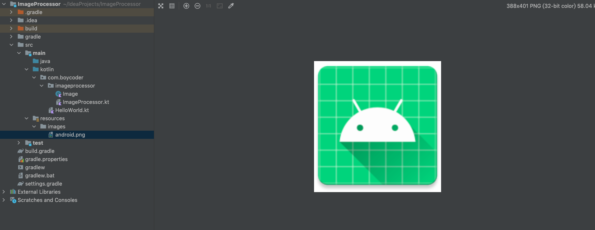
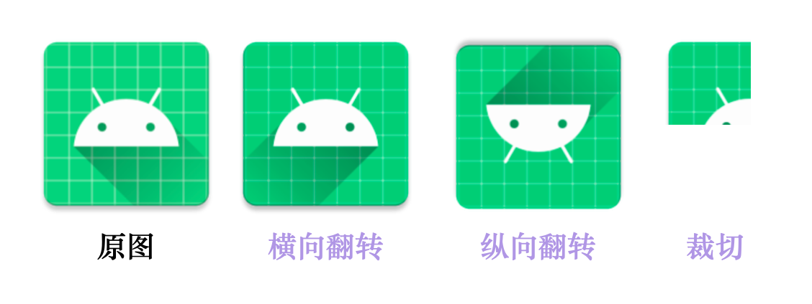
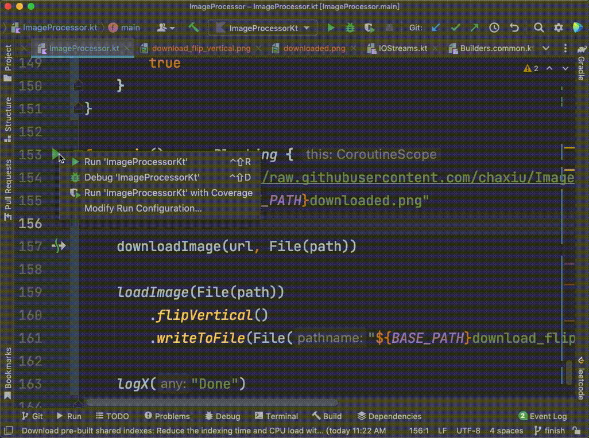

---
date: "2019-06-23"
---  
      
# 期中考试 | 用Kotlin实现图片处理程序
你好，我是朱涛。不知不觉间，咱们的课程就已经进行一半了，我们已经学完很多内容：

* 基础篇，我们学完了所有Kotlin基础语法和重要特性。
* 加餐篇，我们学习了Kotlin编程的5大编程思维：函数式思维、表达式思维、不变性思维、空安全思维、协程思维。
* 协程篇，我们也已经学完了所有基础的协程概念。

所以现在，是时候来一次阶段性的验收了。这次，我们一起来做一个**图片处理程序**，来考察一下自己对于Kotlin编程知识的理解和应用掌握情况。初始化工程的代码在这里[GitHub](https://github.com/chaxiu/ImageProcessor.git)，你可以像往常那样，将其clone下来，然后用IntelliJ打开即可。

我们仍然会分为两个版本1.0、2.0，不过，这一次要轮到你亲自动手写代码了！

## 1.0版本：处理本地图片

当你将初始化工程打开以后，你会发现“src/main/resources/images/”这个目录下有一张图片：android.png，它就是我们要处理的图片对象。



一般来说，我们想要处理图片，会第一时间想到Photoshop，但其实简单的图片处理任务，我们完全可以通过代码来实现，比如图片横向翻转、图片纵向翻转、图片裁切。



关于图片的底层定义，Java SDK已经提供了很好的支持，我们在Kotlin代码当中可以直接使用相关的类。为了防止你对JDK不熟悉，我在初始化工程当中，已经为你做好了前期准备工作：

<!-- [[[read_end]]] -->

```
    class Image(private val pixels: Array<Array<Color>>) {
    
        fun height(): Int {
            return pixels.size
        }
    
        fun width(): Int {
            return pixels[0].size
        }
    
        /**
         * 底层不处理越界
         */
        fun getPixel(y: Int, x: Int): Color {
            return pixels[y][x]
        }
    }
    

```

这是我定义的一个Image类，它的作用就是封装图片的内存对象。我们都知道，图片的本质是一堆像素点（Pixel），而每个像素点，都可以用RGB来表示，这里我们用Java SDK当中的Color来表示。

当我们把图片放大到足够倍数的时候，我们就可以看到其中的**正方形像素点**了。


所以，最终我们就可以用“`Array<Array<Color>>`”这样一个二维数组来表示一张图片。

另外，从本地加载图片到内存的代码，我也帮你写好了：

```
    const val BASE_PATH = "./src/main/resources/images/"
    
    fun main() {
        val image = loadImage(File("${BASE_PATH}android.png"))
        println("Width = ${image.width()};Height = ${image.height()}")
    }
    
    /**
     * 加载本地图片到内存中
     */
    fun loadImage(imageFile: File) =
        ImageIO.read(imageFile)
            .let {
                Array(it.height) { y ->
                    Array(it.width) { x ->
                        Color(it.getRGB(x, y))
                    }
                }
            }.let {
                Image(it)
            }
    

```

那么，唯一需要你做的，就是实现这几个函数的功能：**图片横向翻转、图片纵向翻转、图片裁切**。

```
    /**
     * 横向翻转图片
     * 待实现
     */
    fun Image.flipHorizontal(): Image = TODO()
    
    /**
     * 纵向翻转图片
     * 待实现
     */
    fun Image.flipVertical(): Image = TODO()
    
    /**
     * 图片裁切
     * 待实现
     */
    fun Image.crop(startY: Int, startX: Int, width: Int, height: Int): Image = TODO()
    

```

另外，如果你有兴趣的话，还可以去实现对应的单元测试代码：

```
    class TestImageProcessor {
    
        /**
         * 待实现的单元测试
         */
        @Test
        fun testFlipHorizontal() {
    
        }
    
        /**
         * 待实现的单元测试
         */
        @Test
        fun testFlipVertical() {
    
        }
    
        /**
         * 待实现的单元测试
         */
        @Test
        fun testCrop() {
    
        }
    }
    

```

这样一来，我们1.0版本的代码就算完成了。不过，我们还没用上协程的知识啊！

请看2.0版本。

## 2.0版本：增加图片下载功能

在上个版本中，我们的代码仅支持本地图片的处理，但有的时候，我们想要处理网络上的图片该怎么办呢？所以这时候，我们可以增加一个**下载网络图片的功能**。

这个版本，你只需要实现一个函数：

```
    /**
     * 挂起函数，以http的方式下载图片，保存到本地
     * 待实现
     */
    suspend fun downloadImage(url: String, outputFile: File): Boolean = TODO()
    

```

需要注意的是，由于下载网络图片比较耗时，我们需要将其定义成一个**挂起函数**，这样一来，我们后续在使用它的时候就可以更得心应手了。

```
    fun main() = runBlocking {
        // 不一定非要下载我提供的链接
        val url = "https://raw.githubusercontent.com/chaxiu/ImageProcessor/main/src/main/resources/images/android.png"
        val path = "${BASE_PATH}downloaded.png"
    
        // 调用挂起函数
        downloadImage(url, File(path))
    
        val image = loadImage(File(path))
        println("Width = ${image.width()};Height = ${image.height()}")
    }
    

```

在上面的代码中，我是以“<https://raw.githubusercontent.com/chaxiu/ImageProcessor/main/src/main/resources/images/android.png”> 这个链接为例，这是一个HTTPS的链接，你在实际开发的时候，也可以随便去找一个普通的HTTP图片链接，这样就不必处理SSL的问题了。

程序实际运行效果会是这样的：



在下节课里，我会给出我的代码参考，不过在看我的代码之前，记得先要自己动手啊。

其实，以我们这个工程为基础，再加上一些图形学算法，我们完全可以做出Photoshop当中的一些高级功能，比如图片缩放、图片参数调节、图片滤镜、抠像，甚至图片识别，等等。如果你本身就有图形学方面的知识储备，也欢迎你在此基础上实现更复杂的功能！

好了，我们下节课再见！