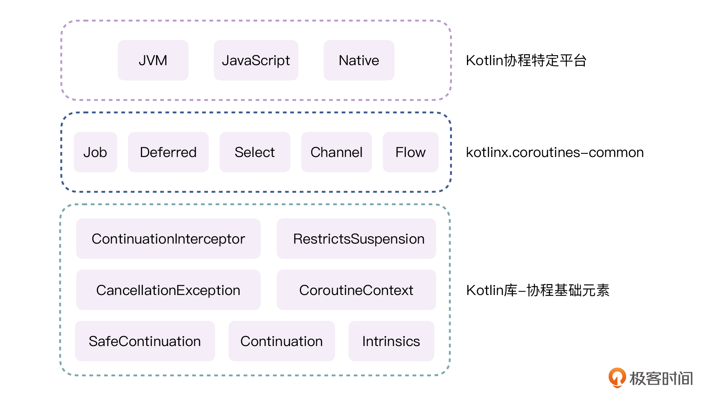
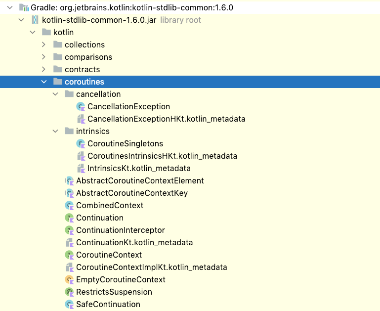
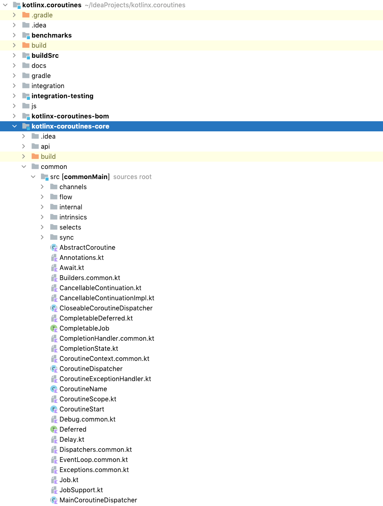
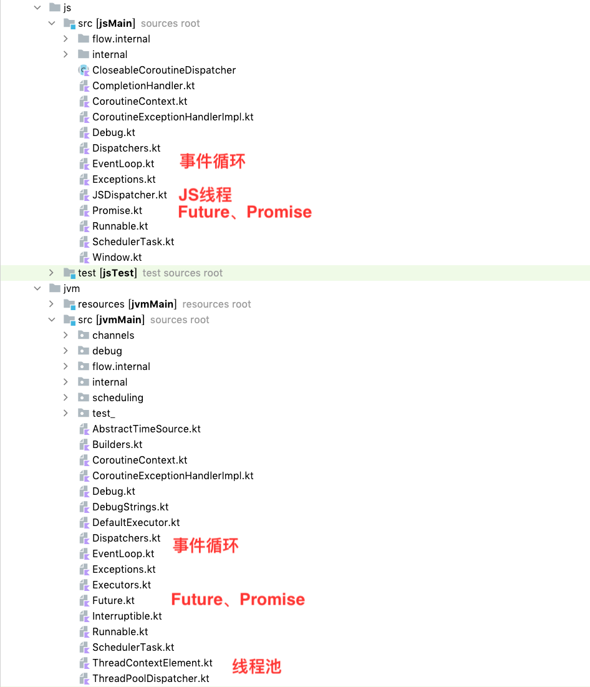
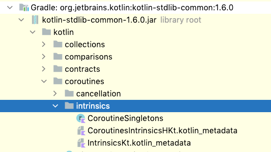

---
date: "2019-06-23"
---  
      
# 26 | 协程源码的地图：如何读源码才不会迷失？
你好，我是朱涛。

在前面学习协程的时候，我们说过协程是Kotlin里最重要、最难学的特性。之所以说协程重要，是因为它有千般万般的好：挂起函数、结构化并发、非阻塞、冷数据流，等等。不过协程也真的太抽象、太难学了。即使我们学完了前面的协程篇，知道了协程的用法，但也仍然远远不够，这种“知其然，不知其所以然”的感觉，总会让我们心里不踏实。

所以，我们必须搞懂Kotlin协程的源代码。

可问题是，协程的源码也非常复杂。如果你尝试研究过协程的源代码，那你对此一定深有体会。在Kotlin协程1.6.0版本中，仅仅是协程跟JVM相关的源代码，就有27789行。如果算上JavaScript平台、Native平台，以及单元测试相关的代码，Kotlin协程库当中的源代码有接近10万行。面对这么多的源代码，我们根本不可能一行一行去分析。

因此，我们在研究Kotlin协程的源代码的时候，要有一定的技巧。这里给你分享我的两个小技巧：

* **理解Kotlin协程的源码结构**。Kotlin协程的源代码分布在多个模块之中，每个模块都会包含特定的协程概念。相应的，它的各个概念也有特定的层级结构，只有弄清楚各个概念之间的关系，并且建立一个类似“地图”的知识结构，我们在研究源码的时候，才不会那么容易迷失。
* **明确研究源码的目标**。正如我前面提到的，我们不可能一次性看完协程所有的源代码，所以我们在读源码的过程中，一定要有明确的目标。比如是想要了解挂起函数的原理，还是想学习协程的启动流程。

<!-- [[[read_end]]] -->

所以在接下来的课程中，我们会主要攻克Kotlin协程源代码中，常见知识点的实现原理，比如挂起函数、launch、Flow等，理解其中的代码逻辑，并掌握这些功能特性所涉及的关键技术和设计思想。

今天这节课，我们先来构建一个协程源码的知识地图，掌握了这张地图之后，我们再去学习协程的实现原理时，就可以在脑海中快速查找和定位相关模块对应的源代码，也不会迷失方向了。

不过，在正式开始学习之前，我还是要提前给你打一剂预防针。课程进行到这个阶段，学习难度也进一步提升了。**不管是什么技术，研究它的底层原理永远不是一件容易的事情。**因此，为了提高学习的效率，你一定要跟随课程的内容，去IDE里查看对应的源代码，一定要去实际运行、调试课程中给出的代码Demo。

好，我们正式开始吧！

## 协程源码的结构

在[第13讲](https://time.geekbang.org/column/article/485632)当中我们提到过，Kotlin协程是一个独立的框架。如果想要使用Kotlin协程，我们需要单独进行依赖。

那么，要研究Kotlin协程，是不是只需研究这个协程框架的[GitHub仓库](https://github.com/Kotlin/kotlinx.coroutines)的代码就够了呢？其实不然。因为Kotlin的协程源码分为了三个层级，自底向上分别是：

* **基础层**：Kotlin库当中定义的协程基础元素；
* **中间层**：协程框架通用逻辑kotlinx.coroutines-common；
* **平台层**：这个是指协程在特定平台的实现，比如说JVM、JS、Native。



所以，我们需要分别从这三个层级来了解协程源码的目录结构、作用类别，以及对应的功能模块的源代码。也就是说，为了研究Kotlin协程的原理，我们不仅要读协程框架的源码，同时还要读Kotlin标准库的源码。接下来，我们一个个来看。

### 基础层：协程基础元素

Kotlin协程的基础元素，其实是定义在Kotlin标准库当中的。



比如，像是协程当中的一些基础概念，Continuation、SafeContinuation、CoroutineContext、CombinedContext、CancellationException、intrinsics等等，这些概念都是定义在Kotlin标准库当中的。

那么，Kotlin官方为什么要这么做呢？这其实是一种**解耦**的思想。Kotlin标准库当中的基础元素，就像是构造协程框架的“**砖块**”一样。简单的几个基础概念，将它们组合到一起，就可以实现功能强大的协程框架。

实际上，现在的kotlinx.coroutines协程框架，就是基于以上几种协程基础元素构造出来的。如果哪天GitHub上突然冒出一款新的Kotlin协程框架，你也不要觉得意外，因为构造协程的砖块就在那里，每个人都可以借助这些基础元素来构建自己的协程框架。

不过就目前来说，还是Kotlin官方封装的协程框架功能最强大，所以开发者也都会选择kotlinx.coroutines。另外我们都知道，Kotlin是支持跨平台的，所以协程其实也存在跨平台的实现。在Kotlin官方的协程框架当中，大致分了两层：common中间层和平台层。

### 中间层：kotlinx.coroutines-common

kotlinx.coroutines源代码当中的common子模块，里面包含了Kotlin协程框架的通用逻辑。我们前面学过的大部分知识点，都来自于这个模块，比如launch、async、CoroutineScope、CoroutineDispatcher、Job、Deferred、Channel、Select、Flow等。



虽然说，我们开发者使用那些底层的协程基础元素，也能够写代码，但它们终归是不如Flow之类的API好用的。而kotlinx.coroutines-common这个模块，就是Kotlin官方提供的一个协程的中间层。借助这些封装过后的高级协程概念，我们就可以直接去解决工作中的实际问题了。

在这个common中间层里，**只有纯粹的协程框架逻辑，不会包含任何特定的平台特性**。而我们知道，Kotlin其实是支持3种平台的：JVM、JavaScript、Native。所以针对平台的支持逻辑，都在下面的平台层当中。

### 平台层

在core模块之下，有几个与common平级的子模块，即JVM、JavaScript、Native。这里面，才是Kotlin协程与某个平台产生关联的地方。


我们都知道，Kotlin的协程，最终都是运行在线程之上的。所以，当Kotlin在不同平台上运行的时候，最终还需要映射到对应的线程模型之上。这里我们就以JVM和JavaScript为例：



可以看到，同样的协程概念，在JVM、JavaScript两个平台上会有不同的实现：

* 同样是线程，在JVM是线程池，而JavaScript则是JS线程；
* 同样是事件循环，两者也会有不同的实现方式；
* 同样是异步任务，JVM是Future，JavaScript则是Promise。

可见，虽然协程的“平台层”是建立在common层之上的，但它同时又为协程在特定平台上提供了对应的支持。

好，到这里，我们就已经弄清楚Kotlin协程的源码结构了。这个源码的结构，也就相当于协程知识点的**地图**。有了这个地图以后，我们在后面遇到问题的时候，才知道去哪里找答案。比如说，当我们想知道Kotlin的协程是如何运行在线程之上的，那么我们肯定要到平台层，去找JVM的具体实现。

## 如何研究协程源码？

读Kotlin协程的源代码，就像是一场原始森林里的探险一样。我们不仅要有一张清晰的地图，同时还要有**明确的目标**。

所以在接下来的源码篇当中，我们每一节课的学习目标都会非常明确，比如我们会来着重探究挂起函数的原理、协程启动原理、Dispatchers原理、CoroutineScope原理、Channel原理，还有Flow的原理。这些都是Kotlin协程当中最基础、最重要的知识点，掌握了它们的原理以后，我们在工作中使用协程时也会更有底气。就算遇到了问题，我们也可以通过读源码找到解决方案。

不过，即使有了探索的目标也还不够，在正式开始之前，我们还需要做一些额外的准备工作。

首先，**我们要掌握好协程的调试技巧**。在之后的课程当中，我们会编写一些简单的Demo，然后通过运行调试这些Demo，一步步去跟踪、分析协程的源代码。因此，如果你还没看过[第14讲](https://time.geekbang.org/column/article/486305)的内容，一定要回过头去看一下其中关于协程调试的内容。

其次，**我们要彻底弄懂协程的基础元素**。前面我提到过，Kotlin标准库当中的协程基础元素就像是构建协程框架的砖块一样。如果我们对协程的基础元素一知半解的话，在后面分析协程框架的过程中，就会寸步难行。

所以接下来，面对协程源码的三层结构：基础层、中间层、平台层，我们必须**自底向上**，一步步进行分析。


### Kotlin源码编译细节

另外，我们在平时用Kotlin协程的时候，一般只会使用依赖的方式：

```
        implementation "org.jetbrains.kotlin:kotlin-stdlib"
        implementation 'org.jetbrains.kotlinx:kotlinx-coroutines-core:1.6.0'
    

```

不过使用这种方式，我们会经常遇到某些类看不到源代码实现的情况。比如，kotlin.coroutines.intrinsics这个包下的源代码：



那么在这里，我也分享一下我读Kotlin源码的方式，给你作为参考。

首先，当遇到依赖包当中无法查看的类时，你可以去GitHub下载 [Kotlin](https://github.com/JetBrains/kotlin) 和 [Coroutines](https://github.com/Kotlin/kotlinx.coroutines) 的源代码，然后按照上面画的“协程源码地图”去找对应的源代码实现。

然后，在IDE当中导入这两个工程的时候，可能也会遇到各种各样的问题。这时候，你需要参考这两个链接里的内容：[Coroutine Contributing Guidelines](https://github.com/Kotlin/kotlinx.coroutines/blob/master/CONTRIBUTING.md)、[Kotlin Build environment requirements](https://github.com/JetBrains/kotlin#build-environment-requirements)，来配置好Kotlin和Coroutines的编译环境。

完成了这两个工程的导入工作以后，你就可以看到Kotlin和协程所有的源代码了。这里不仅有它们的核心代码，还会有跨平台实现、编译器实现，以及对应的单元测试代码。这样后面你在读Kotlin源码的时候，才会有更大的自由度。

## 小结

这节课的内容到这里就差不多结束了。接下来，我们来做一个简单的总结。

研究Kotlin协程的源代码，我们要注意两个要点：**理解Kotlin协程的源码结构**、**明确研究源码的目标**。如果我们把读源码当做是一次原始森林的探险，那么前者就相当于我们手中的**探险地图**，后者就相当于地图上的**探索目标和行进路线**。

有了这两个保障以后，我们才不会轻易迷失在浩瀚的协程源码中。

那么，对于协程的源码结构来说，主要可以分为三层。

* **基础层**：Kotlin库当中定义的协程基础元素。如果说协程框架是一栋大楼，那么这些基础元素，就相当于一个个的砖块。
* **中间层**：协程框架通用逻辑kotlinx.coroutines-common。协程框架里的Job、Deferred、Channel、Flow，它们都是通过协程基础元素组合出来的高级概念。这些概念跟平台无关，不管协程运行在JVM、JavaScript，还是Native上，这些概念都是不会变的。而这些概念的实现，全部都在协程的common中间层。
* **平台层**：最后就是协程在特定平台的实现，比如说JVM、JavaScript、Native。当协程要在某个平台运行的时候，它总是免不了要跟这个平台打交道。比如JVM，协程并不能脱离线程运行，因此协程最终还是会运行在JVM的线程池当中。

这节课的作用跟前面第13讲的作用其实是差不多的。毕竟在探险之前，我们总要做一些准备工作。另外最后我也想再强调一点，就是我之所以先带你梳理协程源码的结构，也是因为如果我一上来就给你贴一大堆源代码，开始跟你分析代码的执行流程，一定会很难接受和消化吸收。

所以，也请你不要轻视这节课的作用，一定要做好充足的准备，再出发。

## 思考题

在Kotlin协程的基础元素当中，最重要的其实就是Continuation这个接口。不过，在[Continuation.kt](https://github.com/JetBrains/kotlin/blob/master/libraries/stdlib/src/kotlin/coroutines/Continuation.kt)这个文件当中，还有两个重要的扩展函数：

```
    public interface Continuation<in T> {
    
        public val context: CoroutineContext
    
        public fun resumeWith(result: Result<T>)
    }
    
    public fun <T> (suspend () -> T).createCoroutine(
        completion: Continuation<T>
    ): Continuation<Unit> =
        SafeContinuation(createCoroutineUnintercepted(completion).intercepted(), COROUTINE_SUSPENDED)
    
    public fun <T> (suspend () -> T).startCoroutine(
        completion: Continuation<T>
    ) {
        createCoroutineUnintercepted(completion).intercepted().resume(Unit)
    }
    

```

请问你能猜到它们的作用是什么吗？这个问题的答案，我会在第28讲给出。