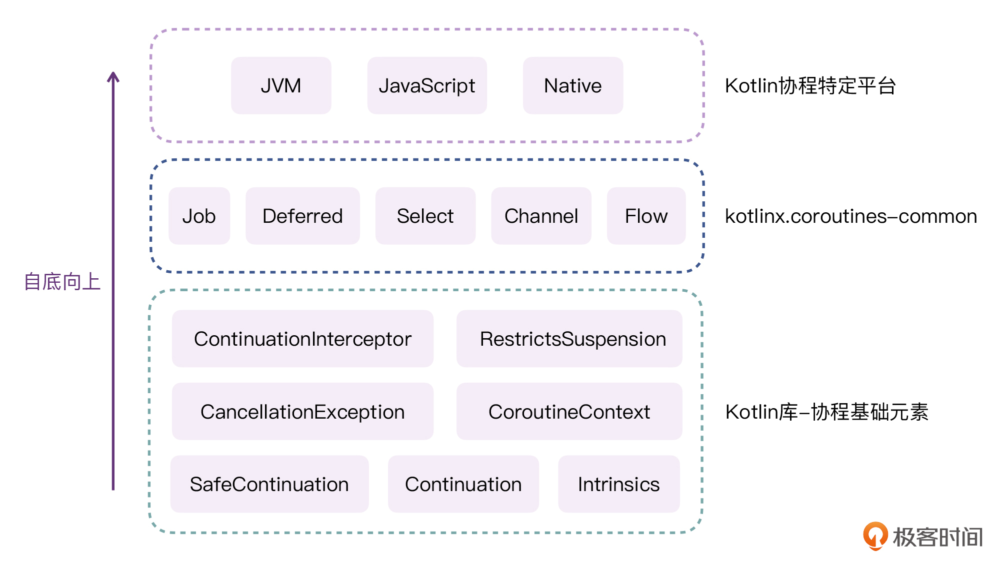

---
date: "2019-06-23"
---  
      
# 加餐五 | 深入理解协程基础元素
你好，我是朱涛。

在上一讲当中，我们深入研究了Kotlin挂起函数的原理，实际更多的是在了解协程的“基础层”。而接下来，我们将会开始研究协程启动的原理，探索协程的“中间层”。

在[第26讲](https://time.geekbang.org/column/article/495862)里，我曾提到过，Kotlin的协程框架其实就是协程基础元素组合出来的框架。如果我们想要弄懂Kotlin协程，首先就要将它的“基础层”理解透彻。

所以今天，我还是决定来一次加餐，带你系统深入地认识一下Kotlin协程当中的基础元素。等你对协程的基础层有了深入认识以后，下节课研究协程启动原理就会轻松一些了。

## 协程基础元素

通过第26讲我们现在已经知道，Kotlin协程的基础元素大致有这些：Continuation、SafeContinuation、CoroutineContext、CombinedContext、CancellationException、intrinsics。



其中的CoroutineContext、CancellationException我都已经介绍过了，另外的CombinedContext，其实就是CoroutineContext的一个实现类，而SafeContinuation则是Continuation的实现类。

<!-- [[[read_end]]] -->

所以，在整个协程基础元素当中，我们最需要关心的，其实就是**Continuation和intrinsics**。

在intrinsics里，有一个重要的高阶函数suspendCoroutineUninterceptedOrReturn\{\}，我们后面会讲到它。至于Continuation，虽然我们在前面已经介绍过它是什么，但还没有系统了解过它的用法，所以接下来，我们就先系统了解一下Continuation的两种用法。

## Continuation到底该怎么用？

实际上，在[第18讲](https://time.geekbang.org/column/article/488985)里，我们就已经学过Continuation的其中一种用法了：

```
    // 代码段1
    
    suspend fun <T : Any> KtCall<T>.await(): T =
        suspendCancellableCoroutine { continuation ->
            val call = call(object : Callback<T> {
                override fun onSuccess(data: T) {
                    // 注意这里
                    continuation.resume(data)
                }
    
    
                override fun onFail(throwable: Throwable) {
                    // 注意这里
                    continuation.resumeWithException(throwable)
                }
            })
    
            continuation.invokeOnCancellation {
                println("Call cancelled!")
                call.cancel()
            }
        }
    

```

当我们想要实现挂起函数的时候，可以使用suspendCoroutine\{\}、suspendCancellableCoroutine\{\}这两个高阶函数，在它们的Lambda当中，我们可以使用它暴露出来的continuation对象，把程序的执行结果或异常传到外部去。

**这种方式，往往是用于实现挂起函数内部逻辑的。**

比如说，我们可以用suspendCoroutine\{\}写一个更加简单的例子：

```
    // 代码段2
    
    fun main() = runBlocking {
        val result = getLengthSuspend("Kotlin")
        println(result)
    }
    
    suspend fun getLengthSuspend(text: String): Int = suspendCoroutine { continuation->
        thread {
            // 模拟耗时
            Thread.sleep(1000L)
            continuation.resume(text.length)
        }
    }
    
    /*
    输出结果：
    等待1秒
    6
    */
    

```

以上代码里，我们是使用suspendCoroutine\{\}实现了挂起函数，然后在它的内部，我们使用continuation.resume\(\)的方式，传出了挂起函数的返回值。

可能你会觉得奇怪，为什么以continuation.resume\(\)这样异步的方式传出结果以后，挂起函数就能接收到结果呢？其实，当我们把main\(\)函数当中的调用逻辑改一下，这一切就会清晰明了。

```
    // 代码段3
    
    // 变化在这里
    fun main()  {
        val func = ::getLengthSuspend as (String, Continuation<Int>) -> Any?
    
        func("Kotlin", object: Continuation<Int>{
            override val context: CoroutineContext
                get() = EmptyCoroutineContext
    
            override fun resumeWith(result: Result<Int>) {
                println(result.getOrNull())
            }
        })
    
        // 防止程序提前结束
        Thread.sleep(2000L)
    }
    
    suspend fun getLengthSuspend(text: String): Int = suspendCoroutine { continuation->
        thread {
            // 模拟耗时
            Thread.sleep(1000L)
            continuation.resume(text.length)
        }
    }
    /*
    输出结果：
    等待1秒
    6
    */
    

```

可以看到，在这段代码里，我们借助上节课的知识，把getLengthSuspend\(\)这个函数强转成了带有Continuation的函数类型，然后通过匿名内部类的方式，创建了一个Continuation对象传了进去。最终，程序的执行结果和代码段2是一致的。

你还记得我在[第15讲](https://time.geekbang.org/column/article/487085)提到过的观点吗？

> 挂起函数的本质，就是Callback\!

那么现在，就让我们把Continuation改为Callback，看看代码会变成什么样子。

```
    // 代码段4
    
    // 变化在这里
    fun main()  {
        func("Kotlin", object: Callback<Int>{
            override fun resume(result: Int) {
                println(result)
            }
        })
    
        // 防止程序提前结束
        Thread.sleep(2000L)
    }
    
    fun func(text: String, callback: Callback<Int>) {
        thread {
            // 模拟耗时
            Thread.sleep(1000L)
            callback.resume(text.length)
        }
    }
    
    interface Callback<T> {
        fun resume(value: T)
    }
    
    /*
    输出结果：
    等待1秒
    6
    */
    

```

可见，当我们把Continuation改成Callback以后，整个代码就变成了我们曾经最熟悉的异步回调代码了。调用方，可以使用匿名内部类创建Callback用于接收异步结果；异步函数内部，使用callback.resume\(\)将结果传出去。

综上所述，Kotlin协程当中的Continuation，作用其实就相当于Callback，它既可以用于**实现挂起函数**，往挂起函数的外部传递结果；也可以用于**调用挂起函数**，我们可以创建Continuation的匿名内部类，来接收挂起函数传递出来的结果。

所以在这里，我们也就可以轻松回答上节课的思考题了：

> 我们都知道挂起函数是Kotlin协程里才有的概念，请问，Java代码中可以调用Kotlin的挂起函数吗？比如，下面这个函数，我们可以在Java当中调用吗？

```
    // 代码段5
    
    // 需要在Java中调用的Kotlin挂起函数
    object SuspendFromJavaExample {
        // 在Java当中如何调用这个方法？
        suspend fun getUserInfo(id: Long):String {
            delay(1000L)
            return "Kotlin"
        }
    }
    

```

答案当然是肯定的，Java当中调用挂起函数的方式，其实跟前面的代码段3是一样的：

```
    // 代码段6
    
    public static void main(String[] args) throws InterruptedException {
        SuspendFromJavaExample.INSTANCE.getUserInfo(100L, new Continuation<String>() {
            @NotNull
            @Override
            public CoroutineContext getContext() {
                return EmptyCoroutineContext.INSTANCE;
            }
    
            @Override
            public void resumeWith(@NotNull Object o) {
                System.out.println(o+"");
            }
        });
    
        // 防止程序提前结束
        Thread.sleep(2000L);
    }
    
    /*
    输出结果
    Kotlin
    */
    

```

在上面的代码中，我们只是把代码段3的思想应用到了Java代码中而已，唯一需要**注意**的，就是：在Java当中访问Kotlin的object单例，是需要加上INSTANCE后缀的。这一点，我们在[第5讲](https://time.geekbang.org/column/article/475058)当中就已经了解过。

看到这里，可以发现，我们在实现挂起函数逻辑的时候，总是离不开**suspendCoroutine\{\}、suspendCancellableCoroutine\{\}**。其实，这两个高阶函数也是Kotlin协程的基础元素，让我们来进一步认识这两个高阶函数。

## suspendCoroutineUninterceptedOrReturn

实际上，suspendCoroutine\{\}、suspendCancellableCoroutine\{\}这两个高阶函数的实现原理是类似的，所以这里我们就主要解释下suspendCoroutine\{\}。

如果你去看suspendCoroutine\{\}的源代码，会发现它其实也在[Continuation.kt](https://github.com/JetBrains/kotlin/blob/master/libraries/stdlib/src/kotlin/coroutines/Continuation.kt)这个文件当中。

```
    // 代码段7
    
    public interface Continuation<in T> {
        public val context: CoroutineContext    
        public fun resumeWith(result: Result<T>)
    }
    
    public suspend inline fun <T> suspendCoroutine(crossinline block: (Continuation<T>) -> Unit): T {
    
        // 注意这里
        return suspendCoroutineUninterceptedOrReturn { c: Continuation<T> ->
            val safe = SafeContinuation(c.intercepted())
            block(safe)
            safe.getOrThrow()
        }
    }
    

```

在上面的代码中，我们第一眼就能看到一个名字特别长的高阶函数suspendCoroutineUninterceptedOrReturn\{\}。它其实就是实现suspendCoroutine\{\}的关键。除了它之外，其他部分的代码都很好理解：

* SafeContinuation\(c.intercepted\(\)\)这行代码的作用，就是把原本的Continuation包裹一遍。
* block\(safe\)这行代码，其实就是在调用Lambda当中的逻辑。
* safe.getOrThrow\(\)，就是在取出block\(safe\)的运行结果，我们在上节课也提到过，Continuation当中是可以存储result的。这个Result可能是正确的结果，也可能是异常。

下面我们重点来看看suspendCoroutineUninterceptedOrReturn\{\}这个高阶函数的作用。如果你去看它的源代码，那你看到的大概率会是这样的：

```
    // 代码段8
    
    public suspend inline fun <T> suspendCoroutineUninterceptedOrReturn(crossinline block: (Continuation<T>) -> Any?): T {
        contract { callsInPlace(block, InvocationKind.EXACTLY_ONCE) }
        throw NotImplementedError("Implementation of suspendCoroutineUninterceptedOrReturn is intrinsic")
    }
    

```

大部分人看到这样的代码可能都会觉得奇怪：**为什么这个高阶函数的源代码会是抛出异常呢？**

在前面的加餐二“表达式思维”里，我其实有做过说明，如果你还有印象的话，应该就能理解这样的代码也是符合函数返回值的规范的。不过，如果它总是抛异常的话，我们用suspendCoroutine\{\}写代码的时候，为什么不会产生崩溃呢？这个异常信息里的提示内容又是什么意思？

> “Implementation of suspendCoroutineUninterceptedOrReturn is intrinsic.”

实际上，理解这句话的关键在于“intrinsic”这个单词，它有“固有”“本质”的意思，不过在上面这句话的语境下，这里的intrinsic其实是指编译器领域的一个术语，我们可以把它理解为“内建”。因此，上面我们看到的异常提示信息的意思就是：suspendCoroutineUninterceptedOrReturn是一个编译器内建函数，**它是由Kotlin编译器来实现的**。

为了不偏离这节课的主题，这里我们就不去深究Kotlin编译器当中的逻辑了，感兴趣的话你可以自行研究这个[链接](https://github.com/JetBrains/kotlin/blob/1.6.0/compiler/backend/src/org/jetbrains/kotlin/codegen/coroutines/coroutineCodegenUtil.kt)。接下来，我们可以换一个角度，写一些Demo代码，通过运行调试来看看这个内建函数的功能和作用。

让我们先来看看suspendCoroutineUninterceptedOrReturn这个高阶函数的参数，它会接收一个Lambda，类型是`(Continuation<T>) \-> Any?`，经过上节课的学习，你是否觉得这个类型有些眼熟呢？这里的“Any\?”类型，其实就能代表当前这个挂起函数是否真正挂起。

因此，我们可以写出下面这样的代码：

```
    // 代码段9
    
    fun main() = runBlocking {
        val result = testNoSuspendCoroutine()
        println(result)
    }
    
    private suspend fun testNoSuspendCoroutine() = suspendCoroutineUninterceptedOrReturn<String> {
            continuation ->
        return@suspendCoroutineUninterceptedOrReturn "Hello!"
    }
    
    /*
    输出结果：
    Hello!
    */
    

```

在这段代码中，我们直接使用suspendCoroutineUninterceptedOrReturn实现了挂起函数，并且，在它的Lambda当中，我们并没有调用continuation.resume\(\)，而是直接返回了结果“Hello\!”。根据程序的运行结果，我们可以看到，在挂起函数的外部确实也可以接收到这个结果。

那么这时候，如果我们把上面的代码反编译一下，会看到类似这样的代码：

```
        // 代码段10
    
        private static final Object testNoSuspendCoroutine(Continuation $completion) {
          int var2 = false;
          if ("Hello!" == IntrinsicsKt.getCOROUTINE_SUSPENDED()) {
             DebugProbesKt.probeCoroutineSuspended($completion);
          }
        
          return "Hello!";
        }
    

```

所以，从反编译的结果来看，testNoSuspendCoroutine\(\)这个函数其实就是一个**伪挂起函数**，它的内部并不会真正挂起。这样，当我们从外部调用这个函数的时候，这个函数会立即返回结果“Hello\!”。

而这时候，我们可以再写一个真正的挂起函数：

```
    // 代码段11
    
    fun main() = runBlocking {
        val result = testSuspendCoroutine()
        println(result)
    }
    
    private suspend fun testSuspendCoroutine() = suspendCoroutineUninterceptedOrReturn<String> {
        continuation ->
        thread {
            Thread.sleep(1000L)
            continuation.resume("Hello!")
    
    
        }
        return@suspendCoroutineUninterceptedOrReturn kotlin.coroutines.intrinsics.COROUTINE_SUSPENDED
    }
    
    /*
    输出结果：
    等待1秒
    Hello!
    */
    

```

这一次，我们并没有使用return返回结果，而是使用了continuation.resume\(\)。通过程序运行结果，我们可以看到挂起函数的外部也能接收到这个结果。然后我们也再来反编译一下，看看它对应的Java代码：

```
    // 代码段12
    
    private static final Object testSuspendCoroutine(Continuation $completion) {
        int var2 = false;
        // 1
        ThreadsKt.thread$default(false, false, (ClassLoader)null, (String)null, 0, (Function0)(new CoroutineBasicElementsKt$testSuspendCoroutine$2$1($completion)), 31, (Object)null);
        // 2
        Object var10000 = IntrinsicsKt.getCOROUTINE_SUSPENDED();
        if (var10000 == IntrinsicsKt.getCOROUTINE_SUSPENDED()) {
         DebugProbesKt.probeCoroutineSuspended($completion);
        }
        // 3
        return var10000;
    }
    
    final class CoroutineBasicElementsKt$testSuspendCoroutine$2$1 extends Lambda implements Function0 {
    
       final Continuation $it;
    
       public Object invoke() {
          this.invoke();
          return Unit.INSTANCE;
       }
    
       public final void invoke() {
          // 4
          Thread.sleep(1000L);
          Continuation var1 = this.$it;
          String var2 = "Hello!";
          Companion var3 = Result.Companion;
          var1.resumeWith(Result.constructor-impl(var2));
       }
    
       CoroutineBasicElementsKt$testSuspendCoroutine$2$1(Continuation var1) {
          super(0);
          this.$it = var1;
       }
    }
    

```

以上代码中一共有4个注释，我们一个个看：

* 注释1、4，创建了一个新的线程，执行了thread\{\}当中的代码。
* 注释2，将var10000赋值为COROUTINE\_SUSPENDED这个挂起标志位。
* 注释3，返回挂起标志位，代表testSuspendCoroutine\(\)这个函数会真正挂起。

所以，这两个例子其实也从侧面证明了我们在上节课当中的结论：

> 由于 suspend 修饰的函数，既可能返回 CoroutineSingletons.COROUTINE\_SUSPENDED，也可能返回实际结果，甚至可能返回 null，为了适配所有的可能性，CPS转换后的函数返回值类型就只能是Any\?了。

那么现在，我们也就可以总结出**suspendCoroutineUninterceptedOrReturn\{\}这个高阶函数的作用**了：它可以将挂起函数当中的Continuation以参数的形式暴露出来，在它的Lambda当中，我们可以直接返回结果，这时候它就是一个“伪挂起函数”；或者，我们也可以返回COROUTINE\_SUSPENDED这个挂起标志位，然后使用continuation.resume\(\)传递结果。

相应的，suspendCoroutine\{\}、suspendCancellableCoroutine\{\}这两个高阶函数，只是对它的一种封装而已。

## 小结

这节课，我们学习了Kotlin协程当中与挂起函数密切相关的两个基础元素，Continuation、suspendCoroutine\{\}。

Continuation是整个协程当中最重要的基础元素，我们可以将其看做是一个Callback。它主要有两个使用场景，一种是在实现挂起函数的时候，用于传递挂起函数的执行结果；另一种是在调用挂起函数的时候，以匿名内部类的方式，用于接收挂起函数的执行结果。借助这种思路，我们也完全可以在Java当中调用挂起函数。

当我们想要实现挂起函数的时候，我们往往需要使用suspendCoroutine\{\}、suspendCancellableCoroutine\{\}这两个高阶函数。它们两个都是对suspendCoroutineUninterceptedOrReturn\{\}的封装，这个高阶函数的作用其实就是暴露挂起函数的Continuation对象。在它的Lambda当中，我们既可以直接返回执行结果，也可以返回COROUTINE\_SUSPENDED这个挂起标志位，然后使用continuation.resume\(\)传递结果。

## 思考题

你觉得，suspendCoroutine\{\}、suspendCancellableCoroutine\{\}这两个高阶函数，它对比suspendCoroutineUninterceptedOrReturn\{\}的优势在哪里？Kotlin官方为什么要进行这样的封装呢？

欢迎在留言区分享你的答案，也欢迎你把今天的内容分享给更多的朋友。