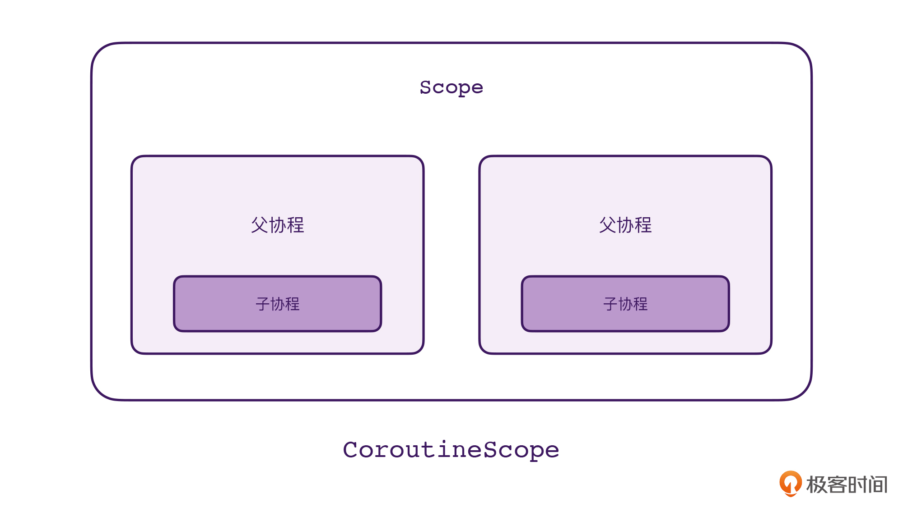
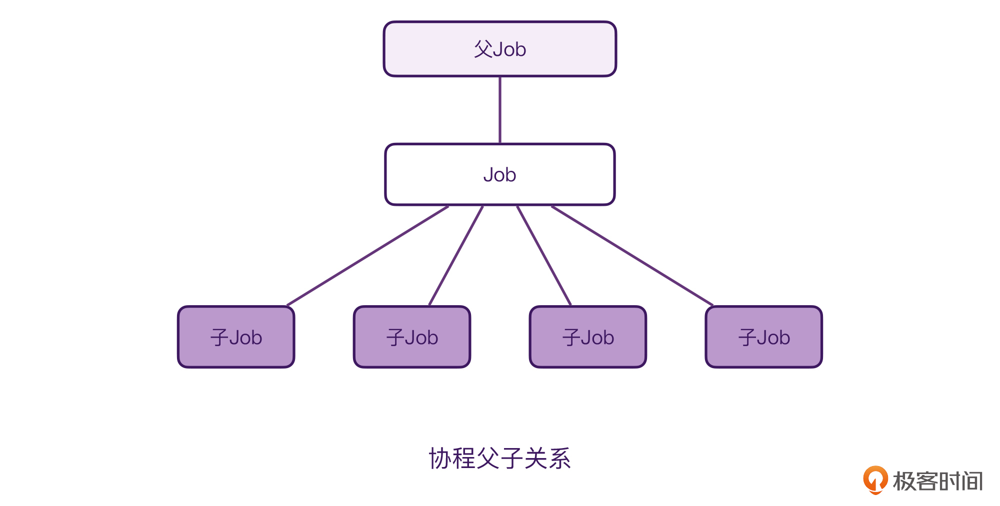
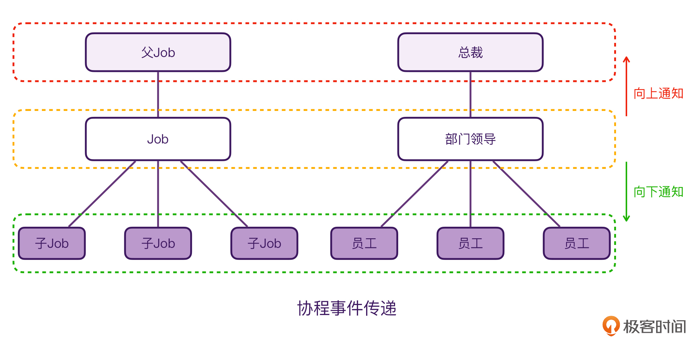
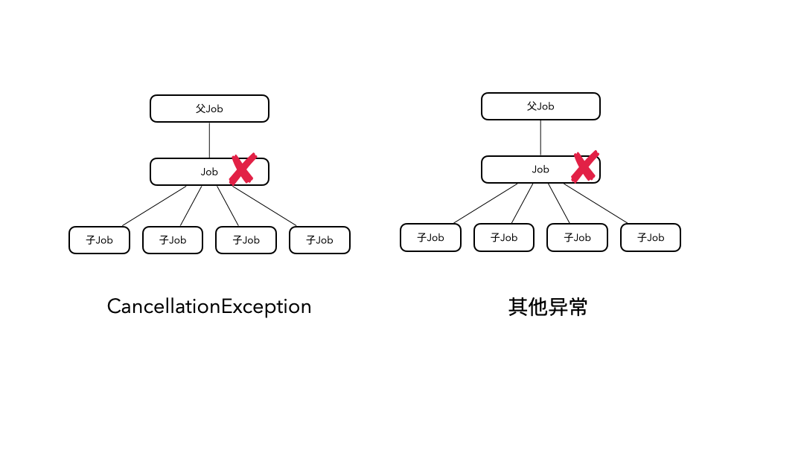

---
date: "2019-06-23"
---  
      
# 30 | CoroutineScope是如何管理协程的？
你好，我是朱涛。

通过前面课程的学习，我们知道CoroutineScope是实现协程结构化并发的关键。使用CoroutineScope，我们可以批量管理同一个作用域下面所有的协程。那么，今天这节课，我们就来研究一下CoroutineScope是如何管理协程的。

## CoroutineScope VS 结构化并发

在前面的课程中，我们学习过CoroutineScope的用法。由于launch、async被定义成了CoroutineScope的扩展函数，这就意味着：在调用launch之前，我们必须先获取CoroutineScope。

```
    // 代码段1
    
    public fun CoroutineScope.launch(
        context: CoroutineContext = EmptyCoroutineContext,
        start: CoroutineStart = CoroutineStart.DEFAULT,
        block: suspend CoroutineScope.() -> Unit
    ): Job {}
    
    public fun <T> CoroutineScope.async(
        context: CoroutineContext = EmptyCoroutineContext,
        start: CoroutineStart = CoroutineStart.DEFAULT,
        block: suspend CoroutineScope.() -> T
    ): Deferred<T> {}
    
    private fun testScope() {
        val scope = CoroutineScope(Job())
        scope.launch{
            // 省略
        }
    }
    

```
<!-- [[[read_end]]] -->

不过，很多初学者可能不知道，协程早期的API并不是这么设计的，最初的launch、async只是普通的顶层函数，我们不需要scope就可以直接创建协程，就像这样：

```
    // 代码段2
    
    private fun testScope() {
        // 早期协程API的写法
        launch{
            // 省略
        }
    }
    

```

很明显，代码段2的写法要比代码段1的简单很多，那么Kotlin官方为什么要舍近求远，专门设计一个更加复杂的API呢？这一切，都是因为**结构化并发**。

让我们来看一段代码：

```
    // 代码段3
    
    private fun testScope() {
        val scope = CoroutineScope(Job())
        scope.launch{
            launch {
                delay(1000000L)
                logX("Inner")
            }
            logX("Hello!")
            delay(1000000L)
            logX("World!")  // 不会执行
        }
    
        scope.launch{
            launch {
                delay(1000000L)
                logX("Inner！！！")
            }
            logX("Hello！！!")
            delay(1000000L)
            logX("World1!！！")  // 不会执行
        }
        Thread.sleep(500L)
        scope.cancel()
    }
    

```

上面这段代码很简单，我们使用scope创建了两个顶层的协程，接着，在协程的内部我们使用launch又创建了一个子协程。最后，我们在协程的外部等待了500毫秒，并且调用了scope.cancel\(\)。这样一来，我们前面创建的4个协程就全部都取消了。



通过前面[第17讲](https://time.geekbang.org/column/article/488571)的学习，我们知道上面的代码其实可以用这样的关系图来表示。父协程是属于Scope的，子协程是属于父协程的，因此，只要调用了scope.cancel\(\)，这4个协程都会被取消。

想象一下，如果我们将上面的代码用协程最初的API改写的话，这一切就完全不一样了：

```
    // 代码段4
    
    // 使用协程最初的API，只是伪代码
    private fun testScopeJob() {
        val job = Job()
        launch(job){
            launch {
                delay(1000000L)
                logX("Inner")
            }
            logX("Hello!")
            delay(1000000L)
            logX("World!")  // 不会执行
        }
    
        launch(job){
            launch {
                delay(1000000L)
                logX("Inner！！！")
            }
            logX("Hello！！!")
            delay(1000000L)
            logX("World1!！！")  // 不会执行
        }
        Thread.sleep(500L)
        job.cancel()
    }
    

```

在上面的代码中，为了实现结构化并发，我们不得不创建一个Job对象，然后将其传入launch当中作为参数。

你能感受到其中的差别吗？如果使用原始的协程API，结构化并发是需要开发者自觉往launch当中传job参数才能实现，它是**可选**的，开发者也可能疏忽大意，忘记传参数。而launch成为CoroutineScope的扩展函数以后，这一切就成为**必须**的了，我们开发者不可能忘记。

而且，通过对比代码段3和4以后，我们也可以发现：**CoroutineScope管理协程的能力，其实也是源自于Job。**

那么，CoroutineScope与Job到底是如何实现结构化并发的呢？接下来，让我们从源码中寻找答案吧！

## 父子关系在哪里建立的？

在分析源码之前，我们先来写一个简单的Demo。接下来，我们就以这个Demo为例，来研究一下CoroutineScope是如何通过Job来管理协程的。

```
    // 代码段5
    
    private fun testScope() {
        // 1
        val scope = CoroutineScope(Job())
        scope.launch{
            launch {
                delay(1000000L)
                logX("Inner")  // 不会执行
            }
            logX("Hello!")
            delay(1000000L)
            logX("World!")  // 不会执行
        }
    
        Thread.sleep(500L)
        // 2
        scope.cancel()
    }
    
    public interface CoroutineScope {
        public val coroutineContext: CoroutineContext
    }
    
    public interface Job : CoroutineContext.Element {}
    

```

以上代码的逻辑很简单，我们先来看看注释1对应的地方。我们都知道，CoroutineScope是一个接口，那么我们**为什么可以调用它的构造函数，来创建CoroutineScope对象呢？**不应该使用object关键字创建匿名内部类吗？

其实，代码段5当中调用CoroutineScope\(\)并不是构造函数，而是一个顶层函数：

```
    // 代码段6
    
    // 顶层函数
    public fun CoroutineScope(context: CoroutineContext): CoroutineScope =
        // 1
        ContextScope(if (context[Job] != null) context else context + Job())
    
    // 顶层函数
    public fun Job(parent: Job? = null): CompletableJob = JobImpl(parent)
    

```

在[第1讲](https://time.geekbang.org/column/article/472154)当中，我曾提到过，Kotlin当中的函数名称，在大部分情况下都是遵循“[驼峰命名法](https://zh.wikipedia.org/wiki/%E9%A7%9D%E5%B3%B0%E5%BC%8F%E5%A4%A7%E5%B0%8F%E5%AF%AB)”的，而在一些特殊情况下则不遵循这种命名法。上面的顶层函数CoroutineScope\(\)，其实就属于特殊的情况，因为它虽然是一个普通的顶层函数，但它发挥的作用却是“构造函数”。类似的用法，还有Job\(\)这个顶层函数。

因此，在Kotlin当中，当顶层函数作为构造函数使用的时候，**它的首字母是要大写的**。

让我们回到代码段6，看看其中注释1的地方。这行代码的意思是，当我们创建CoroutineScope的时候，如果传入的Context是包含Job的，那就直接用；如果是不包含Job的，就会创建一个新的Job。这就意味着，**每一个CoroutineScope对象，它的Context当中必定存在一个Job对象。**而代码段5当中的CoroutineScope\(Job\(\)\)，改成CoroutineScope\(\)也是完全没问题的。

接下来，我们再来看看launch的源代码：

```
    // 代码段7
    
    public fun CoroutineScope.launch(
        context: CoroutineContext = EmptyCoroutineContext,
        start: CoroutineStart = CoroutineStart.DEFAULT,
        block: suspend CoroutineScope.() -> Unit
    ): Job {
        // 1
        val newContext = newCoroutineContext(context)
        // 2
        val coroutine = if (start.isLazy)
            LazyStandaloneCoroutine(newContext, block) else
            StandaloneCoroutine(newContext, active = true)
        // 3
        coroutine.start(start, coroutine, block)
        return coroutine
    }
    

```

在前面两节课里，我们已经分析过注释1和注释3当中的逻辑了，这节课呢，我们来分析注释2处的逻辑。

```
    // 代码段8
    
    private open class StandaloneCoroutine(
        parentContext: CoroutineContext,
        active: Boolean
    ) : AbstractCoroutine<Unit>(parentContext, initParentJob = true, active = active) {
        override fun handleJobException(exception: Throwable): Boolean {
            handleCoroutineException(context, exception)
            return true
        }
    }
    
    private class LazyStandaloneCoroutine(
        parentContext: CoroutineContext,
        block: suspend CoroutineScope.() -> Unit
    ) : StandaloneCoroutine(parentContext, active = false) {
        private val continuation = block.createCoroutineUnintercepted(this, this)
    
        override fun onStart() {
            continuation.startCoroutineCancellable(this)
        }
    }
    

```

可以看到，StandaloneCoroutine是AbstractCoroutine的子类，而在[第28讲](https://time.geekbang.org/column/article/499826)当中，我们就已经遇到过AbstractCoroutine，它其实就是代表了**协程的抽象类**。另外这里有一个initParentJob参数，它是true，代表了协程创建了以后，需要初始化协程的父子关系。而LazyStandaloneCoroutine则是StandaloneCoroutine的子类，它的active参数是false，代表了以懒加载的方式创建协程。

接下来，我们就看看它们的父类AbstractCoroutine：

```
    // 代码段9
    
    public abstract class AbstractCoroutine<in T>(
        parentContext: CoroutineContext,
        initParentJob: Boolean,
        active: Boolean
    ) : JobSupport(active), Job, Continuation<T>, CoroutineScope {
    
        init {
            if (initParentJob) initParentJob(parentContext[Job])
        }
    }
    

```

可以看到，**AbstractCoroutine其实是JobSupport的子类**，在它的init\{\} 代码块当中，会根据initParentJob参数，判断是否需要初始化协程的父子关系。这个参数我们在代码段8当中已经分析过了，它一定是true，所以这里的initParentJob\(\)方法一定会执行，而它的参数parentContext\[Job\]取出来的Job，其实就是我们在Scope当中的Job。

另外，这里的initParentJob\(\)方法，是它的父类JobSupport当中的方法，我们来看看：

```
    // 代码段10
    
    public open class JobSupport constructor(active: Boolean) : Job, ChildJob, ParentJob, SelectClause0 {
        final override val key: CoroutineContext.Key<*> get() = Job
    
        protected fun initParentJob(parent: Job?) {
            assert { parentHandle == null }
            // 1
            if (parent == null) {
                parentHandle = NonDisposableHandle
                return
            }
            // 2
            parent.start()
            @Suppress("DEPRECATION")
            // 3
            val handle = parent.attachChild(this)
            parentHandle = handle
    
            if (isCompleted) {
                handle.dispose()
                parentHandle = NonDisposableHandle 
            }
        }
    }
    
    // Job源码
    public interface Job : CoroutineContext.Element {
        public val children: Sequence<Job>   
        public fun attachChild(child: ChildJob): ChildHandle
    }
    

```

上面的代码一共有三个地方需要注意，我们来分析一下：

* 注释1，判断传入的parent是否为空，如果parent为空，说明当前的协程不存在父Job，这时候就谈不上创建协程父子关系了。不过，如果按照代码段5的逻辑来分析的话，此处的parent则是scope当中的Job，因此，代码会继续执行到注释2。
* 注释2，这里是确保parent对应的Job启动了。
* 注释3，parent.attachChild\(this\)，这个方法我们在[第16讲](https://time.geekbang.org/column/article/487930)当中提到过，它会将当前的Job，添加为parent的子Job。**这里其实就是建立协程父子关系的关键代码。**

所以，我们可以将协程的结构当作一颗**N叉树**。每一个协程，都对应着一个Job的对象，而每一个Job可以有一个父Job，也可以有多个子Job。



这样，当我们知道协程的父子关系是如何建立的了以后，父协程如何取消子协程也就很容易理解了。

## 协程是如何“结构化取消”的？

其实，协程的结构化取消，本质上是**事件的传递**，它跟我们平时生活中的场景都是类似的：



就比如，当我们在学校、公司内部，有消息或任务需要传递的时候，总是遵循这样的规则：处理好分内的事情，剩下的部分交给上级和下级。协程的结构化取消，也是通过这样的事件消息模型来实现的。

甚至，如果让我们来实现协程API的话，都能想象到它的代码该怎么写：

```
    // 代码段11
    
    fun Job.cancelJob() {
        // 通知子Job
        children.forEach {
            cancelJob()
        }
        // 通知父Job
        notifyParentCancel()
    }
    

```

当然，以上只是简化后的伪代码，真实的协程代码一定比这个复杂很多，但只要你能理解这一点，我们后面的分析就很简单了。让我们接着代码段5当中的注释2，继续分析scope.cancel\(\)后续的流程。

```
    // 代码段12
    
    public fun CoroutineScope.cancel(cause: CancellationException? = null) {
        val job = coroutineContext[Job] ?: error("Scope cannot be cancelled because it does not have a job: $this")
        job.cancel(cause)
    }
    

```

可以看到，CoroutineScope的cancel\(\)方法，本质上是调用了它当中的Job.cancel\(\)。而这个方法的具体实现在JobSupport当中：

```
    // 代码段13
    
    public override fun cancel(cause: CancellationException?) {
        cancelInternal(cause ?: defaultCancellationException())
    }
    
    public open fun cancelInternal(cause: Throwable) {
        cancelImpl(cause)
    }
    
    internal fun cancelImpl(cause: Any?): Boolean {
        var finalState: Any? = COMPLETING_ALREADY
        if (onCancelComplete) {
            // 1
            finalState = cancelMakeCompleting(cause)
            if (finalState === COMPLETING_WAITING_CHILDREN) return true
        }
        if (finalState === COMPLETING_ALREADY) {
            // 2
            finalState = makeCancelling(cause)
        }
        return when {
            finalState === COMPLETING_ALREADY -> true
            finalState === COMPLETING_WAITING_CHILDREN -> true
            finalState === TOO_LATE_TO_CANCEL -> false
            else -> {
                afterCompletion(finalState)
                true
            }
        }
    }
    

```

可见，job.cancel\(\)最终会调用JobSupport的 **cancelImpl\(\)方法**。其中有两个注释，代表了两个分支，它的判断依据是onCancelComplete这个Boolean类型的成员属性。这个其实就代表了当前的Job，是否有协程体需要执行。

另外，由于CoroutineScope当中的Job是我们手动创建的，并不需要执行任何协程代码，所以，它会是 **true**。也就是说，这里会执行注释1对应的代码。

让我们继续分析cancelMakeCompleting\(\)方法：

```
    // 代码段14
    
    private fun cancelMakeCompleting(cause: Any?): Any? {
        loopOnState { state ->
            // 省略部分
            val finalState = tryMakeCompleting(state, proposedUpdate)
            if (finalState !== COMPLETING_RETRY) return finalState
        }
    }
    
    private fun tryMakeCompleting(state: Any?, proposedUpdate: Any?): Any? {
        if (state !is Incomplete)
            return COMPLETING_ALREADY
    
            // 省略部分
            return COMPLETING_RETRY
        }
    
        return tryMakeCompletingSlowPath(state, proposedUpdate)
    }
    
    private fun tryMakeCompletingSlowPath(state: Incomplete, proposedUpdate: Any?): Any? {
        // 省略部分
        notifyRootCause?.let { notifyCancelling(list, it) }
    
        return finalizeFinishingState(finishing, proposedUpdate)
    }
    

```

从上面的代码中，我们可以看到cancelMakeCompleting\(\)会调用tryMakeCompleting\(\)方法，最终则会调用tryMakeCompletingSlowPath\(\)当中的notifyCancelling\(\)方法。所以，**它才是最关键的代码。**

```
    // 代码段15
    
    private fun notifyCancelling(list: NodeList, cause: Throwable) {
    
        onCancelling(cause)
        // 1，通知子Job
        notifyHandlers<JobCancellingNode>(list, cause)
        // 2，通知父Job
        cancelParent(cause)
    }
    

```

可以看到，上面代码段15和我们前面写的代码段11当中的伪代码的逻辑是一致的。我们再分别来看看它们具体的逻辑：

```
    // 代码段16
    
    private inline fun <reified T: JobNode> notifyHandlers(list: NodeList, cause: Throwable?) {
        var exception: Throwable? = null
        list.forEach<T> { node ->
            try {
                node.invoke(cause)
            } catch (ex: Throwable) {
                exception?.apply { addSuppressedThrowable(ex) } ?: run {
                    exception =  CompletionHandlerException("Exception in completion handler $node for $this", ex)
                }
            }
        }
        exception?.let { handleOnCompletionException(it) }
    }
    

```

代码段16当中的逻辑，就是遍历当前Job的子Job，并将取消的cause传递过去，这里的invoke\(\)最终会调用ChildHandleNode的invoke\(\)方法：

```
    internal class ChildHandleNode(
        @JvmField val childJob: ChildJob
    ) : JobCancellingNode(), ChildHandle {
        override val parent: Job get() = job
        override fun invoke(cause: Throwable?) = childJob.parentCancelled(job)
        override fun childCancelled(cause: Throwable): Boolean = job.childCancelled(cause)
    }
    
    public final override fun parentCancelled(parentJob: ParentJob) {
        cancelImpl(parentJob)
    }
    

```

然后，从以上代码中我们可以看到，ChildHandleNode的invoke\(\)方法会调用parentCancelled\(\)方法，而它最终会调用cancelImpl\(\)方法。其实，这个就是代码段13当中的cancelImpl\(\)方法，也就是Job取消的入口函数。这实际上就相当于在做**递归调用**。

接下来，我们看看代码段15当中的注释2，通知父Job的流程：

```
    private fun cancelParent(cause: Throwable): Boolean {
        if (isScopedCoroutine) return true
    
        val isCancellation = cause is CancellationException
        val parent = parentHandle
    
        if (parent === null || parent === NonDisposableHandle) {
            return isCancellation
        }
        // 1
        return parent.childCancelled(cause) || isCancellation
    }
    

```

请留意上面代码段的注释1，这个函数的返回值是有意义的，返回true代表父协程处理了异常，而返回false，代表父协程没有处理异常。这种类似**责任链的设计模式**，在很多领域都有应用，比如Android的事件分发机制、OkHttp的拦截器，等等。

```
    public open fun childCancelled(cause: Throwable): Boolean {
        if (cause is CancellationException) return true
        return cancelImpl(cause) && handlesException
    }
    

```

那么，当异常是CancellationException的时候，协程是会进行特殊处理的。一般来说，父协程会忽略子协程的取消异常，这一点我们在[第23讲](https://time.geekbang.org/column/article/493666)当中也提到过。而如果是其他的异常，那么父协程就会响应子协程的取消了。这个时候，我们的代码又会继续递归调用代码段13当中的cancelImpl\(\)方法了。

至此，协程的“结构化取消”部分的逻辑，我们也分析完了。让我们通过视频来看看它们整体的执行流程。

## 小结

今天的内容到这里就结束了，我们来总结和回顾一下这节课里涉及到的知识点：

* 每次创建CoroutineScope的时候，它的内部会确保CoroutineContext当中一定存在Job元素，而CoroutineScope就是通过这个Job对象来管理协程的。
* 在我们通过launch、async创建协程的时候，会同时创建AbstractCoroutine的子类，在它的initParentJob\(\)方法当中，会建立协程的父子关系。每个协程都会对应一个Job，而每个Job都会有一个父Job，多个子Job。最终它们会形成一个N叉树的结构。
* 由于协程是一个N叉树的结构，因此协程的取消事件以及异常传播，也会按照这个结构进行传递。每个Job取消的时候，都会通知自己的子Job和父Job，最终以递归的形式传递给每一个协程。另外，协程在向上取消父Job的时候，还利用了责任链模式，确保取消事件可以一步步传播到最顶层的协程。这里还有一个细节就是，默认情况下，父协程都会忽略子协程的CancellationException。

到这里，我们其实就可以进一步总结出协程的**结构化取消的规律**了。

对于CancellationException引起的取消，它只会向下传播，取消子协程；对于其他的异常引起的取消，它既向上传播，也向下传播，最终会导致所有协程都被取消。



## 思考题

在第23讲当中，我们学习过SupervisorJob，它可以起到隔离异常传播的作用，下面是它的源代码，请问你能借助这节课学的知识点来分析下它的原理吗？

```
    public fun SupervisorJob(parent: Job? = null) : CompletableJob = 
        SupervisorJobImpl(parent)
    
    private class SupervisorJobImpl(parent: Job?) : JobImpl(parent) {
        override fun childCancelled(cause: Throwable): Boolean = false
    }
    

```