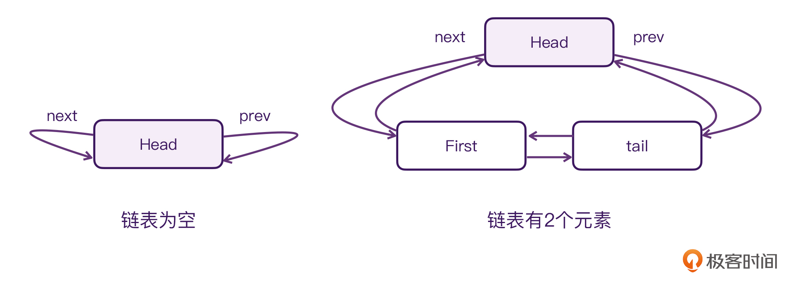
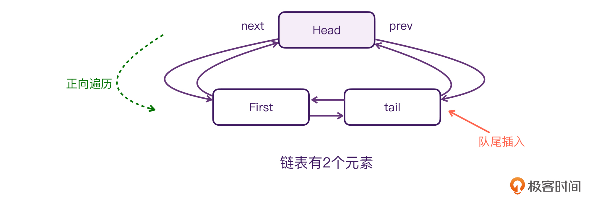

---
date: "2019-06-23"
---  
      
# 31 | 图解Channel：如何理解它的CSP通信模型？
你好，我是朱涛。今天我们来分析Channel的源码。

Kotlin的Channel是一个非常重要的组件，在它出现之前，协程之间很难进行通信，有了它以后，协程之间的通信就轻而易举了。在[第22讲](https://time.geekbang.org/column/article/493069)当中，我们甚至还借助Channel实现的Actor做到了并发安全。

那么总的来说，Channel是热的，同时它还是一个**线程安全的数据管道**。而由于Channel具有线程安全的特性，因此，它最常见的用法，就是建立CSP通信模型（Communicating Sequential Processes）。

不过你可能会觉得，CSP太抽象了不好理解，但其实，这个通信模型我们在第22讲里就接触过了。当时我们虽然是通过Actor来实现的，但却是把它当作CSP在用，它们两者的差异其实很小。

关于[CSP的理论](https://en.wikipedia.org/wiki/Communicating_sequential_processes)，它的精确定义其实比较复杂，不过它的核心理念用一句话就可以概括：**不要共享内存来通信；而是要用通信来共享内存**（Don’t communicate by sharing memory; share memory by communicating）。

可是，我们为什么可以通过Channel实现CSP通信模型呢？这背后的技术细节，则需要我们通过源码来发掘了。

<!-- [[[read_end]]] -->

## Channel背后的数据结构

为了研究Channel的源代码，我们仍然是以一个简单的Demo为例，来跟踪它的代码执行流程。

```
    // 代码段1
    
    fun main()  {
        val scope = CoroutineScope(Job() + mySingleDispatcher)
        // 1，创建管道
        val channel = Channel<Int>()
    
        scope.launch {
            // 2，在一个单独的协程当中发送管道消息
            repeat(3)  {
                channel.send(it)
                println("Send: $it")
            }
    
            channel.close()
        }
    
        scope.launch {
            // 3，在一个单独的协程当中接收管道消息
            repeat(3) {
                val result = channel.receive()
                println("Receive ${result}")
            }
        }
    
        println("end")
        Thread.sleep(2000000L)
    }
    
    /*
    输出结果：
    end
    Receive 0
    Send: 0
    Send: 1
    Receive 1
    Receive 2
    Send: 2
    */
    

```

以上代码主要分为三个部分，分别是：Channel创建、发送数据、接收数据。

我们先来分析注释1处的Channel创建逻辑。我们都知道Channel其实是一个接口，它是通过组合SendChannel、ReceiveChannel得来的。而注释1处调用的Channel\(\)，其实是一个普通的顶层函数，只是**它发挥的作用是构造函数，因此它的首字母是大写的**，这跟我们上节课分析的CoroutineScope、Job也是类似的。

```
    // 代码段2
    
    public interface Channel<E> : SendChannel<E>, ReceiveChannel<E> {
    
    public fun <E> Channel(
        capacity: Int = RENDEZVOUS,
        onBufferOverflow: BufferOverflow = BufferOverflow.SUSPEND,
        onUndeliveredElement: ((E) -> Unit)? = null
    ): Channel<E> =
        when (capacity) {
            RENDEZVOUS -> {
                if (onBufferOverflow == BufferOverflow.SUSPEND)
                    RendezvousChannel(onUndeliveredElement) 
                else
                    ArrayChannel(1, onBufferOverflow, onUndeliveredElement) 
            }
            CONFLATED -> {
                ConflatedChannel(onUndeliveredElement)
            }
            UNLIMITED -> LinkedListChannel(onUndeliveredElement) 
            BUFFERED -> ArrayChannel( 
                if (onBufferOverflow == BufferOverflow.SUSPEND) CHANNEL_DEFAULT_CAPACITY else 1,
                onBufferOverflow, onUndeliveredElement
            )
            else -> {
                if (capacity == 1 && onBufferOverflow == BufferOverflow.DROP_OLDEST)
                    ConflatedChannel(onUndeliveredElement) 
                else
                    ArrayChannel(capacity, onBufferOverflow, onUndeliveredElement)
            }
        }
    

```

然后，从上面的代码里，我们可以看到，**Channel\(\)方法的核心逻辑就是一个when表达式**，它根据传入的参数，会创建不同类型的Channel实例，包括了：RendezvousChannel、ArrayChannel、ConflatedChannel、LinkedListChannel。而这些实现类都有一个共同的父类：**AbstractChannel**。

```
    // 代码段3
    
    internal abstract class AbstractSendChannel<E>(
        @JvmField protected val onUndeliveredElement: OnUndeliveredElement<E>?
    ) : SendChannel<E> {
    
        protected val queue = LockFreeLinkedListHead()
    
        // 省略
    
        internal abstract class AbstractChannel<E>(
        onUndeliveredElement: OnUndeliveredElement<E>?
    ) : AbstractSendChannel<E>(onUndeliveredElement), Channel<E> {}
    }
    

```

可以看到，AbstractChannel其实是AbstractSendChannel的内部类，同时它也是AbstractSendChannel的子类。而Channel当中的核心逻辑，都是依靠AbstractSendChannel当中的 **LockFreeLinkedListHead** 实现的。我们接着来看下它的源代码：

```
    // 代码段4
    
    public actual open class LockFreeLinkedListHead : LockFreeLinkedListNode() {
        public actual val isEmpty: Boolean get() = next === this
    }
    
    public actual open class LockFreeLinkedListNode {
        // 1
        private val _next = atomic<Any>(this)
        private val _prev = atomic(this)
        private val _removedRef = atomic<Removed?>(null)
    }
    

```

可见，LockFreeLinkedListHead其实继承自 **LockFreeLinkedListNode**，而LockFreeLinkedListNode则是实现Channel核心功能的关键数据结构。整个数据结构的核心思想，来自于2004年的一篇论文：[《Lock-Free and Practical Doubly Linked List-Based Deques Using Single-Word Compare-and-Swap》](https://citeseerx.ist.psu.edu/viewdoc/download?doi=10.1.1.140.4693&rep=rep1&type=pdf)。如果你对其中的原理感兴趣，可以去看看这篇论文。这里，为了不偏离主题，我们只分析它的核心思想。

LockFreeLinkedListNode，我们可以将其区分开来看待，即LockFree和LinkedList。

第一个部分：**LockFree**，它是通过[CAS](https://zh.wikipedia.org/wiki/%E6%AF%94%E8%BE%83%E5%B9%B6%E4%BA%A4%E6%8D%A2)（Compare And Swap）的思想来实现的，比如JDK提供的java.util.concurrent.atomic。这一点，我们从上面注释1的atomic也可以看出来。

第二个部分：**LinkedList**，这说明LockFreeLinkedList本质上还是一个**链表**。简单来说，它其实是一个循环双向链表，而LockFreeLinkedListHead其实是一个**哨兵节点**，如果你熟悉链表这个数据结构，也可以将其看作是链表当中的[虚拟头结点](https://stackoverflow.com/questions/37324972/what-is-a-dummy-head)，这个节点本身不会用于存储任何数据，它的next指针会指向整个链表的**头节点**，而它的prev指针会指向整个链表的**尾节点**。

为了方便你理解，我画了一张图描述这个链表的结构：



请看图片左边的部分，**当链表为空的时候**，LockFreeLinkedListHead的next指针和prev指针，都是指向自身的。这也就意味着，这个Head节点是不会存储数据，同时，也是不会被删除的。

然后再看图片右边的部分，**当链表有2个元素的时候**，这时LockFreeLinkedListHead节点的next指针才是第一个节点，而Head的prev指针则是指向尾结点。

实际上，寻常的循环双向链表是可以在首尾添加元素的，同时也支持“正向遍历、逆向遍历”的。但Channel内部的这个数据结构只能在末尾添加，而它遍历的顺序则是从队首开始的。这样的设计，就让它的行为在变成了先进先出**单向队列**的同时，还实现了队尾添加操作，只需要O\(1\)的时间复杂度。



可以说，正是因为LockFreeLinkedList这个数据结构，我们才能使用Channel实现CSP通信模型。

好，在弄清楚LockFreeLinkedList这个数据结构以后，Channel后续的源码分析就很简单了。让我们来分别分析一下Channel的send\(\)、receive\(\)的流程。

## 发送和接收的流程

我们回过头来看代码段1当中的逻辑，我们分别启动了两个协程，在这两个协程中，我们分别发送了三次数据，也接收了三次数据。程序首先会执行send\(\)，由于Channel在默认情况下容量是0，所以，send\(\)首先会被挂起。让我们来看看这部分的逻辑：

```
    // 代码段5
    
    public final override suspend fun send(element: E) {
        // 1
        if (offerInternal(element) === OFFER_SUCCESS) return
        // 2
        return sendSuspend(element)
    }
    
    protected open fun offerInternal(element: E): Any {
        while (true) {
            // 3
            val receive = takeFirstReceiveOrPeekClosed() ?: return OFFER_FAILE
            // 省略
        }
    }
    
    private suspend fun sendSuspend(element: E): Unit = suspendCancellableCoroutineReusable sc@ { cont ->
        loop@ while (true) {
            if (isFullImpl) {
                // 4
                val send = if (onUndeliveredElement == null)
                    SendElement(element, cont) else
                    SendElementWithUndeliveredHandler(element, cont, onUndeliveredElement)
                val enqueueResult = enqueueSend(send)
                when {
                    enqueueResult == null -> {
                        // 5
                        cont.removeOnCancellation(send)
                        return@sc
                    }
                    enqueueResult is Closed<*> -> {
                    }
                    enqueueResult === ENQUEUE_FAILED -> {} 
                    enqueueResult is Receive<*> -> {} 
                    else -> error("enqueueSend returned $enqueueResult")
                }
            }
            // 省略
        }
    }
    

```

上面的挂起函数send\(\)分为两个部分：

* 注释1，尝试向Channel发送数据，如果这时候Channel已经有了消费者，那么if就会为true，send\(\)方法就会return。不过，按照代码段1的逻辑，首次调用send\(\)的时候，Channel还不存在消费者，因此在注释3处，尝试从LockFreeLinkedList取出消费者是不可能的。所以，程序会继续执行注释2处的逻辑。
* 注释2，会调用挂起函数sendSuspend\(\)，它是由高阶函数suspendCancellableCoroutineReusable\{\} 实现的。我们看它的名字就能知道，它跟suspendCancellableCoroutine\{\} 是类似的（如果你有些忘了，可以回过头去看看[加餐五](https://time.geekbang.org/column/article/497868)）。另外，请留意下这个方法的注释4，它会将发送的元素封装成SendElement对象，然后调用enqueueSend\(\)方法，将其添加到LockFreeLinkedList这个队列的末尾。如果enqueueSend\(\)执行成功了，就会执行注释5，注册一个回调，用于将SendElement从队列中移除掉。

如果你足够细心的话，你会发现这整个流程并没有涉及到resume的调用，因此，这也意味着sendSuspend\(\)会一直被挂起，而这就意味着send\(\)会一直被挂起！那么，问题来了，**send\(\)会在什么时候被恢复**？

答案当然是：**receive\(\)被调用的时候**！

```
    // 代码段6
    
    public final override suspend fun receive(): E {
        // 1
        val result = pollInternal()
    
        @Suppress("UNCHECKED_CAST")
        if (result !== POLL_FAILED && result !is Closed<*>) return result as E
        // 2
        return receiveSuspend(RECEIVE_THROWS_ON_CLOSE)
    }
    
    protected open fun pollInternal(): Any? {
        while (true) {
            // 3
            val send = takeFirstSendOrPeekClosed() ?: return POLL_FAILED
            val token = send.tryResumeSend(null)
            if (token != null) {
                assert { token === RESUME_TOKEN }
                //4
                send.completeResumeSend()
                return send.pollResult
            }
    
            send.undeliveredElement()
        }
    }
    
    // CancellableContinuationImpl
    private fun dispatchResume(mode: Int) {
        if (tryResume()) return 
        // 5
        dispatch(mode)
    }
    
    internal fun <T> DispatchedTask<T>.dispatch(mode: Int) {
        // 省略
        if (!undispatched && delegate is DispatchedContinuation<*> && mode.isCancellableMode == resumeMode.isCancellableMode) {
    
            val dispatcher = delegate.dispatcher
            val context = delegate.context
            if (dispatcher.isDispatchNeeded(context)) {
                // 6
                dispatcher.dispatch(context, this)
            } else {
                resumeUnconfined()
            }
        } else {
            // 省略
        }
    }
    

```

可以看到，挂起函数receive\(\)的逻辑，跟代码段5当中的send\(\)是类似的。

* 注释1，尝试从LockFree队列当中找出是否有正在被挂起的**发送方**。具体的逻辑在注释3处，它会从队首开始遍历，寻找Send节点。
* 接着上面的代码段1的案例分析，此时我们一定是可以从队列中找到一个Send节点的，因此程序会继续执行注释4处的代码。
* 注释4，completeResumeSend\(\)，它最终会调用注释5处的dispatch\(mode\)，而dispatch\(mode\)其实就是DispatchedTask的dispatch\(\)，是不是觉得很熟悉？这个DispatchedTask其实就是我们在[第29讲](https://time.geekbang.org/column/article/500420)当中分析过的DispatchedTask，这里的dispatch\(\)就是协程体当中的代码在线程执行的时机。最终，它会执行在Java的Executor之上。至此，我们之前被挂起的send\(\)方法，其实就算是恢复了。

另外，你可以再留意上面的注释2，当LockFree队列当中没有正在挂起的发送方时，它会执行receiveSuspend\(\)，而receiveSuspend\(\)也同样会被挂起：

```
    private suspend fun <R> receiveSuspend(receiveMode: Int): R = suspendCancellableCoroutineReusable sc@ { cont ->
        val receive = if (onUndeliveredElement == null)
            ReceiveElement(cont as CancellableContinuation<Any?>, receiveMode) else
            ReceiveElementWithUndeliveredHandler(cont as CancellableContinuation<Any?>, receiveMode, onUndeliveredElement)
        while (true) {
            if (enqueueReceive(receive)) {
                removeReceiveOnCancel(cont, receive)
                return@sc
            }
    
            val result = pollInternal()
            if (result is Closed<*>) {
                receive.resumeReceiveClosed(result)
                return@sc
            }
            if (result !== POLL_FAILED) {
                cont.resume(receive.resumeValue(result as E), receive.resumeOnCancellationFun(result as E))
                return@sc
            }
        }
    }
    

```

所以，这里的逻辑其实跟之前的sendSuspend\(\)是类似的。首先，它会封装一个ReceiveElement对象，并且将其添加到LockFree队列的末尾，如果添加成功的话，这个receiveSuspend就会继续挂起，这就意味着receive\(\)也会被挂起。而receive\(\)被恢复的时机，其实就对应了代码段5当中注释1的代码：offerInternal\(element\)。

至此，Channel的发送和接收流程，我们就都已经分析完了。按照惯例，我们还是通过一个视频来回顾代码的整体执行流程：

## 小结

通过这节课，我们知道，Channel其实是一个线程安全的管道。它最常见的用法，就是实现CSP通信模型。它的核心理念是：**不要共享内存来通信；而是要用通信来共享内存**。而Channel之所以可以用来实现CSP通信模型，主要还是因为它底层用到的数据结构：LockFreeLinkedList。

LockFreeLinkedList虽然是一个循环双向链表，但在Channel的源码中，它会被当做**先进先出**的单向队列，它只在队列末尾插入节点，而遍历则只正向遍历。

还有Channel的send\(\)，它会分为两种情况，一种是当前的LockFree队列当中已经有被挂起的**接收方**，这时候，send\(\)会恢复Receive节点的执行，并且将数据发送给对方。第二种情况是：当前队列当中没有被挂起的接收方，这时候send\(\)就会被挂起，而被发送的数据会被封装成SendElement对象插入到队列的末尾，等待被下次的receive\(\)恢复执行。

而Channel的receive\(\)，也是分为两种情况，一种是当前的LockFree队列当中已经存在被挂起的**发送方**，这时候receive\(\)会恢复Send节点的执行，并且取出Send节点当中带过来的数据。第二种情况是：当前队列没有被挂起的发送方，这时候receive\(\)就会被挂起，同时它也会被封装成一个ReceiveElement对象插入到队列的末尾，等待被下次的send\(\)恢复执行。

其实，Kotlin推崇CSP模型进行并发的原因还有很多，比如门槛低、可读性高、扩展性好，还有一点是会被很多人提到的：不容易发生死锁。

不过，这里需要特别注意的是，CSP场景下的并发模型，并非不可能发生死锁，在一些特殊场景下，它也是可能发生死锁的，比如：通信死锁（Communication Deadlock）。因此，CSP也并不是解决所有并发问题的万能解药，我们还是要具体问题具体分析。

## 思考题

在课程的开头，我们分析了Channel一共有四种实现方式：RendezvousChannel、ArrayChannel、ConflatedChannel、LinkedListChannel，请问你能结合今天学习的知识，分析LinkedListChannel的原理吗？

```
    internal open class LinkedListChannel<E>(onUndeliveredElement: OnUndeliveredElement<E>?) : AbstractChannel<E>(onUndeliveredElement) {
        protected final override val isBufferAlwaysEmpty: Boolean get() = true
        protected final override val isBufferEmpty: Boolean get() = true
        protected final override val isBufferAlwaysFull: Boolean get() = false
        protected final override val isBufferFull: Boolean get() = false
    
        protected override fun offerInternal(element: E): Any {
            while (true) {
                val result = super.offerInternal(element)
                when {
                    result === OFFER_SUCCESS -> return OFFER_SUCCESS
                    result === OFFER_FAILED -> { // try to buffer
                        when (val sendResult = sendBuffered(element)) {
                            null -> return OFFER_SUCCESS
                            is Closed<*> -> return sendResult
                        }
                        // otherwise there was receiver in queue, retry super.offerInternal
                    }
                    result is Closed<*> -> return result
                    else -> error("Invalid offerInternal result $result")
                }
            }
        }
    
        protected override fun offerSelectInternal(element: E, select: SelectInstance<*>): Any {
            while (true) {
                val result = if (hasReceiveOrClosed)
                    super.offerSelectInternal(element, select) else
                    (select.performAtomicTrySelect(describeSendBuffered(element)) ?: OFFER_SUCCESS)
                when {
                    result === ALREADY_SELECTED -> return ALREADY_SELECTED
                    result === OFFER_SUCCESS -> return OFFER_SUCCESS
                    result === OFFER_FAILED -> {} // retry
                    result === RETRY_ATOMIC -> {} // retry
                    result is Closed<*> -> return result
                    else -> error("Invalid result $result")
                }
            }
        }
    }
    

```