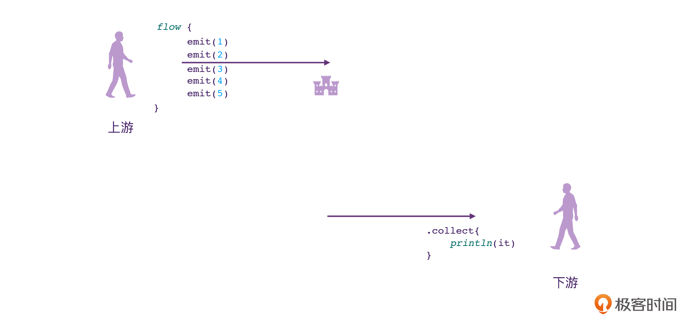
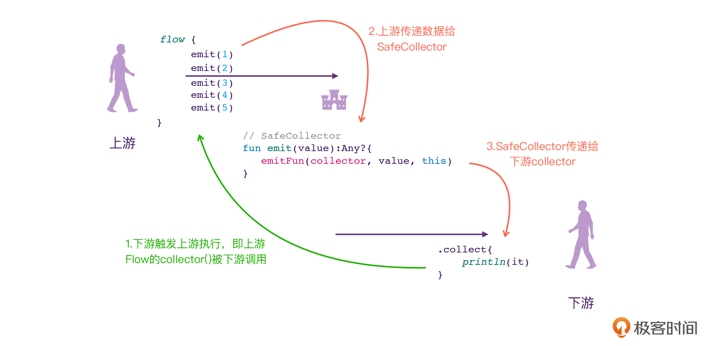
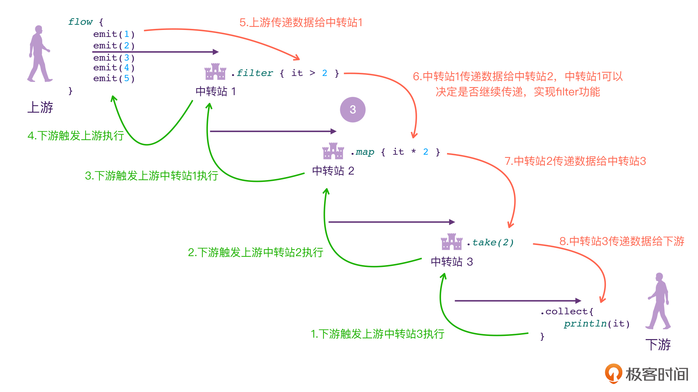
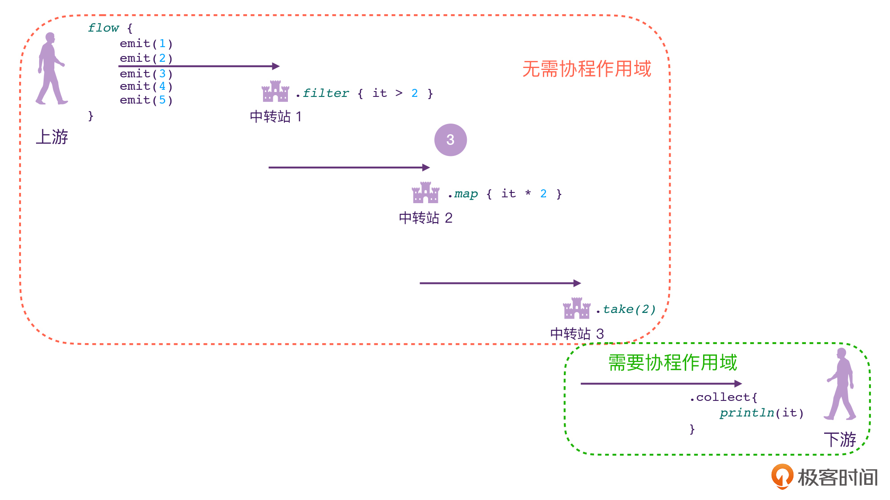

---
date: "2019-06-23"
---  
      
# 32 | 图解Flow：原来你是只纸老虎？
你好，我是朱涛。今天我们来研究Flow的源代码。

经过前面的学习，我们已经知道了，Channel和Flow都是数据流，Channel是“热”的，Flow则是“冷”的。这里的冷，代表着Flow不仅是“冷淡”的，而且还是“懒惰”的。

除了“冷”这个特性以外，Flow从API的角度分类，主要分为：构造器、中间操作符、终止操作符。今天这节课，我们将会从这几个角度来分析Flow的源码，来看看它的这几类API是如何实现的。

经过这节课的学习，你会发现：虽然Flow的功能看起来非常高大上，然而它的原理却非常的简单，是一只名副其实的“纸老虎”。

## Flow为什么是冷的？

在正式开始研究Flow源代码之前，我们首先需要确定研究的对象。这里，我写了一段Demo代码，接下来我们就以这个Demo为例，来分析Flow的整个执行流程：

```
    // 代码段1
    
    fun main() {
        val scope = CoroutineScope(Job())
        scope.launch {
            testFlow()
        }
    
        Thread.sleep(1000L)
    
        logX("end")
    }
    
    private suspend fun testFlow() {
        // 1
        flow {
            emit(1)
            emit(2)
            emit(3)
            emit(4)
            emit(5)
        }.collect {      // 2
                logX(it)
            }
    }
    
    /**
     * 控制台输出带协程信息的log
     */
    fun logX(any: Any?) {
        println(
            """
    ================================
    $any
    Thread:${Thread.currentThread().name}
    ================================""".trimIndent()
        )
    }
    
    /*
    输出结果
    ================================
    1
    Thread:DefaultDispatcher-worker-1
    ================================
    ================================
    2
    Thread:DefaultDispatcher-worker-1
    ================================
    ================================
    3
    Thread:DefaultDispatcher-worker-1
    ================================
    ================================
    4
    Thread:DefaultDispatcher-worker-1
    ================================
    ================================
    5
    Thread:DefaultDispatcher-worker-1
    ================================
    ================================
    end
    Thread:main
    ================================
    */
    

```
<!-- [[[read_end]]] -->

这段代码很简单，我们创建了一个CoroutineScope，接着使用它创建了一个新的协程，在协程当中，我们使用flow\{\} 这个高阶函数创建了Flow对象，接着使用了collect\{\} 这个终止操作符。  
我们利用[第20讲](https://time.geekbang.org/column/article/491632)当中学过的内容，很容易就能想象出类似这样的一个思维模型。



那么下面，我们就先来看看注释1处，分析一下Flow是怎么创建出来的。

```
    // 代码段2
    
    public fun <T> flow(block: suspend FlowCollector<T>.() -> Unit): Flow<T> =
         SafeFlow(block)
    
    public interface Flow<out T> {
        public suspend fun collect(collector: FlowCollector<T>)
    }
    

```

可以看到，flow\{\} 是一个高阶函数，它接收的参数类型是函数类型`FlowCollector<T>.() \-> Unit`，这个类型代表了：它是FlowCollector的扩展或成员方法，没有参数，也没有返回值。flow\(\)的返回值类型是`Flow<T>`，而它实际返回的类型是SafeFlow，让我们来看看它的源码定义。

```
    // 代码段3
    
    private class SafeFlow<T>(private val block: suspend FlowCollector<T>.() -> Unit) : AbstractFlow<T>() {
        // 1
        override suspend fun collectSafely(collector: FlowCollector<T>) {
            collector.block()
        }
    }
    
    public abstract class AbstractFlow<T> : Flow<T>, CancellableFlow<T> {
        // 省略
    }
    
    internal interface CancellableFlow<out T> : Flow<T>
    

```

从上面的代码我们可以看到，SafeFlow其实是AbstractFlow的子类，而AbstractFlow则实现了Flow这个接口，所以SafeFlow算是间接实现了Flow接口。而AbstractFlow是协程当中所有Flow的抽象类，所以，它当中应该会有许多Flow通用的逻辑。

那么接下来，我们就来看看AbstractFlow当中的逻辑：

```
    // 代码段4
    
    public abstract class AbstractFlow<T> : Flow<T>, CancellableFlow<T> {
    
        // 1
        public final override suspend fun collect(collector: FlowCollector<T>) {
            // 2
            val safeCollector = SafeCollector(collector, coroutineContext)
            try {
                // 3
                collectSafely(safeCollector)
            } finally {
                safeCollector.releaseIntercepted()
            }
        }
    
        public abstract suspend fun collectSafely(collector: FlowCollector<T>)
    }
    

```

请留意上面代码的注释1，看到这个挂起函数collect\(\)，你是不是觉得很熟悉呢？它其实就是终止操作符collect对应的调用处。这个collect\(\)的逻辑其实也很简单，我都用注释标记出来了，我们来看看：

* 注释2，collect\(\)的参数类型是FlowCollector，这里只是将其重新封装了一遍，变成了SafeColletor对象。从它的名称，我们也大概可以猜出来，它肯定是会对collect当中的逻辑做一些安全检查的，SafeCollector的源码我们留到后面分析，我们接着看注释3。
* 注释3，collectSafely\(\)，这里其实就是调用了它的抽象方法，而它的具体实现就在代码段3里SafeFlow的collectSafely\(\)方法，而它的逻辑也很简单，它直接调用了collector.block\(\)，这其实就相当于触发了flow\{\} 当中的Lambda逻辑。换句话说，collector.block\(\)就相当于调用了代码段1当中的5次emit\(\)方法。

那么，代码分析到这里，我们其实就已经可以看出来Flow为什么是冷的了。我们都知道Channel之所以是热的，是因为它不管有没有接收方，发送方都会工作。而FLow之所以是冷的，是因为Flow的构造器，真的就只会构造一个SafeFlow对象，完全不会触发执行它内部的Lambda表达式的逻辑，**只有当collect\(\)被调用之后，flow\{\} 当中的Lambda逻辑才会真正被触发执行**。

好，现在我们已经知道collect\(\)是如何触发Flow执行的了，接下来，我们来看看Flow是如何将上游的数据传递给下游的。

## FlowCollector：上游与下游之间的桥梁

经过之前的分析，我们知道flow\{\} 这个高阶函数会创建一个Flow对象，它具体的类型是SafeFlow，它其实间接实现了Flow接口，因此我们可以直接调用collect\(\)这个终止操作符，从而拿到flow\{\} 的Lambda当中emit（发射）出来的数据。

上面整个流程分析下来，给我们的感觉是这样的：**下游的collect\(\)会触发上游的Lambda执行，上游的Lambda当中的emit\(\)会把数据传递给下游**。

那么，Flow到底是如何做到的呢？这其中的关键，还是collect\(\)传入的参数类型：FlowCollector。

```
    // 代码段5
    
    public fun interface FlowCollector<in T> {
        public suspend fun emit(value: T)
    }
    
    public interface Flow<out T> {
        public suspend fun collect(collector: FlowCollector<T>)
    }
    

```

当我们在下游调用collect\{\} 的时候，其实是在调用Flow接口的collect方法，而我们之所以可以写出花括号的形式，是因为Lambda简写，这一点我们在[第7讲](https://time.geekbang.org/column/article/476637)当中有提到过。那么，为了让它们的关系更加清晰地暴露出来，我们可以换一种写法，来实现代码段1当中的逻辑。

```
    // 代码段6
    
    private suspend fun testFlow() {
    
        flow {
            // 1
            emit(1)
            emit(2)
            emit(3)
            emit(4)
            emit(5)
        }
            // 变化在这里
            .collect(object : FlowCollector<Int>{ 
                // 2
                override suspend fun emit(value: Int) {
                    logX(value)
                }
            })
    }
    

```

这里代码段6和前面代码段1的逻辑其实是等价的，唯一的变化在于，这里我们使用了匿名内部类的方式，直接传入了FlowCollector，在这个匿名内部类的emit\(\)方法，其实就充当着Flow的下游接收其中的数据流。

所以，要分析“上游与下游是如何连接的”这个问题，我们只需要看注释2处的emit\(\)是如何被调用的即可。

那么，经过前面代码段4的分析，我们从它注释2处的代码就可以知道，collect\(\)方法传入的FlowCollector参数，其实是被传入SafeCollector当中，被封装了起来。所以接下来，我们只要分析SafeCollector当中的逻辑就行。

```
    // 代码段7
    
    internal actual class SafeCollector<T> actual constructor(
        // 1
        @JvmField internal actual val collector: FlowCollector<T>,
        @JvmField internal actual val collectContext: CoroutineContext
    ) : FlowCollector<T>, ContinuationImpl(NoOpContinuation, EmptyCoroutineContext), CoroutineStackFrame {
    
        internal actual val collectContextSize = collectContext.fold(0) { count, _ -> count + 1 }
        private var lastEmissionContext: CoroutineContext? = null
        private var completion: Continuation<Unit>? = null
    
        // ContinuationImpl
        override val context: CoroutineContext
            get() = completion?.context ?: EmptyCoroutineContext
    
        // 2
        override suspend fun emit(value: T) {
            return suspendCoroutineUninterceptedOrReturn sc@{ uCont ->
                try {
                    // 3
                    emit(uCont, value)
                } catch (e: Throwable) {
                    lastEmissionContext = DownstreamExceptionElement(e)
                    throw e
                }
            }
        }
    
        private fun emit(uCont: Continuation<Unit>, value: T): Any? {
            val currentContext = uCont.context
            currentContext.ensureActive()
    
            // 4
            val previousContext = lastEmissionContext
            if (previousContext !== currentContext) {
                checkContext(currentContext, previousContext, value)
            }
            completion = uCont
            // 5
            return emitFun(collector as FlowCollector<Any?>, value, this as Continuation<Unit>)
        }
    
    }
    
    // 6
    private val emitFun =
        FlowCollector<Any?>::emit as Function3<FlowCollector<Any?>, Any?, Continuation<Unit>, Any?>
    
    public interface Function3<in P1, in P2, in P3, out R> : Function<R> {
        public operator fun invoke(p1: P1, p2: P2, p3: P3): R
    }
    

```

在这段SafeCollector的源码中，一共有6个地方需要我们注意，让我们来看看。

注释1，collector，它是SafeCollector的参数，通过分析代码段4的注释2处，我们可以知道，它其实就对应着代码段6里，注释1处的匿名内部类FlowCollector。之后我们需要特别留意这个collector，看看它的emit\(\)是在哪里被调用的，因为这就意味着代码段6当中的注释2被调用。我们可以将其看作**下游的emit\(\)**。

注释2，emit\(\)，通过之前代码段4的分析，我们知道，这个emit\(\)方法，其实就是代码段6里调用的emit\(\)。也就是说，Flow上游发送的数据，最终会传递到这个emit\(\)方法当中来。我们可以将其看作**上游的emit\(\)**。

注释3，emit\(uCont, value\)，这里的suspendCoroutineUninterceptedOrReturn这个高阶函数，是把挂起函数的Continuation暴露了出来，并且将其作为参数传递给了另一个emit\(\)方法。你需要注意的是，这行代码被try-catch包裹了，而且把其中的异常捕获以后，会被重新包装成DownstreamExceptionElement，意思就是“下游的异常”，这从侧面也能说明，这个方法即将执行下游的代码。

这里还有一个细节就是，DownstreamExceptionElement会被存储在lastEmissionContext当中，它的作用是：在下游发送异常以后，可以让上游感知到。

注释4，这里会对当前的协程上下文与之前的协程上下文做对比检查，如果它们两者不一致，就会在checkContext\(\)当中做进一步的判断和提示。我们第20讲思考题的答案就藏在这里，为了不偏离主线，这个部分的逻辑我们暂时先放着，等我们分析完Flow的整体流程以后再来看。

注释5，`emitFun(collector as FlowCollector<Any?>, value, this as Continuation<Unit>)`，这里其实就是在调用下游的emit\(\)，也就是代码段6当中的注释2对应的emit\(\)方法。那么，这里的emitFun\(\)是什么呢？我们可以在注释6处找到它的定义：`FlowCollector<Any?>::emit`，这是函数引用的语法，代表了它就是FlowCollector的emit\(\)方法，它的类型是`Function3<FlowCollector<Any?>, Any?, Continuation<Unit>, Any?>`。

乍一看，你也许会觉得这个类型有点难以理解，其实，这个知识点我们在[第8讲](https://time.geekbang.org/column/article/477295)当中就已经介绍过，我们平时写的函数类型`() \-> Unit`其实就对应了Function0，也就是：没有参数的函数类型。所以，这里的Function3其实就代表了三个参数的函数类型。因此，注释5处，其实就代表了下游的emit\(\)方法被调用了，对应的value也是这时候传进去的。

至此，上游传递数据给下游的整个流程，我们也分析完毕了，FlowCollector其实就相当于上游与下游之间的桥梁，它起到了连接上游、下游的作用。

回过头去看前面分析过的代码，你会发现，Flow的核心原理其实只牵涉到那么几十行代码，而它的核心接口也只有Flow、FlowCollector而已。为了方便你理解，这里我做了一个视频，描述Flow的整体调用流程。

所以，对比挂起函数的原理，不得不说，Flow真的只是一只看起来吓人的“纸老虎”。

## 思考与推演

接下来，我们基于前面的结论来进行一些思考，来尝试推演和理解一下Flow的其他功能细节，比如：中间操作符的原理、不允许使用withContext\{\} 的原因。

### 推演：中间操作符

请你想象一个问题：在已知Flow上游、下游传递数据的原理以后，如果让你来设计Flow的中间操作符，你会怎么设计？

要回答这个问题，其实我们只需要回想一下Flow的思维模型，让我们来更新一下代码段1对应的思维模型，将Flow的源码执行流程也融入进去：



flow\{\} 这个高阶函数，代表了上游，它会创建一个Flow对象，提供给下游调用Flow的collect方法。在前面的代码段2当中，我们曾经分析过，flow\{\} 实际上返回的是SafeFlow对象，在这个SafeFlow当中，会有一个SafeCollector对象。而整个Flow的调用过程，其实就是三个步骤：

* 第一步，上游的flow\{\} 创建SafeFlow的对象，下游调用Flow的collect\(\)方法，触发flow\{\} 的Lambda对应的代码执行，也就是其中emit\(\)被执行。
* 第二步，上游调用的emit\(\)，其实就是SafeCollector的emit\(\)，这时候，就相当于上游将数据传递给SafeCollector。
* 第三步，SafeCollector调用emitFun\(\)，这里的emitFun\(\)其实就对应了下游的emit\(\)方法（如果你忘了，可以回过头看看代码段6的注释2）。

通过以上分析，我们能发现，Flow的源码执行流程，也非常符合我们之前构想出来的思维模型。那么，对于它的中间操作符，我们是不是只需要加一个“中转站”就可以了呢？答案是肯定的。

如果让你来设计Flow的中间操作符，我相信你大概率会设计出类似下面这样的结构：



可以看到，当Flow当中出现中间操作符的时候，上游和下游之间就会多出一个个的中转站。对于每一个“中转站”来说，它都会有上游和下游，它都会被下游触发执行，它也会触发自己的上游；同时，它会接收来自上游的数据，也会传递给自己的下游。

那么，接下来，让我们来分析一下Flow中间操作符的源代码，看看Kotlin官方的设计是否符合我们的猜想：

```
    // 代码段8
    
    // 1
    inline fun <T> Flow<T>.filter(
        crossinline predicate: suspend (T) -> Boolean
    ): Flow<T> = transform { value ->
        // 8
        if (predicate(value)) return@transform emit(value)
    }
    
    // 2
    internal inline fun <T, R> Flow<T>.unsafeTransform(
        crossinline transform: suspend FlowCollector<R>.(value: T) -> Unit
    ): Flow<R> = unsafeFlow { 
        // 6
        collect { value ->
            // 7
            return@collect transform(value)
        }
    }
    
    // 3
    internal inline fun <T> unsafeFlow(
        crossinline block: suspend FlowCollector<T>.() -> Unit
    ): Flow<T> {
        // 4
        return object : Flow<T> {
            // 5
            override suspend fun collect(collector: FlowCollector<T>) {
                collector.block()
            }
        }
    }
    

```

上面的代码看起来有点复杂，让我们来一步步来分析：

* 注释1、2、3，请留意这几个方法的签名，它们的返回值类型都是Flow，这意味着，Flow.filter\{\} 的返回值类型仍然是Flow。我们站在整体的角度来分析的话，会发现：这只是一个Flow被封装的过程。我们都知道，flow\{\} 创建的是SafeFlow对象，当我们接着调用filter\{\} 之后，根据注释4处的逻辑，我们发现它会变成一个普通的Flow匿名内部类对象。
* 注释5，对于`flow{}.filter{}.collect{}`这样的代码，最终的collect\{\} 调用的代码，其实就是注释5对应的collect\(\)方法。我们看看它的方法体collector.block\(\)，这其实就代表了注释6、7会执行。
* 注释6，collect\{\}，这里是在调用上游Flow的collect\{\}，触发上游的Lambda执行了，也就是`flow{}.filter{}.collect{}`里的flow\{\} 当中的Lambda，然后注释7就会被执行。
* 注释7，transform\(value\)，在前面代码段7的分析中，我们知道，这里transform\(value\)当中的value，其实就是上游传递下来的数据，让我们来看看transform\{\} 当中具体的逻辑，也就是注释8。
* 注释8，`if (predicate(value))`，这其实就是我们filter的条件，只有符合这个条件的情况下，我们才会继续向下游传递数据，而传递的方式，就是调用emit\(\)，这里的emit\(\)其实就代表了下游会接收到数据了。

可见，filter\{\} 的核心思想，完全符合我们前面思维模型推演的结果。接下来，我们来看看map\{\}、onEach\{\} 之类的源码：

```
    // 代码段9
    
    public inline fun <T, R> Flow<T>.map(crossinline transform: suspend (value: T) -> R): Flow<R> = transform { value ->
        return@transform emit(transform(value))
    }
    
    public fun <T> Flow<T>.onEach(action: suspend (T) -> Unit): Flow<T> = transform { value ->
        action(value)
        return@transform emit(value)
    }
    

```

当我们理解了filter以后，你会发现，map、和onEach之类的操作符就变得很简单了。前者就是在调用下游emit\(\)的时候做了一次数据转换，而后者则是在每次向下游传递数据的时候，同时调用一下传入的Lambda表达式action\(\)。

### 思考：上下文保护

在第20讲当中，我留过一个思考题：

> 课程里我曾提到过，Flow当中直接使用withContext\{\} 是很容易出现问题的，下面代码是其中的一种。请问你能解释其中的缘由吗？Kotlin官方为什么要这么设计？

```
    // 代码段10
    
    fun main() = runBlocking {
        flow {
            withContext(Dispatchers.IO) {
                emit(1)
            }
        }.map { it * 2 }
            .collect()
    }
    
    /*
    输出结果：
    
    Exception in thread "main" java.lang.IllegalStateException: Flow invariant is violated:
            Flow was collected in [BlockingCoroutine{Active}@6e58a46, BlockingEventLoop@2cbfb24],
            but emission happened in [DispatchedCoroutine{Active}@500da3c0, Dispatchers.IO].
            Please refer to 'flow' documentation or use 'flowOn' instead
    */
    

```

其实，课程进行到这里，我们就已经可以很简单地回答这个问题了。

在[第24讲](https://time.geekbang.org/column/article/494526)当中，我们曾经给Flow的三种API进行过分类：Flow构建器、Flow中间操作符，它们两个是不需要协程作用域的，只有Flow终止操作符需要协程作用域。



通过前面Flow的源码分析流程，我们其实就会发现，在默认情况下，Flow下游的“协程上下文”最终会成为上游的执行环境，也会变成中间操作符的执行环境。也正是这个原因，才让Flow可以天然支持协程的“结构化并发”的特性，比如说结构化取消。

```
    // 代码段11
    
    private fun testFlow2() {
        val scope = CoroutineScope(Job())
        scope.launch {
            flow {
                logX("上游")
                repeat(100) {
                    emit(it)
                }
            }.filter {
                logX("中间")
                it > 2
            }
                .map { it * 2 }
                .onCompletion {
                    logX(it)
                }
                .collect {
                    logX(it)
                    delay(1000L)
                }
        }
    
        Thread.sleep(2000L)
    
        scope.cancel()
        logX("结束")
    }
    
    /*
    输出结果：
    ================================
    上游
    Thread:DefaultDispatcher-worker-1
    ================================
    ================================
    中间
    Thread:DefaultDispatcher-worker-1
    ================================
    ================================
    中间
    Thread:DefaultDispatcher-worker-1
    ================================
    ================================
    中间
    Thread:DefaultDispatcher-worker-1
    ================================
    ================================
    中间
    Thread:DefaultDispatcher-worker-1
    ================================
    ================================
    6
    Thread:DefaultDispatcher-worker-1
    ================================
    ================================
    中间
    Thread:DefaultDispatcher-worker-1
    ================================
    ================================
    8
    Thread:DefaultDispatcher-worker-1
    ================================
    ================================
    结束
    Thread:main
    ================================
    ================================
    kotlinx.coroutines.JobCancellationException: Job was cancelled; job=JobImpl{Cancelling}@407d87d0
    Thread:DefaultDispatcher-worker-1
    ================================
    */
    

```

从上面的执行结果可以看到，虽然我们的上游要尝试emit\(\)100个数据，但是由于外部的scope在2000毫秒后会取消，所以整个Flow都会响应取消。

那么反之，如果Kotlin官方允许开发者在flow\{\} 当中，调用withContext\{\} 改变协程上下文的话，**Flow上游与下游的协程上下文就会不一致，它们整体的结构也会被破坏，从而导致“结构化并发”的特性也被破坏**。

Flow源码中对于上下文的检测，我们称之为上下文保护（Context Preservation），它对应的检测时机在代码段7的注释4处，具体的逻辑如下：

```
    // 代码段12
    
    private fun emit(uCont: Continuation<Unit>, value: T): Any? {
        // 省略
        // This check is triggered once per flow on happy path.
        val previousContext = lastEmissionContext
        if (previousContext !== currentContext) {
            checkContext(currentContext, previousContext, value)
        }
    }
    
    private fun checkContext(
        currentContext: CoroutineContext,
        previousContext: CoroutineContext?,
        value: T
    ) {
        if (previousContext is DownstreamExceptionElement) {
            exceptionTransparencyViolated(previousContext, value)
        }
        checkContext(currentContext)
        lastEmissionContext = currentContext
    }
    
    internal fun SafeCollector<*>.checkContext(currentContext: CoroutineContext) {
        val result = currentContext.fold(0) fold@{ count, element ->
            val key = element.key
            val collectElement = collectContext[key]
            if (key !== Job) {
                return@fold if (element !== collectElement) Int.MIN_VALUE
                else count + 1
            }
    
            val collectJob = collectElement as Job?
            val emissionParentJob = (element as Job).transitiveCoroutineParent(collectJob)
    
            if (emissionParentJob !== collectJob) {
                error(
                    "Flow invariant is violated:\n" +
                            "\t\tEmission from another coroutine is detected.\n" +
                            "\t\tChild of $emissionParentJob, expected child of $collectJob.\n" +
                            "\t\tFlowCollector is not thread-safe and concurrent emissions are prohibited.\n" +
                            "\t\tTo mitigate this restriction please use 'channelFlow' builder instead of 'flow'"
                )
            }
    
    
            if (collectJob == null) count else count + 1
        }
    
        // 判断上游、下游的Context
        if (result != collectContextSize) {
            error(
                "Flow invariant is violated:\n" +
                        "\t\tFlow was collected in $collectContext,\n" +
                        "\t\tbut emission happened in $currentContext.\n" +
                        "\t\tPlease refer to 'flow' documentation or use 'flowOn' instead"
            )
        }
    }
    

```

所以，总的来说，Flow不允许直接使用withContext\{\} 的原因，是为了“结构化并发”，它并不是不允许切换线程，而是不允许随意破坏协程的上下文。Kotlin提供的操作符flowOn\{\}，官方已经帮我们处理好了上下文的问题，所以我们可以放心地切线程。

## 小结

这节课，我们是通过分析Flow的源码，理解了它的几类API是如何实现的。我们知道，Flow是冷数据流，可以分为上游Flow构造器、中间操作符、下游FlowCollector。那么可以说，**理解了Flow、FlowCollector这两个接口，其实就理解了Flow的原理。**

上游Flow构造器，它实际返回的对象是SafeFlow，在SafeFlow当中有一个SafeCollector，它会接收上游的数据，并且将数据传递给下游的FlowCollector。

下游FlowCollector，在下游调用collect\(\)的时候，实际上是调用的Flow的collect\(\)方法，这就会触发上游的Lambda被执行。在collect\(\)调用的时候，它会创建一个FlowCollector的匿名内部类对象，专门用于接收来自上游的数据。

中间操作符，它在整个Flow的调用流程当中，既会充当上游，也会充当下游。它会被下游触发执行，它也会触发自己的上游；同时，它会接收来自上游的数据，也会传递给自己的下游。

上下文保护，由于Flow的上游与中间操作符并不需要协程作用域，因此，它们都是共用的Flow下游的协程上下文。也正是因为Flow的这种设计，让Flow天然支持结构化并发。为此，Kotlin官方也限制了我们开发者不能随意在上游与中转站阶段，改变Flow的上下文。

其实，课程进行到这里，你会发现，Flow的原理之所以看起来很简单，完全是因为它站在了“挂起函数”“高阶函数”这两个巨人的肩膀上！如果没有它们作为基础，Flow的API设计一定会更加复杂。

## 思考题

前面我提到过，“理解了Flow、FlowCollector这两个接口，就理解了Flow的原理。”那么，你能概括出Flow、FlowCollector这两个抽象的接口之间的内在联系吗？

```
    public interface Flow<out T> {
        public suspend fun collect(collector: FlowCollector<T>)
    }
    
    public fun interface FlowCollector<in T> {
        public suspend fun emit(value: T)
    }
    

```