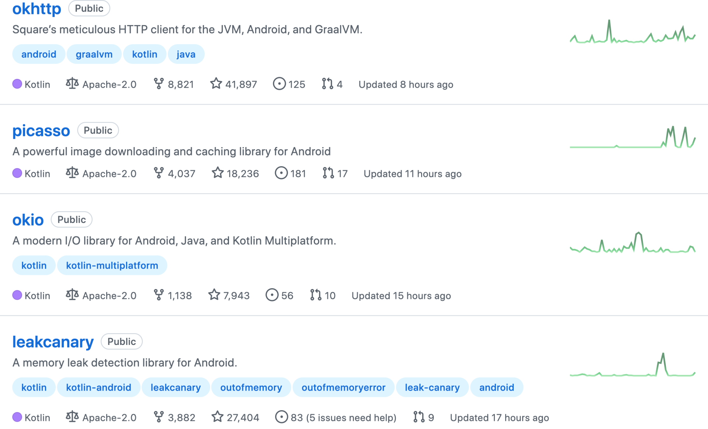
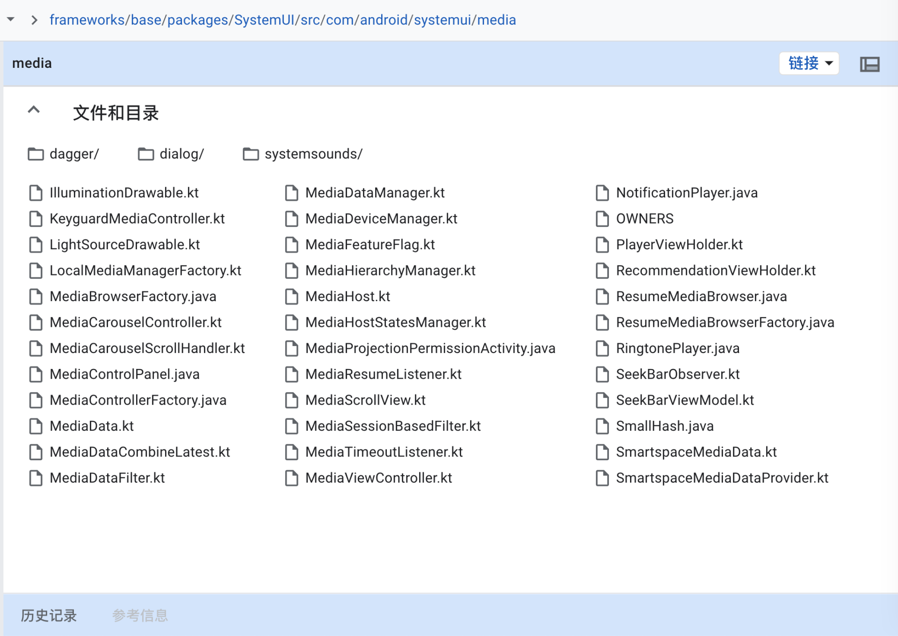
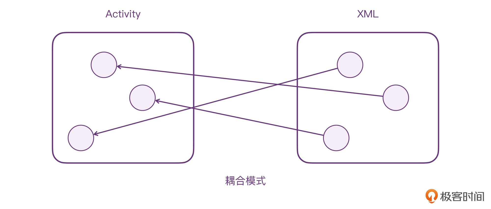
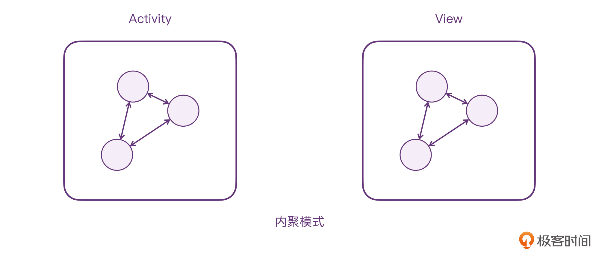

---
date: "2019-06-23"
---  
      
# 33 | Java Android开发者还会有未来吗？
你好，我是朱涛。在过去的几十讲里，我们把Kotlin的基础语法和核心难点协程，都全面学习了一遍，从原理到实战，从协程的核心挂起函数、launch等，到探究它们的源码定义，可以说我们已经基本掌握了Kotlin的核心知识点与特性，你也应该可以在工作中使用Kotlin来解决实际问题了。如果你发现自己对这些知识的掌握还有不少漏洞，也别着急，可以再回头复习一下相应部分的内容，或者在留言区提问，我会给你解答。

那么，从这节课起，我会带你来看看Kotlin在实践场景中，应用得最普遍、最广泛的领域，**Android**。我们一起来学习下如何结合所学的Kotlin知识，来高效开发Android应用。

今天这节课，我们先来聊聊Kotlin和Android的关系，让你对Android的现状与未来的发展方向有一个清晰的认识。

虽然Kotlin是面向多个平台的（如JVM、Native、JS等），不过我们在讨论Kotlin的同时，难免也会讨论下Android。甚至，很多开发者都是因为Android才开始接触Kotlin的。

说起Kotlin与Android，就不得不提它俩对应的公司JetBrains和Google。早在2013年之前，这两家公司就有过合作。最开始的时候，Android开发者的开发工具还是Eclipse，Google是在JetBrains的IntelliJ的基础上，进行改造以后，才有了后来的Android Studio。

<!-- [[[read_end]]] -->

而Eclipse与Android Studio之间的开发体验，可以说是天壤之别。这一点，在Kotlin与Java的对比上其实也是类似的。Android开发者不学Kotlin坚持使用Java，就好比是不使用Android Studio坚持使用Eclipse一样。

那么，对于Android开发者来说，Kotlin对比Java的优势，可以说是全方位的，具体我们可以从下面几个维度来看。

## 语言的优势

在前面的课程当中，我曾经说过，Kotlin与Java并没有绝对的好坏，但不可否认的是：**在Android平台上，Kotlin对比Java是有绝对优势的。**

经过前面课程的学习，我想你对Kotlin的语法特性已经有了充分的认识，不论是它简洁的语法，还是灵活的扩展特性，还是它的空安全特性，或者是强大的协程框架，都可以为我们Android开发者带来更好的体验。

另外，由于Kotlin同时也是基于JVM的，它与Java的100\%互操作性，也让我们开发者可以灵活地集成到现有的工程中去。

根据Android官方的一组[统计数据](https://developer.android.com/kotlin/build-better-apps#:~:text=Kotlin%2520is%2520already%2520used%2520by,Android%2520apps%2520contain%2520Kotlin%2520code.)，已经有超过60\%的Android个人开发者在使用Kotlin；而在排名前1000的Android应用中，也已经有超过80\%的比例在使用Kotlin进行开发。可见，头部互联网公司的Android团队都在积极在做技术转型，Kotlin也正在成为大厂Android研发的基本要求。

而随着Kotlin在Android当中普及率的提升，整个开发者社区产出的内容也渐渐以Kotlin为主，不论是Android官方的文档，还是其他技术社区的博客，其中的代码片段都在使用Kotlin。我们以Google官方在GitHub开源的[Sample](https://github.com/android/architecture-components-samples)为例，其中大部分的代码都已经变成了Kotlin。试想一下，作为一个Android开发者，如果看不懂Kotlin代码，我们又该如何跟进最新的技术呢？

## 开源库

作为Android开发者，我们总是难免会用到一些优秀的开源库，近几年，GitHub上也涌现了许多纯Kotlin开发的开源库，比如说[Kotlin依赖注入框架Koin](https://github.com/InsertKoinIO/koin)、[Kotlin实现的图片加载框架coil](https://github.com/coil-kt/coil)，等等。其实，不仅是新的开源库会用Kotlin，许多著名的Java开源库也在使用Kotlin重写，比如著名的[网络请求框架OkHttp](https://github.com/square/okhttp)、[内存泄漏检测框架LeakCanary](https://github.com/square/leakcanary)、[图片加载框架Picasso](https://github.com/square/picasso)等。大量开源库拥抱Kotlin，这本身其实就说明了Kotlin自身的语言优势。



所以，如果我们Android开发者看不懂Kotlin代码，这些用Kotlin编写的开源库，我们用起来肯定会有点儿心虚，因为看不懂它们的源代码。

当然，如果仅仅是GitHub上面的第三方开源库在选择Kotlin，我们也还是可以选择不用它。但如果是Android官方的呢？实际上，连Android官方团队都开始使用Kotlin写[Android系统的源代码](https://cs.android.com/android/platform/superproject/+/master:frameworks/base/packages/SystemUI/src/com/android/systemui/media/)（AOSP），还有Jetpack库（比如[Paging](https://github.com/androidx/androidx/tree/androidx-main/paging/paging-common/src/main/kotlin/androidx/paging)、[ViewModel](https://github.com/androidx/androidx/tree/androidx-main/lifecycle/lifecycle-viewmodel/src/main/java/androidx/lifecycle)）等等。可以说，Kotlin在Android当中的地位已经远远超过了Java，而且，随着时间的推移，两者的差距会越来越大。



## Jetpack Compose

在2021年7月，Android官方团队正式发布了全新的UI编程框架Jetpack Compose。它是由纯Kotlin实现的，想要使用它，我们就必须懂Kotlin。

对于传统的Android开发来说，开发者必须先用XML编写UI布局，类似这样：

```
    <?xml version="1.0" encoding="utf-8"?>
    <androidx.constraintlayout.widget.ConstraintLayout xmlns:android="http://schemas.android.com/apk/res/android"
        xmlns:app="http://schemas.android.com/apk/res-auto"
        xmlns:tools="http://schemas.android.com/tools"
        android:layout_width="match_parent"
        android:layout_height="match_parent"
        tools:context=".MainActivity">
    
        <TextView
            android:id="@+id/text"
            android:layout_width="wrap_content"
            android:layout_height="wrap_content"
            android:text="Hello World!"
            app:layout_constraintBottom_toBottomOf="parent"
            app:layout_constraintLeft_toLeftOf="parent"
            app:layout_constraintRight_toRightOf="parent"
            app:layout_constraintTop_toTopOf="parent" />
    
    </androidx.constraintlayout.widget.ConstraintLayout>
    

```

这个XML，其实就是一个最简单的UI布局，父布局ConstraintLayout里面有一个TextView。在XML当中，我们使用一个个的UI控件节点，来描述控件间的嵌套关系，最终组成一个UI的树。接着，开发者就需要在Java或Kotlin当中编写对应的业务逻辑。

```
    class MainActivity : AppCompatActivity() {
        override fun onCreate(savedInstanceState: Bundle?) {
            super.onCreate(savedInstanceState)
            setContentView(R.layout.activity_main)
    
            val textView = findViewById<TextView>(R.id.text)
            textView.setOnClickListener {
                // do something
            }
        }
    }
    

```

这样的代码模式其实有一个特别明显的缺陷，那就是**代码之间的依赖跨越了两个不同的语言模块**：XML模块、Kotlin模块。



对于这样跨越模块的依赖，两者之间的耦合是非常严重的，维护起来非常费力，XML发生改变了，Kotlin当中也要发生对应的改变。虽然Android官方也曾推出过DataBinding之类的工具，帮助我们在XML当中编写简单的数据绑定逻辑，但这种方式并不能从根本上解决问题，因为 **DataBinding只能减少两个模块之间的耦合，并不能消灭**。

而Jetpack Compose，就为Android开发提供了另一种可能性：UI和逻辑都用Kotlin编写。

```
    // 不需要 xml
    
    class MainActivity : ComponentActivity() {
        override fun onCreate(savedInstanceState: Bundle?) {
            super.onCreate(savedInstanceState)
            setContent {
                Text("Hello world!")
            }
        }
    }
    

```

在上面的代码中，我们直接使用Text\(\)的方法创建了一个TextView，然后传入了setContent\{\}这个高阶函数当中。这样，我们整个Android的代码就写完了，根本不需要编写XML，也不需要findViewById、DataBinding之类的操作了。



很明显，Jetpack Compose这样的代码模式，就属于内聚模式。由于我们可以使用Kotlin编写UI布局，所以，我们可以同时使用Kotlin完成View相关的逻辑，比如状态管理、布局测量、触摸反馈、动画，等等。要知道，在从前XML的时代，View相关的这些逻辑都是割裂开的，耦合也非常严重。

总的来说，使用Compose可以大大简化我们Android的开发，也可以提升开发者的效率。在Compose当中，大量使用了Kotlin的高级特性，比如扩展、委托，甚至协程；同时它大量借鉴了函数式编程的思想，在Compose当中推崇“不变性”“无副作用”，为此，Compose也为开发者提供了一系列的[Effect Handlers](https://developer.android.com/jetpack/compose/side-effects)。

总之，如果你是一名热爱Kotlin的Android工程师，那么你一定会对Jetpack Compose一见钟情。

当然，这里我为了让课程简单易懂，特地举了最简单的例子，如果你对Jetpack Compose感兴趣，也可以去看看[Android官方的Compose教程](https://developer.android.com/courses/pathways/compose)。

## 小结

好，到这里，我们这节课的内容就差不多结束了。这节课我们主要从三个角度分析了Kotlin对Android开发的重要性。

* **语言的优势**，Kotlin因为其简洁的语法，以及灵活的语法特性，还有强大的协程框架，让它建立起了对比Java的语言优势，从而也让越来越多的开发者愿意使用它。业界的文档、博客也渐渐以Kotlin为主流。
* **开源库**，不仅第三方的开源库，就连Android官方团队也在使用Kotlin编写源代码。
* **Jetpack Compose**，它是Android团队推出的全新UI框架，可以大大简化Android开发，也可以提升开发效率。它是纯Kotlin开发的，我们开发者如果要使用它的话，也必须使用Kotlin。

好，现在，让我们来回答这节课的标题的问题：**Java Android开发者还会有未来吗？**我认为单纯的Android应用开发者，如果不掌握好Kotlin，一定是会渐渐被淘汰的。

当然，经过前面一系列课程的学习，我相信你已经对Kotlin的各个方面都有了透彻的认识。这节课的目的，我是想告诉你，如果你是Android开发者，请一定不要怀疑自己学习Kotlin这个决定到底正不正确；同时也不要犹豫，一定要在实际工作中用起来。

在接下来的两节课当中，我会用一些简单的案例，来向你展示Kotlin在Android开发当中的实际应用。

## 思考题

作为Android开发者，你最喜欢Kotlin的哪个语言特性？为什么？

欢迎在留言区分享你的答案，也欢迎你把今天的内容分享给更多的朋友。