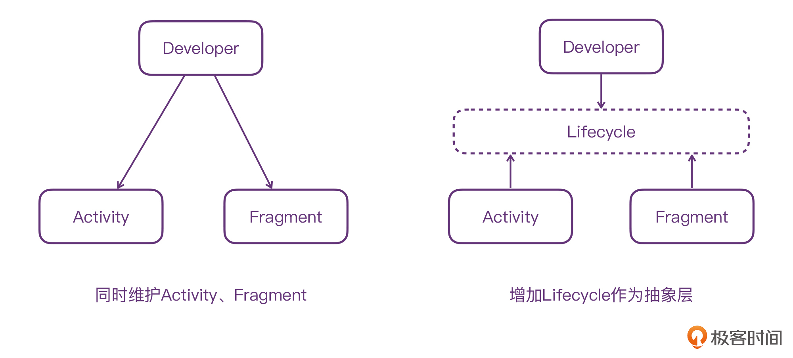
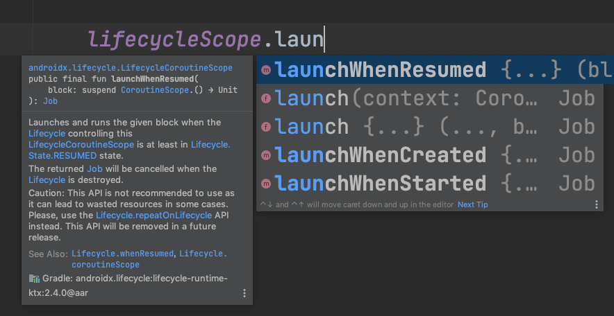

---
date: "2019-06-23"
---  
      
# 34 | Kotlin与Jetpack简直是天生一对！
你好，我是朱涛。今天，我们来聊聊Android的Jetpack。

在我看来，Kotlin和Jetpack，它们两个简直就是天生一对。作为Android开发者，如果只用Kotlin不用Jetpack，我们其实很难在Android平台充分发挥Kotlin的语言优势。而如果我们只用Jetpack而不用Kotlin，那么，我们将只能用到Jetpack的小部分功能。毕竟，Jetpack当中有很多API和库，是专门为Kotlin提供的。

经过前面课程内容的学习，相信现在你已经对Kotlin十分熟悉了，那么，接下来就让我们来看看Jetpack吧！这节课里，我会为你介绍Jetpack核心库的基本概念、简单用法，以及它跟Kotlin之间的关系，从而也为我们下节课的实战项目打下基础。

## Jetpack简介

Jetpack，它有“喷气式背包”的意思。对于我们开发者来说，它其实就是Google官方为我们提供的一套开发套件，专门用来帮助Android开发者提升开发效率、提升应用稳定性的。

[](https://android-developers.googleblog.com/2019/05/whats-new-with-android-jetpack.html)

Android Jetpack，最初的宣传图标，就是“穿着喷气式背包的Android机器人”。大概意思就是：有了Jetpack，Android就能“起飞了”。这当然只是一种夸张的比喻，不过，从我实际的开发体验来说，Jetpack确实可以给Android开发者带来极大的好处，尤其是当Jetpack与Kotlin结合到一起的情况下。

<!-- [[[read_end]]] -->

我们先来了解下KTX。

## KTX

KTX是Jetpack当中最特殊的一类库，它是由Kotlin编写的，同时也仅为Kotlin开发者服务，使用Java语言的Android开发者是用不了的。KTX，它的作用其实是对当前Android生态当中的API进行额外补充。它依托Kotlin的扩展能力，为Android原有API增加新的：扩展函数、扩展属性、高阶函数、命名参数、参数默认值、协程支持。

如果我们想要使用KTX的核心功能，我们需要单独进行依赖：

```
    // 代码段1
    
    dependencies {
        implementation "androidx.core:core-ktx:1.7.0"
    }
    

```

让我们来看一个关于SharedPreference的简单例子，如果我们使用Java，我们大概率是需要写一堆模板代码的，类似这样：

```
    // 代码段2
    
    SharedPreferences sharedPreferences= getSharedPreferences("data",Context.MODE_PRIVATE);
    SharedPreferences.Editor editor = sharedPreferences.edit();
    editor.putString(SP_KEY_RESPONSE, response);
    
    editor.commit();
    editor.apply();
    

```

不过，如果我们有了KTX，那么代码就会变得极其简单：

```
    // 代码段3
    
    preference.edit { putBoolean("key", value) }
    

```

上面的这个edit\(\)方法，其实是一个高阶函数，它是由KTX提供的，如果你去看它的源代码，会发现，它其实就是一个扩展出来的高阶函数：

```
    // 代码段4
    
    inline fun SharedPreferences.edit(
            commit: Boolean = false,
            action: SharedPreferences.Editor.() -> Unit
    ) {
        val editor = edit()
        action(editor)
        if (commit) {
            editor.commit()
        } else {
            editor.apply()
        }
    }
    

```

可以看到，KTX其实就是将一些常见的模板代码封装了起来，然后以扩展函数的形式提供给开发者。虽然它自身的原理很简单，但是却可以大大提升开发者的效率。

KTX除了能够扩展Android SDK的API以外，它还可以扩展Jetpack当中其他的库，比如说LiveData、Room等等。接下来，我们就来看看Jetpack当中比较核心的库：Lifecycle。

## Lifecycle

Lifecycle，其实就是Android的生命周期组件。在整个Jetpack组件当中的地位非常特殊，是必学的组件。举个例子，其他的组件比如WorkManager，如果我们实际工作中用不上，那么我们不去学它是不会有什么问题的。Lifecycle不一样，只要我们是做Android开发的，我们就绕不开Lifecycle。Activity里面有Lifecycle；Fragment里面也有；LiveData里面也有；

ViewModel底层也用到了Lifecycle；使用协程也离不开Lifecycle。

那么，Lifecycle到底是什么呢？我们平时提到生命周期，往往都是说的Activity、Fragment，而它们两者之间却有一个很大的问题，**生命周期函数不一致**。

Activity的生命周期我们肯定心里有数，不过Fragment生命周期函数比Activity多了几个：onCreateView、onViewCreated、onViewStateRestore、onDestoryView。最重要的是，Fragment生命周期、回调函数、Fragment内部View的生命周期，它们三者之间还有很复杂的对应关系。换句话说，Fragment的生命周期函数要比Activity复杂一些。

加之，Activity和Fragment结合的情况下，它们的生命周期行为在不同版本的Android系统上行为可能还会不一致。这在某些边界条件下，还会引发一些难以排查的bug，进一步增加我们Android程序员的维护成本。

在计算机世界里，大部分问题都可以通过增加一个抽象层来解决。Android团队的做法就是推出了Lifecycle这个架构组件，用它来统一Activity、Fragment的生命周期行为。



有了LifeCycle以后，我们开发者就可以面向Lifecycle编程。比如说，我们希望实现一个通用的地理位置监听的Manager，就可以这样来做：

```
    // 代码段5
    
    // 不关心调用方是Activity还是Fragment
    class LocationManager(
        private val context: Context,
        private val callback: (Location) -> Unit
    ): DefaultLifecycleObserver {
    
        override fun onStart(owner: LifecycleOwner) {
            start()
        }
    
        override fun onStop(owner: LifecycleOwner) {
            stop()
        }
    
        private fun start() {
            // 使用高德之类的 SDK 请求地理位置
        }
    
        private fun stop() {
            // 停止
        }
    }
    
    class LifecycleExampleActivity : AppCompatActivity() {
    
        override fun onCreate(savedInstanceState: Bundle?) {
            super.onCreate(savedInstanceState)
            setContentView(R.layout.activity_life_cycle_example)
    
            val locationManager = LocationManager(this) {
                // 展示地理位置信息
            }
            lifecycle.addObserver(locationManager)
        }
    }
    

```

上面代码的LocationManager只需要实现DefaultLifecycleObserver这个接口即可，外部是在Activity还是在Fragment当中使用，根本不必关心。

### Lifecycle与协程

通过前面课程的学习，我们知道，协程其实也是有生命周期的。也就是说，Android和Kotlin协程都是有生命周期的。这就意味着，当我们在Android当中使用协程的时候，就要格外小心。

作为Android开发者，你一定知道内存泄漏的概念：当内存变量的生命周期大于Android生命周期的时候，我们就认为内存发生泄漏了。类似的，当协程的生命周期大于Android生命周期的时候，**协程也就发生泄漏了**。

这一点，Android官方早就帮我们考虑到了。Lifecycle还可以跟我们前面提到的KTX结合到一起，进一步为Kotlin协程提供支持。



在Activity、Fragment当中，KTX还提供了对应的lifecycleScope，它本质上就是一个：与生命周期绑定的协程作用域。

```
    // 代码段6
    
    // 1
    public val LifecycleOwner.lifecycleScope: LifecycleCoroutineScope
        // 2
        get() = lifecycle.coroutineScope
    
    public abstract class LifecycleCoroutineScope internal constructor() : CoroutineScope {
        internal abstract val lifecycle: Lifecycle
    
        public fun launchWhenCreated(block: suspend CoroutineScope.() -> Unit): Job = launch {
            lifecycle.whenCreated(block)
        }
    
        public fun launchWhenStarted(block: suspend CoroutineScope.() -> Unit): Job = launch {
            lifecycle.whenStarted(block)
        }
    
        public fun launchWhenResumed(block: suspend CoroutineScope.() -> Unit): Job = launch {
            lifecycle.whenResumed(block)
        }
    }
    

```

在Android当中，Activity和Fragment都会实现LifecycleOwner这个接口，代表它们都是拥有生命周期的组件。注释1处，这里使用了Kotlin的扩展属性，为LifecycleOwner扩展了lifecycleScope。它的类型是LifecycleCoroutineScope，而它其实就是CoroutineScope的实现类。

lifecycleScope这个属性的具体实现，其实是通过注释2处的自定义getter\(\)实现的，也就是：Lifecycle.coroutineScope。

```
    // 代码段7
    
    public val Lifecycle.coroutineScope: LifecycleCoroutineScope
        get() {
            while (true) {
                // 1
                val existing = mInternalScopeRef.get() as LifecycleCoroutineScopeImpl?
                if (existing != null) {
                    return existing
                }
                // 2
                val newScope = LifecycleCoroutineScopeImpl(
                    this,
                    SupervisorJob() + Dispatchers.Main.immediate
                )
                //3
                if (mInternalScopeRef.compareAndSet(null, newScope)) {
                    newScope.register()
                    return newScope
                }
            }
        }
    

```

可以看到，Lifecycle.coroutineScope仍然是一个扩展属性。它的逻辑其实也很简单，主要是分为了三个步骤：

* 第一步，检查是否存在缓存的CoroutineScope，如果存在，那就直接返回即可。
* 第二步，如果不存在缓存，那就创建一个新的协程作用域。在创建的作用域的时候，用到了两个我们熟悉的概念：SupervisorJob、Dispatchers.Main，它们都是协程上下文的元素，**前者是用来隔离协程异常传播的，后者是指定协程执行线程的**。
* 第三步，更新缓存，并且调用register\(\)绑定scope与Lifecycle的关系，最后返回。

接下来，我们打破砂锅问到底，看看register\(\)的具体逻辑是什么：

```
    // 代码段8
    
    internal class LifecycleCoroutineScopeImpl(
        override val lifecycle: Lifecycle,
        override val coroutineContext: CoroutineContext
        // 2
    ) : LifecycleCoroutineScope(), LifecycleEventObserver {
        init {
            if (lifecycle.currentState == Lifecycle.State.DESTROYED) {
                coroutineContext.cancel()
            }
        }
    
        // 1
        fun register() {
            launch(Dispatchers.Main.immediate) {
                if (lifecycle.currentState >= Lifecycle.State.INITIALIZED) {
                    lifecycle.addObserver(this@LifecycleCoroutineScopeImpl)
                } else {
                    coroutineContext.cancel()
                }
            }
        }
    
        // 3
        override fun onStateChanged(source: LifecycleOwner, event: Lifecycle.Event) {
            if (lifecycle.currentState <= Lifecycle.State.DESTROYED) {
                lifecycle.removeObserver(this)
                coroutineContext.cancel()
            }
        }
    }
    
    public interface LifecycleEventObserver extends LifecycleObserver {
        void onStateChanged(@NonNull LifecycleOwner source, @NonNull Lifecycle.Event event);
    }
    

```

上面的代码一共有三个注释，我们一个个来看：

* 注释1，register\(\)，可以看到，它的逻辑其实很简单，主要就是调用了addObserver\(\)，将自身作为观察者传了进去。之所以可以这么做，还是因为注释2处的LifecycleEventObserver。
* 注释2，LifecycleEventObserver，它其实就是一个SAM接口，每当LifeCycleOwner的生命周期发生变化的时候，这个onStateChanged\(\)方法就会被调用。而这个方法的具体实现则在注释3处。
* 注释3，这里的逻辑也很简单，当LifeCycleOwner对应的Activity、Fragment被销毁以后，就会调用removeObserver\(this\)移除观察者，最后，就是最关键的coroutineContext.cancel\(\)，取消整个作用域里所有的协程任务。

这样一来，就能保证LifeCycle与协程的生命周期完全一致了，也就不会出现协程泄漏的问题了。

## 小结

这节课，我们主要了解了Android当中的Jetpack，它是Android官方提供给开发者的一个开发套件，可以帮助我们开发者提升开发效率。Jetpack当中其实有[几十个库](https://developer.android.com/jetpack)，在这节课里，我们是着重讲解了其中的KTX与LifeCycle。

* KTX，主要是依托Kotlin的扩展能力，为Android原有API增加新的：扩展函数、扩展属性、高阶函数、命名参数、参数默认值、协程支持。
* Lifecycle，其实就是Android的生命周期组件。它统一封装了Activity、Fragment等Android生命周期的组件。让我们开发者可以只关注LifeCycle的生命周期，而不用在意其他细节。
* KTX还为LifeCycle增加了协程支持，也就是lifecycleScope。在它的底层，这个协程作用域和宿主的生命周期进行了绑定。当宿主被销毁以后，它可以确保lifecycleScope当中的协程任务，也跟着被取消。

所以，对于Android开发者来说，Kotlin和Jetpack是一个“你中有我，我中有你”的关系，我们把它们称为“天生一对”一点儿也不为过。

## 思考题

在Android中使用协程的时候，除了lifecycleScope以外，我们还经常会使用ViewModel的viewModelScope。你能结合前面协程篇、源码篇的知识点，分析出viewModelScope的实现原理吗？

```
    class MyViewModel : ViewModel() {
        private val _persons: MutableLiveData<List<Person>> = MutableLiveData()
        val persons: LiveData<List<Person>> = _persons
    
        fun loadPersons() {
            viewModelScope.launch {
                delay(500L)
                _persons.value = listOf(Person("Tom"), Person("Jack"))
            }
        }
    }
    
    // 扩展属性
    public val ViewModel.viewModelScope: CoroutineScope
        get() {
            val scope: CoroutineScope? = this.getTag(JOB_KEY)
            if (scope != null) {
                return scope
            }
            return setTagIfAbsent(
                JOB_KEY,
                // 实现类
                CloseableCoroutineScope(SupervisorJob() + Dispatchers.Main.immediate)
            )
        }
    
    // 实现了Closeable的CoroutineScope
    internal class CloseableCoroutineScope(context: CoroutineContext) : Closeable, CoroutineScope {
        override val coroutineContext: CoroutineContext = context
    
        override fun close() {
            // 取消
            coroutineContext.cancel()
        }
    }
    
    public abstract class ViewModel {
    
        @Nullable
        private final Map<String, Object> mBagOfTags = new HashMap<>();
        private volatile boolean mCleared = false;
    
    
        @SuppressWarnings("WeakerAccess")
        protected void onCleared() {
        }
    
        @MainThread
        final void clear() {
            mCleared = true;
    
            if (mBagOfTags != null) {
                synchronized (mBagOfTags) {
                    for (Object value : mBagOfTags.values()) {
                        // 调用scope的close()
                        closeWithRuntimeException(value);
                    }
                }
            }
            onCleared();
        }
    
        // scope暂存起来
        @SuppressWarnings("unchecked")
        <T> T setTagIfAbsent(String key, T newValue) {
            T previous;
            synchronized (mBagOfTags) {
                previous = (T) mBagOfTags.get(key);
                if (previous == null) {
                    mBagOfTags.put(key, newValue);
                }
            }
            T result = previous == null ? newValue : previous;
            if (mCleared) {
    
                closeWithRuntimeException(result);
            }
            return result;
        }
    
        private static void closeWithRuntimeException(Object obj) {
            if (obj instanceof Closeable) {
                try {
                    ((Closeable) obj).close();
                } catch (IOException e) {
                    throw new RuntimeException(e);
                }
            }
        }
    }
    

```