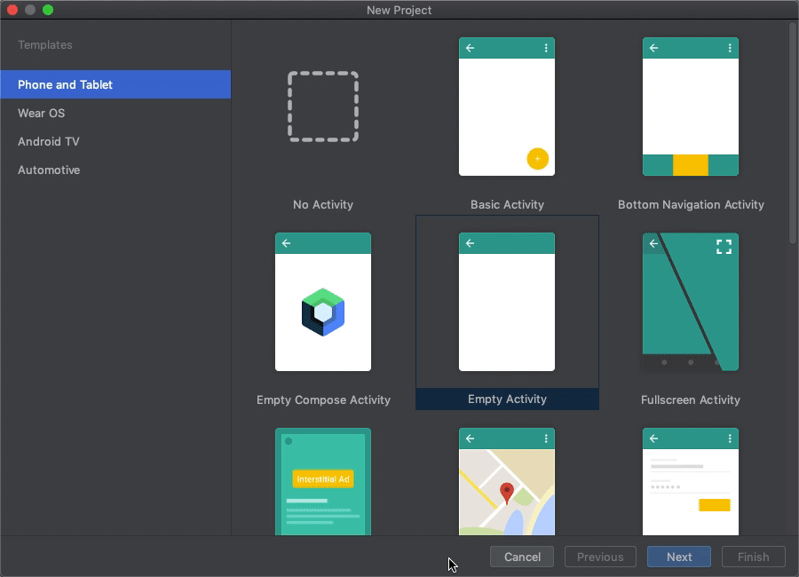
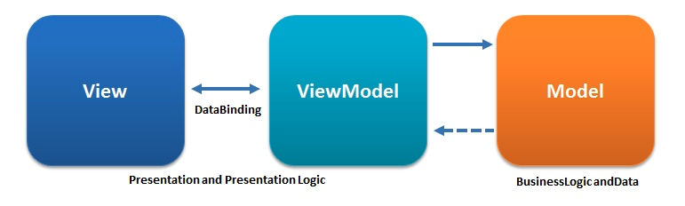
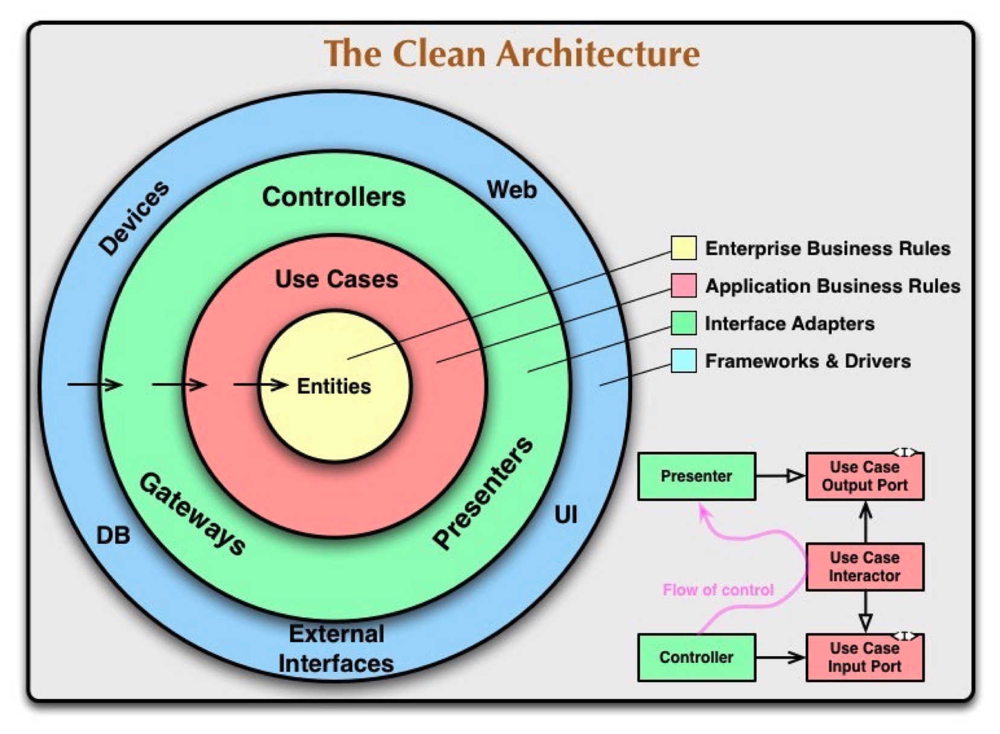
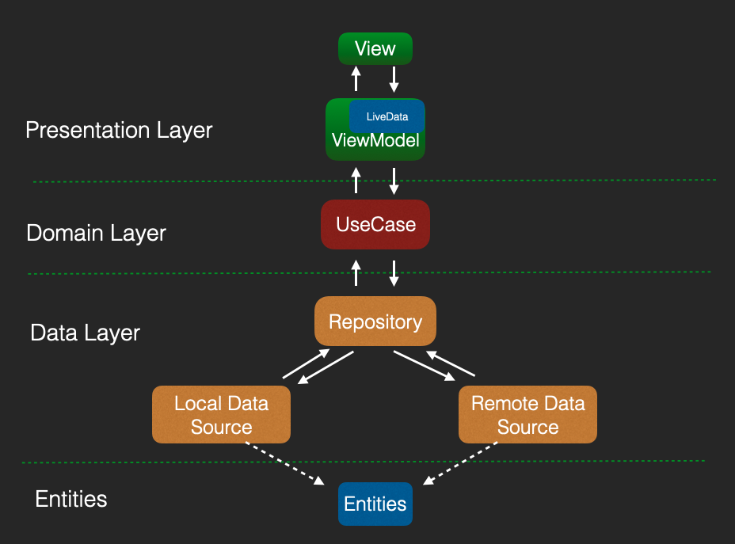
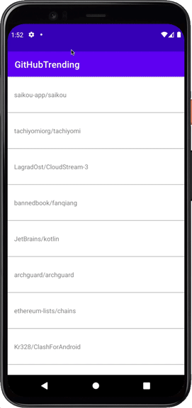
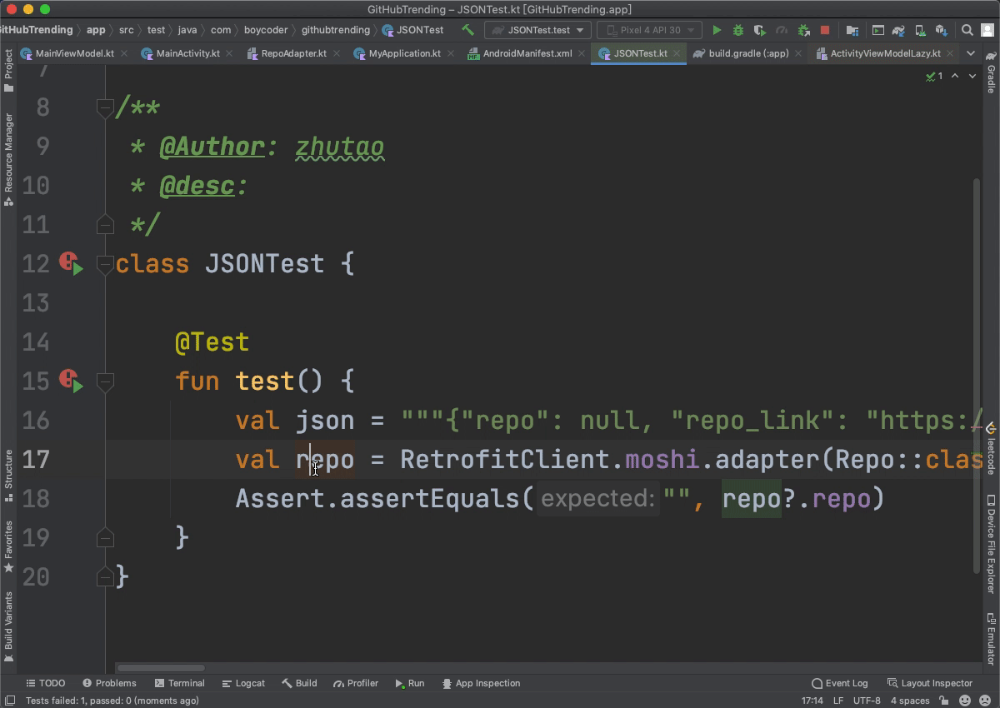
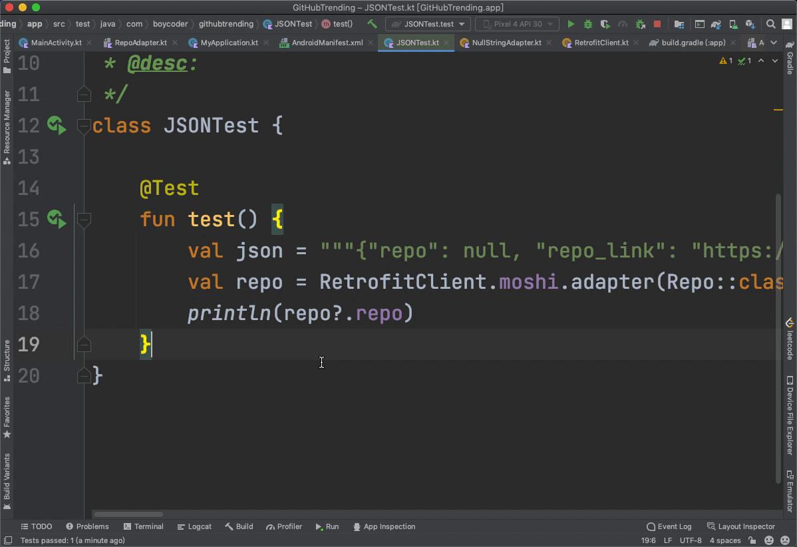

---
date: "2019-06-23"
---  
      
# 35 | 用Kotlin写一个GitHub Trending App
你好，我是朱涛。

这节课，我们一起来用Kotlin和Jetpack写一个简单的Android应用。为了便于理解，这个应用的功能会尽量简单，即使你对Android不是特别熟悉，跟着课程的引导，你也能轻松完成。

## 准备工作

在之前的课程中，我们的实战项目都是基于JVM的，并没有涉及过Android相关的配置。因此，如果你的电脑没有Android开发的环境的话，那么可能需要做一些额外的配置。当然，在你已有Java环境的前提下，想要配置Android开发环境并不麻烦，你可以去搜索一些相关的[Android开发环境配置](https://www.google.com/search?q=Android+%E5%BC%80%E5%8F%91%E7%8E%AF%E5%A2%83%E9%85%8D%E7%BD%AE)的教程。

那么，要进行Android开发，我们可以使用IntelliJ，也可以使用Android Studio，后者针对Android开发做了很多定制化，也是免费的，这里我也建议你去下载Android Studio。

当配置好所有的环境以后，我们就可以像创建Kotlin工程一样，来创建一个新的Android工程了。



然后，当你创建好工程以后，就可以尝试运行代码了，这时候你大概率会看到一个Hello World的初始界面。

接下来，我们就正式进入开发吧。

## MVVM架构

Android应用的架构，在过去的这些年里一直都在变化。最开始的Android其实没有什么明确的架构，大家习惯于把所有代码都往Activity里放，直到后来才开始有了MVC、MVP以及MVVM。

<!-- [[[read_end]]] -->

那么，站在现在这个时间节点上，当前Android中比较主流、比较受Google推崇的，是MVVM架构。这节课，我们就以 **MVVM架构**为基础，并且也尝试**结合Clean架构**来进行一些实践。

关于MVVM架构，它其实就是代表了Model — View — ViewModel，如果将其对应到Android当中来的话，它们之间大概会是这样的关系：



MVVM其实是一种广泛存在的架构模式，在Android当中也有类似的实现。ViewModel会连接View和Model，View和Model之间是隔离开的。而View和ViewModel之间，也往往会存在数据绑定，这里的数据绑定可以是一个组件（如Android的DataBinding），也可以是由代码来完成绑定。

而相比MVVM架构，Clean架构则是一种更加抽象的思维模式了。它将整个架构大致分为三层，由外到内分别是：表现层、领域层、数据层。它们之间的依赖关系也是由外到内的。



不过 **Clean架构只是一种思想**，当我们尝试在Android中落地应用的时候，其实并不一定会完全按照这里的架构图来设计，目前比较常见的架构是下面这样的：



可以看到，上面这个架构，融入了MVVM与Clean两个架构的特点，让我们从下往上看：

* **实体层**，这里其实就是我们平时定义的一些Bean的实体类，用Kotlin的数据类即可。
* **数据层**，这里一般会有两个概念，分别是DataSource与Repository，前者代表数据源，后者代表数据仓库。数据源一般会区分本地数据源和远程数据源，而数据仓库则会统筹它们两者。
* **领域层**，这里一般会是一些相对具体一些的业务逻辑。
* **表现层**，这里则是接近UI展示的上层逻辑了。

好，架构分析完了，接下来我们看看代码该怎么写，我们还是按照架构的分层，从下往上来实现。

### 实体层

首先，我们要定义一个密封类，来统一不同情况下的数据形式。

```
    sealed class ResultX<out R: Any> {
    
        data class Success<out T: Any>(val data: T) : ResultX<T>()
        data class Error(val exception: Exception) : ResultX<Nothing>()
        object Loading : ResultX<Nothing>()
    
        override fun toString(): String {
            return when (this) {
                is Success<*> -> "Success[data=$data]"
                is Error -> "Error[exception=$exception]"
                Loading -> "Loading"
            }
        }
    }
    

```

这里，我们利用密封类和泛型，将数据的成功、失败、加载中都统一了起来。类似这样的做法，我们在课程的[第2讲](https://time.geekbang.org/column/article/473349)里也已经提到过了。

然后，由于我们是要实现一个GitHub Trending的应用，所以这里我们只需要找一个开源的API，通过分析它的JSON结构，然后定义出具体的Data Class就行了。这一步，我们其实在[第12讲](https://time.geekbang.org/column/article/481787)当中就已经完成了。

```
    data class RepoList(
        var count: Int?,
        var items: List<Repo>?,
        var msg: String?
    )
    
    data class Repo(
        var added_stars: String?,
        var avatars: List<String>?,
        var desc: String?,
        var forks: String?,
        var lang: String?,
        var repo: String?,
        var repo_link: String?,
        var stars: String?
    )
    

```

不过，在之前的课程当中，我提到过以这种方式定义的数据类，其实还存在2个问题。

* 问题1：不符合“不变性思维”，成员属性全部都是var定义的。
* 问题2：不符合“空安全思维”，所有的类型都是可为空的。

那么针对这两个问题，我们像下面这样做，其实很容易就能搞定：

```
    data class RepoList(
        val count: Int = 0,
        val items: List<Repo> = listOf(),
        val msg: String = "数据为空"
    )
    
    data class Repo(
        val added_stars: String = "",
        val avatars: List<String> = listOf(),
        val desc: String = "",
        val forks: String = "",
        val lang: String = "",
        val repo: String = "",
        val repo_link: String = "",
        val stars: String = ""
    )
    

```

在这段代码中，我们是把var都替换成了val，把所有的可空类型都改成了不可空类型，同时也为属性都提供了默认值。

当然，仅仅只是改变底层的实体类的定义还远远不够，具体遇到的问题，我们会在后面分析。下面我们接着来看数据层。

### 数据层

在数据层当中，最关键的就是RepoDataSource和Repository。那么首先，我们就要定义它们对应的接口。你可以参考这里的实现：

```
    interface RepoDataSource {
        suspend fun getRepos(): ResultX<RepoList>
    }
    
    interface IRepository {
        suspend fun getRepoList(): ResultX<RepoList>
    }
    

```

接下来，就是它们对应的实现类了，我们先来看看数据源怎么处理。

由于我们需要请求网络，所以这里我们自然就会想到OkHttp和Retrofit了。虽然我们也可以使用自己写的KtHttp，但它毕竟只是用于学习和研究目的而编写的，并不适合真的拿来用。

```
    object RetrofitClient {
    
        private const val TAG = "OkHttp"
        private const val BASE_URL = "https://baseUrl.com/"
        private const val TIME_OUT = 10
    
        val moshi: Moshi by lazy {
            Moshi.Builder()
                .add(KotlinJsonAdapterFactory())
                .build()
        }
    
        val service by lazy { getService(RepoService::class.java, BASE_URL) }
    
        private val client: OkHttpClient by lazy {
            val builder = OkHttpClient.Builder()
            builder.connectTimeout(TIME_OUT.toLong(), TimeUnit.SECONDS)
            builder.build()
        }
    
        private fun <S> getService(
            serviceClass: Class<S>,
            baseUrl: String,
            client: OkHttpClient = this.client
        ): S {
            return Retrofit.Builder()
                .client(client)
                .addConverterFactory(MoshiConverterFactory.create(moshi))
                .baseUrl(baseUrl)
                .build().create(serviceClass)
        }
    }
    
    interface RepoService {
        @GET("repo")
        suspend fun repos(@Query("lang") lang: String = "Kotlin", @Query("since") since: String = "weekly"): RepoList
    }
    

```

其实，当我们自己手写了KtHttp的源码以后，Retrofit用起来就会非常顺手。这里我们是定义了一个单例RetrofitClient用来请求API，还有RepoService来代表具体的请求参数规则。

那么有了Retrofit以后，我们要处理数据源也就很容易了。

```
    object RemoteRepoDataSource : RepoDataSource {
        const val TAG = "RemoteRepoDataSource"
        override suspend fun getRepos(): ResultX<RepoList> =
            withContext(Dispatchers.IO) {
                try {
                    Success(RetrofitClient.service.repos())
                } catch (e: Exception) {
                    Log.e(TAG, e.message, e)
                    Error(e)
                }
            }
    }
    

```

在这里，我们定义了一个RemoteRepoDataSource，它实现了RepoDataSource这个数据源的接口。而它具体的实现方法，是使用withContext\{\} 将API请求分发到了IO线程池，然后根据实际的运行结果，将数据封装成对应的ResultX的子类型。

接着就是数据仓库了，它一般是用于统筹缓存数据、远程数据的，这里为了不引入过多的复杂度，我们简单来实现：

```
    class MainRepository(
        private val dataSource: RepoDataSource = RemoteRepoDataSource,
        private val localDataSource: RepoDataSource? = null
    ) : IRepository {
        override suspend fun getRepoList(): ResultX<RepoList> {
            // 暂不处理缓存逻辑
            return dataSource.getRepos()
        }
    }
    

```

你可以看到，它其实就是数据源的一层封装而已。

好，至此，我们的数据层就已经完成了。

### 领域层

所谓领域层，其实就像是业务逻辑的一个小单元，这里的小单元，我们可以将其称为UseCase。

```
    class GetRepoListUseCase(private val repository: IRepository = MainRepository()) {
        suspend operator fun invoke(): ResultX<RepoList> {
            return repository.getRepoList()
        }
    }
    

```

在当前的案例中，我们只有一个业务场景，也就是获取GitHub仓库的列表，所以这个UseCase的逻辑也很简单。不过你要知道，在实际的工作场景中，UseCase是可以承载复杂的业务逻辑的。

接下来，我们往上看一下表现层。

### 表现层

到了表现层这里，我们其实就已经非常接近UI了，具体来说，这里主要涉及到ViewModel还有Activity、Fragment。我们先来看看ViewModel。

```
    class MainViewModel(
        val getRepoListUseCase: GetRepoListUseCase = GetRepoListUseCase()
    ) : ViewModel() {
        val repos: LiveData<RepoList>
            get() = _repos
        private val _repos = MutableLiveData<RepoList>()
    
        fun loadRepos() {
            viewModelScope.launch {
                val result = getRepoListUseCase()
                when (result) {
                    is ResultX.Success -> {
                        _repos.value = result.data
                    }
                    is ResultX.Error -> {
                        _repos.value = RepoList()
                    }
                    ResultX.Loading -> {
                        // 展示Loading
                    }
                }
            }
        }
    }
    

```

可以看到，我们在ViewModel当中定义了一组LiveData，并且针对它的读写做了限制，这一点，我们在讲[不变性思维](https://time.geekbang.org/column/article/484631)的时候提到过。

在loadRepos\(\)这个方法中，我们用到了viewModelScope.launch \{\} 来启动协程。经过上节课的学习，我们知道以这种方式启动的协程是不会发生泄漏的，其中的协程任务会随着Activity的销毁而取消。

OK，最后，就是Activity当中的逻辑了。

```
    class MainActivity : AppCompatActivity() {
        // 1
        private val viewModel: MainViewModel by viewModels()
        // 2
        private lateinit var binding: ActivityMainBinding
    
        private lateinit var adapter: RepoAdapter
        private val layoutManager = LinearLayoutManager(this, LinearLayoutManager.VERTICAL, false)
    
        override fun onCreate(savedInstanceState: Bundle?) {
            super.onCreate(savedInstanceState)
            binding = ActivityMainBinding.inflate(layoutInflater)
            setContentView(binding.root)
    
            viewModel.loadRepos()
            observeData()
        }
    
        private fun observeData() {
            // 3
            viewModel.repos.observe(this) {
                display(it)
            }
        }
    
        private fun display(repoList: RepoList) {
            adapter = RepoAdapter(repoList)
            binding.recycler.layoutManager = layoutManager
            binding.recycler.adapter = adapter
        }
    }
    

```

上面Activity的逻辑也很简单，其中有几个注释，我们一起来看看：

* 注释1，这里我们使用了委托的语法，将ViewModel的创建交给了"by viewModels\(\)"。它其实是Activity的一个扩展函数，是由KTX实现的。
* 注释2，ActivityMainBinding，这里我们使用了Jetpack当中的ViewBinding，这样我们就不用写烦人的findViewById\(\)了。
* 注释3，viewModel.repos.observe\{\}，这里我们完成了ViewModel当中LiveData的数据监听，当我们的网络请求有结果以后，它就会立刻被回调。

另外，以上代码中还涉及到了一些RecyclerView相关的适配器逻辑，也非常简单：

```
    class RepoAdapter(private val repoList: RepoList): RecyclerView.Adapter<RepoHolder>() {
        override fun onCreateViewHolder(parent: ViewGroup, viewType: Int): RepoHolder {
            return RepoHolder(LayoutInflater.from(parent.context).inflate(R.layout.item_repo, parent, false))
        }
    
        override fun onBindViewHolder(holder: RepoHolder, position: Int) {
            holder.text.text = repoList.items.getOrNull(position)?.repo
        }
    
        override fun getItemCount(): Int = repoList.count
    }
    
    class RepoHolder(itemView: View): RecyclerView.ViewHolder(itemView) {
        val text : TextView = itemView.findViewById(R.id.text)
    }
    

```

也就是，为了让RecyclerView正确展示数据，我们需要实现一些方法，以上这些都是一些模板代码。

最后，在运行代码之前，我们还需要给App增加一个网络权限。

```
    <uses-permission android:name="android.permission.INTERNET" />
    

```

这个时候，如果你在模拟器或者真机上运行的话，就会看到类似这样的一个效果：



那么，到这里，我们的代码是不是就写完了呢？其实并没有。

## 空安全

因为，我们还有一个问题没有解决：**如果服务端返回的JSON字段是null的话，我们的程序仍然会出错。**具体来说，我们可以用这个单元测试来模拟。

```
    @Test
    fun test() {
        //                  强行返回null
        //                      ↓
        val json = """{"repo": null, "repo_link": "https://github.com/JetBrains/kotlin", "desc": "The Kotlin Programming Language.", "lang": "Kotlin", "stars": "40,907", "forks": "5,067", "added_stars": "98 stars this week", "avatars": ["https://avatars.githubusercontent.com/u/292714?s=40&v=4", "https://avatars.githubusercontent.com/u/1127631?s=40&v=4", "https://avatars.githubusercontent.com/u/908958?s=40&v=4", "https://avatars.githubusercontent.com/u/3007027?s=40&v=4", "https://avatars.githubusercontent.com/u/888318?s=40&v=4"]}"""
        val repo = RetrofitClient.moshi.adapter(Repo::class.java).fromJson(json)
        println(repo?.repo)
    }
    
    /*
    报错：
    Non-null value 'repo' was null at $.repo at com.squareup.moshi.internal.Util
    */
    

```



其实，当我们利用[空安全思维](https://time.geekbang.org/column/article/484921)，将Repo中所有的成员都定义成“非空类型”以后，当API不返回某个字段的时候，程序是可以自动填充默认值的。但是，当API强行在接口当中返回null的时候，我们的程序还是会崩溃。

为了解决这个问题，我们需要为JSON解析框架Moshi，配置一个额外的规则：

```
    object NullStringAdapter {
        @FromJson
        fun fromJson(reader: JsonReader): String {
            if (reader.peek() != JsonReader.Token.NULL) {
                return reader.nextString()
            }
            reader.nextNull<Unit>()
            return ""
        }
    
        @ToJson
        fun toJson(writer: JsonWriter, value: String?) {
            writer.value(value)
        }
    }
    

```

这个Adapter，其实就是在服务端返回null的时候，我们做一层兼容，将其替换成默认值。它的用法也很简单：

```
    object RetrofitClient {
    
        // 省略
    
        val moshi: Moshi by lazy {
            Moshi.Builder()
                .add(NullStringAdapter) // 变化在这里
                .add(KotlinJsonAdapterFactory())
                .build()
        }
    
    }
    

```

这样，当我们把这个Adapter配置到Moshi当中以后，单元测试就可以正常通过了。



## 小结

好，这节课的内容到这里就差不多结束了。让我们来做一个简单的总结。

* MVVM，是一种常见的架构模式，在Android当中，一般会借助ViewModel、LiveData之类的组件来实现。在实战当中，我们还可以将其跟Clean架构的思想相结合，将整体应用的架构分为四层：实体层、数据层、领域层、表现层。
* 实体层，在大部分架构设计当中，实体层会和数据层进行融合，不过在这节课当中，我们将其单独抽了出来，放在了整个架构的最底层，通过密封类、数据类来实现的。
* 数据层，这里有两个概念，分别是“数据源”和“数据仓库”。数据源一般会分为缓存数据与远程数据，数据仓库则负责统筹多种数据源。
* 领域层，这里会涉及到业务逻辑的最小单元，我们一般将其称为UseCase。
* 表现层，这里会涉及到数据与UI交互的逻辑。ViewModel当中会封装UseCase，并且持有数据和View进行交互。
* 最后，我们还根据实际情况，对JSON解析库Moshi，做了额外配置，让它可以对服务端返回null的时候，仍然保持兼容，不会出现空指针异常。

那么，如果你本身对Android、MVVM、Clean架构都不是很熟悉，也许在学习这节课的过程中会有点不太适应。这时候，你可以去GitHub下载本课程对应的Demo，来实际运行和调试，以加深印象，链接在[这里](https://github.com/chaxiu/GitHubTrending.git)。

## 思考题

这节课，我们融合MVVM和Clean完成了一种混合架构，请问这种架构有什么样的优点和缺点呢？