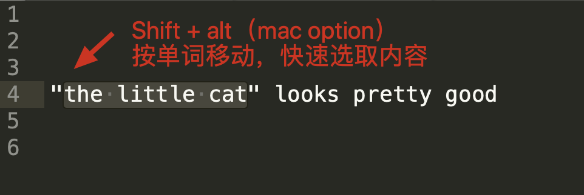
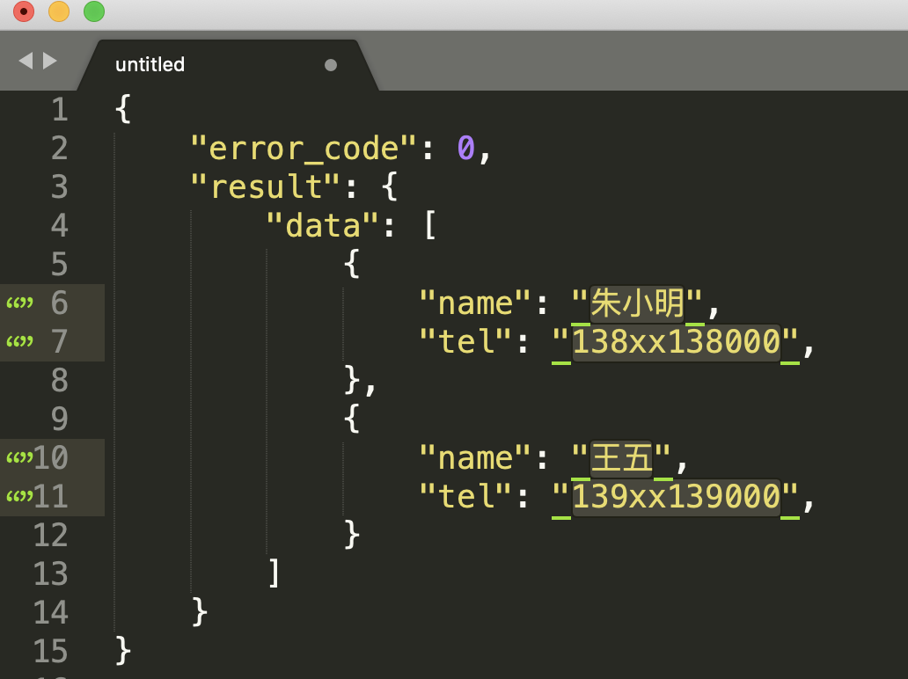
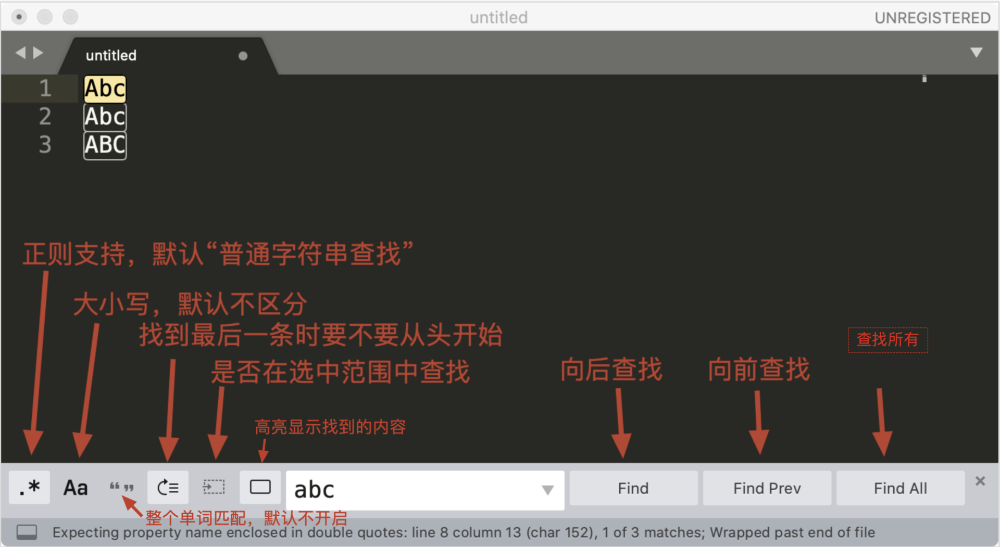
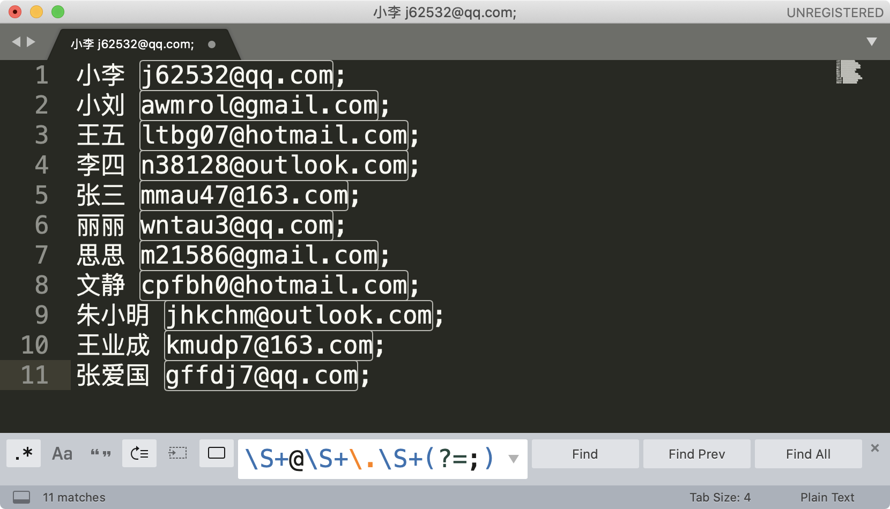
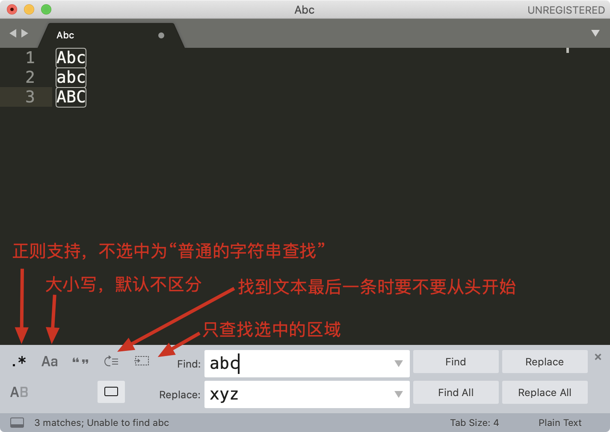
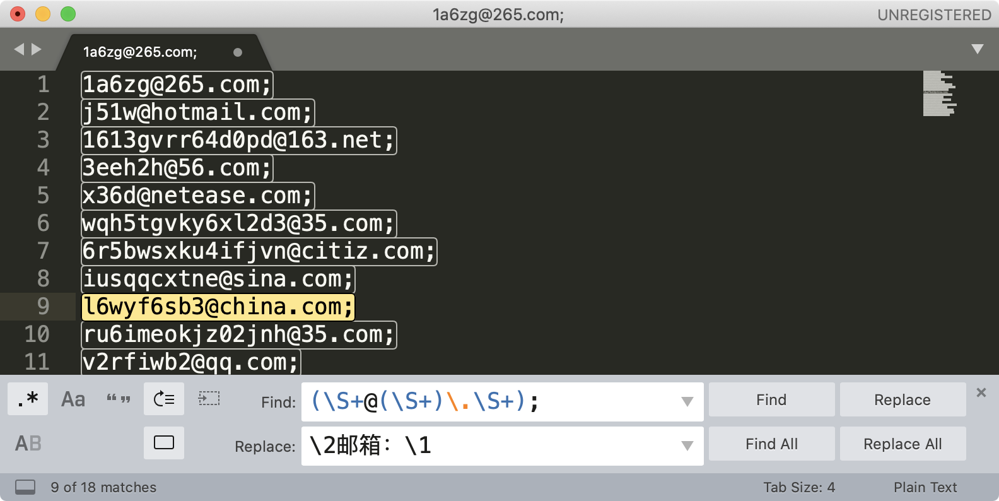
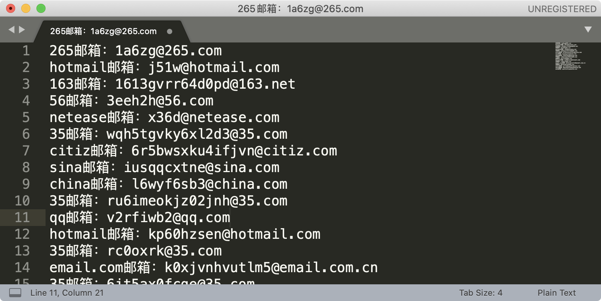
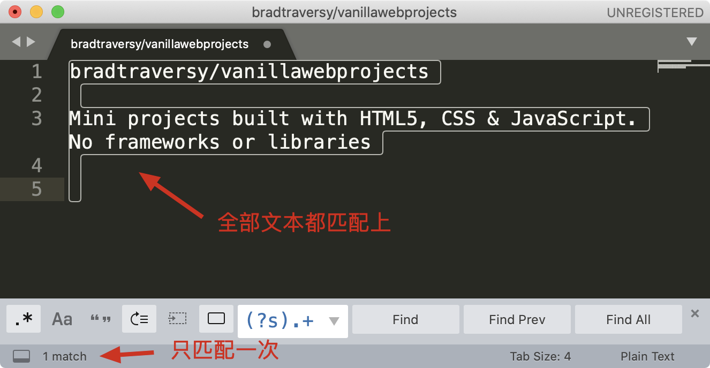
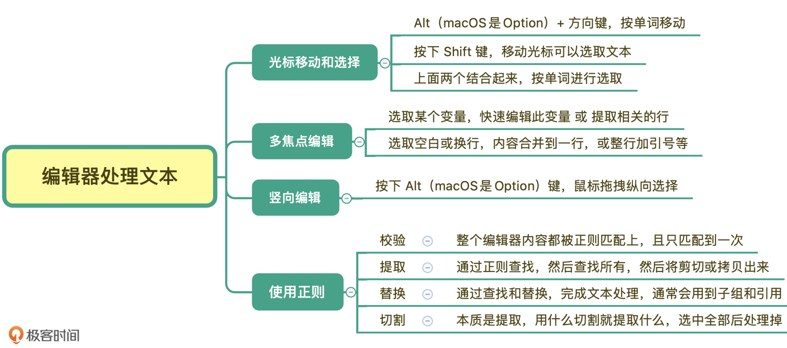

---
date: "2019-06-23"
---  
      
# 09 | 应用2：如何在编辑器中使用正则完成工作？
你好，我是伟忠。今天我来和你分享一下，在常见的编辑器中如何使用正则来完成工作。

你可能要问了，这是正则专栏，为啥不直接开始讲正则？其实我给你讲的编辑器使用技巧，能够帮助我们更好地完成工作。因为我们学习正则的目的，就是想高效地完成文本处理。

但在实际工作中，我们一般不会只用正则，而是通常将编辑器的特性和正则结合起来，这样可以让文本处理工作更加高效。正所谓“工欲善其事，必先利其器”，你花点时间来了解一下编辑器的各种特性，可以少写很多代码。

## 编辑器功能

接下来，我以Sublime Text 3 为例，给你讲讲一些在编辑器里的强大功能，这些功能在Sublime Text、Atom、VS Code、JetBrains 系列（IntelliJ IDEA/PyCharm/Goland等\) 中都是支持的。

### 光标移动和文本选择

在常见的编辑器、IDE、甚至Chrome等浏览器中，我们编辑文本时，使用键盘的左右箭头移动光标，可以**按住Shift键**来选中文本。在左右移动时，如果你按住**Alt（macOS的option）**，你会发现光标可以“按块移动”，快速移动到下一个单词。两种方式组合起来，你可以快速选择引号里面的内容。  


你可以动手练习一下，熟悉一下这些操作。你可能会说，有必要么，我用鼠标拖一下不就可以了？你说得没错，但这个功能和后面我要讲的多焦点编辑、竖向编辑等结合起来，就可以快速多行操作，这是鼠标做不到的。

<!-- [[[read_end]]] -->

### 多焦点编辑

在IDE中，我们如果想对某个变量或函数重命名，通常可以使用重构（refactor）功能。但如果处理的不是代码，而是普通文本，比如JSON字符串的时候，就没法这么用了。不过现在很多编辑器都提供了多焦点编辑的功能。

比如选择单词 route 之后，点击菜单 Find \-> Quick Find All 就可以选中所有的 route 了。你可以进行多焦点编辑，非常方便。我给了你一个测试文本，你可以点击[这里](https://github.com/gin-gonic/gin/blob/5e40c1d49c21bf989e8d54dbd555086f06d4fb8a/README.md#bind-uri)获取。


这个特性结合光标移动，可以快速提取某些内容，比如提取 JSON中的姓名和手机号。选中所有的字段和值之间的字符（": "） 之后，按住 Shift+Alt（macOS上是Shift + Option），用箭头移动光标，可以快速选择到另外一个引号前，然后剪切，再找个空白地方粘贴就可以了。

```
    {
      "error_code": 0,
      "result": {
        "data": [
          {
            "name": "朱小明",
            "tel": "138xx138000"
          },
          {
            "name": "王五",
            "tel": "139xx139000"
          }
        ]
      }
    }
    

```



详细操作你可以看一下这个小视频。  

### 竖向编辑

在编辑多行时，如果我们需要编辑的内容都是纵向上同一个位置，就可以使用 Alt \(macOS上是 Option）加上鼠标拖拽的方式来选择（或者尝试按下鼠标中键拖拽）。比如下图，当你选择了左侧的两个空格之后，可以批量编辑，比如修改成四个空格。将竖向编辑和刚刚上面说到的光标移动结合起来，会非常方便。


## 在编辑器中使用正则

正则是一种文本处理工具，常见的功能有文本验证、文本提取、文本替换、文本切割等。有一些地方说的正则匹配，其实是包括了校验和提取两个功能。

校验常用于验证整个文本的组成是不是符合规则，比如密码规则校验。提取则是从大段的文本中抽取出需要的内容，比如提取网页上所有的链接。在使用正则进行内容提取时，要做到不能提取到错误的内容（准确性），不能漏掉正确的内容（完备性）。这就要求我们写正则的时候尽量考虑周全。但是考虑周全并不容易，需要我们不断地练习、思考和总结。

### 内容提取

我以编辑器 Sublime Text 3 为例来进行讲解，下图是编辑器 Sublime Text 查找界面的介绍。



我们来尝试使用 sublime 提取文本中所有的邮箱地址，这里并不要求你写出一个完美的正则，因此演示时，使用`\S+@\S+\.\S+` 这个正则。另外我们可以加上环视，去掉尾部的分号。你可以[在这里](http://www.zhongguosou.com/mailharddisk/mail_address_creator.aspx)随机生成一些邮箱用于测试。


你可能会有疑问，我直接找到最后的分号，然后删除掉不就可以了么？这个例子是没问题的，但如果文本中除了邮箱之外，还有其它的内容这样就不行了，这也是正则比普通文本强大的地方。



### 内容替换

说完了查找，我们再来看一下替换。之前课程里我们也有讲过，这里再来回顾一下。下图是编辑器 Sublime Text 替换界面的介绍。



同样是上面邮箱的例子，我们可以使用子组和引用，直接替换得到移除了分号之后的邮箱，我们还可以在邮箱前把邮箱类型加上。操作前和操作后的示意图如下：





替换和提取的不同在于，替换可以对内容进行拼接和改造，而提取是从原来的内容中抽取出一个子集，不会改变原来的内容。当然在实际应用中，可以两个结合起来一起使用。

### 内容验证

在编辑器中进行内容验证，本质上和内容提取一样，只不过要求编辑器中全部内容都匹配上，并且匹配次数是一次。



### 内容切割

在编辑器中进行内容切割，本质上也和内容提取一样，用什么切割，我们就提取什么，选中全部之后，把选中的内容删除掉或者编辑成其它的字符。


刚刚我们讲解了在 Sublime Text 中使用正则处理文本的方法，其它的编辑器或IDE，如 Atom、VS Code、JetBrains系列（IntelliJ IDEA/PyCharm/Goland等）等，也都是类似的，你可以在自己喜欢的编辑器中练习一下今天讲到的内容。

这里给出一些主流跨平台编辑器/IDE对正则的支持情况，你可以参考一下。


## 总结

好了，今天的内容讲完了，我来带你总结回顾一下。

今天我们学习了编辑器中一些提高文本处理效率的操作方式：光标移动和选择、多焦点编辑以及竖向编辑。学会了这些，即使不使用正则，我们在编辑器中处理文本效率也会大大提高。接着通过一些示例，我们学习了在编辑器中使用正则来进行文本内容提取，内容替换等操作。正则的使用一般会和其它的方法结合起来，最终帮助我们高效地完成文本的处理工作。

今天所讲的内容总结脑图如下，你可以回顾一下：



## 课后思考

最后，我们来做一个小练习吧：统计一篇英文文章中每个单词出现的次数，使用Sublime Text 等编辑器提取文章里所有的单词，处理成一行一个单词，保存到文件中，然后再使用sort、uniq 等命令统计单词出现的次数。

为了帮你更好地完成这个任务，你可以参考一下下面的提示：

 1.     windows上的同学可以使用 [git for windows](https://gitforwindows.org/) 工具。
 2.     使用 uniq 前需要先用 sort 命令排序，uniq -c 可以统计次数。

```
    sort words.txt | uniq -c
    如果想取前10名，可以继续对结果排序
    sort words.txt | uniq -c | sort -nrk1 | head -n10
    至于为什么要加 n、r 和 k1 你可以通过 man sort 看一下说明
    

```

好，今天的课程就结束了，希望可以帮助到你，也希望你在下方的留言区和我参与讨论，并把文章分享给你的朋友或者同事，一起交流一下。