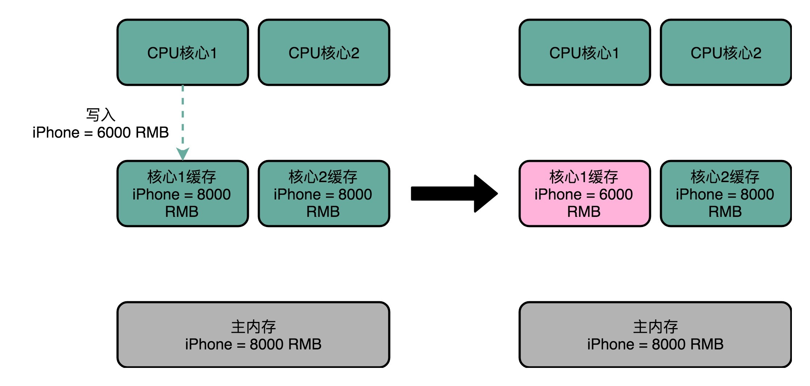
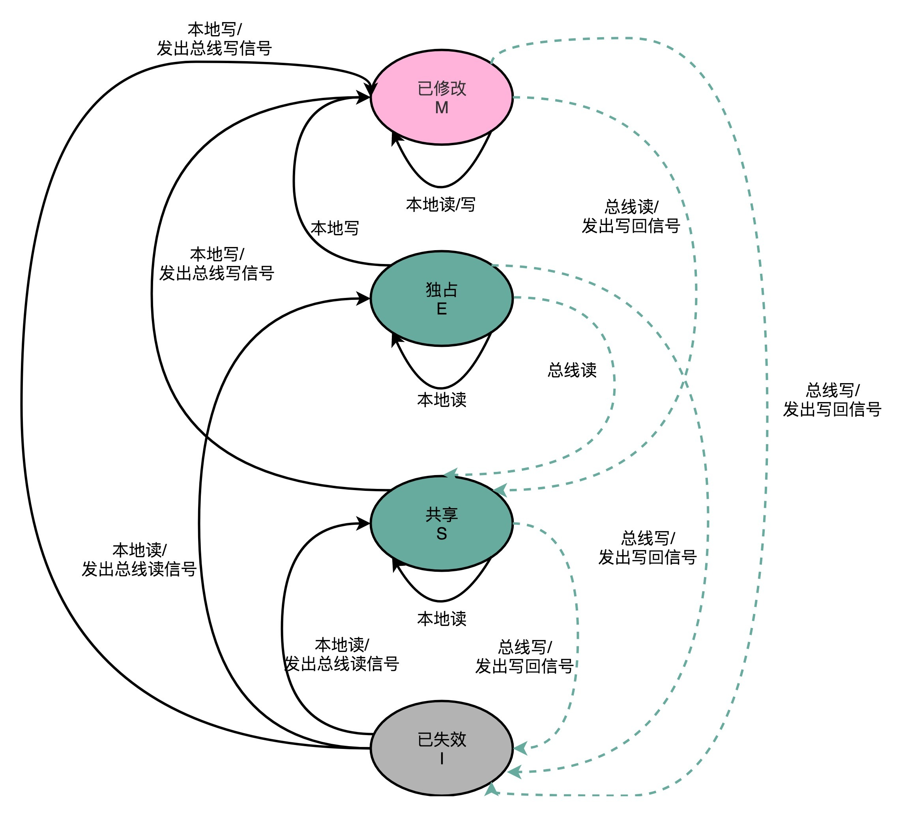

---
date: "2019-06-23"
---  
      
# 39 | MESI协议：如何让多核CPU的高速缓存保持一致？
你平时用的电脑，应该都是多核的CPU。多核CPU有很多好处，其中最重要的一个就是，它使得我们在不能提升CPU的主频之后，找到了另一种提升CPU吞吐率的办法。

不知道上一讲的内容你还记得多少？上一节，我们讲到，多核CPU里的每一个CPU核，都有独立的属于自己的L1 Cache和L2 Cache。多个CPU之间，只是共用L3 Cache和主内存。

我们说，CPU Cache解决的是内存访问速度和CPU的速度差距太大的问题。而多核CPU提供的是，在主频难以提升的时候，通过增加CPU核心来提升CPU的吞吐率的办法。我们把多核和CPU Cache两者一结合，就给我们带来了一个新的挑战。因为CPU的每个核各有各的缓存，互相之间的操作又是各自独立的，就会带来[**缓存一致性**](https://en.wikipedia.org/wiki/Cache_coherence)（Cache Coherence）的问题。

## 缓存一致性问题

那什么是缓存一致性呢？我们拿一个有两个核心的CPU，来看一下。你可以看这里这张图，我们结合图来说。

在这两个CPU核心里，1号核心要写一个数据到内存里。这个怎么理解呢？我拿一个例子来给你解释。

比方说，iPhone降价了，我们要把iPhone最新的价格更新到内存里。为了性能问题，它采用了上一讲我们说的写回策略，先把数据写入到L2 Cache里面，然后把Cache Block标记成脏的。这个时候，数据其实并没有被同步到L3 Cache或者主内存里。1号核心希望在这个Cache Block要被交换出去的时候，数据才写入到主内存里。

<!-- [[[read_end]]] -->

如果我们的CPU只有1号核心这一个CPU核，那这其实是没有问题的。不过，我们旁边还有一个2号核心呢！这个时候，2号核心尝试从内存里面去读取iPhone的价格，结果读到的是一个错误的价格。这是因为，iPhone的价格刚刚被1号核心更新过。但是这个更新的信息，只出现在1号核心的L2 Cache里，而没有出现在2号核心的L2 Cache或者主内存里面。**这个问题，就是所谓的缓存一致性问题，1号核心和2号核心的缓存，在这个时候是不一致的。**

为了解决这个缓存不一致的问题，我们就需要有一种机制，来同步两个不同核心里面的缓存数据。那这样的机制需要满足什么条件呢？我觉得能够做到下面两点就是合理的。

第一点叫**写传播**（Write Propagation）。写传播是说，在一个CPU核心里，我们的Cache数据更新，必须能够传播到其他的对应节点的Cache Line里。

第二点叫**事务的串行化**（Transaction Serialization），事务串行化是说，我们在一个CPU核心里面的读取和写入，在其他的节点看起来，顺序是一样的。

第一点写传播很容易理解。既然我们数据写完了，自然要同步到其他CPU核的Cache里。但是第二点事务的串行化，可能没那么好理解，我这里仔细解释一下。

我们还拿刚才修改iPhone的价格来解释。这一次，我们找一个有4个核心的CPU。1号核心呢，先把iPhone的价格改成了5000块。差不多在同一个时间，2号核心把iPhone的价格改成了6000块。这里两个修改，都会传播到3号核心和4号核心。

然而这里有个问题，3号核心先收到了2号核心的写传播，再收到1号核心的写传播。所以3号核心看到的iPhone价格是先变成了6000块，再变成了5000块。而4号核心呢，是反过来的，先看到变成了5000块，再变成6000块。虽然写传播是做到了，但是各个Cache里面的数据，是不一致的。

事实上，我们需要的是，从1号到4号核心，都能看到相同顺序的数据变化。比如说，都是先变成了5000块，再变成了6000块。这样，我们才能称之为实现了事务的串行化。

事务的串行化，不仅仅是缓存一致性中所必须的。比如，我们平时所用到的系统当中，最需要保障事务串行化的就是数据库。多个不同的连接去访问数据库的时候，我们必须保障事务的串行化，做不到事务的串行化的数据库，根本没法作为可靠的商业数据库来使用。

而在CPU Cache里做到事务串行化，需要做到两点，第一点是一个CPU核心对于数据的操作，需要同步通信给到其他CPU核心。第二点是，如果两个CPU核心里有同一个数据的Cache，那么对于这个Cache数据的更新，需要有一个“锁”的概念。只有拿到了对应Cache Block的“锁”之后，才能进行对应的数据更新。接下来，我们就看看实现了这两个机制的MESI协议。

## 总线嗅探机制和MESI协议

要解决缓存一致性问题，首先要解决的是多个CPU核心之间的数据传播问题。最常见的一种解决方案呢，叫作**总线嗅探**（Bus Snooping）。这个名字听起来，你多半会很陌生，但是其实特很好理解。

这个策略，本质上就是把所有的读写请求都通过总线（Bus）广播给所有的CPU核心，然后让各个核心去“嗅探”这些请求，再根据本地的情况进行响应。

总线本身就是一个特别适合广播进行数据传输的机制，所以总线嗅探这个办法也是我们日常使用的Intel CPU进行缓存一致性处理的解决方案。关于总线这个知识点，我们会放在后面的I/O部分更深入地进行讲解，这里你只需要了解就可以了。

基于总线嗅探机制，其实还可以分成很多种不同的缓存一致性协议。不过其中最常用的，就是今天我们要讲的MESI协议。和很多现代的CPU技术一样，MESI协议也是在Pentium时代，被引入到Intel CPU中的。

MESI协议，是一种叫作**写失效**（Write Invalidate）的协议。在写失效协议里，只有一个CPU核心负责写入数据，其他的核心，只是同步读取到这个写入。在这个CPU核心写入Cache之后，它会去广播一个“失效”请求告诉所有其他的CPU核心。其他的CPU核心，只是去判断自己是否也有一个“失效”版本的Cache Block，然后把这个也标记成失效的就好了。

相对于写失效协议，还有一种叫作**写广播**（Write Broadcast）的协议。在那个协议里，一个写入请求广播到所有的CPU核心，同时更新各个核心里的Cache。

写广播在实现上自然很简单，但是写广播需要占用更多的总线带宽。写失效只需要告诉其他的CPU核心，哪一个内存地址的缓存失效了，但是写广播还需要把对应的数据传输给其他CPU核心。

MESI协议的由来呢，来自于我们对Cache Line的四个不同的标记，分别是：

* M：代表已修改（Modified）
* E：代表独占（Exclusive）
* S：代表共享（Shared）
* I：代表已失效（Invalidated）

我们先来看看“已修改”和“已失效”，这两个状态比较容易理解。所谓的“已修改”，就是我们上一讲所说的“脏”的Cache Block。Cache Block里面的内容我们已经更新过了，但是还没有写回到主内存里面。而所谓的“已失效“，自然是这个Cache Block里面的数据已经失效了，我们不可以相信这个Cache Block里面的数据。

然后，我们再来看“独占”和“共享”这两个状态。这就是MESI协议的精华所在了。无论是独占状态还是共享状态，缓存里面的数据都是“干净”的。这个“干净”，自然对应的是前面所说的“脏”的，也就是说，这个时候，Cache Block里面的数据和主内存里面的数据是一致的。

那么“独占”和“共享”这两个状态的差别在哪里呢？这个差别就在于，在独占状态下，对应的Cache Line只加载到了当前CPU核所拥有的Cache里。其他的CPU核，并没有加载对应的数据到自己的Cache里。这个时候，如果要向独占的Cache Block写入数据，我们可以自由地写入数据，而不需要告知其他CPU核。

在独占状态下的数据，如果收到了一个来自于总线的读取对应缓存的请求，它就会变成共享状态。这个共享状态是因为，这个时候，另外一个CPU核心，也把对应的Cache Block，从内存里面加载到了自己的Cache里来。

而在共享状态下，因为同样的数据在多个CPU核心的Cache里都有。所以，当我们想要更新Cache里面的数据的时候，不能直接修改，而是要先向所有的其他CPU核心广播一个请求，要求先把其他CPU核心里面的Cache，都变成无效的状态，然后再更新当前Cache里面的数据。这个广播操作，一般叫作RFO（Request For Ownership），也就是获取当前对应Cache Block数据的所有权。

有没有觉得这个操作有点儿像我们在多线程里面用到的读写锁。在共享状态下，大家都可以并行去读对应的数据。但是如果要写，我们就需要通过一个锁，获取当前写入位置的所有权。

整个MESI的状态，可以用一个有限状态机来表示它的状态流转。需要注意的是，对于不同状态触发的事件操作，可能来自于当前CPU核心，也可能来自总线里其他CPU核心广播出来的信号。我把对应的状态机流转图放在了下面，你可以对照着[Wikipedia里面MESI的内容](https://zh.wikipedia.org/wiki/MESI%E5%8D%8F%E8%AE%AE)，仔细研读一下。

[图片来源](https://commons.wikimedia.org/wiki/File:Diagrama_MESI.GIF)

## 总结延伸

好了，关于CPU Cache的内容，我们介绍到这里就结束了。我们来总结一下。这一节，我们其实就讲了两块儿内容，一个是缓存一致性，另一个是MESI协议。

想要实现缓存一致性，关键是要满足两点。第一个是写传播，也就是在一个CPU核心写入的内容，需要传播到其他CPU核心里。更重要的是第二点，保障事务的串行化，才能保障我们的数据是真正一致的，我们的程序在各个不同的核心上运行的结果也是一致的。这个特性不仅在CPU的缓存层面很重要，在数据库层面更加重要。

之后，我介绍了基于总线嗅探机制的MESI协议。MESI协议是一种基于写失效的缓存一致性协议。写失效的协议的好处是，我们不需要在总线上传输数据内容，而只需要传输操作信号和地址信号就好了，不会那么占总线带宽。

MESI协议，是已修改、独占、共享以及已失效这四个缩写的合称。独占和共享状态，就好像我们在多线程应用开发里面的读写锁机制，确保了我们的缓存一致性。而整个MESI的状态变更，则是根据来自自己CPU核心的请求，以及来自其他CPU核心通过总线传输过来的操作信号和地址信息，进行状态流转的一个有限状态机。

## 推荐阅读

大部分计算机组成或者体系结构的教科书都没有提到缓存一致性问题。不过，最近有一本国人写的计算机底层原理的书，《大话计算机》，里面的6.9章节比较详细地讲解了多核CPU的访问存储数据的一致性问题，很值得仔细读一读。

## 课后思考

今天我们所讲的MESI缓存一致性协议，其实是对于MSI缓存一致性协议的一个优化。你可以通过搜索引擎研究一下，什么是MSI协议，以及MESI相对于MSI协议，究竟做了哪些优化？

欢迎把你研究的结果写在留言区和大家分享。如果有收获，也欢迎你把这篇文章分享给你的朋友，和他一起学习和进步。