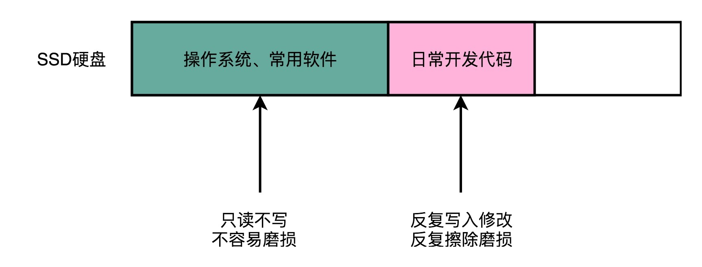
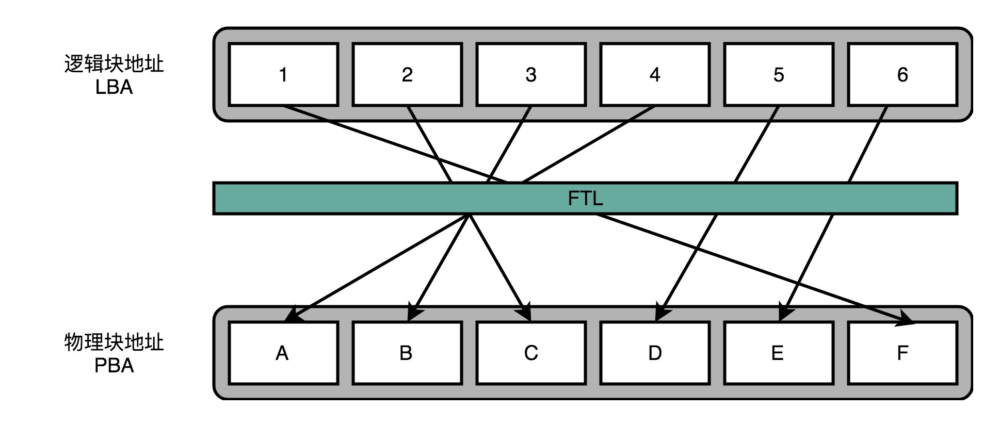
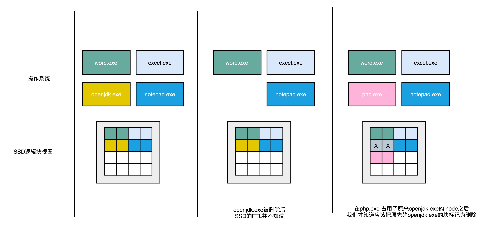
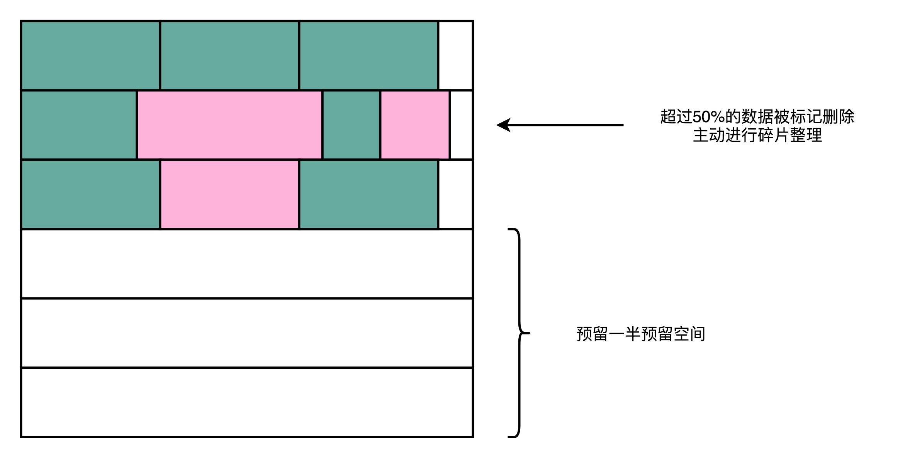

---
date: "2019-06-23"
---  
      
# 47 | SSD硬盘（下）：如何完成性能优化的KPI？
如果你平时用的是Windows电脑，你会发现，用了SSD的系统盘，就不能用磁盘碎片整理功能。这是因为，一旦主动去运行磁盘碎片整理功能，就会发生一次块的擦除，对应块的寿命就少了一点点。这个SSD的擦除寿命的问题，不仅会影响像磁盘碎片整理这样的功能，其实也很影响我们的日常使用。

我们的操作系统上，并没有SSD硬盘上各个块目前已经擦写的情况和寿命，所以它对待SSD硬盘和普通的机械硬盘没有什么区别。

我们日常使用PC进行软件开发的时候，会先在硬盘上装上操作系统和常用软件，比如Office，或者工程师们会装上VS Code、WebStorm这样的集成开发环境。这些软件所在的块，写入一次之后，就不太会擦除了，所以就只有读的需求。

一旦开始开发，我们就会不断添加新的代码文件，还会不断修改已经有的代码文件。因为SSD硬盘没有覆写（Override）的功能，所以，这个过程中，其实我们是在反复地写入新的文件，然后再把原来的文件标记成逻辑上删除的状态。等SSD里面空的块少了，我们会用“垃圾回收”的方式，进行擦除。这样，我们的擦除会反复发生在这些用来存放数据的地方。

有一天，这些块的擦除次数到了，变成了坏块。但是，我们安装操作系统和软件的地方还没有坏，而这块硬盘的可以用的容量却变小了。

<!-- [[[read_end]]] -->

## 磨损均衡、TRIM和写入放大效应

### FTL和磨损均衡

那么，我们有没有什么办法，不让这些坏块那么早就出现呢？我们能不能，匀出一些存放操作系统的块的擦写次数，给到这些存放数据的地方呢？

相信你一定想到了，其实我们要的就是想一个办法，让SSD硬盘各个块的擦除次数，均匀分摊到各个块上。这个策略呢，就叫作**磨损均衡**（Wear-Leveling）。实现这个技术的核心办法，和我们前面讲过的虚拟内存一样，就是添加一个间接层。这个间接层，就是我们上一讲给你卖的那个关子，就是FTL这个**闪存转换层**。

就像在管理内存的时候，我们通过一个页表映射虚拟内存页和物理页一样，在FTL里面，存放了**逻辑块地址**（Logical Block Address，简称LBA）到**物理块地址**（Physical Block Address，简称PBA）的映射。

操作系统访问的硬盘地址，其实都是逻辑地址。只有通过FTL转换之后，才会变成实际的物理地址，找到对应的块进行访问。操作系统本身，不需要去考虑块的磨损程度，只要和操作机械硬盘一样来读写数据就好了。

操作系统所有对于SSD硬盘的读写请求，都要经过FTL。FTL里面又有逻辑块对应的物理块，所以FTL能够记录下来，每个物理块被擦写的次数。如果一个物理块被擦写的次数多了，FTL就可以将这个物理块，挪到一个擦写次数少的物理块上。但是，逻辑块不用变，操作系统也不需要知道这个变化。

这也是我们在设计大型系统中的一个典型思路，也就是各层之间是隔离的，操作系统不需要考虑底层的硬件是什么，完全交由硬件的控制电路里面的FTL，来管理对于实际物理硬件的写入。

### TRIM指令的支持

不过，操作系统不去关心实际底层的硬件是什么，在SSD硬盘的使用上，也会带来一个问题。这个问题就是，操作系统的逻辑层和SSD的逻辑层里的块状态，是不匹配的。

我们在操作系统里面去删除一个文件，其实并没有真的在物理层面去删除这个文件，只是在文件系统里面，把对应的inode里面的元信息清理掉，这代表这个inode还可以继续使用，可以写入新的数据。这个时候，实际物理层面的对应的存储空间，在操作系统里面被标记成可以写入了。

所以，其实我们日常的文件删除，都只是一个操作系统层面的逻辑删除。这也是为什么，很多时候我们不小心删除了对应的文件，我们可以通过各种恢复软件，把数据找回来。同样的，这也是为什么，如果我们想要删除干净数据，需要用各种“文件粉碎”的功能才行。

这个删除的逻辑在机械硬盘层面没有问题，因为文件被标记成可以写入，后续的写入可以直接覆写这个位置。但是，在SSD硬盘上就不一样了。我在这里放了一张详细的示意图。我们下面一起来看看具体是怎么回事儿。

一开始，操作系统里面有好几个文件，不同的文件我用不同的颜色标记出来了。下面的SSD的逻辑块里面占用的页，我们也用同样的颜色标记出来文件占用的对应页。

当我们在操作系统里面，删除掉一个刚刚下载的文件，比如标记成黄色 openjdk.exe 这样一个jdk的安装文件，在操作系统里面，对应的inode里面，就没有文件的元信息。

但是，这个时候，我们的SSD的逻辑块层面，其实并不知道这个事情。所以在，逻辑块层面，openjdk.exe 仍然是占用了对应的空间。对应的物理页，也仍然被认为是被占用了的。

这个时候，如果我们需要对SSD进行垃圾回收操作，openjdk.exe 对应的物理页，仍然要在这个过程中，被搬运到其他的Block里面去。只有当操作系统，再在刚才的inode里面写入数据的时候，我们才会知道原来的些黄色的页，其实都已经没有用了，我们才会把它标记成废弃掉。

所以，在使用SSD的硬盘情况下，你会发现，操作系统对于文件的删除，SSD硬盘其实并不知道。这就导致，我们为了磨损均衡，很多时候在都在搬运很多已经删除了的数据。这就会产生很多不必要的数据读写和擦除，既消耗了SSD的性能，也缩短了SSD的使用寿命。

为了解决这个问题，现在的操作系统和SSD的主控芯片，都支持**TRIM命令。**这个命令可以在文件被删除的时候，让操作系统去通知SSD硬盘，对应的逻辑块已经标记成已删除了。现在的SSD硬盘都已经支持了TRIM命令。无论是Linux、Windows还是MacOS，这些操作系统也都已经支持了TRIM命令了。

### 写入放大

其实，TRIM命令的发明，也反应了一个使用SSD硬盘的问题，那就是，SSD硬盘容易越用越慢。

当SSD硬盘的存储空间被占用得越来越多，每一次写入新数据，我们都可能没有足够的空白。我们可能不得不去进行垃圾回收，合并一些块里面的页，然后再擦除掉一些页，才能匀出一些空间来。

这个时候，从应用层或者操作系统层面来看，我们可能只是写入了一个4KB或者4MB的数据。但是，实际通过FTL之后，我们可能要去搬运8MB、16MB甚至更多的数据。

我们通过“**实际的闪存写入的数据量 / 系统通过FTL写入的数据量 = 写入放大**”，可以得到，写入放大的倍数越多，意味着实际的SSD性能也就越差，会远远比不上实际SSD硬盘标称的指标。

而解决写入放大，需要我们在后台定时进行垃圾回收，在硬盘比较空闲的时候，就把搬运数据、擦除数据、留出空白的块的工作做完，而不是等实际数据写入的时候，再进行这样的操作。

## AeroSpike：如何最大化SSD的使用效率？

讲到这里，相信你也发现了，想要把SSD硬盘用好，其实没有那么简单。如果我们只是简单地拿一块SSD硬盘替换掉原来的HDD硬盘，而不是从应用层面考虑任何SSD硬盘特性的话，我们多半还是没法获得想要的性能提升。

不过，既然清楚了SSD硬盘的各种特性，我们就可以依据这些特性，来设计我们的应用。接下来，我就带你一起看一看，AeroSpike这个专门针对SSD硬盘特性设计的Key-Value数据库（键值对数据库），是怎么利用这些物理特性的。

首先，AeroSpike操作SSD硬盘，并没有通过操作系统的文件系统。而是直接操作SSD里面的块和页。因为操作系统里面的文件系统，对于KV数据库来说，只是让我们多了一层间接层，只会降低性能，对我们没有什么实际的作用。

其次，AeroSpike在读写数据的时候，做了两个优化。在写入数据的时候，AeroSpike尽可能去写一个较大的数据块，而不是频繁地去写很多小的数据块。这样，硬盘就不太容易频繁出现磁盘碎片。并且，一次性写入一个大的数据块，也更容易利用好顺序写入的性能优势。AeroSpike写入的一个数据块，是128KB，远比一个页的4KB要大得多。

另外，在读取数据的时候，AeroSpike倒是可以读取512字节（Bytes）这样的小数据。因为SSD的随机读取性能很好，也不像写入数据那样有擦除寿命问题。而且，很多时候我们读取的数据是键值对里面的值的数据，这些数据要在网络上传输。如果一次性必须读出比较大的数据，就会导致我们的网络带宽不够用。

因为AeroSpike是一个对于响应时间要求很高的实时KV数据库，如果出现了严重的写放大效应，会导致写入数据的响应时间大幅度变长。所以AeroSpike做了这样几个动作：

第一个是持续地进行磁盘碎片整理。AeroSpike用了所谓的高水位（High Watermark）算法。其实这个算法很简单，就是一旦一个物理块里面的数据碎片超过50\%，就把这个物理块搬运压缩，然后进行数据擦除，确保磁盘始终有足够的空间可以写入。

第二个是在AeroSpike给出的最佳实践中，为了保障数据库的性能，建议你只用到SSD硬盘标定容量的一半。也就是说，我们人为地给SSD硬盘预留了50\%的预留空间，以确保SSD硬盘的写放大效应尽可能小，不会影响数据库的访问性能。

正是因为做了这种种的优化，在NoSQL数据库刚刚兴起的时候，AeroSpike的性能把Cassandra、MongoDB这些数据库远远甩在身后，和这些数据库之间的性能差距，有时候会到达一个数量级。这也让AeroSpike成为了当时高性能KV数据库的标杆。你可以看一看InfoQ出的这个[Benchmark](https://www.infoq.com/news/2013/04/NoSQL-Benchmark/)，里面有2013年的时候，这几个NoSQL数据库巨大的性能差异。

## 总结延伸

好了，现在让我们一起来总结一下今天的内容。

因为SSD硬盘的使用寿命，受限于块的擦除次数，所以我们需要通过一个磨损均衡的策略，来管理SSD硬盘的各个块的擦除次数。我们通过在逻辑块地址和物理块地址之间，引入FTL这个映射层，使得操作系统无需关心物理块的擦写次数，而是由FTL里的软件算法，来协调到底每一次写入应该磨损哪一块。

除了磨损均衡之外，操作系统和SSD硬件的特性还有一个不匹配的地方。那就是，操作系统在删除数据的时候，并没有真的删除物理层面的数据，而只是修改了inode里面的数据。这个“伪删除”，使得SSD硬盘在逻辑和物理层面，都没有意识到有些块其实已经被删除了。这就导致在垃圾回收的时候，会浪费很多不必要的读写资源。

SSD这个需要进行垃圾回收的特性，使得我们在写入数据的时候，会遇到写入放大。明明我们只是写入了4MB的数据，可能在SSD的硬件层面，实际写入了8MB、16MB乃至更多的数据。

针对这些特性，AeroSpike，这个专门针对SSD硬盘特性的KV数据库，设计了很多的优化点，包括跳过文件系统直写硬盘、写大块读小块、用高水位算法持续进行磁盘碎片整理，以及只使用SSD硬盘的一半空间。这些策略，使得AeroSpike的性能，在早年间远远超过了Cassandra等其他NoSQL数据库。

可以看到，针对硬件特性设计的软件，才能最大化发挥我们的硬件性能。

## 推荐阅读

如果你想要基于SSD硬盘本身的特性来设计开发你的系统，我推荐你去读一读AeroSpike的这个[PPT](https://www.slideshare.net/AerospikeDB/getting-the-most-out-of-your-flashssds)。AeroSpike是市面上最优秀的KV数据库之一，通过深入地利用了SSD本身的硬件特性，最大化提升了作为一个KV数据库的性能。真正在进行系统软件开发的时候，了解硬件是必不可少的一个环节。

## 课后思考

在SSD硬盘的价格大幅度下降了之后，LFS，也就是Log-Structured File System，在业界出现了第二春。你可以去了解一下什么是LFS，以及为什么LFS特别适合SSD硬盘。

欢迎在留言区分享你了解到的信息，和大家一起交流。如果有收获，你可以把这篇文章分享给你的朋友。