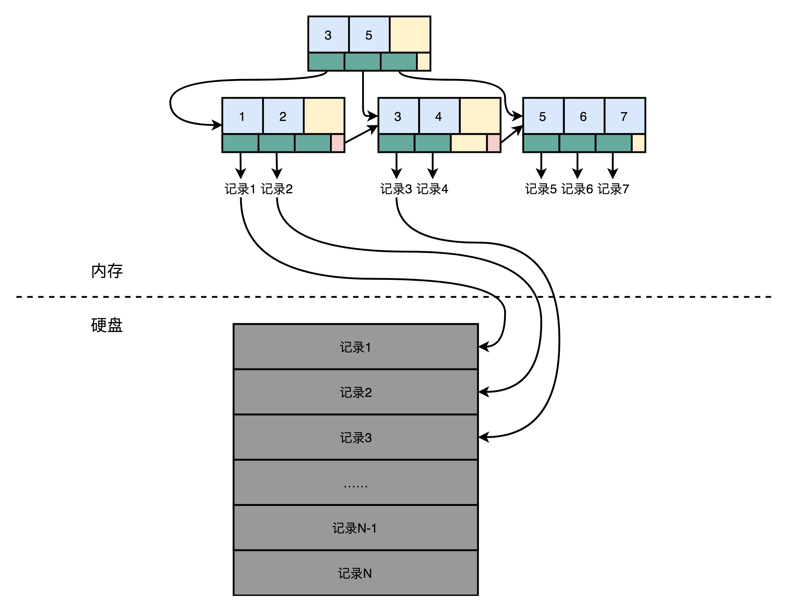
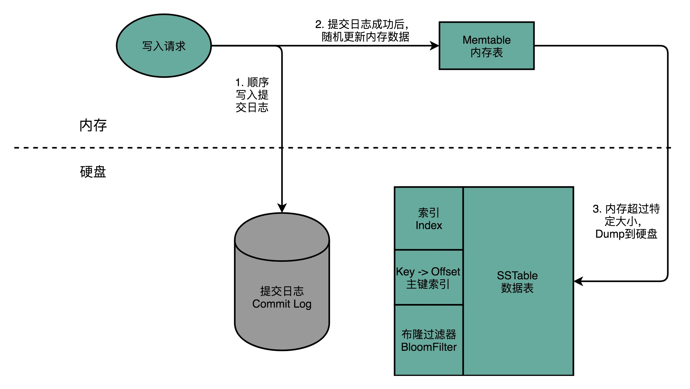
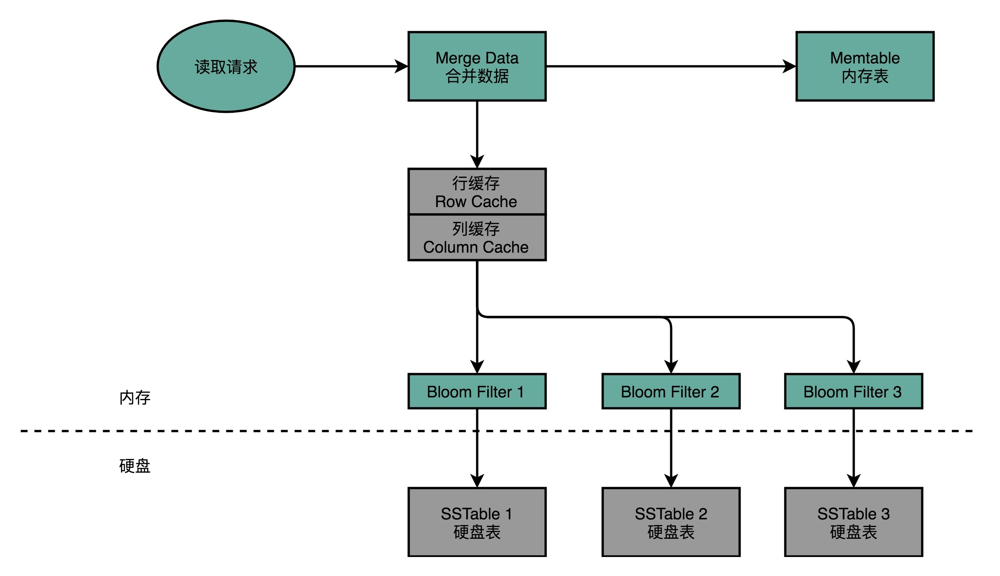

---
date: "2019-06-23"
---  
      
# 53 | 设计大型DMP系统（下）：SSD拯救了所有的DBA
上一讲里，根据DMP系统的各个应用场景，我们从抽象的原理层面，选择了AeroSpike作为KV数据库，Kafka作为数据管道，Hadoop/Hive来作为数据仓库。

不过呢，肯定有不信邪的工程师会问，为什么MongoDB，甚至是MySQL这样的文档数据库或者传统的关系型数据库不适用呢？为什么不能通过优化SQL、添加缓存这样的调优手段，解决这个问题呢？

今天DMP的下半场，我们就从数据库实现的原理，一起来看一看，这背后的原因。如果你能弄明白今天的这些更深入、更细节的原理，对于什么场景使用什么数据库，就会更加胸有成竹，而不是只有跑了大量的性能测试才知道。下次做数据库选型的时候，你就可以“以理服人”了。

## 关系型数据库：不得不做的随机读写

我们先来想一想，如果现在让你自己写一个最简单的关系型数据库，你的数据要怎么存放在硬盘上？

最简单最直观的想法是，用一个CSV文件格式。一个文件就是一个数据表。文件里面的每一行就是这个表里面的一条记录。如果要修改数据库里面的某一条记录，那么我们要先找到这一行，然后直接去修改这一行的数据。读取数据也是一样的。

要找到这样数据，最笨的办法自然是一行一行读，也就是遍历整个CSV文件。不过这样的话，相当于随便读取任何一条数据都要扫描全表，太浪费硬盘的吞吐量了。那怎么办呢？我们可以试试给这个CSV文件加一个索引。比如，给数据的行号加一个索引。如果你学过数据库原理或者算法和数据结构，那你应该知道，通过B+树多半是可以来建立这样一个索引的。

<!-- [[[read_end]]] -->

索引里面没有一整行的数据，只有一个映射关系，这个映射关系可以让行号直接从硬盘的某个位置去读。所以，索引比起数据小很多。我们可以把索引加载到内存里面。即使不在内存里面，要找数据的时候快速遍历一下整个索引，也不需要读太多的数据。

加了索引之后，我们要读取特定的数据，就不用去扫描整个数据表文件了。直接从特定的硬盘位置，就可以读到想要的行。索引不仅可以索引行号，还可以索引某个字段。我们可以创建很多个不同的独立的索引。写SQL的时候，where子句后面的查询条件可以用到这些索引。

不过，这样的话，写入数据的时候就会麻烦一些。我们不仅要在数据表里面写入数据，对于所有的索引也都需要进行更新。这个时候，写入一条数据就要触发好几个随机写入的更新。

在这样一个数据模型下，查询操作很灵活。无论是根据哪个字段查询，只要有索引，我们就可以通过一次随机读，很快地读到对应的数据。但是，这个灵活性也带来了一个很大的问题，那就是无论干点什么，都有大量的随机读写请求。而随机读写请求，如果请求最终是要落到硬盘上，特别是HDD硬盘的话，我们就很难做到高并发了。毕竟HDD硬盘只有100左右的QPS。

而这个随时添加索引，可以根据任意字段进行查询，这样表现出的灵活性，又是我们的DMP系统里面不太需要的。DMP的KV数据库主要的应用场景，是根据主键的随机查询，不需要根据其他字段进行筛选查询。数据管道的需求，则只需要不断追加写入和顺序读取就好了。即使进行数据分析的数据仓库，通常也不是根据字段进行数据筛选，而是全量扫描数据进行分析汇总。

后面的两个场景还好说，大不了我们让程序去扫描全表或者追加写入。但是，在KV数据库这个需求上，刚才这个最简单的关系型数据库的设计，就会面临大量的随机写入和随机读取的挑战。

所以，在实际的大型系统中，大家都会使用专门的分布式KV数据库，来满足这个需求。那么下面，我们就一起来看一看，Facebook开源的Cassandra的数据存储和读写是怎么做的，这些设计是怎么解决高并发的随机读写问题的。

## Cassandra：顺序写和随机读

### Cassandra的数据模型

作为一个分布式的KV数据库，Cassandra的键一般被称为Row Key。其实就是一个16到36个字节的字符串。每一个Row Key对应的值其实是一个哈希表，里面可以用键值对，再存入很多你需要的数据。

Cassandra本身不像关系型数据库那样，有严格的Schema，在数据库创建的一开始就定义好了有哪些列（Column）。但是，它设计了一个叫作列族（Column Family）的概念，我们需要把经常放在一起使用的字段，放在同一个列族里面。比如，DMP里面的人口属性信息，我们可以把它当成是一个列族。用户的兴趣信息，可以是另外一个列族。这样，既保持了不需要严格的Schema这样的灵活性，也保留了可以把常常一起使用的数据存放在一起的空间局部性。

往Cassandra的里面读写数据，其实特别简单，就好像是在一个巨大的分布式的哈希表里面写数据。我们指定一个Row Key，然后插入或者更新这个Row Key的数据就好了。

### Cassandra的写操作

Cassandra只有顺序写入，没有随机写入

Cassandra解决随机写入数据的解决方案，简单来说，就叫作“不随机写，只顺序写”。对于Cassandra数据库的写操作，通常包含两个动作。第一个是往磁盘上写入一条提交日志（Commit Log）。另一个操作，则是直接在内存的数据结构上去更新数据。后面这个往内存的数据结构里面的数据更新，只有在提交日志写成功之后才会进行。每台机器上，都有一个可靠的硬盘可以让我们去写入提交日志。写入提交日志都是顺序写（Sequential Write），而不是随机写（Random Write），这使得我们最大化了写入的吞吐量。

如果你不明白这是为什么，可以回到[第47讲](https://time.geekbang.org/column/article/118191)，看看硬盘的性能评测。无论是HDD硬盘还是SSD硬盘，顺序写入都比随机写入要快得多。

内存的空间比较有限，一旦内存里面的数据量或者条目超过一定的限额，Cassandra就会把内存里面的数据结构dump到硬盘上。这个Dump的操作，也是顺序写而不是随机写，所以性能也不会是一个问题。除了Dump的数据结构文件，Cassandra还会根据row key来生成一个索引文件，方便后续基于索引来进行快速查询。

随着硬盘上的Dump出来的文件越来越多，Cassandra会在后台进行文件的对比合并。在很多别的KV数据库系统里面，也有类似这种的合并动作，比如AeroSpike或者Google的BigTable。这些操作我们一般称之为Compaction。合并动作同样是顺序读取多个文件，在内存里面合并完成，再Dump出来一个新的文件。整个操作过程中，在硬盘层面仍然是顺序读写。

### Cassandra的读操作

Cassandra的读请求，会通过缓存、BloomFilter进行两道过滤，尽可能避免数据请求命中硬盘

当我们要从Cassandra读数据的时候，会从内存里面找数据，再从硬盘读数据，然后把两部分的数据合并成最终结果。这些硬盘上的文件，在内存里面会有对应的Cache，只有在Cache里面找不到，我们才会去请求硬盘里面的数据。

如果不得不访问硬盘，因为硬盘里面可能Dump了很多个不同时间点的内存数据的快照。所以，找数据的时候，我们也是按照时间从新的往旧的里面找。

这也就带来另外一个问题，我们可能要查询很多个Dump文件，才能找到我们想要的数据。所以，Cassandra在这一点上又做了一个优化。那就是，它会为每一个Dump的文件里面所有Row Key生成一个BloomFilter，然后把这个BloomFilter放在内存里面。这样，如果想要查询的Row Key在数据文件里面不存在，那么99\%以上的情况下，它会被BloomFilter过滤掉，而不需要访问硬盘。

这样，只有当数据在内存里面没有，并且在硬盘的某个特定文件上的时候，才会触发一次对于硬盘的读请求。

## SSD：DBA们的大救星

Cassandra是Facebook在2008年开源的。那个时候，SSD硬盘还没有那么普及。可以看到，它的读写设计充分考虑了硬件本身的特性。在写入数据进行持久化上，Cassandra没有任何的随机写请求，无论是Commit Log还是Dump，全部都是顺序写。

在数据读的请求上，最新写入的数据都会更新到内存。如果要读取这些数据，会优先从内存读到。这相当于是一个使用了LRU的缓存机制。只有在万般无奈的情况下，才会有对于硬盘的随机读请求。即使在这样的情况下，Cassandra也在文件之前加了一层BloomFilter，把本来因为Dump文件带来的需要多次读硬盘的问题，简化成多次内存读和一次硬盘读。

这些设计，使得Cassandra即使是在HDD硬盘上，也能有不错的访问性能。因为所有的写入都是顺序写或者写入到内存，所以，写入可以做到高并发。HDD硬盘的吞吐率还是很不错的，每秒可以写入100MB以上的数据，如果一条数据只有1KB，那么10万的WPS（Writes per seconds）也是能够做到的。这足够支撑我们DMP期望的写入压力了。

而对于数据的读，就有一些挑战了。如果数据读请求有很强的局部性，那我们的内存就能搞定DMP需要的访问量。

但是，问题就出在这个局部性上。DMP的数据访问分布，其实是缺少局部性的。你仔细想一想DMP的应用场景就明白了。DMP里面的Row Key都是用户的唯一标识符。普通用户的上网时长怎么会有局部性呢？每个人上网的时间和访问网页的次数就那么多。上网多的人，一天最多也就24小时。大部分用户一天也要上网2～3小时。我们没办法说，把这些用户的数据放在内存里面，那些用户不放。

DMP系统，只有根据国家和时区不同有比较明显的局部性，是局部性不强的系统

那么，我们可不可能有一定的时间局部性呢？如果是Facebook那样的全球社交网络，那可能还有一定的时间局部性。毕竟不同国家的人的时区不一样。我们可以说，在印度人民的白天，把印度人民的数据加载到内存里面，美国人民的数据就放在硬盘上。到了印度人民的晚上，再把美国人民的数据换到内存里面来。

如果你的主要业务是在国内，那这个时间局部性就没有了。大家的上网高峰时段，都是在早上上班路上、中午休息的时候以及晚上下班之后的时间，没有什么区分度。

面临这个情况，如果你们的CEO或者CTO问你，是不是可以通过优化程序来解决这个问题？如果你没有仔细从数据分布和原理的层面思考这个问题，而直接一口答应下来，那你可能之后要头疼了，因为这个问题很有可能是搞不定的。

因为缺少了时间局部性，我们内存的缓存能够起到的作用就很小了，大部分请求最终还是要落到HDD硬盘的随机读上。但是，HDD硬盘的随机读的性能太差了，我们在[第45讲](https://time.geekbang.org/column/article/116104)看过，也就是100QPS左右。而如果全都放内存，那就太贵了，成本在HDD硬盘100倍以上。

不过，幸运的是，从2010年开始，SSD硬盘的大规模商用帮助我们解决了这个问题。它的价格在HDD硬盘的10倍，但是随机读的访问能力在HDD硬盘的百倍以上。也就是说，用上了SSD硬盘，我们可以用1/10的成本获得和内存同样的QPS。同样的价格的SSD硬盘，容量则是内存的几十倍，也能够满足我们的需求，用较低的成本存下整个互联网用户信息。

不夸张地说，过去十年的“大数据”“高并发”“千人千面”，有一半的功劳应该归在让SSD容量不断上升、价格不断下降的硬盘产业上。

回到我们看到的Cassandra的读写设计，你会发现，Cassandra的写入机制完美匹配了我们在第46和47讲所说的SSD硬盘的优缺点。

在数据写入层面，Cassandra的数据写入都是Commit Log的顺序写入，也就是不断地在硬盘上往后追加内容，而不是去修改现有的文件内容。一旦内存里面的数据超过一定的阈值，Cassandra又会完整地Dump一个新文件到文件系统上。这同样是一个追加写入。

数据的对比和紧凑化（Compaction），同样是读取现有的多个文件，然后写一个新的文件出来。写入操作只追加不修改的特性，正好天然地符合SSD硬盘只能按块进行擦除写入的操作。在这样的写入模式下，Cassandra用到的SSD硬盘，不需要频繁地进行后台的Compaction，能够最大化SSD硬盘的使用寿命。这也是为什么，Cassandra在SSD硬盘普及之后，能够获得进一步快速发展。

## 总结延伸

好了，关于DMP和存储器的内容，讲到这里就差不多了。希望今天的这一讲，能够让你从Cassandra的数据库实现的细节层面，彻底理解怎么运用好存储器的性能特性和原理。

传统的关系型数据库，我们把一条条数据存放在一个地方，同时再把索引存放在另外一个地方。这样的存储方式，其实很方便我们进行单次的随机读和随机写，数据的存储也可以很紧凑。但是问题也在于此，大部分的SQL请求，都会带来大量的随机读写的请求。这使得传统的关系型数据库，其实并不适合用在真的高并发的场景下。

我们的DMP需要的访问场景，其实没有复杂的索引需求，但是会有比较高的并发性。我带你一看了Facebook开源的Cassandra这个分布式KV数据库的读写设计。通过在追加写入Commit Log和更新内存，Cassandra避开了随机写的问题。内存数据的Dump和后台的对比合并，同样也都避开了随机写的问题，使得Cassandra的并发写入性能极高。

在数据读取层面，通过内存缓存和BloomFilter，Cassandra已经尽可能地减少了需要随机读取硬盘里面数据的情况。不过挑战在于，DMP系统的局部性不强，使得我们最终的随机读的请求还是要到硬盘上。幸运的是，SSD硬盘在数据海量增长的那几年里价格不断下降，使得我们最终通过SSD硬盘解决了这个问题。

而SSD硬盘本身的擦除后才能写入的机制，正好非常适合Cassandra的数据读写模式，最终使得Cassandra在SSD硬盘普及之后得到了更大的发展。

## 推荐阅读

今天的推荐阅读，是一篇相关的论文。我推荐你去读一读[Cassandra \- A Decentralized Structured Storage System](https://www.cs.cornell.edu/projects/ladis2009/papers/lakshman-ladis2009.pdf)。读完这篇论文，一方面你会对分布式KV数据库的设计原则有所了解，了解怎么去做好数据分片、故障转移、数据复制这些机制；另一方面，你可以看到基于内存和硬盘的不同存储设备的特性，Cassandra是怎么有针对性地设计数据读写和持久化的方式的。

## 课后思考

除了MySQL这样的关系型数据库，还有Cassandra这样的分布式KV数据库。实际上，在海量数据分析的过程中，还有一种常见的数据库，叫作列式存储的OLAP的数据库，比如[Clickhouse](https://clickhouse.yandex/)。你可以研究一下，Clickhouse这样的数据库里面的数据是怎么存储在硬盘上的。

欢迎把你研究的结果写在留言区，和大家一起分享、交流。如果觉得有帮助，你也可以把这篇文章分享给你的朋友，和他一起讨论、学习。