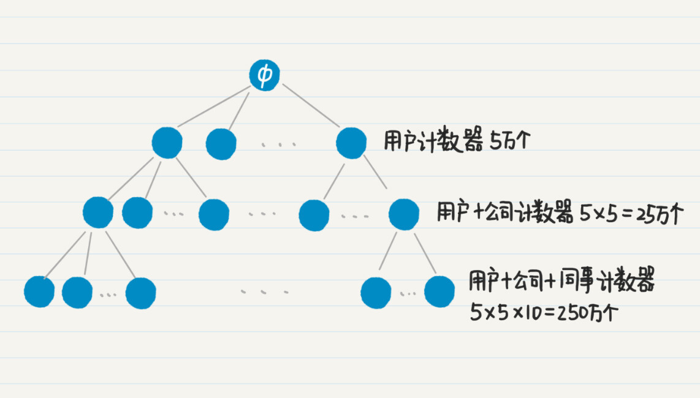
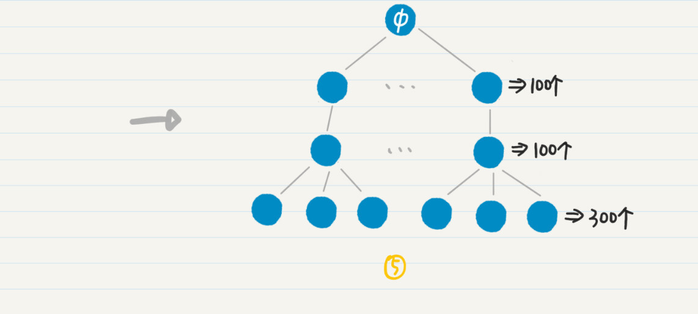
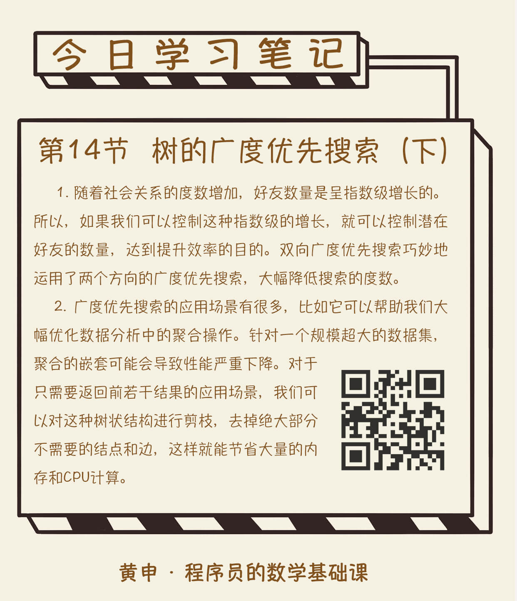

---
date: "2019-06-23"
---  
      
# 14 | 树的广度优先搜索（下）：为什么双向广度优先搜索的效率更高？
你好，我是黄申。

上一讲，我们通过社交好友的关系，介绍了为什么需要广度优先策略，以及如何通过队列来实现它。有了广度优先搜索，我们就可以知道某个用户的一度、二度、三度等好友是谁。不过，在社交网络中，还有一个经常碰到的问题，那就是给定两个用户，如何确定他们之间的关系有多紧密？

最直接的方法是，使用这两人是几度好友来衡量他们关系的紧密程度。今天，我就这个问题，来聊聊广度优先策略的一种扩展：双向广度优先搜索，以及这种策略在工程中的应用。

## 如何更高效地求两个用户间的最短路径？

基本的做法是，从其中一个人出发，进行广度优先搜索，看看另一个人是否在其中。如果不幸的话，两个人相距六度，那么即使是广度优先搜索，同样要达到万亿级的数量。

那究竟该如何更高效地求得两个用户的最短路径呢？我们先看看，影响效率的问题在哪里？很显然，随着社会关系的度数增加，好友数量是呈指数级增长的。所以，如果我们可以控制这种指数级的增长，那么就可以控制潜在好友的数量，达到提升效率的目的。

如何控制这种增长呢？我这里介绍一种“**双向广度优先搜索**”。它巧妙地运用了两个方向的广度优先搜索，大幅降低了搜索的度数。现在我就带你看下，这个方法的核心思想。

假设有两个人\$a\$、\$b\$。我们首先从\$a\$出发，进行广度优先搜索，记录\$a\$的所有一度好友\$a\_\{1\}\$，然后看点\$b\$是否出现在集合\$a\_\{1\}\$中。如果没有，就再从\$b\$出发，进行广度优先搜索，记录所有一度好友\$b\_\{1\}\$，然后看\$a\$和\$a\_\{1\}\$是否出现在\$b\$和\$b\_\{1\}\$的并集中。如果没有，就回到\$a\$，继续从它出发的广度优先搜索，记录所有二度好友\$a\_\{2\}\$，然后看\$b\$和\$b\_\{1\}\$是否出现在\$a\$、\$a\_\{1\}\$和\$a\_\{2\}\$三者的并集中。如果没有，就回到\$b\$，继续从它出发的广度优先搜索。如此轮流下去，直到找到\$a\$的好友和\$b\$的好友的交集。

<!-- [[[read_end]]] -->

如果有交集，就表明这个交集里的点到\$a\$和\$b\$都是通路。我们假设\$c\$在这个交集中，那么把\$a\$到\$c\$的通路长度和\$b\$到\$c\$的通路长度相加，得到的就是从\$a\$到\$b\$的最短通路长（这个命题可以用反证法证明），也就是两者为几度好友。这个过程略有点复杂，我画了一张图帮助你来理解。


思路你应该都清楚了，现在我们来看看如何用代码来实现。

要想实现双向广度优先搜索，首先我们要把结点类Node稍作修改，增加一个变量degrees。这个变量是HashMap类型，用于存放从不同用户出发，到当前用户是第几度结点。比如说，当前结点是4，从结点1到结点4是3度，结点2到结点4是2度，结点3到结点4是4度，那么结点4的degrees变量存放的就是如下映射：


有了变量degrees，我们就能随时知道某个点和两个出发点各自相距多少。所以，在发现交集之后，根据交集中的点，和两个出发点各自相距多少，就能很快地算出最短通路的长度。理解了这点之后，我们在原有的Node结点内增加degrees变量的定义和初始化。

```
    public class Node {
    		......
    		public HashMap<Integer, Integer> degrees;		// 存放从不同用户出发，当前用户结点是第几度
    		
    		// 初始化结点
    		public Node(int id) {
    			......
    			degrees = new HashMap<>();
    			degrees.put(id, 0);
    		}
    	}
    
    

```

为了让双向广度优先搜索的代码可读性更好，我们可以先实现两个模块化的函数：getNextDegreeFriend和hasOverlap。函数getNextDegreeFriend是根据给定的队列，查找和起始点相距度数为指定值的所有好友。而函数hasOverlap用来判断两个集合是不是有交集。有了这些模块化的函数，双向广度优先搜索的代码就更直观了。

在函数一开始，我们先进行边界条件判断。

```
    /**
    * @Description:	通过双向广度优先搜索，查找两人之间最短通路的长度
    * @param user_nodes-用户的结点；user_id_a-用户a的ID；user_id_b-用户b的ID
    * @return void
    */
    	public static int bi_bfs(Node[] user_nodes, int user_id_a, int user_id_b) {
    		
    		if (user_id_a > user_nodes.length || user_id_b > user_nodes.length) return -1;	// 防止数组越界的异常
    		
    		if (user_id_a == user_id_b) return 0;		// 两个用户是同一人，直接返回0
    

```

由于同时从两个用户的结点出发，对于所有有两条搜索的路径，我们都需要初始化两个用于广度优先搜索的队列，以及两个用于存放已经被访问结点的HashSet。

```
      Queue<Integer> queue_a = new LinkedList<Integer>();	// 队列a，用于从用户a出发的广度优先搜索
    		Queue<Integer> queue_b = new LinkedList<Integer>();	// 队列b，用于从用户b出发的广度优先搜索
    		
    		queue_a.offer(user_id_a);		// 放入初始结点
    		HashSet<Integer> visited_a = new HashSet<>();	// 存放已经被访问过的结点，防止回路
    		visited_a.add(user_id_a);
    		
    		queue_b.offer(user_id_b);		// 放入初始结点
    		HashSet<Integer> visited_b = new HashSet<>();	// 存放已经被访问过的结点，防止回路
    		visited_b.add(user_id_b);
    		
    

```

接下来要做的是，从两个结点出发，沿着各自的方向，每次广度优先搜索一度，并查找是不是存在重叠的好友。

```
    int degree_a = 0, degree_b = 0, max_degree = 20;		// max_degree的设置，防止两者之间不存在通路的情况
    
    while ((degree_a + degree_b) < max_degree) {
    			degree_a ++;
    			getNextDegreeFriend(user_id_a, user_nodes, queue_a, visited_a, degree_a);
    	// 沿着a出发的方向，继续广度优先搜索degree + 1的好友
    			if (hasOverlap(visited_a, visited_b)) return (degree_a + degree_b);
    	// 判断到目前为止，被发现的a的好友，和被发现的b的好友，两个集合是否存在交集
    			
    			degree_b ++;
    			getNextDegreeFriend(user_id_b, user_nodes, queue_b, visited_b, degree_b);
    	// 沿着b出发的方向，继续广度优先搜索degree + 1的好友
    			if (hasOverlap(visited_a, visited_b)) return (degree_a + degree_b);
    	// 判断到目前为止，被发现的a的好友，和被发现的b的好友，两个集合是否存在交集
    			
    		}
      
    		return -1;			
        // 广度优先搜索超过max_degree之后，仍然没有发现a和b的重叠，认为没有通路
    		
    	}
    

```

你可以同时实现单向广度优先搜索和双向广度优先搜索，然后通过实验来比较两者的执行时间，看看哪个更短。如果实验的数据量足够大（比如说结点在1万以上，边在5万以上），你应该能发现，双向的方法对时间和内存的消耗都更少。为什么双向搜索的效率更高呢？我以平均好友度数为4，给你举例讲解。

左边的图表示从结点\$a\$单向搜索走2步，右边的图表示分别从结点\$a\$和\$b\$双向搜索各走1步。很明显，左边的结点有16个，明显多于右边的8个结点。而且，随着每人认识的好友数、搜索路径的增加，这种差距会更加明显。


我们假设每个地球人平均认识100个人，如果两个人相距六度，单向广度优先搜索要遍历100\^6=1万亿左右的人。如果是双向广度优先搜索，那么两边各自搜索的人只有100\^3=100万。

当然，你可能会说，单向广度优先搜索之后查找匹配用户的开销更小啊。的确如此，假设我们要知道结点\$a\$和\$b\$之间的最短路径，单向搜索意味着要在\$a\$的1万亿个好友中查找\$b\$。如果采用双向搜索的策略，从结点\$a\$和\$b\$出发进行广度优先搜索，每个方向会产生100万的好友，那么需要比较这两组100万的好友是否有交集。假设我们使用哈希表来存储\$a\$的1万亿个好友，并把搜索\$b\$是否存在其中的耗时记作x，而把判断两组100万好友是否有交集的耗时记为y，那么通常x\<y。

不过，综合考虑广度优先搜索出来的好友数量，双向广度优先搜索还是更有效。为什么这么说呢？稍后介绍算法复杂度的概念和衡量方法时，我会具体来分析这个例子。

广度优先搜索的应用场景有很多，下面我来说说这种策略的一个应用。

## 如何实现更有效的嵌套型聚合？

广度优先策略可以帮助我们大幅优化数据分析中的聚合操作。聚合是数据分析中一个很常见的操作，它会根据一定的条件把记录聚集成不同的分组，以便我们统计每个分组里的信息。目前，SQL语言中的GROUP BY语句，Python和Spark语言中data frame的groupby函数，Solr的facet查询和Elasticsearch的aggregation查询，都可以实现聚合的功能。

我们可以嵌套使用不同的聚合，获得层级型的统计结果。但是，实际上，针对一个规模超大的数据集，聚合的嵌套可能会导致性能严重下降。这里我来谈谈如何利用广度优先的策略，对这种问题进行优化。

首先，我用一个具体的例子来给你讲讲，什么是多级嵌套的聚合，以及为什么它会产生严重的性能问题。

这里我列举了一个数据表，它描述了一个社交网络中，每个人的职业经历。字段包括项目的ID、用户ID、公司ID和同事的IDs。


对于这张表，我们可以进行三层嵌套的聚集。第一级是根据用户ID来聚，获取每位用户一共参与了多少项目。第二级是根据公司ID来聚，获取每位用户在每家公司参与了多少项目。第三级根据同事ID来聚，获取每位用户在每家公司，和每位同事共同参与了多少项目。最终结果应该是类似下面这样的：

```
    用户u88，总共50个项目（包括在公司c42中的10个，c26中的8个...）
    		在公司c42中，参与10个项目（包括和u120共事的4个，和u99共事的3个...）
    				和u120共同参与4个项目
    				和u99共同参与3个项目
    				和u72共同参与3个项目
    		在公司c26中，参与了8个项目
    				和u145共同参与5个项目
    				和u128共同参与3个项目
    		（用户u88在其他公司的项目...）
    
    用户u66，总共47个项目
    		在公司c28中，参与了16个项目
    		  和u65共同参与了5个项目
    (用户u66的剩余数据...）
    ...		
    （其他用户的数据...）
    

```

为了实现这种嵌套式的聚合统计，你会怎么来设计呢？看起来挺复杂的，其实我们可以用最简单的排列的思想，分别为“每个用户”“每个用户+每个公司”“每个用户+每个公司+每位同事”，生成很多很多的计数器。可是，如果用户的数量非常大，那么这个“很多”就会成为一个可怕的数字。

我们假设这个社交网有5万用户，每位用户平均在5家公司工作过，而用户在每家公司平均有10名共事的同事，那么针对用户的计数器有5万个，针对“每个用户+每个公司”的计数器有25万个，而到了“每个用户+每个公司+每位同事”的计数器，就已经达到250万个了，三个层级总共需要280万计数器。



我们假设一个计数器是4个字节，那么280万个计数器就需要消耗超过10M的内存。对于高并发、低延迟的实时性服务，如果每个请求都要消耗10M内存，很容易就导致服务器崩溃。另外，实时性的服务，往往只需要前若干个结果就足以满足需求了。在这种情况下，完全基于排列的设计就有优化的空间了。

从刚才那张图中，其实我们就能想到一些优化的思路。

对于只需要返回前若干结果的应用场景，我们可以对图中的树状结构进行剪枝，去掉绝大部分不需要的结点和边，这样就能节省大量的内存和CPU计算。

比如，如果我们只需要返回前100个参与项目最多的用户，那么就没有必要按照深度优先的策略，去扩展树中高度为2和3的结点了，而是应该使用广度优先策略，首先找出所有高度为1的结点，根据项目数量进行排序，然后只取出前100个，把计数器的数量从5万个一下子降到100个。

以此类推，我们还可以控制高度为2和3的结点之数量。如果我们只要看前100位用户，每位用户只看排名第一的公司，而每家公司只看合作最多的3名同事，那么最终计数器数量就只有50000+100x5+100x1x10=51500。只有文字还是不太好懂，我画了一张图，帮你理解这个过程。



如果一个项目用到排列组合的思想，我们需要在程序里使用大量的变量，来保存数据或者进行计算，这会导致内存和CPU使用量的急剧增加。在允许的情况下，我们可以考虑使用广度优先策略，对排列组合所生成的树进行优化。这样，我们就可以有效地缩减树中靠近根的结点数量，避免之后树的爆炸性生长。

## 小结

广度优先搜索，相对于深度优先搜索，没有函数的嵌套调用和回溯操作，所以运行速度比较快。但是，随着搜索过程的进行，广度优先需要在队列中存放新遇到的所有结点，因此占用的存储空间通常比深度优先搜索多。

相比之下，深度优先搜索法只保留用于回溯的结点，而扩展完的结点会从栈中弹出并被删除。所以深度优先搜索占用空间相对较少。不过，深度优先搜索的速度比较慢，而并不适合查找结点之间的最短路径这类的应用。



## 思考题

今天所说的双向广度优先比单向广度优先更高效，其实是要基于一个前提条件的。你能否说出，在什么情况下，单向广度优先更高效呢？针对这种情况，又该如何优化双向广度优先呢？

欢迎在留言区交作业，并写下你今天的学习笔记。你可以点击“请朋友读”，把今天的内容分享给你的好友，和他一起精进。