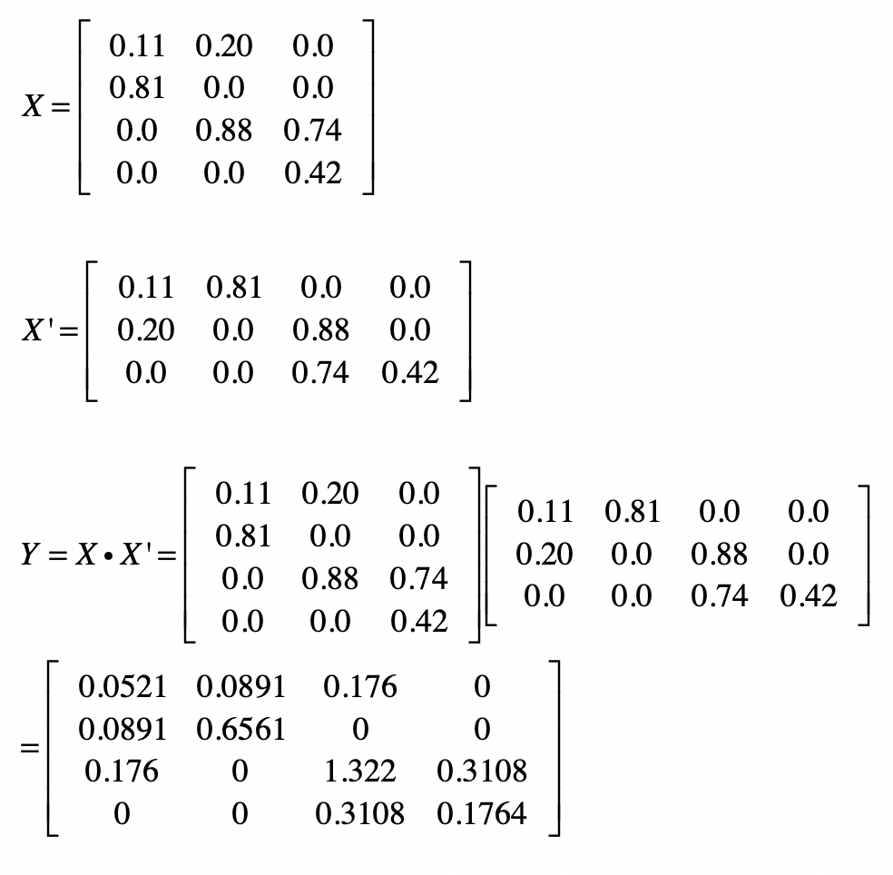
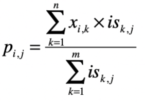
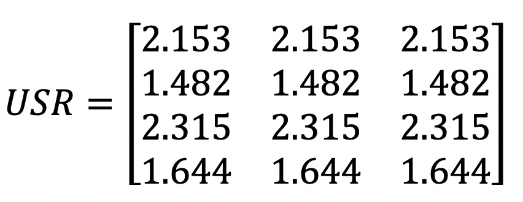
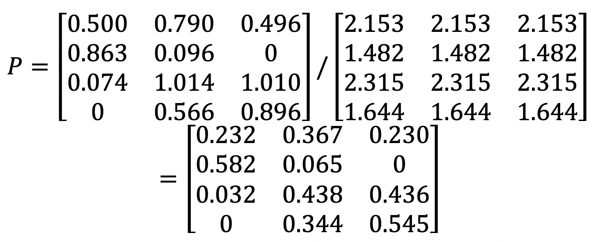

---
date: "2019-06-23"
---  
      
# 49 | 推荐系统（上）：如何实现基于相似度的协同过滤？
你好，我是黄申。

个性化推荐这种技术在各大互联网站点已经普遍使用了，系统会根据用户的使用习惯，主动提出一些建议，帮助他们发现一些可能感兴趣的电影、书籍或者是商品等等。在这方面，最经典的案例应该是美国的亚马逊电子商务网站，它是全球最大的B2C电商网站之一。在公司创立之初，最为出名的就是其丰富的图书品类，以及相应的推荐技术。亚马逊的推荐销售占比可以达到整体销售的30\%左右。可见，对于公司来说，推荐系统也是销售的绝好机会。因此，接下来的两节，我会使用一个经典的数据集，带你进行推荐系统核心模块的设计和实现。

## MovieLens数据集

在开始之前，我们先来认识一个知名的数据集，MovieLens。你可以在它的[主页](http://files.grouplens.org/datasets/movielens/)查看详细的信息。这个数据集最核心的内容是多位用户对不同电影的评分，此外，它也包括了一些电影和用户的属性信息，便于我们研究推荐结果是不是合理。因此，这个数据集经常用来做推荐系统、或者其他机器学习算法的测试集。

时至今日，这个数据集已经延伸出几个不同的版本，有不同的数据规模和更新日期。我这里使用的是一个最新的小规模数据集，包含了600位用户对于9000部电影的约10万条评分，最后更新于2018年9月。你可以在这里下载：<http://files.grouplens.org/datasets/movielens/ml-latest-small.zip>。

<!-- [[[read_end]]] -->

解压了这个zip压缩包之后，你会看到readme文件和四个csv文件（ratings、movies、links和tags）。其中最重要的是ratings，它包含了10万条评分，每条记录有4个字段，包括userId、movieId、rating、timestamp。userId表示每位用户的id，movieId是每部电影的ID，

rating是这位用户对这部电影的评分，取值为0-5分。timestamp是时间戳。而movies包含了电影的主要属性信息，title和genres分别表示电影的标题和类型，一部电影可以属于多种类型。links和tags则包含了电影的其他属性信息。我们的实验主要使用ratings和movies里的数据。

## 设计的整体思路

有了用于实验的数据，接下来就要开始考虑如何设计这个推荐系统。我在第38期讲解了什么是协同过滤推荐算法、基于用户的协同过滤和基于物品的协同过滤。这一节我们就以协同过滤为基础，分别实现基于用户和物品的过滤。

根据协同过滤算法的核心思想，整个系统可以分为三个大的步骤。

第一步，用户评分的标准化。因为有些用户的打分比较宽松，而有些用户打分则比较挑剔。所以，我们需要使用标准化或者归一化，让不同用户的打分具有可比性，这里我会使用**z分数**标准化。

第二步，衡量和其他用户或者物品之间的相似度。我们这里的物品就是电影。在基于用户的过滤中，我们要找到相似的用户。在基于物品的过滤中，我们要找到相似的电影。我这里列出计算用户之间相似度\$us\$和物品之间相似度\$is\$的公式。之前我们讲过，这些都可以通过矩阵操作来实现。


我们以基于用户的过滤为例。假设我们使用夹角余弦来衡量相似度，那么我们就可以采用用户评分的矩阵点乘自身的转置来计算余弦夹角。用户评分的矩阵\$X\$中，每一行是某位用户的行向量，每个分量表示这位用户对某部电影的打分。而矩阵\$X’\$的每一列是某个用户的列向量，每个分量表示用户对某部电影的打分。

我们假设\$XX’\$的结果为矩阵\$Y\$，那么\$y\_\{i,j\}\$就表示用户\$i\$和用户\$j\$这两者喜好度向量的点乘结果，它就是夹角余弦公式中的分子。如果\$i\$等于\$j\$，那么这个计算值也是夹角余弦公式分母的一部分。从矩阵的角度来看，\$Y\$中任何一个元素都可能用于夹角余弦公式的分子，而对角线上的值会用于夹角余弦公式的分母。因此，我们可以利用\$Y\$来计算任何两个用户之间的相似度。

之前我们使用了一个示例讲解过对于基于用户的协同过滤，如何计算矩阵\$Y\$，以及如何使用\$Y\$来计算余弦夹角，我这里列出来给你参考。



第三步，根据相似的用户或物品，给出预测的得分p。



之前我们也解释过如何使用矩阵操作来实现这一步。还是以基于用户的过滤为例。假设通过第二步，我们已经得到用户相似度矩阵\$US\$，\$US\$和评分矩阵\$X\$的点乘结果为矩阵\$USP\$。沿用前面的示例，结果就是下面这样。


然后对\$US\$按行求和，获得矩阵\$USR\$。



最终，我们使用\$USP\$和\$USR\$的元素对应除法，就可以求得任意用户对任意电影的评分矩阵\$P\$。



有了这个设计的思路，下面我们就可以使用Python进行实践了。

## 核心Python代码

在实现上述设计的三个主要步骤之前，我们还需要把解压后的csv文件加载到数组，并转为矩阵。下面我列出了主要的步骤和注释。需要注意的是，由于这个数据集中的用户和电影ID都是从1开始而不是从0开始，所以需要减去1，才能和Python数组中的索引一致。

```
    import pandas as pd
    from numpy import *
    
    
    # 加载用户对电影的评分数据
    df = pd.read_csv("/Users/shenhuang/Data/ml-latest-small/ratings.csv")
    
    
    # 获取用户的数量和电影的数量
    user_num = df["userId"].max()
    movie_num = df["movieId"].max()
    
    
    # 构造用户对电影的二元关系矩阵
    user_rating = [[0.0] * movie_num for i in range(user_num)]
    
    
    i = 0
    for index, row in df.iterrows():   # 获取每行的index、row
    
    
      # 由于用户和电影的ID都是从1开始，为了和Python的索引一致，减去1
      userId = int(row["userId"]) - 1
      movieId = int(row["movieId"]) - 1
    
    
      # 设置用户对电影的评分
      user_rating[userId][movieId] = row["rating"]
    
    
      # 显示进度
      i += 1
      if i % 10000 == 0:
        print(i)
    
    
    # 把二维数组转化为矩阵
    x = mat(user_rating)
    print(x)
    

```

加载了数据之后，第一步就是对矩阵中的数据，以行为维度，进行标准化。

```
    # 标准化每位用户的评分数据
    from sklearn.preprocessing import scale
    
    
    # 对每一行的数据，进行标准化
    x_s = scale(x, with_mean=True, with_std=True, axis=1)
    print("标准化后的矩阵：", x_s)
    

```

第二步是计算表示用户之间相似度的矩阵US。其中，y变量保存了矩阵X左乘转置矩阵X’的结果。而利用y变量中的元素，我们很容易就可以得到不同向量之间的夹角余弦。

```
    # 获取XX'
    y = x_s.dot(x_s.transpose())
    print("XX'的结果是'：", y)
    
    
    # 获得用户相似度矩阵US
    us = [[0.0] * user_num for i in range(user_num)]
    for userId1 in range(user_num):
        for userId2 in range(user_num):
            # 通过矩阵Y中的元素，计算夹角余弦
            us[userId1][userId2] = y[userId1][userId2] / sqrt((y[userId1][userId1] * y[userId2][userId2]))
    
    

```

在最后一步中，我们就可以进行基于用户的协同过滤推荐了。需要注意的是，我们还需要使用元素对应的除法来实现归一化。

```
    # 通过用户之间的相似度，计算USP矩阵
    usp = mat(us).dot(x_s)
    
    
    # 求用于归一化的分母
    usr = [0.0] * user_num
    for userId in range(user_num):
        usr[userId] = sum(us[userId])
    
    
    # 进行元素对应的除法，完成归一化
    p = divide(usp, mat(usr).transpose())
    

```

我们可以来看一个展示推荐效果的例子。在原始的评分数据中，我们看到ID为1的用户并没有对ID为2的电影进行评分。而在最终的矩阵P中，我们可以看系统对用户1给电影2的评分做出了较高的预测，换句话说，系统认为用户1很可能会喜好电影2。进一步研究电影的标题和类型，我们会发现用户1对《玩具总动员》（1995年）这类冒险类和动作类的题材更感兴趣，所以推荐电影2《勇敢者的游戏》（1995年）也是合理的。

## 总结

在今天的内容中，我通过一个常用的实验数据，设计并实现了最简单的基于用户的协同过滤。我们最关心的是这个数据中，用户对电影的评分。有了这种二元关系，我们就能构建矩阵，并通过矩阵的操作来发现用户或物品之间的相似度，并进行基于用户或者物品的协同过滤。对于最终的计算结果，你可以尝试分析针对不同用户的推荐，看看协同过滤推荐的效果是不是合理。

在你分析推荐结果的时候，可能会参考movie.csv这个文件中所描述的电影类型。这些电影类型都是一开始人工标注好的。那么，有没有可能在没有这种标注数据的情况下，在一定程度上自动分析哪些电影属于同一个或者近似的类型呢？如果可以，有没有可能在这种自动划分电影类型的基础之上，给出电影的推荐呢？下一节，我会通过SVD奇异值分解，来进行这个方向的尝试。

## 思考题

今天我使用Python代码实现了基于用户的协同过滤。类似地，我们也可以采用矩阵操作来实现基于物品的协同过滤，请使用你擅长的语言来实现试试。

欢迎留言和我分享，也欢迎你在留言区写下今天的学习笔记。你可以点击“请朋友读”，把今天的内容分享给你的好友，和他一起精进。