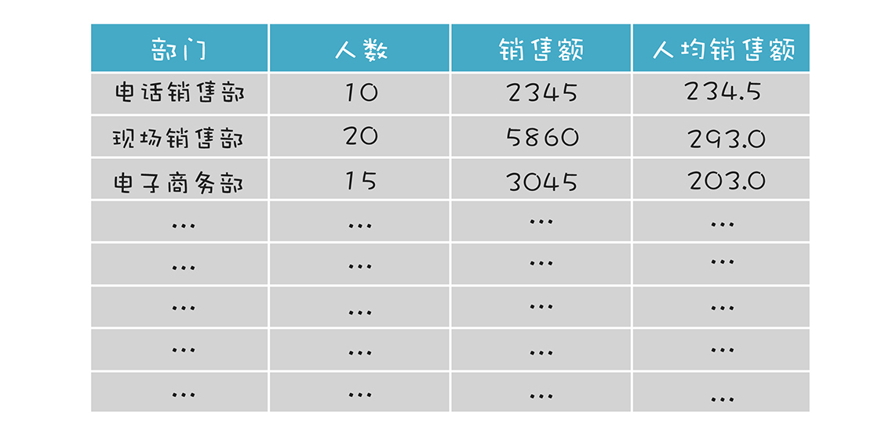

---
date: "2019-06-23"
---  
      
# 15 | 前端技术应用（二）：如何设计一个报表工具？
众所周知，很多软件都需要面向开发者甚至最终用户提供自定义功能，在[开篇词](https://time.geekbang.org/column/article/118016)里，我提到自己曾经做过工作流软件和电子表单软件，它们都需要提供自定义功能，报表软件也是其中的典型代表。

在每个应用系统中，我们对数据的处理大致会分成两类：一类是在线交易，叫做OLTP，比如在网上下订单；一类是在线分析，叫做OLAP，它是对应用中积累的数据进行进一步分析利用。而报表工具就是最简单，但也是最常用的数据分析和利用的工具。

本节课，我们就来分析一下，如果我们要做一个通用的报表工具，需要用到哪些编译技术，又该怎样去实现。

## 报表工具所需要的编译技术

如果要做一个报表软件，我们要想清楚软件面对的用户是谁。有一类报表工具面向的用户是程序员，那么这种软件可以暴露更多技术细节。比如，如果报表要从数据库获取数据，你可以写一个SQL语句作为数据源。

还有一类软件是给业务级的用户使用的，很多BI软件包都是这种类型。带有IT背景的顾问给用户做一些基础配置，然后用户就可以用这个软件包了。Excel可以看做是这种报表工具，IT人员建立Excel与数据库之间的连接，剩下的就是业务人员自己去操作了。

这些业务人员可以采用一个图形化的界面设计报表，对数据进行加工处理。我们来看看几个场景。

<!-- [[[read_end]]] -->

**第一个场景是计算字段。**计算字段的意思是，原始数据里没有这个数据，我们需要基于原始数据，通过一个自定义的公式来把它计算出来。比如在某个CRM系统中保存着销售数据，我们有每个部门的总销售额，也有每个部门的人数，要想在报表中展示每个部门的人均销售额，这个时候就可以用到计算公式功能，计算公式如下：

```
    人均销售额=部门销售额/部门人数
    

```

得到的结果如下图所示：



**进一步，我们可以在计算字段中支持函数。**比如我们可以把各个部门按照人均销售额排名次。这可以用一个函数来计算：

```
    =rank(人均销售额)
    

```

rank就是排名次的意思，其他统计函数还包括：

* min\(\)，求最小值。
* max\(\)，求最大值。
* avg\(\)，求平均值。
* sum\(\)，求和。

还有一些更有意思的函数，比如：

* runningsum\(\)，累计汇总值。
* runningavg\(\)，累计平均值。

这些有意思的函数是什么意思呢？因为很多明细性的报表，都是逐行显示的，累计汇总值和累计平均值，就是累计到当前行的计算结果。当然了，我们还可以支持更多的函数，比如当前日期、当前页数等等。更有意思的是，上述字段也好、函数也好，都可以用来组合成计算字段的公式，比如：

```
    =部门销售额/sum(部门销售额)   //本部门的销售额在全部销售额的占比
    =max(部门销售额)-部门销售额   //本部门的销售额与最高部门的差距
    =max(部门销售额/部门人数)-部门销售额/部门人数   //本部门人均销售额与最高的那个部门的差
    =sum(部门销售额)/sum(人数)-部门销售额/部门人数  //本部门的人均销售额与全公司人均销售额的差
    

```

怎么样，是不是越来越有意思了呢？现在你已经知道了在报表中会用到普通字段和各种各样的计算公式，那么，我们如何用这样的字段和公式来定义一张报表呢？

## 如何设计报表

假设我们的报表是一行一行地展现数据，也就是最简单的那种。那我们将报表的定义做成一个XML文件，可能是下面这样的，它定义了表格中每一列的标题和所采用字段或公式：

```
    <playreport title="Report 1">
        <section>
            <column>
                <title>部门</title>
                <field>dept</field>
            </column>
            <column>
                <title>人数</title>
                <field>num_person</field>
            </column>
            <column>
                <title>销售额</title>
                <field>sales_amount</field>
            </column>
            <column>
                <title>人均销售额</title>
                <field>sales_amount/num_person</field>
            </column>
        </section>
        <datasource>
            <connection>数据库连接信息...</connection>
            <sql>select dept, num_person, sales_amount from sales</sql>
        </datasource>
    </playreport>
    

```

这个报表定义文件还是蛮简单的，它主要表达的是数据逻辑，忽略了表现层的信息。如果我们想要优先表达表现层的信息，例如字体大小、界面布局等，可以采用HTML模板的方式来定义报表，其实就是在一个HTML中嵌入了公式，比如：

```
    <html>
    <body>
        <div class="report" datasource="这里放入数据源信息">
            <div class="table_header">
                <div class="column_header">部门</div>
                <div class="column_header">人数</div>
                <div class="column_header">销售额</div>
                <div class="column_header">人均销售额</div>
            </div>
            <div class="table_body">
                <div class="field">{=dept}</div>
                <div class="field">{=num_person}</div>
                <div class="field">{=sales_amount}</div>
                <div class="field">{=sales_amount/num_person}</div>
            </div>
        </div>
    </body>
    </html>
    

```

这样的HTML模板看上去是不是很熟悉？其实在很多语言里，比如PHP，都提供模板引擎功能，实现界面设计和应用代码的分离。这样一个模板，可以直接解释执行，或者先翻译成PHP或Java代码，然后再执行。只要运用我们学到的编译技术，这些都可以实现。

我想你应该会发现，这样的一个模板文件，其实就是一个特定领域语言，也就是我们常说的DSL。DSL可以屏蔽掉实现细节，让我们专注于领域问题，像上面这样的DSL，哪怕没有技术背景的工作人员，也可以迅速地编写出来。

而这个简单的报表，在报表设计界面上可能是下图这样的形式：


分析完如何设计报表之后，接下来，我们看看如何定义报表所需要的公式规则。

## 编写所需要的语法规则

我们设计了PlayReport.g4规则文件，这里面的很多规则，是把PlayScript.g4里的规则拿过来改一改用的：

```
    bracedExpression
        : '{' '=' expression '}'
        ;
    
    expression
        : primary
        | functionCall
        | expression bop=('*'|'/'|'%') expression  
        | expression bop=('+'|'-') expression 
        | expression bop=('<=' | '>=' | '>' | '<') expression
        | expression bop=('==' | '!=') expression
        | expression bop='&&' expression
        | expression bop='||' expression
        ;
    
    primary
        : '(' expression ')'
        | literal
        | IDENTIFIER
        ;
    
    expressionList
        : expression (',' expression)*
        ;
    
    functionCall
        : IDENTIFIER '(' expressionList? ')'
        ;
    
    literal
        : integerLiteral
        | floatLiteral
        | CHAR_LITERAL
        | STRING_LITERAL
        | BOOL_LITERAL
        | NULL_LITERAL
        ;
    
    integerLiteral
        : DECIMAL_LITERAL
        | HEX_LITERAL
        | OCT_LITERAL
        | BINARY_LITERAL
        ;
    
    floatLiteral
        : FLOAT_LITERAL
        | HEX_FLOAT_LITERAL
        ;
    

```

这里面，其实就是用了表达式的语法，包括支持加减乘除等各种运算，用来书写公式。我们还特意支持functionCall功能，也就是能够调用函数。因为我们内部实现了很多内置函数，比如求最大值、平均值等，可以在公式里调用这些函数。

现在呢，我们已经做好了一个最简单的报表定义，接下来，就一起实现一个简单的报表引擎，这样就能实际生成报表了！

## 实现一个简单的报表引擎

报表引擎的工作，是要根据报表的定义和数据源中的数据，生成最后报表的呈现格式。具体来说，可以分为以下几步：

* **解析报表的定义。**我们首先要把报表定义形成Java对象。这里只是简单地生成了一个测试用的报表模板。
* **从数据源获取数据。**我们设计了一个TabularData类，用来保存类似数据库表那样的数据。
* **实现一个FieldEvaluator类，能够在运行时对字段和公式进行计算。**这个类是playscript中ASTEvaluator类的简化版。我们甚至连语义分析都简化了。数据类型信息作为S属性，在求值的同时自底向上地进行类型推导。当然，如果做的完善一点儿，我们还需要多做一点儿语义分析，比如公式里的字段是不是数据源中能够提供的？而这时需要用到报表数据的元数据。
* **渲染报表。**我们要把上面几个功能组合在一起，对每一行、每一列求值，获得最后的报表输出。

主控程序我放在了下面，用一个示例报表模板和报表数据来生成报表：

```
    public static void main(String args[]) {
        System.out.println("Play Report!");
    
        PlayReport report = new PlayReport();
    
        //打印报表1
        String reportString = report.renderReport(ReportTemplate.sampleReport1(), TabularData.sampleData());
        System.out.println(reportString);
    }
    

```

renderReport方法用来渲染报表，它会调用解析器和报表数据的计算器：

```
    public String renderReport(ReportTemplate template, TabularData data){
        StringBuffer sb = new StringBuffer();
        
        //输出表格头
        for (String columnHeader: template.columnHeaders){
            sb.append(columnHeader).append('\t');
        }
        sb.append("\n");
    
        //编译报表的每个字段
        List<BracedExpressionContext> fieldASTs = new LinkedList<BracedExpressionContext>();
        for (String fieldExpr : template.fields){
            //这里会调用解析器
            BracedExpressionContext tree = parse(fieldExpr);
            fieldASTs.add(tree);
        }
    
        //计算报表字段
        FieldEvaluator evaluator = new FieldEvaluator(data);
        List<String> fieldNames = new LinkedList<String>();
        for (BracedExpressionContext fieldAST: fieldASTs){
            String fieldName = fieldAST.expression().getText();
            fieldNames.add(fieldName);
            if (!data.hasField(fieldName)){
                Object field = evaluator.visit(fieldAST);
                data.setField(fieldName, field);
            }
        }
    
        //显示每一行数据
        for (int row = 0; row< data.getNumRows(); row++){
            for (String fieldName: fieldNames){
                Object value = data.getFieldValue(fieldName, row);
                sb.append(value).append("\t");
            }
            sb.append("\n");
        }
    
        return sb.toString();
    }
    

```

程序的运行结果如下，它首先打印输出了每个公式的解析结果，然后输出报表：

```
    Play Report!
    (bracedExpression { = (expression (primary dept)) })
    (bracedExpression { = (expression (primary num_person)) })
    (bracedExpression { = (expression (primary sales_amount)) })
    (bracedExpression { = (expression (expression (primary sales_amount)) / (expression (primary num_person))) })
    部门      	人数	销售额	人均销售额
    电话销售部	10	2345.0	234.5
    现场销售部	20	5860.0	293.0
    电子商务部	15	3045.0	203.0
    渠道销售部	20	5500.0	275.0
    微商销售部	12	3624.0	302.0
    

```

你可以看到，报表工具准确地得出了计算字段的数据。接下来，我再讲一讲报表数据计算的细节。

如果你看一看FieldEvaluator.java这个类，就会发现我实际上实现了一个简单的向量数据的计算器。在计算机科学里，向量是数据的有序列表，可以看做一个数组。相对应的，标量只是一个单独的数据。运用向量计算，我们在计算人均销售额的时候，会把“销售额”和“人数”作为两个向量，每个向量都有5个数据。把这两个向量相除，会得到第三个向量，就是“人均销售额”。这样就不需要为每行数据运行一次计算器，会提高性能，也会简化程序。

其实，这个向量计算器还能够把向量和标量做混合运算。因为我们的报表里有时候确实会用到标量，比如对销售额求最大值\{=max\(sales\_amount\)\}，就是一个标量。而如果计算销售额与最大销售额的差距\{=max\(sales\_amount\)-sales\_amount\}，就是标量和向量的混合运算，返回结果是一个向量。

TabularData.java这个类是用来做报表数据的存储的。我简单地用了一个Map，把字段的名称对应到一个向量或标量上，其中字段的名称可以是公式：


在报表数据计算过程中，我们还做了一个优化。公式计算的中间结果会被存起来，如果下一个公式刚好用到这个数据，可以复用。比如，在计算rank\(sales\_amount/num\_person\)这个公式的时候，它会查一下括号中的sales\_amount/num\_person这个子公式的值是不是以前已经计算过，如果计算过，就复用，否则，就计算一下，并且把这个中间结果也存起来。

我们把这个报表再复杂化一点，形成下面一个报表模板。这个报表模板用到了好几个函数，包括排序、汇总值、累计汇总值和最大值，并通过公式定义出一些相对复杂的计算字段，包括最高销售额、销售额的差距、销售额排序、人均销售额排序、销售额累计汇总、部门销售额在总销售额中的占比，等等。

```
    public static ReportTemplate sampleReport2(){
        ReportTemplate template = new ReportTemplate();
    
        template.columnHeaders.add("部门");
        template.columnHeaders.add("人数");
        template.columnHeaders.add("销售额");
        template.columnHeaders.add("最高额");
        template.columnHeaders.add("差距");
        template.columnHeaders.add("排序");
        template.columnHeaders.add("人均");
        template.columnHeaders.add("人均排序");
        template.columnHeaders.add("累计汇总");
        template.columnHeaders.add("占比%");
    
        template.fields.add("{=dept}");
        template.fields.add("{=num_person}");
        template.fields.add("{=sales_amount}");
        template.fields.add("{=max(sales_amount)}");
        template.fields.add("{=max(sales_amount)-sales_amount}");
        template.fields.add("{=rank(sales_amount)}");
        template.fields.add("{=sales_amount/num_person}");
        template.fields.add("{=rank(sales_amount/num_person)}");
        template.fields.add("{=runningsum(sales_amount)}");
        template.fields.add("{=sales_amount/sum(sales_amount)*100}");
    
        return template;
    }
    

```

最后输出的报表截屏如下，怎么样，现在看起来功能还是挺强的吧！


当然了，这个程序只是拿很短的时间写的一个Demo，如果要变成一个成熟的产品，还要在很多地方做工作。比如：

* 可以把字段名称用中文显示，这样更便于非技术人员使用；
* 除了支持行列报表，还要支持交叉表，用于统计分析；
* 支持多维数据计算。
* ……

在报表工具中，编译技术除了用来做字段的计算，还可以用于其他功能，比如条件格式。我们可以在人均销售额低于某个数值时，给这行显示成红色，其中的判断条件，也是一个公式。

甚至你还可以为报表工具添加自定义公式功能。我们给用户提供脚本功能，用户可以自己做一个函数，实现某个领域的一个专业功能。我十分建议你在这个示例程序的基础上进一步加工，看看能做否做出一些让自己惊喜的功能。

## 课程小结

本节课我们做了一个示例性的报表工具。你能在这个过程中看到，像报表工具这样的软件，如果有编译技术的支持，真的可以做得很灵活、很强大。你完全可以借鉴本节课的思路，去尝试做一下其他需要自定义功能的软件工具或产品。

与此同时，我们能看到编译技术可以跟某个应用领域结合在一起，内置在产品中，同时形成领域的DSL，比如报表的模板文件。这样，我们就相当于赋予了普通用户在某个领域内的编程能力，比如用户只需要编写一个报表模板，就可以生成报表了。了解这些内容之后，我来带你回顾一下，这个应用是怎么运用编译器前端技术的。

词法分析和语法分析都很简单，我们就是简单地用了表达式和函数调用的功能。而语义分析除了需要检查类型以外，还要检查所用到的字段和函数是否合法，这是另一种意义上的引用消解。而且这个例子中的运算的含义是向量运算，同样是加减乘除，每个操作都会处理一组数据，这也是一种语义上的区别。

我希望在学习了这两节课之后，你能对如何在某个应用领域应用编译技术有更直观的了解，甚至有了很多的启发。

## 一课一思

你在自己的工作领域中，是否发现有哪些需要用户自定义功能的需求？你又是怎么实现这些需求的？编译技术会不会在这些地方帮助到你？欢迎在留言区分享你的发现。

最后，感谢你的阅读，如果这篇文章让你有所收获，欢迎你将它分享给更多的朋友。

本节课的示例代码我放在文末，供你参考。

* lab/report（报表项目示例代码） [码云](https://gitee.com/richard-gong/PlayWithCompiler/tree/master/lab/report) [GitHub](https://github.com/RichardGong/PlayWithCompiler/tree/master/lab/report)
* PlayReport.java（主程序入口） [码云](https://gitee.com/richard-gong/PlayWithCompiler/blob/master/lab/report/src/main/report/PlayReport.java) [GitHub](https://github.com/RichardGong/PlayWithCompiler/blob/master/lab/report/src/main/report/PlayReport.java)
* FieldEvaluator.java（做报表计算的代码） [码云](https://gitee.com/richard-gong/PlayWithCompiler/blob/master/lab/report/src/main/report/FieldEvaluator.java) [GitHub](https://github.com/RichardGong/PlayWithCompiler/blob/master/lab/report/src/main/report/FieldEvaluator.java)
* ReportTemplate.java（报表模板） [码云](https://gitee.com/richard-gong/PlayWithCompiler/blob/master/lab/report/src/main/report/ReportTemplate.java) [GitHub](https://github.com/RichardGong/PlayWithCompiler/blob/master/lab/report/src/main/report/ReportTemplate.java)
* TabularData.java（报表数据） [码云](https://gitee.com/richard-gong/PlayWithCompiler/blob/master/lab/report/src/main/report/TabularData.java) [GitHub](https://github.com/RichardGong/PlayWithCompiler/blob/master/lab/report/src/main/report/TabularData.java)