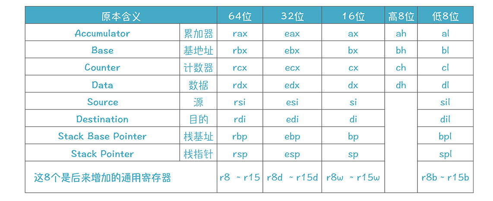

---
date: "2019-06-23"
---  
      
# 22 | 生成汇编代码（一）：汇编语言其实不难学
> 敲黑板：课程用的是GNU汇编器，macOS和Linux已内置，本文的汇编语言的写法是GNU汇编器规定的写法。Windows系统可安装MinGW或Linux虚拟机。

对于静态编译型语言，比如C语言和Go语言，编译器后端的任务就是生成汇编代码，然后再由汇编器生成机器码，生成的文件叫目标文件，最后再使用链接器就能生成可执行文件或库文件了。


就算像JavaScript这样的解释执行的语言，也要在运行时利用类似的机制生成机器码，以便调高执行的速度。Java的字节码，在运行时通常也会通过JIT机制编译成机器码。**而汇编语言是完成这些工作的基础。**

对你来说，掌握汇编语言是十分有益的，因为哪怕掌握一小点儿汇编技能，就能应用到某项工作中，比如，在C语言里嵌入汇编，实现某个特殊功能；或者读懂某些底层类库或驱动程序的代码，因为它可能是用汇编写的。

本节课，我先带你了解一下汇编语言，来个破冰之旅。然后在接下来的课程中再带你基于AST手工生成汇编代码，破除你对汇编代码的恐惧，了解编译期后端生成汇编代码的原理。

以后，当你看到高级语言的代码，以及IR时，就可以想象出来它对应的汇编代码是什么样子，实现从上层到底层认知的贯通。

## 了解汇编语言

<!-- [[[read_end]]] -->

机器语言都是0101的二进制的数据，不适合我们阅读。而汇编语言，简单来说，是可读性更好的机器语言，基本上每条指令都可以直接翻译成一条机器码。

跟你日常使用的高级语言相比，汇编语言的语法特别简单，但它要跟硬件（CPU和内存）打交道，我们来体会一下。

计算机的处理器有很多不同的架构，比如x86-64、ARM、Power等，每种处理器的指令集都不相同，那也就意味着汇编语言不同。我们目前用的电脑，CPU一般是x86-64架构，是64位机。（如不做特别说明，本课程都是以x86-64架构作为例子的）。

说了半天，汇编代码长什么样子呢？我用C语言写的例子来生成一下汇编代码。

```
    #include <stdio.h>
    int main(int argc, char* argv[]){
        printf("Hello %s!\n", "Richard");
        return 0;
    }
    

```

在macOS中输入下面的命令，其中的-S参数就是告诉编译器把源代码编译成汇编代码，而-O2参数告诉编译器进行2级优化，这样生成的汇编代码会短一些：

```
    clang -S -O2 hello.c -o hello.s
    或者：
    gcc -S -O2 hello.c -o hello.s
    

```

生成的汇编代码是下面的样子：

```
     .section    __TEXT,__text,regular,pure_instructions
        .build_version macos, 10, 14    sdk_version 10, 14
        .globl  _main                   ## -- Begin function main
        .p2align    4, 0x90
    _main:                                  ## @main
        .cfi_startproc
    ## %bb.0:
        pushq   %rbp
        .cfi_def_cfa_offset 16
        .cfi_offset %rbp, -16
        movq    %rsp, %rbp
        .cfi_def_cfa_register %rbp
        leaq    L_.str(%rip), %rdi
        leaq    L_.str.1(%rip), %rsi
        xorl    %eax, %eax
        callq   _printf
        xorl    %eax, %eax
        popq    %rbp
        retq
        .cfi_endproc
                                            ## -- End function 
        .section    __TEXT,__cstring,cstring_literals
    L_.str:                                 ## @.str
        .asciz  "Hello %s!\n"
    
    L_.str.1:                               ## @.str.1
        .asciz  "Richard"
    
    .subsections_via_symbols
    

```

你如果再打下面的命令，就会把这段汇编代码编译成可执行文件（在macOS或Linux执行as命令，就是调用了GNU的汇编器）：

```
    as hello.s -o hello.o   //用汇编器编译成目标文件
    gcc hello.o -o hello   //链接成可执行文件 
    ./hello                 //运行程序
    

```

以上面的代码为例，来看一下汇编语言的组成元素。**这是汇编语言入门的基础，也是重点内容，在阅读时，你不需要死记硬背，而是要灵活掌握，**比如CPU的指令特别多，我们记住常用的就行了，不太常用的可以去查手册。

#### 1.汇编语言的组成元素

这段代码里有**指令、伪指令、标签和注释**四种元素，每个元素单独占一行。

**指令（instruction）是直接由CPU进行处理的命令，**例如：

```
    pushq   %rbp
    movq    %rsp, %rbp
    

```

其中，开头的一个单词是助记符（mnemonic），后面跟着的是操作数（operand），有多个操作数时以逗号分隔。第二行代码的意思是把数据从这里（源）拷贝到那里（目的），这跟“请倒杯咖啡给我”这样的自然语句是一样的，先是动词（倒），然后是动词的作用对象（咖啡），再就是目的地（给我）。

**伪指令以“.”开头，末尾没有冒号“：”。**

```
    .section    __TEXT,__text,regular,pure_instructions
    .globl  _main        
    .asciz  "Hello %s!\n"
    

```

伪指令是是辅助性的，汇编器在生成目标文件时会用到这些信息，但伪指令不是真正的CPU指令，就是写给汇编器的。每种汇编器的伪指令也不同，要查阅相应的手册。

**标签以冒号“:”结尾，用于对伪指令生成的数据或指令做标记。**例如L\_.str: 标签是对一个字符串做了标记。其他代码可以访问标签，例如跳转到这个标签所标记的指令。

```
    L_.str:                                 ## @.str
        .asciz  "Hello %s!\n"
    

```

标签很有用，它可以代表一段代码或者常量的地址（也就是在代码区或静态数据区中的位置）。可一开始，我们没法知道这个地址的具体值，必须生成目标文件后，才能算出来。所以，标签会简化汇编代码的编写。

**第四种元素，注释，以“#”号开头，这跟C语言中以//表示注释语句是一样的。**

因为指令是汇编代码的主要部分，所以我们再把与指令有关的知识点展开讲解一下。

#### 2.详细了解指令这个元素

在代码中，助记符“movq”“xorl”中的“mov”和“xor”是指令，而“q”和“l”叫做后缀，表示操作数的位数。后缀一共有b, w, l, q四种，分别代表8位、16位、32位和64位。


比如，movq中的q代表操作数是8个字节，也就是64位的。movq就是把8字节从一个地方拷贝到另一个地方，而movl则是拷贝4个字节。

而在指令中使用操作数，可以使用四种格式，它们分别是：**立即数、寄存器、直接内存访问和间接内存访问。**

**立即数以\$开头，** **比如\$40**。（下面这行代码是把40这个数字拷贝到\%eax寄存器）。

```
    movl $40, %eax
    

```

除此之外，我们在指令中最常见到的就是对寄存器的访问，GNU的汇编器规定寄存器一定要以\%开头。

**直接内存访问：**当我们在代码中看到操作数是一个数字时，它其实指的是内存地址。不要误以为它是一个数字，因为数字立即数必须以\$开头。另外，汇编代码里的标签，也会被翻译成直接内存访问的地址。比如“callq \_printf”中的“\_printf”是一个函数入口的地址。汇编器帮我们计算出程序装载在内存时，每个字面量和过程的地址。

**间接内存访问：**带有括号，比如（\%rbp），它是指\%rbp寄存器的值所指向的地址。

间接内存访问的完整形式是：

> 偏移量（基址，索引值，字节数）这样的格式。

其地址是：

> 基址 + 索引值\*字节数 + 偏移量

举例来说：

> 8\(\%rbp\)，是比\%rbp寄存器的值加8。  
> \-8\(\%rbp\)，是比\%rbp寄存器的值减8。  
> （\%rbp, \%eax, 4）的值，等于\%rbp + \%eax\*4。这个地址格式相当于访问C语言中的数组中的元素，数组元素是32位的整数，其索引值是\%eax，而数组的起始位置是\%rbp。其中字节数只能取1,2,4,8四个值。

你现在应该对指令的格式有所了解了，接下来，我们再学几个常用的指令：

**mov指令**

```
    mov 寄存器|内存|立即数, 寄存器|内存
    

```

这个指令最常用到，用于在寄存器或内存之间传递数据，或者把立即数加载到内存或寄存器。mov指令的第一个参数是源，可以是寄存器、内存或立即数。第二个参数是目的地，可以是寄存器或内存。

**lea指令，lea是“load effective address”的意思，装载有效地址。**

```
    lea 源，目的
    

```

比如前面例子代码中的leaq指令，是把字符串的地址加载到\%rdi寄存器。

```
    leaq    L_.str(%rip), %rdi
    

```

**add指令是做加法运算，它可以采取下面的格式：**

```
    add 立即数， 寄存器 
    add 寄存器， 寄存器 
    add 内存， 寄存器 
    add 立即数， 内存 
    add 寄存器， 内存
    

```

比如，典型的c=a+b这样一个算术运算可能是这样的：

```
    movl -4(%rbp), %eax    #把%rbp-4的值拷贝到%eax
    addl -8(%rbp), %eax   #把%rbp-8地址的值加到%eax上
    movl %eax, -12(%rbp)   #把%eax的值写到内存地址%rbp-12
    

```

这三行代码，分别是操作a、b、c三个变量的地址。它们的地址分别比\%rbp的值减4、减8、减12，因此a、b、c三个变量每个都是4个字节长，也就是32位，它们是紧挨着存放的，并且是从高地址向低地址延伸的，这是栈的特征。

**除了add以外，其他算术运算的指令：**


**与栈有关的操作：**


**跳转类：**


**过程调用：**


**比较操作：**


以上我列举的指令，是你在编写汇编代码时，经常会用到的，比较重要，会满足你编写简单汇编程序的需求，所以你需要重点关注。

x86-64是复杂指令集的处理器，有非常多的指令，差不多有上千条，全部记住是比较难的。更好的办法，是记住主要的指令，其他指令在使用时去查[Intel公司的手册](https://software.intel.com/en-us/download/intel-64-and-ia-32-architectures-sdm-combined-volumes-1-2a-2b-2c-2d-3a-3b-3c-3d-and-4)，在这里我就不举例了。

## x86-64架构的寄存器

在汇编代码中，我们经常要使用各种以\%开头的寄存器的符号。初学者阅读这些代码时，通常会有一些疑问：有几个寄存器可以用？我可以随便用它们吗？使用不当会不会造成错误？等等。所以，有必要让你熟悉一下这些寄存器，了解它们的使用方法。

x86-64架构的CPU里有很多寄存器，我们在代码里最常用的是16个64位的通用寄存器，分别是：

> \%rax，\%rbx，\%rcx，\%rdx，\%rsi，\%rdi，\%rbp，\%rsp， \%r8，\%r9，\%r10，\%r11，\%r12，\%r13，\%r14，\%r15。

这些寄存器在历史上有各自的用途，比如，rax中的“a”，是Accumulator\(累加器\)的意思，这个寄存器是累加寄存器。

但随着技术的发展，这些寄存器基本上都成为了通用的寄存器，不限于某种特定的用途。但是，为了方便软件的编写，我们还是做了一些约定，给这些寄存器划分了用途。针对x86-64架构有多个调用约定（Calling Convention），包括微软的x64调用约定（Windows系统）、System V AMD64 ABI（Unix和Linux系统）等，下面的内容属于后者：

* \%rax 除了其他用途外，通常在函数返回的时候，把返回值放在这里。

* \%rsp 作为栈指针寄存器，指向栈顶。

* \%rdi，\%rsi，\%rdx，\%rcx，\%r8，\%r9 给函数传整型参数，依次对应第1参数到第6参数。超过6个参数怎么办？放在栈桢里，我们[21讲](https://time.geekbang.org/column/article/146635)已经讲过了。

* 如果程序要使用\%rbx，\%rbp，\%r12，\%r13，\%r14，\%r15 这几个寄存器，是由被调用者（Callee）负责保护的，也就是写到栈里，在返回的时候要恢复这些寄存器中原来的内容。其他寄存器的内容，则是由调用者（Caller）负责保护，如果不想这些寄存器中的内容被破坏，那么要自己保护起来。

上面这些寄存器的名字都是64位的名字，对于每个寄存器，我们还可以只使用它的一部分，并且另起一个名字。比如对于\%rax，如果使用它的前32位，就叫做\%eax，前16位叫\%ax，前8位（0到7位）叫\%al，8到15位叫\%ah。


其他的寄存器也有这样的使用方式，当你在汇编代码中看到这些名称的时候，你就知道其实它们有可能在物理上是同一个寄存器。



除了通用寄存器以外，有可能的话，还要了解下面的寄存器和它们的用途，我们写汇编代码时也经常跟它们发生关联：

* 8个80位的x87寄存器，用于做浮点计算；

* 8个64位的MMX寄存器，用于MMX指令（即多媒体指令），这8个跟x87寄存器在物理上是相同的寄存器。在传递浮点数参数的时候，要用mmx寄存器。

* 16个128位的SSE寄存器，用于SSE指令。我们将在应用篇里使用SSE指令，讲解SIMD的概念。

* 指令寄存器，rip，保存指令地址。CPU总是根据这个寄存器来读取指令。

* flags（64位：rflags, 32位：eflags）寄存器：每个位用来标识一个状态。比如，它们会用于比较和跳转的指令，比如if语句翻译成的汇编代码，就会用它们来保存if条件的计算结果。

总的来说，我们的汇编代码处处要跟寄存器打交道，正确和高效使用寄存器，是编译期后端的重要任务之一。

## 课程小结

本节课，我讲解了汇编语言的一些基础知识，由于汇编语言的特点，涉及的知识点和细节比较多，在这个过程中，你无需死记硬背，只需要掌握几个重点内容：

1.汇编语言是由指令、标签、伪指令和注释构成的。其中主要内容都是指令。指令包含一个该指令的助记符和操作数。操作数可以使用直接数、寄存器，以及用两种方式访问内存地址。

2.汇编指令中会用到一些通用寄存器。这些寄存器除了用于计算以外，还可以根据调用约定帮助传递参数和返回值。使用寄存器时，要区分由调用者还是被调用者负责保护寄存器中原来的内容。

另外，我们还要注意按照一定的规则维护和使用栈桢，**这个知识点会在后面的加餐中展开来讲一个例子。**

鉴于你可能是第一次使用汇编语言，所以我**提供两个建议，让你快速上手汇编语言：**

1.你可以用C语言写一些示例代码，然后用编译器生成汇编代码，看看能否看懂。

2.模仿文稿中的例子，自己改写并运行你自己的汇编程序，这个过程中，你会发现真的没那么难。

## 一课一思

你之前学习过或者在项目中使用过汇编语言吗？感受是什么呢？有什么经验和体会呢？欢迎在留言区分享你的经验与感受。

最后，感谢你的阅读，如果这篇文章让你有所收获，也欢迎你将它分享给更多的朋友。