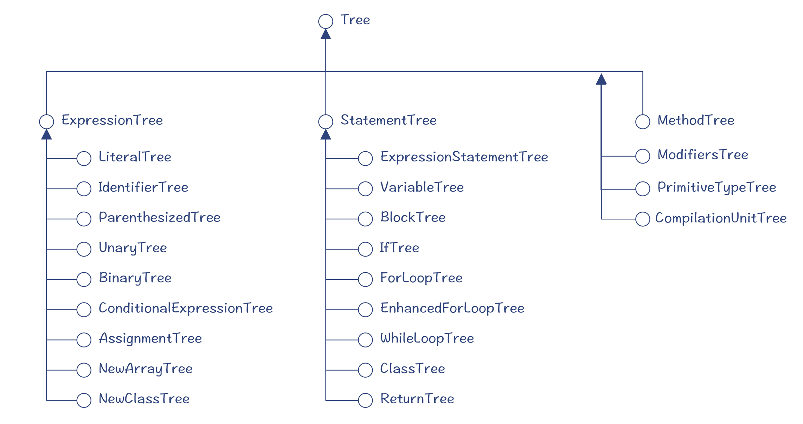
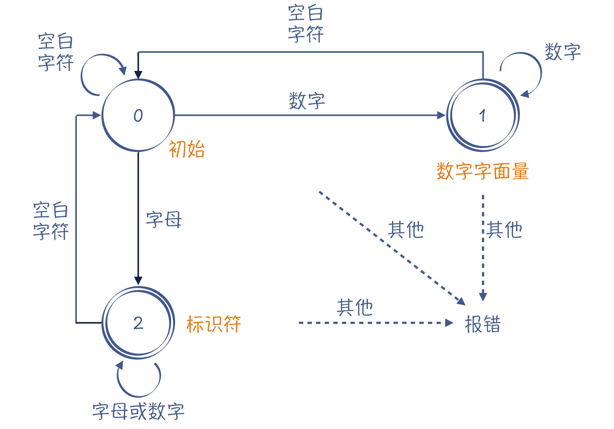
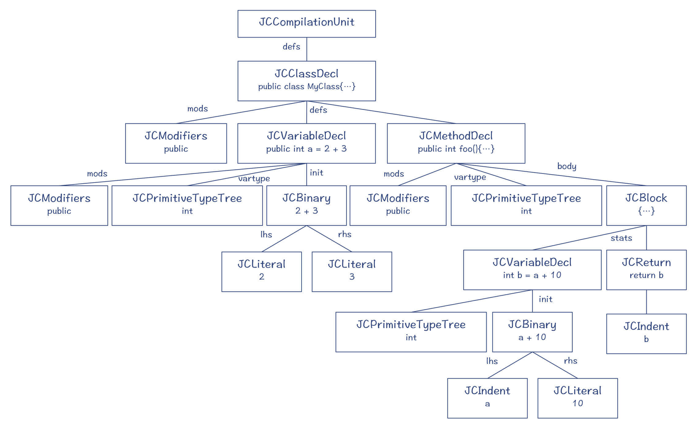
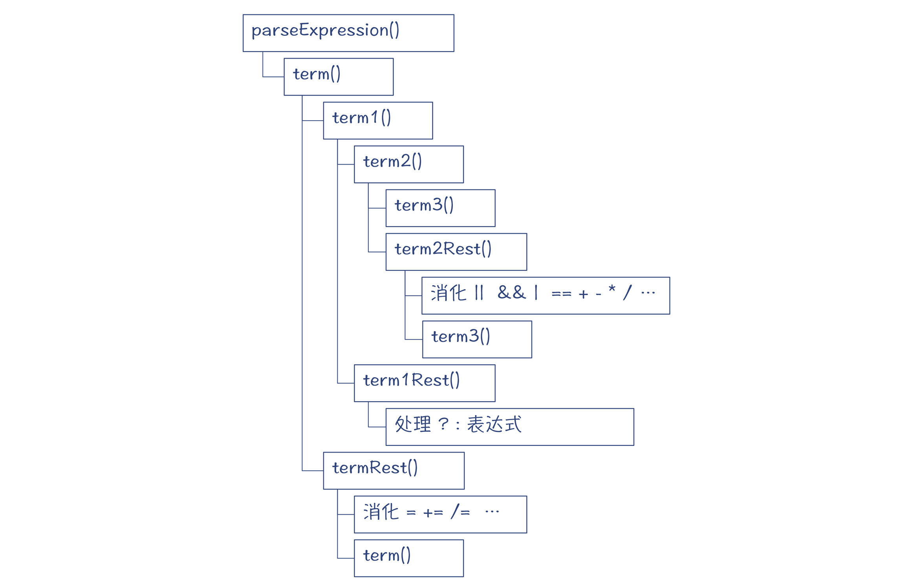
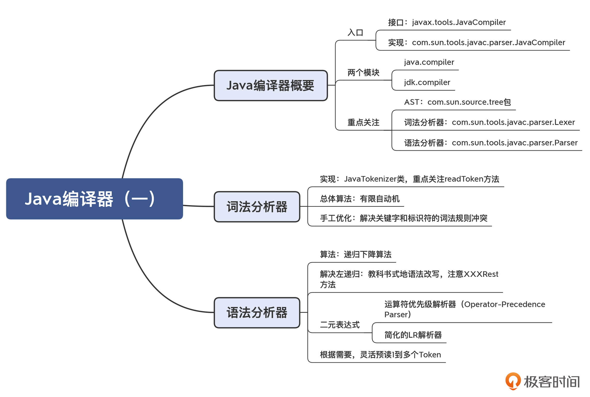

---
date: "2019-06-23"
---  
      
# 09 | Java编译器（一）：手写的编译器有什么优势？
你好，我是宫文学。

从今天开始呢，我会带着你去考察实际编译器的具体实现机制，你可以从中学习和印证编译原理的基础知识，进而加深你对编译原理的理解。

我们探险的第一站，是很多同学都很熟悉的Java语言，我们一起来看看它的编译器里都有什么奥秘。我从97年就开始用它，算是比较早了。当时，我就对它的“一次编译，到处运行”留下了很深的印象，我在Windows下写的程序，编译完毕以后放到Solaris上就能跑。现在看起来这可能不算什么，但在当年，我在Windows和Unix下写程序用的工具可是完全不同的。

到现在，Java已经是一门非常成熟的语言了，而且它也在不断进化，与时俱进，泛型、函数式编程、模块化等特性陆续都增加了进来。在服务端编程领域，它也变得非常普及。

与此同时，Java的编译器和虚拟机中所采用的技术，也比20年前发生了天翻地覆的变化。对于这么一门成熟的、广泛普及的、又不断焕发新生机的语言来说，研究它的编译技术会带来两个好处：一方面，Java编译器所采用的技术肯定是比较成熟的、靠谱的，你在实现自己的编译功能时，完全可以去参考和借鉴；另一方面，你可以借此深入了解Java的编译过程，借此去实现一些高级的功能，比方说，按需生成字节码，就像Spring这类工具一样。

<!-- [[[read_end]]] -->

因此，我会花4讲的时间，跟你一起探索Java的前端编译器（javac）。然后再花4讲的时间在Java的JIT编译器上。

那么，针对Java编译器，你可能会提出下面的问题：

* **Java的编译器是用什么语言编写的？**
* **Java的词法分析器和语法分析器，是工具生成的，还是手工编写的？为什么会这样选择？**
* **语法分析的算法分为自顶向下和自底向上的。那么Java的选择是什么呢？有什么道理吗？**
* **如何自己动手修改Java编译器？**

这些问题，在今天的旅程结束后，你都会获得解答。并且，你还会获得一些额外的启发：噢，原来这个功能是可以这样做的呀！这是对你探险精神的奖励。

好吧，让我们开始吧。

第一步，我们先初步了解一下Java的编译器。

## 初步了解Java的编译器

大多数Java工程师是通过javac命令来初次接触Java编译器的。假设你写了一个MyClass类：

```
    public class MyClass {
        public int a = 2+3;
        public int foo(){
            int b = a + 10;
            return b;
        }
    }
    

```

你可以用javac命令把MyClass.java文件编译成字节码文件：

```
    javac MyClass.java
    

```

那这个javac的可执行文件就是Java的编译器吗？并不是。javac只是启动了一个Java虚拟机，执行了一个Java程序，跟我们平常用“java”命令运行一个程序是一样的。换句话说，Java编译器本身也是用Java写的。

这就很有趣了。我们知道，计算机语言是用来编写软件的，而编译器也是一种软件。所以，一门语言的编译器，竟然可以用自己来实现。这种现象，叫做“**自举**”\(Bootstrapping\)，这就好像一个人抓着自己的头发，要把自己提起来一样，多么神奇！实际上，一门语言的编译器，一开始肯定是要用其他语言来实现的。但等它成熟了以后，就会尝试实现自举。

既然Java编译器是用Java实现的，那意味着你自己也可以写一个程序，来调用Java的编译器。比如，运行下面的示例代码，也同样可以编译MyClass.java文件，生成MyClass.class文件：

```
    import javax.tools.JavaCompiler;
    import javax.tools.ToolProvider;
    
    public class CompileMyClass {
        public static void main(String[] args) {
            JavaCompiler compiler = ToolProvider.getSystemJavaCompiler();
            int result = compiler.run(null, null, null, "MyClass.java");
            System.out.println("Compile result code = " + result);
        }
    }
    

```

其中，javax.tools.JavaCompiler就是Java编译器的入口，属于**java.compiler模块**。这个模块包含了Java语言的模型、注解的处理工具，以及Java编译器的API。

javax.tools.JavaCompiler的实现是com.sun.tools.javac.main.JavaCompiler。它在**jdk.compiler模块中**，这个模块里才是Java编译器的具体实现。

不过，在探索Java编译器的实现原理之前，你还需要从openjdk.java.net下载JDK的源代码，我使用的版本是JDK14。在IDE中跟踪JavaCompiler的执行过程，你就会看到它一步一步地都是使用了哪个类的哪个方法。Java的IDE工具一般都比较友好，给我们的探索提供了很多便利。

不仅如此，你还可以根据openjdk的[文档](https://hg.openjdk.java.net/jdk/jdk11/raw-file/tip/doc/building.html)，从源代码构建出JDK。你还可以修改源代码并构建你自己的版本。

获得了源代码以后，我建议你重点关注这几个地方的源代码，这能帮助你迅速熟悉Java编译器的源代码结构。

**首先是com.sun.source.tree包，**这个包里面是Java语言的AST模型。我们在写一个编译器的时候，肯定要设计一个数据结构来保存AST，那你就可以去参考一下Java是怎么做的。接下来，我就挑其中几个比较常用的节点，给你解释一下：

* ExpressionTree指的是表达式，各种不同的表达式继承了这个接口，比如BinaryTree代表了所有的二元表达式；
* StatementTree代表了语句，它的下面又细分了各种不同的语句，比如，IfTree代表了If语句，而BlockTree代表的是一个语句块。



图1：com.sun.source.tree包里的Java语言的AST模型

**然后是com.sun.tools.javac.parser.Lexer（词法解析器接口）**，它可以把字符流变成一个个的Token，具体的实现在Scanner和JavaTokenizer类中。

**接下来是com.sun.tools.javac.parser.Parser（语法解析器接口）**，它能够解析类型、语句和表达式，具体的实现在JavacParser类中。

总结起来，Java语言中与编译有关的功能放在了两个模块中：其中，java.compiler模块主要是对外的接口，而jdk.compiler中有具体的实现。**不过你要注意，**像com.sun.tools.javac.parser包中的类，不是Java语言标准的组成部分，如果你直接使用这些类，可能导致代码在不同的JDK版本中不兼容。

现在，我们已经熟悉了Java编译器的概要信息。在浏览这两个模块的代码时，我们会发现里面的内容非常多。为了让自己不会迷失在其中，我们需要找到一个方法。你已经知道，编译器的前端分为词法分析、语法分析、语义分析等阶段，那么我们就可以按照这个阶段一块一块地去探索。

首先，我们看看Java的词法分析器。

## 词法分析器也是构造了一个有限自动机吗？

通过跟踪执行，你会发现词法分析器的具体实现在JavaTokenizer类中。你可以先找到这个类，在readToken\(\)方法里打个断点，让程序运行到这里，然后查看词法分析的执行过程。

在学词法分析的时候，你肯定知道要构造一个有限自动机，而且当输入的字符发生变化的时候，自动机的状态也会产生变化。



图2：一个有限自动机，能够区分数字字面量（状态1）和标识符（状态2）

**那么实战中，Java做词法分析的逻辑是什么呢？**你可以先研究一下readToken\(\)方法，这个方法实现了主干的词法分析逻辑，它能够从字符流中识别出一个个的Token来。

readToken的逻辑变成伪代码是这样的：

```
    循环读取字符
      case 空白字符
        处理，并继续循环
      case 行结束符
        处理，并继续循环
      case A-Za-z$_
        调用scanIden()识别标识符和关键字，并结束循环
      case 0之后是X或x，或者1-9
        调用scanNumber()识别数字，并结束循环   
      case , ; ( ) [ ]等字符
        返回代表这些符号的Token，并结束循环
      case isSpectial()，也就是% * + - | 等特殊字符
        调用scanOperator()识别操作符
      ...    
    

```

如果画成有限自动机，大致是这样的：


图3：Java词法分析器的有限自动机

在[第2讲](https://time.geekbang.org/column/article/243685)中我提到过，关键字和标识符的规则是冲突的：

* 标识符的规则是以`A-Za-z$_`开头，后续字符可以是`A-Za-z$_`、数字和其他的合法字符；
* 关键字（比如if）也符合标识符的规则，可以说是标识符的子集。

这种冲突是词法分析的一个技术点，因为不到最后你不知道读入的是一个关键字，还是一个普通的标识符。如果单纯按照有限自动机的算法去做词法分析，想要区分int关键字和其他标识符的话，你就会得到图4那样的一个有限自动机。

当输入的字符串是“int”的时候，它会进入状态4。如果这个时候遇到结束字符，就会提取出int关键字。除此之外，“i”（状态2）、“in”（状态3）和“intA”（状态5）都属于标识符。


图4：能够处理int和标识符语法的有限自动机

但是关键字有很多，if、else、int、long、class…如果按照这个方式构造有限自动机，就会很啰嗦。那么java是怎么处理这个问题的呢？

Java编译器的处理方式比较简单，分成了两步：首先把所有的关键字和标识符都作为标识符识别出来，然后再从里面把所有预定义的关键字挑出来。这比构造一个复杂的有限自动机实现起来更简单！

通过这样的代码分析，你可以发现：Java的词法解析程序在主干上是遵循有限自动机的算法的，但在很多局部的地方，为了让词法分析的过程更简单高效，采用了手写的算法。

我建议你在IDE中，采用调试模式跟踪执行，看看每一步的执行结果，这样你能对Java词法分析的过程和结果有更直观的理解。另外，你还可以写一个程序，直接使用词法分析器做解析，并打印出一个个Token。这会很有趣，你可以试试看！

接下来，我们进一步研究一下Java的语法分析器。

## 语法分析器采用的是什么算法？

跟所有的语法分析器一样，Java的语法分析器会把词法分析器生成的Token流，生成一棵AST。

下面的AST就是MyClass.java示例代码对应的AST（其中的JCXXX节点都是实现了com.sun.source.tree中的接口，比如JCBinary实现了BinaryTree接口，而JCLiteral实现了LiteralTree接口）。



图5：MyClass.java对应的AST

我想你应该知道，语法分析的算法分为自顶向下和自底向上两种：

* 以LL算法为代表的自顶向下的算法，比较直观、容易理解，但需要解决左递归问题；
* 以LR算法为代表的自底向上算法，能够避免左递归问题，但不那么直观，不太容易理解。

**那么，Java编译器用的是什么算法呢？**

你可以打开com.sun.tools.javac.parser.JavacParser这个类看一下代码。比如，你首先查看一下parseExpression\(\)方法（也就是解析一个表达式）。阅读代码，你会看到这样的调用层次：



图6：解析表达式时的调用层次

我们以解析“2+3”这样一个表达式，来一层一层地理解下这个解析过程。

**第1步，需要匹配一个term。**

term是什么呢？其实，它就是赋值表达式，比如“a=2”或“b=3”等。算法里把这样一个匹配过程又分为两部分，赋值符号左边的部分是term1，其他部分是termRest。其中，term1是必须匹配上的，termRest是可选的。如果匹配上了termRest，那么证明这是个赋值表达式；否则就只是左边部分，也就是term1。

如果你比较敏感的话，那仅仅分析第一步，你差不多就能知道这是什么算法了。

另外，你可能还会对Rest这个单词特别敏感。你还记得我们在什么地方提到过Rest这个词汇吗？是的，在[第3讲](https://time.geekbang.org/column/article/244906)中，我把左递归改写成右递归的时候，那个右递归的部分，我们一般就叫做XXXRest或XXXTail。

不过没关系，你可以先保留着疑问，我们继续往下看，来印证一下看法是不是对的。

**第2步，匹配term1。**

term1又是什么呢？term1是一个三元表达式，比如a > 3 \? 1 : 2。其中，比较操作符左边的部分是term2，剩下的部分叫做term1Rest。其中term2是必须匹配的，term1Rest是可选的。

**第3步，匹配term2。**

term2代表了所有的二元表达式。它再次分为term3和term2Rest两部分，前者是必须匹配的，后者是可选的。

**第4步，匹配term3。**

term3往下我就不深究了，总之，是返回一个字面量2。

**第5步，匹配term2Rest。**

首先匹配“+”操作符；然后匹配一个term3\(\)，这里是返回一个字面量3。

**第6步，回到term1\(\)方法，试图匹配term1Rest，没有匹配上。**

**第7步，回到term\(\)方法，试图匹配termRest，也没有匹配上。**

**第8步，从term\(\)方法返回一个代表“2+3”的AST**，如下图所示：


图7：“2+3”对应的AST

讲到这儿，我想问问你：你从这样的分析中，得到了什么信息？

**第一，这是一个递归下降算法。**因为它是通过逐级下降的方法来解析，从term到term1、term2、term3，直到最后是字面量这样最基础的表达式。

在第3讲里我说过，递归下降算法是每个程序员都应该掌握的语法分析算法。**你看，像Java这么成熟的语言，其实采用的也是递归下降算法。**

**第二，Java采用了典型的消除左递归的算法。**我带你回忆一下，对于：

```
    add -> add + mul
    

```

这样的左递归的文法，它可以改成下面的非左递归文法：

```
    add -> mul add'
    add' -> + add' | ε
    

```

如果我再换一下表达方式，就会变成Java语法解释器里的代码逻辑：

```
    term2 -> term3 term2Rest
    term2Rest -> + term3 | ε
    

```

**第三，Java编译器对优先级和结合性的处理，值得深究。**

首先看看优先级。我们通常是通过语法逐级嵌套的方式来表达优先级的。比如，按照下面的语法规则生成的AST，乘法节点会在加法节点下面，因此先于加法节点计算，从而优先级更高。实际上，Java做语法分析的时候，term1->term2->term3的过程，也是优先级逐步提高的过程。

```
    add -> mul add'
    add' -> + mul add' | ε
    mul -> pri mul'
    mul' -> * pri mul' | ε
    

```

可是，在term2中，实际上它解析了所有的二元表达式，在语法规则上，它把使用“\&\&”“ >”“+”“\*” 这些不同优先级的操作符的表达式，都同等看待了。

```
    term2 -> term3 term2Rest
    term2Rest -> (&& | > | + | * |...) term3 | ε
    

```

不过，这里面包含了多个优先级的运算符，却并没有拆成很多个级别，这是怎么实现的呢？

我们再来看看结合性。对于“2+3+4”这样一个表达式，我在[第3讲](https://time.geekbang.org/column/article/244906)，是把右递归调用转换成一个循环，让新建立的节点成为父节点，从而维护正确的结合性。

如果你阅读term2Rest的代码，就会发现它的处理逻辑跟第3讲是相同的，也就是说，它们都是用循环的方式，来处理连续加法或者连续乘法，并生成结合性正确的AST。

不过，Java编译器的算法更厉害。它不仅能用一个循环处理连续的加法和连续的乘法，对于“2+3\*5”这样采用了多种不同优先级的操作符的表达式，也能通过一个循环就处理掉了，并且还保证了优先级的正确性。

在term2Rest中，可以使用多个优先级的操作符，从低到高的顺序如下：

```
     "||"
     "&&"
     "|"
     "^"
     "&"
     "==" | "!="
     "<" | ">" | "<=" | ">="
     "<<" | ">>" | ">>>"
     "+" | "-"
     "*" | "/" | "%"
    

```

如果按照常规的写法，我们处理上面10级优先级的操作符，需要写10级嵌套的结构。而Java用一级就解决了。这个秘密就在term2Rest\(\)的实现中。我们以“`2*3+4*5`”为例分析一下。

term2Rest\(\)算法维护了一个操作数的栈（odStack）和操作符的栈（opStack），作为工作区。算法会根据odStack、opStack和后续操作符这三个信息，决定如何生成优先级正确的AST。我把解析“`2*3+4*5`”时栈的变化，画成了一张图。


图8：解析“2\*3+4\*5”的时候，odStack、opStack和后续操作符的变化

在一步一步解析的过程中，当opStack的栈顶运算符的优先级大于等于后续运算符的优先级时，就会基于odStack栈顶的两个元素创建一棵二元表达式的子树，就像第2步那样。

反过来的话，栈顶运算符的优先级小于后续运算符的优先级（像第4步那样），就会继续把操作数和操作符入栈，而不是创建二元表达式。

这就可以保证，优先级高的操作符形成的子树，总会在最后的AST的下层，从而优先级更高。

再仔细研究一下这个算法，你会发现，它是借助一个工作区，自底向上地组装AST。**是不是觉得很眼熟？是不是想到了LR算法？**没错，这就是一个简单LR算法。操作数栈和操作符栈是工作区，然后要向后预读一个运算符，决定是否做规约。只不过做规约的规则比较简单，依据相邻的操作符的优先级就可以了。

其实，这种处理表达式优先级的解析方法，有一个专有的名字，就叫做**“运算符优先级解析器（Operator-Precedence Parser）”**。Java编译器用这一个算法处理了10个优先级的二元表达式的解析，同时又不用担心左递归问题，确实很棒！

## 课程小结

本节课，我带你揭秘了Java编译器的一角，我想强调这样几个重点。

第一，你要大致熟悉一下Java语言中与编译有关的模块、包和类。这样，在你需要的时候，可以通过编程来调用编译器的功能，在运行时动态编译Java程序，并动态加载运行。

第二，Java的词法分析总体上是遵循有限自动机的原理，但也引入了不少的灵活性。比如，在处理标识符和关键字的词法规则重叠的问题上，是先都作为标识符识别出来，然后再把其中的关键词挑出来。

第三，Java的语法分析总体上是**自顶向下**的递归下降算法。在解决左递归问题时，也采用了标准的改写文法的方法。但是，在处理二元表达式时，局部采用了**自底向上**的**运算符优先级解析器**，使得算法更简洁。

当然了，我没有覆盖所有的词法解析和语法解析的细节。但你按照今天这一讲的分析思路，完全能看懂其他部分的代码。通过我帮你开的这个头，我期待你继续钻研下去，搞清楚Java的词法和语法解析功能的每个细节。

比如，递归下降算法中最重要的是要减少试错次数，一下子就能精准地知道应该采用哪个产生式。**而你通过阅读代码，会了解Java的编译器是如何解决这个问题的：**它在一些语法上会预读一个Token，在另外的语法上会预读两个、三个Token，以及加上一些与上下文有关的代码，通过种种方式来减少回溯，提高编译性能。这，实际上就是采用了LL\(k\)算法的思路，而k值是根据需要来增加的。

通过今天的分析，你会发现Java编译器在做词法和语法分析的时候，总体上遵循了编译原理中的知识点，比如构造有限自动机、改写左递归文法等等，但又巧妙地引入了不少的变化，包括解决词法规则冲突、融合了自顶向下算法和自底向上算法、根据情况灵活地预读1到多个Token等。我相信对你会大有启发！像这样的实战知识，恐怕只有分析实际编译器才能获得！更进一步地，你以后也可以用这样漂亮的方法解决问题。这就是对你这次探险的奖励。

我把这一讲的知识点用思维导图整理出来了，供你参考：



## 一课一思

运算符优先级解析器非常实用，我们通过练习巩固一下对它的认识。你能推导一下解析“a>b\*2+3”的时候，odStack、opStack和后续运算符都是什么吗？你也可以跟踪Java编译器的执行过程，验证一下你的推导结果。

你可以在留言区交一下作业。比如像这样：

```
    step1: a
    step2: a,b  >  *     //用逗号分隔栈里的多个元素
    ...
    

```

我会在下一讲的留言区，通过置顶的方式公布标准答案。好了，这节课就到这里，感谢你的阅读，欢迎你把今天的内容分享给更多的朋友。