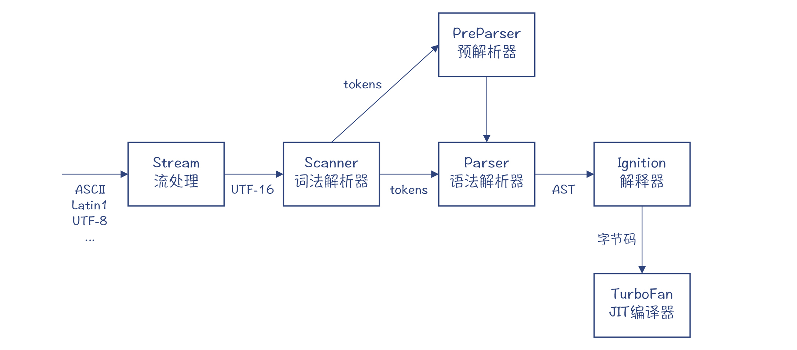
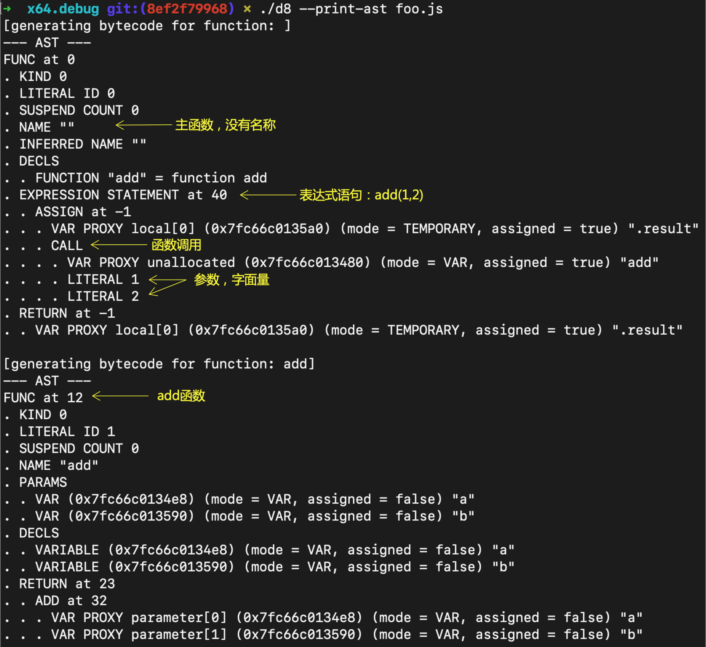
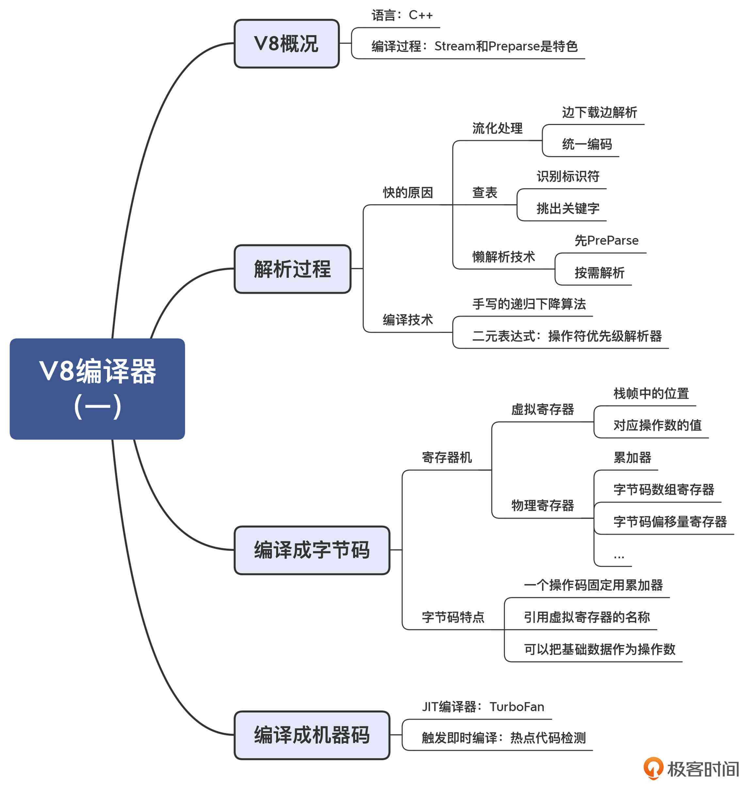

---
date: "2019-06-23"
---  
      
# 20 | JavaScript编译器（一）：V8的解析和编译过程
你好，我是宫文学。从这一讲开始，我们就进入另一个非常重要的编译器：V8编译器。

V8是谷歌公司在2008年推出的一款JavaScript编译器，它也可能是世界上使用最广泛的编译器。即使你不是编程人员，你每天也会运行很多次V8，因为JavaScript是Web的语言，我们在电脑和手机上浏览的每个页面，几乎都会运行一点JavaScript脚本。

扩展：V8这个词，原意是8缸的发动机，换算成排量，大约是4.0排量，属于相当强劲的发动机了。它的编译器，叫做Ignition，是点火装置的意思。而它最新的JIT编译器，叫做TurboFan，是涡轮风扇发动机的意思。

在浏览器诞生的早期，就开始支持JavaScript了。但在V8推出以后，它重新定义了Web应用可以胜任的工作。到今天，在浏览器里，我们可以运行很多高度复杂的应用，比如办公套件等，这些都得益于以V8为代表的JavaScript引擎的进步。2008年V8发布时，就已经比当时的竞争对手快10倍了；到目前，它的速度又已经提升了10倍以上。从中你可以看到，编译技术有多大的潜力可挖掘！

对JavaScript编译器来说，它最大的挑战就在于，当我们打开一个页面的时候，源代码的下载、解析（Parse）、编译（Compile）和执行，都要在很短的时间内完成，否则就会影响到用户的体验。

<!-- [[[read_end]]] -->

**那么，V8是如何做到既编译得快，又要运行得快的呢？**所以接下来，我将会花两讲的时间，来带你一起剖析一下V8里面的编译技术。在这个过程中，你能了解到V8是如何完成前端解析、后端优化等功能的，它都有哪些突出的特点；另外，了解了V8的编译原理，对你以后编写更容易优化的程序，也会非常有好处。

今天这一讲，我们先来透彻了解一下V8的编译过程，以及每个编译阶段的工作原理，看看它跟我们已经了解的其他编译器相比，有什么不同。

## 初步了解V8

首先，按照惯例，我们肯定要下载V8的源代码。按照[官方文档](https://v8.dev/docs/build)中的步骤，你可以下载源代码，并在本地编译。注意，你最好把它编译成Debug模式，这样便于用调试工具去跟踪它的执行，所以你要使用下面的命令来进行编译。

```
    tools/dev/gm.py x64.debug
    

```

编译完毕以后，进入v8/out/x64.debug目录，你可以运行./d8，这就是编译好的V8的命令行工具。如果你用过Node.js，那么d8的使用方法，其实跟它几乎是完全一样的，因为Node.js就封装了一个V8引擎。你还可以用GDB或LLDB工具来调试d8，这样你就可以知道，它是怎么编译和运行JavaScript程序了。

而v8/src目录下的，就是V8的源代码了。V8是用C++编写的。你可以重点关注这几个目录中的代码，它们是与编译有关的功能，而别的代码主要是运行时功能：


V8的编译器的构成跟Java的编译器很像，它们都有从源代码编译到字节码的编译器，也都有解释器（叫Ignition），也都有JIT编译器（叫TurboFan）。你可以看下V8的编译过程的图例。在这个图中，你能注意到两个陌生的节点：**流处理节点（Stream）和预解析器（PreParser）**，这是V8编译过程中比较有特色的两个处理阶段。



图1：V8的编译过程

注意：这是比较新的V8版本的架构。在更早的版本里，有时会用到两个JIT编译器，类似于HotSpot的C1和C2，分别强调编译速度和优化效果。在更早的版本里，还没有字节码解释器。现在的架构，引入了字节码解释器，其速度够快，所以就取消了其中一级的JIT编译器。

下面我们就进入到V8编译过程中的各个阶段，去了解一些编译器的细节。

## 超级快的解析过程（词法分析和语法分析）

首先，我们来了解一下V8解析源代码的过程。我在开头就已经说过，V8解析源代码的速度必须要非常快才行。源代码边下载边解析完毕，在这个过程中，用户几乎感觉不到停顿。**那它是如何实现的呢？**

有两篇文章就非常好地解释了V8解析速度快的原因。

一个是“[optimizing the scanner](https://v8.dev/blog/scanner)”这篇文章，它解释了V8在词法分析上做的优化。V8的作者们真是锱铢必较地在每一个可能优化的步骤上去做优化，他们所采用的技术很具备参考价值。

那我就按照我对这篇文章的理解，来给你解释一下V8解析速度快的原因吧：

第一个原因，是**V8的整个解析过程是流（Stream）化的**，也就是一边从网络下载源代码，一边解析。在下载后，各种不同的编码还被统一转化为UTF-16编码单位，这样词法解析器就不需要处理多种编码了。

第二个原因，是**识别标识符时所做的优化**，这也让V8的解析速度更快了一点。你应该知道，标识符的第一个字符（ID\_START）只允许用字母、下划线和\$来表示，而之后的字符（ID\_CONTINUE）还可以包括数字。所以，当词法解析器遇到一个字符的时候，我们首先要判断它是否是合法的ID\_START。

**那么，这样一个逻辑，通常你会怎么写？**我一般想也不想，肯定是这样的写法：

```
    if(ch >= 'A' && ch <= 'Z' || ch >='a' && ch<='z' || ch == '$' || ch == '_'){
        return true;
    }
    

```

但你要注意这里的一个问题，**if语句中的判断条件需要做多少个运算？**

最坏的情况下，要做6次比较运算和3次逻辑“或”运算。不过，V8的作者们认为这太奢侈了。所以他们通过查表的方法，来识别每个ASCII字符是否是合法的标识符开头字符。

这相当于准备了一张大表，每个字符在里面对应一个位置，标明了该字符是否是合法的标识符开头字符。这是典型的牺牲空间来换效率的方法。虽然你在阅读代码的时候，会发现它调用了几层函数来实现这个功能，但这些函数其实是内联的，并且在编译优化以后，产生的指令要少很多，所以这个方法的性能更高。

第三个原因，是**如何从标识符中挑出关键字**。

与Java的编译器一样，JavaScript的Scanner，也是把标识符和关键字一起识别出来，然后再从中挑出关键字。所以，你可以认为这是一个最佳实践。那你应该也会想到，识别一个字符串是否是关键字的过程，使用的方法仍然是查表。查表用的技术是“**完美哈希（perfect hashing）**”，也就是每个关键字对应的哈希值都是不同的，不会发生碰撞。并且，计算哈希值只用了三个元素：前两个字符（ID\_START、ID\_CONTINUE），以及字符串的长度，不需要把每个字符都考虑进来，进一步降低了计算量。

文章里还有其他细节，比如通过缩窄对Unicode字符的处理范围来进行优化，等等。从中你能体会到V8的作者们在提升性能方面，无所不用其极的设计思路。

除了词法分析，在语法分析方面，V8也做了很多的优化来保证高性能。其中，最重要的是“**懒解析**”技术（[lazy parsing](https://v8.dev/blog/preparser)）。

一个页面中包含的代码，并不会马上被程序用到。如果在一开头就把它们全部解析成AST并编译成字节码，就会产生很多开销：占用了太多CPU时间；过早地占用内存；编译后的代码缓存到硬盘上，导致磁盘IO的时间很长，等等。

所以，所有浏览器中的JavaScript编译器，都采用了懒解析技术。在V8里，首先由预解析器，也就是Preparser粗略地解析一遍程序，在正式运行某个函数的时候，编译器才会按需解析这个函数。你要注意，Preparser只检查语法的正确性，而基于上下文的检查则不是这个阶段的任务。你如果感兴趣的话，可以深入阅读一下这篇[介绍Preparser的文章](https://v8.dev/blog/preparser)，我在这里就不重复了。

你可以在终端测试一下懒解析和完整解析的区别。针对foo.js示例程序，你输入“./d8 – ast-print foo.js”命令。

```
    function add(a,b){
        return a + b;
    }
    
    //add(1,2)    //一开始，先不调用add函数
    

```

得到的输出结果是：


里面有一个没有名字的函数（也就是程序的顶层函数），并且它记录了一个add函数的声明，仅此而已。你可以看到，Preparser的解析结果确实够粗略。

而如果你把foo.js中最后一行的注释去掉，调用一下add函数，再次让d8运行一下foo.js，就会输出完整解析后的AST，你可以看看二者相差有多大：



最后，你可以去看看正式的Parser（在parser.h、parser-base.h、parser.cc代码中）。学完了这么多编译器的实现机制以后，以你现在的经验，打开一看，你就能知道，这又是用手写的递归下降算法实现的。

在看算法的过程中，我一般第一个就会去看它是如何处理二元表达式的。因为二元表达式看上去很简单，但它需要解决一系列难题，包括左递归、优先级和结合性。

V8的Parser中，对于二元表达式的处理，采取的也是一种很常见的算法：**操作符优先级解析器**（Operator-precedence parser）。这跟Java的Parser也很像，它本质上是自底向上的一个LR\(1\)算法。所以我们可以得出结论，在手写语法解析器的时候，遇到二元表达式，采用操作符优先级的方法，算是最佳实践了！

好了，现在我们了解了V8的解析过程，那V8是如何把AST编译成字节码和机器码并运行的呢？我们接着来看看它的编译过程。

## 编译成字节码

我们在执行刚才的foo.js文件时，加上“–print-bytecode”参数，就能打印出生成的字节码了。其中，add函数的字节码如下：


怎么理解这几行字节码呢？我来给你解释一下：

* Ldar a1：把参数1从寄存器加载到累加器（Ld=load，a=accumulator, r=register）。
* Add a0, \[0\]：把参数0加到累加器上。
* Return：返回（返回值在累加器上）。

不过，要想充分理解这几行简单的字节码，你还需要真正理解Ignition的设计。因为这些字节码是由Ignition来解释执行的。

Ignition是一个基于寄存器的解释器。它把函数的参数、变量等保存在寄存器里。不过，这里的寄存器并不是物理寄存器，而是指栈帧中的一个位置。下面是一个示例的栈帧：


图2：Ignition的栈帧

这个栈帧里包含了执行函数所需要的所有信息：

* 参数和本地变量。
* 临时变量：它是在计算表达式的时候会用到的。比如，计算2+3+4的时候，就需要引入一个临时变量。
* 上下文：用来在函数闭包之间维护状态。
* pc：调用者的代码地址。

栈帧里的a0、a1、r0、r1这些都是寄存器的名称，可以在指令里引用。而在字节码里，会用一个操作数的值代替。

整个栈帧的长度是在编译成字节码的时候就计算好了的。这就让Ignition的栈帧能适应不同架构对栈帧对齐的要求。比如AMD64架构的CPU，它就要求栈帧是16位对齐的。

Ignition也用到了一些物理寄存器，来提高运算的性能：

* **累加器：**在做算术运算的时候，一定会用到累加器作为指令的其中一个操作数，所以它就不用在指令里体现了；指令里只要指定另一个操作数（寄存器）就行了。
* **字节码数组寄存器：**指向当前正在解释执行的字节码数组开头的指针。
* **字节码偏移量寄存器：**当前正在执行的指令，在字节码数组中的偏移量（与pc寄存器的作用一样）。
* …

Ignition是我们见到的第一个寄存器机，它跟我们之前见到的Java和Python的栈机有明显的不同。所以，你可以先思考一下，Ignition会有什么特点呢？

我来给你总结一下吧。

1.  它在指令里会引用寄存器作为操作数，寄存器在进入函数时就被分配了存储位置，在函数运行时，栈帧的结构是不变的。而对比起来，栈机的指令从操作数栈里获取操作数，操作数栈随着函数的执行会动态伸缩。
2.  Ignition还引入了累加器这个物理寄存器作为缺省的操作数。这样既降低了指令的长度，又能够加快执行速度。

当然，Ignition没有像生成机器码那样，用一个寄存器分配算法，让本地变量、参数等也都尽量采用物理寄存器。这样做的原因，一方面是因为，寄存器分配算法会增加编译的时间；另一方面，这样不利于代码在解释器和TurboFan生成的机器代码之间来回切换（因为它要在调用约定之间做转换）。采用固定格式的栈帧，Ignition就能够在从机器代码切换回来的时候，很容易地设置正确的解释器栈帧状态。

我把更多的字节码指令列在了下面，你可以仔细看一看Ignition都有哪些指令，从而加深对Ignition解释运行机制的理解。同时，你也可以跟我们已经学过的Java和Python的字节码做个对比。这样呀，你对字节码、解释器的了解就更丰富了。


来源：[Ignition Design Doc](https://docs.google.com/document/d/11T2CRex9hXxoJwbYqVQ32yIPMh0uouUZLdyrtmMoL44/mobilebasic)

## 编译成机器码

好，前面我提到了，V8也有自己的JIT编译器，叫做TurboFan。在学过Java的JIT编译器以后，你可以预期到，TurboFan也会有一些跟Java JIT编译器类似的特性，比如它们都是把字节码编译生成机器码，都是针对热点代码才会启动即时编译的。那接下来，我们就来验证一下自己的想法，并一起来看看TurboFan的运行效果究竟如何。

我们来看一个示例程序add.js：

```
    function add(a,b){
        return a+b;
    }
    
    for (i = 0; i<100000; i++){
        add(i, i+1);
        if (i%1000==0)
            console.log(i);
    }
    

```

你可以用下面的命令，要求V8打印出优化过程、优化后的汇编代码、注释等信息。其中，“–turbo-filter=add”参数会告诉V8，只优化add函数，否则的话，V8会把add函数内联到外层函数中去。

```
    ./d8 --trace-opt-verbose \
        --trace-turbo \
        --turbo-filter=add \
        --print-code \
        --print-opt-code \
        --code-comments \
        add.js
    

```

注释：你用./d8 \--help，就能列出V8可以使用的各种选项及其说明，我把上面几个选项的含义解释一下。  
–trace-opt-verbose：跟踪优化过程，并输出详细信息  
–trace-turbo：跟踪TurboFan的运行过程  
–print-code：打印生成的代码  
–print-opt-code：打印优化的代码  
–code-comment：在汇编代码里输出注释

程序一开头是解释执行的。在循环了24000次以后，V8认为这是热点代码，于是启动了Turbofan做即时编译。

最后生成的汇编代码有好几十条指令。不过你可以看到，大部分指令是用于初始化栈帧，以及处理逆优化的情况。真正用于计算的指令，是下面几行指令：


对这些汇编代码的解读，以及这些指令的产生和优化过程，我会在下一讲继续给你讲解。

## 课程小结

今天这讲，我们从总体上考察了V8的编译过程，我希望你记住几个要点：

* 首先，是**编译速度**。由于JavaScript是在浏览器下载完页面后马上编译并执行，它对编译速度有更高的要求。因此，V8使用了一边下载一边编译的技术：懒解析技术。并且，在解析阶段，V8也比其他编译器更加关注处理速度，你可以从中学到通过查表减少计算量的技术。
* 其次，我们认识了一种新的**解释器Ignition**，它是基于寄存器的解释器，或者叫寄存器机。Ignition比起栈机来，更有性能优势。
* 最后，我们初步使用了一下V8的**即时编译器TurboFan**。在下一讲中，我们会更细致地探讨TurboFan的特性。

按照惯例，这一讲的思维导图我也给你整理出来了，供你参考：



## 一课一思

你能否把Ignition的字节码和Java、Python的字节码对比一下。看看它们有哪些共同之处，有哪些不同之处？

欢迎在留言区分享你的答案，也欢迎你把今天的内容分享给更多的朋友。

## 参考资料

1.  这两篇文章分析了V8的解析器为什么速度非常快：[Blazingly fast parsing, part 1: optimizing the scanner](https://v8.dev/blog/scanner)，[Blazingly fast parsing, part 2: lazy parsing](https://v8.dev/blog/preparser)
2.  这篇文章描述了Ignition的设计：[Ignition Design Doc](https://docs.google.com/document/d/11T2CRex9hXxoJwbYqVQ32yIPMh0uouUZLdyrtmMoL44/mobilebasic)，我在GitHub上也放了一个[拷贝](<https://github.com/RichardGong/CompilersInPractice/blob/master/v8/Ignition Design Doc.pdf>)
3.  这篇文章有助于你了解Ignition的字节码：[Understanding V8’s bytecode](https://medium.com/dailyjs/understanding-v8s-bytecode-317d46c94775)
4.  V8项目的[官网](https://v8.dev/)，这里有一些重要的博客文章和文档