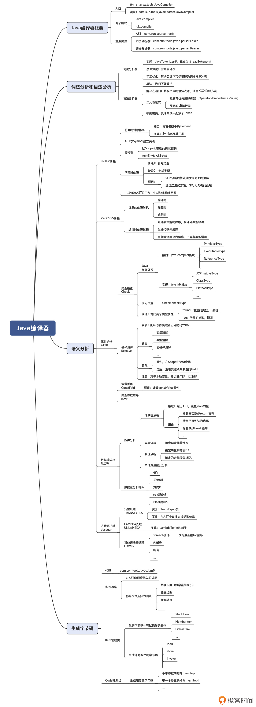
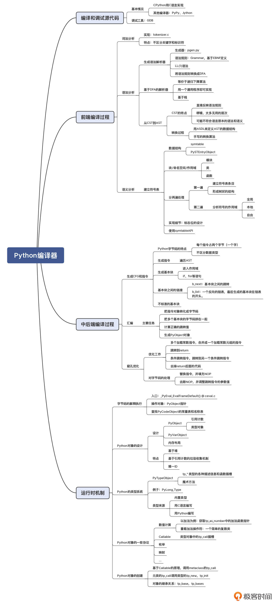
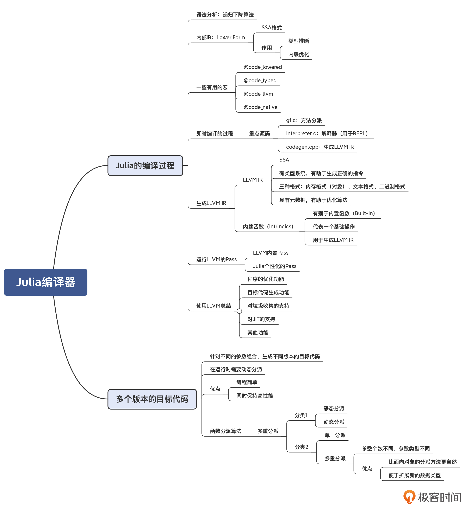
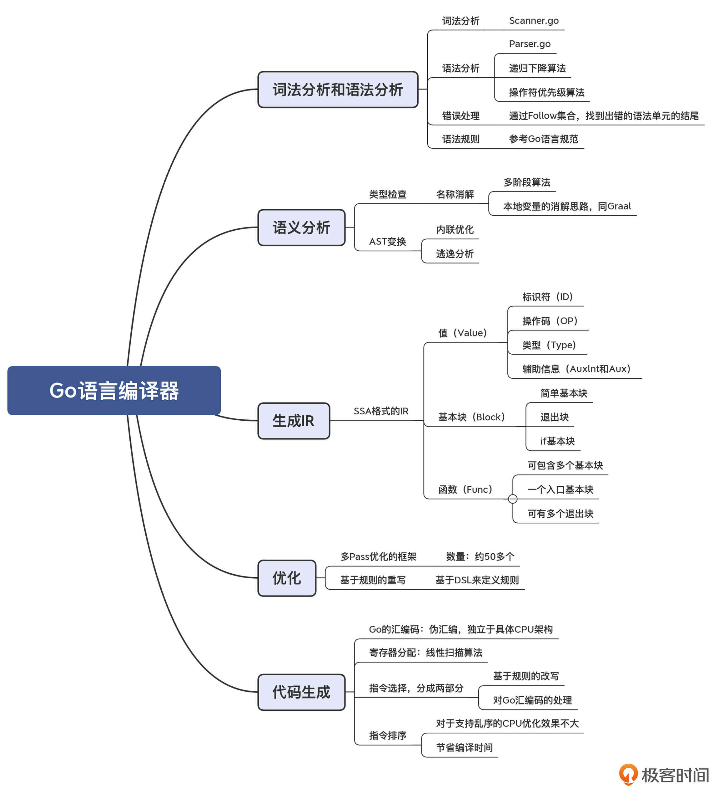

---
date: "2019-06-23"
---  
      
# 划重点 | 7种编译器的核心概念与算法
你好，我是编辑王惠。

阶段性的总结复习和验证成果是非常重要的。所以，在8月7日到8月12日这为期一周的期中复习时间里，我们先来巩固一下“真实编译器解析篇”中的重点知识。你可以通过学习委员朱英达总结梳理的**划重点内容，以及涵盖了关键知识点的7张思维导图**，来回顾7种语言编译器的核心概念与算法。

另外，宫老师还精心策划了10道考试题，让你能在行至半程之时，做好自检，及时发现知识漏洞，到时候一起来挑战一下吧！

在期中复习周的最后，我还会邀请一位优秀的同学来做一次学习分享。通过他的学习故事，你也可以借此对照一下自己的编译原理学习之路。

好，下面我们就一起来复习这些核心的编译原理概念与算法知识吧。

* * *

## Java编译器（javac）

Java是一种广泛使用的计算机编程语言，主要应用于企业级Web应用开发、大型分布式系统以及移动应用开发（Android）。到现在，Java已经是一门非常成熟的语言了，而且它也在不断进化、与时俱进，泛型、函数式编程、模块化等特性陆续都增加了进来。与此同时，Java的编译器和虚拟机中所采用的技术，也比 20 年前发生了天翻地覆的变化。

Java的字节码编译器（javac）是用Java编写的，它实现了自举。启动Java编译器需要Java虚拟机（默认是HotSpot虚拟机，使用C++编写）作为宿主环境。

<!-- [[[read_end]]] -->

javac编译器的编译过程，主要涉及到了这样一些关键概念和核心算法：

* 词法分析阶段：基于有限自动机的理论实现。在处理标识符与关键字重叠的问题上，采用了先都作为标识符识别出来，然后再把其中的关键词挑出来的方式。
* 语法分析阶段：使用了自顶向下的递归下降算法、LL\(k\)方式以及多Token预读；处理左递归问题时，采用了标准的改写文法的方法；处理二元表达式时，采用了自底向上的运算符优先级解析器。
* 语义分析阶段：会分为多个小的阶段，且并不是顺序执行的，而是各阶段交织在一起。
* 语义分析阶段主要包含：ENTER（建立符号表）、PROCESS（处理注解）、ATTR（属性分析）、FLOW（数据流分析）、TRANSTYPES（处理泛型）、TRANSPATTERNS（处理模式匹配）、UNLAMBDA（处理 Lambda）和 LOWER（处理其他所有的语法糖，比如内部类、foreach 循环等）、GENERATE 阶段（生成字节码）等。在ATTR和FLOW这两个阶段，编译器完成了主要的语义检查工作。
* 注意：生成字节码是一个比较机械的过程，编译器只需要对 AST 进行深度优先的遍历即可。在这个过程中会用到前几个阶段形成的属性信息，特别是类型信息。

参考资料：

1.  关于注解的官方教程，参考[这个链接](https://docs.oracle.com/javase/tutorial/java/annotations/)。
2.  关于数据流分析的理论性内容，参考龙书（Compilers Principles, Techniques and Tools）第二版的9.2和9.3节。也可以参考《编译原理之美》 的第[27](https://time.geekbang.org/column/article/155338)、[28](https://time.geekbang.org/column/article/156878)讲，那里进行了比较直观的讲述。
3.  关于半格这个数学工具，可以参考龙书第二版的9.3.1部分，也可以参考《编译原理之美》的[第28讲](https://time.geekbang.org/column/article/156878)。
4.  Java语言规范第六章，参考[Java虚拟机指令集](https://docs.oracle.com/javase/specs/jvms/se13/html/jvms-6.html)。

## Java JIT编译器（Graal）

对于编译目标为机器码的Java后端的编译器来说，主要可以分AOT和JIT两类：如果是在运行前一次性生成，就叫做提前编译（AOT）；如果是在运行时按需生成机器码，就叫做即时编译（JIT）。Java以及基于JVM的语言，都受益于JVM的JIT编译器。

在[JDK的源代码](https://hg.openjdk.java.net/jdk/jdk11/raw-file/tip/doc/building.html)中，你能找到src/hotspot目录，这是 JVM 的运行时：HotSpot虚拟机，它是用C++编写的，其中就包括JIT编译器。

Graal是Oracle公司推出的一个完全用Java语言编写的JIT编译器。Graal编译器有两个特点：内存安全（相比C++实现的Java JIT编译器而言）；与Java配套的各种工具（比如ID）更友好、更丰富。

Java JIT编译器的编译过程，主要涉及到了这样一些关键概念和核心算法：

* 分层编译：C0（解释器）、C1（客户端编译器）、C2（服务端编译器）。不同阶段的代码优化激进的程度不同，且存在C2降级回C1的逆优化。
* IR采用了“节点之海（Sea of Nodes）”，整合了控制流图与数据流图，符合 SSA 格式，有利于优化算法的编写和维护。
* 两个重要的优化算法：内联优化和逃逸分析。
* 几个重要的数据结构：HIR（硬件无关的IR）、LIR（硬件相关的IR）、CFG（控制流图）。
* 寄存器分配算法：LinearScan。

**金句摘录：“编译器开发的真正的工作量，都在中后端。”**

参考资料：

1.  GraalVM项目的[官方网站](https://www.graalvm.org/)；Graal的[Github地址](https://github.com/oracle/graal)；Graal项目的[出版物](https://github.com/oracle/graal/blob/master/docs/Publications.md)。
2.  基于图的IR的必读论文：程序依赖图-[J. Ferrante, K. J. Ottenstein, and J. D. Warren. The program dependence graph and its use in optimization](https://www.cs.utexas.edu/users/less/reading/spring00/ferrante.pdf). July 1987；Click的论文-[A Simple Graph-Based Intermediate Representation](https://www.oracle.com/technetwork/java/javase/tech/c2-ir95-150110.pdf)；介绍Graal IR的论文-[Graal IR: An Extensible Declarative Intermediate Representation](http://citeseerx.ist.psu.edu/viewdoc/download?doi=10.1.1.726.5496&rep=rep1&type=pdf)。
3.  关于优化算法：多态内联-[Inlining of Virtual Methods](http://extras.springer.com/2000/978-3-540-67660-7/papers/1628/16280258.pdf)；逃逸分析-[Escape Analysis for Java](https://www.cc.gatech.edu/~harrold/6340/cs6340_fall2009/Readings/choi99escape.pdf)；部分逃逸分析-[Partial Escape Analysis and Scalar Replacement for Java](http://www.ssw.uni-linz.ac.at/Research/Papers/Stadler14/Stadler2014-CGO-PEA.pdf)。

## Python编译器（CPython）

Python诞生于上个世纪90年代初，作者是荷兰计算机程序员吉多·范罗苏姆（Guido van Rossum）。Python语言的特点是：自身语法简单，容易掌握，强调一件事情只能用一种方法去做；具备丰富的现代语言特性，如OOP、FP等；其实现机制决定了易于集成C++扩展，不仅便于利用一些已有的、经典开源的高性能的C/C++库，同时也可以很方便地编写自己的C++扩展，实现一些高性能模块。

另外，Python使用了pgen这样的生成编译器的工具。pgen能够基于语法规则生成解析表（Parse Table），供语法分析程序使用。你可以通过修改规则文件来修改Python语言的语法，pgen能给你生成新的语法解析器。它是把EBNF转化成一个NFA，然后再把这个NFA转换成DFA。基于这个DFA，在读取Token的时候，编译器就知道如何做状态迁移，并生成解析树。Python用的是 LL\(1\) 算法。

CPython编译器编译器的编译过程，主要涉及到了这样一些关键概念和核心算法：

* 语法分析：首先是生成CST（Concret Syntax Tree，具体语法树），接着生成AST（抽象语法树）。CST的特点是完全基于源程序结构构建出树结构，它比AST啰嗦，但更精确地反映了语法推导的过程。而AST的特点是去掉了树结构上繁杂冗余的树枝节点，更简明扼要，更准确地表达了程序的结构。
* 语义分析：Python通过一个建立符号表的过程来做相关的语义分析，包括做引用消解等。Python语言使用变量的特点是不存在变量声明，每个变量都是赋值即声明，因此在给一个变量赋值时需要检查作用域，确认当前操作是给全局的变量赋值，还是在局部给声明新变量。
* 生成字节码：这个工作实际上包含了生成 CFG、为每个基本块生成指令，以及把指令汇编成字节码，并生成 PyCodeObject 对象的过程。另外，生成的字节码在最后放到解释器里执行之前，编译器还会再做一步窥孔优化工作。
* 运行时机制：Python的运行时设计的核心，就是PyObject对象，Python对象所有的特性都是从PyObject的设计中延伸出来的。其虚拟机采用了栈机的架构。

参考资料：

1.  [python.org网站](https://www.python.org/)：下载[3.8.1版本的源代码](https://www.python.org/ftp/python/3.8.1/Python-3.8.1.tgz)。
2.  GDB的安装和配置：参考[这篇文章](https://github.com/RichardGong/CompilersInPractice/edit/master/python/GDB.md)。
3.  Python的[开发者指南](https://devguide.python.org/)网站。
4.  pgen的工具程序：[Parser/pgen](https://github.com/python/cpython/blob/3.9/Parser/pgen/pgen.py)。  
    注：由于CPython最新的Master分支上的代码调整，此处pgen的链接地址调整为CPython3.9版本分支上的pgen相关代码。
5.  Python的[字节码的说明](https://docs.python.org/zh-cn/3/library/dis.html#python-bytecode-instructions)。
6.  Python的[内置类型](https://docs.python.org/3.8/library/stdtypes.html)。

## JavaScript编译器（V8）

V8是谷歌公司在2008年推出的一款JavaScript编译器，主要由C++编写而成。V8主要应用于Chrome浏览器，后来也被开源社区中诸如Node.js等项目所使用。其最为突出的特点就是“快”，由于JavaScript是在浏览器下载完页面后马上编译并执行，它对编译速度有更高的要求。因此，V8采用了一系列技术手段优化编译和启动阶段运行速度。

在设计上，V8结合了分阶段懒解析、空间换时间等设计思路，突出了解析、启动阶段运行的时间开销。

* 对源代码的Parse，进行了流（Stream）化处理，也就是边下载边解析。
* 预解析（PreParse）处理，也就是所谓懒解析最核心的设计思想，每个JS函数只有被执行的时候才会解析函数体的内部逻辑。

另外，V8的很多地方体现出了与Java编译器异曲同工之处。比如，它将JavaScript源代码的编译，分为了由Ignition字节码解释执行和TurboFan的JIT编译机器代码执行两部分组成，类似于Java编译器的字节码解释执行和Graal优化编译后执行两阶段；TurboFan编译器的IR也采用了Sea of Nodes，这一点类似于Java的Graal编译器，且也涉及到了内联优化和逃逸分析算法。

其运行方式分为两类：

* 常规情况下，Ignition字节码解释执行；
* 编译器判定热点代码，TurboFan JIT编译成机器码执行，并且TurboFan会依赖一些Ignition解释执行过程中的运行时数据，来进行进一步优化，使机器码尽可能高效。

因为JavaScript是动态类型语言，因此对函数参数类型的推断以及针对性优化是一个V8的核心技术。V8涉及到的其他优化算法有：

* 隐藏类（Hidden Class）。相同“形状”的JS对象会被以同一个隐藏类维护其数据结构。
* 内联缓存（Inline Caching）。针对隐藏类查找属性值时的指针偏移量，进行内联缓存，这属于结合隐藏类技术做进一步性能的优化。

参考资料：

1.  V8项目的[官网](https://v8.dev/)，以及V8的源代码-[官方文档](https://v8.dev/docs/build)。
2.  了解V8的解析器为什么速度非常快：[Blazingly fast parsing, part 1: optimizing the scanner](https://v8.dev/blog/scanner)；[Blazingly fast parsing, part 2: lazy parsing](https://v8.dev/blog/preparser)。
3.  了解Ignition的设计：[Ignition Design Doc](https://docs.google.com/document/d/11T2CRex9hXxoJwbYqVQ32yIPMh0uouUZLdyrtmMoL44/mobilebasic)，宫老师在Github上也放了一个[拷贝](<https://github.com/RichardGong/CompilersInPractice/blob/master/v8/Ignition Design Doc.pdf>)。
4.  了解Ignition的字节码：[Understanding V8’s bytecode](https://medium.com/dailyjs/understanding-v8s-bytecode-317d46c94775)。
5.  V8的指针压缩技术：[Pointer Compression in V8](https://v8.dev/blog/pointer-compression)。
6.  介绍V8基于推理的优化机制：[An Introduction to Speculative Optimization in V8](https://ponyfoo.com/articles/an-introduction-to-speculative-optimization-in-v8)。
7.  关于Ignition字节码做优化的论文：[Register equivalence optimization](https://docs.google.com/document/d/1wW_VkkIwhAAgAxLYM0wvoTEkq8XykibDIikGpWH7l1I/edit?ts=570d7131#heading=h.6jz9dj3bnr8t)，宫老师在Github上也放了一份[拷贝](<https://github.com/RichardGong/CompilersInPractice/blob/master/v8/Ignition_ Register Equivalence Optimization.pdf>)。

## Julia的编译器

Julia语言最初发行于2012年，其最初是为了满足高性能数值分析和计算科学的需要而设计的。Julia同时兼具了静态编译型和动态解释型语言的优点：一方面它的性能很高，可以跟Java和C语言媲美；另一方面，它又是动态类型的，编写程序时不需要指定类型。

Julia编译器的特点是：

* 作为动态类型语言，却能拥有静态类型语言的执行速度，最关键的原因是使用了LLVM作为编译器后端，针对动态类型的变量，在运行时由编译器JIT编译生成多个版本的目标代码，保证程序的高性能；
* 由C、C++、Lisp和Julia四种语言开发而成，编译器前端主要采用Lisp实现；
* 考虑到对函数式编程的支持，有别于面向对象编程的“单一分派”，Julia的编译器提供了“多重分派”的功能。

Julia编译器的编译过程，主要涉及到了这样一些关键概念和核心算法：

* Julia的编译器也是采用了递归下降算法来实现语法分析。
* 其内部IR采用了SSA格式，主要作用是完成类型推断和内联优化。
* Julia的IR会被转化成LLVM的IR，从而进一步利用LLVM的功能。在转换过程中，会用Julia的内建函数，这些内建函数代表了Julia语言中抽象度比较高的运算功能。

参考资料：

1.  LLVM的[官网](https://llvm.org/)，以及LLVM的[源代码](https://github.com/llvm/llvm-project)。
2.  Julia的开发者文档中有对如何使用LLVM的介绍：[Working with LLVM](https://docs.julialang.org/en/v1/devdocs/llvm/)。
3.  对LLVM中的各种Pass的介绍：[LLVM’s Analysis and Transform Passes](https://llvm.org/docs/Passes.html)。
4.  《编译原理之美》的[第25讲](https://time.geekbang.org/column/article/153192)和[第26讲](https://time.geekbang.org/column/article/154438)：宫老师对LLVM后端及其命令行工具做了介绍，并且还手工调用LLVM的API，示范了针对不同的语法结构（比如if结构）应该如何生成LLVM IR，最后即时编译并运行。你可以参考一下。

## Go语言编译器（gc）

Go语言是Google开发的一种静态强类型、编译型、并发型，并具有垃圾回收功能的编程语言，又名Golang。Go广泛应用于Google的产品以及许多其他组织和开源项目，其创建的初衷就是主要面向于部署于大量服务器之间的分布式程序，也就是我们今天所说的“云”。因此，Go的主要优势聚焦于服务端高并发场景。

Go语言编译器的特点是：

* gc编译器除了少量标准库的内容是用汇编写的以外，其绝大部分逻辑，都是用Go语言本身写的，因此实现了较为完整的自举（Bootstraping），从前端到后端的整个流程都使用Go语言实现，在编程语言中是较为罕见的；
* 教科书级别的设计，源代码完全自举、代码干净利索，因此非常适合作为学习参考。

Go语言编译器的编译过程，主要涉及到了这样一些关键概念和核心算法：

* 编译器前端：gc编译器的词法分析和语法分析使用的都是非常经典、传统的算法，如手写的递归下降算法、处理二元表达式时使用操作符优先级算法。
* 中间代码阶段：SSA格式的IR；基于CFG的IR，利于“死代码”的发现与删除；多遍（Pass）的优化框架。
* 机器码生成阶段：线性扫描算法；官方的gc编译器并没做指令重排，这是基于编译过程中时间开销的考虑。

参考资料：

1.  介绍gc编译器的主要结构：[Introduction to the Go compiler](https://github.com/golang/go/blob/release-branch.go1.14/src/cmd/compile/README.md)官方文档。
2.  介绍gc编译器的SSA：[Introduction to the Go compiler’s SSA backend](https://github.com/golang/go/blob/release-branch.go1.14/src/cmd/compile/internal/ssa/README.md)官方文档。
3.  Go compiler internals: adding a new statement to Go - [Part 1](https://eli.thegreenplace.net/2019/go-compiler-internals-adding-a-new-statement-to-go-part-1/)、[Part2](https://eli.thegreenplace.net/2019/go-compiler-internals-adding-a-new-statement-to-go-part-2/)。在这两篇博客里，作者做了一个实验：如果往Go里面增加一条新的语法规则，需要做哪些事情。我们能够很好地、贯穿性地了解一个编译器的方法。
4.  介绍gc编译器的SSA优化规则描述语言的细节：[Go compiler: SSA optimization rules description language](https://quasilyte.dev/blog/post/go_ssa_rules/)。
5.  介绍Go汇编的细节：[A Primer on Go Assembly](https://github.com/teh-cmc/go-internals/blob/master/chapter1_assembly_primer/README.md)和[A Quick Guide to Go’s Assembler](https://golang.org/doc/asm)。gc编译器采用的汇编语言是它自己的一种格式，是“伪汇编”。

## MySQL的编译器

MySQL是一个开放源码的关系数据库管理系统，原开发者为瑞典的MySQL AB公司，后几经辗转，目前归属于Oracle旗下产品。在过去，MySQL性能高、成本低、可靠性好，因此成为了最流行的开源数据库。SQL可以称得上是最成功的DSL（特定领域语言）之一，MySQL中的SQL解析模块则是这门DSL的非常具有可参考性的一个实现。MySQL使用C++编写，有少量几个代码文件是用C语言编写的。

MySQL的编译器的特点是：

* SQL作为DSL中最具有代表性的一种语言，学习它的编译器的实现，可以为我们自己设计面向业务的DSL提供参考。
* 手写的词法分析、用工具（bison，GNU的yacc）生成的语法分析。
* 基于LALR处理二元表达式。
* 中后端优化方面：MySQL是解释执行，并没有做太多的机器相关优化；在机器无关优化方面，除了一些编译领域传统的优化技术之外，还做了一些针对数据库特定场景的优化方式。

MySQL的编译器的编译过程，主要涉及到了这样一些关键概念和核心算法：

**词法分析和语法分析**

* 词法分析：手写的词法分析器。
* 语法分析：由bison生成。bison是一种基于EBNF生成语法分析程序的工具，可视为GNU版的yacc。
* bison支持的语法分析算法：LALR算法。

**语义分析**

* MySQL中一些重要的数据结构：THD线程对象、Table\_ident对象。
* 上下文处理：基于contextualize的上下文处理。
* 基于数据库“业务逻辑”的引用消解：库名、表名、列名、入口、查找和作用域（子查询）

**机器无关优化**

* 典型的优化：常量传播、死代码消除、常量折叠。
* 针对数据库场景的优化：产生执行计划、生成JOIN对象。

**机器相关优化**

* MySQL实际上对表达式是解释执行，所以并没有真正意义上做任何机器相关优化。
* 列举了PG另一种类似MySQL的DB，有通过LLVM的JIT优化。

参考资料：

1.  下载[MySQL的源代码](https://github.com/mysql/mysql-server)；跟踪MySQL的执行过程，要用Debug模式编译MySQL，具体步骤可以参考这篇[开发者文档](https://dev.mysql.com/doc/internals/en/cmake.html)。
2.  MySQL的内行手册：[MySQL Internals Manual](https://dev.mysql.com/doc/internals/en/)。它能给我们提供一些重要的信息，但文档内容经常跟源代码的版本不同步，比如介绍源代码的目录结构的信息就过时了。需要注意一下。
3.  bison的[手册](http://www.gnu.org/software/bison/manual/)。
4.  如果要加深对MySQL内部机制的了解，宫老师推荐了两本书：OReilly的《Understanding MySQL Internals》，以及《Expert MySQL》。