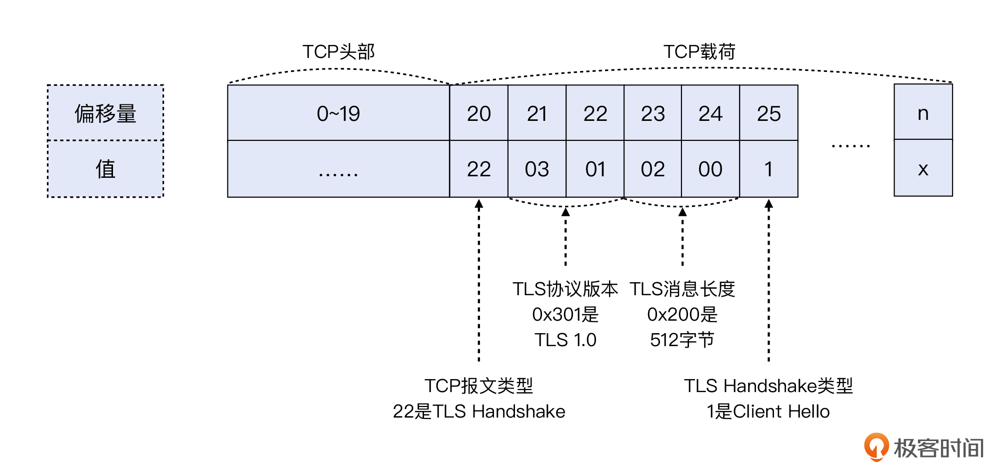
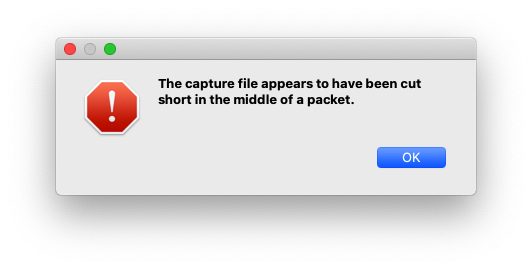

---
date: "2019-06-23"
---  
      
# 02 | 抓包分析技术初探：你会用tcpdump和Wireshark吗？
你好，我是胜辉。

咱们这门课最核心的内容，恐怕就是抓包分析了。在众多的排查技术中，抓包分析可以说是“皇冠上的明珠”，也是包括我自己在内的很多人一直努力的方向。所以，tcpdump和Wireshark这两个工具在工程师心目中的位置，自然不用我多提了。相信你能来上这门课，也很大程度上是想把这两个工具好好学一下的。

不过，你了解这两个工具的过去吗？它们最初是怎么出现的，又是什么样的机制使得它们如此强大呢？

这节课，我就带你走进抓包分析技术大家庭。你会从中了解到抓包分析技术的光荣历史和渊源，以及通过实际的例子，感受到它的精妙设计和强大能力。当你理解了tcpdump和Wireshark的初步用法之后，你对常见的抓包需求场景也就能心里有数，知道大概从哪里下手了。

## 这些抓包技术名词，你分清楚了吗？

首先，我帮你捋一下这些技术的来龙去脉甚至“八卦”，这样你在进入后面课程的具体技术学习时，就会多几分亲近感，也多几分底气了。

* **tcpdump**

我们先来认识大名鼎鼎的tcpdump。1988年，劳伦斯伯克利国家实验室的四位工程师编写出了tcpdump这个殿堂级的工具。这个实验室呢，也很值得我们尊敬。这里涌现过[13位](https://www.lbl.gov/nobelists)诺贝尔奖获得者，其中包括1997年获得物理学奖的华人巨匠朱棣文，可见这是多么耀眼的一块科学圣地。

<!-- [[[read_end]]] -->

这个地方能做出开创性的技术，确实一点都不令人意外。tcpdump可以工作在各种Unix类的操作系统上，包括Linux、FreeBSD、macOS、Solaris等，也是目前使用最为广泛的抓包工具之一。

但是tcpdump要过滤报文的话，还要依赖一个底层能力：BPF。

* **BPF**

BPF全称是Berkeley Packet Filter（也叫BSD Packet Filter），它是tcpdump等抓包工具的底层基础。在BPF出现之前，虽然各家操作系统都有自己的抓包工具，但也都有这样或那样的不足。比如，有些系统把所有网络报文一股脑儿塞给用户空间程序，开销非常大；而有些系统虽然有报文过滤功能，但是工作很不稳定。

为了解决这些问题，1992年，也还是在劳伦斯伯克利国家实验室，当初tcpdump的两个作者史蒂文·麦克凯恩（Steven McCanne）和范·雅各布森（Van Jacobson）发表了关于BPF的[论文](https://www.tcpdump.org/papers/bpf-usenix93.pdf)，它以一种新的基于寄存器的虚拟机方式，实现了高效稳定的报文过滤功能。从此以后，抓包技术这棵大树有了一个甚为强大的根基，而构建在BPF之上的libpcap、tcpdump等不断枝繁叶茂，进一步使得抓包工作变得方便、稳定，我们这些凡夫俗子才好在这棵大树底下，下棋乘凉。

* **libpcap**

BPF实现了抓包虚拟机，但它是如何被用户空间程序使用的呢？于是，libpcap出现了，它提供了API给用户空间程序（包括tcpdump、Wireshark等），使得后者能方便地调用BPF实现抓包过滤等功能。也就是说，libpcap是BPF的一层API封装。

那么到目前为止，我们应该就能明白tcpdump是怎么工作的了：tcpdump调用了libpcap接口，后者调用BPF实现了报文过滤和抓取。我们来看一下示意图：


* **WinPcap**

Windows上也可以做到类似Linux这样的抓包，其底层就是依赖WinPcap，它是libpcap的Windows版本。微软很早就支持了图形界面抓包工具，从Windows NT时代开始，人们就可以用Network Monitor这个工具在Windows平台上进行网络排查。十多年前，我还在做Windows工程师时，也时常用到这个工具。算起来，我跟抓包工具结缘也有不少年头了（哎，又暴露年龄了）。

* **eBPF**

Linux从3.18版本开始支持extended BPF，简称eBPF。这是一个更加通用的内核接口，不仅能支持网络抓包，还能支持网络以外的内核观测点的信息收集等工作。所以事实上，eBPF已经是一个通用工具，而不再局限在网络工具这个角色定位上了。

同时，也因为它在数据面上的性能很出色，所以现在不少公司正在探索，利用它实现一些数据面的开发工作，比如高性能的负载均衡。相信不久的将来，我们就能看到越来越多的eBPF的应用案例了。

## 为什么抓包文件有好几种类型？

如果你留意过抓包文件后缀名的话，会发现有pcap、cap、pcapng这几种不同的后缀名。为什么会有好几种类型呢？下面我来给你说道说道。

* **pcap**

这个是libpcap的格式，也是tcpdump和Wireshark等工具默认支持的文件格式。pcap格式的文件中除了报文数据以外，也包含了抓包文件的元信息，比如版本号、抓包时间、每个报文被抓取的最大长度，等等。

* **cap**

cap文件可能含有一些libpcap标准之外的数据格式，它是由一些tcpdump以外的抓包程序生成的。比如Citrix公司的netscaler负载均衡器，它的nstrace命令生成的抓包文件，就是以.cap为扩展名的。这种文件除了包含pcap标准定义的信息以外，还包含了LB的前端连接和后端连接之间的mapping信息。Wireshark是可以读取这些.cap文件的，只要在正确的版本上。

* **pcapng**

pcap格式虽然满足了大部分需求，但是它也有一些不足。比如，现在多网口的情况已经越来越常见了，我们也经常需要从多个网络接口去抓取报文，那么在抓包文件里，如果不把这些报文跟所属的网口信息展示清楚，那我们的分析，岂不是要张冠李戴了吗？

为了弥补pcap格式的不足，人们需要有一种新的文件格式，pcapng就出现了。有了它，单个抓包文件就可以包含多个网络接口上，抓取到的报文了。


我们可以看到，上图中右边的pcapng格式是包含报文的网络接口信息的，而左边的pcap就没有。

当然，pcapng还有很多别的特性，比如更细粒度的报文时间戳、允许对报文添加注释、更灵活的元数据，等等。如果你是用版本比较新的Wireshark和tshark做抓包，默认生成的抓包文件就已经是pcapng格式了。

## tcpdump怎么用？

好了，现在我们对抓包分析的基础知识就有一定的了解了，下面我们就来着重学习下其中的重点，也就是tcpdump和Wireshark这两个分析工具。

我们先来看看tcpdump。

### tcpdump的基本用法

虽然tcpdump有完备的文档和命令手册，但如果你不经常抓包，并不能掌握得特别熟练。我个人的经验是，**抓包技术课是一门实践课，不是理论课**。既然是实践课，就要多多实践，从鲜活的案例中积累起来的经验无比宝贵。

在这门课程里，我也会把自己过往多年的实践总结，毫无保留地分享给你。今天这节课，我们先初步学一些技巧，当作“开胃菜”，希望合你胃口。

**如何抓取报文？**

用tcpdump抓取报文，最常见的场景是要抓取去往某个ip，或者从某个ip过来的流量。我们可以用host \{对端IP\} 作为抓包过滤条件，比如：

```
    tcpdump host 10.10.10.10
    

```

另一个常见的场景是抓取某个端口的流量，比如，我们想抓取SSH的流量，那么可以这样：

```
    tcpdump port 22
    

```

还有不少参数我们也经常用到，比如：

* \-w 文件名，可以把报文保存到文件；
* \-c 数量，可以抓取固定数量的报文，这在流量较高时，可以避免一不小心抓取过多报文；
* \-s 长度，可以只抓取每个报文的一定长度，后面我会介绍相关的使用场景；
* \-n，不做地址转换（比如IP地址转换为主机名，port 80转换为http）；
* \-v/-vv/-vvv，可以打印更加详细的报文信息；
* \-e，可以打印二层信息，特别是MAC地址；
* \-p，关闭混杂模式。所谓混杂模式，也就是嗅探（Sniffering），就是把目的地址不是本机地址的网络报文也抓取下来。

这里还有个-X参数的用法，我用视频形式给你介绍一下。

**如何过滤报文？**

最近我们有个实际的需求，要统计我们某个HTTPS VIP的访问流量里，TLS版本（现在主要是TLS1.0、1.1、1.2、1.3）的分布。为了控制抓包文件的大小，我们又不想什么TLS报文都抓，只想抓取TLS版本信息。这该如何做到呢？要知道，针对这个需求，tcpdump本身没有一个现成的过滤器。

其实，BPF本身是基于偏移量来做报文解析的，所以我们也可以在tcpdump中使用这种偏移量技术，实现我们的需求。下面这个命令，就可以抓取到TLS握手阶段的Client Hello报文：

```
    tcpdump -w file.pcap 'dst port 443 && tcp[20]==22 && tcp[25]==1'
    

```

我给你解释一下上面的三个过滤条件。

* dst port 443：这个最简单，就是抓取从客户端发过来的访问HTTPS的报文。
* tcp\[20\]==22：这是提取了TCP的第21个字节（因为初始序号是从0开始的），由于TCP头部占20字节，TLS又是TCP的载荷，那么TLS的第1个字节就是TCP的第21个字节，也就是TCP\[20\]，这个位置的值如果是22（十进制），那么就表明这个是TLS握手报文。
* tcp\[25\]==1：同理，这是TCP头部的第26个字节，如果它等于1，那么就表明这个是Client Hello类型的TLS握手报文。

下面是抓包文件里的样子：


这里你可能会有疑问：上面的图里，TCP\[20\]的位置的值不是16吗？其实，这个是十六进制的16，换算成十进制，就是22了。

我又画了一张示意图来表示报文偏移量及其含义，希望能帮你理解其中的奥妙：



不过看到这里，你会不会忽然觉得tcpdump有点陌生了？怎么使用门槛这么高了呢？

还好，不是每个过滤条件都要这么“艰难”的。对一些常见的过滤场景，tcpdump也**预定义**了一些相对方便的过滤器。比如我们想要过滤出TCP RST报文，那么可以用下面这种写法，相对来说比用数字做偏移量的写法，要更加容易理解和记忆：

```
    tcpdump -w file.pcap 'tcp[tcpflags]&(tcp-rst) != 0'
    

```

如果是用偏移量的写法，会是下面这样：

```
    tcpdump -w file.pcap 'tcp[13]&4 != 0'
    

```

**如何在抓包时显示报文内容？**

有时候你想看TCP报文里面的具体内容，比如应用层的数据，那么你可以用-X这个参数，以ASCII码来展示TCP里面的数据：

```
    $ sudo tcpdump port 80 -X
    ......
    05:06:57.394573 IP _gateway.52317 > victorebpf.http: Flags [P.], seq 1:17, ack 1, win 65535, length 16: HTTP: GET / HTTP/1.1
    	0x0000:  4500 0038 282d 0000 4006 3a83 0a00 0202  E..8(-..@.:.....
    	0x0010:  0a00 020f cc5d 0050 0502 3a02 3ed1 3771  .....].P..:.>.7q
    	0x0020:  5018 ffff 4421 0000 4745 5420 2f20 4854  P...D!..GET./.HT
    	0x0030:  5450 2f31 2e31 0d0a                      TP/1.1..
    

```

上面是我发起了一个简单的HTTP请求时候，服务端的抓包。我把一些内容略去了，保留了需要的报文。你可以拖动这块代码区域，在右边看到“**GET / HTTP/1.1**”字符串，这正是我从客户端发送过来的请求。

**如何读取抓包文件？**

这个比较简单，tcpdump加上-r参数和文件名称，就可以读取这个文件了，而且也可以加上过滤条件。比如：

```
    tcpdump -r file.pcap 'tcp[tcpflags] & (tcp-rst) != 0'
    

```

**如何过滤后转存？**

有时候，我们想从抓包文件中过滤出想要的报文，并转存到另一个文件中。比如想从一个抓包文件中找到TCP RST报文，并把这些RST报文保存到新文件。那么就可以这么做：

```
    tcpdump -r file.pcap 'tcp[tcpflags] & (tcp-rst) != 0' -w rst.pcap
    

```

**如何让抓包时间尽量长一点？**

前面我提到过-s这个长度参数，它的使用场景其实就包括了**延长抓包时间**。我们给tcpdump加上-s参数，指定抓取的每个报文的最大长度，就节省抓包文件的大小，也就延长了抓包时间。

一般来说，帧头是14字节，IP头是20字节，TCP头是20\~40字节。如果你明确地知道这次抓包的重点是传输层，那么理论上，对于每一个报文，你只要抓取到传输层头部即可，也就是前14+20+40字节（即前74字节）：

```
    tcpdump -s 74 -w file.pcap
    

```

而如果是默认抓取1500字节，那么生成的抓包文件将是上面这个抓包文件的20倍。反过来说，使用同样的磁盘空间，上面这种方式，其抓包时间可以长达默认的20倍！

但是，如果你还想看TLS甚至更上层的应用层的信息，这么做就不行了。比如下面这个抓包，我就是用了74字节作为每个报文的抓取长度，所以第五层开始的信息，就看不到或者看不全了。


显然，TLS只分到了8个字节，信息不完整，所以Wireshark也无能为力，没法告诉我们这个TLS头部里的信息了。

那么，如果你怀疑TLS或者更上面的应用层也跟问题有关，我建议你就去掉size的限制，还是抓取全部数据为好。

这是因为，**应用层头部的长度跟二到四层的情况非常不同**，应用层头部可能非常大，甚至超过了TCP的MSS。比如HTTP头部，小的话可能只有几十个字节，大的话可能要几十个KB，也就是好多个TCP segment才放得下。这种时候，要是我们还在纠结如何节省抓取的报文长度，却放过了可能真正对排查有关键价值的数据，就得不偿失了。

### **还有tcptrace这个工具？**

不过，有时候我们并不方便用Wireshark打开抓包文件做分析，比如抓包的机器不允许向外传文件，也就是可能只能在这台机器上做分析。我们可以用tcpdump \-r的方式，打开原始抓包文件看看：

```
    $ tcpdump -r test.pcap | head -10
    reading from file test.pcap, link-type EN10MB (Ethernet)
    03:55:10.769412 IP victorebpf.51952 > 180.101.49.12.https: Flags [S], seq 3448043385, win 64240, options [mss 1460,sackOK,TS val 237167733 ecr 0,nop,wscale 7], length 0
    03:55:10.779061 IP 180.101.49.12.https > victorebpf.51952: Flags [S.], seq 156800001, ack 3448043386, win 65535, options [mss 1460], length 0
    03:55:10.779111 IP victorebpf.51952 > 180.101.49.12.https: Flags [.], ack 1, win 64240, length 0
    03:55:10.784134 IP victorebpf.51952 > 180.101.49.12.https: Flags [P.], seq 1:518, ack 1, win 64240, length 517
    03:55:10.784297 IP 180.101.49.12.https > victorebpf.51952: Flags [.], ack 518, win 65535, length 0
    03:55:10.795094 IP 180.101.49.12.https > victorebpf.51952: Flags [P.], seq 1:1502, ack 518, win 65535, length 1501
    03:55:10.795118 IP victorebpf.51952 > 180.101.49.12.https: Flags [.], ack 1502, win 62739, length 0
    03:55:10.795327 IP 180.101.49.12.https > victorebpf.51952: Flags [P.], seq 1502:3881, ack 518, win 65535, length 2379
    03:55:10.795356 IP victorebpf.51952 > 180.101.49.12.https: Flags [.], ack 3881, win 61060, length 0
    03:55:10.802868 IP 180.101.49.12.https > victorebpf.51952: Flags [P.], seq 3881:4228, ack 518, win 65535, length 347
    

```

报文都是按时间线原样展示的，缺乏逻辑关系，是不是难以组织起有效的分析？比如，要搞清楚里面有几条TCP连接都不太容易。这时候怎么办呢？

其实，还有一个工具能帮上忙，它就是tcptrace。它不能用来抓包，但是可以用来分析。知道这个工具的人不算很多，但其实tcptrace是一个挺“古老”的工具了。在Wireshark工具集（Wireshark图形界面和tshark等命令行工具）还没一统江湖的时候，tcptrace也有其独到的价值，因为它不仅可以读取pcap格式的抓包文件，也可以读取snoop等其他格式的抓包文件。

比如下面这样，tcptrace告诉我们，这个抓包文件里有2个TCP连接，并且是以RST结束的：

```
    $ tcptrace -b test.pcap
    1 arg remaining, starting with 'test.pcap'
    Ostermann's tcptrace -- version 6.6.7 -- Thu Nov  4, 2004
    
    145 packets seen, 145 TCP packets traced
    elapsed wallclock time: 0:00:00.028527, 5082 pkts/sec analyzed
    trace file elapsed time: 0:00:04.534695
    TCP connection info:
      1: victorebpf:51952 - 180.101.49.12:443 (a2b)   15>   15<  (complete)  (reset)
      2: victorebpf:56794 - 180.101.49.58:443 (c2d)   56>   59<  (complete)  (reset)
    

```

## 初识Wireshark

经过前面这么多的铺垫，终于，Wireshark这位女神要掀开神秘的面纱了。接下来，我会给你讲讲Wireshark的历史渊源，然后聊聊使用Wireshark中容易产生的一些小疑问，让你能对这个工具有一个立体式的认知。这样，你下次再使用Wireshark时，就能增加很多信心了。

### Wireshark的前世今生

毫无疑问，Wireshark是世界上最受欢迎的开源网络分析软件了。几乎我们做网络排查中，稍微复杂一点的情况，都会用到它。我经常会遇到，有工程师用略带傲娇的语气说：“我用Wireshark分析过了，这个问题的根因肯定是xxx”。

简单来说，能用Wireshark做分析，一则确实很管用，二则也“挺显档次”的。我有时候面试一些候选人，谈到Wireshark时，对方多半都会告诉我他们用过Wireshark，或者直接简历上就写着“擅长用Wireshark解决问题”。虽然真的问起来，每个人掌握的程度还是差异很大。不过，对于Wireshark的认同度，我相信没有人质疑。

可能很多人并不知道，最初Wireshark并不叫这个名字，这个项目原来的名字叫Ethereal。在英文中，ethereal这个词本意是“缥缈的，超凡的”，好像跟网络没有直接关系。不过巧合的是，以太网的英文是Ethernet，而这个项目的本意是为了还原网络的真实（real）情况，所以Ethereal可以理解为Ethernet + real。

1998年，在网络公司工作的小伙杰拉尔德·库姆斯（Gerald Combs）发布了Ethereal，本意是为了解决他自己在工作中解析网络协议的需求。因为当时商业的网络分析软件很贵，一个License就要几千美元，所以他就想自己写一个。嗯，觉得某个东西不好用就自己做一个，这好像也是很多牛人的普遍特征。

没想到Ethereal发布后，很快得到了越来越多的支持，并逐步成为了工程师们最喜爱的网络分析工具之一。在2006年，因为Gerald换了工作，但当时Ethereal的商标权还在原先的公司，所以他不得已就新启动了名为Wireshark的这个项目，继续他在这个工具上的投入。当时的宣告在[这里](https://www.linux.com/news/ethereal-changes-name-wireshark)可以看到。

Wireshark既可以分析抓包文件，也可以直接用来抓包，起到跟tcpdump类似的作用。而且比tcpdump方便的是，如果直接用Wireshark发起抓包，窗口里就直接显示抓取到的报文了，这省去了tcpdump抓包后，再用Wireshark打开的小小的麻烦。

虽然只节省了一小步，但我们能在Wireshark图形界面里看到报文不断充实进来，这种感觉还是比较美妙的。

这里你也可以通过一个简短的视频，初步了解Wireshark。

### Wireshark的一些知识和使用技巧

下面，我们一起来探讨一些使用Wireshark时容易遇到的问题，帮你减少使用Wireshark时的“心理压力”，更好地跟这位女神“交朋友”。

* **怎么知道抓包文件是在哪一端抓取的？**

这是一个有趣的问题。尽管我们做抓包的时候很清楚是在哪端做了抓包，但是把文件传给别人后，对方就未必知道这一点，甚至我们自己过段时间也迷糊了：我上次这个抓包文件到底是在客户端上，还是服务端上抓取的？

要搞清楚这一点也很简单，我们可以**利用IP的TTL属性**。显然，无论是哪一端，它的报文在发出时，其TTL就是原始值，也就是64、128、255中的某一个。而对端报文的TTL，因为会经过若干个网络跳数，所以一般都会比64、128、255这几个数值要小一些。

所以，我们只要看一下抓包文件中任何一个客户端报文（也就是源端口为高端口）的TTL，如果它是64、128或255，那说明这个抓包文件就是在客户端做的。反之，就是在服务端做的。


* **如何定位到应用层的请求和返回的报文？**

在众多报文中找到应用层请求和对应的响应报文，这个任务用人工去做的话是很繁琐的。还好，用Wireshark就很方便。在Wireshark界面中，我们很容易找到请求和返回的报文。比如这样：


我们只要选中请求报文，Wireshark就会自动帮我们匹配到对应的响应报文，反过来也一样。从图上看，应用层请求（这里是HTTP请求）是一个向右的箭头，表示数据是进来的方向；应用层响应是一个向左的箭头，表示数据是出去的方向。

* **只截到报文的一部分，这个问题有什么影响吗？**

有时候我们会遇到这种报错，这不免让人担心：这文件是真的有什么问题吗？



实际上，这不是什么大的问题，并不影响整体的抓包分析。造成这个报错的原因是，当时tcpdump程序并不是用Ctrl+C等正常方式终止的，而是可能用了操作系统的SIGKILL信号，比如用了kill \-9命令。这样的话，tcpdump就被强行终止了，导致一部分被抓取的报文还在内存中，还没来得及由tcpdump程序正常写入到pcap文件里。

要避免这个报错，我们可以在停止tcpdump时，用正常退出的方式，比如Ctrl+C，或者timeout命令，或者kill但不要用-9作为参数。

* **乱序一定会引起问题吗？**

乱序（Out-of-Order），也是我们时常能在Wireshark里看到的一类现象。那么，乱序一定会引起问题吗？有一句话叫“脱离了剂量谈毒性就是耍流氓”。其实，乱序是否是问题，也**取决于乱序的严重程度**。

那第二个问题随之就来了：乱序包达到什么程度，就会真的引起问题？

这个问题，跟**实际场景的具体情况**也有很大的关系，不同的操作系统以及TCP实现细节，都可能有挺大的差异。不过，我还是想正面回答一下这个问题。我的经验是，如果乱序报文达到**10\%以上**，就是严重的传输质量问题了，甚至可能导致传输失败，或者应用层的各种卡顿、报错等症状。所以，你可以统计一下乱序包的占比，如果它超过了10\%，就要重视了。

## Windows Network Monitor

前面讲的tcpdump和Wireshark，主要是围绕Linux平台的，那Windows平台呢？事实上，从Windows 98/NT开始，Windows上就基于WinPcap实现了抓包工具Network Monitor。它的使用方法和界面，跟Wireshark也比较类似。

这个工具比较有特点的地方是，**它能抓取到报文跟进程之间的关系**，也就是在抓包文件中，可以查看到特定进程相关的报文。比如在下图的左侧栏，你选中一个进程，右侧展示的就是跟这个进程相关的报文了。


不过，无论是WinPcap库，还是Network Monitor应用程序，它们的开发工作都已经停滞很久了。所以功能上也比较老旧。比如，Network Monitor的最后一个版本是[3.4](https://www.microsoft.com/en-us/download/details.aspx?id=4865)，但那也已经是2010年的事了。建议你还是安装Wireshark好一些。

## 小结

这节课，我们一起学习回顾了tcpdump、BPF（包括eBPF）、libpcap，以及几种不同的抓包文件格式（pcap、cap、pcapng），了解了抓包工具的光荣历史和工作机理，这也有助于我们平时更好地使用这些工具。


另外，我们还需要掌握tcpdump的一些语法，特别是通过一个实际要抓取TLS版本的需求，这节课我们也学到了tcpdump抓包的精髓：**报文偏移量的方法**。这对于我们灵活地设置抓包条件，也提供了扎实的理论基础。

而在不方便用Wireshark，或者就是想要快速做分析的时候，如果机器上有tcptrace，我们也可以用它直接做一些快速的检查。此外，我们还了解了Wireshark的几个常见场景：

* 在不清楚抓包文件是在哪头做的时候，我们可以利用报文的TTL来识别；
* 想快速定位应用层（比如HTTP）的请求和响应，可以利用Wireshark的图形提示；
* 用Wireshark打开抓包文件，如果遇到cut short in the middle of a packet的提示，也不用担心，因为现在我们知道，这不是大问题；
* Wireshark时常会提示我们有乱序现象，我们也初步了解了这个现象对传输的影响。

实际上，Wireshark是抓包分析的核心工具，也是这门课程的主角之一。因为其主题十分宏大，在后面的课程里，我还会陆续介绍跟它相关的排查技巧，请耐心等待每一次新课的更新吧。

## 思考题

“学而不思则罔”，给你留几道思考题：

1.  请你用偏移量方法，写一个tcpdump抓取TCP SYN包的过滤表达式。
2.  如果确定问题是在IP层，tcpdump命令如何写，可以做到既找到IP层的问题，又节约抓包文件大小呢？

欢迎你把答案写到留言区，我们一起交流讨论。也欢迎你把今天的内容分享给更多的朋友，一同成长和进步。