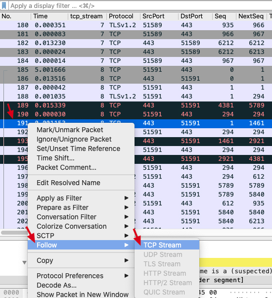
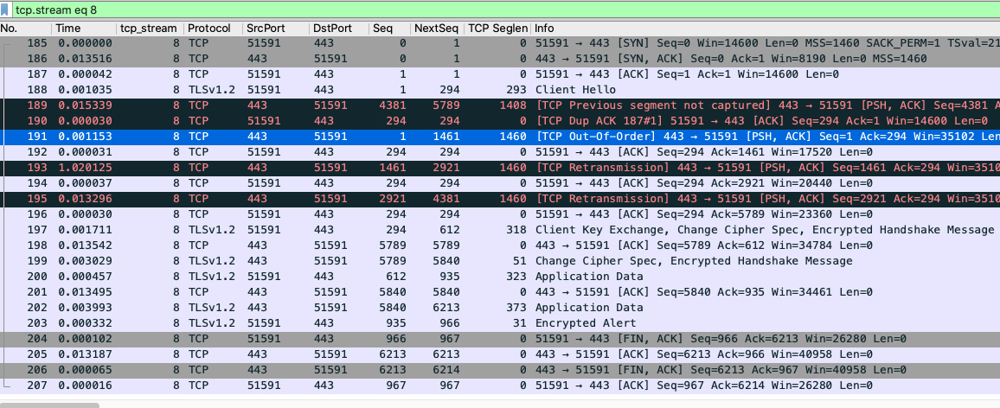
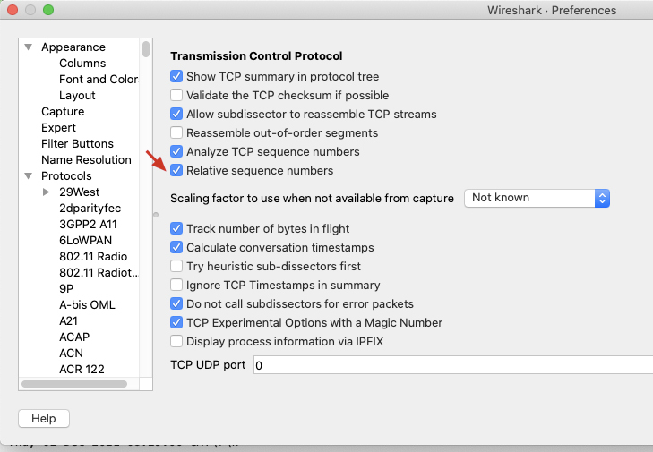
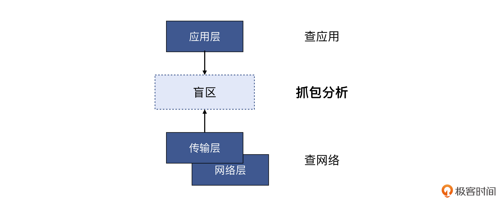

---
date: "2019-06-23"
---  
      
# 05 | 定位防火墙（一）：传输层的对比分析
你好，我是胜辉。今天我们来聊一个有趣的话题：防火墙。

在网络排查中，防火墙作为一个隐形神秘的存在，时常给排查工作带来一定的不确定性。有时候，你不知道为什么一些网络包能正常发出，但对端就是没收到。有时候，同样的两端之间，有些连接可以通信，有些就是不行。

这个时候，你很可能会怀疑是防火墙在从中作祟了，但是你有什么证据吗？

你不是防火墙工程师，就没有查看它的配置的权限。但是这样一个看不见摸不着的东西，却可能正在影响着你的应用。相信你也一定想彻底转变被动的状态，把问题搞定。

其实，无论防火墙有多么神秘，**它本质上是一种网络设备**。既然是网络设备，那么它必然同样遵循我们知道的技术原理和网络规范。所以，防火墙的踪迹，虽然表面上给人一种虚无缥缈的感觉，但从理论上说，总是有迹可循的。所以这次，我就帮助你抓住防火墙的蛛丝马迹。

当然，防火墙的排查技巧确实并不简单，为了把这个主题讲透，我将用两节课的时间，来给你专门讲解这方面的排查技巧：一节是结合传输层和应用层的分析推理，一节是聚焦在网络层的精确打击。相信你通过这两讲的学习，一定能掌握不少独门秘技，从而为你的应用保驾护航。

今天这一讲，我们先学第一种方法：结合传输层和应用层的分析推理。

<!-- [[[read_end]]] -->

## 结合传输层和应用层的分析推理

这里传输层当然就是指TCP/UDP，应用层就是问题表象，比如超时、报错之类。我们来看一个具体的例子。

这是我在2017年处理的一个案例。当时eBay内部的一个应用A访问应用B的时候，经常耗时过长，甚至有时候事务无法在限定时间内完成，就导致报错。而且我们发现，问题都是在访问B的HTTPS时发生的，访问B的HTTP就一切正常。

因为应用A对时间比较敏感，开发团队希望能既解决事务失败的问题，也改善事务处理慢的问题，于是我们运维团队开始调查。

那么，我们先来看一下这个案例中，应用请求路径的大体示意图：

应用A和应用B各自都是一组独立的集群（多台服务器）。A的众多机器，都访问B的位于负载均衡（LB）上的VIP（虚拟IP），然后LB再把请求转发给B的机器。这里的HTTP和HTTPS都位于同一个虚拟IP，只是服务端口不同而已（一个是80，一个是443）。

既然问题是“A觉得B很慢”，那么，我们除了**听听A的抱怨，是否也该问问B的解释，才显得比较公正呢？**这就是我们选择做“两侧抓包”的背后的考量了。

否则，假如我们只是在客户端（即A应用）上抓包，看到的报文显然也属片面。比如，客户端看到自己发出的报文迟迟未被服务端确认的话，那么这个报文究竟是丢失在网络路径途中，还是已经到达服务端但是被服务端丢弃了呢？显然，只在客户端抓包，是无法把这些事实弄得很清楚的。

所以，我们就在A中选择了一台机器（即客户端）做tcpdump抓包，同时在LB的HTTPS VIP（即服务端）上也进行抓包。

这里我要给你友情提醒一下，做这种双向抓包，需要注意：

* **各端的抓包过滤条件一般以对端IP作为条件**，比如tcpdump dst host \{对端IP\}，这样可以过滤掉无关的流量。
* **两端的抓包应该差不多在同时开始和结束**，这样两端的报文就有尽量多的时间是重合的，便于对比分析。
* 在同时抓包的时间段内，要把问题重现，也就是**边重现，边抓包**。至于如何重现，又分两种情况：一种是我们知道触发条件，那么直接操作发起就好了；另一种是触发条件未知，那么只有在抓包的同时，耐心等待问题出现，然后再停止抓包。

这次我们也是如此处理：一边抓包，一边跟开发团队配合观察应用日志。当观察到了日志中有意外事件（exception）出现后，停止了抓包。那么在这段抓包里，应该就含有跟这个意外事件相关的报文了。

**我们先来看一下客户端的报文情况。**打开抓包文件后，我一般会按部就班地做以下几件事：

* 查看Expert Information；
* 重点关注可疑报文（比如Warining级别），追踪其整个TCP流；
* 深入分析这个可疑TCP流的第二到四层的报文，再结合应用层表象，综合分析其根因；
* 结合两侧的抓包文件，找到属于同一个TCP流的数据包，对比分析，得出结论。

那么接下来，我们就根据以上的步骤，来具体分析分析当前这个抓包文件。

### 查看Expert Information

这一步主要是为了获取整体的网络传送情况，这对于我们大体判断问题方向很有帮助。

那么在查看的时候，一种方式是打开Analyze菜单，选择最底部的Expert Information，如下图所示：

另一种方式是直接在窗口左下角，点击那个黄色的小圆圈，如下图所示：

不过，我们要怎么理解Expert Information里面的各种信息呢？我来给你挨个介绍一下：

* Warning条目的底色是黄色，意味着可能有问题，应重点关注。
* Note条目的底色是浅蓝色，是在允许范围内的小问题，也要关注。什么叫“允许范围内的小问题”呢？举个例子，TCP本身就是容许一定程度的重传的，那么这些重传报文，就属于“允许范围内”。
* Chat条目的底色是正常蓝色，属于TCP/UDP的正常行为，可以作为参考。比如你可以了解到，这次通信里TCP握手和挥手分别有多少次，等等。

上图展示的就是客户端抓包文件的情况，我们逐个来解读这三种不同级别的Severity（严重级别）。

* Warning：有7个乱序（Out-of-Order）的TCP报文，6个未抓到的报文（如果是在抓包开始阶段，这种未抓到报文的情况也属正常）。
* Note：有1个怀疑是快速重传，5个是重传（一般是超时重传），6个重复确认。
* Chat：有TCP挥手阶段的20个FIN包，握手阶段的10个SYN包和10个SYN+ACK包。

一般来说，**乱序**是应该被重点关注的。因为正常情况下，发送端的报文是按照先后顺序发送的，如果到了接收端发生了乱序，那么很可能是中间设备出现了问题，比如中间的交换机路由器（以及这节课的主角防火墙）做了一些处理，引发了报文乱序。

所以自然，这个乱序也容易引发应用层异常。

### 重点关注问题报文

理解了这几个严重级别所代表的含义之后，我们还是回到Expert Information的进一步解读上来。点击Warning左边的小箭头，展开乱序的报文集合，我们就能看到这些报文的概览信息，如下所示：

我习惯上会选择靠后一点的报文（因为相对靠后的报文所属的TCP流相对更完整），然后跟踪这些报文（Follow \-> TCP Stream），找到所属的TCP流来进一步分析。比如选中191号报文，这时主窗口自动定位到了这条报文，我们在主窗口中选中该报文后右单击，选择Follow，在次级菜单中点击TCP Stream：

然后，我们就能看到过滤出来的这个TCP流的全部报文了！

细心的你可能会发现，界面里很多字段不是默认有的，比如Seq、NextSeq、TCP Seglen等等，这些其实都是我自定义添加的，目的就是**便于分析**（添加的办法我会在下一讲里介绍）。

这时，Wireshark的显示过滤器栏出现了`tcp.stream eq 8`这个过滤器，这是我们刚刚点击Follow \-> TCP Stream后自动生成的。

一眼看去，整串数据流确实有点问题，因为有好几个被Wireshark标注红色的报文。我们重点关注下189、190、191、193、195这几个报文。

* 189：服务端（HTTPS）回复给客户端的报文，TCP previous segment not captured意思是，它之前的报文没有在应该出现的位置上被抓到（并不排除这些报文在之后被抓到）。
* 190：客户端回复给服务端的重复确认报文（DupAck），可能（DupAck报文数量多的话）会引起重传。
* 191：服务端（HTTPS）给客户端的报文，是TCP Out-of-Order，即乱序报文。
* 193：服务端（HTTPS）给客户端的TCP Retransmission，即重传报文。
* 195：也是服务端（HTTPS）给客户端的重传报文。

以上都是根据Wireshark给我们提示的信息所做的一些解读，主要是针对TCP**行为**方面的，这也是从Wireshark中读取出来的重要信息之一。另外一个重要的信息源是**耗时**（也就是时间列展示的时间间隔）。显然，在192和193号报文之间，有1.020215秒的时间间隔。

要知道，对于内网通信来说，时间是以毫秒计算的。**一般内网的微服务的处理时间，等于网络往返时间+应用处理时间**。比如，同机房环境内，往返时间（Round Trip Time）一般在1ms以内。比如一个应用本身的处理时间是10ms，内网往返时间是1ms，那么整体耗时就是11ms。

然而，这里单单一个193号报文就引发了1秒的耗时，确实出乎意料。因此我们可以基本判定：**这个超长的耗时，很可能就是导致问题的直接原因。**

### 结合应用层做深入分析

那么，为什么会有这个1秒的耗时呢？

TCP里面有**重传超时**的设计，也就是如果发送端发送了一个数据包之后，对方迟迟没有回应的话，可以在一定时间内重传。这个“一定时间”就是TCP重传超时（Retransmission Timeout）。显然，这里的1秒，很可能是这个重传超时的设计导致的。

为了确认这件事，我们就需要做这次分析里最为关键的部分了：**两端报文的对比分析**。我们最好有一个大一点的显示屏，打开这两个抓包文件，并且把两个Wireshark窗口靠近一些，更方便我们肉眼对两边报文进行比较。

不过，当我们打开服务端（LB）的抓包文件，看到的却也是一大片报文。而要比较，必然要找到同样的报文才能做比较。这也是一个不小的难点：如何才能在服务端抓包文件里，定位到客户端的TCP流呢？我们接着往下看。

### 对比两侧文件

其实，找到另一端的对应TCP流的技巧是：**用TCP序列号**。

我们知道，TCP序列号的长度是4个字节，其本质含义就是网络IO的字节位置（等价于文件IO的字节位置）。因为是4个字节，最大值可代表4GB（即2的32次方）的数据，也就是如果一个流的数据超过4GB，其序列号就要回绕复用了。不过一般来说，因为这个值的范围足够大，在短时间（比如几分钟）碰巧相同的概率几乎为零，因此我们可以以它作为线索，来精确定位这个TCP流在两端抓包文件中的位置。

**首先**，我们可以记录下客户端侧抓包文件中，那条TCP流的某个报文的TCP序列号。比如选择SYN包的序列号，是4022234701：

注意，这里必须选**裸序列号**（Raw Sequence Number）。Wireshark主窗口里显示的序列号是处理过的“相对序列号”，也就是为了方便我们阅读，把握手阶段的初始序列号当1处理，后续序列号相应地也都减去初始序列号，从而变成了相对序列号。

但是显然，这样处理后，无论在哪个TCP流里面，Wireshark展示的握手阶段序列号都是1，后续序列号也都是1+载荷字节数。相对序列号肯定是到处“撞车”的，所以不能作为选取的条件。

那么，查看裸序列号的方法是怎么样的呢？

* 打开Wireshark的Preference（配置）菜单：

* 在弹出菜单的左侧选择Protocols，选中其中的TCP，然后在右侧的选项中，把“Relative sequence numbers”前面的勾去掉，就可以显示裸序列号了：

**然后**，我们再到服务端抓包文件里输入过滤器：`tcp.seq_raw eq 4022234701`，得到同样的这个SYN包：

正是我们的搜索条件是裸序列号，所以打开服务端抓包文件的那个Wireshark窗口里才可以搜到这个报文。这也是利用了裸序列号在网络上传输是不会发生变化的这一特性。

**接下来**还是Follow \-> TCP Stream，翻出来这个SYN包所属的服务端抓包里的TCP流。

好了，现在我们睁大眼睛，来仔细比对这些报文的对应情况：

左侧是服务端抓包，右侧是客户端抓包。前4个报文的顺序没有任何变化，但服务端随后一口气发送的4个包（这里叫它们1、2、3、4吧），到了客户端却变成了4、1、2、3！这也就是Wireshark提示我们的：

* Out-of-Order：包1、2、3。
* TCP previous segment not captured：包4。

下面，**我们再从服务端的角度**，来看一下报文顺序、重传、1秒耗时这三者间的关系：

前面刚说到“服务端发送4个报文后，客户端收到的是4、1、2、3”。因为后面3个报文的顺序还是正确的，真正乱序的其实只是4，所以就导致了这样一个状况：乱序是乱序的，但是“不够乱”，也就是不能满足快速重传的条件“3个重复确认”。

这样的话，服务端就不得不用另外一种方式做重传，即**超时重传**。当然，这里的1秒超时是硬件LB的设置值，而Linux的默认设置是200毫秒。

不过，撇开这些细节不谈，我们现在知道了一个重要的事实：**客户端和服务端之间，有报文乱序的情况**。

我们查看了其他TCP流，也有很多类似的乱序报文，而这种程度的乱序发生在内网是不应该的，因为内网比公网要稳定很多。以我个人的经验，内网环境常见的丢包率在万分之一上下，乱序的几率我没有严格考证过，因为跟各个环境的具体拓扑和配置的关系太大了。但从经验上看，乱序几率大概在百分之一以下到千分之一左右都属正常。

我们把这两个抓包文件以及分析过程和推论，发给了网络安全部门。他们对于实际的抓包信息也很重视，经过排查，发回了一个我们“期待已久”但一直无法证实的推测：问题出现在防火墙上！

具体来说，是这样两个事实：

1.  在客户端和服务端之间，各有一道防火墙，两者之间设立有隧道；
2.  因为软件Bug的问题，这个隧道在大包的封包拆包的过程中，很容易发生乱序。

就像下图这样：

**两侧抓包，对比分析**。就是这样一个方法，最终让我们发现了防火墙方面的问题。我们做了设备升级，效果是立竿见影，事务慢的问题完全消失了。开发团队也非常感谢我们的排查工作。

那么换位思考，你如果是开发团队，你会查哪些层面呢？对，一般是集中在应用程序上，可能也会做一点ping、telnet、traceroute之类的检查。但术业有专攻，难以把排查工作下探到传输层和网络层。

而如果你是网络安全团队，你又会怎么查呢？没错，也是集中在网络层或者传输层上面，不太会把排查上升到应用层。

显然，两边团队没法“会合”。这种状况，在很多组织里并不少见。不过还好，我所在的团队正好既熟悉网络也熟悉应用，能把网络和应用之间的联动细节搞清楚，进而排查出根因。故事也算有了一个圆满的结局。你了解了整个排查过程，是否也有所启发呢？

不过，这里我们还有两个小的疑问没有解决：

* **为什么隧道会引发乱序？**

首先，隧道本身并不直接引起乱序。隧道是在原有的网络封装上再加上一层额外的封装，比如IPIP隧道，就是在IP头部外面再包上一层IP头部，于是形成了在原有IP层面里的又一个IP层，即“隧道”（各种隧道技术也是SDN技术的核心基础）。由于这个封装和拆封都会消耗系统资源，加上代码方面处理不好，那么出Bug的概率就大大增加了。这就是在这个案例里，隧道会引发乱序的原因。

* **为什么HTTP事务没有被影响，只有HTTPS被影响？**

在这个案例里，HTTP确实一直没有被影响到。因为从抓包来看，这个场景的HTTP的TCP载荷，其实远没有达到一个MSS的大小。我们来看一下当时的HTTP抓包：

TCP载荷只有两三百字节，远小于MSS的1460字节。这个跟隧道的关系是很大的，因为**隧道会增加报文的大小**。

比如通常MTU为1500字节的IP报文，做了IPIP隧道封装后，就会达到1520字节，所以一般有隧道的场景下，主机的MTU都需要改小以适配隧道需求。如果网络没有启用Jumbo Frame，那这个1520字节的报文，就会被路由器/防火墙拆分为2个报文。而到了接收端，又得把这两个报文合并起来。这一拆一合，出问题的概率就大大增加了。

> 补充：在Linux中，设置了ipip隧道后，这个隧道接口的MTU会自动降低20字节，也就是从默认1500降低到1480字节。  
> 这个案例里是特殊的防火墙，它的MTU的逻辑跟Linux有所不同。

事实上，在大包情况下，这个隧道引发的是两种不同的开销：

* IPIP本身的隧道头的封包和拆包；
* IP层因为超过MTU而引发的报文分片和合片。

因为HTTPS是基于TLS加密的，TLS握手阶段的多个TCP段（segment）就都撑满了MSS（也就是前面分析的1、2、3的数据包），于是就触发了防火墙隧道的Bug。

到这里，你可能又会问了：这个例子中的丢包和乱序问题，其实也不限于防火墙，在路由器交换机层面也是有可能发生的，有没有办法可以更加确定地定位到防火墙，而不是其他网络设备呢？

这就是我们在下节课要进行深入解析的内容了，即聚焦在网络层的精确打击，你可以期待一下。

## 小结

这次的“两侧抓包”，实际上就起到了决定性的作用。那么除了当前这个案例，总的来说，还有**哪些情况下适合做“两侧抓包”**呢？我个人的看法是这样的：

1.  **有条件的话（比如对两侧设备都有权限），就尽量做两侧抓包。**这样可以收集到更多的信息。有更全面的信息，也就更容易作出更准确的判断。这好比我们做数学或者物理题，条件越充足，解题也相对越顺利。即使信息有所富余，也不会干扰到排查工作的正确性。当然这会损失一些效率，就看你怎么权衡了。
2.  **有丢包或者重传的情况的话，更应该做两侧抓包。**因为只有通过比较两侧报文，才能确定具体的丢包位置等信息，而这些信息对于排查工作十分关键。我们经常会出现的情况是，完全不同的两种故障原因，在一侧（比如客户端）看起来很可能是相同的现象。这就好比，一个一半黑一半白的球体，当其中的一面正对着我们的时候，我们是完全不知道另外一面可能是完全不同的颜色。对于网络排查也是如此。
3.  **有些信息在单侧抓包里就能明确下来的，一般就没必要做两侧抓包了。**比如下节课要讲的方法就是这样，这里先给你卖个关子，下节课我们再深入探讨。

另外，在课程中我还介绍了**在两个不同的抓包文件中如何定位到同个报文的方法，也就是使用裸序列号**。

在一侧的文件中找到某个报文的裸序列号，作为搜索条件，在另外一侧的报文中搜索得到同样这个报文。这正是利用了TCP裸序列号在网络中传输的一致性（不变性）。后面的课程中，我还将介绍更多这种“寻找同样报文”的方法 ，基本思想也都是基于某些信息在网络传输的一致性。

下次你遇到乱序、重传等情况时，也都可以运用我介绍的排查方法。当然，未必要照搬这里的每个步骤，但整体思想是类似的，希望通过我自己的经验总结，能给你一些启发。

## 思考题

这节课里，我介绍了使用裸序列号作为定位两侧同个报文的手段。那么要定位两侧的同个报文，除了这个方法，还有哪些方法呢？你可以从网络七层模型出发，给出自己的思考。

欢迎在留言区分享你的答案，我们一起讨论。如果觉得有收获，也欢迎你把今天的内容分享给更多的朋友，我们下节课再见。