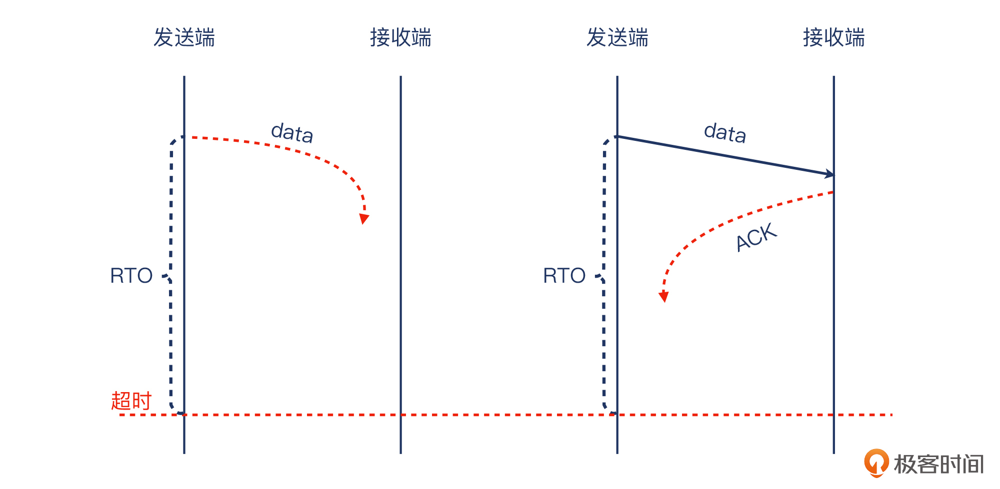
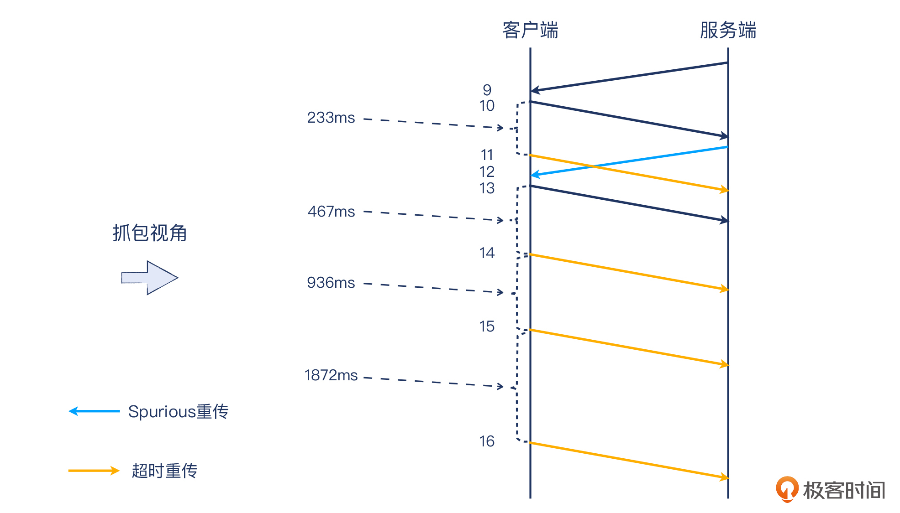
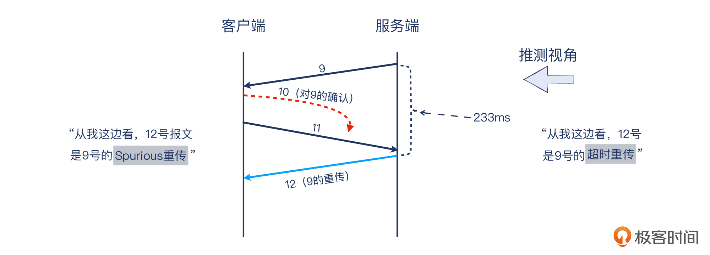
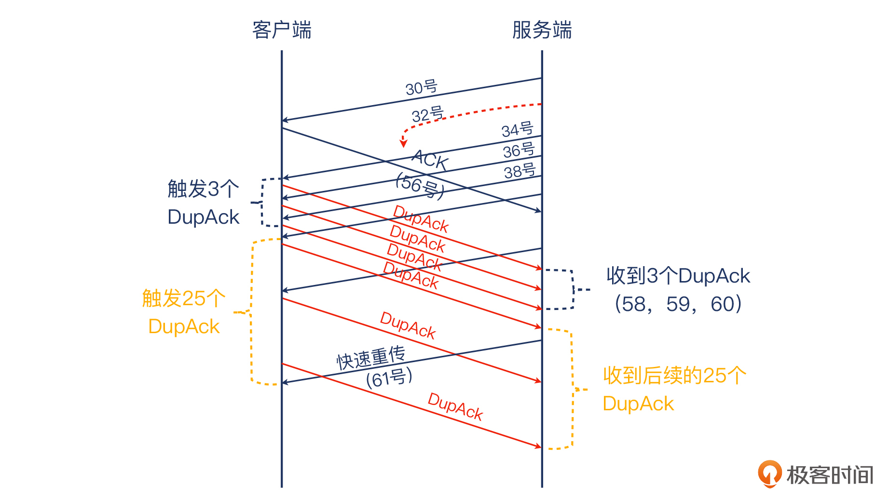
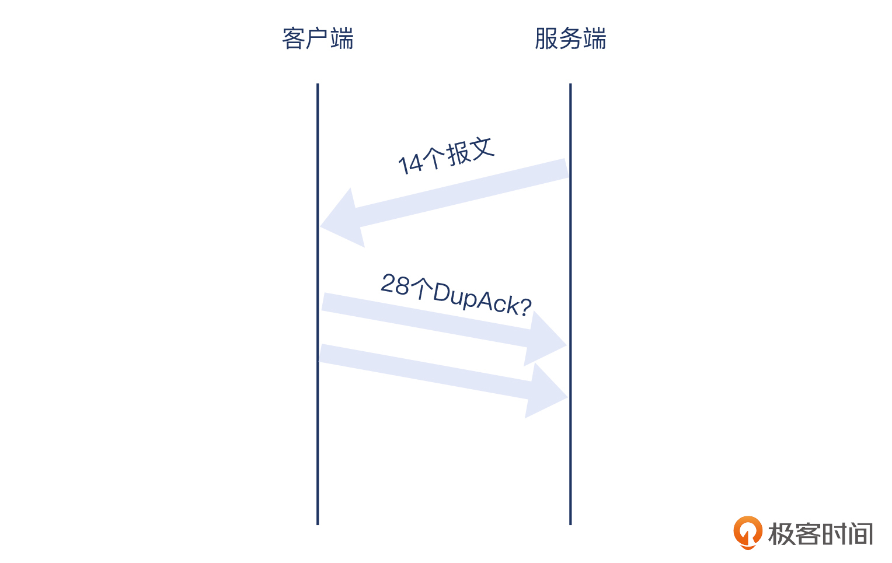
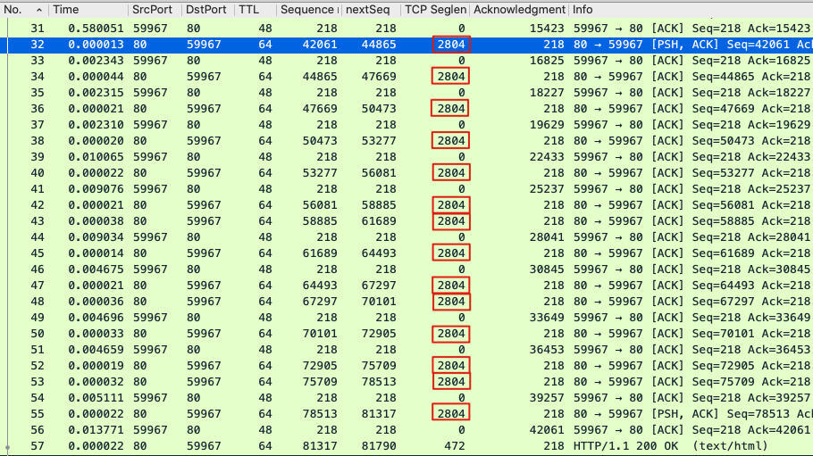
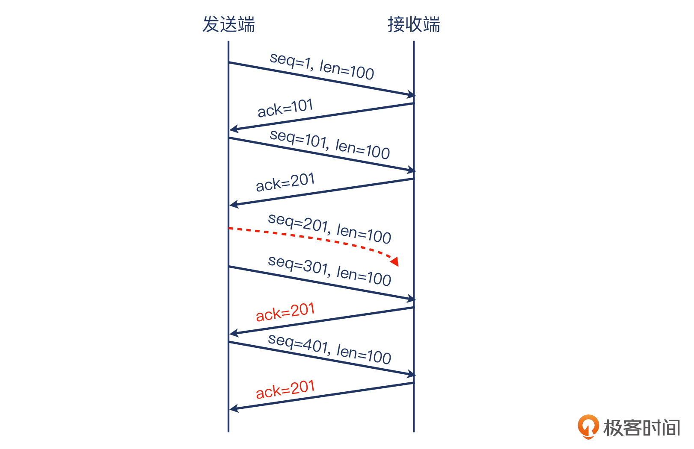
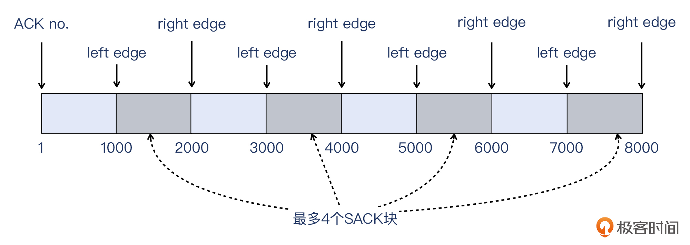

---
date: "2019-06-23"
---  
      
# 12 | 重传的认识：重传到底是怎么回事？
你好，我是胜辉。

在前面的[第8讲](https://time.geekbang.org/column/article/484667)和[第9讲](https://time.geekbang.org/column/article/484923)，我们先后介绍了两个TCP传输方面的案例。在刚过去的[第11讲](https://time.geekbang.org/column/article/486281)，我们更是全面了解了TCP的拥塞控制机制。其中有一个词经常被提到，就是“重传”。

在我看来，TCP最核心的价值，如果说只有一个的话，那就是**对可靠传输的保证**。而要实现可靠的传输，可能需要这样做：如果我的报文丢了，应该在一定次数内持续尝试，直到传输完成；而如果这些重传都失败了，那就及时放弃传输，避免陷入死循环。

所以，为了应对不同的情况，TCP又发展出了两种不同的重传类型：**超时重传**和**快速重传**。它们在各自的场景下都有不可替代的作用。不过，它们本身也只是外在的表现，触发它们的条件又分别是什么呢？

另外，你可能在Wireshark里也见过Spurious retransmission，这个又是什么意思，会对传输有什么影响吗？

这节课，我就通过对几个案例中的抓包文件的解读，带你学习这些重传家族的成员，了解它们的性格脾气，以后你在日常网络排查中看到重传，也就能顺利搞定了。

## 超时重传

我们先来学习下超时重传，Timeout Retransmission。在TCP传输中，以下两种情况，都可能会导致发送方收不到确认：

* 报文在发送途中丢失，没有到达接收方，那接收方也不会回复确认包。
* 报文到达接收方，接收方也回复了确认，但确认包在途中丢失。

<!-- [[[read_end]]] -->

没有收到确认怎么办？发送方为了避免自己陷入“尬等”的境地，选择在等待某段时间后重新发送同样这份报文，这个等待的时间就是**重传超时**，Retransmission Timeout，简称RTO。这个Timeout其实是基于一个计时器，在报文发送出去后就开始计时，在时限内对方回复ACK的话，计时器就清零；而如果达到时限对方还没回复ACK的话，重传操作就被触发。

当然，超时重传也还是可能会丢包，此时发送方一般会以RTO为基数的2倍、4倍、8倍等时间倍数去尝试多次。

我们来看一个例子，熟悉一下这种重传。

### 超时重传案例

有一次，我们一个客户访问HTTPS站点的服务，时常报错失败，我们就做了抓包。这个问题的原因已经不重要了，但是这个抓包文件倒是很适合用来给我们学习TCP重传。

我们直接选一个典型的失败事务的TCP流来看一下：

> 示例文件已经上传至[Gitee](https://gitee.com/steelvictor/network-analysis/tree/master/12)，建议你结合示例文件和文稿来学习，效果更好。

显然，图中黑底红字的报文就是一系列的重传，而且都是超时重传。你如果仔细看了这个文件，可能会指出：“老师不对，这里的12号报文是Spurious重传，不是超时重传”。但是听完我后面的分析，你应该会同意我的观点：这个本质上也是超时重传。

好，我们开始分析。

* 第一阶段：1\~3号报文是TCP握手。
* 第二阶段：4\~9号报文是TLS握手。
* 第三阶段：11\~20号报文是连续重传，以及夹杂的DupAck和Spurious重传。
* 第四阶段：连接关闭。它的触发点是21号报文这个TLS Alert消息，它的类型是21。要知道它的具体报错信息，需要解密才能知道（在第20讲我会介绍TLS解密的细节）。不过通常来说，在这种TLS Alert消息之后，就是TCP挥手了。

我们重点关注下第三阶段，也就是11\~20号报文这些重传。那么问题来了：这些重传都是重传了谁呢？也就是如何找到原始报文呢？

方法就是：**先找到重传报文的序列号，然后到前面找到同样这个序列号的报文**。那个就是原始报文。

比如，11号报文是Wireshark提示我们的第一个重传报文，我们看到它的序列号是272。在11号报文前面序列号同为272的，是10号报文。那么显然，11就是10的重传，后面的14到20号报文也是如此。

这里还有一个我们熟悉的现象。因为这一系列的重传是对同一个原始报文的重传，所以它们的发送时间也遵循了“[指数退避](https://en.wikipedia.org/wiki/Exponential_backoff)”的原则，比如：

* #11和#10隔了233ms
* #14和#11隔了467ms
* #15和#14隔了936ms
* ……

到20号报文的时候，已经重传了第8次，也是最后一次。那么为什么没有第9次呢？有下面这两种可能：

* 客户端本来就最多只重传8次，所以后续也不再重传。
* 服务端的TLS Alert报文过来，并发起了挥手，这样后续也没机会重传了。

然后我们再来理解一下整个的传输过程。不过因为抓包文件是单侧的，所以你要注意，**Wireshark里的信息，是需要跟你“抓包发生在哪一侧”这个信息，结合起来解读的**。

我画了下面这张图，供你参考这个过程。请注意，这是从抓包视角（也就是客户端）来解读的。如果服务端有抓包，很可能是不同的景象。比如，有可能服务端确实收到了这些重传报文，但确认报文一直没能成功传过来，这个可能性也是存在的。那样的话，这张图就会非常不同了。

12号报文的序列号是1200，跟9号报文相同，而且由于客户端9号报文已经收到并且回复了确认，所以Wireshark认为它是**Spurious重传**。这又是什么重传呢？

### Spurious重传

Wireshark如果识别到某个报文已经被确认过，但又再次发送，那么这次就是Spurious重传。简单来说，就是已经成功了，不需要再传。

这可以发生在两个方向上。具体来说，假设两端分别是A和B，我们在A端抓包，发现下面任何一种情况，Wireshark就会标记X为Spurious重传：

* A发送了报文X，B回复了确认，A再次发送X。
* A收到了B发过来的报文X，A也回复了确认，但B再次发送X。

那么我们在Wireshark里看到这种Spurious重传该怎么办呢？我觉得一般不用特别处理，集中关注超时重传和快速重传就好了。

> 补充：这个建议也是基于概率。Spurious重传大部分时候不是问题，只有极少数情况下是问题，所以不去重点关注它是“划算的”。相关的案例，会在专栏的后半程里介绍。

不过我们仔细观察报文，还是发现了一些问题。10号报文的确认号是1251，也就是9号报文的下个序列号（1251=序列号1200+载荷长度51），所以10号报文就是客户端对9号的确认报文。那么，9号既然已经被确认了，为什么还要12号报文这个重传呢？

只有一种解释：**这个抓包是在客户端做的，所以看不到服务端的情况**。这个10号报文一定是没有到达服务端，所以后者认为9号未被客户端收到，于是在234ms后重传了9号的副本：12号报文。这里的234ms，就是11号报文的233ms加上12号报文的1ms。

从发送端（客户端）的抓包来看，是收到了Spurious重传：

但从接收端（服务端）来看，我推测是认为9号丢失，所以200多ms后进行超时重传：

另外，你会发现10号报文本身也携带数据，它对9号报文的确认信息是跟着10号报文自己的数据一起过来的。反正确认信息只是一份元数据，不占用额外的空间，那么跟随数据报文一起发送是最高效的。

实际的重传的例子我们解读完了，接下来了解一下我们可能最关心的问题。

### 重传超时究竟是多长呢？

[RFC6298](https://datatracker.ietf.org/doc/html/rfc6298)规定：**在一条TCP连接刚刚开始，还没有收到任何回复的时候，这时的超时RTO为1秒**。在更早以前的规范里，这个值是3秒。你可以参考RFC6298的[这个部分](https://datatracker.ietf.org/doc/html/rfc6298#appendix-A)，了解这个改变的来龙去脉。

**在连接成功建立后，Linux会根据RTT的实际情况，动态计算出RTO。**实际场景中，RTO为200ms出头最为常见。

而且，**RTO有上限值和下限值**（仿佛有语音：“我们不是没有下限的\~”）。一般情况下，**Linux的这两个值分别是120秒和200毫秒**。那么这个能否修改呢？

你可能想起了sysctl命令。但是很可惜，这两个值不能像sysctl那样调整，好像不太方便？其实，这也是一种“幸运”，操作系统把一些比较敏感、改错后影响比较大的参数，没有做成可以灵活调整的方式，也可以避免我们随便调整引发问题。

## 快速重传

上面的超时重传虽然避免了“干等”的尴尬局面，但不可避免地带来了另外的问题：“干等”的时间还是不短的，这段时间被白白浪费了。快速重传的出现就是为了解决这个问题。

它的思路是这样的：**如果对端回复连续3个DupAck即重复确认，我就把序列号等于这个ACK号的包重传。**

### 快速重传案例

我在公有云工作的时候，有个客户对我们机房的网络可用性进行测试，结果发现测试情况不容乐观，很多HTTP请求没有得到及时回复。因为是相对简单的HTTP请求，本来期望在几个RTT之内就得到HTTP响应的，但实际上很多次都是超过了1秒。

于是我们做了抓包，然后过滤出了有问题的TCP流。我们看一下这条流的专家信息（Expert Information）：

这里我选几个值得关注的信息，做一下解读。

Error级别的一条信息，是**New fragment overlaps old data \(retransmission\?\)**。这是说，这个报文跟前面的报文有重合。这里的“重合”如何理解呢？比如，前面的报文是字节100到200，新的报文是字节150到250，那么两者在150到200字节之间就是重合的。这也不是很大的问题。

Note级别的3类信息，分别是：

* **This frame is a \(suspected\) fast retransmission**：这是快速重传报文，那为什么还要加个suspected字样呢？我的理解是，Wireshark是根据一些条件来综合判断这个报文属于什么类型的，但这仅仅是一种参考的信息。由于TCP报文本身没有表示重传的字段，所以Wireshark对它的解读只能作为参考，所以是suspected。其实，这个信息一般都比较准确，很少有错的时候，用suspected这个词，更多地体现了Wireshark开发人员的谦虚和严谨。
* **This frame is a \(suspected\) retransmission**：这里就是超时重传了，Wireshark发现抓包文件中没有相关的DupAck，就推断出这个是超时重传。
* **Duplicate ACK \(#1\)**：这里有28个重复确认报文，而且，如果我们点开的话，会发现这28个DupAck指向的都是同一个报文：56号报文。

**记住：DupAck经常跟快速重传相关。因为有3个或以上数量的DupAck，就可以触发快速重传**。

那么问题来了：为什么这里会有28个DupAck呢，不是有3个就足够触发了吗？

我们回到主界面来分析，你可以参考下图：

报文58\~60是3个DupAck，显然也直接触发了61号快速重传报文。这样不是已经重传了吗？为什么还会有后面连续25个之多的DupAck呢？

答案可能不在这片区域。我们把视线往上挪，看一下57号及之前的报文情况。

我们可以看到，57号报文之前，整个传输就像一片宁静的草原。然而，在风平浪静的表面之下，能找到我们要的答案吗？

61号快速重传报文的原始报文是哪个呢？不难找到，它就是32号报文，因为**它的序列号就是42061，也就是连续DupAck的确认号**。

正因为抓包在服务端抓取，所以一定能抓取到由这个服务端发出的报文，但是对端有没有收到，我们是看不到的。只有当3个的DupAck到达的时候，我们才知道这个报文一定是丢失了，然后会快速重传。

我直接给你揭晓答案：就是因为从32号报文之后，服务端还继续发送了14个数据报文，远不止3个，所以触发的DupAck也远不止是3个。你可以直接看下图来理解这里的逻辑：

不过，你仔细看这个抓包文件的话，可能还是发现了一个漏洞：服务端从32号报文之后，发送的数据报文一共是14个，为啥客户端要回复的DupAck有28个呢？这数量对不上，老师你是不是搞错了？

我在解读这个抓包的时候，其实也在这里卡住过，确实是个有点烧脑的问题：逻辑都对，就是数量不对，到底哪里出了问题？

这种时候，你会怎么做呢？

* 宽慰自己：“应该有什么别的原因吧，就不追究了，这个小问题不影响大方向。”
* 鼓励自己：“真相只有一个！再查一下。”

其实，你如果是连续学习课程过来的，应该会对TSO有印象。这是我们在[第8讲](https://time.geekbang.org/column/article/484667)提到的概念。有了TSO，操作系统就可以把大于MSS的TCP段，比如2个MSS或更大尺寸的段，交给网卡驱动来处理，后者会利用其硬件芯片做分段工作，重新组装成新的符合MTU的报文后发送出去。

那么，“为什么14个报文触发了28个DupAck”的答案就在这里了：

这14个报文，每个都是2804字节大小，这就显然是TSO在起作用了。服务端把2804字节发给网卡后，网卡拆分为2个报文后发出，所以14个数据报文，实际到达接收端的时候就是28个报文！

> 补充：实际TSO工作起来比这个图要复杂。为了突出重点，这个图里并没有展示TCP头部和IP头部的封装工作。

因为tcpdump在内核里靠近网卡这一侧，所以tcpdump抓取到的还是TSO处理之前的大报文，只有到达了网卡并且被TSO机制做了分段处理后，才变成小报文。我们抓包文件里看到14个报文，实际发送出去的是28个报文，也就触发了28次DupAck。

遇到难题，努力一下，往往就有新的发现。让我们每天进步一点点。

## SACK跟重传的关系

其实在第8讲“MTU引发的血案”里，我们就发现了SACK现象。这次我们研究重传，那就有必要回顾一下这个SACK部分，把它的含义和作用，都搞清楚。

在那次案例里，服务端向客户端发送了3个HTTP响应报文，但是因为MTU的问题，其中一个大的报文在路径上丢失了，只有后面2个报文到达了客户端，从而引发了客户端发送了两次DupAck。

> 示例文件已经上传至[Gitee](https://gitee.com/steelvictor/network-analysis/blob/master/12/SACK.pcap)，建议结合示例文件和文稿来深入学习。

我们来看看这两个DupAck的详情，先看第一个：

你可以直接进入关键部分，也就是这里框出来的TCP Option SACK 1389-2077。**SACK全称是Selective Acknowlegement，中文叫“选择性确认”**。但是在中文里，貌似带“选择性”这个前缀的词都不是很正面，比如像“选择性忽视”“选择性失忆”什么的，我们好像都不想摊上这种事。

不过，在TCP的世界里，“选择性确认”这个概念就很不一样了，它还真的是我们实实在在需要的一个特性，能帮助TCP运作得更好。

我们先说说没有SACK会怎么样。在前面的五个报文的例子里，接收端在TCP里，我们只能对收到的连续报文进行确认。我们可以看个例子：

  

接收端回复的报文的确认号，只能是连续字节数的最后一个位置。因为发送端的序列号为201、长度为100的TCP报文丢失了，那么服务端收到的连续字节数的最后一个位置，就是第201字节。这还不是最糟糕的，后续发送过来的序列号为301和401这两个报文，服务端回复的确认报文的确认号也**仍然只能是201**。

现在，有3个确认报文的确认号为201。对于早期TCP实现来说，这个时候发送端只能把序列号从201开始的报文，也就是序列号分别为201、301、401的这3个报文全部重传。但是，301和401报文实际已经到达接收端，却也要跟着201一起被重传，这未免太浪费了，301和401号报文表示“201真是我们的猪队友”。

那有没有办法，只重传序列号为201的报文，而避免重传301和401呢？

于是，TCP增加了SACK这个特性。SACK机制可以告诉发送端：“虽然我的确认号是201，但是我的TCP Option里面还有更详细的信息，在那里我会告诉你，在断点后我又收到了哪些数据”。这段话比较晦涩，我们直接看这次的这个报文：

SACK最关键的部分就是 **left edge和 right edge**，也就是左右边界。上图告诉我们：我收到了从第1389字节开始直到2076字节（也就是不含2077）的数据。这样，我们可以把SACK和确认号结合起来，知道了通过这个报文，接收端（这里是客户端）明白了什么样的信息。我用示意图把这个信息表示了出来：

类似的，我们看一下第二个重复确认报文（[示例文件](https://gitee.com/steelvictor/network-analysis/blob/master/12/SACK.pcap)的10号报文）的SACK详情：

可见，第二个重复确认报文的SACK，把实际收到的报文边界又往右“推”了一些，到了第2134字节（之前是第2077字节）。这个差额是2134-2077=57。

你有没有发现，这57个字节，其实正是前面抓包文件截图里的8号报文的大小，也就是说这57字节的报文确实被服务端收到了，并在随后回复的SACK报文中得以体现。这里我们再看一眼这57字节的报文在抓包文件中的位置：

既然SACK这么好，是不是TCP传输都能用上它呢？其实，**SACK要能工作，还需要SACK permitted这个TCP扩展属性的支持**。这个字段只有在TCP握手的SYN和SYN+ACK报文中出现，表示自己是否支持SACK特性。比如下图：

知道对方支持SACK，那我们就可以在后续报文里带上SACK，也就是上面的含有left edge和right edge，来告诉对方我实际收到的TCP段了，就可以避免这部分报文也被连带重传。201报文表示：还好有了SACK，队友们你们继续往前冲吧，我虽然这次掉队了，但我还会回来的。

那么有了SACK，是不是所有的这种零星到达的报文，都不用重传了呢？答案是没有那么乐观。受限于TCP Option长度，**SACK部分最多只能容纳4个块**。当然，这比没有SACK的情况还是好多了。

## 小结

这节课，我们学习了TCP重传的两种类型：超时重传和快速重传。然后也通过实际案例，看到了这两种重传在实际情况中的特点。这里我再给你小结一下这些知识点，你可要好好掌握。

对于超时重传：

* TCP对于每条连接都维护了一个超时计时器，当数据发送出去后一定时限内还没有收到确认，就认为是发生了超时，然后重传这部分数据。
* RTO的初始值是1秒（在发送SYN但未收到SYN+ACK阶段）。
* 在连接建立后，TCP会动态计算出RTO。
* RTO有上限值和下限值，常见值分别为2分钟和200ms。
* 实际场景中，RTO为200ms出头最为常见。

对于快速重传：

* 快速重传的触发条件是：收到3个或者3个以上的重复确认报文（DupAck）。
* 在快速重传中，SACK（选择性确认）也起到了避免一部分已经到达的数据被重传。不过，也由于TCP头部长度的限制，SACK只能放置4个块，再多也不行了。
* 快速重传只要3个DupAck就可以触发，实际上我们还可能观察到远多于3个DupAck的情况，这也是正常现象。
* **Spurious重传**对TCP传输的影响比快速重传和超时重传小很多，总体来说是一种影响不大的重传。

另外，在案例拆解的过程中，我们也进一步学习了Wireshark的使用技巧，包括：

* **Wireshark里的信息，是需要跟你“抓包发生在哪一侧”这个信息，结合起来解读的。**这对你的排查会起到很关键的作用。
* 如何定位到被重传的原始报文的方法：**先找到重传报文的序列号，然后到前面找到同样这个序列号的报文。**
* 如果在专家信息里看到 **New fragment overlaps old data \(retransmission\?\)**，这意味着多个报文之间的数据有重叠，但一般不是严重的问题。
* Wireshark提示的 **\(suspected\) fast retransmission** 就是快速重传报文。
* Wireshark提示的 **\(suspected\) retransmission** 就是超时重传报文。
* 如果发现有数据报文和DupAck数量不对等的情况，可以**看一下是否有TSO的存在**。

## 思考题

最后再给你留两个思考题：

* TCP的确认报文如果丢失了，发送端还会不会重传呢？为什么？
* 你有没有遇到过重传引发的问题，你是怎么处理的呢？

欢迎你把答案分享到留言区，我们一起进步、成长。