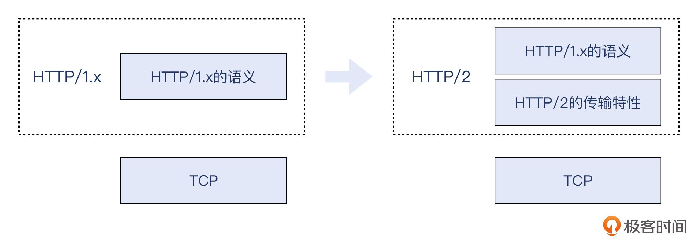
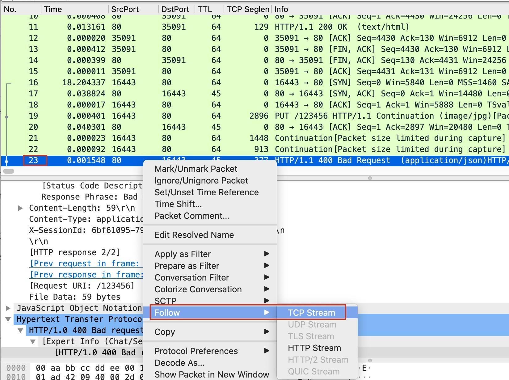
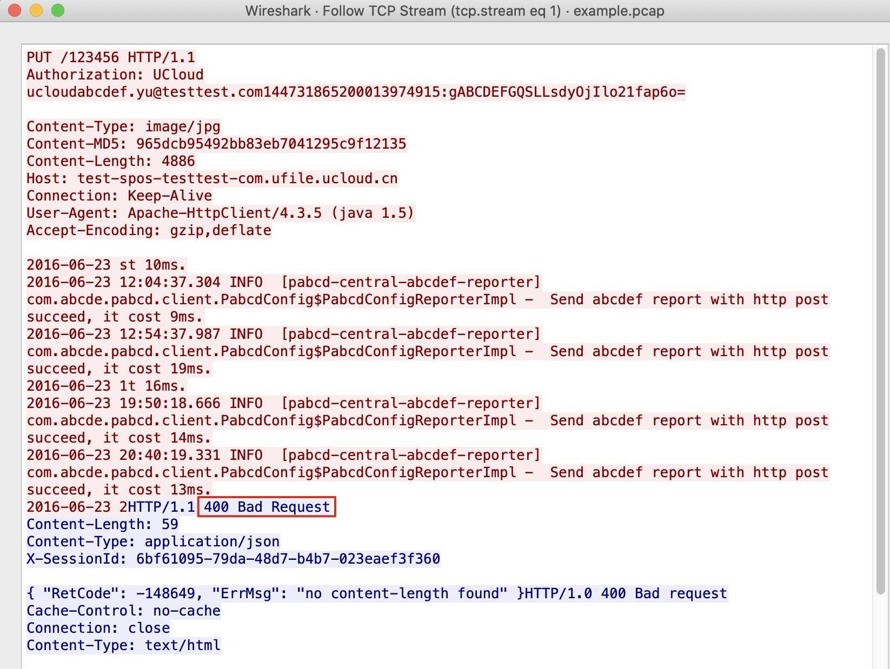
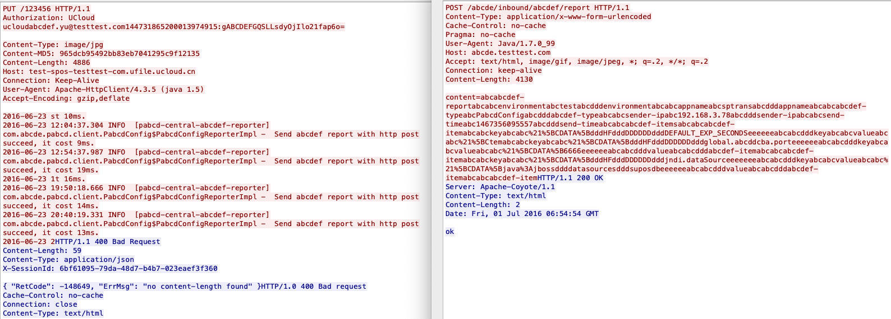
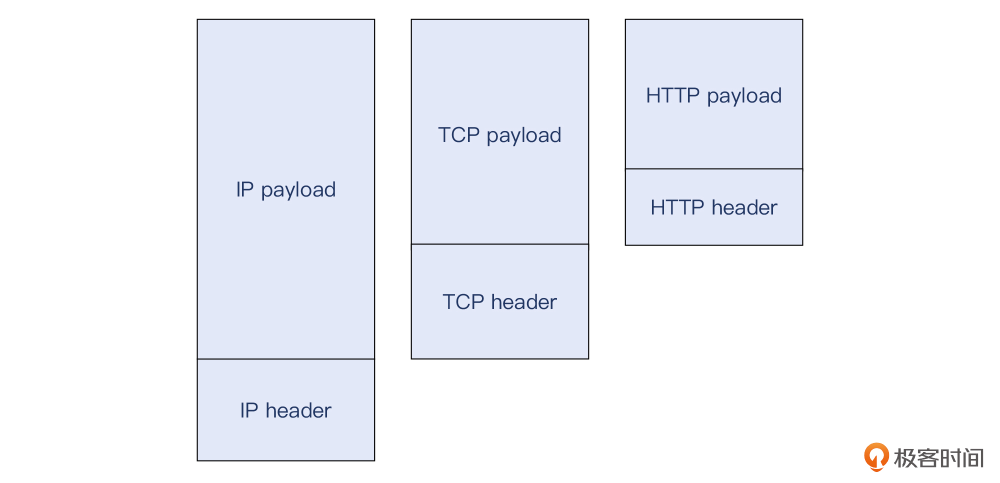
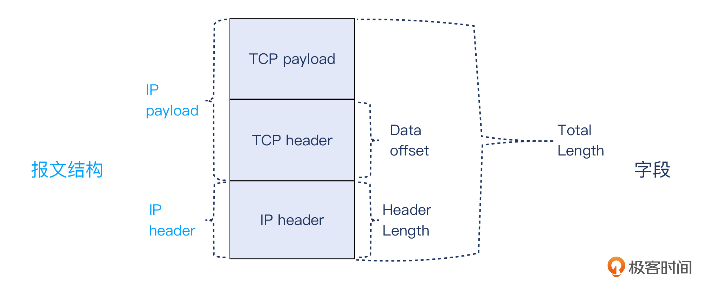
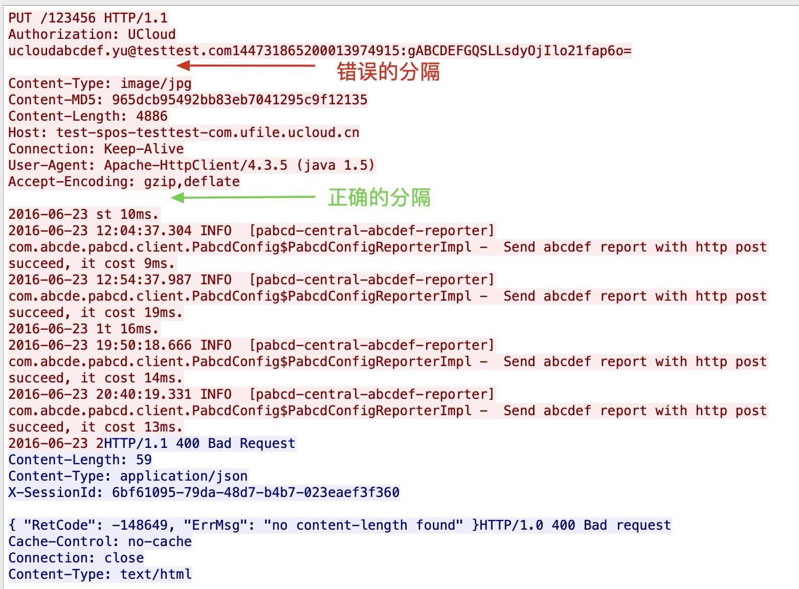

---
date: "2019-06-23"
---  
      
# 16 | 服务器为什么回复HTTP 400？
你好，我是胜辉。

在上节课里，我们回顾了一个与HTTP协议相关的Nginx 499的案例。在应用层的众多“明星”里，HTTP协议无疑是“顶流”了，可以说目前互联网上的大部分业务（电商、社交等），都是基于HTTP协议，当然也包括我们用极客时间学习的时候，也是在用HTTP。那么相应的，**HTTP方面的排查能力**，对于我们做开发和运维技术工作来说，就更加重要了。因为不少现实场景中的故障和难题，就与我们对HTTP的理解以及排查能力，有着密切的联系。

所以这一讲，我们会来看一个HTTP相关的报错案例，深入学习这其中的排查技巧。同时，我也会带你学习HTTP这个重要协议的规范部分。这样，以后你处理类似的像HTTP 4xx、5xx的报错，或者其他跟HTTP协议本身相关的问题时，就有分寸，知道问题大概的方向在哪里、如何开展排查了。

那么在介绍案例之前，我们先简单地回顾一下HTTP协议。

## HTTP协议的前世今生

HTTP的英文全称是Hypertext Transfer Protocol，中文是超文本传输协议，它的奠基者是英国计算机科学家蒂姆·博纳斯·李（Tim Berners-Lee）。1990年，他为了解决任职的欧洲核子研究组织（CERN）里，科学家们无法方便地分享文件和信息的问题，由此创造了HTTP协议。

<!-- [[[read_end]]] -->

实际上，在当时也有其他一些协议能实现信息共享的功能，比如FTP、SMTP、NNTP等，为什么还要另外创造HTTP呢？这是因为这些协议并不满足博纳斯·李的需求，比如：

* FTP只是用来传输和获取文件，它无法方便地展示文本和图片；
* NNTP用来传输新闻，但不适合展示存档资料；
* SMTP是邮件传输协议，缺乏目录结构。

而博纳斯·李需要的是“图形化的、只要点击一下就能进入到其他资料的系统”。鉴于以上协议无法实现，他就设计了HTTP。也因为这个巨大的贡献，博纳斯·李获得了2016年的图灵奖，可以说是图灵奖的一次“回国”。

在2015年之前，HTTP先后有0.9、1.0、1.1三个版本，其中HTTP/1.0和1.1合称HTTP/1.x。虽然谷歌在2009年就提出了SPDY，但最终被接纳成为HTTP/2，也已经是2015年的事了。最近几年蓬勃发展的还有HTTP/3（也就是QUIC上的HTTP/2）。**但从语义上说，HTTP/2跟HTTP/1.x是保持一致的。**HTTP/2不同，主要是在传输过程中，在TCP和HTTP之间，增加了一层传输方面的逻辑。

> 补充：[RFC7540](https://datatracker.ietf.org/doc/html/rfc7540)定义了HTTP/2的协议规范，而HTTP/1.1在1999年6月的[RFC2616](https://datatracker.ietf.org/doc/html/rfc2616)里已经确定了大部分内容。

什么叫做“语义上是一致的”呢？举个例子，在HTTP/2里面，header和body的定义和规则，就跟HTTP/1.x一样。比如 `User-agent: curl/7.68.0` 这样一个header，在HTTP/1.x里是代表了这次访问的客户端的名称和版本，而在HTTP/2里，依然是这个含义，没有任何变化。

从这一点上看，你甚至可以把HTTP/2理解为是在HTTP/1.x的语义的基础上，增加了一个介于TCP和HTTP之间的新的“传输层”。也就是下图这样：



目前最新的HTTP/3仍在讨论过程中，还未正式发布。它也依然保持了之前版本HTTP的语义，但在传输层上做了彻底的“革命”：把传输层协议从TCP换成了 **UDP**。根据w3techs.com（一家网络技术调查网站）的[数据](https://w3techs.com/technologies/details/ce-http3)，截至2022年2月22日，有25.2\%的站点已经支持了HTTP/3。

好，回顾完HTTP的历史，我们已经比较清楚它的来龙去脉了。那么接下来要讲的案例，就会帮助我们拆解HTTP协议的一些细节，梳理对这种类型的问题的排查思路。

## 案例：服务器为什么回复HTTP 400？

这是前几年我在公有云服务时候的一个案例。当时一个客户测试我们的对象存储服务，这个服务是通过HTTP协议存放和读取文件的。它比较适合存放非结构化的数据，比如日志文件、图片文件等。因为依托于HTTP协议，浏览这种存储的方法很方便，比如用浏览器就可以直接访问。

但是，在客户的测试结果中报告大量HTTP 400的报错。我们也很意外，其他客户用的都挺好，为什么这个客户就不行呢？

### 开始排查

按照惯例，我们还是进行了抓包。这次是在客户端抓取的，我们看一下Expert Information：


其中，我们需要重点关注HTTP事务，也就是上图中的`Chat HTTP/1.1 200 OK\r\n`这部分，这里面都是HTTP事务的报文。由于第一个被Wireshark判定为HTTP事务的报文，是一个HTTP 200 OK的返回报文，所以就显示为这里的Summary栏的信息。

> 补充：这里我修改过抓包，所以展现在Expert Information里面的样子，跟正常抓取完整报文的情况略有不同。比如这个示例文件里，第一个HTTP报文其实是POST，那么Summary栏显示的，应该是POST请求而不是HTTP/1.1 200 OK。但是，这不影响排查和分析。

既然这次是明确要排查HTTP 400报错，所以我们直接点开这些HTTP事务：


可见，这里有200 OK这样的正常响应，也有400 Bad Request这样的异常响应。

我们找一个请求，Follow TCP Stream来看一下详细情况。比如，我们选中23号报文，此时主界面也自动跳转到了这个报文的位置。我们选中它，右单击后选择Follow \-> TCP Stream：



我们来看一下整个TCP流：



在Wireshark里，HTTP请求是红色字体，而HTTP响应是蓝色字体。显然，紧随在请求之后就是响应了，而蓝色字的第一行就是HTTP/1.1 400 Bad Request。这就是我们要排查的问题。

然后我们需要搞清楚问题的定义了：HTTP 400到底是什么？

### 究竟什么是HTTP 400？

要回答这个问题，最准确的办法，还是**阅读RFC**，看看标准里面到底怎么说。HTTP的RFC有过好几版，1999年6月的[RFC2616](https://datatracker.ietf.org/doc/html/rfc2616)确定了HTTP的大部分规范，而后在[7230](https://datatracker.ietf.org/doc/html/rfc7230)、[7231](https://datatracker.ietf.org/doc/html/rfc7231)、[7232](https://datatracker.ietf.org/doc/html/rfc7232)等RFC中做了更新和细化。RFC2616是这样定义400 Bad Request的：

```
    400 Bad Request
    
       The request could not be understood by the server due to malformed
       syntax. The client SHOULD NOT repeat the request without
       modifications.
    

```

也就是：这个请求因为语法错误而无法被服务端理解。客户端不可以不做修改就重复同样的请求。

此外，RFC2616里还定义了几种必须返回400的情况，比如：

```
    A client MUST include a Host header field in all HTTP/1.1 request
       messages . If the requested URI does not include an Internet host
       name for the service being requested, then the Host header field MUST
       be given with an empty value. An HTTP/1.1 proxy MUST ensure that any
       request message it forwards does contain an appropriate Host header
       field that identifies the service being requested by the proxy. All
       Internet-based HTTP/1.1 servers MUST respond with a 400 (Bad Request)
       status code to any HTTP/1.1 request message which lacks a Host header
       field.
    

```

其他还有好几种情况，就不一一罗列了。

那么显然，400 Bad Request的语义，就是让服务端告诉客户端：**你发过来的请求不合规，我无法理解，所以我用400来告诉你这一点**。

但是，我们也不可能去穷举所有可能出现的不合规类型。那么在这个案例里面，究竟是哪里出了问题呢？

### 寻找突破口

有时候，我们做排查工作，需要一点灵感，也需要一点耐心。对着这个页面，如果你对HTTP协议并不是很熟悉，那么很难直接用肉眼就“看出”问题来。

那我们来玩个游戏怎么样：“大家来找茬”。你应该已经明白我的意思了，我们要做的是：**对比分析**。我们只需要把一个正常和一个异常的响应报文放在一起比较，也许就能找到原因了。

正巧，这次客户做的测试里，也有成功的请求。比如这个抓包文件里的HTTP 200 OK。那么，我们就借助这样的一个200 OK的TCP流，来对比分析下。

说到这里，你可能已经想起我们在[第5讲](https://time.geekbang.org/column/article/481042)的时候，也用过这种对比分析的方法。当时是排查一个乱序引起应用层故障的问题，我们对比了客户端抓包文件和服务端抓包文件这两个文件，而它们代表的是同一个TCP流，我们也因此找到了问题的关键，也就是防火墙引发了报文乱序的现象。


当前的案例跟第5讲的案例就有所不同了，这次比较的是同一个抓包文件里的两个不同的TCP流，也可以说是两个不同的应用层事务。这两个事务，一个成功，一个失败。


我们还是需要一个大一点的显示屏，把HTTP 200的报文找到后，Follow TCP Stream，随后的弹窗里就展示了这次成功的应用层消息的细节；然后选取HTTP 400的报文，也同样做一遍。然后我们把两个窗口挪到齐平的位置。

好，我们的对比开始了：



你能找到几个“茬”呢？因为这是两次不同的事务，所以请求和回复的字符肯定也十分不同，所以我们应该集中在**格式**上，而不是字符。

你可能首先注意到了两次的HTTP方法不同：左边是PUT，右边是POST。

这是否说明，问题就是服务端不支持PUT方法导致了HTTP 400呢？这个很容易排除。因为，如果真的是服务端对PUT的处理有问题，那么其他客户还怎么使用PUT呢？所以，即使这个问题跟PUT还是有点关系的话，我们也要转换一下问题描述，变成：**为什么这个客户端发送的PUT请求会引起HTTP 400？**

然后，你可能会发现，左边的PUT请求里有Authorization头部，而右边POST请求里没有这个头部。

左边这个Authorization请求的头部格式是这样的：

* 一开始是 `PUT /123456 HTTP/1.1`，然后换行；
* 接着是 `Authorization: UCloud` 这样一个头部，然后换行；
* 然后是 `abc@def.com:blahblah` 这种形式，看起来是一个邮箱地址后接冒号，然后是一串编码过的字符串。

你是不是觉得这部分的格式有点问题？这其实也是一个知识点了：HTTP Authorization头部的格式。

### Authorization头部

我们看看[RFC2616](https://datatracker.ietf.org/doc/html/rfc2616#section-14.8)里，对Authorization头部是怎么规定的：

```
    14.8 Authorization
    
          A user agent that wishes to authenticate itself with a server--
          usually, but not necessarily, after receiving a 401 response--does
          so by including an Authorization request-header field with the
          request.  The Authorization field value consists of credentials
          containing the authentication information of the user agent for
          the realm of the resource being requested.
    
              Authorization  = "Authorization" ":" credentials
    

```

简单来说，它也跟其他的HTTP头部的规定一样，也是 `key:value` 的形式。语法格式是这样：

```
    Authorization: <auth-scheme> <authorization-parameters>
    

```

> 补充：如果要了解关于这个头部的更多细节，还可以参考Mozilla Developer Network关于这个头部的更多的[详细介绍](https://developer.mozilla.org/en-US/docs/Web/HTTP/Headers/Authorization)。

这里的 `<auth-scheme>`，比较常见的是Basic和Digest。如果是Basic类型，那么它的格式是：

```
    Authorization: Basic <credentials>
    

```

这里的credentials，可以是 `username@site.com:hashedPassword` 这种形式。

而我们在抓包里看到的是什么格式呢？

```
    Authorization: UCloud
    ucloudabcdef.yu@testtest.com144731865200013974915:gABCDEFGQSLLsdyOjIlo21fap6o=
            #这里是一个空行
    

```

这个 `Authorization: UCloud` 后面多了一个换行，这就已经是一个问题了。

更严重的是，在第二行的后面，有两次回车，或者说两次CRLF，而这个问题更加严重。说到这里，我们就需要复习一下HTTP报文格式的知识了。

### HTTP报文分隔

跟IP、TCP类似，HTTP也分为头部（headers）和载荷（body或者payload）。



既然分成了两个部分，那么显然，接收者需要知道header和payload的分界线，要不然就会导致信息解读错误，这是致命的。

**在IP协议里**，IP header是用一个Total Length字段，表示了包含IP头部在内的整个IP报文的长度。那怎么区分IP头部和载荷呢？IP头部还有一个字段是Header Length，表示了头部自身的长度。这样两个Length值的差，就是IP载荷的大小了。

**在TCP协议里**，TCP header里的Data offset，表示了TCP载荷开始的位置（也是TCP头部截止的位置），也就相应地可以计算出TCP头部的长度。那么TCP载荷长度是怎么来的呢？我们用一个简单的减法就好了：

```
    TCP payload Length = IP Total Length - IP Header Length - TCP Header Length
    

```

这些头部长度的关系，我用了一张示意图来概括，供你参考：



**而在HTTP里**，载荷的长度一般也是由一个HTTP header（这里指的是某一个头部项，而不是整个HTTP头部），也就是Content-length来表示的。假设你有一次PUT或者POST请求，比如上传一个文件，那么这个文件的大小，就会被你的HTTP客户端程序（无论是curl还是Chrome等）获取到，并设置为Content-Length头部的值，然后把这个header封装到整体的HTTP请求报文中去。


既然HTTP报文内容，分成了头部（headers）和载荷（Payload或者body）两部分，那么这两者的分界线在哪呢？

**HTTP规定，头部和载荷的分界线是两次CRLF。**

```
    A request message from a client to a server includes, within the
       first line of that message, the method to be applied to the resource,
       the identifier of the resource, and the protocol version in use.
    
            Request       = Request-Line              ; Section 5.1
                            *(( general-header        ; Section 4.5
                             | request-header         ; Section 5.3
                             | entity-header ) CRLF)  ; Section 7.1
                            CRLF
                            [ message-body ]          ; Section 4.3
    

```

也就是在最后一个header之后，需要有两个CRLF，这就是头部和载荷之间的分割线。之后就是载荷（message body）的开始了。

那么，前面引发HTTP 400的PUT请求，其Authorization后面也出现了两个CRLF，这就会被认为是headers的结束，payload的开始。但实际上，后面跟的又是剩余的HTTP头部项，在最后一个头部之后，又是两个CRLF。所以这对于Web服务端来说就懵了：“你这说的可不是人话啊！我只能表示我不理解。”



### 定位不合规处

原来如此，这次的**400 Bad Request的根因，是客户发送的HTTP PUT请求的格式出现了问题**。它违背了HTTP/1.1（RFC2616）的规定，在Authorization头部后面，错误地添加了两次回车（CRLF）。这样就导致服务端认为，后续的数据都属于payload，也就导致服务器无法正常读取这个请求，只能用HTTP 400来反馈这种状况了。

既然咱们的课程叫“网络排查案例课”，那么这次案例的根因，跟网络有没有关系呢？

我觉得要看你怎么定义“网络”。

如果是传统和狭义上的网络，只包含交换机、路由器、防火墙、负载均衡等环节，那么这里并没有什么问题。没什么重传，也不丢包，更不影响应用消息本身。

如果是广义的网络，那就包含了至少以下几个领域：

* 对应用层协议的理解；
* 对传输层和应用层两者协同的理解；
* 对操作系统的网络部分的理解。

在这个案例里，我们依托于**对应用层协议的理解**，找到了网络行为以外的根因。这个根因虽然可能根源是开发方面的问题，但无论是开发、运维或者SRE，在处理这种问题的时候，如果能具备比较全面的知识，从而推导出根因，那么无论是对组织效率的提升，还是个人能力的提升，是不是都更有意义呢？

## 实验

现在，我们也来做几个简便的小实验，模拟出HTTP 400 Bad Request这样的响应。

### 实验1：对HTTP发送不合规的请求

如果我们直接用高级语言来调用HTTP库，可能反而不容易做到这种“非法”请求。因为这些库的设计目的之一，就是要尽量避免人工的编码错误以及提升开发效率，我们想借助它去构造非法请求，恐怕不太容易。

当然，如果你熟悉Python的话，可能会想到用Scapy库等工具来实现。但这个步骤就稍多了点。

其实，我们也可以用最简单的方法，就是直接用 **telnet命令**。我们在[第2讲](https://time.geekbang.org/column/article/478189)里，用视频的形式介绍了如何一边用telnet模拟发送HTTP请求，一边用tcpdump的-X参数，展示抓取的报文里面的文本细节。

那么这里，我们也用类似的方法，只要手动执行下面的命令，就可以向目标站点发送一个不合规的请求：

```
    $ telnet www.baidu.com 80
    Trying 180.101.49.12...
    Connected to www.a.shifen.com.
    Escape character is '^]'.
    GET / HTTP/1.1
    Authorization  #这里是一次回车
                   #这里是又一次回车
    HTTP/1.1 400 Bad Request
    
    Connection closed by foreign host.
    

```

也就是telnet目标站点的80端口，在提示符下输入：

```
    GET / HTTP/1.1
    

```

然后回车，再输入：

```
    Authorization
    

```

注意这里不要输入更多内容，直接**回车两次**。这时，两次回车被对端Web服务器收到后，它是这么解读的：

* 这是一个GET /的HTTP/1.1版本的请求。
* 有一个Authorization头部，但是这个头部并没有值。
* 两次回车就表示这次请求发送结束。

由于请求不合规，目标站点立刻回复了HTTP 400 Bad Request。

而如果我们在输入Authorization时，后面加上“: Basic”，会收到HTTP 500。这是因为服务端认为Authorization: Basic这个格式本身是正确的，只是后面缺少了真正的凭据（Credential），所以报告了HTTP 500。

所以，两者的区别就是：

* **Authorization后面直接回车**，就表示它并没有带上 `<auth-scheme>`，所以属于不合规，应该回复HTTP 400。
* **Authorization: Basic后直接回车**，它的Authorization头部有 `<auth-scheme>`，但是没有带上有效的凭据，应该回复HTTP 500。

### 实验2：对HTTPS发送不合规的请求

前面实验的是HTTP站点，我们用telnet发送明文请求比较直观。而要是对方站点是HTTPS的话，如果还是用telnet，会遇到TLS握手，这一关就过不去了。那么该怎么办呢？

其实，我们可以用**openssl命令**。执行`openssl s_client \-connect 站点名:443`，就可以跟对端站点建立TLS握手。比如像下面这样：

```
    $ openssl s_client -connect www.baidu.com:443
    CONNECTED(00000006)
    depth=2 C = BE, O = GlobalSign nv-sa, OU = Root CA, CN = GlobalSign Root CA
    verify return:1
    depth=1 C = BE, O = GlobalSign nv-sa, CN = GlobalSign Organization Validation CA - SHA256 - G2
    verify return:1
    depth=0 C = CN, ST = beijing, L = beijing, OU = service operation department, O = "Beijing Baidu Netcom Science Technology Co., Ltd", CN = baidu.com
    verify return:1
    ---
    ......
    

```

另外还有一点，我们这个时候怎么发送HTTP请求呢？不少人会在这里卡住。其实，openssl也是一个交互式的命令，跟telnet一样，直接键入HTTP请求就好了！

```
    ---
    GET / HTTP/1.1
    Authorization  #这里是一次回车
                   #这里是又一次回车
    HTTP/1.1 400 Bad Request
    
    closed
    

```

这样一来，也可以得到跟telnet 80一样的响应。

其实，**网络协议就是这样，是一种“方言”，互相要用对方听得懂的方式对话。**如果语法出现了问题，我们的自然语言就是“不明白你的意思，你说啥”。在HTTP这个“方言”里，就是用HTTP 400表达了同样的意思。

## 小结

这节课，我们通过一个服务器回复HTTP 400的案例，学习了这种对HTTP返回码进行排查的方法。

使用这种方法的前提，还是需要你对HTTP协议本身有比较深入的掌握，然后结合对HTTP语义的理解，分析出根因。而熟悉HTTP协议的方法，就是熟读RFC2616，以及2014年6月的更新RFC（7230, 7231, 7232, 7233, 7234, 7235）。

具体的方法，我们可以借鉴这样的方式：

* 我们可以把错误的报文跟成功的报文放一起，进行**对比分析**。这样会比较快地发现两者之间的差别，从而更快地定位到根因。
* 我们也可以通过telnet和openssl，分别**模拟复现HTTP和HTTPS的**请求，重放给服务端，观察其是否也返回同样的报错。
* 对比协议规范和报文中抓取到的实际行为，找到不符合规范之处，很可能这就是根因。

同时，我们也回顾了不少HTTP协议的知识，包括：

* HTTP的各种版本的知识点：**HTTP/2和HTTP/3的语义跟HTTP/1.x是一致的**，不同的是HTTP/2和HTTP/3在传输效率方面，采用了更加先进的方案。
* Authorization头部的知识点：它的格式为 `Authorization: <auth-scheme> <authorization-parameters>`，如果缺少了某一部分，就可能引发服务端报HTTP 400或者500。
* HTTP报文的知识点：**两次回车（两个CRLF）是分隔HTTP头部和载荷的分隔符**。
* HTTP返回码的知识点：HTTP 400 Bad Request在语义上表示的是**请求不符合HTTP规范**的情况，各种不合规的请求都可能导致服务端回复HTTP 400。

最后，我们通过两个小实验，学习了用简单的方式模拟HTTP请求的方法。如果服务端是HTTP，我们用telnet；如果服务端是HTTPS，就用openssl。

## 思考题

给你留两道思考题：

* 在HTTP请求里，我们用Content-Length表示了HTTP载荷，或者说HTTP body的长度，那有时候无法提前计算出这种长度，HTTP是如何表示这种“动态”的长度呢？
* HTTP请求的动词加URL部分，比如GET /abc，它是属于headers，还是属于body，或者哪种都不属于，是独立的呢？

你可以在留言区说说你的想法和思考，我们一起交流。另外也欢迎你把今天的内容分享给更多的朋友。