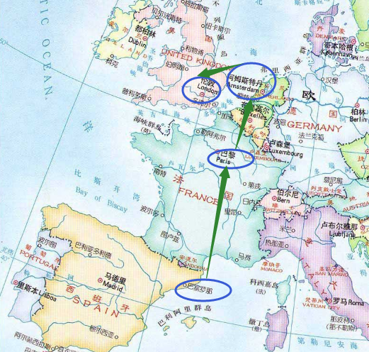
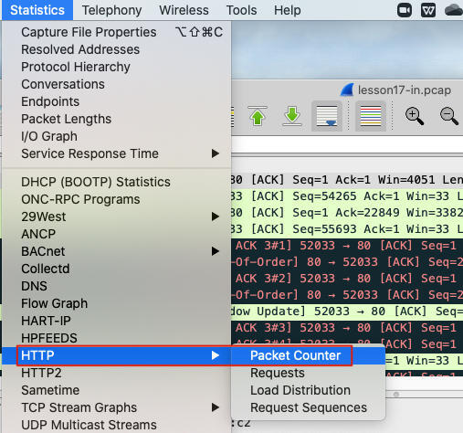
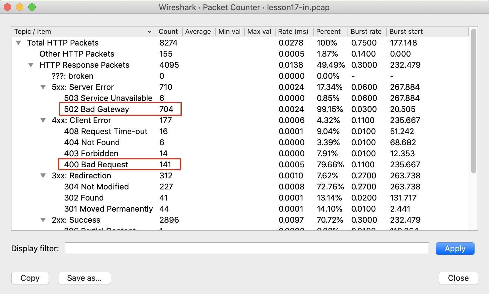
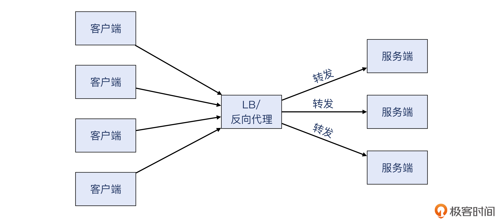
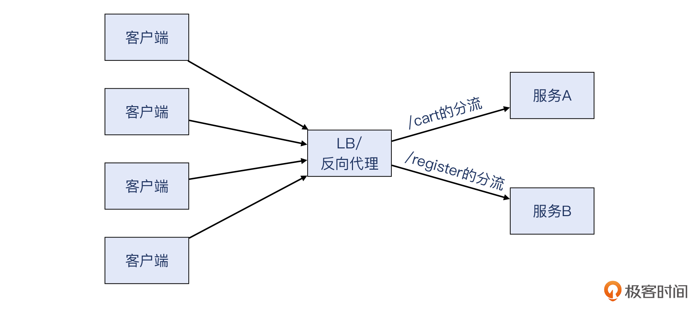
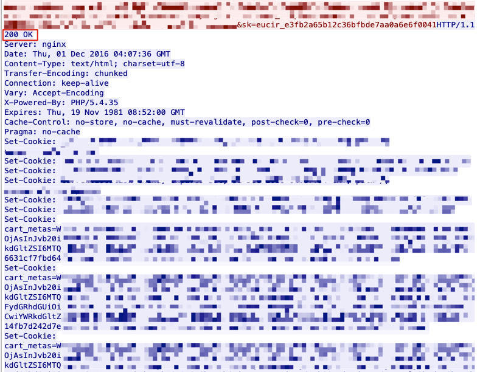

---
date: "2019-06-23"
---  
      
# 17 | 为什么前端页面里多选一个城市就报错？
你好，我是胜辉。

在[第15讲](https://time.geekbang.org/column/article/488979)中，我给你介绍了Nginx的499状态码的排查过程，这种排查方法其实也适用于其他HTTP状态码的排查。另外可能你也注意到了，这个案例是聚焦在后端Web日志方面的，那么如果遇到**前端方面**的报错，我们的排查又该如何开展呢？

所以今天这节课，我们就来探讨下这方面的排查技巧。跟往常一样，我们还是从案例说起。在这个过程中，你可以跟随我的脚步，通过抓包分析，把问题表象拆解为底层的数据流，然后深入到协议和应用的细节来找到根因。这样，以后你对类似的看起来凌乱没有头绪问题，也能有一套行之有效的方法来开展排查工作了。

## 案例：为什么前端页面里多选一个城市就报错？

我们曾经服务过一家垂直OTA（Online Travel Agency，在线旅游），他们专注于欧洲旅行市场，取得了不俗的业绩。有一天，客户的运维负责人找到我们，报告了一个奇怪的问题。

他们最近推出了一个旅游产品，可以让用户自主选择在欧洲旅行的多个城市之间，以自定义的顺序展开旅行。比如，你可以选择从西班牙的巴塞罗那启程，然后来到法国巴黎，随后踏上风车王国荷兰的领土，最后把日不落帝国的伦敦作为最后一站来结束旅行。以上旅程是由4个国家（城市）组成的：

<!-- [[[read_end]]] -->



但是问题来了，如果你在网站上选择行程时多选一个地点，比如，中途增加一次到丹麦的旅程，使途经的国家/城市从4个变成5个，在提交旅行计划的时候，网站却会报错。


好像哪里有个环节跟公司作对似的，用户想多花点钱都不行？

## 开展排查

我们先来看一下整体的架构，他们这个还是比较典型的Web应用的基础架构：


云LB是基于HAProxy方案的软件负载均衡产品，它分发流量给后端的云主机Nginx，上面运行着Web程序，再后面就是云数据库了。

### 确认和重现

问题排查的第一步是什么？

一般来说，是**问题的准确描述和重现**。就是说，如果问题不是你自己发现而是其他人报告给你的，那么你需要确认对方描述的每一个事实细节。我们按照客户描述的顺序，登录网站后依次选择了5个城市，在提交行程的时候果然遇到报错了。而改为只选择4个城市，就能提交成功。

问题可以重现，第一步完成。

### 先做排除法

问题排查的第二步是什么？

一般来说，是可以做**排除法**筛选问题根因。这跟我们考试做选择题的时候类似，如果你在A、B、C、D四个选项中无法一下子就找到正确选项，那可以先排除那些明显错误的选项，最后剩下的就是答案了。

我们让客户自查了云数据库、云主机应用服务器，都没有发现问题。而且客户报告，如果绕过云LB，直接访问云主机Nginx或者云主机应用服务器，同样的方式预订5个城市的旅程，都能提交成功。访问外部站点（经过云LB），就会提交失败。所以我们再对比一下：

* 失败场景：公网用户 -> **云LB** -> 云主机Nginx
* 成功场景：内网用户 --------> 云主机Nginx

这样看起来，问题就集中到云LB上了。

于是我们在云LB上开始排查，当然这里少不了用tcpdump做抓包。对于云LB来说，对同一个应用请求，它其实需要处理两个TCP连接。

* 客户侧连接：公网客户IP \<-> 云LB弹性IP。
* 服务侧连接：云LB内部IP \<-> 云主机Nginx内部IP。


于是我们把这两段不同的TCP连接也都抓取了。好在这个问题是必现的，我们只要选择那五个城市，问题就必然出现，所以很容易就抓取到了问题报文。先预告一下，在后面的课程中，我还会提到对于偶发性问题的排查思路，它跟必现型问题的排查确实有挺大的不同。

### tshark命令

我们先看一下客户侧抓包的情况。因为是HTTP应用，我们可以重点关注其HTTP返回码的情况。这里，我们要学习一个新的强大的命令行工具：**tshark**。

在安装Wireshark软件包的时候，它默认也会连带安装其他几个强大的命令行工具，比如capinfos、tshark、dumpcap、editcap、mergecap等。这里的tshark事实上可以起到类似tcpdump的作用，比如在我使用的macOS笔记本上，用Wireshark、tcpdump、dumpcap，还有tshark，都可以抓包。

当然，tshark也可以读取和解析抓包文件。关于tshark的更多说明，可以参考[官方文档](https://www.wireshark.org/docs/man-pages/tshark.html)。

你可能会问：“既然tshark跟tcpdump差不多，为什么一定要用tshark呢？”

这是因为，tshark解读文件时，可以像Wireshark那样解读到应用层，而这一点，tcpdump就无法做到了。在当前这个案例里，我们需要用上tshark的报文分析功能，过滤并统计HTTP返回码的分布情况。命令如下：

```
    $ tshark -r lesson17-in.pcap -T fields -e http.response.code | grep -v ^$ | sort | uniq -c | sort -r
    2883 200
    704 502
    227 304
    141 400
    45 301
    41 302
    16 408
    13 403
    6 503
    6 404
    2 206
    

```

> 补充：抓包示例文件已经上传至[Gitee](https://gitee.com/steelvictor/network-analysis/blob/master/17/lesson17-in-shorten.pcap)，建议结合文稿和Wiresahrk、tshark一起学习。

可以看到，返回码200的情况还是占了绝大多数（2883个），其次是返回码502（704个），然后余下的是的3xx系列和4xx系列的返回码，还有6个503返回码。

当然，你用Wireshark图形界面也很容易获得这种信息。在Wireshark的Statistics下拉菜单里，选择HTTP \-> Packet Counter：



然后就能看到统计信息了。可见，这些数据跟我们用tshark命令行工具做解析的数字是一致的：



可能你要问了，显然图形界面更加方便一点，tshark工具的价值又在哪里呢？这里我来说说我的看法吧。

* **当我们需要分享抓包分析信息给其他人的时候**，tshark的输出信息是文本格式，就很方便分享了。而Wireshark的是截图，就没有文本那么方便。
* **当我们有多个文件需要做同一种分析的时候**，tshark命令行工具优势就体现出来了，因为不需要打开多个Wireshark窗口，而是在同一个命令行窗口里就可以对多个抓包文件依次执行相似的命令，然后对比这些输出，十分方便。
* **当我们要对抓包分析进行自动化的时候**，tshark这样的命令行工具以及类似的开发库就很有用了，可以帮助我们把人的经验沉淀到代码里去，减少人工的工作量。

### HTTP 5xx系列

回到这个案例。这么多502/503的返回码确实不太正常，这又跟502/503本身的语义有关。我们分别来看一下协议中定义的[502](https://datatracker.ietf.org/doc/html/rfc2616#section-10.5.3)、[503](https://datatracker.ietf.org/doc/html/rfc2616#section-10.5.4)和[504](https://datatracker.ietf.org/doc/html/rfc2616#section-10.5.5)。

在学习HTTP协议的时候，除了阅读RFC2616等RFC文档，还可以参考MDN（Mozilla Developer Network），因为是有中文版的，所以对我们更加友好。这里，我们就用它的中文解释：

[502 Bad Gateway \- HTTP | MDN \(mozilla.org\)](https://developer.mozilla.org/zh-CN/docs/Web/HTTP/Status/502)：

```
    502 Bad Gateway 是一种HTTP协议的服务器端错误状态代码，它表示作为网关或代理角色的服务器，从上游服务器（如tomcat、php-fpm）中接收到的响应是无效的。
    

```

[503 Service Unavailable \- HTTP | MDN \(mozilla.org\)](https://developer.mozilla.org/zh-CN/docs/Web/HTTP/Status/503)：

```
    503 Service Unavailable 是一种HTTP协议的服务器端错误状态代码，它表示服务器尚未处于可以接受请求的状态。
    

```

[504 Gateway Timeout \- HTTP | MDN \(mozilla.org\)](https://developer.mozilla.org/zh-CN/docs/Web/HTTP/Status/504)：

```
    504 Gateway Timeout 是一种HTTP协议的服务器端错误状态代码，表示扮演网关或者代理的服务器无法在规定的时间内获得想要的响应。
    

```

你可能也看出来了，502/503/504这几个返回码，都是给 **反向代理 / LB** 用的。反向代理 / LB位于客户和服务之间，起到了转发、分流、处理的作用。这里我稍微再给你展开一下这几类功能。

* **转发**

这个最基础最直观，就是把客户发过来的请求，转发给后端服务器。因为一般来说反向代理跟后端服务器是 `1:n` 的关系，所以需要用一些算法来进行分发，来保证后端分到的请求数量是符合预期的。常见的算法有轮询、权重、最小连接数、哈希等等。



* **路由分流**

这是第七层的路由分发，把符合一定条件的HTTP请求分发到路由配置的对应的后端集群，可以说是带条件判断的转发。搜索引擎优化（Search Engine Optimization，简称SEO）就是一个典型的例子，它把各种子域名集中到主站域名下面，比如：

> * register.abc.com转为www.abc.com/register（注册）
> * cart.abc.com转为www.abc.com/cart（购物车）



这样的话，多个子域名就统一为单一域名www.abc.com，原本分散到各个子域名的搜索得分也被合并了，一下子提升了主站的排名。

* **处理**

这里是指应用层的业务处理。这个会比较多样，比如可能直接由反向代理回复给客户一个301/302 http redirect，也可能改写URL后转发给后端进一步处理，等等，总之是应用层的行为。


好，我们继续502/503/504的话题。因为反向代理 / LB是位于客户和服务之间的，如果服务坏了，而反向代理 / LB本身没坏，那么该给客户回复哪个返回码呢？500吗？可是服务端故障，但我反向代理 / LB自己可没故障啊。


为了“撇清”这层关系，反向代理 / LB可以用502/503/504这些返回码向客户端表明清白之身：我自己没问题，是我后面的服务出了问题。所以说，遇到大量502/503/504时，你应该重点查一下产生这些返回码的背后的原因。


我们从抓包文件里基于测试机的外网IP，过滤出了问题重现时发生的HTTP事务，做下一步的分析。输入过滤条件：`ip.addr == x.x.x.x`（此处隐去了真实IP），然后过滤到这个测试引发的数据包：


> 补充：HTTP 502的示例文件已经上传至[Gitee](https://gitee.com/steelvictor/network-analysis/blob/master/17/lesson17-frontend-http502-shorten.pcap)。

其中，赫然出现HTTP 502。接下来你也知道，我们需要对这个TCP流进行重点分析。选中HTTP 502这个包，右单击Follow，在弹出子菜单中选中TCP stream。此时会有弹出窗口，里面展示了HTTP应用层面的信息，即HTTP请求和对应的HTTP返回。


> 补充： 由于我们可以想到的原因，这里把敏感信息抹去了。

一个POST请求，得到了HTTP 502，这并不正常，会不会跟这个奇怪的前端问题有关系呢？由于**这只是客户侧的情况，我们必须跑到云LB的另外一侧即服务侧，看看那边发生了什么**。分析那边的数据包，也许就能定位到502产生的原因了。


### 请求的映射

云LB的**左边**是一个TCP连接，**右边**是另外一个TCP连接，两者在网络层面毫无关联。只有云LB自己知道，左边连接里的某个HTTP事务，对应的是右边连接的哪个HTTP事务。那么，**如何根据客户侧的数据，找到对应的服务侧的数据呢？**

这也是一个不小的挑战。这个问题的抽象描述，就是：如何在一个 `m:n` 的场景里，找到确定的 `1:1` 关系。下图中，我用虚线表示了这种映射关系的未知性。


相信这个问题的答案不止一种。这里我想分享给你的经验是，利用Wireshark提供的一个**过滤器：tcp contains**。

使用这个方法的根据是：进入到客户侧的请求，一般会由LB或反向代理大体不改动地转发到服务侧。这里说“大体不改动”，是因为反向代理或者LB可能会插入一些HTTP header（比如常见的X-Forwarded-For），但一般不改写原有的URL和header。


> 补充：除了这个方法以外，一些商业LB会提供更为强大的TCP流映射抓包功能，就是在指定抓取某个客户端IP的流量的同时，还能实时把对应的服务侧连接的数据包都抓取到。当然，在这个案例里并不是非要这种强大功能不可，用我刚介绍的过滤器也可以做到。

首先，回到我们客户侧的数据包，找到一个容易区分该HTTP请求跟其他HTTP请求的标志。比如应用层时常会用uuid，作为区分不同HTTP请求的方法，正好可以为我们所用。我们看一下这个HTTP请求，看来“sk=xxx”这个uuid比较适合作为过滤条件，也就是图中圈出来的部分，它在不同的请求间重复的可能性为零。


然后，用Wireshark打开服务侧抓包文件，在过滤器输入框中输入下面的条件：

```
    tcp contains "eucir_e3fb2a65b12c36bfbde7aa0a6e6f0041"
    

```

这样就能过滤出相关的服务侧的数据包，而这些报文就是对应了客户侧的同一个请求：


Wireshark提示我们，这些报文都是TCP segment of a reassembled PDU，也就是属于同一个大的应用层数据的不同数据段。我们选中其中一个报文并右键Follow \-> TCP stream，得到这个TCP连接的完整数据：



HTTP请求是红色字体，HTTP响应是蓝色字体。你注意下这个HTTP响应，是否发现了不同寻常的事情？

原来，在服务侧这个HTTP请求得到的不是502，而是**正常的200！**

让我们更多地解读一下这个200返回带给我们的信息：

* 请求中的sk=xxx跟客户侧的请求的sk=xxx值一致，也就是我们可以确认：该服务侧请求即客户侧请求。
* 该返回的头部（header）包含 `Server: nginx`，由此得知，云LB后面的这个Server是Nginx。
* 返回的头部信息也比较大，有很多个Set-Cookie。

那么排查到这里，我们就可以大致拼接出来问题的全貌了：

* 公网客户访问云LB，得到HTTP 502；
* 云LB访问后端云主机，得到HTTP 200。


于是，整个排查过程有了非常重要的进展。只要能回答“是什么原因让云LB把HTTP 200变成HTTP 502”这个问题，整件事情就算水落石出了。

### 根因分析

在揭示真相之前，让我们再次回到HTTP 502的语义本身，看看我们在说502的时候，我们说的到底是什么。这是RFC2616中针对[502 Bad Gateway](https://datatracker.ietf.org/doc/html/rfc2616#section-10.5.3)所给出的定义：

```
    502 Bad Gateway
       The server, while acting as a gateway or proxy, received an invalid
       response from the upstream server it accessed in attempting to
       fulfill the request.
    

```

> 作为网关或者代理的服务器，在试图从它的上游服务器（后端服务器）执行HTTP请求时，接收到了一个无效的响应。

所以，云LB（基于HAProxy）认为，后端返回的HTTP响应并不符合它对于**“有效”**的定义。但是，显然后端回复的HTTP 200怎么看都是正常的、标准的，那HAProxy又有什么理由认为其无效呢？如果协议标准定义里面没有这个答案，那么只可能在HAProxy自己的定义/配置里面找寻答案了。

我们以“HAproxy HTTP 502”为条件进行搜索，发现有多种情况会导致HAProxy回复502给客户端，比如：

* 后端服务器返回的HTTP响应不符合HTTP规范；
* 后端服务器没有及时响应；
* header的大小写问题；
* header size超限。

考虑到客户在内网直接测试Nginx可以正常完成，那么1、2、3基本可以排除。header size要重点排查，因为你也可以看到在Wireshark中，HTTP响应（蓝色字体）的header部分比较大，比如有好几个大尺寸的Set-Cookie头部，在Wireshark应用层信息窗口里翻好几页才能看完。

为了获取最权威的解释，我查阅了HAProxy版本1.5.0的[官方文档](https://cbonte.github.io/haproxy-dconv/1.5/configuration.html#tune.bufsize)，并对比了v1.5.0的[源代码](https://github.com/haproxy/haproxy/tree/v1.5.0)，终于发现了header size的秘密。

关键代码就在include/common/defaults.h文件中：

```
    /*
     * BUFSIZE defines the size of a read and write buffer. It is the maximum
     * amount of bytes which can be stored by the proxy for each session. However,
     * when reading HTTP headers, the proxy needs some spare space to add or rewrite
     * headers if needed. The size of this spare is defined with MAXREWRITE. So it
     * is not possible to process headers longer than BUFSIZE-MAXREWRITE bytes. By
     * default, BUFSIZE=16384 bytes and MAXREWRITE=BUFSIZE/2, so the maximum length
     * of headers accepted is 8192 bytes, which is in line with Apache's limits.
     */
    #ifndef BUFSIZE
    #define BUFSIZE         16384
    #endif
    
    // reserved buffer space for header rewriting
    #ifndef MAXREWRITE
    #define MAXREWRITE      (BUFSIZE / 2)
    

```

也就是说：

* HAProxy定义了一个读写缓存BUFSIZE。
* 每次读取HTTP头部的时候，有可能会做增加header和改写header的操作，所以预留了一部分空间MAXREWRITE，它的值等于BUFSIZE/2。
* 真正可以用来临时存放HTTP头部的缓存大小就是：**BUFSIZE - MAXREWRITE = 16384 - 16384/2 = 8192字节。** 也就是真正能接纳的HTTP请求的头部的大小，只有8192字节！

那么接下来，我们就来验证下header size是否真的超出了8KB。

依然是在Wireshark界面里，我们再次审视服务侧的请求和响应数据包，计算一下整体的header size。我们用这样一个过滤器，让展示出来的报文信息便于我们做统计：

```
    tcp.stream eq 0 and tcp.srcport eq 80
    

```

这样的话，这次TCP流里的从后端服务器（源端口80）发回的数据量就清晰可见了：


上图中的红框部分，就是后端云主机Nginx返回的HTTP响应的大小。这里，又分别有两种方法来获得这个数值：

* 把TCP Seglen列的数字求和；
* 直接用最后一个报文（24号报文）的nextSeq-1。

> 注意：减去的1是握手阶段的1。

用任何一种方法，算出来的都是 **10791** 字节。不过先别急，这是整个HTTP响应的大小，并不是HTTP headers的大小。我们还要减去HTTP body，这个body的大小要怎么获取呢？

你应该还记得在上节课里，我们学习过HTTP协议头部的构造，其中Content-Length头部就是表示了HTTP body的大小。那么在这里我们就可以利用这个属性：


可见，HTTP body的大小就是940字节。我们做个减法：**10791- 940 = 9851**

再去掉HTTP headers和body的分隔符即两个CRLF，它们是4个字节，那么最终得到HTTP headers的大小是：**9851 \- 4 = 9847**

显然9847超过了8192。根因已经一目了然了：**HTTP Respose header部分的大小超过了默认限制的8KB**！

这个原因也很好地解释了为什么选5个城市就会失败，而4个城市就能成功，因为前者生成的HTTP请求头部超过了8192字节，而后者正好没超。

后来的故事就比较简单了，我们做了两件事：

* 临时修改了云LB（HAProxy）的配置，把它的限制从8KB提升到16KB，这个问题立刻被解决了。
* 作为长期方案，我们建议客户合理使用Set-Cookie头部，确保整体的HTTP Response size在一定的合理区间之内（8KB），避免无谓的系统开销和难以预料的问题的发生。

这样，客户的客户终于可以开开心心地去旅游玩耍，想去几个城市就去几个城市了。

我最后再简单回顾一下整个排查过程，希望对你有所启发：

```
    -> 确认问题症状 
    -> 排除法确定问题在LB 
    -> tshark统计发现大量502 
    -> 根据前端连接的应用层uuid，找到后端连接的对应TCP流
    -> 发现后端连接实际返回200，定位是HAProxy导致
    -> 从文档和源码中确认是header size的限制 
    -> 计算抓包文件中字节数，确认根因是超限
    -> 提升header size limit，问题解决
    

```

## 小结

这节课，我通过一个比较有趣的问题的排查过程，带你了解并学习了以下这些知识点，你需要重点掌握好。

* **HTTP 502/503/504状态码的本质**

HTTP 5xx系列状态码的语义的本质：**跟500不同，502、503、504都是LB /反向代理的后端的服务出了问题**。基于这些理解，下一次你再遇到5xx的问题，相信就已经有比较充足的知识储备，能判断出是Web服务器本身有问题，还是反向代理 / LB有问题了。

* **两侧不同TCP连接的映射**

在排查LB /反向代理的问题的时候，经常遇到一个重大的挑战：在左右两侧的不同TCP连接中，找到同一个应用层事务。这次我给你介绍了**用应用层的uuid作为映射线索的方法**。先在一侧的抓包文件中选定一个uuid，然后在另一侧的抓包文件中使用 `tcp contains "uuid"` 这样一个过滤器，找到对应这同一个应用层事务的另一侧的报文。

在[第5讲](https://time.geekbang.org/column/article/481042)中，我也介绍过另外一种类似的找到对应报文的方法。但是注意，你不要把它们混淆起来了，其实这两个方法本质上是不同的，因为它们的场景完全不同。

这节课的场景是，客户端请求发给LB，LB转发请求给服务端，这是两个**完全不同**的TCP连接，只是因为是属于同一个应用层事务，所以**同样的应用层数据**（比如uuid）在两侧抓包中都有体现。

第5讲的场景是，客户端和服务端对同样的连接做了抓包，这两个抓包文件里的报文都是属于**同一个TCP连接**的，所以**同样的传输层信息**（比如序列号）在两端抓包中都有体现。

* **结合产品文档和代码查找根因**

然后，我还给你介绍了如何结合程序文档（有时候要阅读源代码）和抓包分析中观察到的现象，彻底定位问题根因的方法。

在这个案例中，我们查看源码，发现了header size方面的限制，然后对抓包文件中的报文进行仔细的核对，终于证实了这个推断。你也可以借鉴这种思路，在遇到**跟数据长度限制之类的的问题**的时候，来完成类似的推理验证。

* **tshark工具**

在工具方面，这节课我们也学习了一个新的强大工具：**tshark**。用tshark，我们可以方便的在命令行中就实现Wireshark图形界面中能做的各种过滤操作，对于快速排查问题、统计各种指标，都非常有帮助。比如用这条命令可以查看HTTP返回码：

```
    tshark -r file.pcap -T fields -e http.response.code
    

```

## 思考题

最后，给你留两道思考题：

* 如果LB / 反向代理给客户端回复HTTP 503，表示什么呢？如果LB / 反向代理给客户端回复HTTP 500，又表示什么呢？
* 这节课里，我介绍了使用应用层的某些特殊信息，比如uuid来找到LB两侧的报文的对应关系。你有没有别的好方法也可以做到这一点呢？

欢迎在留言区分享你的答案，也欢迎你把今天的内容分享给更多的朋友。

## 附录

示例文件已经上传至[Gitee](https://gitee.com/steelvictor/network-analysis/tree/master/17)，建议结合文稿和Wireshark、tshark打开示例文件一起学习。