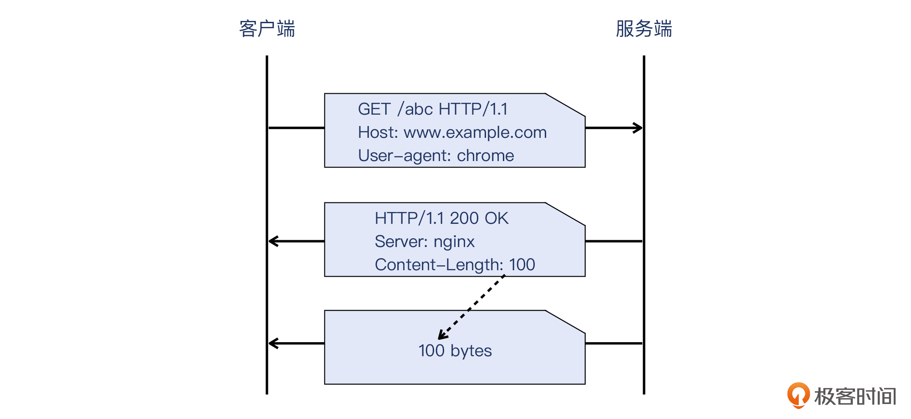
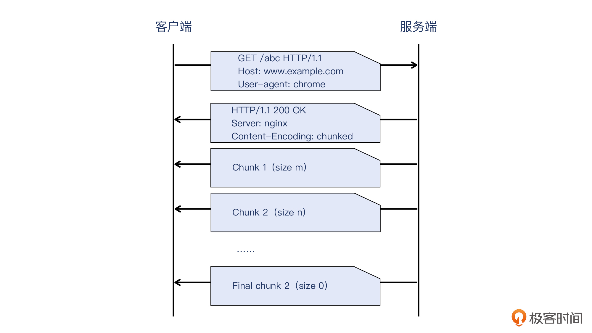
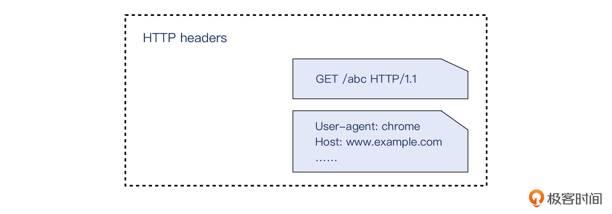
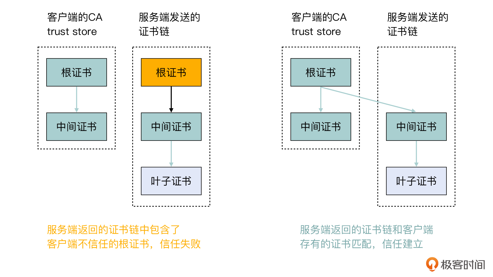

---
date: "2019-06-23"
---  
      
# 答疑（四）| 第16~20讲思考题答案
你好，我是胜辉。

今天咱们的思考题解答就要进入到第16\~20讲了。在第16到18讲里，我们通过几个应用层的案例，回顾了排查HTTP异常状态码的方法，也学习了偶发性问题的排查思路和技巧。在第19和20讲里，我们更是系统性地学习了TLS相关的知识，比如TLS密码套件、握手协商等细节，最后又对TLS解密这个敏感而实用的话题，进行了深入的探讨。

那么，结合了解密技能和应用层排查技能，相信你对应用层的网络难题的排查，也增加了不少把握。接下来，就让我们继续进入答题环节，先来看第16讲的思考题。

## 16讲的答疑

### 思考题

1.  在 HTTP 请求里，我们用 Content-Length 表示了 HTTP 载荷，或者说 HTTP body 的长度，那有时候无法提前计算出这种长度，HTTP 是如何表示这种“动态”的长度呢？
2.  HTTP 请求的动词加 URL 部分，比如 GET /abc，它是属于 headers，还是属于 body，或者哪种都不属于，是独立的呢？

### 答案

第一个问题的核心知识点，是 **HTTP的数据传输中，对于数据边界的约定**。我们知道，在计算机世界中，数据就是由0和1表示的一连串的二进制数字，而这一连串数字的起始和结束的位置就很关键了。如果结束位置无法确定，那么显然根本无法正确读取到数据。

<!-- [[[read_end]]] -->

举个例子，如果我们从网络上收到一段数字01010101，而变量A在它的前部，假如A的长度为4个bit，那就是0101，十进制的值是5。假如A的长度为5个bit，那就是01010，它的十进制值就是10了，跟之前完全不同。

> 补充：为了简化讨论，这里略过了大小端字节序的问题。

现在网络的带宽很大，每秒钟都可能传送着几十上百兆的数据，所以宏观上看，网络数据的传输好像是大批量地“并行”进行的。但在微观尺度里，比如在纳秒这个时间尺度上看，数据依然是一个一个bit（0或者1）地进行发出和接收，依然是“顺序的”。而在网络的每一层，都有相应的头部字段规定了载荷的开始位置（offset）和长度（length）。有了这些信息，接收端就可以正确读取这些数据了。

我们可以具体到HTTP这一层来看，它的请求和响应报文，也是同样的：先头部（headers）后载荷（body）。那HTTP头部的结束位置在哪里呢？这个在[第16讲](https://time.geekbang.org/column/article/489700)里我们就提到过，它不是用某个长度字段，而是**用两个CRLF这样的字符定义了头部的结束位置**。

而HTTP载荷的结束位置，又是如何定义的呢？其实有两种情况。一种就是最常见的，**用Content-Length头部直接定义出载荷的长度**，非常直接。接收端只要读取到这个长度的数据时，就知道已经读取到了完整数据了。



另外一种，就是**针对“动态长度”的数据，HTTP用Content-Encoding: chunked这个头部，声明了块传输的方式**。

这里说的数据为什么是“动态”的呢？是因为这些数据，无法在发送HTTP响应的开始阶段就确定下来，那么服务端就需要通过这种块传输的方式，一边计算出一部分数据，一边发送这些数据块（也就是chunk），这就是所谓“动态”了。也正是通过这种方式，解决了“既要传输数据，又无法在传输开始时就知道数据大小”的矛盾。

不过，chunk传输源源不断，那客户端怎么知道哪个chunk是结束呢？其实，每个chunk的开头的信息就是这个块的长度值，而**如果这个长度是0，就表示这是最后一个chunk了，这也就是结束的位置**。示意图如下：



第二个问题可能是不少人忽视的一个知识点。我们知道，Server、Host等header就是明确的HTTP头部，而在这些header之前的“GET /abc HTTP/1.1”（也就是方法 + URL + 版本号），虽然形式上并不是像其他header那样的键值对，但它确实也属于HTTP头部。

其实这个知识点在这一讲的案例里就有体现。当时HAProxy把后端HTTP 400转义为前端HTTP 502，其原因就是在于：HAProxy的代码里，定义了HTTP头部大小不能超过8KB的逻辑，而GET URL正是属于这8KB中的一部分。



## 17讲的答疑

### 思考题

1.  如果 LB / 反向代理给客户端回复 HTTP 503，表示什么呢？如果 LB / 反向代理给客户端回复 HTTP 500，又表示什么呢？
2.  这节课里，我介绍了使用应用层的某些特殊信息，比如 uuid 来找到 LB 两侧的报文的对应关系。你有没有别的好方法也可以做到这一点呢？

### 答案

第一个问题，考查的是我们对HTTP 503跟500的不同语义的理解，以及这两个状态码跟LB的关系。我在课程里提过，**LB是中间设备，它本身一般不会出现HTTP 500**。如果后端有HTTP 500，LB就直接透传给客户端。而如果后端出现了服务不可用，比如LB到后端服务的健康检查失败，LB无法找到一个可用的后端服务器，那么LB就会回复HTTP 503给客户端。

也正是通过HTTP 503，LB表达了这层意思：“我自己是没问题的，但是后端服务器都处于不能干活的状态”。

类似的情况是HTTP 502，也就是LB后端的服务器返回了不合规的HTTP响应。你也可以再次复习一下课程里的这张图：


第二个问题也没有标准答案。其实只要在你的环境里有类似的id，能通过它区分不同的HTTP请求就可以了，无论它是叫uuid，还是traceid，或者是transaction id。然后各种contains过滤器，也就是我们在[答疑二](https://time.geekbang.org/column/article/495213)里对[07讲](https://time.geekbang.org/column/article/482610)做解答时候提到的这些：

* 应用层可以是 `http contains "abc"`；
* 传输层可以是 `tcp contains "abc"`；
* 网络层可以是 `ip contains "abc"`；
* 数据链路层可以是 `frame contains "abc"`。

## 18讲的答疑

### 思考题

1.  前面我介绍了使用 tshark 来找到耗时最高的 HTTP 事务的方法。关于 tshark，你自己还有哪些使用经验呢？
2.  在“是否还有其他可能？”这里，我提到了可能的重传。如果要验证是否真的存在这种重传，你觉得应该做什么呢？

### 答案

第一个问题，**\@Realm** 同学做了很好的回答：

> `tshark \-R "tcp.analysis.retransmission || tcp.analysis.out_of_order"` 通过 `-R` 指定过滤条件，抓重传和乱序的包。

tshark是随着Wireshark一起被安装到系统里的工具，它的各种过滤器等特性跟Wireshark是一样的，所以能在命令行里面做同样的分析工作。

> 补充：不过可能是版本的区别，如果你运行 `tshark \-R "tcp.analysis.retransmission || tcp.analysis.out_of_order" \-r file.pcap` 报错，把 `-R` 改为 `-Y` 就可以执行了，或者在 `-R` 前面加上-2。

像上面的tcp.analysis是一个很大的过滤器的集合。要查看tcp.analysis的各种分支，你可以这样做：

 *    **在Wireshark的过滤器输入框里输入tcp.analysis**，很多相关的过滤器就会被提示出来。
 *    **在命令行里执行tshark -G | grep tcp.analysis**，一部分输出如下：

```
    $ tshark -G | grep tcp.analysis
    F	SEQ/ACK analysis	tcp.analysis	FT_NONE	tcp		0x0	This frame has some of the TCP analysis shown
    F	TCP Analysis Flags	tcp.analysis.flags	FT_NONE	tcp		0x0	This frame has some of the TCP analysis flags set
    F	Duplicate ACK	tcp.analysis.duplicate_ack	FT_NONE	tcp		0x0	This is a duplicate ACK
    F	Duplicate ACK #	tcp.analysis.duplicate_ack_num	FT_UINT32	tcp	BASE_DEC	0x0	This is duplicate ACK number #
    F	Duplicate to the ACK in frame	tcp.analysis.duplicate_ack_frame	FT_FRAMENUM	tcp		0x0	This is a duplicate to the ACK in frame #
    F	This is an ACK to the segment in frame	tcp.analysis.acks_frame	FT_FRAMENUM	tcp		0x0	Which previous segment is this an ACK for
    F	Bytes in flight	tcp.analysis.bytes_in_flight	FT_UINT32	tcp	BASE_DEC	0x0	How many bytes are now in flight for this connection
    F	Bytes sent since last PSH flag	tcp.analysis.push_bytes_sent	FT_UINT32	tcp	BASE_DEC	0x0	How many bytes have been sent since the last PSH flag
    F	The RTT to ACK the segment was	tcp.analysis.ack_rtt	FT_RELATIVE_TIME	tcp		0x0	How long time it took to ACK the segment (RTT)
    F	iRTT	tcp.analysis.initial_rtt	FT_RELATIVE_TIME	tcp		0x0	How long it took for the SYN to ACK handshake (iRTT)
    F	The RTO for this segment was	tcp.analysis.rto	FT_RELATIVE_TIME	tcp		0x0	How long transmission was delayed before this segment was retransmitted (RTO)
    F	RTO based on delta from frame	tcp.analysis.rto_frame	FT_FRAMENUM	tcp		0x0	This is the frame we measure the RTO from
    F	This frame is a (suspected) retransmission	tcp.analysis.retransmission	FT_NONE	tcp		0x0
    F	This frame is a (suspected) fast retransmission	tcp.analysis.fast_retransmission	FT_NONE	tcp		0x0
    .   .....
    

```

tshark加上-G参数会输出所有可用的过滤器，数量多达20万个（你没看错）。这个大宝藏，值得我们去多多探索和挖掘一下。

至于第二个问题，要搞清楚服务端是否有重传，最直接的办法就是**在服务端也做抓包**。这样的话，有没有重传就一目了然了。当然，在客户端抓包的话，也经常能通过乱序等现象推导出对端发生了重传，但不能保证涵盖所有的重传情形。

## 19讲的答疑

### 思考题

1.  我们知道 TCP 是三次握手，那么 TLS 握手是几次呢？
2.  假设服务端返回的证书链是根证书 + 中间证书 + 叶子证书，客户端没有这个根证书，但是有这个中间证书。你认为客户端会信任这个证书链吗？

### 答案

第一个问题是TLS握手的基本知识。不考虑TLS session复用或者TLS1.3的1RTT，甚至0RTT这种特殊情况，一般情况下TLS握手是四次。

* 第一次握手：客户端发送Client Hello。
* 第二次握手：服务端发送Server Hello和Certificate等消息。
* 第三次握手：客户端发送ClientKeyExchange和ChangeCipherSpec等消息。
* 第四次握手：服务端发送ChangeCipherSec和Finished。

在RFC5246的[Handshake Protocol Overview](https://datatracker.ietf.org/doc/html/rfc5246#section-7.3)的第35页，也有关于这个知识点的详述，我把其中的关键部分引用到这里，供你参考。

```
          Client                                               Server
    
          ClientHello                  -------->
                                                          ServerHello
                                                         Certificate*
                                                   ServerKeyExchange*
                                                  CertificateRequest*
                                       <--------      ServerHelloDone
          Certificate*
          ClientKeyExchange
          CertificateVerify*
          [ChangeCipherSpec]
          Finished                     -------->
                                                   [ChangeCipherSpec]
                                       <--------             Finished
          Application Data             <------->     Application Data
    

```

第二个问题是关于证书信任链的知识。我们知道，**PKI的信任不是凭空来的，而是有一个起点，而这个起点就是客户端保存的根证书**。有了它，一系列信任才能建立起来。而在这个问题里，由于客户端并没有这张根证书，而服务端返回的证书链又绑定了这张不被信任的根证书，那么信任链就无法建立了。

在这个问题里，客户端有这张中间证书却不能信任这个证书链，你可能对这一点感觉费解。其实这个题目里隐含了一个信息：**这张中间证书是被两张根证书都做了签名的**，否则服务端也不会把这个根证书放在证书链里一同返回。但是这个证书链强制把中间证书绑定到客户端不信任的根证书，就导致验证失败了。

为了帮助你理解，我们可以换一种场景：如果服务端返回的证书链中，只有这张中间证书和叶子证书，那么因为客户端可以把这张中间证书跟自己信任的根证书关联起来，就可以建立信任。

我们可以再看一下这两种情形下的对比示意图，就更能明白了：



## 20讲的答疑

### 思考题

1.  DH、DHE、ECDHE，这三者的联系和区别是什么呢？
2.  浏览器会根据 SSLKEYLOGFILE 这个环境变量，把 key 信息导出到相应的文件，那么 curl 也会读取这个变量并导出 key 信息吗？

### 答案

第一个问题，很多同学都答得很好了。我在这里引用一下**\@那时刻**同学的回答：

> DH 算法是非对称加密算法，因此它可以用于密钥交换，该算法的核心数学思想是离散对数。  
>    
> 根据私钥生成的方式，DH 算法分为两种实现：  
>    
> 第一种，static DH算法，这个算法实际已经被废弃了，因为它算法不具备前向安全性。  
>    
> 第二种，DHE 算法，这是现在比较常用的，也就是让双方的私钥在每次密钥交换通信时，都是随机生成的、临时的。  
>    
> 不过，DHE 算法由于计算性能不佳，需要做大量的乘法，所以为了提升 DHE 算法的性能，就出现了现在广泛用于密钥交换算法——ECDHE 算法。它是在 DHE 算法的基础上，利用ECC椭圆曲线特性，可以用更少的计算量计算出公钥，以及最终的会话密钥。

而第二个问题是一个实践性的问题，不少同学也去实证了。其实也花不了几分钟时间，就能收获一个不错的知识点，有没有觉得这个片刻也挺有意义呢。

好了，今天的答疑就到这里。这些答案，有没有在你的预期以内呢？如果还有新的问题，也欢迎在留言区提问，我们一起进步、成长。