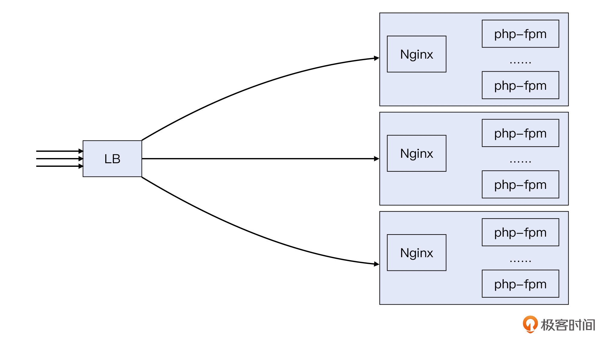
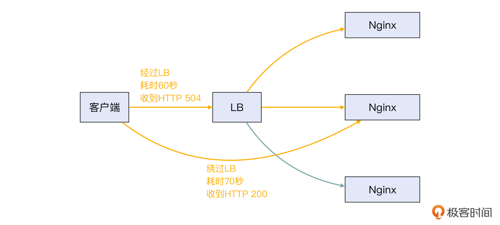
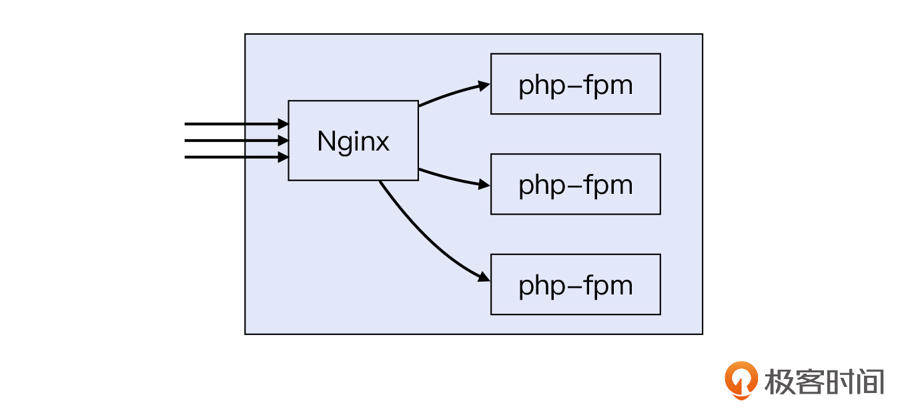
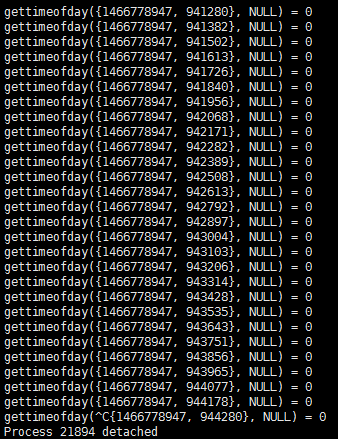
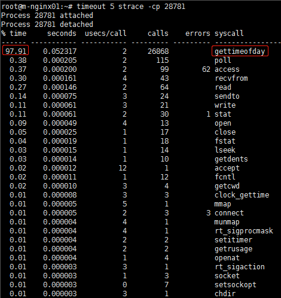
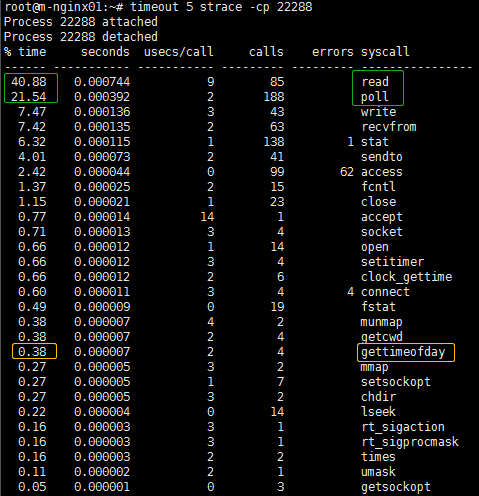
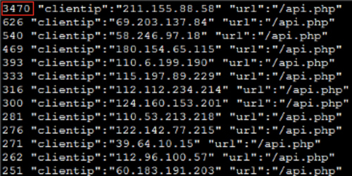

---
date: "2019-06-23"
---  
      
# 21 | 为什么用了负载均衡更加不均衡？
你好，我是胜辉。

咱们课程的第二个实战模块“应用层真实案例揭秘篇”已经进行到后半程了。前半程的四讲（15到18）都是围绕应用层特别是HTTP的相关问题展开排查。而在刚过去的两讲（19和20）里，我们又把TLS的知识和排查技巧学习了一遍。

基本上，无论是网络还是应用引发的问题，也无论是不加密的HTTP还是加密的HTTPS，你应该都已经掌握了一定的方法论和工具集，可以搞定不少问题了。

但是我们也要看到，现实世界里也有不少问题是混合型的，未必一定是跟网络有关。比如，你有没有遇到过类似下面这种问题：

* ping正常，抓包看也没有丢包或者乱序现象，但是应用就是缓慢；
* Telnet端口能通，但应用层还是报错。

其实这也说明了，掌握网络排查技能固然重要，但完全脱离操作系统和架构体系方面的知识，仅根据网络知识去做排查，也有可能会面临知识不够用的窘境。所以，作为一个技术人，我们**任何时候都不要限制自己的学习和成长的可能**，掌握得越多，相当于手里的牌越多，我们就越可能搞定别人搞不定的问题。

所以接下来的两节课，我会集中**围绕系统**方面的案例展开分析，希望可以帮助你构造这方面的能力。等以后你遇到网络和系统扯不清的问题时，也不会发怵，而是可以准确定位，高效推进了。

<!-- [[[read_end]]] -->

## 案例1：高负载和不均衡

这也是我在公有云工作的时候处理的真实案例。当时一个客户是做垂直电商的，他们的体量还不大，所以并没有自建机房，而是放到公有云上运行。他们的架构大致是这样的：



LB运行在第四层，设置的负载均衡策略是round robin（轮询），也就是新到达LB的请求，**依次派发**给后端3个Nginx服务器，使得每台机器获得的请求数相同。Nginx运行在第七层，它作为Web服务器接收HTTP请求，然后通过[FastCGI](https://en.wikipedia.org/wiki/FastCGI)接口传递给本机的[php-fpm](https://en.wikipedia.org/wiki/PHP#PHPFPM)进程，进行应用层面的处理。

应该说，这就是一个非常典型的负载均衡架构，平时运行也正常。不过有一天，客户忽然报告系统出问题了，网站访问越来越慢，甚至经常会抛出HTTP 504错误。如下图所示：


我们借助浏览器开发者工具可以看到，这个响应耗时长达60秒，然后抛出了504错误。事实上，一般人浏览一个网站的时候，等个十来秒肯定就没耐心了，所以这次的问题确实很严重。

### 初步检查

这三台Nginx服务器的配置都是8核CPU。从服务端的监控来看，它们的系统负载，也就是CPU load出现了严重的不均衡。其中一台的负载值在7左右，一台在20左右，最后一台居然高达40左右，远远超过它们的CPU核的数量。

我们知道，**uptime或者top命令输出里的CPU load值，表示的是待运行的任务队列的长度**。比如8核的机器，load到8，那就是8CPU核处理8个任务，全部用满了。不过，能到用满的程度，实际已经对应用的性能产生明显的影响了，所以一般建议 **load值不超过核数\*0.7**。也就是8核的机器，建议在load达到5.6的时候，就需要重点关注了。

回到这三台Nginx机器，我们看看具体的load。

Nginx 1的load大致在10到20之间：


Nginx 2的load在7左右：


Nginx 3就很高了，在40以上：


联系前面我们提到的负载均衡，你大概也明白为什么客户找过来了：因为3台机器的负载不均衡啊，难道不是你们的LB工作不正常导致的吗？

这确实是一个形式上讲得通的逻辑，我们开工吧。

### 排查LB

首先需要检查网络状况。我们做了抓包分析，发现传输本身一切正常，没有丢包也没有特殊的延迟。

然后，我们需要确认LB工作是否正常。从直观上看，处于LB后端的3台机器的load不均，似乎也意味着LB分发请求时做得不均衡，要不然为啥后端这些机器的负载各不相同呢？


不过，这个load不均的问题，也可能只是表象，因为会影响到load的因素是比较多的。我们回到最初，既然要证明LB工作是否正常，最直接的方式，还是**查证LB是否做到了round robin，也就是分发的请求数量是否均等**。于是我们去查LB上的日志，看看这三台后端机器分得的请求数量。


以上就是LB上的统计，红框圈出来的那一列是请求数，3台Nginx对应这3行，可见请求数都是1364，这就说明LB的round robin机制运行正常。

接着，跟之前课程里的很多案例类似，我们做了一个简单的排除性测试：我们绕过LB，直接访问Nginx机器。结果发现：

* load为7的那台机器，还勉强可以在10秒左右回复响应；
* 另外两台机器（也就是load为20和40的机器）的响应要慢很多，超过了60秒。

> 补充：如果只使用load为7的那台机器，而禁用另外两台，行不行呢？当然是不行的，一台肯定撑不住这个流量，必须要三台一起服务。所以还是要把根因给找到并解决。

我们再来对比一下“通过LB”和“绕过LB”这两种场景下的问题现象：

* 通过LB，耗时60秒的时候收到HTTP 504。
* 绕过LB，虽然收到了HTTP 200，但是耗时长达70多秒。



其实这两个场景的根本问题是一致的，都是后端服务器特别慢。这就再一次排除了LB本身的嫌疑。于是，问题就变成了“**为什么机器的负载变高了？**”

### 排查主机

那么，到了系统排查这一步，我们就没办法再用tcpdump结合Wireshark去排查了，因为问题跟网络报文没有关系。具体点说，我们要做下面这些事情：

* 分析所有进程，找到具体是哪个进程引起了load升高。
* 分析进程细节，找到是什么Bug导致该进程变成了问题进程。

针对第一个问题，最常用的工具就是 **top命令**。通过top，我们很快就找到了消耗CPU资源最多的进程，发现是php-fpm进程。客户的电商程序框架本身是基于PHP开发的，所以需要PHP解释器来运行程序。又因为Nginx本身不能处理PHP，所以需要结合php-fpm才能正常工作。也就是下图这样：



既然确定了问题进程，接下来就是要排查进程导致load高的原因。排查这个问题，大致也有两个思路。

* **白盒检查**：检查代码本身，找到根因。
* **黑盒检查**：不管代码怎么回事，我们从程序的外部表现来分析，寻求根因。

因为核心代码是客户的国外合作方维护的，客户自己并不十分清楚这里面所有的逻辑，所以白盒这条路，有点超出了他们的能力。那么自然的，我们要走第二条路。

### 排查操作系统

跟网络排查中有tcpdump这样强大的工具类似，进程的排查也有相关的强大工具，比如 **strace**。通过strace，我们可以把排查工作从进程级别，继续追查到更细的syscall（系统调用）级别。无论是系统调用读写文件时的问题，还是系统调用本身的问题，都可以在strace的帮助下现出原形。

不过，我这里需要先介绍一些系统调用相关的知识，方便你更好地理解strace。

### 什么是系统调用？

系统调用，英文叫system call，缩写是syscall。如果我们把操作系统视作一个巨大的应用程序，那么系统调用相当于什么呢？其实，就相当于 **API**。利用各种系统调用，应用程序就可以做到各种跟操作系统有关的任务了。

如果没有系统调用，让应用程序直接去操作文件系统、内存等资源会怎么样呢？那一定是一场灾难。我们可以想象一个场景：程序A往地址为100\~300的内存段里写入数据，然后程序B往地址为200\~400的内存段里写入数据，因为200\~300这段内存被A和B所共用，就很容易产生错乱，这两个程序都可能因此而出错乃至崩溃。

所以，我们必须有一个“管理机构”来统筹安排，让所有的应用程序都向这个统一机构申请资源和办理业务。**这个“管理机构”就是操作系统内核，而系统调用就是这个机构提供的“服务窗口”。**

#### 内核态和用户态

实际上，从更底层的视角来说，操作系统必须要提供系统调用的另一个原因，是计算机体系结构本身的设计。为了避免前面例子里那种不合理的操作，以及让不同安全等级的程序使用不同权限的指令集，大部分现代CPU架构都做了保护环（Protection Ring）的设计。

比如，x86 CPU实现了4个级别的保护环，也就是ring 0到ring 3，其中ring 0权限最大，ring 3最小。就拿Linux来说，它的内核态就运行在ring 0，只有内核态可以操作CPU的所有指令。Linux的用户态运行在ring 3，它就没办法操作很多核心指令。


那么处于ring 3的应用程序也想要运行ring 0的指令的话，该怎么办到呢？就是让内核去间接地帮忙。而这个“忙”，其实就是通过**系统调用**来“帮”的。

这样的话，用户空间程序就可以借系统调用之手，完成它原本没有权限完成的指令（进入内核态）。下面这张示意图就展示了用户空间、系统调用、内核空间这三者之间的关系：


既然，系统调用要给用户空间的应用程序提供丰富而全面的接口，无论是文件和网络等IO操作，还是像申请内存等更加核心的操作，都需要通过系统调用来完成，那么系统调用的数量肯定是不少的。比如Linux的系统调用数量大约在300多个，有的操作系统则会达到500个以上。

#### strace

了解了系统调用，我们再来认识下strace。strace这个工具的s，指的就是sycall，所以strace就是对 **s**yscall的trace。通过这个命令，我们可以观测到一个进程访问的所有系统调用、给这些系统调用传入的参数，以及系统调用的输出。可想而知，这样充足的信息就给系统排查工作提供了极大的帮助。

你可以想象一下，没有strace的时候，你只是看到了程序的表象，也就是程序想让你看到的，你才能看到（比如通过标准输出或者日志文件）。而有了strace，程序的一举一动就全在你的视野里了，你就像有了火眼金睛，程序在明里暗里干的所有事情，都会被你知道。

夸奖了一番strace，我们来了解一下它的具体用法。strace的用法一般有两种。

**直接在命令之前加上strace**。比如我们想知道curl www.baidu.com这个命令，在系统调用层面具体发生了什么，就可以执行strace curl www.baidu.com，然后就能看到前后的几十个系统调用，包括打开文件的openat\(\)、关闭文件描述符的close\(\)、建立TCP连接的connect\(\)等等。

**执行strace \-p PID**。这样的话，你需要先找到进程的PID，然后执行这条指令来完成追踪。这比较适合对持续运行的服务（Daemon）进行追踪。比如，你可以先找到某个进程的进程号，然后执行strace \-p PID，找到这个进程在系统调用方面的细节。当然，你还可以加上各种其他参数，来达到不同的追踪效果。

### 使用strace

好了，聊完了strace的强大功能，接下来看它的表现。我们用strace命令，对php-fpm的进程号进行追踪，也就是执行这个命令：

```
    strace -p 进程号
    

```

果然发现一个非常奇怪的现象：整屏刷的都是gettimeofday\(\)这个系统调用：



看起来好像只有这个调用了，那有没有别的调用呢？

我们可以对strace命令加上 **\-c参数**，这样可以统计每个系统调用消耗的时间和次数，看看这个奇怪的gettimeofday\(\)系统调用，占用了多少比例。我们在strace前面加上timeout 5，就可以收集5秒钟的数据了，命令如下：

```
    timeout 5 strace -cp 进程号
    

```

命令输出如下：



可见，gettimeofday\(\)占用了这个进程高达97.91\%的运行时间。在短短的5秒之内，gettimeofday\(\)调用次数达到了2万多次，而其他正常的系统调用，比如poll\(\)、read\(\)等，只有几十上百次。也就是说，**非业务操作的耗时是业务操作耗时的50倍**（`98%:2%`）。难怪进程这么卡，原来全都花在执行getimeofday\(\)，也就是收集系统时间数据上了。

那么，为什么会有这么多gettimeofday\(\)的调用呢？这里的php-fpm有什么特殊性吗？我们按这个方向去搜索，发现有不少人也遇到了同样的问题，比如Stack Overflow上这个人的[“遭遇”](https://stackoverflow.com/questions/23454686/high-cpu-usage-in-php-fpm)。简而言之，原因多半是启用了某些性能监控软件。

我们把这个情况告诉了客户，对方忽然想起来，最近他们的国外团队确实有做一些性能监控的事情，用的软件好像叫New Relic。果然，我们在客户服务器上找到了这个New Relic。看下图：


原来，问题的根因就是他们的国外团队部署了New Relic，而这个软件发起了极为频繁的gettimeofday\(\)系统调用。这些调用抢走了大部分的CPU时间，这就导致业务代码基本没有机会被执行。因为LB有个60秒超时的机制，所以它眼看着收不到后端Nginx服务器的返回，就不得不返回HTTP 504了。也就是下面这样：


这个根因有点令人哭笑不得，不过对见怪不怪的技术支持团队来说，心里早已云淡风轻了。接下来就是客户卸载New Relic，应用立刻恢复正常。用strace再次检查，显示系统调用也恢复正常：



可以看到，read\(\)和poll\(\)系统调用，上升到进程CPU时间的60\%以上，而gettimeofday\(\)降低到不足1\%，所以已经彻底解决问题了。

## 案例2：LB特性和不均衡

我再给你讲一个案例。还有一个电商客户，也遇到了一次负载不均衡的问题。这是在双十一期间，客户发起了促销活动，随之而来的访问压力的上升也十分明显，而他们的后端服务器也出现了负载不均的现象，有时候访问十分卡顿，于是我们再次介入排查。

这次的架构是一台LB后面接了两台服务器，其中一台的CPU load高达50以上，也是远远超过了8个的CPU核数。另外一台情况要好一些，load在10左右，当请求被分配到这台服务器上的时候，还算勉强可以访问。


因为CPU load在两台机器上有比较大的差异，从访问速度来说，大约是一半请求会非常慢，一半请求略快一些，所以客户就怀疑：LB的请求分配做得不均衡，导致其中一台处理不过来。

真的是这样吗？我们检查了LB的访问日志，发现一个有意思的现象：

* 大部分的访问请求是到了/api.php这个URL上。
* 按HTTP请求的源IP来分开统计，某些IP的访问量远远大于其他IP。

我们来看一下根据源IP分开统计的访问次数：



很明显，图中第一行的源IP，对/api.php这个URL有3470次访问，而其他源IP的访问量比它低了一个数量级，只有小几百。那么，这跟问题有什么关系呢？

我们通过对LB日志做进一步的分析后发现，同样是源IP的请求，要么去了Nginx 1，要么去了Nginx 2。再次检查了这台LB的配置后，我们发现客户在LB上开启了“**会话保持**”（Session Persistence）。这就造成了下面这种分布不均的现象：


你可能也知道，会话保持是LB的常见功能，它主要是起到了维持会话状态的作用。在开启了会话保持功能后，LB会维护一张映射表，供每次分发请求之前做匹配。如果LB查到某个请求属于之前的某个会话，就会把这个请求转发给上一次会话所选择的后端服务器；否则就按默认的负载均衡算法，来选择一个后端服务器。

那么，LB怎么确定一个请求属于之前的会话呢？这就要说到会话保持的类型了。我们用的LB是HAProxy，它的会话保持有两种。

* **源IP**：凡是源IP相同的请求，都去同一个后端服务器。
* **Cookie**：凡是HTTP Cookie值相同的请求，都去同一个后端服务器。

而客户启用的是第一种：基于源IP的会话保持。不巧的是，这次访问量的源IP本身的分布就很不均匀。就像前面提到的，某个IP发起了10倍于其他IP的请求量，那么这个源IP所分配到的后端服务器，就不得不服务着10倍的请求了，然后就导致了负载不均的问题出现。

所以，我们让客户关闭了会话保持，两台后端服务器的负载很快就恢复平衡了。我们也给出了进一步的建议：最好把/api.php这个服务跟其他的服务隔离开，比如使用另外的域名，做另一套负载均衡。这是因为，/api.php的访问量和作用，跟其他接口的区别很大，通过对它做独立的负载均衡，既可以隔离互相之间的干扰，也有利于提供更加稳定的访问质量。

而且，这次的问题也是无法用tcpdump来排查的，它需要我们对LB的特点很熟悉，以及对LB和应用结合的场景，都有一个全面的认识。

## 实验

我们已经学习了strace，现在做一个简单的小实验，来巩固一下学到的知识吧。我们可以这样做：

 1.     到[这里](https://hub.docker.com/r/moonlightysh/v_nginx)下载并执行一个Nginx服务的Docker镜像，也就是执行：

```
    docker run --cap-add=SYS_PTRACE -p 80:80 -it docker.io/moonlightysh/v_nginx bash
    

```

> 注意，这里必须加上 `--cap-add=SYS_PTRACE`，否则容器内的strace将不能正确运行。

 2.     进入容器后，启动里面的Nginx服务，执行：

```
    systemctl start nginx
    

```

 3.     还是在容器内，启动strace：

```
    strace -p $(pidof nginx | awk '{print $1}')
    

```

此时，strace就开始监听Nginx worker进程了。

> 补充：这里用 `awk '{print $1}'` 是为了追踪Nginx worker进程，它出现在pidof命令输出的左边，而最右边是Nginx master进程。跟踪Nginx master进程是看不到HTTP处理过程的。

 4.     从你的本机发起HTTP请求，也就是执行 `curl localhost:80`，此时在容器内Nginx在处理这次请求时，就会发起很多系统调用，而strace就全面展示了这些调用涉及的文件和参数细节。比如下面这样的strace输出：

```
    root@48fc1221a03a:/# strace -p $(pidof nginx | awk '{print $1}')
    strace: Process 14 attached
    epoll_wait(9, [{EPOLLIN, {u32=4072472592, u64=140681431285776}}], 512, -1) = 1
    accept4(6, {sa_family=AF_INET, sin_port=htons(60070), sin_addr=inet_addr("172.17.0.1")}, [112->16], SOCK_NONBLOCK) = 3
    epoll_ctl(9, EPOLL_CTL_ADD, 3, {EPOLLIN|EPOLLRDHUP|EPOLLET, {u32=4072473289, u64=140681431286473}}) = 0
    epoll_wait(9, [{EPOLLIN, {u32=4072473289, u64=140681431286473}}], 512, 60000) = 1
    recvfrom(3, "GET / HTTP/1.1\r\nHost: localhost\r"..., 1024, 0, NULL, NULL) = 73
    stat("/var/www/html/", {st_mode=S_IFDIR|0755, st_size=4096, ...}) = 0
    stat("/var/www/html/", {st_mode=S_IFDIR|0755, st_size=4096, ...}) = 0
    stat("/var/www/html/index.html", 0x7ffcb86eac80) = -1 ENOENT (No such file or directory)
    stat("/var/www/html", {st_mode=S_IFDIR|0755, st_size=4096, ...}) = 0
    stat("/var/www/html/index.htm", 0x7ffcb86eac80) = -1 ENOENT (No such file or directory)
    stat("/var/www/html/index.nginx-debian.html", {st_mode=S_IFREG|0644, st_size=612, ...}) = 0
    stat("/var/www/html/index.nginx-debian.html", {st_mode=S_IFREG|0644, st_size=612, ...}) = 0
    openat(AT_FDCWD, "/var/www/html/index.nginx-debian.html", O_RDONLY|O_NONBLOCK) = 11
    fstat(11, {st_mode=S_IFREG|0644, st_size=612, ...}) = 0
    setsockopt(3, SOL_TCP, TCP_CORK, [1], 4) = 0
    writev(3, [{iov_base="HTTP/1.1 200 OK\r\nServer: nginx/1"..., iov_len=247}], 1) = 247
    sendfile(3, 11, [0] => [612], 612)      = 612
    write(4, "172.17.0.1 - - [07/Mar/2022:14:2"..., 87) = 87
    close(11)                               = 0
    setsockopt(3, SOL_TCP, TCP_CORK, [0], 4) = 0
    epoll_wait(9, [{EPOLLIN|EPOLLRDHUP, {u32=4072473289, u64=140681431286473}}], 512, 65000) = 1
    recvfrom(3, "", 1024, 0, NULL, NULL)    = 0
    close(3)                                = 0
    epoll_wait(9,
    

```

## 小结

我们的课程主旨是网络排查，但因为网络跟系统又是密不可分的关系，所以在掌握Wireshark等技能以外，我们最好要熟悉操作系统排查的常规步骤。

在这节课里，我们通过一个典型的系统问题导致服务慢的案例，学习了内核空间（内核态）、用户空间（用户态）、系统调用这些操作系统的概念。另外我们还重点学习了strace这个工具，知道它有两种使用方式：**直接在命令之前加上strace；执行strace \-p PID。**

那么在案例中，我们也用 **strace-cp PID中的-c参数**，对进程发起的各种系统调用进行了执行次数和执行时间的统计，这对于分析进程耗时的去向会很有帮助。

在这里，我们也再一次温习下HTTP 504的概念。在后端服务不能在LB的时限内回复HTTP响应的时候，LB就会用HTTP 504来回复给客户端，告诉它是后端服务超时（潜台词：我LB可没问题）。

而在第二个案例里，我们了解了**会话保持在某些情况下会“放大”负载不均衡**的问题。所以你要知道，在启用会话保持功能时，你需要根据实际情况，做通盘的考虑。

## 思考题

给你留两道思考题：

* 在案例1里面，LB回复了HTTP 504。那在什么情况下，这个LB会回复HTTP 503呢？
* 除了strace，你还知道哪些trace类的工具可以帮助排查呢？

欢迎你在留言区分享自己的经验，我们一同成长。