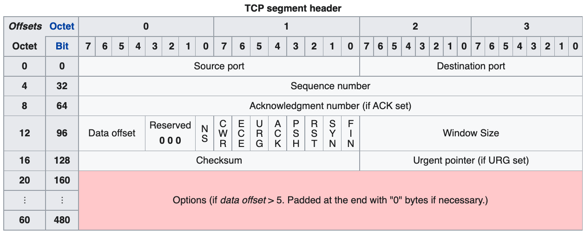
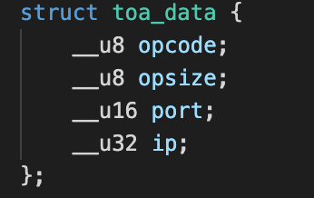
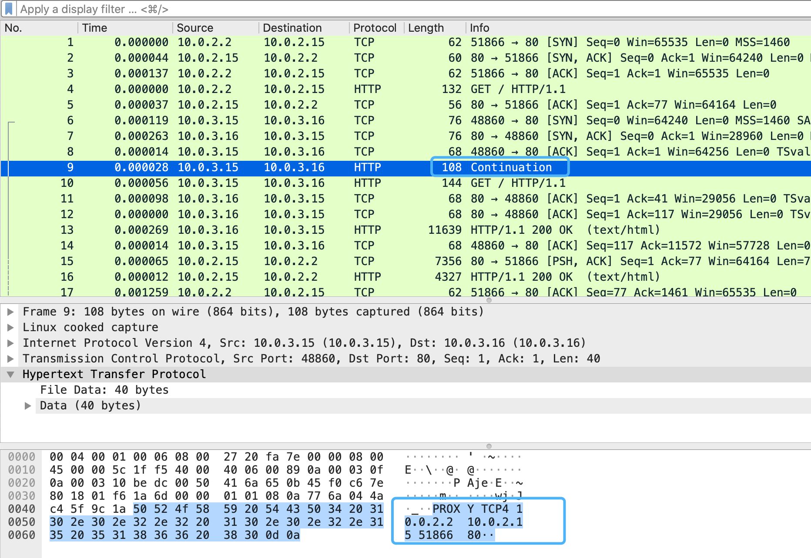
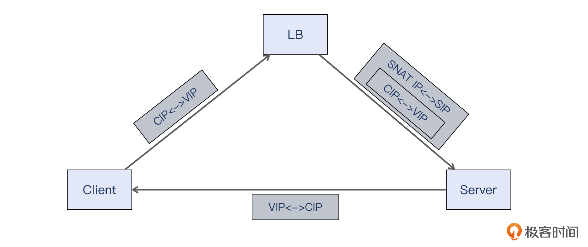

---
date: "2019-06-23"
---  
      
# 不定期加餐（一） | 八仙过海，各显神通：透传真实源IP的各种方法
你好，我是胜辉。这节加餐课，我们来聊聊透传真实源IP的各种方法。

在互联网世界里，真实源IP作为一个比较关键的信息，在很多场合里都会被服务端程序使用到。比如以下这几个场景：

* **安全控制**：服务端程序根据源IP进行验证，比如查看其是否在白名单中。使用IP验证，再结合TLS层面和应用层面的安全机制，就形成了连续几道安全门，可以说是越发坚固了。
* **进行日志记录**：记下这个事务是从哪个源IP发起的，方便后期的问题排查和分析，乃至进行用户行为的大数据分析。比如根据源IP所在城市的用户的消费特点，制定针对性的商业策略。
* **进行客户个性化展现**：根据源IP的地理位置的不同，展现出不同的页面。以eBay为例，如果判断到访问的源IP来自中国，那就给你展现一个海淘页面，而且还会根据中国客户的特点，贴心地给你推荐流行爆款。

虽然源IP信息有这么多用处，但是现实情况中，这个源IP信息还不是那么好拿。这个原因有很多，最主要的还是跟负载均衡（LB）的设计有关系。

一般来说，用户发起HTTP请求到网站VIP，VIP所在的LB会把请求转发给后端，一前一后分别有两个TCP连接。

* 前一个TCP连接的客户端IP是CIP，服务端IP是VIP。
* 后一个TCP连接的客户端IP是LB的SNAT IP，服务端IP是SIP。

<!-- [[[read_end]]] -->

由此，我们可以得到以下示意图：


在这个过程中，LB把这两个表面上没有任何联系的TCP连接“映射”了起来，所以也只有LB知道，从哪个真实源IP（这里的CIP）来的请求被转发到了哪一个后端的连接上去了。

在这种设计之下，可怜的服务端（SIP）却**只能看到LB的SNAT IP，对CIP是一无所知**，就导致了上面说的好几个功能一个都用不上。

不过别急，我们有这么几种方法来解决这个难题。我会按网络层级来一一介绍，分别是应用层方法、传输层方法，还有网络层方法。

我们先看应用层方法。

## 应用层方法

在这一层，Web协议的制定者们想到了一个巧妙的办法：既然HTTP协议比较灵活，那就可以**设计一个新的header，用来传递真实源IP，它就是X-Forwarded-For**。这个标准最初是Squid的开发工程师提出的，很快受到了业界的支持，各种web服务器都早已支持了这个header。

> 补充：Squid是应用最为广泛的代理和缓存软件之一。

X-Forwarded-For的形式跟其他HTTP header一样，也是key: value的形式。key是X-Forwarded-For这个字符串，value是一个IP或者用逗号分隔开的多个IP，也就是下面这样：

```
    X-Forwarded-For: ip1,ip2,ip3
    

```

那为什么会有多个IP的情形呢？因为一个HTTP请求，可能会被多个HTTP代理等系统转发，每一级代理都可能会把上一个代理的IP，附加到这个X-Forwarded-For头部的值里面。最左边的IP就是真实源IP，后面跟着的多个IP就是依次经过的各个代理或者LB的IP。

我们来看个例子。下面是截取的某个抓包文件的HTTP请求的部分，能看到X-Forwarded-For头部，它的值为真实源IP。同时也看到还有另外一个头部X-Forwarded-Proto，它的值为真实客户端跟这个代理之间通信的协议，此处为HTTP，当然也可以是HTTPS。


不过，X-Forwarded-For这个标准，虽然用一种相对低的成本解决了“服务器不能获取真实源IP”的问题，但它本身还是有一些不足的，我们来看一下。

* **源IP信息的伪造问题**

这也是它最大的问题，因为这个头部本身没有任何安全保障机制，攻击者完全可以任意构造X-Forwarded-For信息来欺骗服务端。

比如，如果攻击者知道服务端对某个IP段来的请求进行特殊处理（比如会提供更大力度的优惠券），那么攻击者就可以在发送请求时候，构造一个X-Forwarded-For头部，它的值就是这个段内的某个IP。

当服务端收到请求时，认为X-Forwarded-For里排在最左边的IP是真实IP，而事实上这个是伪造出来的，所以可想而知，这个请求就可以获取它原本不应该得到的特权了。

* **重复的X-Forwarded-For头部**

HTTP协议本身并不严格要求header是唯一的，所以有些情况下，HTTP请求可能会携带两个或者更多的X-Forwarded-For头部。

造成这个现象的原因是，某些代理或者LB并不是严格按照协议规定的，把IP附加到已有的X-Forwarded-For头部，而是自己另起一个X-Forwarded-For头部，那么这样就导致了重复的X-Forwarded-For。

对于服务端来说，在收到这种请求的时候，可能会导致信息识别上的错乱。比如某些服务端的逻辑是读取第一个X-Forwarded-For，而另外一些服务端程序可能是读取最后一个，并无定法。

* **不能解决HTTP和邮件协议以外的真实源IP获取的需求**

X-Forwarded-For解决了HTTP的透传真实源IP的需求，但是事实上，很多应用并不是基于HTTP协议工作的，比如数据库、FTP、syslog等等，这些场景也需要“获取真实源IP”这个功能。但是前面说的**X-Forwarded-For，只能为HTTP/邮件协议所用**，那其他这么多协议和应用难道就成了没妈的孩子，永远不能获取到真实源IP了吗？

这时候，传输层的方法就上场了。

## 传输层方法

在传输层这一层，有不止一种办法可以实现真实源IP透传，让我来逐一介绍。

### TOA和TCP Options

TOA全称是TCP Option Address，它是**利用TCP Options的字段来承载真实源IP信息**，这个是目前比较常见的第四层方案。不过，这并非是TCP标准所支持的，所以需要通信双方都进行改造。也就是：

* 对于发送方来说，需要有能力把真实源IP插入到TCP Options里面。
* 对于接收方来说，需要有能力把TCP Options里面的IP地址读取出来。

这里，我们先来看一下TCP Options在TCP header里面的位置：



> [图片来源](https://en.wikipedia.org/wiki/Transmission_Control_Protocol)

可见，TCP Options是可变长的，最长为40字节（第一列的偏移量20到60字节之差）。每个Option项由三部分组成：

* op-kind；
* op-length；
* op-data。

TOA采用的kind是254，长度为6个字节（用于IPv4）。我们来看一下TOA的工作原理示意图：


我们可以到Github上[TOA的repo](https://xn--19g)了解到更多的实现细节。比如，我们可以看一下TOA源码中toa\_data的数据结构：



可见，opcode（op-kind）是一个字节，opsize（op-length）是1个字节，端口（客户端的）是2个字节，ip地址是4个字节，也就是TOA传递了真实源IP和真实源端口的信息。

TOA具体的工作原理是，TOA模块hook了内核网络中的结构体inet\_stream\_ops的inet\_getname函数，替换成了自定义函数。这个自定义函数会判断TCP header中是否有op-kind为254的部分。如果有，就取出其中的IP和端口值，作为返回值。

这样的话，当来自用户空间的程序调用getpeername\(\)这个系统调用时，拿到的IP就不再是IP报文的源IP，而是TCP Options里面携带的真实源IP了。比如服务器加载TOA后（当然LB也要支持TOA），那么在access log里面的remote IP一列，就会是真实源IP；而不加载TOA模块的话，就只是LB的SNAT IP了。

### Proxy Protocol

这个方案是HAProxy（另外一个广泛应用的反向代理软件）工程师提出的。它的实现原理是这样的：

* 客户端在TCP握手完成之后，在应用层数据发送之前，插入一个包，这个包的payload就是真实源IP。也就是说，在三次握手后，第四个包不是应用层请求，而是一个包含了真实源IP信息的TCP包，这样应用层请求会延后一个包，从第五个包开始。
* 服务端也需要支持Proxy Protocol，以此来识别三次握手后的这个额外的数据包，提取出真实源IP。

我们可以看一下它具体的工作原理：


那么目前，除了HAProxy以外，其实也有不少软件已经支持了Proxy Protocol，比如Nginx，以及各大公有云的服务，比如AWS（亚马逊云）和GCP（谷歌云）。我们还是拿鲜活的抓包信息来展示一下。测试环境是：client \-> HAProxy \(enabled with proxy protocol as proxy\) \-> nginx \(enabled with proxy protocol as server\)。


首先，我们从客户端发起HTTP请求，然后在HAProxy上抓包，获取信息如下：



可见，整个抓包文件中第9个包（也就是服务端连接的第四个包），就是那个关键的携带了真实源IP信息的包，我们可以直接在Wireshark下方的报文详情里看到它的文本格式的内容：

```
    PROXY TCP 10.0.2.2 10.0.2.15 51866 80
    

```

其中，10.0.2.2就是真实源IP，10.0.2.15是VIP，51866是真实源端口，80是VIP端口。

而这里你要知道，默认的HAProxy和Nginx配置都是不启用Proxy Protocol的，所以需要额外进行这些配置。

另外，如果中间LB（这个例子里是HAProxy）启用了Proxy Protocol，而后端服务器（这个例子里是Nginx）没启用，那么客户端会收到HTTP 400 bad request。究其原因，是因为不启用Proxy Protocol的Nginx，会认为握手后的第一个包并没有遵循HTTP协议规范，所以给出了HTTP 400的报错回复。


### NetScaler的TCP IP header

这是Citrix（也就是NetScaler的厂商）提供的自家的方案。它的原理跟Proxy Protocol是类似的，也是在握手之后，立即发送一个包含真实源IP信息的TCP包，而差别仅仅在于**数据格式不同**。也就是说，这个方式的原理也可以借用Proxy Protocol的那张图来说明：


然后，后端服务器也需要进行适当改造以支持这个行为，也就是需要读取相应字段，提取出源IP信息。

我们可以来看一下[Citrix官网文档](https://support.citrix.com/article/CTX205670)中的例子：


可见，在握手的三个包之后，第四个包里面包含了真实源IP信息。也就是图中黄色高亮的部分：0a 67 06 1e。换算成十进制就是10.103.6.30。

这种算是私有协议了，支持场景会比Proxy Protocol更少一些，所以需要服务端开发人员对此进行代码改造，来让应用程序能够识别这个包里面的信息。

## 网络层方法

不过，既然事关IP信息的传递，怎么IP层自己反而没有办法呢？事实上，在这一层确实也有办法，比如利用IPIP这样的隧道技术。简单来说，就是**用“三角模式”来实现直接的源IP信息的透传**。但它的实现原理，跟前面介绍的几个就有比较明显的区别了。

* 传输层和应用层：把真实源IP当做header的一部分，传输到后端。
* 网络层：直接把真实源IP传输到后端。

让我们看一下三角模式示意图：



具体的IPIP隧道加三角模式的配置细节网上很容易搜到，这里就不赘述了。显而易见，这种模式里，客户端地址（CIP）是被服务端直接可见的，看起来貌似最为直接，也不需要任何应用层和传输层的改造。

不过，这种方式的缺点也比较明显。

* **配置繁琐，扩展性不佳**：IPIP隧道（或者其他隧道技术）需要在LB和服务端都进行配置，VIP也需要在服务端上配置。我们知道，步骤越多，出错概率就越大，在系统架构选型的时候，我们要注意控制这些变量的数目，使得系统易于维护。
* **LB无法处理回包**：因为回包不再经过LB，那么对应用回复的处理就无从实现了，比如对HTTP Response的改写，就没办法在LB环节做了。如果需要有这些逻辑，那么我们要把这部分逻辑回撤到服务器本身来处理。

> 补充：当然如果LB跟后端服务器在同一个二层网络里，可以把LB配置为服务器的网关，使得HTTP响应报文也经过LB，不过这个前提条件相对苛刻。

## 小结

这节课，我们主要学习了几种透传真实源IP的方法。其中，应用层透传真实源IP的方法，是利用X-Forwarded-For这个头部，把真实源IP传递给后端服务器。这个场景对HTTP应用有效，但是对其他应用就不行了，所以还要看另外两大类方法。

那么，针对传输层主要是有三种方法：

* 扩展SYN报文的**TCP Options**，让它携带真实源IP信息。这个需要对中间的LB和后端服务器都进行小幅的配置改造。
* 利用**Proxy Protocol**。这是一个逐步被各种反向代理和HTTP Server软件接纳的方案，可以在不改动代码或者内核配置的情况下，只修改反向代理和HTTP Server软件的配置就能做到。
* 利用**特定厂商的方案**，如果你用的也是NetScaler，可以利用它的相关特性来实现TCP层面的真实源IP透传。不过这也需要你修改应用代码来读取这个信息。

而在网络层，我们可以用**隧道+DSR模式**的方法，让真实源IP直接跟服务端“对话”。这个方案的配置稍多，另外LB也可能无法处理返回报文，所以你需要评估自己的需求后再决定是否采用这一方案。

最后，学完了这节课，你也要清楚，在实际的工作中，其实并没有一个普适于一切场景的获取真实源IP的方案，而是**应该根据不同的需求和基础架构特点，来选取最适合自己的那一个**。我想这个原则，无论对于获取真实源IP这个场景，还是其他任何技术选型，都应该是我们遵守的法则。就算是衣服的均码，也有人穿着不合身呢。要想展现你的身材，恐怕只有量身定做，才最为靓丽。当然，前提是你知道这些选项的存在。

## 思考题

今天的加餐就到这里，最后也给你留一道思考题：假设你的应用是一个自己开发的基于TCP的应用，部署在LB后面，那你会选择用上面介绍的那种方法来透传真实源IP信息呢？

欢迎在留言区分享你的答案，也欢迎你把今天的内容分享给更多的朋友。