---
date: "2019-06-23"
---  
      
# 25 | 抓包分析的回顾、拾遗，和提高
你好，我是胜辉。

在完成了三个实战模块之后，我们已经把三层以上，也就是网络层、传输层、应用层等的排查技术都比较完整地学习了一遍。在二十多节课里，我们学习了对TCP的各种行为，比如握手、挥手、拥塞、重传等行为进行排查的技巧，也对tcpdump和Wireshark进行了深度使用。

除了这些技巧以外，我们更是在TLS加解密和应用层HTTP协议等理论知识方面，做了不少深入的研究。我想，很多工具的使用技巧、案例的排查思路已经在我们的脑海中回荡，那么如果我们来一次系统性的总结和提高，对我们的学习效果一定是一种更大的促进。

所以在这节课里，我们就来对过去的二十多讲进行一次回顾、总结和提高吧。

## tcpdump和tshark等命令行工具的技巧

tcpdump是我们用得最多的抓包工具，其中的基本技巧可以汇总为以下几个方面。

### tcpdump

我们做抓包，一般都需要指定过滤条件，这样才能保证对系统的CPU、内存、硬盘等资源不产生过大的影响。这里说的过滤条件又分基础参数和真正的过滤条件，我们分别来看一下。

#### 基础参数

这类基础参数可能不算是用来过滤报文本身的参数，它们一般用于指定抓包的网口、报文长度等等。我们来逐个看一下。

要限定网络接口，可以用-i参数。比如：

<!-- [[[read_end]]] -->

```
    tcpdump -i eth0
    

```

> 补充：这里还有个小的注意点。当我们用 `-i any` 的时候，抓到的报文就不是标准以太网帧头格式了，这一点你需要知道一下。

如果我们要查看抓包过程中的详细信息，下面这三种参数任你选择：

```
    tcpdump -v         #提供TTL等信息
    tcpdump -vv        #提供更多信息
    tcpdump -vvv       #提供最详细的信息
    

```

> 补充：如果你还是用 `-w file.pcap` 存入了文件，加上 `-v` 参数可以每10秒打印一次抓取的报文数量。

默认情况下，tcpdump会对IP进行反向域名查询等操作，这些DNS查询等行为可能影响抓包的效率。这时候就可以加上 `-n` 参数：

```
    tcpdump -n
    

```

为了节约抓包成本，我们经常会指定要抓取的每个报文的长度。比如，假如TCP没有启用扩展头部，那么指定54字节即可抓取到从二层帧头部到TCP头部的这些信息了。

```
    tcpdump -s 54
    

```

#### tcpdump过滤条件

抓包的过滤条件当然是重中之重的技巧了，这里我们再复习一下。

要限定IP，可以用下面的过滤器：

```
    tcpdump host 10.10.10.10
    tcpdump dst host 10.10.10.10
    tcpdump src host 10.10.10.11
    

```

要限定端口，可以用这个：

```
    tcpdump port 22
    

```

我们有时候也需要从已有的抓包文件中过滤出报文，然后存入一个新的文件。比如下面的例子：

```
    tcpdump -r file.pcap 'tcp[tcpflags] & (tcp-rst) != 0' -w rst.pcap
    

```

### tshark

tshark是一个跟随Wireshark一起安装进系统的工具，类似情况的工具还有editcap、mergecap、capinfos等等，算是Wireshark大礼包了。这些工具都有很强大的功能，这个大礼包真是物超所值。

我们先看tshark。在课程中，我们主要用tshark实现了三个不同的需求场景。

第一个场景是**统计文件中的HTTP状态码**。我们可以到[Gitee](https://gitee.com/steelvictor/network-analysis/tree/master/17)里找到相关的抓包示例文件，然后运行下面的命令：

```
    tshark -r lesson17-in-shorten.pcap -T fields -e http.response.code | grep -v ^$ | sort | uniq -c | sort -r
    

```

输出如下：

```
    2931 200
     704 502
     227 304
     141 400
      45 301
      41 302
      16 408
      14 403
       6 503
       6 404
       2 206
    

```

可见，HTTP状态码都非常整体地统计展现出来了。所以我们做抓包分析，不仅要熟练掌握Wireshark，同时也应该多了解这些命令行工具，它们经常可以提供Wireshark以外的一种良好的补充。

第二个场景是**解析文件中的HTTP事务的耗时**。比如我们可以用下面的命令：

```
    tshark -r 文件名 -T fields -e http.time | grep -v ^$
    

```

第三个场景，是在找到HTTP耗时最高的事务，然后找这个**事务所在的整个TCP流的所有报文**，我们可以用下面的命令：

```
    tshark -r 文件名 -T fields -e frame.number -e http.time -e tcp.stream | sort -k2 -r | head -1 | awk '{print $3}' | xargs -n 1 -I {} tshark -r captured.pcap -Y "tcp.stream eq {}"
    

```

这个命令比较长，用到了多次管道符，特别是最后一个管道符后面，使用了 `tshark \-Y "tcp.stream eq xx"`，而这个过滤器就是把某个特定的TCP流给完整地展示出来，这样的话我们不仅可以找到HTTP耗时最高的事务，而且这个事务的完整的TCP流里的报文都展示了出来，方便我们做进一步的分析。

tshark的功能有很多，比如它还可以查看TCP初始往返时间：

```
    tshark -r file.cap -T fields -e tcp.analysis.initial_rtt | grep -v ^$
    

```

也可以统计TCP重传包的数量：

```
    tshark -n -q -r file.pcap -z "io,stat,0,tcp.analysis.retransmission"
    

```

最后，tshark其实也经常用来直接抓包，这时候它跟tcpdump是差不多的。比如下面这样：

```
     tshark -i "Wireless Network Connection" -w file.pcap host 123.45.66.77
    

```

### capinfos

这个工具主要是用来获取抓包文件的整体信息，比如我们使用下面这个命令，就获取到了抓包文件的报文数、文件大小、抓包时长等丰富的信息。

```
    $ capinfos lesson17-in-shorten.pcap
    File name:           lesson17-in-shorten.pcap
    File type:           Wireshark/tcpdump/... - pcap
    File encapsulation:  Ethernet
    File timestamp precision:  microseconds (6)
    Packet size limit:   file hdr: 65535 bytes
    Packet size limit:   inferred: 150 bytes
    Number of packets:   88 k
    File size:           9769 kB
    Data size:           115 MB
    Capture duration:    297.564908 seconds
    ......
    

```

它的功能跟Wireshark里Statistics下拉菜单里的Capture File Properties是类似的：

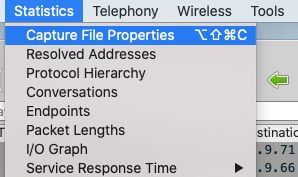

### editcap

有时候我们需要传递抓包文件，同时又不想透露应用层数据等敏感信息，那么一个简便的做法，就是直接修改抓包文件中每个报文的长度。前面说过，`tcpdump \-s` 是可以指定抓包大小的，而即使文件已经生成了，我们还是可以**通过editcap名把它改小**。是不是挺方便的？

比如要把原始文件 `old.pcap` 的每个报文截短为54字节，可以执行下面的命令：

```
    editcap -s 54 old.pcap new.pcap
    

```

另外，editcap也可以用来把TLS key文件跟抓包文件合并在一起，这样你在分享文件的时候，就不需要传送两个文件了，而是一个合并过的文件就可以。比如下面的命令：

```
    editcap --inject-secrets tls,key.log in.pcap out.pcap
    

```

> 注意：命令中的 `tls` 跟后面的 `key.log` 文件名之间有一个逗号，虽然略有点奇怪，但这就是它的格式。

## Wireshark的技巧

Wireshark可以算是我们课程中最闪亮的明珠了。不过很多同学在学习这门课之前，可能对Wireshark的了解很少，一打开文件就晕了，心里只有一个念头“不明觉厉”。当然，通过课程的学习，相信你对这方面已经积累了相当不错的经验。如果你现在看到Wireshark窗口甚至有“亲切”的感觉，那就对了，说明你有了长足的进步，已经真正跟Wireshark成为密友了。

这里我们再来简单回顾一下相关的技巧。

### Wireshark的解读技巧

在解读抓包文件时，第一步一般可以查看Expert Information。这个信息的解读方法是这样的：

* Warning条目的底色是黄色，意味着可能有问题，应重点关注。
* Note条目的底色是浅蓝色，是在允许范围内的小问题，也要关注。
* Chat条目的底色是正常蓝色，属于TCP/UDP的正常行为，比如这次通信里TCP握手和挥手分别有多少次等，可以作为参考。
* 一般来说，乱序可以重点关注。

在解读完Expert Information之后，我们会找到可疑的报文，展开进一步的分析。此时我们用得最多的技巧，可能就是**Follow TCP Stream**了。我们可以选中一个报文后右单击，然后选择Follow，在二级菜单中选择TCP Stream，这样就来到了这个报文所在的TCP流。基本上每次做抓包分析都会用到这一步的操作。

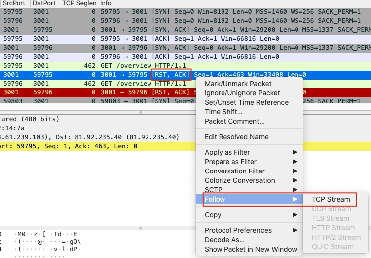

另外，Wireshark默认展示的列经常不能满足我们的需求，所以我们也要学会**添加自定义列**的方法。简单来说，就是选择一个报文后，进入它的详情部分（界面下方），然后选中某一个属性，右单击，选择Apply as Column即可。比如下面这样：

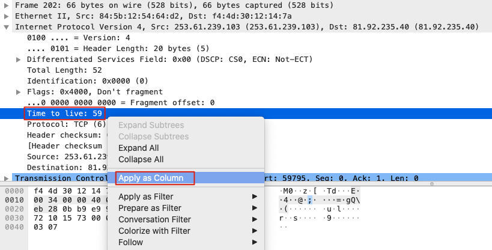

上图中，我们通过添加TTL自定义列，就可以让每个报文的TTL值都在主视图中展现，极大地方便了对这些TTL的比较。所以我们除了掌握协议知识以外，也要挖掘各类工具的使用技巧。所谓“工欲善其事，必先利其器”也。

另外，在排查中，**时间**这个信息也是十分重要的。根据场景的不同，我们需要不同的Time列的表示方式。比如：

* 当我们关注**前后报文间的间隔时间**时，我们会选择Delta time或者Delta time displayed。
* 当我们关注**跨度比较大的报文间隔**时，最好选择Absolute time或者另外两个Absolute date的形式。

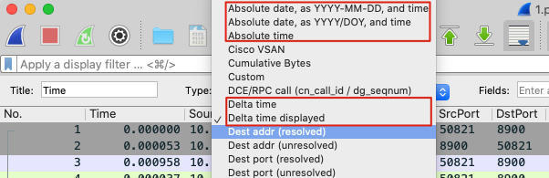

### 对TCP提示的解读

Wireshark很方便也很强大，但如果我们脱离了对网络协议的理解，那其实还是无从下手。比如我们做得最多的TCP排查，就需要结合自己对TCP的掌握才能做好解读。

举个例子。同样是Wireshark关于TCP窗口方面的提示，TCP Window Full跟TCP Zero Window都是什么含义，有什么差别呢？像这样的例子很多，如果你真正地从Wireshark给你的众多信息中获取了有效的线索，那你的排查能力必定有一个明显的提升了。

#### TCP Window相关的信息

就TCP Window Full而言，它的意思是**一端的在途字节数等于另一端的接收窗口**。Wireshark会根据发送出去的数据量和已经确认的数量，计算出在途字节数，然后跟另一端的接收窗口进行比较。如果两者相等，说明另一端的接收窗口已经被用满了。这个对于排查TCP传输速度相关的问题是很有帮助的。

然后是TCP Zero Window，这个比较简单，就是**接收窗口为零**。这是主动通告对端“自己的接收窗口已经为零，不要再发送数据了”。所以你能看出来它跟TCP Window Full的区别了吗？

它们的**区别**是：TCP Zero Window是一个体现在TCP报文里的信息，算是主动“投降”。而TCP Window Full不是在报文中的信息，它是Wireshark自己分析出来的结论。知道了两者的区别，相信你也知道在相应的场景下，该如何结合这种解读来帮助排查了。

#### TCP传输状况信息

关于TCP传输速度也是一个热门话题，我们在第9\~11讲都做了比较深入的探讨。在Wireshark里，我们可以利用下面几个图表来帮助排查。

* I/O Graph：这个可以看到IP报文级别的传输速度。
* TCP Stream Graphs：这里又分了几种子图表，分别是：
  * Time Sequence \(Stevens\)：查看TCP序列号随着时间的变化趋势。
  * Throughput：查看传输数据量的变化趋势。
  * Round Trip Time：查看传输中RTT的变化。
  * Window Scaling：查看接收窗口在传输中的变化，还可以直观地找到TCP Window Full事件。

你可以在Statistics下拉菜单中找到上面的这些工具。

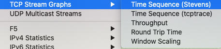

### Wireshark过滤器

过滤器这一块也是很丰富且很有价值的内容。有时候，能否写出一个高效准确的过滤器，几乎可以当做是区分我们抓包分析水准的量尺，所以对过滤器再重视也不为过。下面我们来回顾几个典型的过滤器。

在**匹配字符串**的时候，我们可以有以下这样的好几种选择，分别在不同的分层上实现了文本过滤。

```
    tcp contains "abc"
    ip contains "abc"
    http contains "abc"
    

```

那如果要**匹配二进制数据**该如何做到呢？我们知道，每个字节是8位，Wireshark用两个十六进制数字表示一个字节，我们在每个字节之间加上破折号就可以了。比如下面这样也可以搜到带“abc”的报文：

```
    tcp.payload contains 61-62-63
    

```

当我们要根据TCP报文的标志位进行过滤的时候，就可以用下面这种过滤器：

```
    tcp.flags.reset eq 1      #找到RST报文
    tcp.flags.syn eq 1        #找到握手的SYN报文
    tcp.flags.fin eq 1        #找到挥手的FIN报文
    

```

我们还可以根据时间匹配来过滤报文，比如：

```
    frame.time >="Mar 28, 2022 00:00:00"
    

```

#### tcp.analysis类过滤器

此外，Wireshark的过滤器中还有一个非常重要的部分，是TCP分析器tcp.analysis，当你在Wiresahrk过滤器栏输入tcp.analysis后，就自动有很多的过滤器提示出来。这些过滤器经常能起到很大的帮助，因为它们大多不是直接的报文内容，而是从报文中推导出来的信息，已经包含了一定的分析价值。

比如下面这个过滤器，可以找到超过200ms才发回的确认报文：

```
    tcp.analysis.ack_rtt >0.2 and tcp.len == 0
    

```

当我们要找到所有的TCP Window Full的报文的时候，就可以输入：

```
    tcp.analysis.window_full
    

```

更多的tcp.analysis过滤器你可以自己去Wireshark里摸索一下，相信你会有很大的收获。

## 排查技巧

其实，网络排查很多人都在做，也都会抓包，那为什么不是每个人都可以从抓包文件中分析出有效的信息来呢？可能关键就在于我课程里提到过的**两大鸿沟**。

* 应用现象跟网络现象之间的鸿沟：你可能看得懂应用层的日志，但是不知道网络上具体发生了什么。
* 工具提示跟协议理解之间的鸿沟：你看得懂Wireshark、tcpdump这类工具的输出信息的含义，但就是无法真正地把它们跟你对协议的理解对应起来。

为了突破第一个鸿沟，我们需要熟悉抓包技术，知道什么时候抓包、抓哪些包，然后也有能力把抓包文件中的信息，跟应用层日志中的信息对应起来。

为了突破第二个鸿沟，我们需要深刻理解网络协议，知道TCP、IP、HTTP这些协议的行为和脾性，然后结合Wireshark的各种技巧，把网络协议跟实际现象结合起来，从而推进排查工作。

当然，填平这两个鸿沟只是我们的目标，而手段就是这里要讨论的排查技巧了。这里的内容也比较多，我选了几个典型场景和思路，希望对你有所启发。

## 逐段测试法

我们经常会遇到一个请求从开始到结束会经过很多环节的情况，比如：

> 客户端-> 第四层LB \-> 第七层LB \-> 服务端

在这种时候，我们可以做逐段测试，比如从客户端直接访问服务端，这样可以很快地确定中间这两个环节是否跟问题有直接关系了。比如像下面这样：

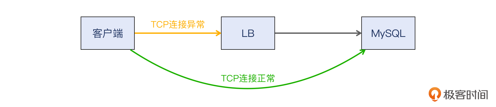

### 抓包分析思路

在进入抓包分析阶段后，从经验性的排查思路这个角度来说，一般的抓包分析可以用我们在[第5讲“定位防火墙（一）”](https://time.geekbang.org/column/article/481042)中提到过的步骤，也就是：

* 查看 Expert Information；
* 重点关注可疑报文（比如Warining级别），追踪其整个TCP流；
* 深入分析这个可疑TCP流的第二到四层的报文，再结合应用层表象，综合分析其根因；
* 结合两侧的抓包文件，找到属于同一个TCP流的数据包，对比分析，得出结论。

下图就概括了这个过程，你可以来参考一下：


### 整数值

在有整数值出现的时候，我们需要提起精神，务必重点调查这个整数值背后的原因。因为一般来说，这往往意味着**有人为的设置**在里面，比如某种客户端超时设置。这些设置经常会跟问题有直接或间接的关系。

比如在[第15讲](https://time.geekbang.org/column/article/488979)，我们就发现客户端有5秒超时的机制，并在Wireshark里体现了这一点。

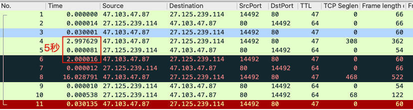

### 偶发性问题

对于偶发性问题，我们可以采用这样的策略：

> 预估->开始抓包和观察->问题重现->停止抓包->分析

下图概括了这个过程，供你参考：

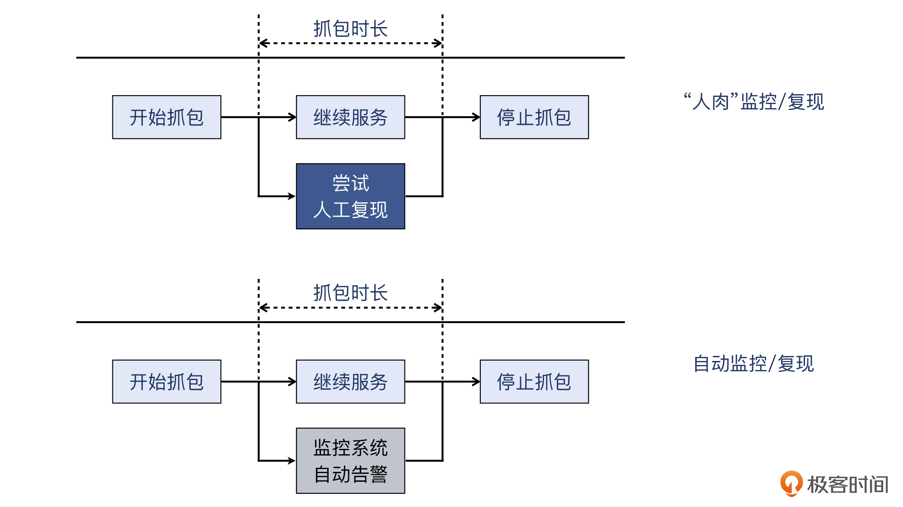

### 对比分析

还有一个很关键的技术是“对比分析”。我们做抓包分析，经常要在多处抓包后做对比分析。比如以下两种典型场景：

* 同一个TCP流在客户端和服务端的抓包文件；
* LB前后不同TCP连接的抓包文件。

对于第一种场景，我们可以**用报文本身的字段**作为匹配条件，因为属于同一个TCP流，它们的这些属性字段值一定不会变化。比如用裸序列号（原始序列号），像下面的过滤器：

```
    tcp.seq_raw eq 123456
    

```

找到同一个TCP流之后，就可以把两个Wireshark窗口都打开，放在一起进行比较。你可以回顾下第5讲的案例，参考我们是如何做对比分析的。

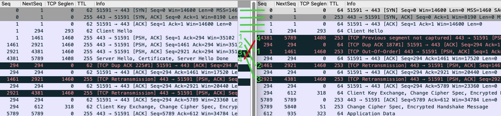

而对于第二种场景，TCP连接就是完全不同的了，所以无法像上面第一种场景那样，把TCP报文里的字段值作为关联映射的条件。我们一般可以**寻找应用层的特征**，比如某个uuid，然后运用Wireshark过滤器，在两侧不同TCP连接的抓包文件中，找到同样包含这个uuid的报文。比如这些过滤器：

```
    http contains "uuidxxxxx"
    tcp contains "uuidxxxxx"
    ip contains "uuidxxxxx"
    frame contains "uuidxxxxx"
    

```

## 小结

这节课，我们是对整个课程中，不少抓包分析的技术细节进行了回顾。我在[春节特别放送（三）](https://time.geekbang.org/column/article/484358)里其实提到过，思维导图是一个很好的学习工具，所以我就汇总整理了专栏中的核心内容。因为内容也比较多，我分为了4个部分来分别展示，你可以通过它们快速找到你需要的知识点。

* **排查技术**

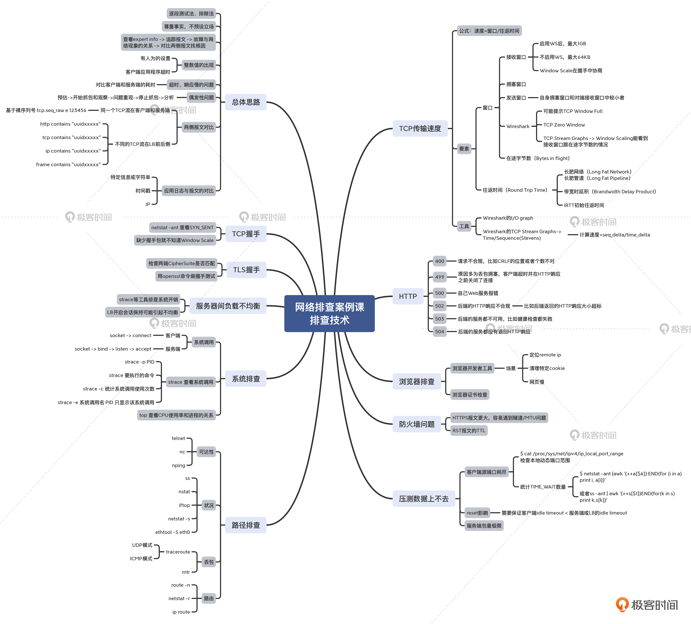

* **协议**

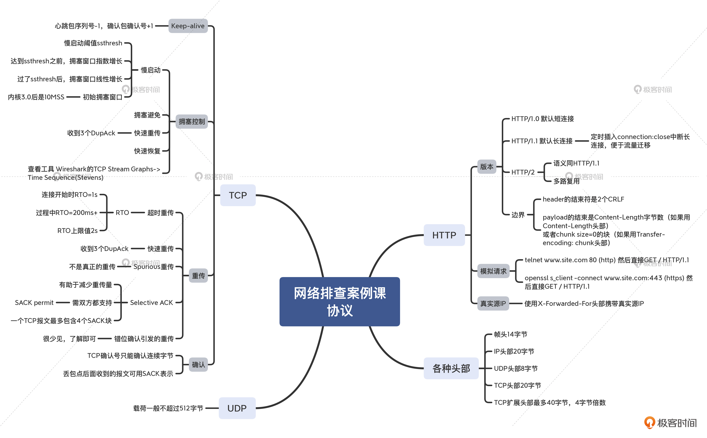

* **系统相关**

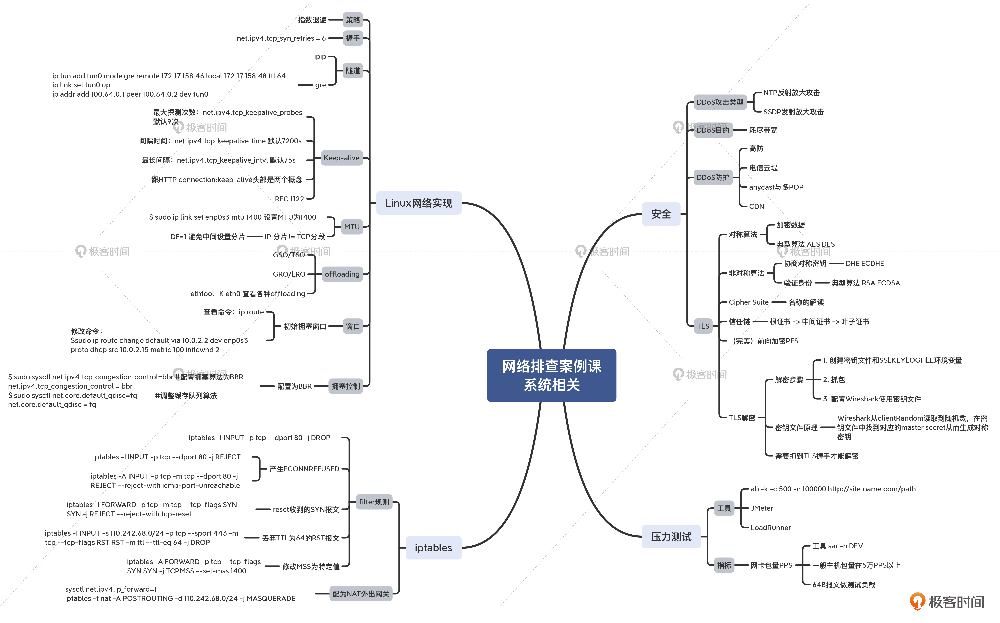

* **抓包分析**

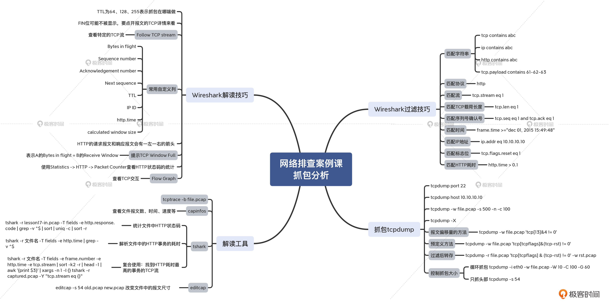

## 思考题

给你留两道思考题：

* 假设通信的一端发送了TCP Zero Window报文，并且后续没有更多新的报文过来，那么另一端是不是一直不能发送新的数据了呢？
* 请写一个tshark命令，用来过滤出抓包文件中的DupAck。

欢迎你把答案分享到留言区，我们一同进步、成长。