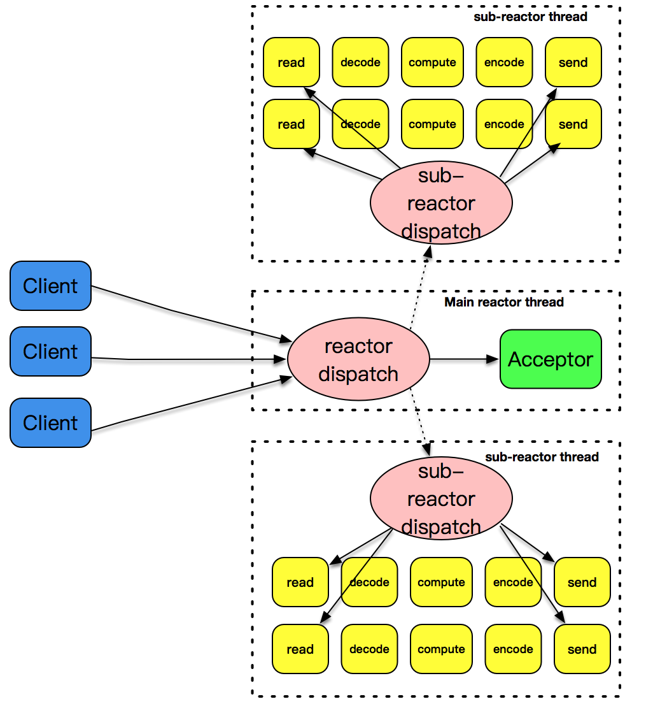
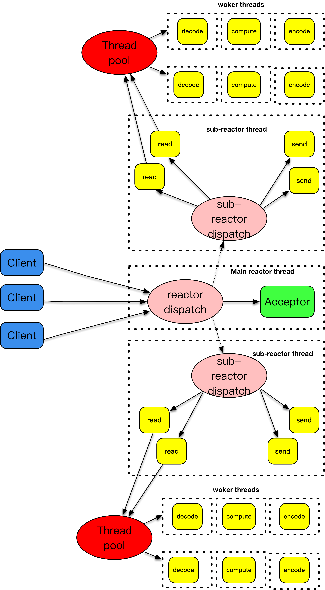

---
date: "2019-06-23"
---  
      
# 28 | I/O多路复用进阶：子线程使用poll处理连接I/O事件
你好，我是盛延敏，这里是网络编程实战第28讲，欢迎回来。

在前面的第27讲中，我们引入了reactor反应堆模式，并且让reactor反应堆同时分发Acceptor上的连接建立事件和已建立连接的I/O事件。

我们仔细想想这种模式，在发起连接请求的客户端非常多的情况下，有一个地方是有问题的，那就是单reactor线程既分发连接建立，又分发已建立连接的I/O，有点忙不过来，在实战中的表现可能就是客户端连接成功率偏低。

再者，新的硬件技术不断发展，多核多路CPU已经得到极大的应用，单reactor反应堆模式看着大把的CPU资源却不用，有点可惜。

这一讲我们就将acceptor上的连接建立事件和已建立连接的I/O事件分离，形成所谓的主-从reactor模式。

## 主-从reactor模式

下面的这张图描述了主-从reactor模式是如何工作的。

主-从这个模式的核心思想是，主反应堆线程只负责分发Acceptor连接建立，已连接套接字上的I/O事件交给sub-reactor负责分发。其中sub-reactor的数量，可以根据CPU的核数来灵活设置。

比如一个四核CPU，我们可以设置sub-reactor为4。相当于有4个身手不凡的反应堆线程同时在工作，这大大增强了I/O分发处理的效率。而且，同一个套接字事件分发只会出现在一个反应堆线程中，这会大大减少并发处理的锁开销。

<!-- [[[read_end]]] -->

  
我来解释一下这张图，我们的主反应堆线程一直在感知连接建立的事件，如果有连接成功建立，主反应堆线程通过accept方法获取已连接套接字，接下来会按照一定的算法选取一个从反应堆线程，并把已连接套接字加入到选择好的从反应堆线程中。

主反应堆线程唯一的工作，就是调用accept获取已连接套接字，以及将已连接套接字加入到从反应堆线程中。不过，这里还有一个小问题，主反应堆线程和从反应堆线程，是两个不同的线程，如何把已连接套接字加入到另外一个线程中呢？更令人沮丧的是，此时从反应堆线程或许处于事件分发的无限循环之中，在这种情况下应该怎么办呢？

我在这里先卖个关子，这是高性能网络程序框架要解决的问题。在实战篇里，我将为这些问题一一解开答案。

## 主-从reactor+worker threads模式

如果说主-从reactor模式解决了I/O分发的高效率问题，那么work threads就解决了业务逻辑和I/O分发之间的耦合问题。把这两个策略组装在一起，就是实战中普遍采用的模式。大名鼎鼎的Netty，就是把这种模式发挥到极致的一种实现。不过要注意Netty里面提到的worker线程，其实就是我们这里说的从reactor线程，并不是处理具体业务逻辑的worker线程。

下面贴的一段代码就是常见的Netty初始化代码，这里Boss Group就是acceptor主反应堆，workerGroup就是从反应堆。而处理业务逻辑的线程，通常都是通过使用Netty的程序开发者进行设计和定制，一般来说，业务逻辑线程需要从workerGroup线程中分离，以便支持更高的并发度。

```
    public final class TelnetServer {
        static final int PORT = Integer.parseInt(System.getProperty("port", SSL? "8992" : "8023"));
    
        public static void main(String[] args) throws Exception {
            //产生一个reactor线程，只负责accetpor的对应处理
            EventLoopGroup bossGroup = new NioEventLoopGroup(1);
            //产生一个reactor线程，负责处理已连接套接字的I/O事件分发
            EventLoopGroup workerGroup = new NioEventLoopGroup(1);
            try {
               //标准的Netty初始，通过serverbootstrap完成线程池、channel以及对应的handler设置，注意这里讲bossGroup和workerGroup作为参数设置
                ServerBootstrap b = new ServerBootstrap();
                b.group(bossGroup, workerGroup)
                 .channel(NioServerSocketChannel.class)
                 .handler(new LoggingHandler(LogLevel.INFO))
                 .childHandler(new TelnetServerInitializer(sslCtx));
    
                //开启两个reactor线程无限循环处理
                b.bind(PORT).sync().channel().closeFuture().sync();
            } finally {
                bossGroup.shutdownGracefully();
                workerGroup.shutdownGracefully();
            }
        }
    }
    

```

  
这张图解释了主-从反应堆下加上worker线程池的处理模式。

主-从反应堆跟上面介绍的做法是一样的。和上面不一样的是，这里将decode、compute、encode等CPU密集型的工作从I/O线程中拿走，这些工作交给worker线程池来处理，而且这些工作拆分成了一个个子任务进行。encode之后完成的结果再由sub-reactor的I/O线程发送出去。

## 样例程序

```
    #include <lib/acceptor.h>
    #include "lib/common.h"
    #include "lib/event_loop.h"
    #include "lib/tcp_server.h"
    
    char rot13_char(char c) {
        if ((c >= 'a' && c <= 'm') || (c >= 'A' && c <= 'M'))
            return c + 13;
        else if ((c >= 'n' && c <= 'z') || (c >= 'N' && c <= 'Z'))
            return c - 13;
        else
            return c;
    }
    
    //连接建立之后的callback
    int onConnectionCompleted(struct tcp_connection *tcpConnection) {
        printf("connection completed\n");
        return 0;
    }
    
    //数据读到buffer之后的callback
    int onMessage(struct buffer *input, struct tcp_connection *tcpConnection) {
        printf("get message from tcp connection %s\n", tcpConnection->name);
        printf("%s", input->data);
    
        struct buffer *output = buffer_new();
        int size = buffer_readable_size(input);
        for (int i = 0; i < size; i++) {
            buffer_append_char(output, rot13_char(buffer_read_char(input)));
        }
        tcp_connection_send_buffer(tcpConnection, output);
        return 0;
    }
    
    //数据通过buffer写完之后的callback
    int onWriteCompleted(struct tcp_connection *tcpConnection) {
        printf("write completed\n");
        return 0;
    }
    
    //连接关闭之后的callback
    int onConnectionClosed(struct tcp_connection *tcpConnection) {
        printf("connection closed\n");
        return 0;
    }
    
    int main(int c, char **v) {
        //主线程event_loop
        struct event_loop *eventLoop = event_loop_init();
    
        //初始化acceptor
        struct acceptor *acceptor = acceptor_init(SERV_PORT);
    
        //初始tcp_server，可以指定线程数目，这里线程是4，说明是一个acceptor线程，4个I/O线程，没一个I/O线程
        //tcp_server自己带一个event_loop
        struct TCPserver *tcpServer = tcp_server_init(eventLoop, acceptor, onConnectionCompleted, onMessage,
                                                      onWriteCompleted, onConnectionClosed, 4);
        tcp_server_start(tcpServer);
    
        // main thread for acceptor
        event_loop_run(eventLoop);
    }
    

```

我们的样例程序几乎和第27讲的一样，唯一的不同是在创建TCPServer时，线程的数量设置不再是0，而是4。这里线程是4，说明是一个主acceptor线程，4个从reactor线程，每一个线程都跟一个event\_loop一一绑定。

你可能会问，这么简单就完成了主、从线程的配置？

答案是YES。这其实是设计框架需要考虑的地方，一个框架不仅要考虑性能、扩展性，也需要考虑可用性。可用性部分就是程序开发者如何使用框架。如果我是一个开发者，我肯定关心框架的使用方式是不是足够方便，配置是不是足够灵活等。

像这里，可以根据需求灵活地配置主、从反应堆线程，就是一个易用性的体现。当然，因为时间有限，我没有考虑woker线程的部分，这部分其实应该是应用程序自己来设计考虑。网络编程框架通过回调函数暴露了交互的接口，这里应用程序开发者完全可以在onMessage方法里面获取一个子线程来处理encode、compute和encode的工作，像下面的示范代码一样。

```
    //数据读到buffer之后的callback
    int onMessage(struct buffer *input, struct tcp_connection *tcpConnection) {
        printf("get message from tcp connection %s\n", tcpConnection->name);
        printf("%s", input->data);
        //取出一个线程来负责decode、compute和encode
        struct buffer *output = thread_handle(input);
        //处理完之后再通过reactor I/O线程发送数据
        tcp_connection_send_buffer(tcpConnection, output);
        return 
    

```

## 样例程序结果

我们启动这个服务器端程序，你可以从服务器端的输出上看到使用了poll作为事件分发方式。

多打开几个telnet客户端交互，main-thread只负责新的连接建立，每个客户端数据的收发由不同的子线程Thread-1、Thread-2、Thread-3和Thread-4来提供服务。

这里由于使用了子线程进行I/O处理，主线程可以专注于新连接处理，从而大大提高了客户端连接成功率。

```
    $./poll-server-multithreads
    [msg] set poll as dispatcher
    [msg] add channel fd == 4, main thread
    [msg] poll added channel fd==4
    [msg] set poll as dispatcher
    [msg] add channel fd == 7, main thread
    [msg] poll added channel fd==7
    [msg] event loop thread init and signal, Thread-1
    [msg] event loop run, Thread-1
    [msg] event loop thread started, Thread-1
    [msg] set poll as dispatcher
    [msg] add channel fd == 9, main thread
    [msg] poll added channel fd==9
    [msg] event loop thread init and signal, Thread-2
    [msg] event loop run, Thread-2
    [msg] event loop thread started, Thread-2
    [msg] set poll as dispatcher
    [msg] add channel fd == 11, main thread
    [msg] poll added channel fd==11
    [msg] event loop thread init and signal, Thread-3
    [msg] event loop thread started, Thread-3
    [msg] set poll as dispatcher
    [msg] event loop run, Thread-3
    [msg] add channel fd == 13, main thread
    [msg] poll added channel fd==13
    [msg] event loop thread init and signal, Thread-4
    [msg] event loop run, Thread-4
    [msg] event loop thread started, Thread-4
    [msg] add channel fd == 5, main thread
    [msg] poll added channel fd==5
    [msg] event loop run, main thread
    [msg] get message channel i==1, fd==5
    [msg] activate channel fd == 5, revents=2, main thread
    [msg] new connection established, socket == 14
    connection completed
    [msg] get message channel i==0, fd==7
    [msg] activate channel fd == 7, revents=2, Thread-1
    [msg] wakeup, Thread-1
    [msg] add channel fd == 14, Thread-1
    [msg] poll added channel fd==14
    [msg] get message channel i==1, fd==14
    [msg] activate channel fd == 14, revents=2, Thread-1
    get message from tcp connection connection-14
    fasfas
    [msg] get message channel i==1, fd==14
    [msg] activate channel fd == 14, revents=2, Thread-1
    get message from tcp connection connection-14
    fasfas
    asfa
    [msg] get message channel i==1, fd==5
    [msg] activate channel fd == 5, revents=2, main thread
    [msg] new connection established, socket == 15
    connection completed
    [msg] get message channel i==0, fd==9
    [msg] activate channel fd == 9, revents=2, Thread-2
    [msg] wakeup, Thread-2
    [msg] add channel fd == 15, Thread-2
    [msg] poll added channel fd==15
    [msg] get message channel i==1, fd==15
    [msg] activate channel fd == 15, revents=2, Thread-2
    get message from tcp connection connection-15
    afasdfasf
    [msg] get message channel i==1, fd==15
    [msg] activate channel fd == 15, revents=2, Thread-2
    get message from tcp connection connection-15
    afasdfasf
    safsafa
    [msg] get message channel i==1, fd==15
    [msg] activate channel fd == 15, revents=2, Thread-2
    [msg] poll delete channel fd==15
    connection closed
    [msg] get message channel i==1, fd==5
    [msg] activate channel fd == 5, revents=2, main thread
    [msg] new connection established, socket == 16
    connection completed
    [msg] get message channel i==0, fd==11
    [msg] activate channel fd == 11, revents=2, Thread-3
    [msg] wakeup, Thread-3
    [msg] add channel fd == 16, Thread-3
    [msg] poll added channel fd==16
    [msg] get message channel i==1, fd==16
    [msg] activate channel fd == 16, revents=2, Thread-3
    get message from tcp connection connection-16
    fdasfasdf
    [msg] get message channel i==1, fd==14
    [msg] activate channel fd == 14, revents=2, Thread-1
    [msg] poll delete channel fd==14
    connection closed
    [msg] get message channel i==1, fd==5
    [msg] activate channel fd == 5, revents=2, main thread
    [msg] new connection established, socket == 17
    connection completed
    [msg] get message channel i==0, fd==13
    [msg] activate channel fd == 13, revents=2, Thread-4
    [msg] wakeup, Thread-4
    [msg] add channel fd == 17, Thread-4
    [msg] poll added channel fd==17
    [msg] get message channel i==1, fd==17
    [msg] activate channel fd == 17, revents=2, Thread-4
    get message from tcp connection connection-17
    qreqwrq
    [msg] get message channel i==1, fd==16
    [msg] activate channel fd == 16, revents=2, Thread-3
    [msg] poll delete channel fd==16
    connection closed
    [msg] get message channel i==1, fd==5
    [msg] activate channel fd == 5, revents=2, main thread
    [msg] new connection established, socket == 18
    connection completed
    [msg] get message channel i==0, fd==7
    [msg] activate channel fd == 7, revents=2, Thread-1
    [msg] wakeup, Thread-1
    [msg] add channel fd == 18, Thread-1
    [msg] poll added channel fd==18
    [msg] get message channel i==1, fd==18
    [msg] activate channel fd == 18, revents=2, Thread-1
    get message from tcp connection connection-18
    fasgasdg
    ^C
    

```

## 总结

本讲主要讲述了主从reactor模式，主从reactor模式中，主reactor只负责连接建立的处理，而把已连接套接字的I/O事件分发交给从reactor线程处理，这大大提高了客户端连接的处理能力。从Netty的实现上来看，也遵循了这一原则。

## 思考题

和往常一样，给你留两道思考题：

第一道，从日志输出中，你还可以看到main-thread首先加入了fd为4的套接字，这个是监听套接字，很好理解。可是这里的main-thread又加入了一个fd为7的套接字，这个套接字是干什么用的呢？

第二道，你可以试着修改一下服务器端的代码，把decode-compute-encode部分使用线程或者线程池来处理。

欢迎你在评论区写下你的思考，或者在GitHub上上传修改过的代码，我会和你一起交流，也欢迎把这篇文章分享给你的朋友或者同事，一起交流一下。