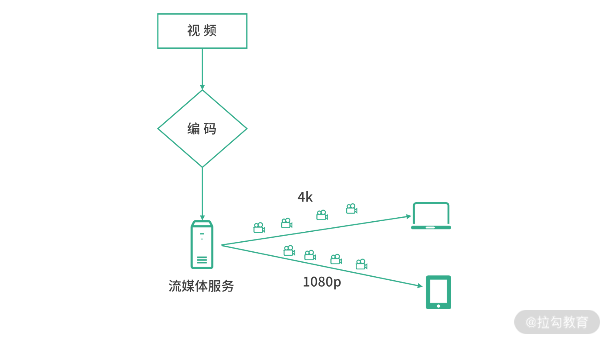
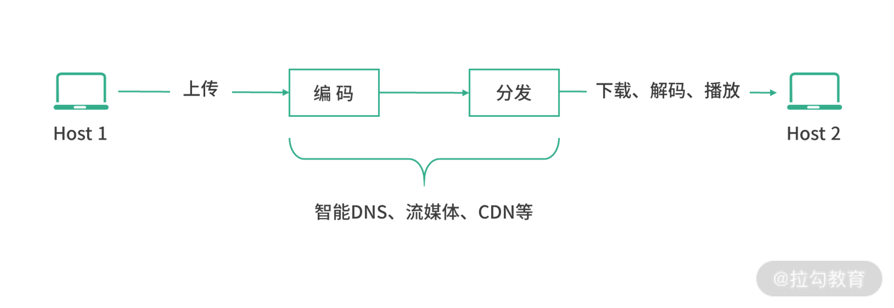
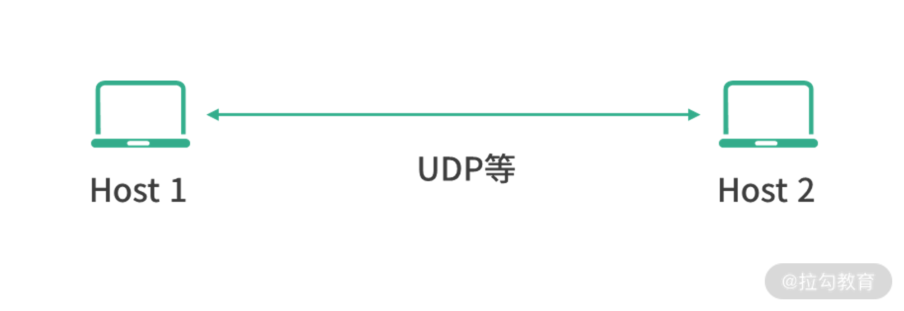
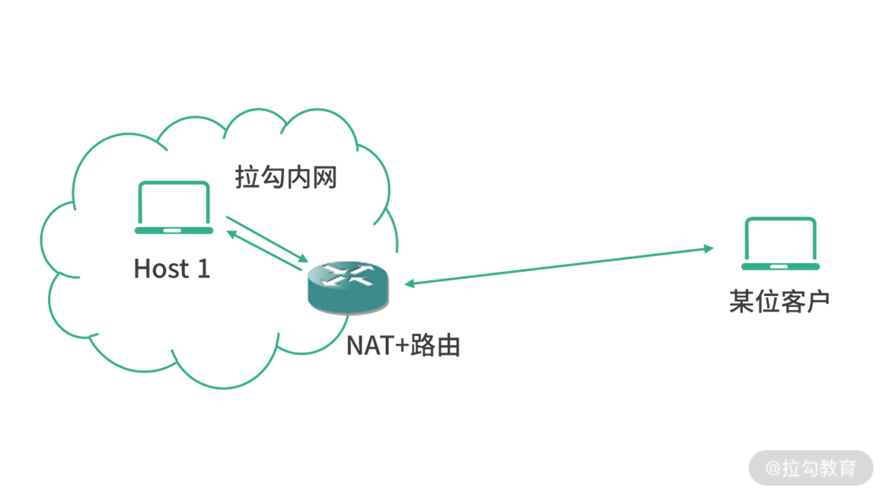
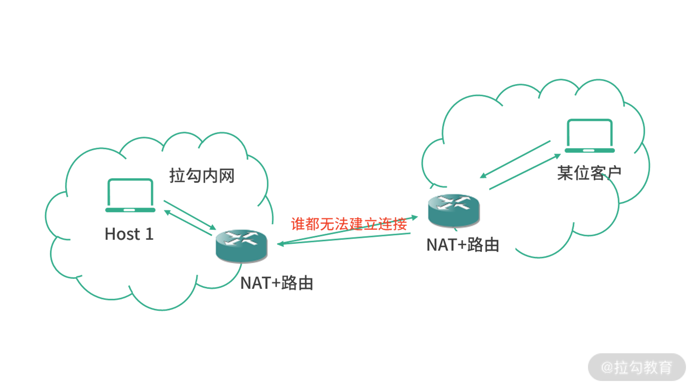

---
date: "2019-06-23"
---  
      
# 17 | 流媒体技术：直播网站是如何实现的？
现在的年轻人基本都爱刷 B 站和抖音，空闲时间还喜欢去拉勾教育看看大厂面试、热门技术分享直播，以及各类游戏直播。不知道你有没有思考过，我们每天看到的这么多音视频内容，是如何从采集端，最终呈现到我们的手机 App 上的？如果公司要提供直播服务，那么你可以出技术方案吗？为了应对这些应用场景，这一讲我们就以“**直播网站是如何实现的**”，来系统聊聊直播、点播、视频网站等基于流媒体技术的应用是怎么回事。

### 流媒体

在流媒体技术不发达的时代，数据往往是以单个文件的形式存在的。比如说十多年前人们要从互联网上看一部电影，他就需要把这个电影文件下载到本地来看。当时十多 k 每秒的网速，要想下载一个电影，往往需要花费一整个晚上。

**今天我们将所有的数据都抽象成了流**，文件的格式也发生了变化。那么如何将一个视频抽象成流呢？其实就是传输一部分即可播放一部分。在实际的操作当中，我们设计了一种类似目录的格式，将音视频数据进行切片，这部分能力利用现有的工具 FFmpeg 就可以轻松做到。在你的机器上装一个 FFmpeg，然后利用这条指令处理一个 MP4 文件，就可以生成很多切片和一个目录文件。

```
    ffmpeg -i input.mp4 -c:v libx264 -c:a aac -strict -2 -f hls output.m3u8
    

```

上面将`input.mp4`切割成HTTP Live Streaming 可以播放的切片（大多数浏览器中的播放器都可以播放）。最终会生成大量的切片文件，比如说每个 256k，以及一个目录文件 output.m3u8。

下图展示的是用 FFmpeg 在我的机器上对 input.mp4 操作生成的文件清单：


m3u8 文件是目录，它记录了每个视频切片文件（ts）对应的视频时间范围。用户播放视频的时候，会先下载 m3u8 文件。当用户调整视频播放滑块选择播放时间时，播放器就根据 m3u8 的内容下载对应的 ts 文件。

### 基于流媒体的架构

了解了上面最基本的原理，我们来思考一个基础架构。如下图所示：



视频录制完成后，可能是 MP4 等格式。首先，我们将视频上传到服务器进行编码，产生上面提到的切片文件。切片文件存储到流媒体服务器中，当用户需要的时候，就从流媒体服务器中读取视频目录（上面的 m3u8 文件），然后在各个端播放。进行编码的时候，可以根据不同的清晰度编码多个版本，来应对用户在不同网络环境的情况。

#### 直播

从这个角度出发去思考，直播技术仍然可以复用上面的这套架构。录制端不断上传视频内容，视频内容编码后流媒体服务器负责分发。如果观看人数较多，可以使用 CDN 回源到流媒体服务器。对于直播，m3u8 文件可以看作一个动态的文件，能够不断产生新的数据。因此直播技术中，可以考虑将获取 m3u8 文件设计成一个接口，不断由播放器请求新的 m3u8 文件。

#### 其他音视频网站

对于其他音视频网站架构也是类似的，将视频编码后（含切片）然后利用 CDN 分发目录和切片文件，就可以播放了。

### 视频的编码和解码

因为通常视频文件较大，因此在传输前通常需要压缩。另外，在播放前还需要解码。视频的压缩技术并非普通的文件压缩技术，而是针对视频的特征进行特别处理的压缩技术。

你可以将流畅的视频理解成连续播放的图片，这也是视频呈现的原理，主要依靠的是人类视觉的残留效应。视频的压缩算法也是如此，本质上是对图片的压缩。因为视频的前一个画面和后一个画面衔接紧密，如果把它们看作两张图片，这两张图片中往往只有部分内容发生了变化。另外，在连续的多张图片中，也会有重复出现的事物，比如说一座桥、一间教室都可能多次出现。因此，视频压缩可以根据这些特性进行抽象。

对视频进行压缩的时候，视频文件格式也和压缩算法息息相关，我们统称为视频的编码。视频需要编码，包括如何描述目录、如何描述切片、如何存储声音，这些都是编码要考虑的。一个完整的解决方案，我们称为一套视频的编码。比如说 H264 就是国际标准化组织在推广的一种编码格式。当然，所有特性的核心是在减少视频体积（网络传输）的基础上，尽可能地提供更高的画质；另一方面就是要尽可能减少中间编码/解码的时间成本（机器资源）。

#### 宏块

这里顺带提一个非常重要的概念，就是**宏块**。

在包括 H264 的很多视频编码技术中，都有一个叫作宏块的概念。宏块，就是将画面分成大小不等的区域。比如说 8x8、16x16 等。

当播放两个连续的画面的时候，你可以理解成两张图片。但是如果基于图片分析，那么播放的就是很多个宏块。在这连续的两帧画面中，并不是所有的宏块都发生了变化。特别是当你看一些教学 PPT 的讲稿时，视频前后两帧的宏块基本没有发生变化。因此往往相同画质、相同时长的教学视频体积会远小于电影视频的体积。

具体的压缩算法不在本次课程的涵盖范围之内，如果你感兴趣可以自己去查资料了解一下，参考分组、帧、预测帧等概念。

### 点到点视频技术

接下来我们讨论下点到点视频技术。

在视频会议、面对面聊天等场景下，我们还需点到点的视频技术。理论上说，这个时候可以复用之前提到的架构。



一个客户端将自己本地录制的视频用二进制上传，在服务端编码然后分发到另一个端。数据在另一个端解码并播放。

这样做的缺点是链路较长，于是在实际操作的过程中如果是 1 对 1 的视频聊天，可以考虑实现点到点的服务。



不过事情并没有那么简单，因为不同的主机可能在不同的私有网络。比如 Host1 在拉勾的办公室，Host2 是某位拉勾的合作伙伴。如下图所示：



你会发现如整个设计中需要一个 NAT 路由器，这样客户的数据才能回传到拉勾内网的机器。而实际情况并没有这么简单，在 NAT 通信中，往往需要在内网的主机发起连接。这个时候 NAT 模块识别发起的端口并记录。换句话说，如果某客户的机器是公网 IP，那么拉勾内部的主机可以找到这个客户，找到之后，双方建立连接。但是某位客户如果想主动发起向拉勾内网某台机器的连接，这其实是做不到的。

像下图这种两个主机都在内网中，都需要 NAT 的场景，其实是无法通信的：



上图这种情况，拉勾内网发起连接，对方的 NAT 路由会因为自己内网的机器没有发起过请求而拒绝；反之，如果客户发起请求，会被拉勾的 NAT 拒绝。这种情况类似于多线程中的“死锁”问题，无法解决。这个时候，就需要一台第三方服务器作为 NAT 模块的辅助功能，帮助双方的 NAT 模块设置本地数据，让双方的 NAT 模块都认为对方已经和自己发起过通信。这个解决方案也叫作**NAT 穿透（NAT 穿墙）**。

举个例子：在著名的 WebRTC 协议中，可以提供网页版的在线 1 对 1 聊天，对于多数家庭到家庭的网络来说，是可以正常工作的。如果当你需要连接两个内网的机器，这个时候就需要自己架设第三方服务，或者使用某个收费的第三方服务。

对于在线会议的场景，如果人数较少的情况下，仍然可以使用点到点技术，只不过传输量会随着人数的上升而呈爆发式增长。所以在人数较多的时候，就需要更多的优化策略。当然，其中一种方案就是放弃点到点技术，而直接采用类似直播架构的中心化服务。另一种策略就是利用边缘计算，让距离相近的参会者利用共同的离自己最近的服务器交换数据。

### 总结

这一讲我们探讨了流媒体技术。流媒体，就是把多媒体数据抽象成为流进行传输。视频本质上是一张张图片在播放，因此非常适合流传输。要知道，流是随着时间产生的数据。通常在一个网络中，等价成本下吞吐量、丢包率和延迟 3 者不能兼得。也就是说，像直播这种吞吐量非常大的视频应用，可能就要牺牲延迟。比如之前 B 站直播没有优化前，用户看到的直播画面会比真实的时间会慢近半分钟。

另一方面，像在线会议这类对延迟要求较高的场景，就可能需要降低视频质量，或者部署边缘服务。如果是内网视频会议，或者跨地区的公司视频会议，很容易找到边缘节点帮助交换数据和计算；如果是来自天南地北的用户，那么就需要投入更多成本。对于社交网站而言，需要维护几个人同时语音、视频聊天，因为人数较少，就可以使用点对点技术（但是要解决 NAT 穿墙的问题）。

**那么通过这一讲的学习，你现在可以尝试来回答本讲关联的面试题目：直播网站是如何实现的**？

【**解析**】一个直播网站通常会有下面 5 个部分组成。

1.  录制端：负责录制直播视频，用流的形式上传。

2.  计算集群：专门负责编码上传的流数据，然后进行压缩、转码、切片等工作。

3.  对象存储：存储原始视频和转码后的视频（相当于 CDN 的源，回源用）。

4.  CDN：将转码后的内容分发到离用户较近的节点，方便用户获取。

5.  直播 App：给用户看直播时使用。

### 思考题

最后我再给你出一道需要查资料的思考题，写一张网页，用 WebRTC 实现点到点通信。

这一讲就到这里，发现求知的乐趣，我是林䭽。感谢你学习本次课程，下一讲我们将学习《18 | 爬虫和反爬虫：如何防止黑产爬取我的数据？》，再见！