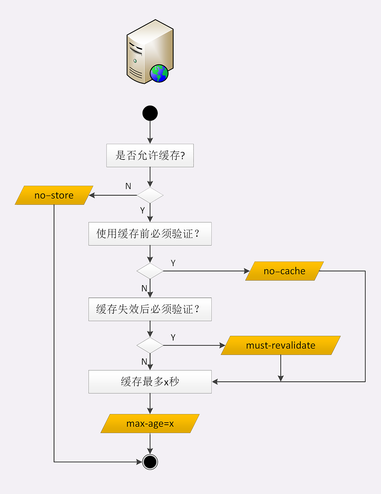
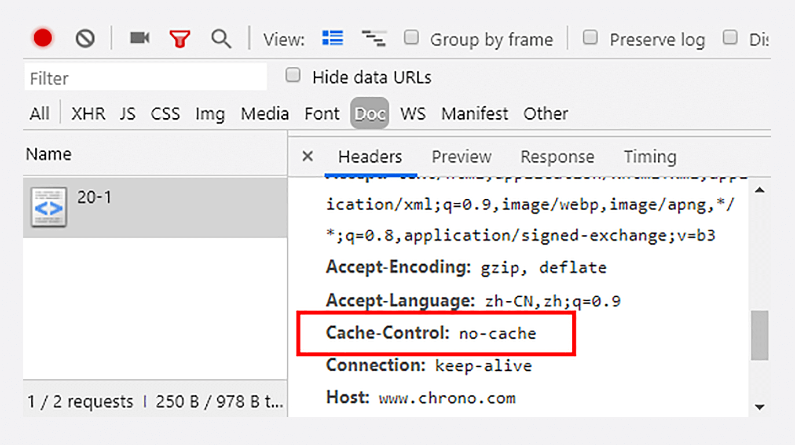
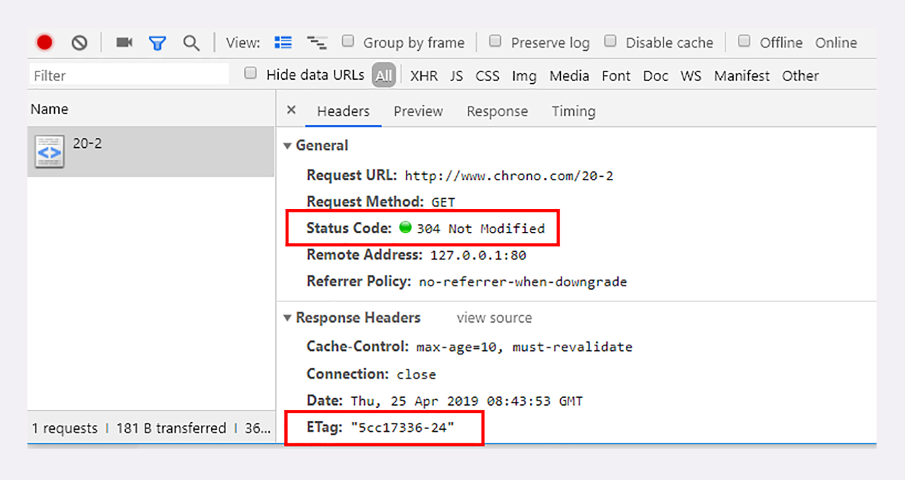
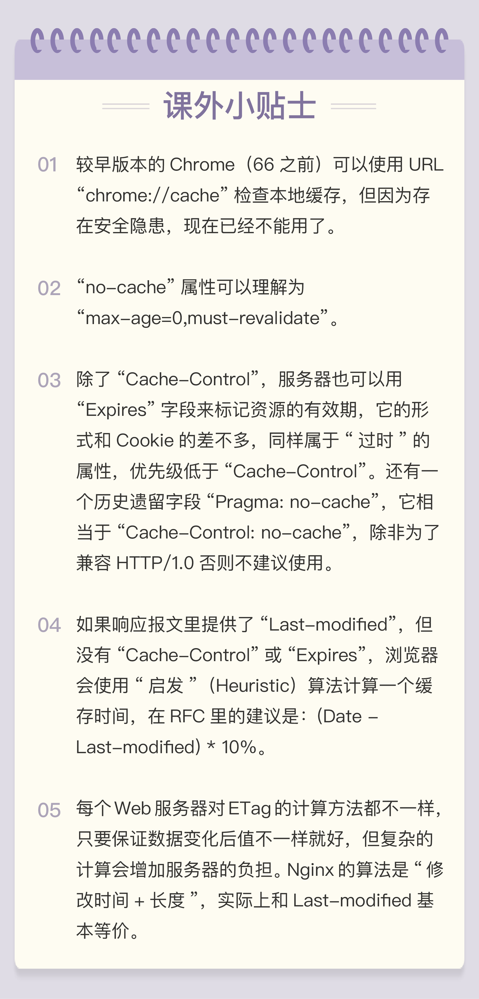

---
date: "2019-06-23"
---  
      
# 20 | 生鲜速递：HTTP的缓存控制
缓存（Cache）是计算机领域里的一个重要概念，是优化系统性能的利器。

由于链路漫长，网络时延不可控，浏览器使用HTTP获取资源的成本较高。所以，非常有必要把“来之不易”的数据缓存起来，下次再请求的时候尽可能地复用。这样，就可以避免多次请求-应答的通信成本，节约网络带宽，也可以加快响应速度。

试想一下，如果有几十K甚至几十M的数据，不是从网络而是从本地磁盘获取，那将是多么大的一笔节省，免去多少等待的时间。

实际上，HTTP传输的每一个环节基本上都会有缓存，非常复杂。

基于“请求-应答”模式的特点，可以大致分为客户端缓存和服务器端缓存，因为服务器端缓存经常与代理服务“混搭”在一起，所以今天我先讲客户端——也就是浏览器的缓存。

## 服务器的缓存控制

为了更好地说明缓存的运行机制，下面我用“生鲜速递”作为比喻，看看缓存是如何工作的。

夏天到了，天气很热。你想吃西瓜消暑，于是打开冰箱，但很不巧，冰箱是空的。不过没事，现在物流很发达，给生鲜超市打个电话，不一会儿，就给你送来一个8斤的沙瓤大西瓜，上面还贴着标签：“保鲜期5天”。好了，你把它放进冰箱，想吃的时候随时拿出来。

在这个场景里，“生鲜超市”就是Web服务器，“你”就是浏览器，“冰箱”就是浏览器内部的缓存。整个流程翻译成HTTP就是：

<!-- [[[read_end]]] -->

1.  浏览器发现缓存无数据，于是发送请求，向服务器获取资源；
2.  服务器响应请求，返回资源，同时标记资源的有效期；
3.  浏览器缓存资源，等待下次重用。


你可以访问实验环境的URI “/20-1”，看看具体的请求-应答过程。


服务器标记资源有效期使用的头字段是“**Cache-Control**”，里面的值“**max-age=30**”就是资源的有效时间，相当于告诉浏览器，“这个页面只能缓存30秒，之后就算是过期，不能用。”

你可能要问了，让浏览器直接缓存数据就好了，为什么要加个有效期呢？

这是因为网络上的数据随时都在变化，不能保证它稍后的一段时间还是原来的样子。就像生鲜超市给你快递的西瓜，只有5天的保鲜期，过了这个期限最好还是别吃，不然可能会闹肚子。

“Cache-Control”字段里的“max-age”和上一讲里Cookie有点像，都是标记资源的有效期。

但我必须提醒你注意，这里的max-age是“**生存时间**”（又叫“新鲜度”“缓存寿命”，类似TTL，Time-To-Live），时间的计算起点是响应报文的创建时刻（即Date字段，也就是离开服务器的时刻），而不是客户端收到报文的时刻，也就是说包含了在链路传输过程中所有节点所停留的时间。

比如，服务器设定“max-age=5”，但因为网络质量很糟糕，等浏览器收到响应报文已经过去了4秒，那么这个资源在客户端就最多能够再存1秒钟，之后就会失效。

“max-age”是HTTP缓存控制最常用的属性，此外在响应报文里还可以用其他的属性来更精确地指示浏览器应该如何使用缓存：

* no-store：**不允许缓存**，用于某些变化非常频繁的数据，例如秒杀页面；
* no-cache：它的字面含义容易与no-store搞混，实际的意思并不是不允许缓存，而是**可以缓存**，但在使用之前必须要去服务器验证是否过期，是否有最新的版本；
* must-revalidate：又是一个和no-cache相似的词，它的意思是如果缓存不过期就可以继续使用，但过期了如果还想用就必须去服务器验证。

听的有点糊涂吧。没关系，我拿生鲜速递来举例说明一下：

* no-store：买来的西瓜不允许放进冰箱，要么立刻吃，要么立刻扔掉；
* no-cache：可以放进冰箱，但吃之前必须问超市有没有更新鲜的，有就吃超市里的；
* must-revalidate：可以放进冰箱，保鲜期内可以吃，过期了就要问超市让不让吃。

你看，这超市管的还真多啊，西瓜到了家里怎么吃还得听他。不过没办法，在HTTP协议里服务器就是这样的“霸气”。

我把服务器的缓存控制策略画了一个流程图，对照着它你就可以在今后的后台开发里明确“Cache-Control”的用法了。



## 客户端的缓存控制

现在冰箱里已经有了“缓存”的西瓜，是不是就可以直接开吃了呢？

你可以在Chrome里点几次“刷新”按钮，估计你会失望，页面上的ID一直在变，根本不是缓存的结果，明明说缓存30秒，怎么就不起作用呢？

其实不止服务器可以发“Cache-Control”头，浏览器也可以发“Cache-Control”，也就是说请求-应答的双方都可以用这个字段进行缓存控制，互相协商缓存的使用策略。

当你点“刷新”按钮的时候，浏览器会在请求头里加一个“**Cache-Control: max-age=0**”。因为max-age是“**生存时间**”，max-age=0的意思就是“我要一个最最新鲜的西瓜”，而本地缓存里的数据至少保存了几秒钟，所以浏览器就不会使用缓存，而是向服务器发请求。服务器看到max-age=0，也就会用一个最新生成的报文回应浏览器。

Ctrl+F5的“强制刷新”又是什么样的呢？

它其实是发了一个“**Cache-Control: no-cache**”，含义和“max-age=0”基本一样，就看后台的服务器怎么理解，通常两者的效果是相同的。



那么，浏览器的缓存究竟什么时候才能生效呢？

别着急，试着点一下浏览器的“前进”“后退”按钮，再看开发者工具，你就会惊喜地发现“from disk cache”的字样，意思是没有发送网络请求，而是读取的磁盘上的缓存。

另外，如果用[第18讲](https://time.geekbang.org/column/article/105614)里的重定向跳转功能，也可以发现浏览器使用了缓存：

```
    http://www.chrono.com/18-1?dst=20-1
    

```


这几个操作与刷新有什么区别呢？

其实也很简单，在“前进”“后退”“跳转”这些重定向动作中浏览器不会“夹带私货”，只用最基本的请求头，没有“Cache-Control”，所以就会检查缓存，直接利用之前的资源，不再进行网络通信。

这个过程你也可以用Wireshark抓包，看看是否真的没有向服务器发请求。

## 条件请求

浏览器用“Cache-Control”做缓存控制只能是刷新数据，不能很好地利用缓存数据，又因为缓存会失效，使用前还必须要去服务器验证是否是最新版。

那么该怎么做呢？

浏览器可以用两个连续的请求组成“验证动作”：先是一个HEAD，获取资源的修改时间等元信息，然后与缓存数据比较，如果没有改动就使用缓存，节省网络流量，否则就再发一个GET请求，获取最新的版本。

但这样的两个请求网络成本太高了，所以HTTP协议就定义了一系列“**If**”开头的“**条件请求**”字段，专门用来检查验证资源是否过期，把两个请求才能完成的工作合并在一个请求里做。而且，验证的责任也交给服务器，浏览器只需“坐享其成”。

条件请求一共有5个头字段，我们最常用的是“**if-Modified-Since**”和“**If-None-Match**”这两个。需要第一次的响应报文预先提供“**Last-modified**”和“**ETag**”，然后第二次请求时就可以带上缓存里的原值，验证资源是否是最新的。

如果资源没有变，服务器就回应一个“**304 Not Modified**”，表示缓存依然有效，浏览器就可以更新一下有效期，然后放心大胆地使用缓存了。


“Last-modified”很好理解，就是文件的最后修改时间。ETag是什么呢？

ETag是“实体标签”（Entity Tag）的缩写，**是资源的一个唯一标识**，主要是用来解决修改时间无法准确区分文件变化的问题。

比如，一个文件在一秒内修改了多次，但因为修改时间是秒级，所以这一秒内的新版本无法区分。

再比如，一个文件定期更新，但有时会是同样的内容，实际上没有变化，用修改时间就会误以为发生了变化，传送给浏览器就会浪费带宽。

使用ETag就可以精确地识别资源的变动情况，让浏览器能够更有效地利用缓存。

ETag还有“强”“弱”之分。

强ETag要求资源在字节级别必须完全相符，弱ETag在值前有个“W/”标记，只要求资源在语义上没有变化，但内部可能会有部分发生了改变（例如HTML里的标签顺序调整，或者多了几个空格）。

还是拿生鲜速递做比喻最容易理解：

你打电话给超市，“我这个西瓜是3天前买的，还有最新的吗？”。超市看了一下库存，说：“没有啊，我这里都是3天前的。”于是你就知道了，再让超市送货也没用，还是吃冰箱里的西瓜吧。这就是“**if-Modified-Since**”和“**Last-modified**”。

但你还是想要最新的，就又打电话：“有不是沙瓤的西瓜吗？”，超市告诉你都是沙瓤的（Match），于是你还是只能吃冰箱里的沙瓤西瓜。这就是“**If-None-Match**”和“**弱ETag**”。

第三次打电话，你说“有不是8斤的沙瓤西瓜吗？”，这回超市给了你满意的答复：“有个10斤的沙瓤西瓜”。于是，你就扔掉了冰箱里的存货，让超市重新送了一个新的大西瓜。这就是“**If-None-Match**”和“**强ETag**”。

再来看看实验环境的URI “/20-2”。它为资源增加了ETag字段，刷新页面时浏览器就会同时发送缓存控制头“max-age=0”和条件请求头“If-None-Match”，如果缓存有效服务器就会返回304：



条件请求里其他的三个头字段是“If-Unmodified-Since”“If-Match”和“If-Range”，其实只要你掌握了“if-Modified-Since”和“If-None-Match”，可以轻易地“举一反三”。

## 小结

今天我们学习了HTTP的缓存控制和条件请求，用好它们可以减少响应时间、节约网络流量，一起小结一下今天的内容吧：

1.  缓存是优化系统性能的重要手段，HTTP传输的每一个环节中都可以有缓存；
2.  服务器使用“Cache-Control”设置缓存策略，常用的是“max-age”，表示资源的有效期；
3.  浏览器收到数据就会存入缓存，如果没过期就可以直接使用，过期就要去服务器验证是否仍然可用；
4.  验证资源是否失效需要使用“条件请求”，常用的是“if-Modified-Since”和“If-None-Match”，收到304就可以复用缓存里的资源；
5.  验证资源是否被修改的条件有两个：“Last-modified”和“ETag”，需要服务器预先在响应报文里设置，搭配条件请求使用；
6.  浏览器也可以发送“Cache-Control”字段，使用“max-age=0”或“no\_cache”刷新数据。

HTTP缓存看上去很复杂，但基本原理说白了就是一句话：“没有消息就是好消息”，“没有请求的请求，才是最快的请求。”

## 课下作业

1.  Cache 和Cookie都是服务器发给客户端并存储的数据，你能比较一下两者的异同吗？
2.  即使有“Last-modified”和“ETag”，强制刷新（Ctrl+F5）也能够从服务器获取最新数据（返回200而不是304），请你在实验环境里试一下，观察请求头和响应头，解释原因。

欢迎你把自己的学习体会写在留言区，与我和其他同学一起讨论。如果你觉得有所收获，也欢迎把文章分享给你的朋友。

