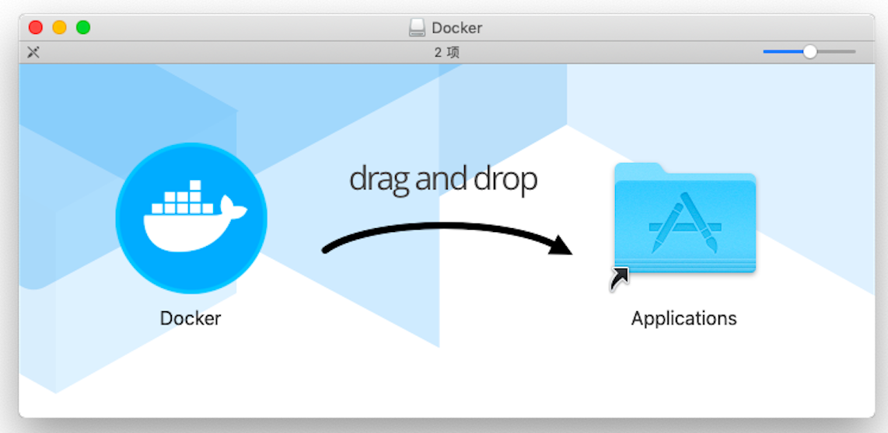
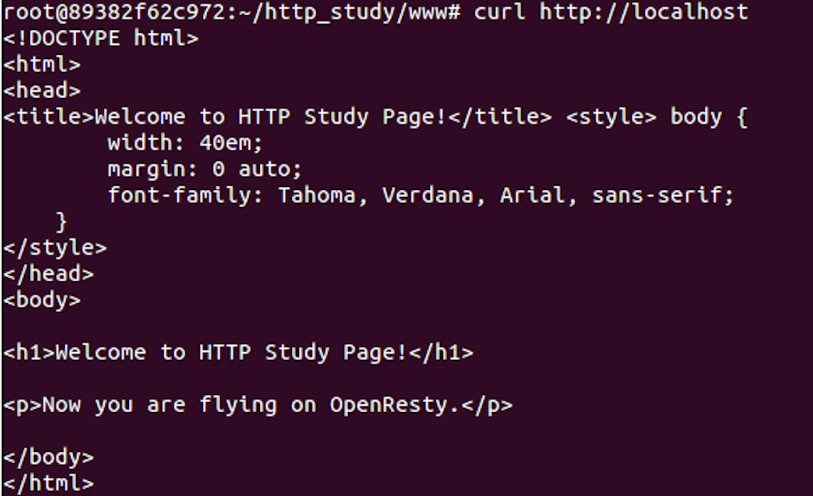
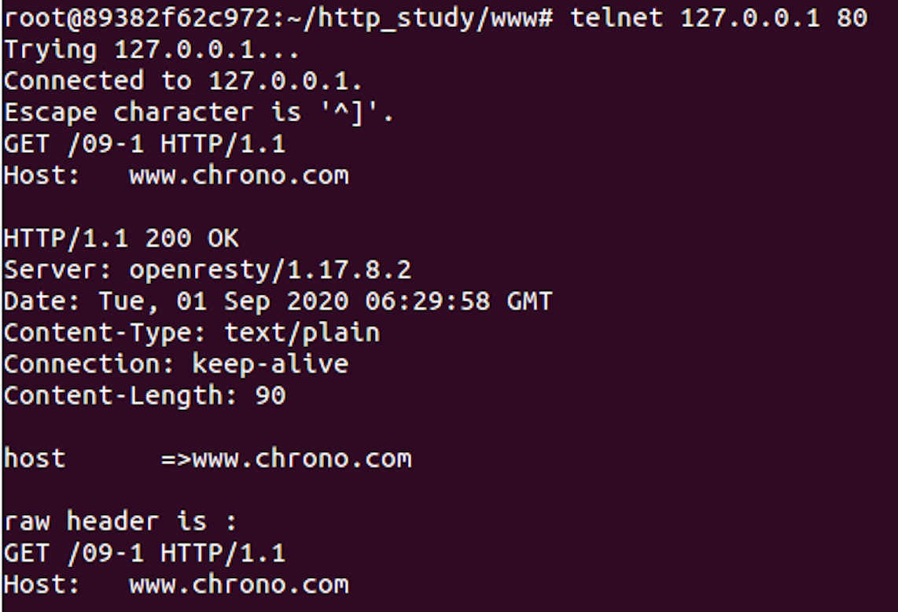
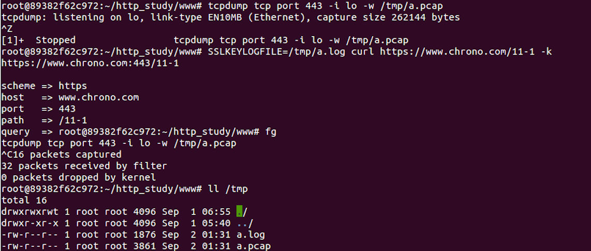
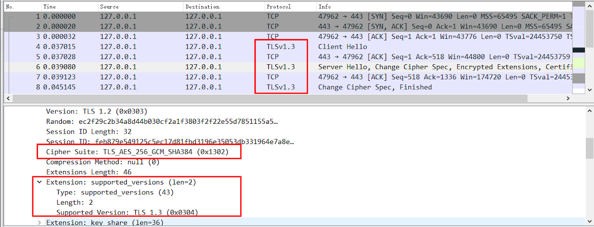
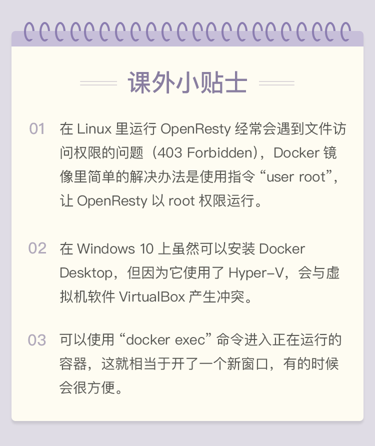

---
date: "2019-06-23"
---  
      
# 43 | 如何进行Docker实验环境搭建？
你好，我是Chrono。

《透视HTTP协议》这个专栏正式完结已经一年多了，感谢你的支持与鼓励。

这一年的时间下来，我发现专栏“实验环境的搭建”确实是一个比较严重的问题：虽然我已经尽量把Windows、macOS、Linux里的搭建步骤写清楚了，但因为具体的系统环境千差万别，总会有各式各样奇怪的问题出现，比如端口冲突、目录权限等等。

所以，为了彻底解决这个麻烦，我特意制作了一个Docker镜像，里面是完整可用的HTTP实验环境，下面我就来详细说一下该怎么用。

## 安装Docker环境

因为我不知道你对Docker是否了解，所以第一步我还是先来简单介绍一下它。

Docker是一种虚拟化技术，基于Linux的容器机制（Linux Containers，简称LXC），你可以把它近似地理解成是一个“轻量级的虚拟机”，只消耗较少的资源就能实现对进程的隔离保护。

使用Docker可以把应用程序和它相关的各种依赖（如底层库、组件等）“打包”在一起，这就是Docker镜像（Docker image）。Docker镜像可以让应用程序不再顾虑环境的差异，在任意的系统中以容器的形式运行（当然必须要基于Docker环境），极大地增强了应用部署的灵活性和适应性。

<!-- [[[read_end]]] -->

Docker是跨平台的，支持Windows、macOS、Linux等操作系统，在Windows、macOS上只要下载一个安装包，然后简单点几下鼠标就可以完成安装。



下面我以Ubuntu为例，说一下在Linux上的安装方法。

你可以在Linux上用apt-get或者yum安装Docker，不过更好的方式是使用Docker官方提供的脚本，自动完成全套的安装步骤。

```
    curl -fsSL https://get.docker.com | bash -s docker --mirror Aliyun
    

```

因为Docker是国外网站，直接从官网安装速度可能比较慢。所以你还可以选择国内的镜像网站来加快速度，像这里我就使用“–mirror”选项指定了“某某云”。

Docker是C/S架构，安装之后还需要再执行一条命令启动它的服务。

```
    sudo service docker start    #Ubuntu启动docker服务
    

```

此外，操作Docker必须要有sudo权限，你可以用“usermod”命令把当前的用户加入“Docker”组里。如果图省事，也可以用sudo命令直接切换成root用户来操作。

```
    sudo usermod -aG docker ${USER}  #当前用户加入Docker组
    sudo su -                        #或者直接用root用户
    

```

这些做完后，你需要执行命令“**docker version**”“**docker info**”来检查是否安装成功。比如下面这张图，显示的就是我使用的Docker环境，版本是“18.06.3-ce”。


## 获取Docker镜像

如果你已经安装好了Docker运行环境，现在就可以从Docker Hub上获取课程相应的Docker镜像文件了，用的是“**docker pull**”命令。

```
    docker pull chronolaw/http_study
    

```

这个镜像里打包了操作系统Ubuntu 18.04和最新的Openresty 1.17.8.2，还有项目的全部示例代码。为了方便你学习，我还在里面加入了Vim、Git、Telnet、Curl、Tcpdump等实用工具。

由于镜像里的东西多，所以体积比较大，下载需要一些时间，你要有点耐心。镜像下载完成之后，你可以用“Docker images”来查看结果，列出目前本地的所有镜像文件。


从图中你可以看到，这个镜像的名字是“chronolaw/http\_study”，大小是645MB。

## 启动Docker容器

有了镜像文件，你就可以用“**docker run**”命令，从镜像启动一个容器了。

这里面就是我们完整的HTTP实验环境，不需要再操心这样、那样的问题了，做到了真正的“开箱即用”。

```
    docker run -it --rm chronolaw/http_study
    

```

对于上面这条命令，我还要稍微解释一下：“-it”参数表示开启一个交互式的Shell，默认使用的是bash；“–rm”参数表示容器是“用完即扔”，不保存容器实例，一旦退出Shell就会自动删除容器（但不会删除镜像），免去了管理容器的麻烦。

“docker run”之后，你就会像虚拟机一样进入容器的运行环境，这里就是Ubuntu 18.04，身份也自动变成了root用户，大概是下面这样的。

```
    docker run -it --rm chronolaw/http_study
    
    root@8932f62c972:/#
    

```

项目的源码我放在了root用户目录下，你可以直接进入“**http\_study/www**”目录，然后执行“**run.sh**”启动OpenResty服务（可参考[第41讲](https://time.geekbang.org/column/article/146833)）。

```
    cd ~/http_study/www
    ./run.sh start
    

```

不过因为Docker自身的限制，镜像里的hosts文件不能直接添加“[www.chrono.com](http://www.chrono.com)”等实验域名的解析。如果你想要在URI里使用域名，就必须在容器启动后手动修改hosts文件，用Vim或者cat都可以。

```
    vim /etc/hosts                        #手动编辑hosts文件
    cat ~/http_study/hosts >> /etc/hosts  #cat追加到hosts末尾
    

```

另一种方式是在“docker run”的时候用“**–add-host**”参数，手动指定域名/IP的映射关系。

```
    docker run -it --rm --add-host=www.chrono.com:127.0.0.1 chronolaw/http_study 
    

```

保险起见，我建议你还是用第一种方式比较好。也就是启动容器后，用“cat”命令，把实验域名的解析追加到hosts文件里，然后再启动OpenResty服务。

```
    docker run -it --rm chronolaw/http_study
    
    cat ~/http_study/hosts >> /etc/hosts
    cd ~/http_study/www
    ./run.sh start
    

```

## 在Docker容器里做实验

把上面的工作都做完之后，我们的实验环境就算是完美地运行起来了，现在你就可以在里面任意验证各节课里的示例了，我来举几个例子。

不过在开始之前，我要提醒你一点，因为这个Docker镜像是基于Linux的，没有图形界面，所以只能用命令行（比如telnet、curl）来访问HTTP服务。当然你也可以查一下资料，让容器对外暴露80等端口（比如使用参数“–net=host”），在外部用浏览器来访问，这里我就不细说了。

先来看最简单的，[第7讲](https://time.geekbang.org/column/article/100124)里的测试实验环境，用curl来访问localhost，会输出一个文本形式的HTML文件内容。

```
    curl http://localhost      #访问本机的HTTP服务
    

```



然后我们来看[第9讲](https://time.geekbang.org/column/article/100513)，用telnet来访问HTTP服务，输入“**telnet 127.0.0.1 80**”，回车，就进入了telnet界面。

Linux下的telnet操作要比Windows的容易一些，你可以直接把HTTP请求报文复制粘贴进去，再按两下回车就行了，结束telnet可以用“Ctrl+C”。

```
    GET /09-1 HTTP/1.1
    Host:   www.chrono.com
    

```



实验环境里测试HTTPS和HTTP/2也是毫无问题的，只要你按之前说的，正确修改了hosts域名解析，就可以用curl来访问，但要加上“**\-k**”参数来忽略证书验证。

```
    curl https://www.chrono.com/23-1 -vk
    curl https://www.metroid.net:8443/30-1 -vk
    

```


这里要注意一点，因为Docker镜像里的Openresty 1.17.8.2内置了OpenSSL1.1.1g，默认使用的是TLS1.3，所以如果你想要测试TLS1.2的话，需要使用参数“**–tlsv1.2**”。

```
    curl https://www.chrono.com/30-1 -k --tlsv1.2
    

```


## 在Docker容器里抓包

到这里，课程中的大部分示例都可以运行了。最后我再示范一下在Docker容器里tcpdump抓包的用法。

首先，你要指定抓取的协议、地址和端口号，再用“-w”指定存储位置，启动tcpdump后按“Ctrl+Z”让它在后台运行。比如为了测试TLS1.3，就可以用下面的命令行，抓取HTTPS的443端口，存放到“/tmp”目录。

```
    tcpdump tcp port 443 -i lo -w /tmp/a.pcap
    

```

然后，我们执行任意的telnet或者curl命令，完成HTTP请求之后，输入“fg”恢复tcpdump，再按“Ctrl+C”，这样抓包就结束了。

对于HTTPS需要导出密钥的情形，你必须在curl请求的同时指定环境变量“SSLKEYLOGFILE”，不然抓包获取的数据无法解密，你就只能看到乱码了。

```
    SSLKEYLOGFILE=/tmp/a.log curl https://www.chrono.com/11-1 -k
    

```

我把完整的抓包过程截了个图，你可以参考一下。



抓包生成的文件在容器关闭后就会消失，所以还要用“**docker cp**”命令及时从容器里拷出来（指定容器的ID，看提示符，或者用“docker ps \-a”查看，也可以从GitHub仓库里获取43-1.pcap/43-1.log）。

```
    docker cp xxx:/tmp/a.pcap .  #需要指定容器的ID
    docker cp xxx:/tmp/a.log .   #需要指定容器的ID
    

```

现在有了pcap文件和log文件，我们就可以用Wireshark来看网络数据，细致地分析HTTP/HTTPS通信过程了（HTTPS还需要设置一下Wireshark，见[第26讲](https://time.geekbang.org/column/article/110354)）。



在这个包里，你可以清楚地看到，通信时使用的是TLS1.3协议，服务器选择的密码套件是TLS\_AES\_256\_GCM\_SHA384。

掌握了tcpdump的用法之后，你也可以再参考[第27讲](https://time.geekbang.org/column/article/110718)，改改Nginx配置文件，自己抓包仔细研究TLS1.3协议的“supported\_versions”“key\_share”“server\_name”等各个扩展协议。

## 小结

今天讲了Docker实验环境的搭建，我再小结一下要点。

1.  Docker是一种非常流行的虚拟化技术，可以近似地把它理解成是一个“轻量级的虚拟机”；
2.  可以用“docker pull”命令从Docker Hub上获取课程相应的Docker镜像文件；
3.  可以用“docker run”命令从镜像启动一个容器，里面是完整的HTTP实验环境，支持TLS1.3；
4.  可以在Docker容器里任意验证各节课里的示例，但需要使用命令行形式的telnet或者curl；
5.  抓包需要使用tcpdump，指定抓取的协议、地址和端口号；
6.  对于HTTPS，需要指定环境变量“SSLKEYLOGFILE”导出密钥，再发送curl请求。

很高兴时隔一年后再次与你见面，今天就到这里吧，期待下次HTTP/3发布时的相会。

