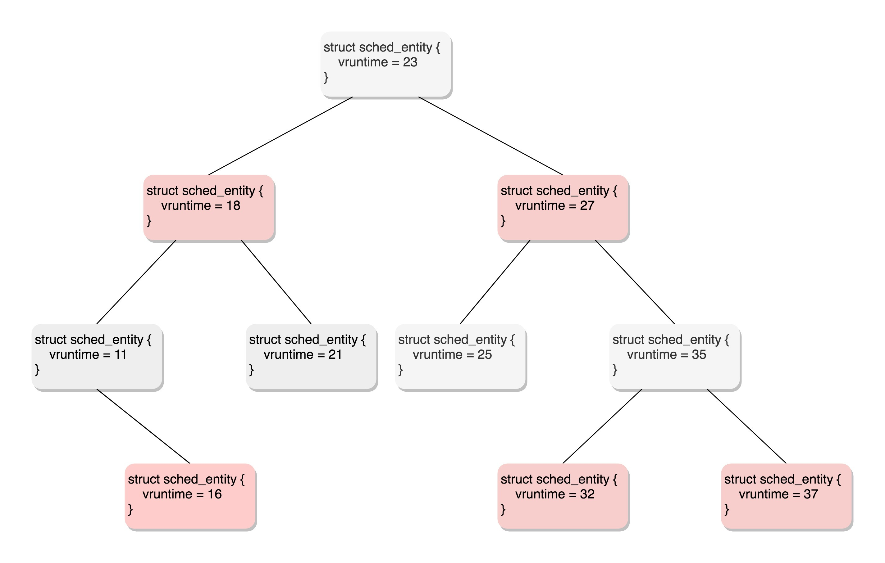

---
date: "2019-06-23"
---  
      
# 15 | 调度（上）：如何制定项目管理流程？
前几节，我们介绍了task\_struct数据结构。它就像项目管理系统一样，可以帮项目经理维护项目运行过程中的各类信息，但这并不意味着项目管理工作就完事大吉了。task\_struct仅仅能够解决“**看到**”的问题，咱们还要解决如何制定流程，进行项目调度的问题，也就是“**做到**”的问题。

公司的人员总是有限的。无论接了多少项目，公司不可能短时间增加很多人手。有的项目比较紧急，应该先进行排期；有的项目可以缓缓，但是也不能让客户等太久。所以这个过程非常复杂，需要平衡。

对于操作系统来讲，它面对的CPU的数量是有限的，干活儿都是它们，但是进程数目远远超过CPU的数目，因而就需要进行进程的调度，有效地分配CPU的时间，既要保证进程的最快响应，也要保证进程之间的公平。这也是一个非常复杂的、需要平衡的事情。

## 调度策略与调度类

在Linux里面，进程大概可以分成两种。

一种称为**实时进程**，也就是需要尽快执行返回结果的那种。这就好比我们是一家公司，接到的客户项目需求就会有很多种。有些客户的项目需求比较急，比如一定要在一两个月内完成的这种，客户会加急加钱，那这种客户的优先级就会比较高。

另一种是**普通进程**，大部分的进程其实都是这种。这就好比，大部分客户的项目都是普通的需求，可以按照正常流程完成，优先级就没实时进程这么高，但是人家肯定也有确定的交付日期。

<!-- [[[read_end]]] -->

那很显然，对于这两种进程，我们的调度策略肯定是不同的。

在task\_struct中，有一个成员变量，我们叫**调度策略**。

```
    unsigned int policy;
    

```

它有以下几个定义：

```
    #define SCHED_NORMAL		0
    #define SCHED_FIFO		1
    #define SCHED_RR		2
    #define SCHED_BATCH		3
    #define SCHED_IDLE		5
    #define SCHED_DEADLINE		6
    

```

配合调度策略的，还有我们刚才说的**优先级**，也在task\_struct中。

```
    int prio, static_prio, normal_prio;
    unsigned int rt_priority;
    

```

优先级其实就是一个数值，对于实时进程，优先级的范围是0～99；对于普通进程，优先级的范围是100～139。数值越小，优先级越高。从这里可以看出，所有的实时进程都比普通进程优先级要高。毕竟，谁让人家加钱了呢。

### 实时调度策略

对于调度策略，其中SCHED\_FIFO、SCHED\_RR、SCHED\_DEADLINE是实时进程的调度策略。

虽然大家都是加钱加急的项目，但是也不能乱来，还是需要有个办事流程才行。

例如，**SCHED\_FIFO**就是交了相同钱的，先来先服务，但是有的加钱多，可以分配更高的优先级，也就是说，高优先级的进程可以抢占低优先级的进程，而相同优先级的进程，我们遵循先来先得。

另外一种策略是，交了相同钱的，轮换着来，这就是**SCHED\_RR轮流调度算法**，采用时间片，相同优先级的任务当用完时间片会被放到队列尾部，以保证公平性，而高优先级的任务也是可以抢占低优先级的任务。

还有一种新的策略是**SCHED\_DEADLINE**，是按照任务的deadline进行调度的。当产生一个调度点的时候，DL调度器总是选择其deadline距离当前时间点最近的那个任务，并调度它执行。

### 普通调度策略

对于普通进程的调度策略有，SCHED\_NORMAL、SCHED\_BATCH、SCHED\_IDLE。

既然大家的项目都没有那么紧急，就应该按照普通的项目流程，公平地分配人员。

SCHED\_NORMAL是普通的进程，就相当于咱们公司接的普通项目。

SCHED\_BATCH是后台进程，几乎不需要和前端进行交互。这有点像公司在接项目同时，开发一些可以复用的模块，作为公司的技术积累，从而使得在之后接新项目的时候，能够减少工作量。这类项目可以默默执行，不要影响需要交互的进程，可以降低它的优先级。

SCHED\_IDLE是特别空闲的时候才跑的进程，相当于咱们学习训练类的项目，比如咱们公司很长时间没有接到外在项目了，可以弄几个这样的项目练练手。

上面无论是policy还是priority，都设置了一个变量，变量仅仅表示了应该这样这样干，但事情总要有人去干，谁呢？在task\_struct里面，还有这样的成员变量：

```
    const struct sched_class *sched_class;
    

```

调度策略的执行逻辑，就封装在这里面，它是真正干活的那个。

sched\_class有几种实现：

* stop\_sched\_class优先级最高的任务会使用这种策略，会中断所有其他线程，且不会被其他任务打断；

* dl\_sched\_class就对应上面的deadline调度策略；

* rt\_sched\_class就对应RR算法或者FIFO算法的调度策略，具体调度策略由进程的task\_struct->policy指定；

* fair\_sched\_class就是普通进程的调度策略；

* idle\_sched\_class就是空闲进程的调度策略。

这里实时进程的调度策略RR和FIFO相对简单一些，而且由于咱们平时常遇到的都是普通进程，在这里，咱们就重点分析普通进程的调度问题。普通进程使用的调度策略是fair\_sched\_class，顾名思义，对于普通进程来讲，公平是最重要的。

## 完全公平调度算法

在Linux里面，实现了一个基于CFS的调度算法。CFS全称Completely Fair Scheduling，叫完全公平调度。听起来很“公平”。那这个算法的原理是什么呢？我们来看看。

首先，你需要记录下进程的运行时间。CPU会提供一个时钟，过一段时间就触发一个时钟中断。就像咱们的表滴答一下，这个我们叫Tick。CFS会为每一个进程安排一个虚拟运行时间vruntime。如果一个进程在运行，随着时间的增长，也就是一个个tick的到来，进程的vruntime将不断增大。没有得到执行的进程vruntime不变。

显然，那些vruntime少的，原来受到了不公平的对待，需要给它补上，所以会优先运行这样的进程。

这有点像让你把一筐球平均分到N个口袋里面，你看着哪个少，就多放一些；哪个多了，就先不放。这样经过多轮，虽然不能保证球完全一样多，但是也差不多公平。

你可能会说，不还有优先级呢？如何给优先级高的进程多分时间呢？

这个简单，就相当于N个口袋，优先级高的袋子大，优先级低的袋子小。这样球就不能按照个数分配了，要按照比例来，大口袋的放了一半和小口袋放了一半，里面的球数目虽然差很多，也认为是公平的。

在更新进程运行的统计量的时候，我们其实就可以看出这个逻辑。

```
    /*
     * Update the current task's runtime statistics.
     */
    static void update_curr(struct cfs_rq *cfs_rq)
    {
    	struct sched_entity *curr = cfs_rq->curr;
    	u64 now = rq_clock_task(rq_of(cfs_rq));
    	u64 delta_exec;
    ......
    	delta_exec = now - curr->exec_start;
    ......
    	curr->exec_start = now;
    ......
    	curr->sum_exec_runtime += delta_exec;
    ......
    	curr->vruntime += calc_delta_fair(delta_exec, curr);
    	update_min_vruntime(cfs_rq);
    ......
    }
    
    
    /*
     * delta /= w
     */
    static inline u64 calc_delta_fair(u64 delta, struct sched_entity *se)
    {
    	if (unlikely(se->load.weight != NICE_0_LOAD))
            /* delta_exec * weight / lw.weight */
    		delta = __calc_delta(delta, NICE_0_LOAD, &se->load);
    	return delta;
    }
    

```

在这里得到当前的时间，以及这次的时间片开始的时间，两者相减就是这次运行的时间delta\_exec ，但是得到的这个时间其实是实际运行的时间，需要做一定的转化才作为虚拟运行时间vruntime。转化方法如下：

虚拟运行时间vruntime += 实际运行时间delta\_exec \* NICE\_0\_LOAD/权重

这就是说，同样的实际运行时间，给高权重的算少了，低权重的算多了，但是当选取下一个运行进程的时候，还是按照最小的vruntime来的，这样高权重的获得的实际运行时间自然就多了。这就相当于给一个体重\(权重\)200斤的胖子吃两个馒头，和给一个体重100斤的瘦子吃一个馒头，然后说，你们两个吃的是一样多。这样虽然总体胖子比瘦子多吃了一倍，但是还是公平的。

## 调度队列与调度实体

看来CFS需要一个数据结构来对vruntime进行排序，找出最小的那个。这个能够排序的数据结构不但需要查询的时候，能够快速找到最小的，更新的时候也需要能够快速地调整排序，要知道vruntime可是经常在变的，变了再插入这个数据结构，就需要重新排序。

能够平衡查询和更新速度的是树，在这里使用的是红黑树。

红黑树的的节点是应该包括vruntime的，称为调度实体。

在task\_struct中有这样的成员变量：

struct sched\_entity se;  
struct sched\_rt\_entity rt;  
struct sched\_dl\_entity dl;

这里有实时调度实体sched\_rt\_entity，Deadline调度实体sched\_dl\_entity，以及完全公平算法调度实体sched\_entity。

看来不光CFS调度策略需要有这样一个数据结构进行排序，其他的调度策略也同样有自己的数据结构进行排序，因为任何一个策略做调度的时候，都是要区分谁先运行谁后运行。

而进程根据自己是实时的，还是普通的类型，通过这个成员变量，将自己挂在某一个数据结构里面，和其他的进程排序，等待被调度。如果这个进程是个普通进程，则通过sched\_entity，将自己挂在这棵红黑树上。

对于普通进程的调度实体定义如下，这里面包含了vruntime和权重load\_weight，以及对于运行时间的统计。

```
    struct sched_entity {
    	struct load_weight		load;
    	struct rb_node			run_node;
    	struct list_head		group_node;
    	unsigned int			on_rq;
    	u64				exec_start;
    	u64				sum_exec_runtime;
    	u64				vruntime;
    	u64				prev_sum_exec_runtime;
    	u64				nr_migrations;
    	struct sched_statistics		statistics;
    ......
    };
    

```

下图是一个红黑树的例子。



所有可运行的进程通过不断地插入操作最终都存储在以时间为顺序的红黑树中，vruntime最小的在树的左侧，vruntime最多的在树的右侧。 CFS调度策略会选择红黑树最左边的叶子节点作为下一个将获得CPU的任务。

这棵红黑树放在哪里呢？就像每个软件工程师写代码的时候，会将任务排成队列，做完一个做下一个。

CPU也是这样的，每个CPU都有自己的 struct rq 结构，其用于描述在此CPU上所运行的所有进程，其包括一个实时进程队列rt\_rq和一个CFS运行队列cfs\_rq，在调度时，调度器首先会先去实时进程队列找是否有实时进程需要运行，如果没有才会去CFS运行队列找是否有进程需要运行。

```
    struct rq {
    	/* runqueue lock: */
    	raw_spinlock_t lock;
    	unsigned int nr_running;
    	unsigned long cpu_load[CPU_LOAD_IDX_MAX];
    ......
    	struct load_weight load;
    	unsigned long nr_load_updates;
    	u64 nr_switches;
    
    
    	struct cfs_rq cfs;
    	struct rt_rq rt;
    	struct dl_rq dl;
    ......
    	struct task_struct *curr, *idle, *stop;
    ......
    };
    

```

对于普通进程公平队列cfs\_rq，定义如下：

```
    /* CFS-related fields in a runqueue */
    struct cfs_rq {
    	struct load_weight load;
    	unsigned int nr_running, h_nr_running;
    
    
    	u64 exec_clock;
    	u64 min_vruntime;
    #ifndef CONFIG_64BIT
    	u64 min_vruntime_copy;
    #endif
    	struct rb_root tasks_timeline;
    	struct rb_node *rb_leftmost;
    
    
    	struct sched_entity *curr, *next, *last, *skip;
    ......
    };
    

```

这里面rb\_root指向的就是红黑树的根节点，这个红黑树在CPU看起来就是一个队列，不断地取下一个应该运行的进程。rb\_leftmost指向的是最左面的节点。

到这里终于凑够数据结构了，上面这些数据结构的关系如下图：


## 调度类是如何工作的？

凑够了数据结构，接下来我们来看调度类是如何工作的。

调度类的定义如下：

```
    struct sched_class {
    	const struct sched_class *next;
    
    
    	void (*enqueue_task) (struct rq *rq, struct task_struct *p, int flags);
    	void (*dequeue_task) (struct rq *rq, struct task_struct *p, int flags);
    	void (*yield_task) (struct rq *rq);
    	bool (*yield_to_task) (struct rq *rq, struct task_struct *p, bool preempt);
    
    
    	void (*check_preempt_curr) (struct rq *rq, struct task_struct *p, int flags);
    
    
    	struct task_struct * (*pick_next_task) (struct rq *rq,
    						struct task_struct *prev,
    						struct rq_flags *rf);
    	void (*put_prev_task) (struct rq *rq, struct task_struct *p);
    
    
    	void (*set_curr_task) (struct rq *rq);
    	void (*task_tick) (struct rq *rq, struct task_struct *p, int queued);
    	void (*task_fork) (struct task_struct *p);
    	void (*task_dead) (struct task_struct *p);
    
    
    	void (*switched_from) (struct rq *this_rq, struct task_struct *task);
    	void (*switched_to) (struct rq *this_rq, struct task_struct *task);
    	void (*prio_changed) (struct rq *this_rq, struct task_struct *task, int oldprio);
    	unsigned int (*get_rr_interval) (struct rq *rq,
    					 struct task_struct *task);
    	void (*update_curr) (struct rq *rq)
    

```

这个结构定义了很多种方法，用于在队列上操作任务。这里请大家注意第一个成员变量，是一个指针，指向下一个调度类。

上面我们讲了，调度类分为下面这几种：

```
    extern const struct sched_class stop_sched_class;
    extern const struct sched_class dl_sched_class;
    extern const struct sched_class rt_sched_class;
    extern const struct sched_class fair_sched_class;
    extern const struct sched_class idle_sched_class;
    

```

它们其实是放在一个链表上的。这里我们以调度最常见的操作，**取下一个任务**为例，来解析一下。可以看到，这里面有一个for\_each\_class循环，沿着上面的顺序，依次调用每个调度类的方法。

```
    /*
     * Pick up the highest-prio task:
     */
    static inline struct task_struct *
    pick_next_task(struct rq *rq, struct task_struct *prev, struct rq_flags *rf)
    {
    	const struct sched_class *class;
    	struct task_struct *p;
    ......
    	for_each_class(class) {
    		p = class->pick_next_task(rq, prev, rf);
    		if (p) {
    			if (unlikely(p == RETRY_TASK))
    				goto again;
    			return p;
    		}
    	}
    }
    

```

这就说明，调度的时候是从优先级最高的调度类到优先级低的调度类，依次执行。而对于每种调度类，有自己的实现，例如，CFS就有fair\_sched\_class。

```
    const struct sched_class fair_sched_class = {
    	.next			= &idle_sched_class,
    	.enqueue_task		= enqueue_task_fair,
    	.dequeue_task		= dequeue_task_fair,
    	.yield_task		= yield_task_fair,
    	.yield_to_task		= yield_to_task_fair,
    	.check_preempt_curr	= check_preempt_wakeup,
    	.pick_next_task		= pick_next_task_fair,
    	.put_prev_task		= put_prev_task_fair,
    	.set_curr_task          = set_curr_task_fair,
    	.task_tick		= task_tick_fair,
    	.task_fork		= task_fork_fair,
    	.prio_changed		= prio_changed_fair,
    	.switched_from		= switched_from_fair,
    	.switched_to		= switched_to_fair,
    	.get_rr_interval	= get_rr_interval_fair,
    	.update_curr		= update_curr_fair,
    };
    

```

对于同样的pick\_next\_task选取下一个要运行的任务这个动作，不同的调度类有自己的实现。fair\_sched\_class的实现是pick\_next\_task\_fair，rt\_sched\_class的实现是pick\_next\_task\_rt。

我们会发现这两个函数是操作不同的队列，pick\_next\_task\_rt操作的是rt\_rq，pick\_next\_task\_fair操作的是cfs\_rq。

```
    static struct task_struct *
    pick_next_task_rt(struct rq *rq, struct task_struct *prev, struct rq_flags *rf)
    {
    	struct task_struct *p;
    	struct rt_rq *rt_rq = &rq->rt;
    ......
    }
    
    
    static struct task_struct *
    pick_next_task_fair(struct rq *rq, struct task_struct *prev, struct rq_flags *rf)
    {
    	struct cfs_rq *cfs_rq = &rq->cfs;
    	struct sched_entity *se;
    	struct task_struct *p;
    ......
    }
    

```

这样整个运行的场景就串起来了，在每个CPU上都有一个队列rq，这个队列里面包含多个子队列，例如rt\_rq和cfs\_rq，不同的队列有不同的实现方式，cfs\_rq就是用红黑树实现的。

当有一天，某个CPU需要找下一个任务执行的时候，会按照优先级依次调用调度类，不同的调度类操作不同的队列。当然rt\_sched\_class先被调用，它会在rt\_rq上找下一个任务，只有找不到的时候，才轮到fair\_sched\_class被调用，它会在cfs\_rq上找下一个任务。这样保证了实时任务的优先级永远大于普通任务。

下面我们仔细看一下sched\_class定义的与调度有关的函数。

* enqueue\_task向就绪队列中添加一个进程，当某个进程进入可运行状态时，调用这个函数；

* dequeue\_task 将一个进程从就绪队列中删除；

* pick\_next\_task 选择接下来要运行的进程；

* put\_prev\_task 用另一个进程代替当前运行的进程；

* set\_curr\_task 用于修改调度策略；

* task\_tick 每次周期性时钟到的时候，这个函数被调用，可能触发调度。

在这里面，我们重点看fair\_sched\_class对于pick\_next\_task的实现pick\_next\_task\_fair，获取下一个进程。调用路径如下：pick\_next\_task\_fair->pick\_next\_entity->\_\_pick\_first\_entity。

```
    struct sched_entity *__pick_first_entity(struct cfs_rq *cfs_rq)
    {
    	struct rb_node *left = rb_first_cached(&cfs_rq->tasks_timeline);
    
    
    	if (!left)
    		return NULL;
    
    
    	return rb_entry(left, struct sched_entity, run_node);
    

```

从这个函数的实现可以看出，就是从红黑树里面取最左面的节点。

## 总结时刻

好了，这一节我们讲了调度相关的数据结构，还是比较复杂的。一个CPU上有一个队列，CFS的队列是一棵红黑树，树的每一个节点都是一个sched\_entity，每个sched\_entity都属于一个task\_struct，task\_struct里面有指针指向这个进程属于哪个调度类。


在调度的时候，依次调用调度类的函数，从CPU的队列中取出下一个进程。上面图中的调度器、上下文切换这一节我们没有讲，下一节我们讲讲基于这些数据结构，如何实现调度。

## 课堂练习

这里讲了进程调度的策略和算法，你知道如何通过API设置进程和线程的调度策略吗？你可以写个程序尝试一下。

欢迎留言和我分享你的疑惑和见解，也欢迎你收藏本节内容，反复研读。你也可以把今天的内容分享给你的朋友，和他一起学习、进步。

